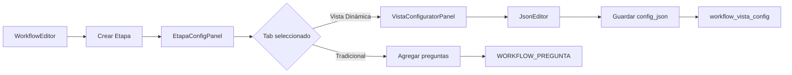
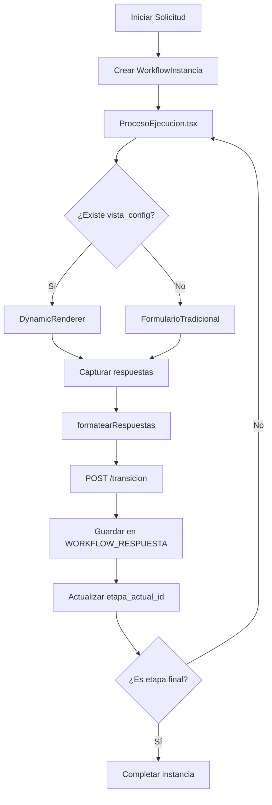

# 📋 Plan de Integración: Vistas Dinámicas en Workflows

**Fecha**: 14 de noviembre de 2025  
**Rama Base**: `implementar-vistas`  
**Rama Completada**: `feature/vistas-dinamicas-mvp`  

---

## 📊 Contexto Actual

### Sistema de Vistas Dinámicas (Completado)
✅ **Backend completo** (`feature/vistas-dinamicas-mvp`)
- Tabla `workflow_vista_config` con columna JSON flexible
- Endpoints REST: GET, POST, PUT para configuraciones
- Service layer con operaciones CRUD + `createOrUpdate`
- Validación de schemas con Pydantic

✅ **Frontend completo** (`feature/vistas-dinamicas-mvp`)
- 7 componentes: TextInput, NumberInput, DatePicker, SelectSimple, FileUpload, RadioGroup, CheckboxList
- DynamicRenderer: orquestador que renderiza formularios desde JSON
- JsonEditor: editor con validación y 4 templates predefinidos
- useDynamicView: hook personalizado para cargar configuraciones
- Demo funcional en `/demo-vistas-dinamicas`

### Sistema de Workflows (Actual)
📍 **Backend workflow existente**
- `WORKFLOW` - Define procesos
- `WORKFLOW_ETAPA` - Define pasos del proceso
- `WORKFLOW_PREGUNTA` - Define campos tradicionales con tipos fijos
  - 13 tipos: TEXTO, NUMERO, FECHA, LISTA, OPCIONES, CARGA_ARCHIVO, REVISION_OCR, etc.
  - Cada pregunta es un registro individual en BD
- `WORKFLOW_INSTANCIA` - Instancias en ejecución
- `WORKFLOW_RESPUESTA` - Almacena respuestas del usuario

📍 **Frontend workflow existente**
- `WorkflowEditor.tsx` - Editor visual con ReactFlow
- `EtapaConfigPanel.tsx` - Panel lateral para configurar etapas y preguntas
- Sistema de preguntas tradicional con tipos fijos
- **NO existe renderizador de formularios para ejecución**

### Problema Identificado
🔴 **Gap crítico**: El sistema actual permite **diseñar** workflows con preguntas, pero **NO existe frontend para ejecutarlos** (ciudadanos respondiendo formularios).

---

## 🎯 Objetivos de Integración

### 1. Generación de Vistas (Administrador)
**Integrar el sistema de Vistas Dinámicas en el diseño de workflows**

- Agregar botón "Vista Dinámica" en `EtapaConfigPanel`
- Permitir configurar layout visual de formularios
- Guardar configuración JSON en `workflow_vista_config.config_json`
- Mantener compatibilidad con sistema de preguntas tradicional

### 2. Ejecución de Vistas (Usuario Final)
**Crear sistema de renderizado para instancias de workflow**

- Nueva página: `ProcesoEjecucion.tsx`
- Cargar etapa actual de la instancia
- Renderizar formulario usando DynamicRenderer
- Guardar respuestas en `WORKFLOW_RESPUESTA`
- Transicionar a siguiente etapa

---

## 📐 Análisis de Arquitectura

### Dualidad: Preguntas vs Vistas Dinámicas

```
WORKFLOW_ETAPA (id: 123)
       │
       ├─── WORKFLOW_PREGUNTA (sistema tradicional)
       │    ├─ Pregunta 1: tipo=TEXTO, orden=1
       │    ├─ Pregunta 2: tipo=CARGA_ARCHIVO, orden=2
       │    └─ Pregunta 3: tipo=REVISION_OCR, orden=3
       │
       └─── WORKFLOW_VISTA_CONFIG (sistema dinámico)
            └─ config_json: {
                  "secciones": [
                    { "componentes": [...] }
                  ]
                }
```

**Estrategia propuesta**: Sistema híbrido con prioridad a Vistas Dinámicas
- Si existe `workflow_vista_config` → usar DynamicRenderer
- Si NO existe → renderizar preguntas tradicionales (legacy)
- Ambos sistemas guardan en `WORKFLOW_RESPUESTA`

### Mapeo de Tipos

| WorkflowPregunta (Legacy) | DynamicView (Nuevo) | Componente |
|---------------------------|---------------------|------------|
| `RESPUESTA_TEXTO` | `TEXTO` | TextInput |
| `RESPUESTA_LARGA` | `TEXTO` (multiline) | TextInput |
| `SELECCION_FECHA` | `FECHA` | DatePicker |
| `LISTA` / `OPCIONES` | `SELECT` | SelectSimple |
| `CARGA_ARCHIVO` | `ARCHIVO` | FileUpload |
| `OPCIONES` (Si/No) | `RADIO` | RadioGroup |
| `REVISION_MANUAL_DOCUMENTOS` | `CHECKBOX_LIST` | CheckboxList |
| `REVISION_OCR` | `CHECKBOX_LIST` | CheckboxList |
| `NUMERO` | `NUMERO` | NumberInput |

---

## 🔨 Plan de Implementación

### **FASE 1: Generación de Vistas (Diseño)**

#### Tarea 1.1: Agregar Tab "Vista Dinámica" en EtapaConfigPanel
**Archivo**: `frontend/src/components/Workflow/EtapaConfigPanel.tsx`

**Cambios**:
```tsx
// Agregar tab adicional
<Tabs value={tabIndex}>
  <Tab label="Configuración Básica" />
  <Tab label="Preguntas Tradicionales" />
  <Tab label="Vista Dinámica" />  {/* NUEVO */}
</Tabs>

// Panel de Vista Dinámica
<TabPanel value={tabIndex} index={2}>
  <VistaConfiguratorPanel 
    etapaId={etapa.id}
    onSave={handleSaveVistaConfig}
  />
</TabPanel>
```

**Resultado esperado**: 3 tabs en EtapaConfigPanel

#### Tarea 1.2: Crear VistaConfiguratorPanel
**Nuevo archivo**: `frontend/src/components/Workflow/VistaConfiguratorPanel.tsx`

**Funcionalidad**:
- Cargar configuración existente usando `useDynamicView(etapaId)`
- Mostrar JsonEditor con templates
- Botón "Vista Previa" que muestra DynamicRenderer
- Botón "Guardar" que llama a `vistaConfigService.createOrUpdate()`

**Props**:
```typescript
interface VistaConfiguratorPanelProps {
  etapaId: number;
  onSave?: () => void;
}
```

**Layout sugerido**:
```
┌─────────────────────────────────────────┐
│  Vista Dinámica del Formulario          │
├─────────────────────────────────────────┤
│                                          │
│  [ Template: SOLICITUD_BASICA  ▼ ]      │
│                                          │
│  ┌────────────────────────────────────┐ │
│  │ {                                  │ │
│  │   "secciones": [                   │ │
│  │     {                              │ │
│  │       "titulo": "Datos Básicos",  │ │
│  │       "componentes": [...]         │ │
│  │     }                              │ │
│  │   ]                                │ │
│  │ }                                  │ │
│  └────────────────────────────────────┘ │
│                                          │
│  [ Vista Previa ]  [ Guardar ]           │
│                                          │
└─────────────────────────────────────────┘
```

#### Tarea 1.3: Indicador Visual en WorkflowEditor
**Archivo**: `frontend/src/components/Workflow/CustomNode.tsx`

**Cambios**:
- Agregar badge "🎨 Vista Dinámica" si existe configuración
- Consultar `vistaConfigService.getByEtapaId()` al cargar nodo

```tsx
{etapa.tiene_vista_dinamica && (
  <Chip 
    label="Vista Dinámica" 
    size="small" 
    icon={<AutoAwesomeIcon />}
    color="primary"
  />
)}
```

#### Tarea 1.4: Endpoint de Verificación
**Archivo**: `backend/app/routes/vista_config.py`

**Nuevo endpoint**:
```python
@router.get("/vista-config/etapa/{etapa_id}/existe")
def verificar_vista_config(etapa_id: int, db: Session = Depends(get_db)):
    """Verifica si existe configuración de vista para una etapa"""
    config = VistaConfigService.get_by_etapa_id(db, etapa_id)
    return {"existe": config is not None, "config_id": config.id if config else None}
```

---

### **FASE 2: Conexiones y Ejecución**

#### Tarea 2.1: Crear ProcesoEjecucion Page
**Nuevo archivo**: `frontend/src/pages/ProcesoEjecucion.tsx`

**Ruta**: `/instancias/:instanciaId/ejecutar`

**Funcionalidad**:
```typescript
const ProcesoEjecucion: React.FC = () => {
  const { instanciaId } = useParams();
  const [instancia, setInstancia] = useState<WorkflowInstancia>();
  const [etapaActual, setEtapaActual] = useState<WorkflowEtapa>();
  const [vistaConfig, setVistaConfig] = useState<VistaConfigResponse>();
  
  useEffect(() => {
    // 1. Cargar instancia
    const loadInstancia = async () => {
      const inst = await workflowService.getInstancia(instanciaId);
      setInstancia(inst);
      
      // 2. Cargar etapa actual
      const etapa = await workflowService.getEtapa(inst.etapa_actual_id);
      setEtapaActual(etapa);
      
      // 3. Intentar cargar vista dinámica
      try {
        const vista = await vistaConfigService.getByEtapaId(etapa.id);
        setVistaConfig(vista);
      } catch {
        // No hay vista dinámica, usar preguntas tradicionales
      }
    };
  }, [instanciaId]);
  
  const handleSubmit = async (respuestas: RespuestaFormulario) => {
    // Guardar respuestas
    await workflowService.transicionar(instanciaId, {
      etapa_destino_id: siguienteEtapaId,
      respuestas: formatearRespuestas(respuestas)
    });
  };
  
  return (
    <Box>
      <Typography variant="h4">{etapaActual?.nombre}</Typography>
      
      {vistaConfig ? (
        <DynamicRenderer 
          config={vistaConfig.config_json}
          onSubmit={handleSubmit}
        />
      ) : (
        <FormularioTradicional 
          preguntas={etapaActual?.preguntas}
          onSubmit={handleSubmit}
        />
      )}
    </Box>
  );
};
```

**Layout visual**:
```
┌──────────────────────────────────────────────┐
│  📄 Solicitud de Residencia #EXP-2024-001   │
├──────────────────────────────────────────────┤
│                                              │
│  Etapa: Registro de Datos Personales        │
│  [●───────○─────○─────○] 2/5 etapas         │
│                                              │
│  ╔════════════════════════════════════════╗ │
│  ║  Datos Básicos                         ║ │
│  ╠════════════════════════════════════════╣ │
│  ║                                        ║ │
│  ║  Nombre completo: [____________]       ║ │
│  ║  Fecha de nacimiento: [__/__/__]      ║ │
│  ║  Nacionalidad: [Seleccionar ▼]        ║ │
│  ║                                        ║ │
│  ╚════════════════════════════════════════╝ │
│                                              │
│  ╔════════════════════════════════════════╗ │
│  ║  Documentos                            ║ │
│  ╠════════════════════════════════════════╣ │
│  ║                                        ║ │
│  ║  [ Subir Pasaporte ]                   ║ │
│  ║  [ Subir Foto ]                        ║ │
│  ║                                        ║ │
│  ╚════════════════════════════════════════╝ │
│                                              │
│        [Cancelar]  [Guardar y Continuar]    │
│                                              │
└──────────────────────────────────────────────┘
```

#### Tarea 2.2: Crear FormularioTradicional (Legacy)
**Nuevo archivo**: `frontend/src/components/Workflow/FormularioTradicional.tsx`

**Propósito**: Renderizar preguntas del sistema tradicional cuando NO existe vista dinámica

```typescript
interface FormularioTradicionalProps {
  preguntas: WorkflowPregunta[];
  onSubmit: (respuestas: RespuestaFormulario) => void;
}

// Renderizar según tipo_pregunta
const renderPregunta = (pregunta: WorkflowPregunta) => {
  switch (pregunta.tipo_pregunta) {
    case 'RESPUESTA_TEXTO':
      return <TextField label={pregunta.pregunta} />;
    case 'CARGA_ARCHIVO':
      return <FileUploadField label={pregunta.pregunta} />;
    case 'REVISION_OCR':
      return <RevisionOCRComponent pregunta={pregunta} />;
    // ... otros casos
  }
};
```

#### Tarea 2.3: Adaptador de Respuestas
**Nuevo archivo**: `frontend/src/utils/respuesta-adapter.ts`

**Propósito**: Convertir respuestas de DynamicRenderer a formato WorkflowRespuesta

```typescript
interface RespuestaFormulario {
  [componenteId: string]: any;
}

interface WorkflowRespuestaRequest {
  pregunta_id: number;
  valor_texto?: string;
  valor_json?: any;
  archivos?: any[];
}

export const formatearRespuestas = (
  respuestas: RespuestaFormulario,
  mapeoComponentes: Map<string, number> // componenteId -> pregunta_id
): WorkflowRespuestaRequest[] => {
  return Object.entries(respuestas).map(([compId, valor]) => ({
    pregunta_id: mapeoComponentes.get(compId)!,
    valor_texto: typeof valor === 'string' ? valor : undefined,
    valor_json: typeof valor === 'object' ? valor : undefined,
  }));
};
```

**Problema**: DynamicRenderer usa `componenteId` (ej: "nombre_completo") pero backend espera `pregunta_id` (número).

**Solución**: Vincular configuración JSON con preguntas existentes mediante `codigo`:
```json
{
  "componentes": [
    {
      "id": "nombre_completo",
      "tipo": "TEXTO",
      "codigo_pregunta": "NOMBRE"  // ← vincula con WORKFLOW_PREGUNTA.codigo
    }
  ]
}
```

#### Tarea 2.4: Extender DynamicRenderer con onSubmit
**Archivo**: `frontend/src/components/DynamicView/DynamicRenderer.tsx`

**Cambios**:
```tsx
interface DynamicRendererProps {
  config: VistaConfig;
  initialValues?: Record<string, any>;
  onSubmit?: (values: Record<string, any>) => void;  // NUEVO
  readOnly?: boolean;
}

// Al final del formulario
<Box sx={{ mt: 4, display: 'flex', gap: 2, justifyContent: 'flex-end' }}>
  <Button variant="outlined" onClick={onCancel}>
    Cancelar
  </Button>
  <Button 
    variant="contained" 
    onClick={() => onSubmit?.(formValues)}
    disabled={!isValid}
  >
    Guardar y Continuar
  </Button>
</Box>
```

#### Tarea 2.5: Servicios de Instancia (Frontend)
**Archivo**: `frontend/src/services/workflow.service.ts`

**Agregar métodos**:
```typescript
// Obtener instancia con detalles
async getInstancia(instanciaId: number): Promise<WorkflowInstancia> {
  return apiClient.get(`/workflow/instancias/${instanciaId}`);
}

// Transicionar a siguiente etapa
async transicionar(
  instanciaId: number, 
  data: TransicionRequest
): Promise<void> {
  return apiClient.post(
    `/workflow/instancias/${instanciaId}/transicion`, 
    data
  );
}

interface TransicionRequest {
  etapa_destino_id: number;
  respuestas: WorkflowRespuestaRequest[];
  comentario?: string;
}
```

#### Tarea 2.6: Ruta y Navegación
**Archivo**: `frontend/src/AppRouter.tsx`

```tsx
<Route 
  path="/instancias/:instanciaId/ejecutar" 
  element={<ProcesoEjecucion />} 
/>
```

**Flujo de usuario**:
1. Usuario inicia solicitud desde `/procesos/:procesoId/nueva-solicitud`
2. Backend crea `WorkflowInstancia` con `etapa_actual_id = etapa_inicial`
3. Redirige a `/instancias/{instanciaId}/ejecutar`
4. Usuario completa formulario (DynamicRenderer o Tradicional)
5. Al enviar → guarda respuestas → transiciona → recarga página con nueva etapa
6. Repite hasta etapa final

---

## 🗂️ Estructura de Archivos

### Nuevos Archivos a Crear
```
frontend/src/
├── components/
│   └── Workflow/
│       ├── VistaConfiguratorPanel.tsx      (Tarea 1.2)
│       └── FormularioTradicional.tsx        (Tarea 2.2)
├── pages/
│   └── ProcesoEjecucion.tsx                 (Tarea 2.1)
└── utils/
    └── respuesta-adapter.ts                 (Tarea 2.3)

backend/app/
└── routes/
    └── vista_config.py                      (Tarea 1.4 - modificar)
```

### Archivos a Modificar
```
frontend/src/
├── components/
│   ├── DynamicView/
│   │   └── DynamicRenderer.tsx              (Tarea 2.4)
│   └── Workflow/
│       ├── EtapaConfigPanel.tsx             (Tarea 1.1)
│       └── CustomNode.tsx                   (Tarea 1.3)
├── services/
│   └── workflow.service.ts                  (Tarea 2.5)
└── AppRouter.tsx                            (Tarea 2.6)
```

---

## 🔄 Flujo de Datos

### 1. Diseño de Workflow (Administrador)


### 2. Ejecución de Proceso (Usuario)


---

## ✅ Checklist de Implementación

### FASE 1: Generación de Vistas
- [ ] 1.1 Agregar Tab "Vista Dinámica" en EtapaConfigPanel
- [ ] 1.2 Crear VistaConfiguratorPanel con JsonEditor integrado
- [ ] 1.3 Agregar indicador visual en CustomNode
- [ ] 1.4 Crear endpoint de verificación de vista_config
- [ ] **Testing**: Crear workflow, agregar etapa, configurar vista dinámica, verificar guardado

### FASE 2: Ejecución
- [ ] 2.1 Crear página ProcesoEjecucion.tsx
- [ ] 2.2 Crear FormularioTradicional (fallback legacy)
- [ ] 2.3 Crear adaptador de respuestas
- [ ] 2.4 Extender DynamicRenderer con onSubmit y validación
- [ ] 2.5 Agregar métodos de instancia en workflow.service
- [ ] 2.6 Registrar ruta en AppRouter
- [ ] **Testing**: Iniciar instancia, completar formulario, transicionar etapas, verificar respuestas guardadas

### FASE 3: Refinamiento
- [ ] 3.1 Manejo de errores en transiciones
- [ ] 3.2 Loading states y skeletons
- [ ] 3.3 Validación de campos obligatorios antes de enviar
- [ ] 3.4 Progreso visual de etapas (stepper)
- [ ] 3.5 Botón "Guardar borrador" (sin transicionar)

---

## 🧪 Casos de Prueba

### Test 1: Workflow con Vista Dinámica
**Pasos**:
1. Crear workflow "Solicitud de Visa"
2. Agregar etapa "Datos Personales"
3. En tab "Vista Dinámica", cargar template SOLICITUD_BASICA
4. Guardar workflow
5. Iniciar instancia
6. Navegar a `/instancias/{id}/ejecutar`
7. Verificar que se renderiza DynamicRenderer
8. Completar formulario y enviar
9. Verificar respuestas en `WORKFLOW_RESPUESTA`

### Test 2: Workflow sin Vista Dinámica (Legacy)
**Pasos**:
1. Usar workflow existente con preguntas tradicionales
2. Iniciar instancia
3. Navegar a `/instancias/{id}/ejecutar`
4. Verificar que se renderiza FormularioTradicional
5. Verificar que tipos de pregunta se renderizan correctamente

### Test 3: Transición entre Etapas
**Pasos**:
1. Crear workflow con 3 etapas
2. Completar etapa 1 → verificar transición a etapa 2
3. Completar etapa 2 → verificar transición a etapa 3
4. Completar etapa 3 (final) → verificar estado `COMPLETADO`

---

## 📊 Dependencias y Compatibilidad

### Tipos de TypeScript
**Crear**: `frontend/src/types/instancia.ts`
```typescript
export interface WorkflowInstancia {
  id: number;
  workflow_id: number;
  num_expediente: string;
  estado: 'INICIADO' | 'EN_PROGRESO' | 'COMPLETADO' | 'CANCELADO';
  etapa_actual_id: number;
  creado_por_user_id: string;
  asignado_a_user_id?: string;
}

export interface RespuestaRequest {
  pregunta_id: number;
  valor_texto?: string;
  valor_json?: any;
  valor_fecha?: string;
  valor_booleano?: boolean;
  archivos?: FileReference[];
}

export interface TransicionRequest {
  etapa_destino_id: number;
  respuestas: RespuestaRequest[];
  comentario?: string;
}
```

### Backend: Validaciones Adicionales
**Archivo**: `backend/app/services/vista_config_service.py`

Agregar método:
```python
@staticmethod
def validar_coherencia_con_preguntas(
    db: Session, 
    etapa_id: int, 
    config_json: dict
) -> List[str]:
    """
    Valida que los códigos_pregunta en config_json 
    correspondan a preguntas existentes en WORKFLOW_PREGUNTA
    """
    errores = []
    codigos_config = extract_codigos_from_json(config_json)
    preguntas_bd = db.query(WorkflowPregunta).filter_by(etapa_id=etapa_id).all()
    codigos_bd = {p.codigo for p in preguntas_bd}
    
    for codigo in codigos_config:
        if codigo not in codigos_bd:
            errores.append(f"Código '{codigo}' no existe en preguntas de la etapa")
    
    return errores
```

---

## 🎨 Mejoras Futuras (Post-MVP)

### Corto Plazo
- [ ] Migrar preguntas existentes a vistas dinámicas automáticamente
- [ ] Editor WYSIWYG (arrastra y suelta componentes)
- [ ] Más componentes: TextArea, Toggle, Signature, Map Picker
- [ ] Lógica condicional (mostrar/ocultar según respuestas)

### Largo Plazo
- [ ] Versionado de configuraciones (historial de cambios)
- [ ] A/B testing de layouts
- [ ] Analytics de abandono por campo
- [ ] Autocompletado con datos previos del usuario

---

## 📞 Contacto y Dudas

**Responsable**: Equipo de Desarrollo  
**Rama actual**: `implementar-vistas`  
**Fecha inicio**: 14 de noviembre de 2025  

---

## 📝 Notas Adicionales

### Estrategia de Rollout
1. **Fase 1 (Diseño)**: Completar sin afectar workflows en producción
2. **Pruebas**: Crear workflows de prueba en ambiente desarrollo
3. **Fase 2 (Ejecución)**: Habilitar solo para workflows nuevos
4. **Migración gradual**: Workflows legacy mantienen sistema tradicional

### Compatibilidad hacia atrás
- Workflows sin vista_config → FormularioTradicional
- Workflows con vista_config → DynamicRenderer
- Ambos guardan en mismas tablas (`WORKFLOW_RESPUESTA`)
- Sin cambios en base de datos de workflows existentes

### Performance
- Caché de configuraciones frecuentes (Redis)
- Lazy loading de componentes pesados
- Validación asíncrona de campos

---

**Estado**: 📋 Documento de planificación  
**Siguiente paso**: Implementar Tarea 1.1 (Tab en EtapaConfigPanel)
