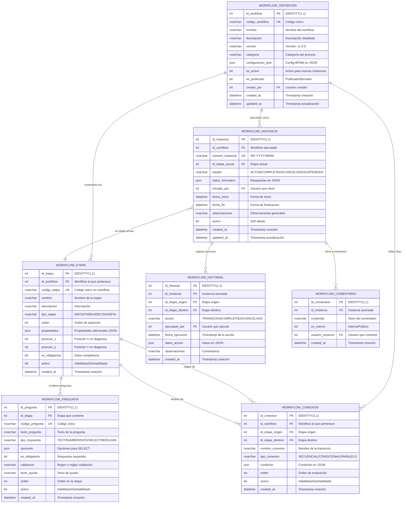
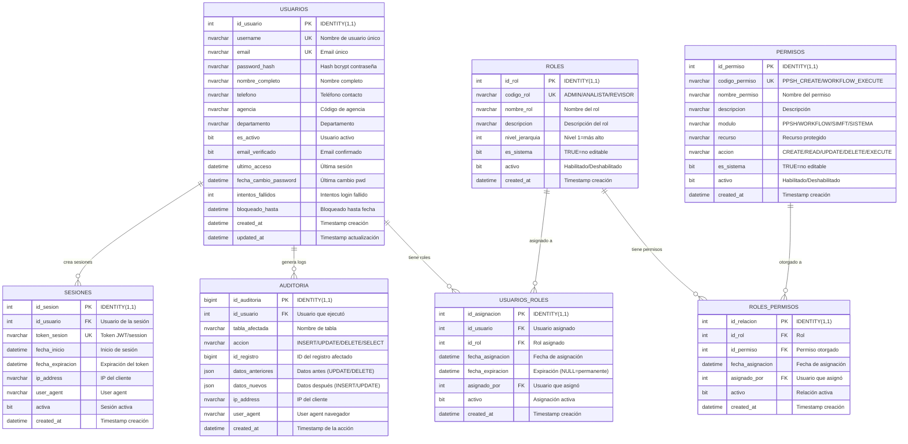

```mermaid
erDiagram
    %% ========================================
    %% MDULO PPSH (Permisos Humanitarios)
    %% ========================================
    PPSH_SOLICITUD ||--o{ PPSH_SOLICITANTE : "tiene"
    PPSH_SOLICITUD ||--o{ PPSH_DOCUMENTO : "requiere"
    PPSH_SOLICITUD ||--o{ PPSH_ENTREVISTA : "programa"
    PPSH_SOLICITUD ||--o{ PPSH_COMENTARIO : "registra"
    PPSH_SOLICITUD }o--|| PPSH_ESTADO : "tiene estado"
    PPSH_SOLICITUD }o--|| PPSH_CAUSA_HUMANITARIA : "por causa"
    
    %% ========================================
    %% MDULO SIM_FT (Sistema Integrado)
    %% ========================================
    SIM_FT_TRAMITES ||--o{ SIM_FT_DESARROLLO_TRAMITES : "desarrolla en"
    SIM_FT_TRAMITES }o--|| SIM_FT_TRAMITES_TIPOS : "es tipo"
    SIM_FT_TRAMITES }o--|| SIM_FT_ESTATUS : "tiene estado"
    SIM_FT_DESARROLLO_TRAMITES }o--|| SIM_FT_PASOS : "ejecuta paso"
    SIM_FT_TRAMITES }o--o| SIM_FT_CIERRES : "cierra con"
    
    %% ========================================
    %% MDULO WORKFLOWS
    %% ========================================
    WORKFLOW_DEFINICION ||--o{ WORKFLOW_ETAPA : "compuesto por"
    WORKFLOW_ETAPA ||--o{ WORKFLOW_PREGUNTA : "contiene"
    WORKFLOW_ETAPA ||--o{ WORKFLOW_CONEXION : "origen de"
    WORKFLOW_ETAPA ||--o{ WORKFLOW_CONEXION : "destino de"
    WORKFLOW_DEFINICION ||--o{ WORKFLOW_INSTANCIA : "instancia de"
    WORKFLOW_INSTANCIA ||--o{ WORKFLOW_COMENTARIO : "tiene"
    
    %% ========================================
    %% SEGURIDAD
    %% ========================================
    USUARIOS ||--o{ PPSH_SOLICITUD : "crea/gestiona"
    USUARIOS ||--o{ WORKFLOW_INSTANCIA : "ejecuta"
    USUARIOS }o--o{ ROLES : "asignado a"
    ROLES }o--o{ PERMISOS : "tiene"
    
    %% ========================================
    %% CATLOGOS GENERALES
    %% ========================================
    PAISES ||--o{ PPSH_SOLICITANTE : "nacionalidad"
    TIPO_DOCUMENTO ||--o{ PPSH_DOCUMENTO : "tipo de"
```

# DIAGRAMA ENTIDAD-RELACIÓN COMPLETO
## Base de Datos - Sistema de Trámites Migratorios de Panamá

**Versión**: 1.0  
**Fecha**: 27 de Octubre, 2025  
**RDBMS**: Microsoft SQL Server 2022 Developer Edition  
**Collation**: `Modern_Spanish_CI_AS`  
**Total de Tablas**: 34 tablas principales

---

## 📋 Índice de Diagramas

1. [Diagrama General del Sistema Completo](#1-diagrama-general-del-sistema-completo)
2. [Módulo PPSH - Permisos Humanitarios](#2-módulo-ppsh---permisos-humanitarios)
3. [Módulo SIM-FT - Sistema Integrado de Migración](#3-módulo-sim-ft---sistema-integrado-de-migración)
4. [Módulo Workflows - Motor de Procesos](#4-módulo-workflows---motor-de-procesos)
5. [Módulo de Seguridad y Usuarios](#5-módulo-de-seguridad-y-usuarios)
6. [Catálogos y Tablas Generales](#6-catálogos-y-tablas-generales)
7. [Relaciones entre Módulos](#7-relaciones-entre-módulos)

---

## 1. Diagrama General del Sistema Completo

### Vista de Alto Nivel - Todos los Módulos

---

## 2. Módulo PPSH - Permisos Humanitarios

### Diagrama Detallado - Permisos Por razones Humanitarias

```mermaid
erDiagram
    PPSH_SOLICITUD {
        int id_solicitud PK "IDENTITY(1,1)"
        nvarchar numero_solicitud UK "PPSH-YYYY-NNNN"
        int id_solicitante_titular FK "Solicitante principal"
        nvarchar cod_causa_humanitaria FK "Causa humanitaria"
        nvarchar cod_estado FK "Estado actual"
        nvarchar tipo_solicitud "INDIVIDUAL/FAMILIAR"
        nvarchar prioridad "BAJA/MEDIA/ALTA/URGENTE"
        nvarchar descripcion_caso "Descripción detallada"
        nvarchar agencia "Código de agencia"
        datetime fecha_solicitud "Fecha creación"
        datetime fecha_aprobacion "Fecha aprobación"
        datetime fecha_rechazo "Fecha rechazo"
        nvarchar motivo_rechazo "Motivo de rechazo"
        int aprobado_por FK "Usuario que decidió"
        nvarchar observaciones_generales "Observaciones"
        bit activo "Soft delete"
        datetime created_at "Timestamp creación"
        datetime updated_at "Timestamp actualización"
    }

    PPSH_SOLICITANTE {
        int id_solicitante PK "IDENTITY(1,1)"
        int id_solicitud FK "Solicitud asociada"
        bit es_titular "TRUE si es titular"
        nvarchar tipo_documento "PASAPORTE/CEDULA/OTRO"
        nvarchar num_documento UK "Número de documento"
        nvarchar pais_emisor "País emisor del doc"
        nvarchar primer_nombre "Primer nombre"
        nvarchar segundo_nombre "Segundo nombre"
        nvarchar primer_apellido "Primer apellido"
        nvarchar segundo_apellido "Segundo apellido"
        date fecha_nacimiento "Fecha de nacimiento"
        char cod_sexo "M/F/O"
        nvarchar cod_nacionalidad FK "Código país"
        nvarchar email "Email contacto"
        nvarchar telefono "Teléfono contacto"
        nvarchar direccion_actual "Dirección actual"
        nvarchar contacto_emergencia "Contacto de emergencia"
        bit activo "Soft delete"
        datetime created_at "Timestamp creación"
    }

    PPSH_DOCUMENTO {
        int id_documento PK "IDENTITY(1,1)"
        int id_solicitud FK "Solicitud asociada"
        int cod_tipo_documento FK "Tipo de documento"
        nvarchar nombre_archivo "Nombre original"
        nvarchar ruta_archivo "Path en servidor"
        nvarchar extension "pdf/jpg/png"
        bigint tamano_bytes "Tamaño en bytes"
        nvarchar estado_validacion "PENDIENTE/APROBADO/RECHAZADO"
        nvarchar resultado_ocr "Resultado OCR"
        nvarchar observaciones "Comentarios del revisor"
        int revisado_por FK "Usuario revisor"
        datetime fecha_revision "Fecha de revisión"
        bit activo "Soft delete"
        datetime created_at "Timestamp creación"
    }

    PPSH_ENTREVISTA {
        int id_entrevista PK "IDENTITY(1,1)"
        int id_solicitud FK "Solicitud asociada"
        datetime fecha_programada "Fecha y hora programada"
        nvarchar tipo_entrevista "INICIAL/SEGUIMIENTO/FINAL"
        nvarchar modalidad "PRESENCIAL/VIRTUAL/TELEFONICA"
        nvarchar estado "PROGRAMADA/REALIZADA/CANCELADA"
        nvarchar resultado "FAVORABLE/DESFAVORABLE/PENDIENTE"
        nvarchar observaciones "Notas de la entrevista"
        nvarchar observaciones_resultado "Observaciones del resultado"
        nvarchar recomendaciones "Recomendaciones del entrevistador"
        int realizada_por FK "Usuario entrevistador"
        datetime fecha_realizacion "Fecha real de realización"
        bit activo "Soft delete"
        datetime created_at "Timestamp creación"
    }

    PPSH_COMENTARIO {
        int id_comentario PK "IDENTITY(1,1)"
        int id_solicitud FK "Solicitud asociada"
        nvarchar contenido "Texto del comentario"
        bit es_interno "TRUE=interno, FALSE=público"
        nvarchar tipo_comentario "NOTA/EVALUACION/SEGUIMIENTO"
        int usuario_creacion FK "Usuario que comentó"
        bit activo "Soft delete"
        datetime created_at "Timestamp creación"
    }

    PPSH_ESTADO {
        nvarchar cod_estado PK "Código único"
        nvarchar nombre_estado "Nombre del estado"
        nvarchar descripcion "Descripción"
        int orden "Orden en el flujo"
        bit es_final "TRUE si es estado final"
        bit activo "Habilitado/Deshabilitado"
    }

    PPSH_CAUSA_HUMANITARIA {
        int cod_causa PK "Código de causa"
        nvarchar nombre_causa "Nombre de la causa"
        nvarchar descripcion "Descripción detallada"
        bit requiere_documentacion_especial "TRUE si requiere docs"
        bit activo "Habilitado/Deshabilitado"
    }

    PPSH_TIPO_DOCUMENTO {
        int cod_tipo PK "Código de tipo"
        nvarchar nombre_tipo "Nombre del tipo doc"
        nvarchar descripcion "Descripción"
        bit es_obligatorio "TRUE si es requerido"
        nvarchar extensiones_permitidas "pdf,jpg,png"
        int tamano_maximo_mb "Tamaño máximo en MB"
        bit activo "Habilitado/Deshabilitado"
    }

    %% Relaciones
    PPSH_SOLICITUD ||--o{ PPSH_SOLICITANTE : "tiene solicitantes"
    PPSH_SOLICITUD ||--o{ PPSH_DOCUMENTO : "requiere documentos"
    PPSH_SOLICITUD ||--o{ PPSH_ENTREVISTA : "programa entrevistas"
    PPSH_SOLICITUD ||--o{ PPSH_COMENTARIO : "registra comentarios"
    PPSH_SOLICITUD }o--|| PPSH_ESTADO : "está en estado"
    PPSH_SOLICITUD }o--|| PPSH_CAUSA_HUMANITARIA : "motivada por"
    PPSH_DOCUMENTO }o--|| PPSH_TIPO_DOCUMENTO : "es de tipo"
```

---

## 3. Módulo SIM-FT - Sistema Integrado de Migración

### Diagrama Detallado - Sistema de Trámites SIM_FT

```mermaid
erDiagram
    SIM_FT_TRAMITES {
        int ano_tramite PK "Año del trámite"
        int num_tramite PK "Número secuencial"
        int num_registro PK "Número de registro"
        nvarchar cod_tramite FK "Tipo de trámite"
        nvarchar num_expediente "Número de expediente"
        nvarchar cod_estatus FK "Estado actual"
        nvarchar cod_prioridad FK "Prioridad"
        datetime fecha_entrada "Fecha de entrada"
        datetime fecha_salida "Fecha de salida"
        nvarchar observaciones "Observaciones generales"
        nvarchar num_solicitud "Número de solicitud"
        int dias_transcurridos "Días desde entrada"
        bit activo "Soft delete"
        datetime created_at "Timestamp creación"
        datetime updated_at "Timestamp actualización"
    }

    SIM_FT_TRAMITES_TIPOS {
        nvarchar cod_tramite PK "Código único"
        nvarchar nombre "Nombre del tipo"
        nvarchar descripcion "Descripción detallada"
        int duracion_estimada_dias "Días estimados"
        bit requiere_entrevista "TRUE si requiere"
        bit requiere_documentacion "TRUE si requiere"
        bit activo "Habilitado/Deshabilitado"
    }

    SIM_FT_ESTATUS {
        nvarchar cod_estatus PK "Código de estado"
        nvarchar nombre "Nombre del estado"
        nvarchar descripcion "Descripción"
        int orden "Orden en el flujo"
        bit es_final "TRUE si es terminal"
        nvarchar color_hex "Color para UI #RRGGBB"
        bit activo "Habilitado/Deshabilitado"
    }

    SIM_FT_PRIORIDADES {
        nvarchar cod_prioridad PK "Código de prioridad"
        nvarchar nombre "Nombre: BAJA/MEDIA/ALTA"
        int nivel "Nivel numérico 1-5"
        nvarchar descripcion "Descripción"
        bit activo "Habilitado/Deshabilitado"
    }

    SIM_FT_PASOS {
        nvarchar cod_tramite PK "Tipo de trámite"
        int num_paso PK "Número de paso"
        nvarchar nombre_paso "Nombre del paso"
        nvarchar descripcion "Descripción detallada"
        int duracion_estimada_horas "Horas estimadas"
        bit es_obligatorio "TRUE si es requerido"
        nvarchar cod_seccion FK "Sección responsable"
        bit activo "Habilitado/Deshabilitado"
    }

    SIM_FT_DESARROLLO_TRAMITES {
        int ano_tramite PK "Año del trámite"
        int num_tramite PK "Número del trámite"
        int num_paso PK "Número de paso"
        int num_registro PK "Número de registro"
        datetime fecha_inicio "Fecha de inicio del paso"
        datetime fecha_fin "Fecha de finalización"
        nvarchar observaciones "Observaciones del paso"
        nvarchar resultado "Resultado del paso"
        int usuario_responsable FK "Usuario asignado"
        bit completado "TRUE si completado"
        datetime created_at "Timestamp creación"
    }

    SIM_FT_CIERRES {
        int ano_tramite PK "Año del trámite"
        int num_tramite PK "Número del trámite"
        int num_registro PK "Número de registro"
        datetime fecha_cierre "Fecha de cierre"
        nvarchar cod_conclusion FK "Tipo de conclusión"
        nvarchar observaciones_cierre "Observaciones finales"
        int cerrado_por FK "Usuario que cerró"
        int dias_totales "Días totales del trámite"
        datetime created_at "Timestamp creación"
    }

    SIM_FT_CONCLUSIONES {
        nvarchar cod_conclusion PK "Código de conclusión"
        nvarchar nombre "APROBADO/RECHAZADO/ANULADO"
        nvarchar descripcion "Descripción"
        bit es_favorable "TRUE si favorable"
        bit activo "Habilitado/Deshabilitado"
    }

    SIM_FT_SECCIONES {
        nvarchar cod_seccion PK "Código de sección"
        nvarchar nombre_seccion "Nombre de la sección"
        nvarchar descripcion "Descripción"
        nvarchar responsable "Responsable de sección"
        bit activo "Habilitado/Deshabilitado"
    }

    SIM_FT_USUARIOS_SECCIONES {
        int id_asignacion PK "IDENTITY(1,1)"
        int id_usuario FK "Usuario asignado"
        nvarchar cod_seccion FK "Sección asignada"
        datetime fecha_asignacion "Fecha de asignación"
        bit es_responsable "TRUE si es jefe"
        bit activo "Asignación activa"
    }

    SIM_FT_FLUJO_PASOS {
        int id_flujo PK "IDENTITY(1,1)"
        nvarchar cod_tramite FK "Tipo de trámite"
        int num_paso FK "Número de paso"
        int paso_siguiente "Siguiente paso (NULL=final)"
        nvarchar condicion "Condición para flujo"
        bit activo "Relación activa"
    }

    %% Relaciones Principales
    SIM_FT_TRAMITES }o--|| SIM_FT_TRAMITES_TIPOS : "es de tipo"
    SIM_FT_TRAMITES }o--|| SIM_FT_ESTATUS : "tiene estado"
    SIM_FT_TRAMITES }o--|| SIM_FT_PRIORIDADES : "con prioridad"
    SIM_FT_TRAMITES ||--o{ SIM_FT_DESARROLLO_TRAMITES : "desarrolla en pasos"
    SIM_FT_TRAMITES ||--o| SIM_FT_CIERRES : "cierra con"
    SIM_FT_DESARROLLO_TRAMITES }o--|| SIM_FT_PASOS : "ejecuta paso"
    SIM_FT_PASOS }o--|| SIM_FT_SECCIONES : "asignado a"
    SIM_FT_CIERRES }o--|| SIM_FT_CONCLUSIONES : "con conclusión"
    SIM_FT_USUARIOS_SECCIONES }o--|| SIM_FT_SECCIONES : "pertenece a"
    SIM_FT_FLUJO_PASOS }o--|| SIM_FT_PASOS : "define secuencia"
```

---

## 4. Módulo Workflows - Motor de Procesos

### Diagrama Detallado - Motor de Workflow Dinámico

---

## 5. Módulo de Seguridad y Usuarios

### Diagrama Detallado - Usuarios, Roles y Permisos

---

## 6. Catálogos y Tablas Generales

### Diagrama Detallado - Catálogos del Sistema

```mermaid
erDiagram
    PAISES {
        nvarchar cod_pais PK "Código ISO 3166-1 alpha-3"
        nvarchar nombre_pais "Nombre del país"
        nvarchar nombre_oficial "Nombre oficial completo"
        nvarchar codigo_iso2 "Código ISO alpha-2"
        nvarchar codigo_numerico "Código numérico ISO"
        nvarchar region "Región geográfica"
        nvarchar subregion "Subregión"
        bit requiere_visa "TRUE si requiere visa"
        bit activo "Habilitado/Deshabilitado"
    }

    IDIOMAS {
        nvarchar cod_idioma PK "Código ISO 639-1"
        nvarchar nombre_idioma "Nombre del idioma"
        nvarchar nombre_nativo "Nombre en idioma nativo"
        bit activo "Habilitado/Deshabilitado"
    }

    TIPO_DOCUMENTO_IDENTIDAD {
        int id_tipo PK "IDENTITY(1,1)"
        nvarchar codigo UK "PASAPORTE/CEDULA/DNI"
        nvarchar nombre "Nombre del tipo"
        nvarchar descripcion "Descripción"
        nvarchar pais_emisor FK "País que emite (NULL=todos)"
        bit requiere_numero "Requiere número"
        bit requiere_pais "Requiere país emisor"
        bit activo "Habilitado/Deshabilitado"
    }

    PARAMETROS_SISTEMA {
        int id_parametro PK "IDENTITY(1,1)"
        nvarchar codigo_parametro UK "UPLOAD_MAX_SIZE"
        nvarchar nombre "Nombre del parámetro"
        nvarchar valor "Valor actual"
        nvarchar tipo_dato "STRING/INT/BOOL/JSON"
        nvarchar descripcion "Descripción"
        bit es_editable "Puede modificarse"
        bit es_sistema "Parámetro del sistema"
        datetime updated_at "Última modificación"
    }

    LOGS_SISTEMA {
        bigint id_log PK "IDENTITY(1,1)"
        nvarchar nivel "DEBUG/INFO/WARNING/ERROR/CRITICAL"
        nvarchar modulo "Módulo origen del log"
        nvarchar mensaje "Mensaje del log"
        json contexto "Contexto adicional JSON"
        nvarchar ip_address "IP del cliente"
        int id_usuario FK "Usuario (si aplica)"
        nvarchar exception_type "Tipo de excepción"
        nvarchar stack_trace "Stack trace completo"
        datetime created_at "Timestamp del log"
    }

    NOTIFICACIONES {
        int id_notificacion PK "IDENTITY(1,1)"
        int id_usuario_destino FK "Usuario destinatario"
        nvarchar tipo "EMAIL/SMS/PUSH/SISTEMA"
        nvarchar asunto "Asunto/título"
        nvarchar mensaje "Contenido del mensaje"
        nvarchar enlace "URL relacionado"
        nvarchar prioridad "BAJA/MEDIA/ALTA"
        bit leida "TRUE si fue leída"
        datetime fecha_lectura "Fecha de lectura"
        bit enviada "TRUE si fue enviada"
        datetime fecha_envio "Fecha de envío"
        datetime created_at "Timestamp creación"
    }

    ARCHIVOS_ADJUNTOS {
        int id_archivo PK "IDENTITY(1,1)"
        nvarchar nombre_archivo "Nombre original"
        nvarchar ruta_archivo "Path en servidor/S3"
        nvarchar extension "Extensión del archivo"
        bigint tamano_bytes "Tamaño en bytes"
        nvarchar mime_type "MIME type"
        nvarchar hash_sha256 "Hash para integridad"
        nvarchar tabla_relacionada "Tabla origen"
        bigint id_registro_relacionado "ID del registro"
        int subido_por FK "Usuario que subió"
        datetime created_at "Timestamp creación"
    }

    %% Relaciones con otras tablas (referencias)
    PAISES ||--o{ PPSH_SOLICITANTE : "nacionalidad de"
    TIPO_DOCUMENTO_IDENTIDAD ||--o{ PPSH_SOLICITANTE : "tipo documento"
    USUARIOS ||--o{ NOTIFICACIONES : "recibe"
    USUARIOS ||--o{ LOGS_SISTEMA : "genera logs"
```

---

## 7. Relaciones entre Módulos

### Diagrama de Integración - Cómo se Conectan los Módulos

```mermaid
erDiagram
    %% ========================================
    %% MÓDULO PPSH
    %% ========================================
    PPSH_SOLICITUD {
        int id_solicitud PK
        nvarchar numero_solicitud UK
        int id_solicitante_titular FK
        nvarchar cod_estado FK
        int aprobado_por FK
    }

    %% ========================================
    %% MÓDULO WORKFLOWS
    %% ========================================
    WORKFLOW_INSTANCIA {
        int id_instancia PK
        int id_workflow FK
        nvarchar estado
        int iniciado_por FK
    }

    %% ========================================
    %% MÓDULO SIM_FT
    %% ========================================
    SIM_FT_TRAMITES {
        int ano_tramite PK
        int num_tramite PK
        nvarchar cod_estatus FK
    }

    SIM_FT_DESARROLLO_TRAMITES {
        int ano_tramite PK
        int num_tramite PK
        int usuario_responsable FK
    }

    %% ========================================
    %% MÓDULO SEGURIDAD
    %% ========================================
    USUARIOS {
        int id_usuario PK
        nvarchar username UK
        nvarchar agencia
    }

    ROLES {
        int id_rol PK
        nvarchar codigo_rol UK
    }

    USUARIOS_ROLES {
        int id_usuario FK
        int id_rol FK
    }

    %% ========================================
    %% CATÁLOGOS
    %% ========================================
    PAISES {
        nvarchar cod_pais PK
    }

    AUDITORIA {
        bigint id_auditoria PK
        int id_usuario FK
        nvarchar tabla_afectada
    }

    NOTIFICACIONES {
        int id_notificacion PK
        int id_usuario_destino FK
    }

    %% ========================================
    %% RELACIONES ENTRE MÓDULOS
    %% ========================================
    
    %% USUARIOS con PPSH
    USUARIOS ||--o{ PPSH_SOLICITUD : "crea/gestiona"
    
    %% USUARIOS con WORKFLOWS
    USUARIOS ||--o{ WORKFLOW_INSTANCIA : "ejecuta workflows"
    
    %% USUARIOS con SIM_FT
    USUARIOS ||--o{ SIM_FT_DESARROLLO_TRAMITES : "procesa trámites"
    
    %% USUARIOS con SEGURIDAD
    USUARIOS ||--o{ USUARIOS_ROLES : "tiene roles"
    ROLES ||--o{ USUARIOS_ROLES : "asignado a"
    
    %% USUARIOS con SISTEMA
    USUARIOS ||--o{ AUDITORIA : "genera auditoría"
    USUARIOS ||--o{ NOTIFICACIONES : "recibe notificaciones"
    
    %% CATÁLOGOS con MÓDULOS
    PAISES ||--o{ PPSH_SOLICITUD : "destino/origen"
```

---

## 📌 Notas Importantes

### Convenciones del Diagrama

1. **Claves Primarias (PK)**: Identificadas con `PK` en cada campo
2. **Claves Foráneas (FK)**: Identificadas con `FK` en cada campo
3. **Unique Keys (UK)**: Identificadas con `UK` para unicidad
4. **IDENTITY**: Autoincremental en SQL Server

### Tipos de Relaciones

- `||--||` : Relación uno a uno (obligatoria ambos lados)
- `||--o|` : Relación uno a cero o uno
- `||--o{` : Relación uno a muchos (obligatorio-opcional)
- `}o--||` : Relación muchos a uno
- `}o--o{` : Relación muchos a muchos

### Cardinalidad

- `||` : Exactamente uno (obligatorio)
- `o|` : Cero o uno (opcional)
- `o{` : Cero o muchos
- `}{` : Uno o muchos

### Soft Delete

La mayoría de las tablas implementan **soft delete** mediante el campo `activo` (BIT):
- `TRUE` (1): Registro activo
- `FALSE` (0): Registro eliminado lógicamente

### Timestamps

Todas las tablas incluyen:
- `created_at`: Timestamp de creación (DEFAULT GETDATE())
- `updated_at`: Timestamp de última actualización (actualizado por triggers)

---

## 🔗 Referencias

### Documentación Relacionada

- **Diccionario de Datos Completo**: `/docs/DICCIONARIO_DATOS_COMPLETO.md`
- **Scripts SQL de Inicialización**: `/backend/bbdd/init_database.sql`
- **Migraciones Alembic**: `/backend/alembic/versions/`
- **Modelos SQLAlchemy**: `/backend/app/models*.py`
- **Documentación de Base de Datos**: `/docs/BBDD/`

### Herramientas de Visualización

Para visualizar estos diagramas Mermaid:

1. **GitHub/GitLab**: Renderiza automáticamente en archivos .md
2. **VS Code**: Extensión "Markdown Preview Mermaid Support"
3. **Mermaid Live Editor**: https://mermaid.live/
4. **Draw.io**: Importar diagrama Mermaid

---

## 📊 Estadísticas de la Base de Datos

| Métrica | Valor |
|---------|-------|
| **Total de Tablas** | 34 tablas |
| **Módulos Principales** | 4 (PPSH, SIM-FT, Workflows, Seguridad) |
| **Tablas de Catálogos** | 8 tablas |
| **Relaciones FK** | ~85 foreign keys |
| **Índices Únicos** | ~40 unique constraints |
| **Índices No-Clustered** | ~120 índices |
| **Triggers** | ~10 triggers (auditoría, timestamps) |
| **Stored Procedures** | ~15 procedures (estadísticas, reportes) |

---

**Generado por**: Clio Consulting  
**Proyecto**: Sistema de Trámites Migratorios - SNM Panamá  
**Versión RDBMS**: Microsoft SQL Server 2022 Developer Edition  
**Collation**: Modern_Spanish_CI_AS  
**Fecha de Generación**: 27 de Octubre, 2025
