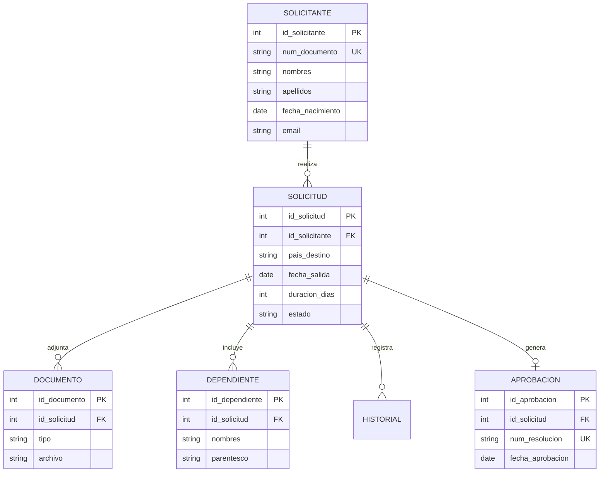
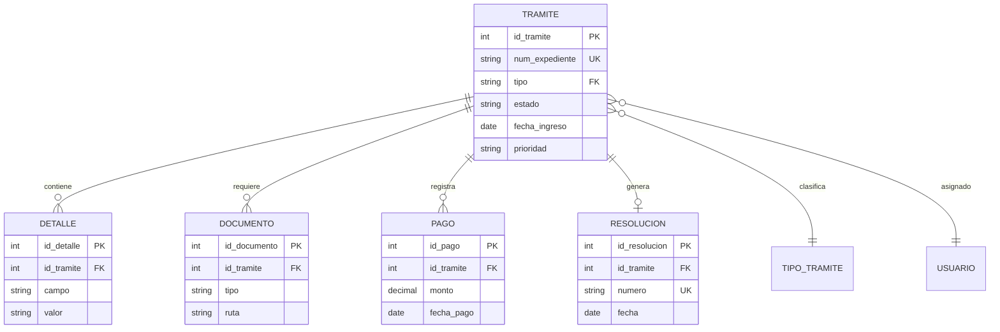
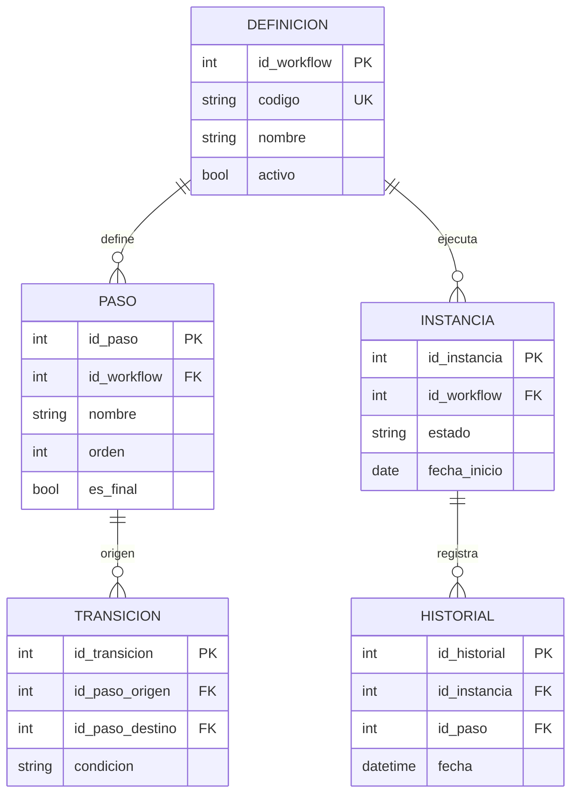
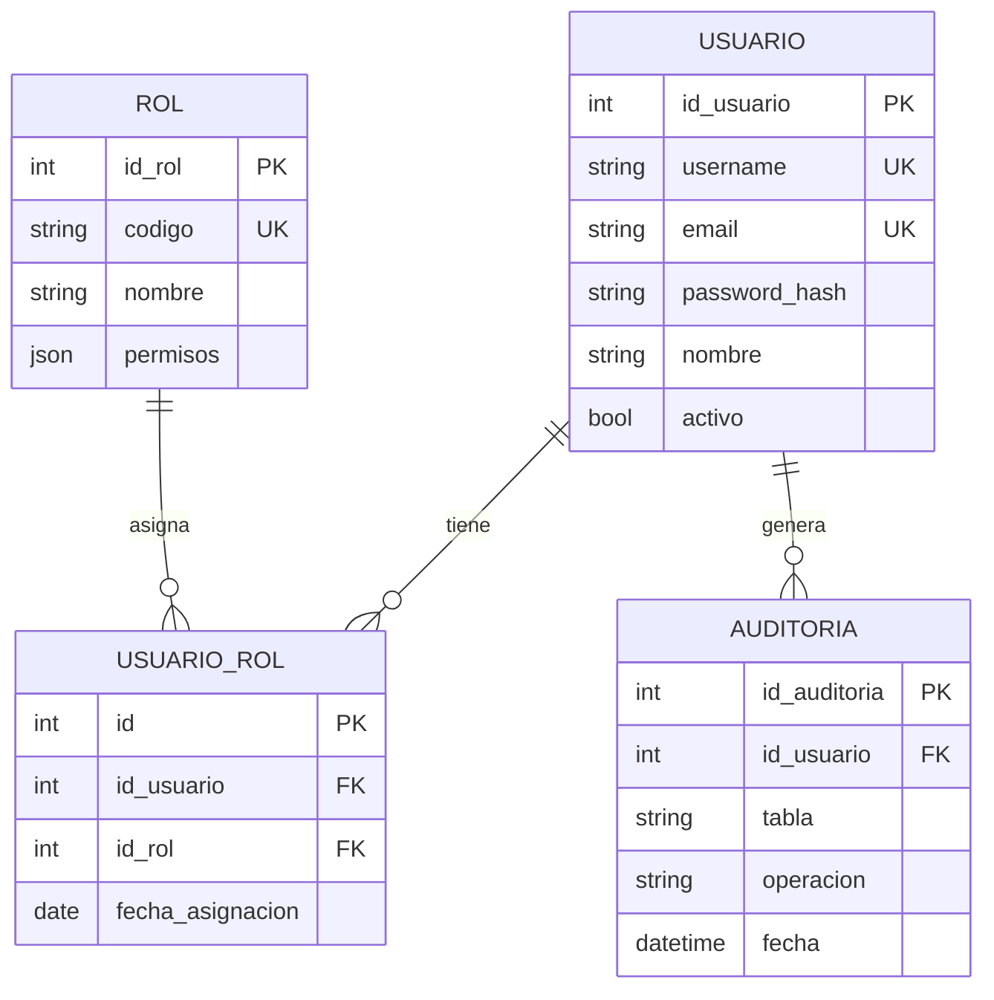
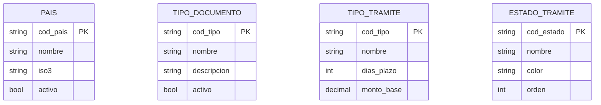
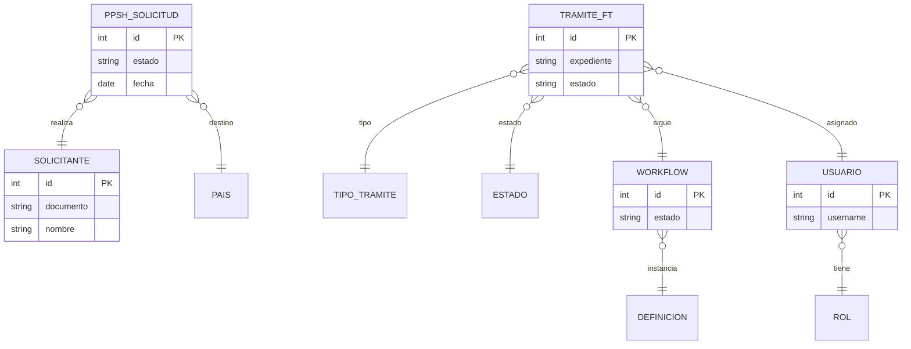
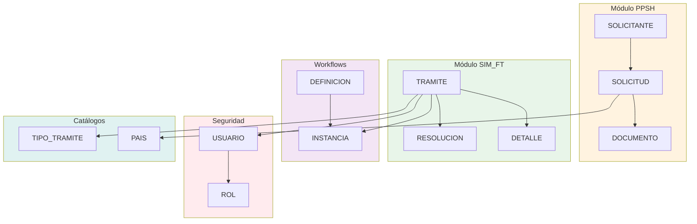

# Diagramas ER Compactos para Documento Word

## Instrucciones de Uso

Para agregar estos diagramas a Word:

1. **Opción 1 - Mermaid Live Editor:**
   - Visita: https://mermaid.live/
   - Copia el código del diagrama
   - Pégalo en el editor
   - Exporta como PNG/SVG
   - Inserta la imagen en Word

2. **Opción 2 - Extensión de Word:**
   - Instala "Mermaid Chart" para Word
   - Inserta el código directamente

3. **Opción 3 - Visual Studio Code:**
   - Instala extensión "Markdown Preview Mermaid Support"
   - Exporta como imagen
   - Inserta en Word

---

## 1. Módulo PPSH - Permiso Provisorio de Salida Humanitaria

**Copiar desde línea 42 hasta línea 87**

---

## 2. Módulo SIM_FT - Sistema de Flujo de Trámites

**Copiar desde línea 93 hasta línea 140**

---

## 3. Módulo Workflows - Procesos Dinámicos

**Copiar desde línea 146 hasta línea 189**

---

## 4. Módulo Seguridad - Usuarios y Roles

**Copiar desde línea 195 hasta línea 232**

---

## 5. Módulo Catálogos - Datos Maestros

**Copiar desde línea 238 hasta línea 267**

---

## 6. Diagrama Completo - Arquitectura General (Vista Simplificada)

**Copiar desde línea 273 hasta línea 319**

---

## 7. Vista por Módulo - Relaciones Principales

**Copiar desde línea 325 hasta línea 373**

---

## Resumen de Diagramas Generados

| Módulo | Entidades | Relaciones | Uso Recomendado |
|--------|-----------|------------|-----------------|
| **PPSH** | 5 tablas | 4 relaciones | Gestión de permisos humanitarios |
| **SIM_FT** | 5 tablas | 5 relaciones | Sistema central de trámites |
| **Workflows** | 5 tablas | 4 relaciones | Procesos configurables |
| **Seguridad** | 4 tablas | 3 relaciones | Control de acceso |
| **Catálogos** | 4 tablas | Independientes | Datos maestros |
| **Completo** | Vista integrada | Todas | Arquitectura general |

---

## Notas Técnicas

### Características de los Diagramas:

✅ **Compactos**: Solo campos esenciales para claridad visual  
✅ **Legibles**: Nombres descriptivos y abreviaciones estándar  
✅ **Exportables**: Compatible con Mermaid Live Editor  
✅ **Escalables**: Vectoriales (SVG) o rasterizados (PNG)  

### Recomendaciones para Word:

1. **Tamaño de exportación**: 1920x1080 px para buena calidad
2. **Formato**: SVG para documentos digitales, PNG para impresos
3. **Disposición**: Un diagrama por página para legibilidad
4. **Títulos**: Agregar como "Figura X: Diagrama ER del Módulo..."

### Colores Sugeridos para Módulos:

- **PPSH**: Naranja claro (#fff3e0)
- **SIM_FT**: Verde claro (#e8f5e9)
- **Workflows**: Morado claro (#f3e5f5)
- **Seguridad**: Rojo claro (#ffebee)
- **Catálogos**: Verde azulado (#e0f2f1)
