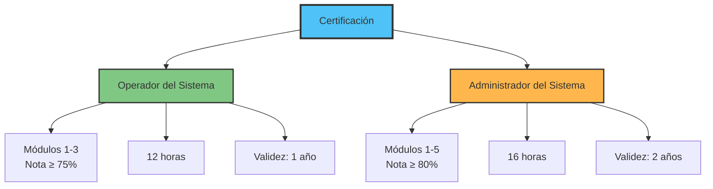
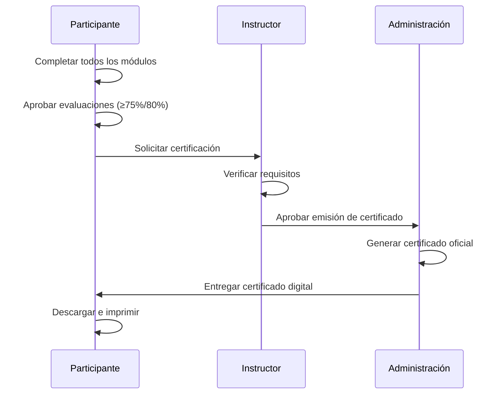
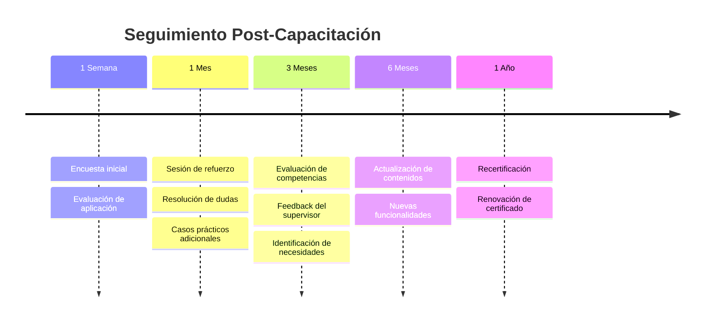

# Certificación y Seguimiento

Proceso de certificación y seguimiento post-capacitación.

---

## 🎓 Certificación Oficial

### Tipos de Certificación

El programa ofrece dos niveles de certificación según el perfil del participante:



### Requisitos de Certificación

#### Certificación de Operador del Sistema

| Requisito | Especificación |
|-----------|----------------|
| **Módulos** | Completar Módulos 1, 2 y 3 |
| **Nota mínima** | 75% |
| **Asistencia** | Mínimo 90% |
| **Ejercicios** | Completar casos 1, 2 y 3 |
| **Duración** | 12 horas de capacitación |
| **Validez** | 1 año |

**Competencias Certificadas**:
- ✅ Navegación y uso básico del sistema
- ✅ Creación y seguimiento de trámites
- ✅ Procesamiento completo de PPSH
- ✅ Consulta de reportes básicos

#### Certificación de Administrador del Sistema

| Requisito | Especificación |
|-----------|----------------|
| **Módulos** | Completar Módulos 1 al 5 |
| **Nota mínima** | 80% |
| **Asistencia** | Mínimo 95% |
| **Ejercicios** | Completar todos los casos (1-5) |
| **Duración** | 16 horas de capacitación |
| **Validez** | 2 años |

**Competencias Certificadas**:
- ✅ Todo lo del nivel Operador
- ✅ Creación y gestión de workflows
- ✅ Administración de usuarios y permisos
- ✅ Configuración del sistema
- ✅ Diagnóstico y resolución de problemas
- ✅ Respaldos y recuperación

---

## 📜 Certificados Oficiales

### Certificado de Operador

```
┌─────────────────────────────────────────────────────────┐
│                                                         │
│              GOBIERNO DE LA REPÚBLICA DE PANAMÁ         │
│             SERVICIO NACIONAL DE MIGRACIÓN              │
│                                                         │
│  ═════════════════════════════════════════════════════  │
│                                                         │
│                   CERTIFICADO OFICIAL                   │
│                                                         │
│              OPERADOR DEL SISTEMA DE TRÁMITES          │
│                     MIGRATORIOS                         │
│                                                         │
│  ═════════════════════════════════════════════════════  │
│                                                         │
│  Se certifica que:                                      │
│                                                         │
│                    JUAN PÉREZ LÓPEZ                     │
│              Cédula: 8-123-4567                         │
│                                                         │
│  Ha completado satisfactoriamente el Programa de        │
│  Capacitación de Operador del Sistema de Trámites       │
│  Migratorios, cumpliendo con los requisitos             │
│  establecidos:                                          │
│                                                         │
│  • Módulos 1, 2 y 3 completados                         │
│  • Nota final: 86.5/100 (Muy Bueno)                    │
│  • Asistencia: 100%                                     │
│  • Duración: 12 horas                                   │
│                                                         │
│  Competencias Certificadas:                             │
│  ✓ Navegación y uso del sistema                         │
│  ✓ Gestión de trámites migratorios                      │
│  ✓ Procesamiento de PPSH                                │
│                                                         │
│  ─────────────────────────────────────────────────      │
│                                                         │
│  Fecha de Emisión: 31 de Mayo de 2025                  │
│  Código de Certificado: OP-2025-0123                    │
│  Válido hasta: 31 de Mayo de 2026                       │
│                                                         │
│  ─────────────────────────────────────────────────      │
│                                                         │
│  [FIRMA DIGITAL]          [FIRMA DIGITAL]               │
│  Director de Capacitación Director General SNM          │
│                                                         │
│  [SELLO OFICIAL SNM]                                    │
│                                                         │
│  QR Code: [QR]                                          │
│  Verificable en: tramites.migracion.gob.pa/certificados │
│                                                         │
└─────────────────────────────────────────────────────────┘
```

### Certificado de Administrador

```
┌─────────────────────────────────────────────────────────┐
│                                                         │
│              GOBIERNO DE LA REPÚBLICA DE PANAMÁ         │
│             SERVICIO NACIONAL DE MIGRACIÓN              │
│                                                         │
│  ═════════════════════════════════════════════════════  │
│                                                         │
│                   CERTIFICADO OFICIAL                   │
│                                                         │
│          ADMINISTRADOR DEL SISTEMA DE TRÁMITES         │
│                     MIGRATORIOS                         │
│                                                         │
│  ═════════════════════════════════════════════════════  │
│                                                         │
│  Se certifica que:                                      │
│                                                         │
│                  MARÍA GONZÁLEZ TORRES                  │
│              Cédula: 8-234-5678                         │
│                                                         │
│  Ha completado satisfactoriamente el Programa de        │
│  Capacitación de Administrador del Sistema de Trámites  │
│  Migratorios, cumpliendo con los requisitos             │
│  establecidos:                                          │
│                                                         │
│  • Módulos 1, 2, 3, 4 y 5 completados                   │
│  • Nota final: 92.0/100 (Excelente)                    │
│  • Asistencia: 100%                                     │
│  • Duración: 16 horas                                   │
│                                                         │
│  Competencias Certificadas:                             │
│  ✓ Gestión completa de trámites y PPSH                  │
│  ✓ Creación y administración de workflows               │
│  ✓ Gestión de usuarios y permisos                       │
│  ✓ Configuración y mantenimiento del sistema            │
│  ✓ Diagnóstico y resolución de problemas                │
│  ✓ Respaldos y recuperación de datos                    │
│                                                         │
│  ─────────────────────────────────────────────────      │
│                                                         │
│  Fecha de Emisión: 31 de Mayo de 2025                  │
│  Código de Certificado: ADM-2025-0045                   │
│  Válido hasta: 31 de Mayo de 2027                       │
│                                                         │
│  ─────────────────────────────────────────────────      │
│                                                         │
│  [FIRMA DIGITAL]          [FIRMA DIGITAL]               │
│  Director de Capacitación Director General SNM          │
│                                                         │
│  [SELLO OFICIAL SNM]                                    │
│                                                         │
│  QR Code: [QR]                                          │
│  Verificable en: tramites.migracion.gob.pa/certificados │
│                                                         │
└─────────────────────────────────────────────────────────┘
```

---

## ✅ Proceso de Certificación

### Pasos para Obtener el Certificado



**Cronograma**:

| Paso | Responsable | Tiempo |
|------|-------------|--------|
| 1. Completar capacitación | Participante | 1-3 semanas |
| 2. Calificación final | Instructor | 2 días |
| 3. Verificación de requisitos | Instructor | 1 día |
| 4. Emisión de certificado | Administración | 3 días |
| 5. Entrega y publicación | Administración | 1 día |

**Total**: Aproximadamente 1 semana después de completar el curso

---

## 🔄 Seguimiento Post-Capacitación

### Calendario de Seguimiento

El seguimiento post-capacitación asegura que los conocimientos se apliquen efectivamente:



### Actividades de Seguimiento

#### Semana 1: Evaluación Inicial

**Encuesta de Satisfacción**:

```
┌──────────────────────────────────────────────┐
│  📋 ENCUESTA POST-CAPACITACIÓN              │
│     Semana 1                                │
├──────────────────────────────────────────────┤
│                                              │
│  1. ¿Aplica el sistema en su trabajo diario?│
│     ( ) Diariamente                         │
│     ( ) Semanalmente                        │
│     ( ) Ocasionalmente                      │
│     ( ) Aún no                              │
│                                              │
│  2. Nivel de dificultad para aplicar lo     │
│     aprendido:                              │
│     ⭐⭐⭐⭐⭐ (1=Fácil, 5=Difícil)         │
│                                              │
│  3. ¿Qué módulo utiliza más?                │
│     ( ) Trámites                            │
│     ( ) PPSH                                │
│     ( ) Workflows                           │
│     ( ) Administración                      │
│                                              │
│  4. ¿Ha encontrado dificultades?            │
│     ( ) Sí  ( ) No                          │
│     Si sí, describa: __________________     │
│                                              │
│  5. Calificación del curso (1-10): ____     │
│                                              │
│  6. Comentarios adicionales:                │
│     _________________________________       │
│     _________________________________       │
│                                              │
└──────────────────────────────────────────────┘
```

#### Mes 1: Sesión de Refuerzo

**Formato**: 2 horas virtuales o presenciales

**Agenda**:
1. Revisión de casos reales (30 min)
2. Resolución de dudas comunes (45 min)
3. Práctica con casos difíciles (30 min)
4. Q&A abierto (15 min)

**Temas Típicos**:
- Documentación compleja
- Casos PPSH especiales
- Workflows avanzados
- Problemas técnicos frecuentes

#### Mes 3: Evaluación de Competencias

**Evaluación por el Supervisor**:

```
┌──────────────────────────────────────────────┐
│  📊 EVALUACIÓN DE COMPETENCIAS              │
│     Trimestre 1                             │
├──────────────────────────────────────────────┤
│                                              │
│  Empleado: ____________________________     │
│  Supervisor: ___________________________    │
│  Fecha: ________________________________    │
│                                              │
│  Califique del 1 al 5:                      │
│  (1=Deficiente, 5=Excelente)                │
│                                              │
│  Competencias Operativas:                   │
│  [ ] Navegación del sistema          ____   │
│  [ ] Creación de trámites            ____   │
│  [ ] Revisión documental             ____   │
│  [ ] Proceso PPSH                    ____   │
│  [ ] Uso de reportes                 ____   │
│                                              │
│  Competencias Técnicas:                     │
│  [ ] Resolución de problemas         ____   │
│  [ ] Calidad de documentación        ____   │
│  [ ] Cumplimiento de plazos          ____   │
│  [ ] Atención al ciudadano           ____   │
│                                              │
│  Competencias Administrativas:              │
│  (Solo para administradores)                │
│  [ ] Gestión de usuarios             ____   │
│  [ ] Configuración del sistema       ____   │
│  [ ] Creación de workflows           ____   │
│  [ ] Soporte técnico                 ____   │
│                                              │
│  PROMEDIO GENERAL: ____                     │
│                                              │
│  Fortalezas Identificadas:                  │
│  _________________________________          │
│  _________________________________          │
│                                              │
│  Áreas de Mejora:                           │
│  _________________________________          │
│  _________________________________          │
│                                              │
│  Recomendaciones:                           │
│  _________________________________          │
│  _________________________________          │
│                                              │
│  Firma Supervisor: __________________       │
│                                              │
└──────────────────────────────────────────────┘
```

#### Mes 6: Actualización de Contenidos

**Sesión de Actualización**: 3 horas

**Contenido**:
- Nuevas funcionalidades del sistema
- Mejores prácticas identificadas
- Casos de éxito
- Lecciones aprendidas
- Cambios en procedimientos

#### Año 1: Recertificación

**Proceso de Renovación**:

1. **Evaluación de Desempeño**:
   - Revisión de métricas de uso
   - Evaluación del supervisor
   - Auto-evaluación

2. **Curso de Actualización**:
   - 4 horas de contenido actualizado
   - Nuevas funcionalidades
   - Casos avanzados

3. **Examen de Recertificación**:
   - 15 preguntas de selección múltiple
   - Nota mínima: 75% (Operador) / 80% (Administrador)

4. **Emisión de Nuevo Certificado**:
   - Vigencia: 1 año (Operador) / 2 años (Administrador)

---

## 📈 Métricas de Éxito

### Indicadores de Aplicación

El sistema monitorea automáticamente el uso para evaluar la aplicación de conocimientos:

| Métrica | Descripción | Meta |
|---------|-------------|------|
| **Tasa de adopción** | % usuarios que usan el sistema regularmente | ≥ 90% |
| **Trámites procesados** | Cantidad por usuario/día | ≥ 10 |
| **Tiempo promedio** | Por trámite completado | ≤ 15 min |
| **Errores** | Frecuencia de errores | ≤ 5% |
| **Satisfacción ciudadana** | Rating promedio | ≥ 4.5/5 |

### Dashboard de Progreso

```
┌──────────────────────────────────────────────────────┐
│  📊 DASHBOARD DE CAPACITADOS                        │
│     Cohorte Mayo 2025                               │
├──────────────────────────────────────────────────────┤
│                                                      │
│  USUARIOS CERTIFICADOS: 45                          │
│  ━━━━━━━━━━━━━━━━━━━━━━━━━━━━━━━                  │
│  • Operadores: 30 (67%)                             │
│  • Administradores: 15 (33%)                        │
│                                                      │
│  APLICACIÓN DEL CONOCIMIENTO                        │
│  ━━━━━━━━━━━━━━━━━━━━━━━━━━━━━━━                  │
│  Uso diario: 42/45 (93%) ✅                         │
│  Trámites procesados: 1,250 este mes                │
│  Tiempo promedio: 12 min (-20%) ✅                  │
│  Tasa de error: 3% ✅                               │
│                                                      │
│  SATISFACCIÓN                                       │
│  ━━━━━━━━━━━━━━━━━━━━━━━━━━━━━━━                  │
│  Encuesta semana 1: 4.7/5 ⭐⭐⭐⭐⭐                │
│  Evaluación mes 1: 4.5/5 ⭐⭐⭐⭐                   │
│  Evaluación mes 3: 4.6/5 ⭐⭐⭐⭐                   │
│                                                      │
│  PRÓXIMAS ACTIVIDADES                               │
│  ━━━━━━━━━━━━━━━━━━━━━━━━━━━━━━━                  │
│  • Sesión de refuerzo: 15/06/2025                   │
│  • Evaluación trimestral: 31/07/2025                │
│  • Actualización de contenido: 30/11/2025           │
│                                                      │
└──────────────────────────────────────────────────────┘
```

---

## 🎯 Educación Continua

### Programa de Formación Avanzada

Para usuarios certificados que deseen especializarse:

**Cursos Avanzados Disponibles**:

1. **Workflows Avanzados** (8 horas)
   - Workflows complejos multinivel
   - Automatizaciones avanzadas
   - Integración con otros sistemas

2. **Análisis de Datos y Reportes** (6 horas)
   - Reportes personalizados
   - Dashboards ejecutivos
   - Análisis estadístico

3. **Administración Avanzada** (8 horas)
   - Seguridad y auditoría
   - Optimización de rendimiento
   - Integración de APIs

4. **Atención al Ciudadano** (4 horas)
   - Comunicación efectiva
   - Manejo de casos difíciles
   - Calidad de servicio

### Comunidad de Práctica

**Foro de Usuarios Certificados**:
- Intercambio de mejores prácticas
- Resolución colaborativa de problemas
- Casos de estudio
- Webinars mensuales

**Contacto**: capacitacion@migracion.gob.pa

---

## 📞 Contacto y Soporte

### Equipo de Capacitación

| Rol | Contacto | Horario |
|-----|----------|---------|
| **Director de Capacitación** | capacitacion@migracion.gob.pa | Lun-Vie 8-17h |
| **Soporte Técnico** | soporte@tramites.gob.pa | 24/7 |
| **Recertificación** | certificados@migracion.gob.pa | Lun-Vie 8-17h |

### Recursos Adicionales

- 📖 [Manual Completo del Sistema](../usuario/index.md)
- 🎥 [Biblioteca de Videos](../recursos/videos.md)
- 💬 [Foro de la Comunidad](https://foro.tramites.gob.pa)
- 📧 [Newsletter Mensual](https://tramites.gob.pa/newsletter)

---

## 🎉 Felicitaciones

!!! success "¡Completó el Programa!"
    Ha culminado exitosamente el **Programa de Capacitación del Sistema de Trámites Migratorios**. Su certificación lo acredita como usuario competente del sistema.
    
    **Próximos pasos**:
    
    1. ✅ Descargar su certificado digital
    2. ✅ Actualizar su perfil profesional
    3. ✅ Aplicar conocimientos en trabajo diario
    4. ✅ Participar en la comunidad
    5. ✅ Estar atento a actualizaciones
    
    **¡Éxito en su desempeño profesional!**

---

[← Evaluaciones](evaluaciones.md) | [Índice](index.md)
