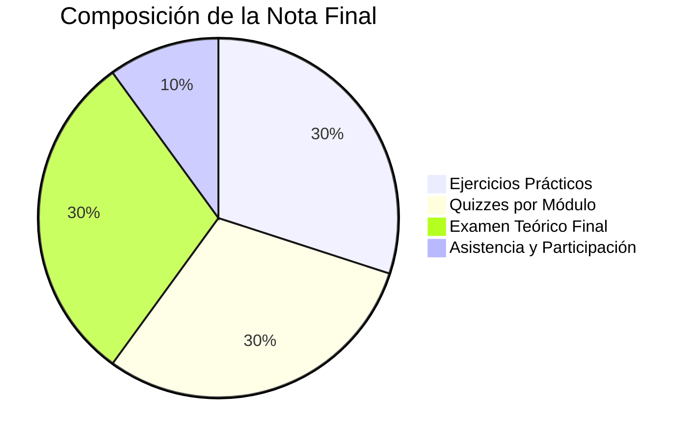
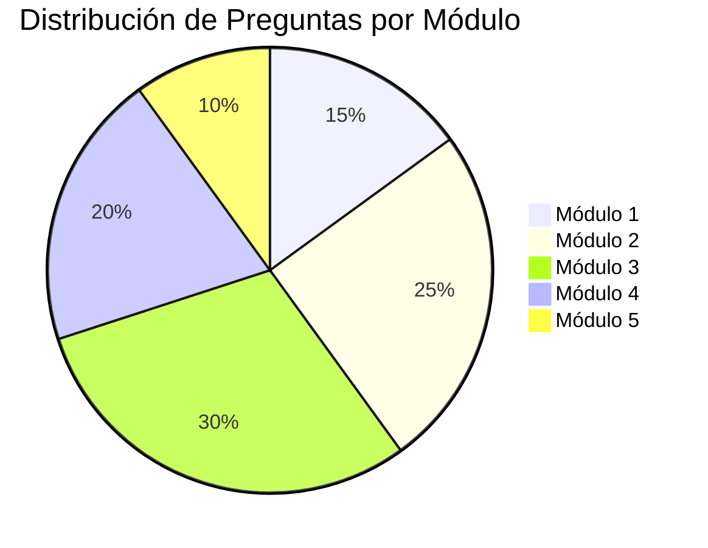

# Evaluaciones y Exámenes

Sistema de evaluación del programa de capacitación.

---

## 📋 Estructura de Evaluación

La evaluación del curso combina múltiples componentes para medir el aprendizaje de forma integral.

### Distribución de la Nota Final



| Componente | Peso | Descripción |
|------------|------|-------------|
| **Ejercicios Prácticos** | 30% | 5 casos integrados |
| **Quizzes por Módulo** | 30% | 5 módulos × 6% cada uno |
| **Examen Teórico Final** | 30% | 20 preguntas de selección múltiple |
| **Asistencia y Participación** | 10% | Asistencia mínima 90% |

### Escala de Calificación

| Nota | Calificación | Resultado |
|------|--------------|-----------|
| 90-100 | Excelente | ⭐⭐⭐⭐⭐ |
| 80-89 | Muy Bueno | ⭐⭐⭐⭐ |
| 75-79 | Bueno | ⭐⭐⭐ |
| 70-74 | Aprobado | ⭐⭐ |
| 0-69 | Reprobado | ❌ |

**Nota Mínima para Certificación**:
- **Operador**: 75%
- **Administrador**: 80%

---

## 📝 Quizzes por Módulo

Cada módulo incluye un quiz de 10 preguntas.

### Módulo 1: Introducción al Sistema

**Tiempo**: 15 minutos  
**Preguntas**: 10  
**Valor**: 6% de la nota final

#### Banco de Preguntas (Selección)

1. **Los 3 módulos principales del sistema son:**
   - [x] a) Trámites, PPSH, Workflows
   - [ ] b) Login, Dashboard, Reportes
   - [ ] c) Usuarios, Permisos, Logs
   - [ ] d) Archivos, Notificaciones, Ayuda

2. **El Dashboard muestra:**
   - [x] a) Estadísticas, actividad reciente, notificaciones
   - [ ] b) Solo notificaciones
   - [ ] c) Solo lista de trámites
   - [ ] d) Únicamente el menú de navegación

3. **Un campo con asterisco (*) rojo indica:**
   - [x] a) Campo obligatorio que debe completarse
   - [ ] b) Campo opcional
   - [ ] c) Campo con errores
   - [ ] d) Campo numérico

4. **El rol "Aprobador" puede:**
   - [x] a) Aprobar y rechazar trámites
   - [ ] b) Solo crear trámites
   - [ ] c) Solo consultar
   - [ ] d) Modificar el sistema

5. **Los estados de un trámite son:**
   - [x] a) Creado, En Revisión, Aprobado, Rechazado
   - [ ] b) Solo Aprobado/Rechazado
   - [ ] c) Pendiente, Procesado, Finalizado
   - [ ] d) Activo, Inactivo

*(Continúa hasta 10 preguntas)*

**Clave de Respuestas**: 1-a, 2-a, 3-a, 4-a, 5-a...

---

### Módulo 2: Trámites Básicos

**Tiempo**: 15 minutos  
**Preguntas**: 10  
**Valor**: 6%

#### Banco de Preguntas (Selección)

1. **El tamaño máximo permitido para documentos es:**
   - [x] a) 5 MB
   - [ ] b) 2 MB
   - [ ] c) 10 MB
   - [ ] d) Sin límite

2. **Documentos obligatorios para TODOS los trámites:**
   - [x] a) Pasaporte, fotografía, antecedentes, comprobante pago
   - [ ] b) Solo pasaporte
   - [ ] c) Pasaporte y boleto aéreo
   - [ ] d) Solo comprobante de pago

3. **El código VT-001 corresponde a:**
   - [x] a) Visa de Trabajo
   - [ ] b) Visa de Turista
   - [ ] c) Visa de Estudiante
   - [ ] d) Visa de Inversionista

4. **Después de enviar un trámite, NO se puede modificar:**
   - [x] a) Datos personales y detalles del trámite
   - [ ] b) Email de contacto
   - [ ] c) Teléfono
   - [ ] d) Todo se puede modificar

5. **Formatos de archivo NO permitidos:**
   - [x] a) ZIP, EXE, DOC
   - [ ] b) PDF
   - [ ] c) JPG
   - [ ] d) PNG

*(Continúa hasta 10 preguntas)*

---

### Módulo 3: PPSH Avanzado

**Tiempo**: 20 minutos  
**Preguntas**: 10  
**Valor**: 6%

#### Banco de Preguntas (Selección)

1. **PPSH significa:**
   - [x] a) Permiso Provisorio de Salida Humanitaria
   - [ ] b) Proceso Permanente de Salud Humanitaria
   - [ ] c) Permiso Permanente de Salida Humanitaria
   - [ ] d) Proceso Provisorio de Soporte Humanitario

2. **Tiempo máximo de respuesta para PPSH "Muy Urgente":**
   - [x] a) 24 horas
   - [ ] b) 48 horas
   - [ ] c) 72 horas
   - [ ] d) 1 semana

3. **Las 6 etapas del PPSH son:**
   - [x] a) Solicitud, Revisión, Evaluación Médica, Entrevista, Decisión, Notificación
   - [ ] b) Solicitud, Aprobación, Emisión
   - [ ] c) Creación, Revisión, Decisión
   - [ ] d) Inicio, Proceso, Finalización

4. **La evaluación médica en PPSH es:**
   - [x] a) Obligatoria en todos los casos
   - [ ] b) Solo en emergencias médicas
   - [ ] c) Opcional
   - [ ] d) Solo si el aprobador lo solicita

5. **Una "red flag" en la entrevista es:**
   - [x] a) Respuestas evasivas y contradictorias
   - [ ] b) Tener familia en Panamá
   - [ ] c) Tener trabajo estable
   - [ ] d) Documentación completa

*(Continúa hasta 10 preguntas)*

---

### Módulo 4: Workflows Dinámicos

**Tiempo**: 15 minutos  
**Preguntas**: 10  
**Valor**: 6%

#### Banco de Preguntas (Selección)

1. **La estructura de un workflow es:**
   - [x] a) Workflow → Etapas → Tareas
   - [ ] b) Workflow → Tareas
   - [ ] c) Solo etapas
   - [ ] d) Solo tareas

2. **Los workflows se diferencian de los trámites en:**
   - [x] a) Estructura personalizable vs. fija
   - [ ] b) Los workflows son más lentos
   - [ ] c) Los trámites no tienen etapas
   - [ ] d) No hay diferencia

3. **Los responsables de tareas se pueden asignar:**
   - [x] a) Por rol o usuario específico
   - [ ] b) Solo por rol
   - [ ] c) Solo por usuario
   - [ ] d) No se pueden asignar

4. **Una instancia de workflow es:**
   - [x] a) Una ejecución específica del workflow
   - [ ] b) El workflow completo
   - [ ] c) Una tarea
   - [ ] d) Una etapa

5. **El estado de un workflow puede ser:**
   - [x] a) En Progreso, Completado, Cancelado
   - [ ] b) Solo Activo/Inactivo
   - [ ] c) Solo Aprobado/Rechazado
   - [ ] d) No tiene estados

*(Continúa hasta 10 preguntas)*

---

### Módulo 5: Administración y Soporte

**Tiempo**: 15 minutos  
**Preguntas**: 10  
**Valor**: 6%

#### Banco de Preguntas (Selección)

1. **El rol con acceso completo al sistema es:**
   - [x] a) Administrador
   - [ ] b) Aprobador
   - [ ] c) Revisor
   - [ ] d) Médico

2. **La duración máxima recomendada para sesiones es:**
   - [x] a) 8 horas
   - [ ] b) 24 horas
   - [ ] c) 1 hora
   - [ ] d) Ilimitada

3. **Los logs del sistema se consultan en:**
   - [x] a) Administración → Logs y Auditoría
   - [ ] b) Dashboard
   - [ ] c) Perfil de usuario
   - [ ] d) No se pueden consultar

4. **Los respaldos automáticos deben ejecutarse:**
   - [x] a) Diariamente
   - [ ] b) Semanalmente
   - [ ] c) Mensualmente
   - [ ] d) No son necesarios

5. **Si un usuario olvida su contraseña, el admin debe:**
   - [x] a) Resetear y enviar link temporal
   - [ ] b) Crear nueva cuenta
   - [ ] c) Eliminar usuario
   - [ ] d) Compartir su propia contraseña

*(Continúa hasta 10 preguntas)*

---

## 📄 Examen Teórico Final

### Información General

| Parámetro | Detalle |
|-----------|---------|
| **Duración** | 30 minutos |
| **Preguntas** | 20 de selección múltiple |
| **Valor** | 30% de la nota final |
| **Formato** | Digital (sistema) o Impreso |
| **Modalidad** | Individual, libro cerrado |
| **Intentos** | 1 (uno) |

### Estructura del Examen



| Módulo | Preguntas | Puntos |
|--------|-----------|--------|
| **Módulo 1** | 3 | 15 |
| **Módulo 2** | 5 | 25 |
| **Módulo 3** | 6 | 30 |
| **Módulo 4** | 4 | 20 |
| **Módulo 5** | 2 | 10 |
| **Total** | 20 | 100 |

### Ejemplo de Examen Final

#### PARTE 1: Introducción al Sistema (3 preguntas - 15 pts)

**1. ¿Cuál de las siguientes afirmaciones sobre el Dashboard es INCORRECTA?**
   - [ ] a) Muestra estadísticas en tiempo real
   - [ ] b) Permite acceso rápido a módulos
   - [ ] c) Muestra notificaciones
   - [x] d) Solo está disponible para administradores

**2. El buscador global permite buscar por:**
   - [x] a) Número de trámite, nombre, cédula
   - [ ] b) Solo número de trámite
   - [ ] c) Solo nombre
   - [ ] d) No permite búsquedas

**3. ¿Qué navegador NO es compatible con el sistema?**
   - [ ] a) Google Chrome
   - [ ] b) Mozilla Firefox
   - [x] c) Internet Explorer
   - [ ] d) Microsoft Edge

#### PARTE 2: Trámites Básicos (5 preguntas - 25 pts)

**4. El tiempo estimado para procesar una Visa de Trabajo es:**
   - [ ] a) 5-7 días
   - [ ] b) 10-15 días
   - [x] c) 15-20 días
   - [ ] d) 30 días

**5. En la Búsqueda Avanzada se puede filtrar por:**
   - [x] a) Fecha, tipo, estado, solicitante, revisor
   - [ ] b) Solo por fecha
   - [ ] c) Solo por tipo
   - [ ] d) No se puede filtrar

**6. ¿Qué información NO se puede modificar después de enviar un trámite?**
   - [x] a) Nombre del solicitante y tipo de trámite
   - [ ] b) Email de contacto
   - [ ] c) Número de teléfono
   - [ ] d) Todo se puede modificar

**7. El código RT-101 corresponde a:**
   - [x] a) Residencia Temporal
   - [ ] b) Residencia Permanente
   - [ ] c) Renovación de Residencia
   - [ ] d) Visa de Turista

**8. Los documentos obligatorios para TODOS los trámites incluyen:**
   - [x] a) Pasaporte, fotografía, antecedentes, comprobante de pago
   - [ ] b) Solo pasaporte y fotografía
   - [ ] c) Solo comprobante de pago
   - [ ] d) Depende del tipo de trámite

#### PARTE 3: PPSH Avanzado (6 preguntas - 30 pts)

**9. PPSH es un proceso:**
   - [x] a) Acelerado para casos humanitarios (24-72h)
   - [ ] b) Regular como otros trámites (15-30 días)
   - [ ] c) Solo para emergencias médicas
   - [ ] d) Solo para venezolanos

**10. En el proceso PPSH, la evaluación médica la realiza:**
   - [x] a) Médico autorizado del SNM
   - [ ] b) Cualquier médico
   - [ ] c) El revisor documental
   - [ ] d) El aprobador

**11. Durante la entrevista PPSH, es una señal de alerta (red flag):**
   - [x] a) Respuestas evasivas y contradictorias
   - [ ] b) Tener vínculos fuertes en Panamá
   - [ ] c) Documentación completa
   - [ ] d) Mostrar solvencia económica

**12. El certificado PPSH se emite:**
   - [x] a) Después de la aprobación final
   - [ ] b) Al crear la solicitud
   - [ ] c) Después de la revisión documental
   - [ ] d) Antes de la entrevista

**13. La revisión documental en PPSH verifica:**
   - [x] a) Completitud, validez y coherencia de documentos
   - [ ] b) Solo que existan archivos
   - [ ] c) Solo el pasaporte
   - [ ] d) Solo la fotografía

**14. ¿Cuántas etapas tiene el proceso PPSH completo?**
   - [ ] a) 3
   - [ ] b) 4
   - [ ] c) 5
   - [x] d) 6

#### PARTE 4: Workflows Dinámicos (4 preguntas - 20 pts)

**15. Un workflow se compone de:**
   - [x] a) Etapas que contienen tareas
   - [ ] b) Solo tareas
   - [ ] c) Solo etapas
   - [ ] d) Solo responsables

**16. La principal diferencia entre trámites y workflows es:**
   - [x] a) Los workflows tienen estructura personalizable
   - [ ] b) Los workflows son más lentos
   - [ ] c) Los trámites no tienen etapas
   - [ ] d) No hay diferencia real

**17. Una instancia de workflow es:**
   - [x] a) Una ejecución específica del workflow
   - [ ] b) El mismo workflow
   - [ ] c) Una plantilla
   - [ ] d) Un borrador

**18. Los responsables de tareas se asignan:**
   - [x] a) Por rol o usuario específico
   - [ ] b) Solo por rol
   - [ ] c) Solo por usuario
   - [ ] d) Automáticamente por el sistema

#### PARTE 5: Administración y Soporte (2 preguntas - 10 pts)

**19. Para resetear la contraseña de un usuario, el administrador debe:**
   - [x] a) Enviar link temporal de restablecimiento
   - [ ] b) Crear una nueva cuenta
   - [ ] c) Compartir su propia contraseña
   - [ ] d) Eliminar y recrear el usuario

**20. Los respaldos automáticos del sistema deben configurarse:**
   - [x] a) Diariamente con retención de 30 días
   - [ ] b) Semanalmente
   - [ ] c) Mensualmente
   - [ ] d) No son necesarios

---

### Hoja de Respuestas del Examen Final

```
NOMBRE: ________________________________
FECHA: ________________________________
DURACIÓN: 30 minutos

Instrucciones: Marque con una X la respuesta correcta.

 1. [ ] a  [ ] b  [ ] c  [ ] d
 2. [ ] a  [ ] b  [ ] c  [ ] d
 3. [ ] a  [ ] b  [ ] c  [ ] d
 4. [ ] a  [ ] b  [ ] c  [ ] d
 5. [ ] a  [ ] b  [ ] c  [ ] d
 6. [ ] a  [ ] b  [ ] c  [ ] d
 7. [ ] a  [ ] b  [ ] c  [ ] d
 8. [ ] a  [ ] b  [ ] c  [ ] d
 9. [ ] a  [ ] b  [ ] c  [ ] d
10. [ ] a  [ ] b  [ ] c  [ ] d
11. [ ] a  [ ] b  [ ] c  [ ] d
12. [ ] a  [ ] b  [ ] c  [ ] d
13. [ ] a  [ ] b  [ ] c  [ ] d
14. [ ] a  [ ] b  [ ] c  [ ] d
15. [ ] a  [ ] b  [ ] c  [ ] d
16. [ ] a  [ ] b  [ ] c  [ ] d
17. [ ] a  [ ] b  [ ] c  [ ] d
18. [ ] a  [ ] b  [ ] c  [ ] d
19. [ ] a  [ ] b  [ ] c  [ ] d
20. [ ] a  [ ] b  [ ] c  [ ] d

PUNTUACIÓN: _____ / 100
CALIFICACIÓN: __________
```

### Clave de Respuestas del Examen Final

| Pregunta | Respuesta | Puntos |
|----------|-----------|--------|
| 1 | d | 5 |
| 2 | a | 5 |
| 3 | c | 5 |
| 4 | c | 5 |
| 5 | a | 5 |
| 6 | a | 5 |
| 7 | a | 5 |
| 8 | a | 5 |
| 9 | a | 5 |
| 10 | a | 5 |
| 11 | a | 5 |
| 12 | a | 5 |
| 13 | a | 5 |
| 14 | d | 5 |
| 15 | a | 5 |
| 16 | a | 5 |
| 17 | a | 5 |
| 18 | a | 5 |
| 19 | a | 5 |
| 20 | a | 5 |
| **Total** | | **100** |

---

## 📊 Sistema de Calificación

### Cálculo de Nota Final

**Ejemplo de Cálculo**:

| Componente | Nota | Peso | Subtotal |
|------------|------|------|----------|
| **Ejercicios Prácticos** | 85/100 | 30% | 25.5 |
| **Quizzes (Promedio)** | 90/100 | 30% | 27.0 |
| **Examen Teórico Final** | 80/100 | 30% | 24.0 |
| **Asistencia/Participación** | 100/100 | 10% | 10.0 |
| **TOTAL** | | | **86.5** |

**Resultado**: 86.5/100 = **Muy Bueno** ⭐⭐⭐⭐

### Planilla de Calificaciones

```
┌────────────────────────────────────────────────────────┐
│  PLANILLA DE CALIFICACIONES                           │
│  Programa: Capacitación Sistema de Trámites           │
│  Fecha: Mayo 2025                                      │
├────────────────────────────────────────────────────────┤
│                                                        │
│  PARTICIPANTE: Juan Pérez                              │
│                                                        │
│  ┌──────────────────────────────────────────────────┐ │
│  │ COMPONENTE              │ NOTA  │ PESO │ SUBTOTAL│ │
│  ├──────────────────────────────────────────────────┤ │
│  │ Ejercicios Prácticos    │ 85/100│  30% │  25.5  │ │
│  │ • Caso 1                │ 90    │      │        │ │
│  │ • Caso 2                │ 85    │      │        │ │
│  │ • Caso 3                │ 80    │      │        │ │
│  │ • Caso 4                │ 85    │      │        │ │
│  │ • Caso 5                │ 85    │      │        │ │
│  ├──────────────────────────────────────────────────┤ │
│  │ Quizzes por Módulo      │ 90/100│  30% │  27.0  │ │
│  │ • Módulo 1              │ 90    │   6% │   5.4  │ │
│  │ • Módulo 2              │ 90    │   6% │   5.4  │ │
│  │ • Módulo 3              │ 90    │   6% │   5.4  │ │
│  │ • Módulo 4              │ 90    │   6% │   5.4  │ │
│  │ • Módulo 5              │ 90    │   6% │   5.4  │ │
│  ├──────────────────────────────────────────────────┤ │
│  │ Examen Teórico Final    │ 80/100│  30% │  24.0  │ │
│  ├──────────────────────────────────────────────────┤ │
│  │ Asistencia/Participación│100/100│  10% │  10.0  │ │
│  │ • Asistencia: 100%      │       │      │        │ │
│  │ • Participación: Activa │       │      │        │ │
│  ├──────────────────────────────────────────────────┤ │
│  │ NOTA FINAL              │       │ 100% │  86.5  │ │
│  └──────────────────────────────────────────────────┘ │
│                                                        │
│  CALIFICACIÓN: MUY BUENO ⭐⭐⭐⭐                       │
│  RESULTADO: APROBADO ✅                                │
│  CERTIFICACIÓN: AUTORIZADA                            │
│                                                        │
│  Instructor: _____________________                    │
│  Fecha: _____________________                         │
│                                                        │
└────────────────────────────────────────────────────────┘
```

---

## 📈 Retroalimentación y Mejora

### Retroalimentación por Componente

Los participantes reciben retroalimentación detallada en cada evaluación:

**Ejercicios Prácticos**:
- ✅ Aspectos bien ejecutados
- ⚠️ Áreas de mejora
- 💡 Recomendaciones específicas

**Quizzes**:
- Respuestas incorrectas con explicación
- Referencias a secciones del manual
- Sugerencias de repaso

**Examen Final**:
- Revisión de respuestas incorrectas
- Discusión de casos complejos
- Aclaración de dudas

### Plan de Mejora

Para participantes que no alcanzan el mínimo:

1. **Revisión personalizada** con instructor
2. **Material de repaso** adicional
3. **Sesión de refuerzo** (2 horas)
4. **Examen de recuperación** (máximo 1 intento adicional)

---

## 💡 Consejos para las Evaluaciones

✅ **Leer cuidadosamente** cada pregunta  
✅ **Gestionar el tiempo** eficientemente  
✅ **Revisar respuestas** antes de enviar  
✅ **Practicar** con los casos de prueba  
✅ **Consultar el manual** durante el estudio  
✅ **Hacer preguntas** al instructor  

---

[← Ejercicios](ejercicios.md) | [Índice](index.md) | [Certificación →](certificacion.md)
