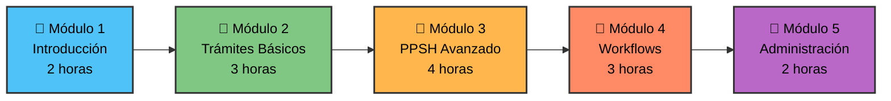
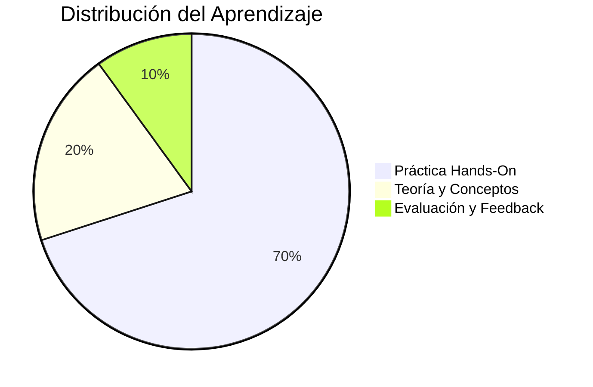

# 🎓 Guía de Capacitación

Programa completo de formación para usuarios y administradores del Sistema de Trámites Migratorios.

---

## 📋 Información General

### Descripción

La **Guía de Capacitación** proporciona un programa estructurado de formación que prepara a los participantes para utilizar eficientemente el Sistema de Trámites Migratorios de Panamá. El programa combina teoría y práctica con un enfoque hands-on que garantiza el dominio completo del sistema.

### 🎯 Objetivos de Aprendizaje

Al finalizar este programa de capacitación, los participantes serán capaces de:

- ✅ Comprender la arquitectura y funcionamiento del sistema
- ✅ Operar el sistema para gestionar trámites migratorios
- ✅ Procesar solicitudes de Permiso Provisorio de Salida Humanitaria (PPSH)
- ✅ Utilizar el módulo de workflows dinámicos
- ✅ Administrar el sistema y proporcionar soporte técnico básico
- ✅ Resolver problemas comunes de manera autónoma
- ✅ Aplicar mejores prácticas de seguridad y eficiencia

---

## 📚 Estructura del Programa

### Visión General

### Duración Total

| Audiencia | Módulos | Duración | Certificación |
|-----------|---------|----------|---------------|
| **Usuarios Finales** | Módulos 1-4 | 12 horas | ✅ Operador Certificado |
| **Administradores** | Módulos 1-5 | 14 horas | ✅ Administrador Certificado |
| **Curso Completo** | Módulos 1-5 + Ejercicios | 16 horas | ✅ Certificación Avanzada |

---

## 👥 Audiencias y Perfiles

### Usuarios Finales

**Perfil**:
- Oficiales de migración
- Personal administrativo
- Personal de atención al ciudadano

**Conocimientos Previos**:
- Uso básico de computadoras
- Navegación web
- Procesamiento de documentos

**Módulos Recomendados**: 1, 2, 3, 4

### Administradores del Sistema

**Perfil**:
- Personal técnico de TI
- Administradores de bases de datos
- Personal de soporte técnico

**Conocimientos Previos**:
- Administración de sistemas
- Bases de datos relacionales
- Troubleshooting básico

**Módulos Recomendados**: 1, 2, 3, 4, 5

### Supervisores y Gerentes

**Perfil**:
- Jefes de departamento
- Supervisores de área
- Personal de gestión

**Conocimientos Previos**:
- Gestión de procesos
- Toma de decisiones
- Supervisión de personal

**Módulos Recomendados**: 1, 2, 4 (enfoque en reportes)

---

## 📖 Contenido por Módulo

### [Módulo 1: Introducción al Sistema](modulo-01.md)

**Duración**: 2 horas  
**Nivel**: Básico

#### Temas Cubiertos:

- Panorama general del sistema
- Acceso y autenticación
- Navegación básica
- Conceptos fundamentales
- Roles y permisos

#### Objetivos Específicos:

- Acceder exitosamente al sistema
- Navegar entre módulos principales
- Comprender la estructura del sistema
- Identificar componentes clave

#### Ejercicios:

- ✏️ Primer login y exploración
- ✏️ Navegación guiada
- ✏️ Cambio de contraseña
- ✏️ Quiz de introducción

---

### [Módulo 2: Trámites Básicos](modulo-02.md)

**Duración**: 3 horas  
**Nivel**: Básico-Intermedio

#### Temas Cubiertos:

- Tipos de trámites disponibles
- Creación de trámites nuevos
- Seguimiento y consultas
- Actualización de información
- Reportes básicos

#### Objetivos Específicos:

- Crear solicitudes de trámites
- Realizar seguimiento efectivo
- Actualizar información de trámites
- Generar reportes simples

#### Ejercicios:

- ✏️ Crear primer trámite (Visa de Trabajo)
- ✏️ Búsqueda y seguimiento
- ✏️ Actualizar documentos
- ✏️ Generar reporte de trámites

---

### [Módulo 3: PPSH Avanzado](modulo-03.md)

**Duración**: 4 horas  
**Nivel**: Intermedio-Avanzado

#### Temas Cubiertos:

- Introducción al PPSH
- Crear solicitudes PPSH
- Revisión documental
- Evaluación médica
- Proceso de entrevistas
- Toma de decisiones
- Emisión de permisos

#### Objetivos Específicos:

- Comprender el flujo completo PPSH
- Procesar solicitudes humanitarias
- Realizar revisiones documentales
- Conducir entrevistas efectivas
- Aprobar o rechazar solicitudes

#### Ejercicios:

- ✏️ Solicitud PPSH completa (caso médico)
- ✏️ Revisión documental con observaciones
- ✏️ Evaluación médica de urgencia
- ✏️ Entrevista simulada
- ✏️ Toma de decisión justificada

---

### [Módulo 4: Workflows Dinámicos](modulo-04.md)

**Duración**: 3 horas  
**Nivel**: Intermedio

#### Temas Cubiertos:

- Concepto de workflows
- Definir workflows personalizados
- Crear instancias de workflows
- Gestionar tareas asignadas
- Monitorear progreso
- Finalizar workflows

#### Objetivos Específicos:

- Crear workflows desde plantillas
- Iniciar instancias de procesos
- Completar tareas asignadas
- Monitorear progreso de workflows
- Finalizar procesos correctamente

#### Ejercicios:

- ✏️ Crear workflow de 3 etapas
- ✏️ Iniciar instancia de workflow
- ✏️ Completar tareas secuenciales
- ✏️ Dashboard de progreso
- ✏️ Workflow con aprobaciones múltiples

---

### [Módulo 5: Administración y Soporte](modulo-05.md)

**Duración**: 2 horas  
**Nivel**: Avanzado

#### Temas Cubiertos:

- Gestión de usuarios y roles
- Configuración del sistema
- Mantenimiento preventivo
- Troubleshooting común
- Backups y recuperación
- Seguridad y auditoría

#### Objetivos Específicos:

- Crear y gestionar usuarios
- Asignar roles y permisos
- Resolver problemas comunes
- Realizar backups básicos
- Revisar logs de auditoría

#### Ejercicios:

- ✏️ Crear usuarios y asignar roles
- ✏️ Configurar permisos personalizados
- ✏️ Diagnosticar problema simulado
- ✏️ Revisar logs de sistema
- ✏️ Generar reporte de auditoría

---

## 📅 Calendario de Capacitación

### Opción 1: Programa Intensivo (1 Semana)

**Modalidad**: Presencial, tiempo completo

| Día | Horario | Módulo | Actividades |
|-----|---------|--------|-------------|
| **Lunes** | 9:00 - 11:00 | Módulo 1 | Introducción + Login |
| | 11:30 - 14:30 | Módulo 2 | Trámites básicos + práctica |
| **Martes** | 9:00 - 13:00 | Módulo 3 (Parte 1) | PPSH: Solicitudes |
| | 14:00 - 16:00 | Módulo 3 (Parte 2) | PPSH: Revisiones |
| **Miércoles** | 9:00 - 12:00 | Módulo 4 | Workflows dinámicos |
| | 13:00 - 15:00 | Ejercicios | Práctica integrada |
| **Jueves** | 9:00 - 11:00 | Módulo 5 | Administración |
| | 11:30 - 14:30 | Ejercicios | Casos complejos |
| **Viernes** | 9:00 - 11:00 | Evaluación | Examen teórico |
| | 11:30 - 13:00 | Evaluación | Examen práctico |
| | 13:30 - 14:30 | Cierre | Entrega certificados |

### Opción 2: Programa Extendido (3 Semanas)

**Modalidad**: Presencial/Virtual, medio tiempo

**Semana 1**:
- Martes: Módulo 1 (2 horas)
- Jueves: Módulo 2 (3 horas)

**Semana 2**:
- Martes: Módulo 3 Parte 1 (2 horas)
- Jueves: Módulo 3 Parte 2 (2 horas)

**Semana 3**:
- Martes: Módulo 4 (3 horas)
- Jueves: Módulo 5 + Evaluación (3 horas)

---

## 🎓 Metodología de Enseñanza

### Distribución del Tiempo

### Enfoque Pedagógico

#### 70% Práctica Hands-On

- ✅ Ejercicios en entorno real
- ✅ Casos de uso reales
- ✅ Simulaciones de escenarios
- ✅ Trabajo con datos de prueba
- ✅ Resolución de problemas

#### 20% Teoría y Conceptos

- 📚 Presentaciones visuales
- 📚 Demostraciones en vivo
- 📚 Mejores prácticas
- 📚 Patrones comunes
- 📚 Políticas y procedimientos

#### 10% Evaluación y Feedback

- 📊 Quizzes cortos
- 📊 Evaluaciones prácticas
- 📊 Retroalimentación continua
- 📊 Autoevaluación
- 📊 Examen final

---

## 📦 Material de Capacitación

### Material para Participantes

#### Antes del Curso

- [ ] Acceso al sistema de capacitación
- [ ] Credenciales de usuario de prueba
- [ ] Manual de Usuario (PDF)
- [ ] Agenda detallada del curso
- [ ] Requisitos técnicos verificados

#### Durante el Curso

- [ ] Presentaciones de cada módulo
- [ ] Guías de ejercicios prácticos
- [ ] Casos de estudio
- [ ] Hojas de referencia rápida
- [ ] Acceso a datos de prueba

#### Después del Curso

- [ ] Certificado de finalización
- [ ] Material de referencia
- [ ] Contactos de soporte
- [ ] Encuesta de satisfacción
- [ ] Acceso a recursos adicionales

### Material para Instructores

- 📊 Presentaciones PowerPoint editables
- 📋 Guías de instructor detalladas
- 🎯 Objetivos de aprendizaje por sesión
- ⏱️ Planes de tiempo sugeridos
- ✅ Listas de verificación
- 💡 Tips de enseñanza
- 🔧 Scripts de configuración del entorno
- 📝 Rúbricas de evaluación

---

## 🎯 Evaluaciones

### Tipos de Evaluación

#### 1. Evaluaciones Formativas (Durante el Curso)

**Quizzes Cortos** (1 por módulo):
- 5-10 preguntas de opción múltiple
- Inmediatamente después de cada módulo
- Retroalimentación instantánea
- No cuenta para nota final

**Ejercicios Prácticos**:
- Mínimo 2 ejercicios por módulo
- Supervisados por instructor
- Retroalimentación personalizada
- Oportunidad de repetir

#### 2. Evaluación Sumativa (Final)

**Examen Teórico** (30 minutos):
- 30 preguntas de opción múltiple
- Cubre todos los módulos
- Puntaje mínimo: 80%
- Máximo 2 intentos

**Examen Práctico** (90 minutos):
- 5 casos prácticos completos
- Evaluación hands-on en sistema real
- Puntaje mínimo: 75%
- 1 intento único

### Criterios de Aprobación

| Componente | Peso | Puntaje Mínimo |
|------------|------|----------------|
| Asistencia | 10% | 90% de sesiones |
| Ejercicios Prácticos | 30% | 70% promedio |
| Examen Teórico | 30% | 80% |
| Examen Práctico | 30% | 75% |
| **TOTAL** | **100%** | **75%** |

### Certificación

#### Certificado de Operador

**Requisitos**:
- Completar Módulos 1-4
- Aprobar evaluación final
- Puntaje final ≥ 75%

#### Certificado de Administrador

**Requisitos**:
- Completar Módulos 1-5
- Aprobar evaluación final
- Puntaje final ≥ 80%
- Demostrar competencia en troubleshooting

---

## 🛠️ Requisitos Técnicos

### Hardware

**Mínimo**:
- Computadora con procesador dual-core 2.0 GHz
- 4 GB RAM
- 10 GB espacio en disco
- Conexión a internet estable (5 Mbps)

**Recomendado**:
- Computadora con procesador quad-core 2.5 GHz+
- 8 GB RAM
- 20 GB espacio en disco
- Conexión a internet estable (10 Mbps+)

### Software

**Obligatorio**:
- ✅ Sistema operativo: Windows 10/11, macOS 10.15+, Ubuntu 20.04+
- ✅ Navegador web: Chrome 90+, Firefox 88+, Edge 90+
- ✅ PDF Reader
- ✅ Excel o LibreOffice Calc

**Opcional**:
- 📸 Software de captura de pantalla
- 📝 Bloc de notas o editor de texto
- 🎥 Zoom/Teams (para sesiones virtuales)

### Conectividad

- ✅ Acceso a `https://tramites-capacitacion.gob.pa`
- ✅ Puerto 443 (HTTPS) habilitado
- ✅ Firewall configurado para permitir acceso
- ✅ VPN corporativa (si aplica)

---

## 📞 Soporte y Recursos

### Durante la Capacitación

**Instructor Principal**:
- Disponible durante todas las sesiones
- Responde preguntas en tiempo real
- Provee retroalimentación personalizada

**Asistente Técnico**:
- Soporte técnico inmediato
- Resolución de problemas de acceso
- Ayuda con configuración

### Después de la Capacitación

**Mesa de Ayuda**:
- 📧 Email: soporte@migracion.gob.pa
- ☎️ Teléfono: +507-500-0000 ext. 1234
- 💬 Chat en vivo (horario laboral)
- 🎫 Sistema de tickets

**Recursos Online**:
- 📚 Base de conocimientos
- 🎥 Videos tutoriales
- 📖 Documentación actualizada
- 💡 FAQs

---

## 📊 Seguimiento Post-Capacitación

### Primera Semana

- ✅ Email de seguimiento
- ✅ Encuesta de satisfacción
- ✅ Recordatorio de recursos disponibles

### Primer Mes

- 📊 Evaluación de uso del sistema
- 💡 Sesión opcional de preguntas y respuestas
- 📈 Reporte de actividad del usuario

### Tercer Mes

- 🎓 Oportunidad de capacitación avanzada
- 📊 Evaluación de competencias
- 💬 Feedback para mejora del curso

---

## 🎓 Próximos Pasos

### Para Iniciar la Capacitación

1. **Revisar Material Previo**: Leer este índice completo
2. **Verificar Requisitos**: Confirmar acceso y hardware
3. **Recibir Credenciales**: Contactar a coordinador de capacitación
4. **Agenda**: Confirmar fechas y horarios
5. **Comenzar Módulo 1**: [Iniciar con Introducción al Sistema →](modulo-01.md)

### Navegación del Curso

| Módulo | Enlace | Duración |
|--------|--------|----------|
| Introducción | [Módulo 1 →](modulo-01.md) | 2 horas |
| Trámites Básicos | [Módulo 2 →](modulo-02.md) | 3 horas |
| PPSH Avanzado | [Módulo 3 →](modulo-03.md) | 4 horas |
| Workflows | [Módulo 4 →](modulo-04.md) | 3 horas |
| Administración | [Módulo 5 →](modulo-05.md) | 2 horas |
| Ejercicios | [Ejercicios →](ejercicios.md) | Variable |
| Evaluaciones | [Evaluaciones →](evaluaciones.md) | 2 horas |
| Certificación | [Proceso →](certificacion.md) | - |

---

## 📧 Contacto

**Coordinación de Capacitación**  
Servicio Nacional de Migración de Panamá

- **Email**: capacitacion@migracion.gob.pa
- **Teléfono**: +507-500-0000 ext. 1500
- **Horario**: Lunes a Viernes, 8:00 AM - 4:00 PM

---

!!! success "¡Bienvenido al Programa de Capacitación!"
    Estás a punto de iniciar un viaje de aprendizaje que te convertirá en un usuario experto del Sistema de Trámites Migratorios. ¡Comencemos!

[Iniciar Módulo 1: Introducción al Sistema →](modulo-01.md){ .md-button .md-button--primary }
