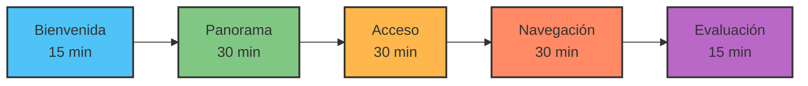
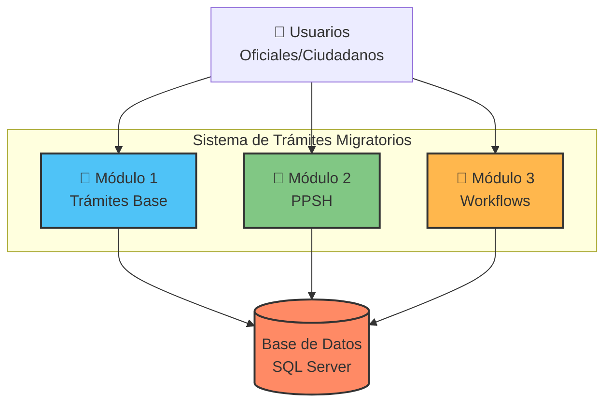
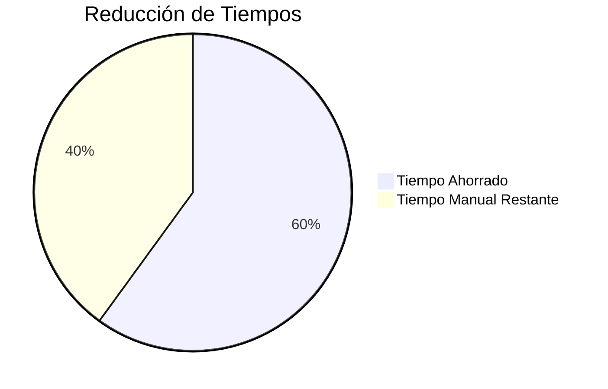
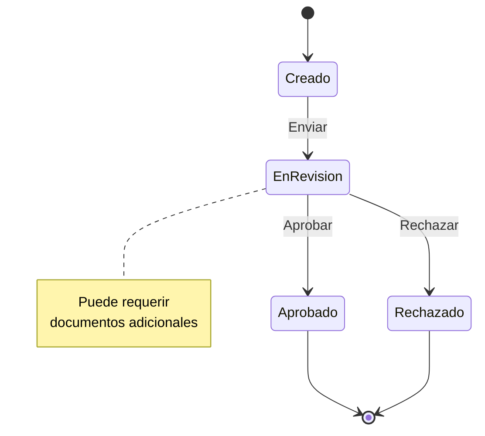

# Módulo 1: Introducción al Sistema

Familiarización con el Sistema de Trámites Migratorios y sus capacidades básicas.

---

## 📊 Información del Módulo

| Parámetro | Detalle |
|-----------|---------|
| **Duración** | 2 horas |
| **Nivel** | Básico |
| **Prerequisitos** | Uso básico de computadoras |
| **Certificación** | Requerido para todos los usuarios |

---

## 🎯 Objetivos de Aprendizaje

Al finalizar este módulo, los participantes serán capaces de:

- ✅ Acceder exitosamente al sistema
- ✅ Navegar entre los módulos principales
- ✅ Comprender la estructura y organización del sistema
- ✅ Identificar los componentes clave de la interfaz
- ✅ Configurar su perfil de usuario básico

---

## 1.1 Bienvenida y Presentación

**Duración**: 15 minutos

### Agenda del Módulo



### Actividad Rompehielos

**Ejercicio**: Cada participante comparte (2 minutos por persona):

1. Nombre completo y puesto en la organización
2. Experiencia previa con sistemas similares
3. Una expectativa específica del curso

### Reglas de la Sesión

!!! info "Normas de Participación"
    - 📵 Silenciar notificaciones durante la sesión
    - 🙋 Hacer preguntas en cualquier momento
    - 💻 Laptop lista con navegador actualizado
    - ✍️ Tomar notas de puntos clave
    - 🤝 Colaborar en ejercicios grupales

---

## 1.2 Panorama General del Sistema

**Duración**: 30 minutos

### ¿Qué es el Sistema de Trámites Migratorios?

El **Sistema de Trámites Migratorios** es una plataforma digital integral que automatiza y gestiona todos los procesos relacionados con trámites migratorios en Panamá.

### Arquitectura del Sistema



### Módulos Principales

#### 📄 Módulo 1: Trámites Base

**Funcionalidad Principal**:
- Creación de solicitudes de trámites migratorios
- Seguimiento de estado de trámites
- Gestión de documentación
- Reportes y estadísticas

**Tipos de Trámites**:
- Visas de trabajo
- Visas de estudiante
- Residencias temporales y permanentes
- Renovaciones
- Cambios de estado migratorio

#### 🏥 Módulo 2: PPSH (Permiso Provisorio de Salida Humanitaria)

**Funcionalidad Principal**:
- Solicitudes por razones humanitarias
- Revisión documental especializada
- Evaluación médica (cuando aplica)
- Proceso de entrevistas
- Toma de decisiones rápidas

**Casos de Uso**:
- Emergencias médicas
- Fallecimientos familiares
- Situaciones especiales justificadas

#### 🔄 Módulo 3: Workflows Dinámicos

**Funcionalidad Principal**:
- Creación de procesos personalizados
- Definición de etapas y tareas
- Asignación de responsables
- Monitoreo de progreso
- Automatización de aprobaciones

**Aplicaciones**:
- Procesos internos administrativos
- Aprobaciones multinivel
- Coordinación interdepartamental

### Beneficios del Sistema



**Beneficios Clave**:

1. ⚡ **Eficiencia**: Reduce tiempo de procesamiento en 60%
2. 📊 **Trazabilidad**: Seguimiento completo de cada trámite con auditoría
3. 🔒 **Seguridad**: Datos cifrados, autenticación robusta, control de acceso
4. 📱 **Accesibilidad**: Acceso desde cualquier dispositivo con internet
5. 📈 **Reportes**: Estadísticas y métricas en tiempo real
6. 🌍 **Transparencia**: Ciudadanos pueden consultar estado de sus trámites
7. 📄 **Documentación Digital**: Eliminación de papel, almacenamiento seguro

### Estadísticas de Impacto

| Métrica | Antes | Después | Mejora |
|---------|-------|---------|--------|
| Tiempo promedio de procesamiento | 25 días | 10 días | 60% ↓ |
| Trámites procesados/día | 50 | 125 | 150% ↑ |
| Errores documentales | 15% | 3% | 80% ↓ |
| Satisfacción ciudadana | 65% | 92% | 42% ↑ |

---

## 1.3 Acceso al Sistema

**Duración**: 30 minutos

### Requisitos Técnicos

#### Hardware Mínimo

- **Computadora**: Procesador dual-core 2.0 GHz
- **RAM**: 4 GB mínimo
- **Conexión**: Internet estable (5 Mbps)
- **Pantalla**: Resolución mínima 1280x720

#### Software Requerido

!!! check "Navegadores Compatibles"
    - ✅ Google Chrome 90+ (Recomendado)
    - ✅ Mozilla Firefox 88+
    - ✅ Microsoft Edge 90+
    - ⚠️ Safari 14+ (funcionalidad limitada)
    - ❌ Internet Explorer (No compatible)

### Proceso de Acceso

#### Paso 1: Acceder a la URL

```
URL de Producción: https://tramites.migracion.gob.pa
URL de Capacitación: https://tramites-capacitacion.gob.pa
```

!!! warning "Importante"
    Para este curso utilizaremos el ambiente de **capacitación**. Los datos en este ambiente son de prueba y se reinician periódicamente.

#### Paso 2: Pantalla de Login

**Interfaz de Inicio de Sesión**:

```
┌──────────────────────────────────────┐
│                                      │
│   🇵🇦 SISTEMA DE TRÁMITES MIGRATORIOS│
│      Gobierno de Panamá              │
│                                      │
│   ────────────────────────────       │
│                                      │
│   Email: *                           │
│   [_________________________]        │
│                                      │
│   Contraseña: *                      │
│   [_________________________] 👁️    │
│                                      │
│   ☐ Recordar mi sesión               │
│                                      │
│   [    INICIAR SESIÓN    ]          │
│                                      │
│   ¿Olvidaste tu contraseña?          │
│   Primer acceso                      │
│                                      │
│   ────────────────────────────       │
│   Soporte: +507-500-0000             │
│                                      │
└──────────────────────────────────────┘
```

**Campos del Formulario**:

- **Email**: Dirección de correo institucional
- **Contraseña**: Mínimo 8 caracteres (letras, números, símbolos)
- **Recordar sesión**: Mantiene sesión activa por 7 días

#### Paso 3: Primer Acceso

Para el primer acceso, el sistema solicitará:

1. ✅ Aceptar términos y condiciones
2. ✅ Cambiar contraseña temporal
3. ✅ Configurar pregunta de seguridad
4. ✅ Verificar email (código de 6 dígitos)

### ✏️ Ejercicio Práctico 1.1: Primer Login

**Tiempo**: 15 minutos

**Objetivo**: Acceder exitosamente al sistema de capacitación

**Credenciales de Prueba**:
```
Email:    participante[N]@capacitacion.gob.pa
Contraseña: Capacitacion2025!
```
*Donde [N] es el número asignado por el instructor (1-20)*

**Instrucciones**:

1. Abrir navegador (preferiblemente Chrome)
2. Acceder a `https://tramites-capacitacion.gob.pa`
3. Ingresar credenciales proporcionadas
4. Completar proceso de primer acceso:
   - Aceptar términos
   - Cambiar contraseña a una personal
   - Configurar pregunta: "¿Ciudad de nacimiento?"
5. Explorar dashboard inicial (NO crear nada aún)
6. Hacer clic en cada módulo para ver la vista previa
7. Cerrar sesión correctamente

**Checklist de Completitud**:

- [ ] Accedí exitosamente con credenciales temporales
- [ ] Cambié contraseña a una segura
- [ ] Vi el dashboard con estadísticas
- [ ] Exploré los 3 módulos principales
- [ ] Identifiqué mi nombre en la esquina superior
- [ ] Cerré sesión correctamente

!!! tip "Tip del Instructor"
    Si olvidaron su nueva contraseña durante el ejercicio, pueden usar "Olvidaste tu contraseña" para resetearla usando el email.

---

## 1.4 Navegación y Conceptos Básicos

**Duración**: 30 minutos

### Dashboard Principal

Al iniciar sesión, verás el **Dashboard** (panel principal):

```
┌─────────────────────────────────────────────────────────┐
│ 🏠 Dashboard  📄 Trámites  🏥 PPSH  🔄 Workflows  👤  │
├─────────────────────────────────────────────────────────┤
│                                                         │
│  Bienvenido, Juan Pérez                    🔔(3)  👤  │
│  Rol: Revisor | Última sesión: Hoy 09:30 AM          │
│                                                         │
│  ┌──────────┐  ┌──────────┐  ┌──────────┐  ┌─────┐   │
│  │   45     │  │   12     │  │    8     │  │  3  │   │
│  │ Trámites │  │ Pendien. │  │ Aprob.   │  │Alert│   │
│  │  Totales │  │ Revisión │  │  Hoy     │  │  as │   │
│  └──────────┘  └──────────┘  └──────────┘  └─────┘   │
│                                                         │
│  📊 Actividad Reciente                                 │
│  ┌───────────────────────────────────────────────┐    │
│  │ #TRM-00123 | Visa de Trabajo | 🟡 En revisión│    │
│  │ María González | Hace 2 horas           [Ver]│    │
│  ├───────────────────────────────────────────────┤    │
│  │ #PPSH-00045 | Emergencia Médica | 🟢 Aprobado│    │
│  │ Carlos Pérez | Hace 5 horas           [Ver]│    │
│  ├───────────────────────────────────────────────┤    │
│  │ #WF-00089 | Aprobación Presupuesto | 🔄 Acti│    │
│  │ Ana Martínez | Ayer 15:30             [Ver]│    │
│  └───────────────────────────────────────────────┘    │
│                                                         │
│  🔔 Notificaciones (3)                                 │
│  • Tarea asignada: Revisar PPSH-00046                 │
│  • Recordatorio: Workflow WF-00089 vence mañana       │
│  • Actualización del sistema el viernes              │
│                                                         │
└─────────────────────────────────────────────────────────┘
```

### Estructura de Navegación

```mermaid
graph TB
    D[🏠 Dashboard]
    T[📄 Trámites]
    P[🏥 PPSH]
    W[🔄 Workflows]
    U[👤 Perfil]
    
    D --> T
    D --> P
    D --> W
    D --> U
    
    T --> T1[Lista de Trámites]
    T --> T2[Nuevo Trámite]
    T --> T3[Búsqueda Avanzada]
    T --> T4[Reportes]
    
    P --> P1[Solicitudes PPSH]
    P --> P2[Nueva Solicitud]
    P --> P3[Pendientes Revisión]
    P --> P4[Decisiones]
    
    W --> W1[Mis Workflows]
    W --> W2[Mis Tareas]
    W --> W3[Crear Workflow]
    W --> W4[Instancias Activas]
    
    U --> U1[Mi Información]
    U --> U2[Configuración]
    U --> U3[Seguridad]
    U --> U4[Cerrar Sesión]
    
    style D fill:#4FC3F7,stroke:#333,stroke-width:2px
    style T fill:#81C784,stroke:#333,stroke-width:2px
    style P fill:#FFB74D,stroke:#333,stroke-width:2px
    style W fill:#FF8A65,stroke:#333,stroke-width:2px
    style U fill:#BA68C8,stroke:#333,stroke-width:2px
```



### Elementos Clave de la Interfaz

#### 1. Barra de Navegación Superior

| Elemento | Función |
|----------|---------|
| **Logo** | Regresa al Dashboard |
| **Módulos** | Acceso a Trámites, PPSH, Workflows |
| **🔍 Buscador Global** | Buscar por número de trámite/solicitud |
| **🔔 Notificaciones** | Alertas y recordatorios |
| **👤 Perfil** | Configuración y cierre de sesión |

#### 2. Tarjetas de Estadísticas

Muestran métricas en tiempo real según tu rol:

- **Operador**: Trámites asignados, pendientes
- **Supervisor**: Aprobaciones pendientes, estadísticas del equipo
- **Administrador**: Métricas globales del sistema

#### 3. Actividad Reciente

Lista de últimos trámites/tareas con acceso rápido.

#### 4. Notificaciones

Alertas sobre:
- Nuevas tareas asignadas
- Plazos próximos a vencer
- Actualizaciones del sistema
- Mensajes de administradores

### Conceptos Fundamentales

#### Estados de un Trámite



**Descripción de Estados**:

- 🟢 **Creado**: Trámite recién creado, pendiente de envío
- 🟡 **En Revisión**: Siendo procesado por un oficial
- ✅ **Aprobado**: Trámite aprobado exitosamente
- ❌ **Rechazado**: Trámite rechazado con justificación

#### Roles de Usuario

| Rol | Permisos | Uso Típico |
|-----|----------|------------|
| **Solicitante** | Crear trámites, consultar estado | Ciudadanos, personal de ventanilla |
| **Revisor** | Revisar documentos, solicitar aclaraciones | Oficiales de migración |
| **Aprobador** | Aprobar/rechazar trámites | Supervisores, jefes de área |
| **Médico** | Revisión médica PPSH | Personal médico certificado |
| **Administrador** | Acceso completo al sistema | Personal de TI, gerencia |

#### Campos Obligatorios vs Opcionales

!!! info "Convención Visual"
    - ⚠️ **Asterisco rojo (*)**: Campo obligatorio, debe completarse
    - ℹ️ **Sin asterisco**: Campo opcional, puede dejarse en blanco

**Ejemplo**:
```
Nombre Completo: *  [____________]  ← Obligatorio
Segundo Nombre:     [____________]  ← Opcional
```

### Funcionalidades Comunes

#### Buscador Global

Acceso rápido a trámites:

```
🔍 [Buscar trámite, PPSH o workflow...]
```

**Formatos de búsqueda**:
- Por número: `TRM-00123`, `PPSH-00045`, `WF-00089`
- Por nombre: `María González`
- Por cédula: `8-123-4567`

#### Notificaciones

Click en 🔔 para ver:

- Tareas asignadas hoy
- Plazos que vencen pronto
- Mensajes del sistema
- Actualizaciones importantes

### ✏️ Ejercicio Práctico 1.2: Exploración Guiada

**Tiempo**: 15 minutos

**Objetivo**: Familiarizarse con la navegación del sistema

**Instrucciones**:

1. **Iniciar sesión** en el sistema de capacitación
2. **En el Dashboard**, identificar y anotar:
   - Número total de trámites mostrados: _____
   - Trámites pendientes de revisión: _____
   - Tu rol de usuario: _____
3. **Navegar** a cada módulo principal:
   - Ir a "Trámites" y regresar al Dashboard
   - Ir a "PPSH" y regresar al Dashboard
   - Ir a "Workflows" y regresar al Dashboard
4. **Usar el buscador global**: Buscar `TRM-00001`
5. **Configurar perfil**:
   - Ir a Perfil → Configuración
   - Cambiar idioma a Español (si no está)
   - Activar notificaciones por email
   - Guardar cambios
6. **Explorar notificaciones**: Click en 🔔, revisar alertas disponibles

**Preguntas de Reflexión**:

1. ¿Qué módulo te parece más relevante para tu trabajo diario?
2. ¿Encontraste fácilmente la opción para cambiar tu contraseña?
3. ¿Cuántas notificaciones tienes actualmente?

---

## 1.5 Evaluación del Módulo 1

**Duración**: 15 minutos

### Quiz Rápido

**Instrucciones**: Selecciona la respuesta correcta para cada pregunta.

#### Pregunta 1
¿Cuáles son los 3 módulos principales del sistema?

- [ ] a) Login, Dashboard, Reportes
- [x] b) Trámites, PPSH, Workflows
- [ ] c) Usuarios, Permisos, Logs
- [ ] d) Archivos, Notificaciones, Ayuda

#### Pregunta 2
¿Qué indica un asterisco (*) rojo junto a un campo de formulario?

- [ ] a) Campo opcional que puede dejarse vacío
- [x] b) Campo obligatorio que debe completarse
- [ ] c) Campo numérico que solo acepta números
- [ ] d) Campo con errores que debe corregirse

#### Pregunta 3
¿Cuántos estados principales puede tener un trámite básico?

- [ ] a) 2 (Aprobado/Rechazado)
- [x] b) 4 (Creado, En Revisión, Aprobado, Rechazado)
- [ ] c) 5 (Creado, Pendiente, Revisión, Aprobado, Rechazado)
- [ ] d) 3 (Pendiente, Procesado, Finalizado)

#### Pregunta 4
¿Qué rol de usuario puede aprobar o rechazar trámites?

- [ ] a) Solicitante
- [ ] b) Revisor
- [x] c) Aprobador
- [ ] d) Médico

#### Pregunta 5
¿Dónde se accede para cambiar la contraseña personal?

- [ ] a) Dashboard → Configuración
- [x] b) Perfil (👤) → Seguridad
- [ ] c) Trámites → Configuración
- [ ] d) No es posible cambiar la contraseña

#### Pregunta 6
¿Cuál es el formato correcto para buscar un trámite por número?

- [ ] a) TRAM-123
- [x] b) TRM-00123
- [ ] c) T-123-00
- [ ] d) 00123-TRM

#### Pregunta 7
¿Qué navegador NO es compatible con el sistema?

- [ ] a) Google Chrome
- [ ] b) Mozilla Firefox
- [ ] c) Microsoft Edge
- [x] d) Internet Explorer

#### Pregunta 8
El Dashboard muestra:

- [ ] a) Solo los trámites del usuario actual
- [ ] b) Únicamente notificaciones
- [x] c) Estadísticas, actividad reciente y notificaciones
- [ ] d) Solo la lista de módulos disponibles

#### Pregunta 9
PPSH significa:

- [ ] a) Proceso Provisorio de Salud Humanitaria
- [x] b) Permiso Provisorio de Salida Humanitaria
- [ ] c) Permiso Permanente de Salida Humanitaria
- [ ] d) Proceso Permanente de Soporte Humanitario

#### Pregunta 10
¿Cuál es el principal beneficio del sistema digital?

- [ ] a) Eliminar completamente el papel
- [ ] b) Reducir personal necesario
- [x] c) Reducir tiempo de procesamiento en 60%
- [ ] d) Aumentar costos de operación

### Respuestas Correctas

| Pregunta | Respuesta |
|----------|-----------|
| 1 | b |
| 2 | b |
| 3 | b |
| 4 | c |
| 5 | b |
| 6 | b |
| 7 | d |
| 8 | c |
| 9 | b |
| 10 | c |

**Puntuación**: ____ / 10 (70% mínimo para aprobar)

---

## 📚 Resumen del Módulo

### Puntos Clave Aprendidos

✅ El sistema tiene 3 módulos principales: Trámites, PPSH y Workflows  
✅ El acceso requiere credenciales institucionales y navegador compatible  
✅ El Dashboard es el centro de control con estadísticas y accesos rápidos  
✅ Los estados de trámites fluyen de Creado → En Revisión → Aprobado/Rechazado  
✅ Diferentes roles tienen diferentes permisos y vistas  
✅ Los campos con (*) son obligatorios  

### Próximos Pasos

Ahora que dominas la navegación básica, estás listo para:

- 📄 [Módulo 2: Crear y gestionar trámites básicos →](modulo-02.md)
- 🎯 Aplicar conceptos en casos reales
- 📊 Utilizar el sistema en tu trabajo diario

---

## 💡 Recursos Adicionales

### Material de Apoyo

- 📖 [Manual de Usuario Completo](../usuario/index.md)
- 🎥 Video: "Tour guiado del sistema" (10 min)
- 📄 [Guía Rápida de Navegación (PDF)](../recursos/guia-rapida-navegacion.pdf)

### Soporte

- 📧 Email: soporte@tramites.gob.pa
- ☎️ Teléfono: +507-500-0000 ext. 1234
- 💬 Chat en vivo: Disponible en el sistema
- 🎫 Tickets: Sistema de soporte integrado

---

[← Volver al Índice](index.md) | [Módulo 2: Trámites Básicos →](modulo-02.md)
