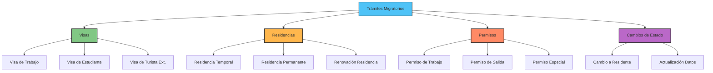
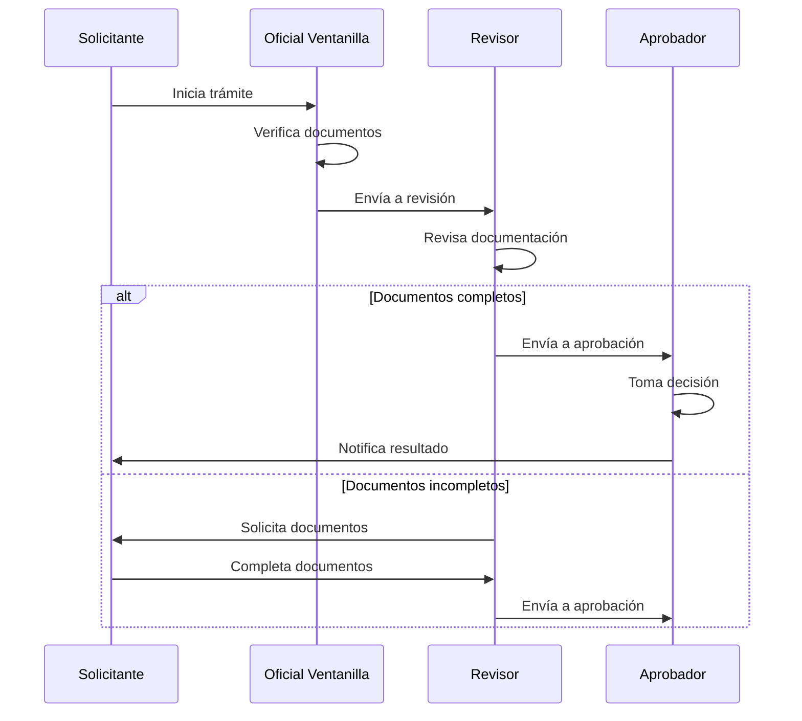
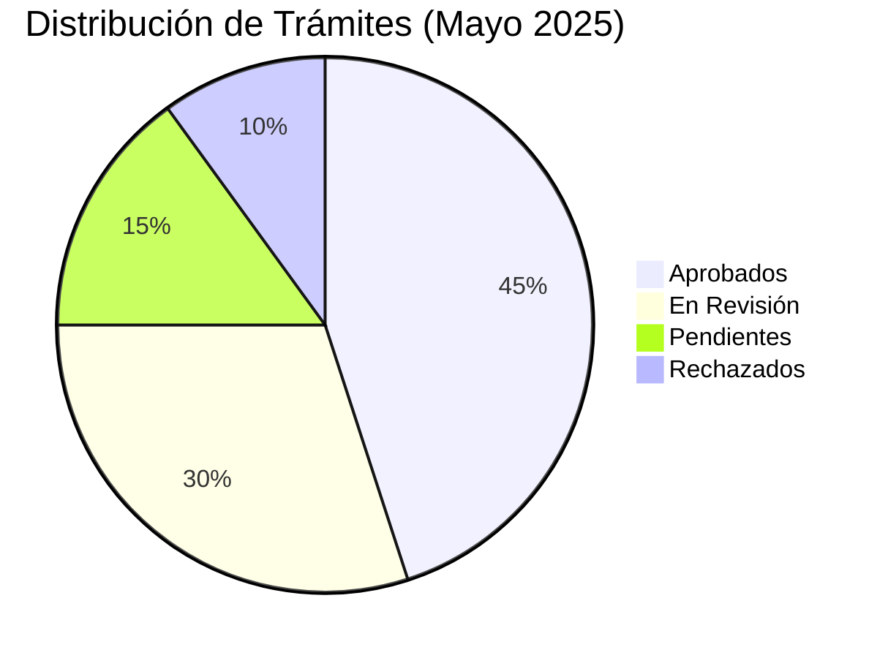
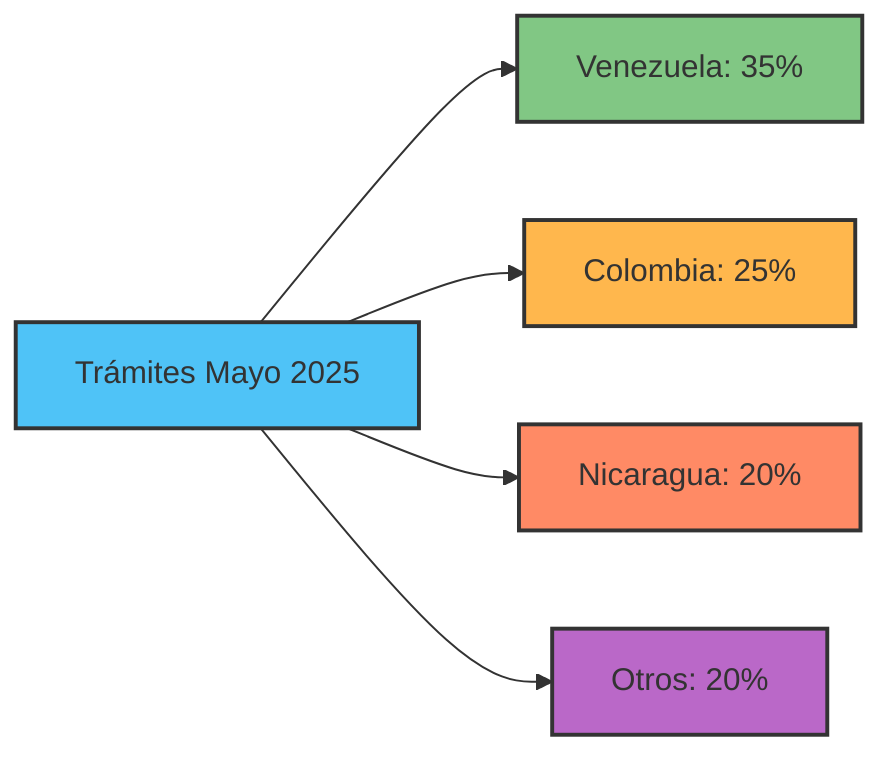

# Módulo 2: Trámites Básicos

Creación, gestión y seguimiento de trámites migratorios estándar.

---

## 📊 Información del Módulo

| Parámetro | Detalle |
|-----------|---------|
| **Duración** | 3 horas |
| **Nivel** | Básico-Intermedio |
| **Prerequisitos** | Módulo 1 completado |
| **Certificación** | Requerido para usuarios operativos |

---

## 🎯 Objetivos de Aprendizaje

Al finalizar este módulo, los participantes serán capaces de:

- ✅ Crear trámites migratorios completos
- ✅ Adjuntar documentos requeridos correctamente
- ✅ Realizar seguimiento de estado de trámites
- ✅ Buscar y filtrar trámites eficientemente
- ✅ Actualizar información de trámites existentes
- ✅ Generar reportes básicos

---

## 2.1 Tipos de Trámites

**Duración**: 30 minutos

### Categorías Principales



### Catálogo de Trámites

#### 1. Visas

| Tipo | Código | Requisitos Principales | Tiempo Estimado |
|------|--------|------------------------|-----------------|
| **Visa de Trabajo** | VT-001 | Contrato laboral, antecedentes, pasaporte | 15-20 días |
| **Visa de Estudiante** | VE-002 | Carta de aceptación, solvencia, pasaporte | 10-15 días |
| **Visa de Turista Extendida** | VTE-003 | Boleto aéreo, reservas, solvencia | 5-7 días |
| **Visa de Inversionista** | VI-004 | Certificado inversión, plan negocio, capital | 20-30 días |

#### 2. Residencias

| Tipo | Código | Requisitos Principales | Tiempo Estimado |
|------|--------|------------------------|-----------------|
| **Residencia Temporal** | RT-101 | Carta de trabajo, antecedentes, examen médico | 30 días |
| **Residencia Permanente** | RP-102 | 5 años residencia temporal, buena conducta | 60 días |
| **Renovación Residencia** | RR-103 | Residencia anterior, paz y salvo | 15 días |

#### 3. Permisos Especiales

| Tipo | Código | Requisitos Principales | Tiempo Estimado |
|------|--------|------------------------|-----------------|
| **Permiso de Trabajo** | PT-201 | Empleador registrado, contrato | 10 días |
| **Permiso de Salida** | PS-202 | Motivo justificado, documento id | 3-5 días |
| **Permiso Humanitario** | PH-203 | Documentación situación especial | Variable |

### Documentación Requerida

#### Documentos Base (Todos los Trámites)

!!! info "Documentos Obligatorios"
    1. **Pasaporte válido** (mínimo 6 meses vigencia)
    2. **Fotografía reciente** (tamaño carnet, fondo blanco)
    3. **Certificado de antecedentes penales** (del país de origen)
    4. **Comprobante de pago** (tasas administrativas)

#### Documentos Específicos por Tipo

**Para Visas de Trabajo**:
- Contrato de trabajo apostillado
- Carta de la empresa panameña
- Título profesional (si aplica)
- Prueba de solvencia económica

**Para Residencias**:
- Examen médico (laboratorio autorizado)
- Certificado de matrimonio/nacimiento (si aplica)
- Prueba de vínculos en Panamá
- Declaración jurada de buena conducta

**Para Permisos Especiales**:
- Documentación justificativa específica
- Carta de empleador o institución
- Referencia de autoridad competente

### Flujo General de un Trámite



---

## 2.2 Creación de Trámites

**Duración**: 45 minutos

### Proceso Paso a Paso

#### Paso 1: Acceder a Nuevo Trámite

```
Dashboard → Módulo "Trámites" → Botón "Nuevo Trámite"
```

**Interfaz Inicial**:

```
┌──────────────────────────────────────────────┐
│  📄 NUEVO TRÁMITE                           │
├──────────────────────────────────────────────┤
│                                              │
│  Tipo de Trámite: *                         │
│  [Seleccione un tipo ▼]                     │
│                                              │
│  Opciones disponibles:                      │
│  • Visa de Trabajo (VT-001)                 │
│  • Visa de Estudiante (VE-002)              │
│  • Residencia Temporal (RT-101)             │
│  • Permiso de Trabajo (PT-201)              │
│  • ... (ver catálogo completo)              │
│                                              │
│  ℹ️ Seleccione el tipo para ver requisitos  │
│                                              │
└──────────────────────────────────────────────┘
```

#### Paso 2: Información del Solicitante

Formulario dinámico según tipo de trámite:

```
┌──────────────────────────────────────────────┐
│  👤 DATOS DEL SOLICITANTE                   │
├──────────────────────────────────────────────┤
│                                              │
│  Datos Personales                           │
│  ─────────────────                          │
│  Nombre Completo: *                         │
│  [_________________________]                │
│                                              │
│  Apellidos: *                               │
│  [_________________________]                │
│                                              │
│  Tipo de Documento: *                       │
│  ( ) Pasaporte  (•) Cédula  ( ) Otro        │
│                                              │
│  Número de Documento: *                     │
│  [_________________________]                │
│                                              │
│  Fecha de Nacimiento: *                     │
│  [DD] / [MM] / [AAAA]  📅                  │
│                                              │
│  Nacionalidad: *                            │
│  [Seleccionar país ▼]                       │
│                                              │
│  Datos de Contacto                          │
│  ─────────────────                          │
│  Email: *                                   │
│  [_________________________]                │
│                                              │
│  Teléfono: *                                │
│  +507 [____-____]                           │
│                                              │
│  Dirección en Panamá:                       │
│  [_________________________]                │
│  [_________________________]                │
│                                              │
│  Provincia: *          Distrito: *          │
│  [Seleccionar ▼]       [Seleccionar ▼]     │
│                                              │
└──────────────────────────────────────────────┘
```

#### Paso 3: Información del Trámite

**Ejemplo: Visa de Trabajo**:

```
┌──────────────────────────────────────────────┐
│  📋 INFORMACIÓN DEL TRÁMITE                 │
├──────────────────────────────────────────────┤
│                                              │
│  Detalles de la Solicitud                   │
│  ────────────────────────                   │
│  Empresa Empleadora: *                      │
│  [_________________________]  🔍            │
│  RUC: [_______________]                     │
│                                              │
│  Cargo a Desempeñar: *                      │
│  [_________________________]                │
│                                              │
│  Salario Mensual (USD): *                   │
│  [_________]                                │
│                                              │
│  Duración del Contrato: *                   │
│  ( ) Indefinido                             │
│  (•) Definido: [__] años [__] meses        │
│                                              │
│  Fecha de Inicio Prevista: *                │
│  [DD] / [MM] / [AAAA]  📅                  │
│                                              │
│  Motivo de la Solicitud:                    │
│  [________________________________]         │
│  [________________________________]         │
│  [________________________________]         │
│                                              │
│  Experiencia Relevante: *                   │
│  [________________________________]         │
│  [________________________________]         │
│                                              │
└──────────────────────────────────────────────┘
```

#### Paso 4: Adjuntar Documentos

**Panel de Documentación**:

```
┌──────────────────────────────────────────────┐
│  📎 DOCUMENTOS REQUERIDOS                   │
├──────────────────────────────────────────────┤
│                                              │
│  ✅ Pasaporte vigente (PDF, max 5MB) *      │
│  [pasaporte_maria_gonzalez.pdf]  ❌         │
│  Subido: 21/05/2025 10:30 AM               │
│                                              │
│  ⚠️ Fotografía reciente (JPG, PNG) *         │
│  [ Arrastrar archivo o click aquí ]        │
│                                              │
│  ✅ Contrato de trabajo (PDF) *             │
│  [contrato_empresa_xyz.pdf]  ❌             │
│  Subido: 21/05/2025 10:32 AM               │
│                                              │
│  ⚠️ Antecedentes penales (PDF) *             │
│  [ Arrastrar archivo o click aquí ]        │
│                                              │
│  ⚠️ Título profesional (PDF)                 │
│  [ Arrastrar archivo o click aquí ]        │
│  (Opcional si aplicable)                    │
│                                              │
│  ⚠️ Comprobante de pago (PDF, JPG) *         │
│  [ Arrastrar archivo o click aquí ]        │
│                                              │
│  ────────────────────────────────           │
│  ✅ = Cargado  ⚠️ = Pendiente              │
│                                              │
│  Progreso: 2/6 documentos obligatorios      │
│  ████░░░░░░░░░░░░░░░░░░░░ 33%              │
│                                              │
└──────────────────────────────────────────────┘
```

**Validaciones de Archivos**:

- ✅ Formatos permitidos: PDF, JPG, PNG
- ✅ Tamaño máximo: 5 MB por archivo
- ✅ Nombre descriptivo recomendado
- ❌ No se permiten: ZIP, EXE, DOC

#### Paso 5: Revisión y Envío

**Pantalla de Confirmación**:

```
┌──────────────────────────────────────────────┐
│  ✅ REVISIÓN FINAL                          │
├──────────────────────────────────────────────┤
│                                              │
│  Tipo de Trámite:                           │
│  📄 Visa de Trabajo (VT-001)                │
│                                              │
│  Solicitante:                               │
│  👤 María González López                    │
│  🆔 Pasaporte: N123456789                   │
│  📧 maria.gonzalez@email.com                │
│  ☎️ +507 6123-4567                          │
│                                              │
│  Detalles:                                  │
│  🏢 Empresa: Tech Solutions Panamá S.A.     │
│  💼 Cargo: Desarrolladora de Software       │
│  💰 Salario: USD 2,500/mes                  │
│  📅 Inicio: 01/07/2025                      │
│                                              │
│  Documentos:                                │
│  ✅ Pasaporte                               │
│  ✅ Fotografía                              │
│  ✅ Contrato de trabajo                     │
│  ✅ Antecedentes penales                    │
│  ✅ Título profesional                      │
│  ✅ Comprobante de pago                     │
│                                              │
│  ⚠️ IMPORTANTE:                              │
│  • Verificar que todos los datos           │
│    sean correctos                           │
│  • Documentos en formato válido            │
│  • No se podrá modificar después          │
│    del envío                                │
│                                              │
│  ☐ Acepto términos y condiciones *         │
│  ☐ Declaro que la información es verídica  │
│                                              │
│  [  Guardar Borrador  ]  [ ✅ Enviar ]      │
│                                              │
└──────────────────────────────────────────────┘
```

#### Confirmación de Creación

```
┌──────────────────────────────────────────────┐
│  ✅ TRÁMITE CREADO EXITOSAMENTE             │
├──────────────────────────────────────────────┤
│                                              │
│  🎉 ¡Su trámite ha sido registrado!         │
│                                              │
│  Número de Trámite:                         │
│  TRM-00123                                  │
│                                              │
│  Estado Actual:                             │
│  🟡 En Revisión                             │
│                                              │
│  Estimación de Tiempo:                      │
│  15-20 días hábiles                         │
│                                              │
│  Próximos Pasos:                            │
│  1. Recibirá email de confirmación         │
│  2. Puede hacer seguimiento en línea       │
│  3. Será notificado de actualizaciones     │
│                                              │
│  [  Ver Detalles  ]  [  Crear Otro  ]      │
│                                              │
└──────────────────────────────────────────────┘
```

### ✏️ Ejercicio Práctico 2.1: Crear Trámite de Visa

**Tiempo**: 30 minutos

**Objetivo**: Crear un trámite completo de Visa de Trabajo

**Escenario**:
> María González, ciudadana colombiana (pasaporte N987654321), ha sido contratada por la empresa "Tech Solutions Panamá S.A." como Desarrolladora de Software con un salario de USD 2,500 mensuales. Necesita obtener una Visa de Trabajo para iniciar labores el 1 de julio de 2025.

**Datos del Ejercicio**:
- **Nombre**: María González López
- **Fecha de Nacimiento**: 15/03/1990
- **Nacionalidad**: Colombia
- **Pasaporte**: N987654321
- **Email**: maria.gonzalez@email.com
- **Teléfono**: +507 6123-4567
- **Dirección**: Calle 50, Edificio Plaza 2000, Panamá
- **Empresa**: Tech Solutions Panamá S.A.
- **RUC Empresa**: 155566-1-123456
- **Cargo**: Desarrolladora de Software Senior
- **Salario**: USD 2,500/mes
- **Tipo de Contrato**: Indefinido
- **Inicio**: 01/07/2025

**Archivos de Prueba** (disponibles en la carpeta compartida):
- `pasaporte_maria_gonzalez.pdf`
- `foto_maria_gonzalez.jpg`
- `contrato_techsolutions.pdf`
- `antecedentes_colombia.pdf`
- `titulo_ingenieria_sistemas.pdf`
- `comprobante_pago_VT001.pdf`

**Instrucciones**:

1. Acceder a "Trámites" → "Nuevo Trámite"
2. Seleccionar tipo: "Visa de Trabajo (VT-001)"
3. Completar formulario de solicitante con datos de María
4. Ingresar detalles de la empresa y el cargo
5. Adjuntar los 6 documentos proporcionados
6. Revisar información en pantalla de confirmación
7. Aceptar términos y enviar
8. Anotar el número de trámite asignado: TRM-______

**Checklist de Completitud**:

- [ ] Todos los campos obligatorios completados
- [ ] Los 6 documentos fueron cargados exitosamente
- [ ] Información revisada en pantalla de confirmación
- [ ] Trámite enviado correctamente
- [ ] Número de trámite anotado
- [ ] Email de confirmación recibido

---

## 2.3 Seguimiento de Trámites

**Duración**: 30 minutos

### Consulta de Estado

#### Método 1: Dashboard

El dashboard muestra trámites recientes automáticamente.

#### Método 2: Lista de Trámites

```
Módulo "Trámites" → "Mis Trámites"
```

**Vista de Lista**:

```
┌──────────────────────────────────────────────────────────┐
│  📄 MIS TRÁMITES                    🔍 [Buscar...]  ⚙️  │
├──────────────────────────────────────────────────────────┤
│                                                          │
│  Filtros:                                                │
│  Tipo: [Todos ▼]  Estado: [Todos ▼]  Fecha: [▼]        │
│                                                          │
│  ┌────────────────────────────────────────────────────┐ │
│  │ #TRM-00123  |  Visa de Trabajo  |  🟡 En Revisión │ │
│  │ María González | Creado: 21/05/2025 10:45 AM      │ │
│  │ Estimación: 15-20 días | Prioridad: Normal    [Ver]│ │
│  ├────────────────────────────────────────────────────┤ │
│  │ #TRM-00120  |  Residencia Temporal  |  ✅ Aprobado│ │
│  │ Juan Pérez | Creado: 18/05/2025  | Aprob: 20/05  │ │
│  │ Completado en 2 días                          [Ver]│ │
│  ├────────────────────────────────────────────────────┤ │
│  │ #TRM-00115  |  Visa de Estudiante  |  ⏳ Pendiente│ │
│  │ Ana Martínez | Creado: 15/05/2025               │ │
│  │ Documentos solicitados | Responder antes: 25/05│ │
│  │                                              [Ver]│ │
│  └────────────────────────────────────────────────────┘ │
│                                                          │
│  Mostrando 3 de 45 trámites  [1] [2] [3] ... [9]       │
│                                                          │
└──────────────────────────────────────────────────────────┘
```

#### Método 3: Búsqueda por Número

```
Buscador Global (🔍) → Ingresar "TRM-00123"
```

### Detalle de Trámite

Al hacer click en "Ver", se muestra información completa:

```
┌──────────────────────────────────────────────┐
│  📄 TRÁMITE #TRM-00123                      │
├──────────────────────────────────────────────┤
│                                              │
│  Estado Actual:  🟡 En Revisión              │
│                                              │
│  Línea de Tiempo                            │
│  ─────────────────                          │
│  ✅ 21/05/2025 10:45 - Creado               │
│     Por: María González                     │
│                                              │
│  ✅ 21/05/2025 11:00 - Asignado a revisor   │
│     Revisor: Juan Pérez (Oficial #234)     │
│                                              │
│  🔵 21/05/2025 14:30 - En revisión          │
│     Revisando documentación...              │
│                                              │
│  ⏳ Pendiente - Aprobación final            │
│                                              │
│  Detalles del Solicitante                   │
│  ────────────────────────                   │
│  Nombre: María González López               │
│  Pasaporte: N987654321                      │
│  Nacionalidad: Colombia                     │
│  Email: maria.gonzalez@email.com            │
│  Teléfono: +507 6123-4567                   │
│                                              │
│  Detalles del Trámite                       │
│  ───────────────────                        │
│  Tipo: Visa de Trabajo (VT-001)             │
│  Empresa: Tech Solutions Panamá S.A.        │
│  Cargo: Desarrolladora de Software          │
│  Salario: USD 2,500/mes                     │
│  Inicio: 01/07/2025                         │
│                                              │
│  Documentos (6)                             │
│  ─────────────                              │
│  ✅ pasaporte_maria.pdf (2.1 MB)            │
│  ✅ foto_maria.jpg (125 KB)                 │
│  ✅ contrato_techsolutions.pdf (1.5 MB)     │
│  ✅ antecedentes_colombia.pdf (890 KB)      │
│  ✅ titulo_sistemas.pdf (3.2 MB)            │
│  ✅ comprobante_pago.pdf (450 KB)           │
│                                              │
│  Acciones Disponibles                       │
│  ────────────────────                       │
│  [ 📥 Descargar Expediente ]                │
│  [ 📧 Contactar Revisor ]                   │
│  [ 🔔 Configurar Alertas ]                  │
│                                              │
└──────────────────────────────────────────────┘
```

### Notificaciones Automáticas

El sistema envía notificaciones cuando:

- ✉️ Trámite creado exitosamente
- 📩 Trámite asignado a revisor
- 📨 Documentos adicionales solicitados
- 📬 Estado del trámite cambió
- 📪 Decisión final tomada
- 📫 Plazo próximo a vencer

---

## 2.4 Búsqueda y Filtros Avanzados

**Duración**: 20 minutos

### Panel de Búsqueda Avanzada

```
Módulo "Trámites" → "Búsqueda Avanzada"
```

**Interfaz**:

```
┌──────────────────────────────────────────────┐
│  🔍 BÚSQUEDA AVANZADA DE TRÁMITES           │
├──────────────────────────────────────────────┤
│                                              │
│  Criterios de Búsqueda                      │
│  ────────────────────                       │
│                                              │
│  Número de Trámite:                         │
│  [TRM-_____]                                │
│                                              │
│  Tipo de Trámite:                           │
│  [Todos los tipos ▼]                        │
│                                              │
│  Estado:                                    │
│  ☐ Creado                                   │
│  ☐ En Revisión                              │
│  ☐ Aprobado                                 │
│  ☐ Rechazado                                │
│  ☐ Pendiente Documentos                     │
│                                              │
│  Rango de Fechas:                           │
│  Desde: [__/__/____] 📅                    │
│  Hasta: [__/__/____] 📅                    │
│                                              │
│  Datos del Solicitante:                     │
│  Nombre: [________________]                 │
│  Documento: [________________]              │
│  Nacionalidad: [Todas ▼]                    │
│                                              │
│  Revisor Asignado:                          │
│  [Todos ▼]                                  │
│                                              │
│  Prioridad:                                 │
│  ☐ Alta  ☐ Normal  ☐ Baja                  │
│                                              │
│  [  Limpiar  ]        [  🔍 Buscar  ]      │
│                                              │
└──────────────────────────────────────────────┘
```

### Filtros Comunes

| Filtro | Uso | Ejemplo |
|--------|-----|---------|
| **Por Estado** | Ver solo aprobados/pendientes | "En Revisión" |
| **Por Fecha** | Trámites del último mes | 01/05/2025 - 31/05/2025 |
| **Por Tipo** | Solo visas de trabajo | "VT-001" |
| **Por Nacionalidad** | Ciudadanos de Colombia | "Colombia" |
| **Por Revisor** | Asignados a un oficial | "Juan Pérez" |

### Exportar Resultados

Después de buscar:

```
[ 📥 Exportar a Excel ]  [ 📄 Exportar a PDF ]  [ 📧 Enviar por Email ]
```

### ✏️ Ejercicio Práctico 2.2: Búsqueda de Trámites

**Tiempo**: 15 minutos

**Objetivo**: Utilizar filtros para encontrar trámites específicos

**Instrucciones**:

1. **Búsqueda Simple**:
   - Ir a buscador global
   - Buscar el trámite creado anteriormente (TRM-00123)
   - Verificar que se muestra correctamente

2. **Búsqueda por Filtros**:
   - Ir a "Búsqueda Avanzada"
   - Buscar todos los trámites de "Visa de Trabajo"
   - Filtrar solo los que están "En Revisión"
   - Contar cuántos resultados aparecen: _____

3. **Búsqueda por Fecha**:
   - Usar filtro de fechas: Última semana
   - Contar cuántos trámites fueron creados: _____

4. **Exportar Resultados**:
   - Con los resultados de visas en revisión
   - Exportar a PDF
   - Verificar que el archivo se descargó

**Preguntas**:

1. ¿Cuántos trámites de visa de trabajo encontraste? _____
2. ¿Cuál es el trámite más antiguo en la lista? _____
3. ¿Qué porcentaje está "En Revisión"? _____%

---

## 2.5 Actualización de Trámites

**Duración**: 25 minutos

### Casos de Actualización

#### 1. Agregar Documentos Faltantes

Si un revisor solicita documentación adicional:

```
Trámite #TRM-00123 → Pestaña "Documentos" → "+ Agregar Documento"
```

```
┌──────────────────────────────────────────────┐
│  📎 AGREGAR DOCUMENTO                       │
├──────────────────────────────────────────────┤
│                                              │
│  Tipo de Documento: *                       │
│  [Seleccionar ▼]                            │
│  • Certificado de estudios                  │
│  • Carta de referencia                      │
│  • Prueba de experiencia                    │
│  • Otro                                     │
│                                              │
│  Descripción:                               │
│  [_________________________]                │
│                                              │
│  Archivo: *                                 │
│  [ Seleccionar archivo... ]                 │
│                                              │
│  ℹ️ Formato: PDF, JPG, PNG                  │
│     Tamaño máximo: 5 MB                     │
│                                              │
│  [  Cancelar  ]       [  Cargar  ]         │
│                                              │
└──────────────────────────────────────────────┘
```

#### 2. Actualizar Información de Contacto

```
Trámite → "Editar Datos de Contacto"
```

!!! warning "Restricción"
    Solo se pueden modificar datos de contacto (email, teléfono, dirección). Los datos personales y del trámite NO se pueden modificar una vez enviado.

#### 3. Comentarios y Comunicación

**Sección de Comentarios**:

```
┌──────────────────────────────────────────────┐
│  💬 COMENTARIOS Y COMUNICACIÓN              │
├──────────────────────────────────────────────┤
│                                              │
│  Juan Pérez (Revisor) - 21/05/2025 14:45   │
│  ─────────────────────────────────────       │
│  Por favor adjuntar certificado de          │
│  experiencia laboral de los últimos         │
│  3 años. Plazo: 25/05/2025                  │
│                                              │
│  María González (Solicitante) - 21/05 16:20│
│  ─────────────────────────────────────       │
│  Certificado adjuntado. Gracias.            │
│  📎 certificado_experiencia.pdf             │
│                                              │
│  ────────────────────────────────────        │
│                                              │
│  Nuevo Comentario:                          │
│  [_________________________]                │
│  [_________________________]                │
│                                              │
│  📎 Adjuntar archivo                        │
│  [  Enviar Comentario  ]                    │
│                                              │
└──────────────────────────────────────────────┘
```

### ✏️ Ejercicio Práctico 2.3: Actualizar Trámite

**Tiempo**: 15 minutos

**Escenario**:
> El revisor del trámite TRM-00123 solicitó un certificado de experiencia laboral. María debe agregarlo.

**Instrucciones**:

1. Acceder al trámite TRM-00123
2. Ir a pestaña "Documentos"
3. Click en "+ Agregar Documento"
4. Seleccionar tipo: "Prueba de experiencia"
5. Cargar archivo: `certificado_experiencia_maria.pdf`
6. Agregar comentario: "Certificado adjuntado según solicitado"
7. Enviar actualización
8. Verificar que el documento aparece en la lista

**Verificación**:

- [ ] Documento cargado exitosamente
- [ ] Comentario visible en historial
- [ ] Notificación enviada al revisor
- [ ] Estado actualizado a "Documentos Completados"

---

## 2.6 Reportes Básicos

**Duración**: 30 minutos

### Tipos de Reportes

```
Módulo "Trámites" → "Reportes"
```

#### 1. Reporte de Trámites por Estado



**Filtros**:
- Rango de fechas
- Tipo de trámite
- Estado específico

#### 2. Reporte de Tiempos de Procesamiento

| Tipo de Trámite | Tiempo Promedio | Más Rápido | Más Lento |
|-----------------|-----------------|------------|-----------|
| Visa de Trabajo | 16 días | 10 días | 25 días |
| Visa de Estudiante | 12 días | 7 días | 18 días |
| Residencia Temporal | 28 días | 20 días | 40 días |
| Permiso de Trabajo | 9 días | 5 días | 15 días |

#### 3. Reporte de Trámites por Nacionalidad



#### 4. Reporte de Productividad por Revisor

| Revisor | Asignados | Completados | Pendientes | Promedio Días |
|---------|-----------|-------------|------------|---------------|
| Juan Pérez | 45 | 38 | 7 | 14 |
| Ana Gómez | 52 | 47 | 5 | 12 |
| Carlos Ruiz | 40 | 35 | 5 | 15 |

### Generación de Reportes

**Interfaz**:

```
┌──────────────────────────────────────────────┐
│  📊 GENERADOR DE REPORTES                   │
├──────────────────────────────────────────────┤
│                                              │
│  Tipo de Reporte: *                         │
│  [Seleccionar ▼]                            │
│  • Trámites por Estado                      │
│  • Tiempos de Procesamiento                 │
│  • Trámites por Nacionalidad                │
│  • Productividad de Revisores               │
│  • Reporte Personalizado                    │
│                                              │
│  Período: *                                 │
│  Desde: [01/05/2025] 📅                    │
│  Hasta: [31/05/2025] 📅                    │
│                                              │
│  Filtros Adicionales:                       │
│  Tipo de Trámite: [Todos ▼]                │
│  Estado: [Todos ▼]                          │
│  Revisor: [Todos ▼]                         │
│                                              │
│  Formato de Exportación:                    │
│  (•) PDF  ( ) Excel  ( ) CSV                │
│                                              │
│  Opciones:                                  │
│  ☑ Incluir gráficos                        │
│  ☑ Incluir detalles                        │
│  ☐ Solo resumen                             │
│                                              │
│  [  Previsualizar  ]  [  Generar  ]        │
│                                              │
└──────────────────────────────────────────────┘
```

### ✏️ Ejercicio Práctico 2.4: Generar Reporte

**Tiempo**: 15 minutos

**Objetivo**: Crear un reporte de trámites del mes

**Instrucciones**:

1. Ir a "Trámites" → "Reportes"
2. Seleccionar "Trámites por Estado"
3. Configurar período: Último mes
4. Filtro: Tipo "Visa de Trabajo"
5. Formato: PDF
6. Incluir gráficos: ✅
7. Generar reporte
8. Descargar y revisar

**Análisis**:

Del reporte generado, responder:

1. ¿Cuántas visas de trabajo fueron aprobadas? _____
2. ¿Cuántas están en revisión actualmente? _____
3. ¿Cuál es el tiempo promedio de procesamiento? _____ días
4. ¿Cuál fue el día con más trámites creados? _____

---

## 2.7 Evaluación del Módulo 2

**Duración**: 15 minutos

### Quiz del Módulo

#### Pregunta 1
¿Qué documentos son obligatorios para TODOS los trámites?

- [x] a) Pasaporte, fotografía, antecedentes, comprobante de pago
- [ ] b) Solo pasaporte y fotografía
- [ ] c) Pasaporte, título profesional, contrato
- [ ] d) Solo comprobante de pago

#### Pregunta 2
¿Cuál es el tamaño máximo permitido para archivos adjuntos?

- [ ] a) 2 MB
- [ ] b) 10 MB
- [x] c) 5 MB
- [ ] d) Sin límite

#### Pregunta 3
Después de enviar un trámite, ¿qué información NO se puede modificar?

- [ ] a) Email de contacto
- [ ] b) Número de teléfono
- [x] c) Datos personales y detalles del trámite
- [ ] d) Todo se puede modificar

#### Pregunta 4
¿Qué significa el estado 🟡 "En Revisión"?

- [ ] a) El trámite fue rechazado
- [x] b) Está siendo procesado por un oficial
- [ ] c) Faltan documentos
- [ ] d) Ya fue aprobado

#### Pregunta 5
¿Cómo se busca un trámite por número?

- [ ] a) Solo desde "Mis Trámites"
- [ ] b) Solo desde "Búsqueda Avanzada"
- [x] c) Buscador global o búsqueda avanzada
- [ ] d) No es posible buscar por número

#### Pregunta 6
El código VT-001 corresponde a:

- [ ] a) Visa de Turista
- [x] b) Visa de Trabajo
- [ ] c) Visa de Estudiante
- [ ] d) Visa de Inversionista

#### Pregunta 7
¿Cuándo se envían notificaciones automáticas?

- [ ] a) Solo cuando el trámite es aprobado
- [ ] b) Solo al crear el trámite
- [x] c) En cada cambio de estado y comunicaciones
- [ ] d) El sistema no envía notificaciones

#### Pregunta 8
En la búsqueda avanzada, puedes filtrar por:

- [ ] a) Solo por fecha
- [ ] b) Solo por tipo de trámite
- [ ] c) Solo por estado
- [x] d) Fecha, tipo, estado, solicitante, revisor, prioridad

#### Pregunta 9
¿Qué formato NO es válido para documentos?

- [ ] a) PDF
- [ ] b) JPG
- [ ] c) PNG
- [x] d) ZIP

#### Pregunta 10
El tiempo estimado para una Visa de Trabajo es:

- [ ] a) 5-7 días
- [ ] b) 10-15 días
- [x] c) 15-20 días
- [ ] d) 30 días

### Respuestas Correctas

| Pregunta | Respuesta |
|----------|-----------|
| 1 | a |
| 2 | c |
| 3 | c |
| 4 | b |
| 5 | c |
| 6 | b |
| 7 | c |
| 8 | d |
| 9 | d |
| 10 | c |

**Puntuación**: ____ / 10 (70% mínimo para aprobar)

---

## 📚 Resumen del Módulo

### Puntos Clave Aprendidos

✅ Tipos de trámites: Visas, Residencias, Permisos  
✅ Proceso completo de creación de trámites con documentación  
✅ Seguimiento de estado en tiempo real con línea de tiempo  
✅ Búsqueda y filtros avanzados para encontrar trámites  
✅ Actualización de documentos y comunicación con revisores  
✅ Generación de reportes estadísticos  

### Próximos Pasos

- 🏥 [Módulo 3: Proceso PPSH Avanzado →](modulo-03.md)
- 🔄 [Módulo 4: Workflows Dinámicos](modulo-04.md)

---

## 💡 Recursos Adicionales

- 📖 [Catálogo Completo de Trámites](../diccionario/modulo-tramites.md)
- 🎥 Video: "Creación de trámites paso a paso" (15 min)
- 📄 [Checklist de Documentos Requeridos (PDF)](../recursos/checklist-documentos.pdf)

---

[← Módulo 1](modulo-01.md) | [Índice](index.md) | [Módulo 3 →](modulo-03.md)
