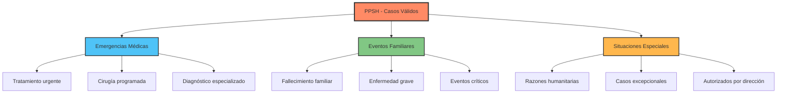
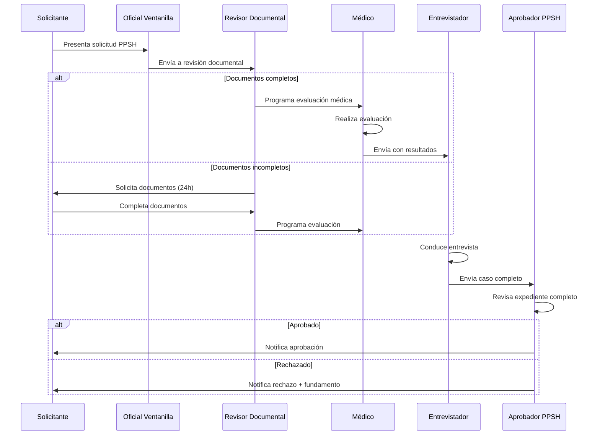

# Módulo 3: PPSH Avanzado

Proceso completo de Permisos Provisorios de Salida Humanitaria.

---

## 📊 Información del Módulo

| Parámetro | Detalle |
|-----------|---------|
| **Duración** | 4 horas |
| **Nivel** | Avanzado |
| **Prerequisitos** | Módulos 1 y 2 completados |
| **Certificación** | Requerido para oficiales de PPSH |

---

## 🎯 Objetivos de Aprendizaje

Al finalizar este módulo, los participantes serán capaces de:

- ✅ Procesar solicitudes PPSH completas
- ✅ Realizar revisión documental especializada
- ✅ Ejecutar evaluaciones médicas (para personal autorizado)
- ✅ Conducir entrevistas estructuradas
- ✅ Tomar decisiones fundamentadas
- ✅ Notificar resultados conforme a protocolo

---

## 3.1 Introducción al PPSH

**Duración**: 30 minutos

### ¿Qué es el PPSH?

El **Permiso Provisorio de Salida Humanitaria** es un proceso acelerado para situaciones excepcionales que requieren decisión rápida por razones humanitarias.

### Casos de Aplicación



### Diferencias con Trámites Regulares

| Aspecto | Trámite Regular | PPSH |
|---------|----------------|------|
| **Tiempo de respuesta** | 15-30 días | 24-72 horas |
| **Proceso** | Estándar completo | Acelerado especializado |
| **Evaluación médica** | Opcional | Obligatoria (casos aplicables) |
| **Entrevista** | Opcional | Obligatoria siempre |
| **Documentación** | Completa | Mínima esencial + justificación |
| **Aprobación** | Múltiples niveles | Decisión única especializada |
| **Seguimiento** | Estándar | Prioritario |

### Flujo Completo del PPSH



---

## 3.2 Etapa 1: Solicitud PPSH

**Duración**: 30 minutos

### Acceso al Módulo PPSH

```
Dashboard → Módulo "PPSH" → "Nueva Solicitud PPSH"
```

### Formulario de Solicitud

**Interfaz Completa**:

```
┌──────────────────────────────────────────────┐
│  🏥 NUEVA SOLICITUD PPSH                    │
├──────────────────────────────────────────────┤
│                                              │
│  ⚠️ PERMISO PROVISORIO SALIDA HUMANITARIA   │
│                                              │
│  Solo para casos que requieren decisión     │
│  urgente por razones humanitarias.          │
│                                              │
│  ══════════════════════════════════════════  │
│                                              │
│  DATOS DEL SOLICITANTE                      │
│  ─────────────────────                      │
│  Nombre Completo: *                         │
│  [_________________________]                │
│                                              │
│  Apellidos: *                               │
│  [_________________________]                │
│                                              │
│  Documento de Identidad: *                  │
│  Tipo: (•) Pasaporte  ( ) Cédula  ( ) Otro │
│  Número: [______________]                   │
│  País Emisor: [_________ ▼]                │
│                                              │
│  Fecha de Nacimiento: *                     │
│  [DD]/[MM]/[AAAA] 📅  Edad: 45 años        │
│                                              │
│  Sexo: *                                    │
│  (•) Masculino  ( ) Femenino  ( ) Otro     │
│                                              │
│  Nacionalidad: *                            │
│  [Venezuela ▼]                              │
│                                              │
│  Estado Civil:                              │
│  ( ) Soltero (•) Casado ( ) Divorciado     │
│                                              │
│  ──────────────────────────────────         │
│                                              │
│  DATOS DE CONTACTO                          │
│  ─────────────────                          │
│  Email: *                                   │
│  [_________________________]                │
│                                              │
│  Teléfono en Panamá: *                      │
│  +507 [____-____]                           │
│                                              │
│  Teléfono Alternativo:                      │
│  [_________________________]                │
│                                              │
│  Dirección Actual en Panamá: *              │
│  [_________________________]                │
│  [_________________________]                │
│                                              │
│  Provincia: [Panamá ▼]  Distrito: [▼]      │
│                                              │
│  ──────────────────────────────────         │
│                                              │
│  MOTIVO DE LA SOLICITUD PPSH                │
│  ───────────────────────────                │
│  Categoría: *                               │
│  (•) Emergencia Médica                      │
│  ( ) Fallecimiento Familiar                 │
│  ( ) Enfermedad Grave Familiar              │
│  ( ) Otra Razón Humanitaria                 │
│                                              │
│  Descripción Detallada: *                   │
│  [________________________________]         │
│  [________________________________]         │
│  [________________________________]         │
│  [________________________________]         │
│  Mín. 100 caracteres - 0/100                │
│                                              │
│  Urgencia: *                                │
│  (•) Muy Urgente (24h)                      │
│  ( ) Urgente (48h)                          │
│  ( ) Normal (72h)                           │
│                                              │
│  ──────────────────────────────────         │
│                                              │
│  INFORMACIÓN DEL CASO                       │
│  ────────────────────                       │
│  País de Destino: *                         │
│  [Colombia ▼]                               │
│                                              │
│  Ciudad de Destino: *                       │
│  [Bogotá]                                   │
│                                              │
│  Fecha Estimada de Salida: *                │
│  [DD]/[MM]/[AAAA] 📅                       │
│                                              │
│  Duración Estimada de Ausencia: *           │
│  [__] días  [__] meses                      │
│                                              │
│  ¿Tiene Familiar Acompañante?               │
│  ( ) Sí  (•) No                             │
│                                              │
│  [Si "Sí", agregar datos del acompañante]  │
│                                              │
└──────────────────────────────────────────────┘
```

### Documentación Requerida PPSH

**Panel de Documentos**:

```
┌──────────────────────────────────────────────┐
│  📎 DOCUMENTOS REQUERIDOS PPSH              │
├──────────────────────────────────────────────┤
│                                              │
│  OBLIGATORIOS PARA TODOS                    │
│  ─────────────────────────                  │
│  1. ✅ Pasaporte o Documento ID Válido *    │
│     [pasaporte_carlos.pdf] (2.3 MB) ❌      │
│                                              │
│  2. ⚠️ Fotografía Reciente (fondo blanco) *  │
│     [Arrastrar o click aquí]                │
│                                              │
│  3. ⚠️ Formulario PPSH Firmado *             │
│     [Descargar plantilla] → Completar       │
│     [Arrastrar o click aquí]                │
│                                              │
│  ──────────────────────────────────         │
│                                              │
│  DOCUMENTOS JUSTIFICATIVOS *                │
│  (Según tipo de caso)                       │
│  ─────────────────────────                  │
│                                              │
│  Para Emergencia Médica:                    │
│  4. ✅ Informe médico detallado             │
│     [informe_medico_cardiologo.pdf] ❌      │
│                                              │
│  5. ⚠️ Cita o referencia médica              │
│     [Arrastrar o click aquí]                │
│                                              │
│  6. ⚠️ Historia clínica (si disponible)      │
│     [Arrastrar o click aquí]                │
│                                              │
│  ──────────────────────────────────         │
│                                              │
│  DOCUMENTOS ADICIONALES                     │
│  ─────────────────────                      │
│  7. ⚠️ Boleto aéreo o reserva                │
│     [Arrastrar o click aquí]                │
│                                              │
│  8. ⚠️ Prueba de solvencia económica         │
│     [Arrastrar o click aquí]                │
│                                              │
│  9. Carta de apoyo familiar (opcional)      │
│     [Arrastrar o click aquí]                │
│                                              │
│  ──────────────────────────────────         │
│  Progreso: 2/8 documentos cargados          │
│  ████░░░░░░░░░░░░░░░░░░░░ 25%              │
│                                              │
└──────────────────────────────────────────────┘
```

### ✏️ Ejercicio Práctico 3.1: Crear Solicitud PPSH

**Tiempo**: 45 minutos

**Escenario Completo**:
> Carlos Rodríguez, ciudadano venezolano de 45 años, residente en Panamá desde hace 3 años, necesita viajar urgentemente a Colombia para recibir tratamiento cardíaco especializado. Su cardiólogo en Panamá lo refirió a un especialista en Bogotá debido a la complejidad de su caso. La cita está programada para dentro de 5 días.

**Datos del Caso**:

**Solicitante**:
- Nombre: Carlos Andrés
- Apellidos: Rodríguez Pérez
- Pasaporte: V-12345678
- Fecha de Nacimiento: 15/03/1980 (45 años)
- Sexo: Masculino
- Nacionalidad: Venezuela
- Estado Civil: Casado
- Email: carlos.rodriguez@email.com
- Teléfono: +507 6234-5678
- Dirección: Av. Balboa, Edificio Mar del Sur, Apto 15-C, Panamá

**Motivo**:
- Categoría: Emergencia Médica
- Urgencia: Muy Urgente (24h)
- Descripción:
  > "Requiero viajar urgentemente a Bogotá, Colombia, para consulta con cardiólogo especialista en valvulopatías. Mi cardiólogo en Panamá, Dr. Juan Martínez (Reg. 2345), me ha referido debido a la complejidad de mi condición (estenosis aórtica severa). La cita está programada para el 30/05/2025 en la Fundación Cardioinfantil. Requiero autorización para salir del país por 15 días."

**Información del Viaje**:
- País destino: Colombia
- Ciudad: Bogotá
- Fecha salida estimada: 28/05/2025
- Duración: 15 días
- Acompañante: No

**Archivos de Prueba** (carpeta compartida):
1. `pasaporte_carlos_rodriguez.pdf`
2. `foto_carlos_rodriguez.jpg`
3. `formulario_ppsh_carlos.pdf`
4. `informe_medico_cardiologia.pdf`
5. `cita_fundacion_cardioinfantil.pdf`
6. `historia_clinica_carlos.pdf`
7. `reserva_vuelo_bogota.pdf`
8. `extracto_bancario_carlos.pdf`

**Instrucciones Paso a Paso**:

1. **Acceder al módulo PPSH**
   - Dashboard → "PPSH" → "Nueva Solicitud PPSH"

2. **Completar datos del solicitante**
   - Ingresar todos los datos personales de Carlos
   - Verificar formato de fecha de nacimiento
   - Confirmar cálculo automático de edad

3. **Ingresar datos de contacto**
   - Email, teléfonos, dirección completa
   - Seleccionar provincia y distrito

4. **Describir motivo de la solicitud**
   - Seleccionar: "Emergencia Médica"
   - Nivel de urgencia: "Muy Urgente (24h)"
   - Copiar descripción proporcionada (verificar mín. 100 caracteres)

5. **Información del viaje**
   - País: Colombia, Ciudad: Bogotá
   - Fecha salida: 28/05/2025
   - Duración: 15 días
   - Sin acompañante

6. **Cargar documentación**
   - Cargar los 8 archivos en orden
   - Verificar que cada carga sea exitosa (✅)
   - Confirmar progreso 100%

7. **Revisión final**
   - Verificar todos los datos
   - Leer declaración jurada
   - Aceptar términos

8. **Enviar solicitud**
   - Click en "Enviar Solicitud PPSH"
   - Anotar número asignado: PPSH-______

**Checklist de Completitud**:

- [ ] Formulario personal 100% completo
- [ ] Descripción del motivo (mín. 100 caracteres)
- [ ] 8 documentos cargados correctamente
- [ ] Información del viaje verificada
- [ ] Solicitud enviada exitosamente
- [ ] Número PPSH anotado
- [ ] Email de confirmación recibido

---

## 3.3 Etapa 2: Revisión Documental

**Duración**: 45 minutos

### Rol del Revisor Documental

El revisor verifica la completitud y validez de la documentación presentada.

### Panel de Revisión

```
┌──────────────────────────────────────────────┐
│  📋 REVISIÓN DOCUMENTAL - PPSH-00045        │
├──────────────────────────────────────────────┤
│                                              │
│  Solicitante: Carlos Andrés Rodríguez Pérez │
│  Estado: 🟡 En Revisión Documental          │
│  Urgencia: 🔴 Muy Urgente (24h)             │
│  Creado: 25/05/2025 09:30 AM               │
│  Tiempo transcurrido: 2 horas 15 min        │
│                                              │
│  ══════════════════════════════════════════  │
│                                              │
│  CHECKLIST DE DOCUMENTOS                    │
│  ───────────────────────                    │
│                                              │
│  1. Documento de Identidad                  │
│     ☑ Pasaporte V-12345678                  │
│     Verificación:                           │
│     ☑ Vigente (vence 12/2027)              │
│     ☑ Legible y completo                   │
│     ☑ Datos coinciden con solicitud        │
│     [  ✅ Aprobar  ] [  ❌ Rechazar  ]      │
│                                              │
│  2. Fotografía                              │
│     ☑ Cumple requisitos (fondo blanco)     │
│     ☑ Reciente (menos de 6 meses)          │
│     [  ✅ Aprobar  ] [  ❌ Rechazar  ]      │
│                                              │
│  3. Formulario PPSH                         │
│     ☑ Formulario oficial completo          │
│     ☑ Firma del solicitante                │
│     ☑ Fecha actual                          │
│     [  ✅ Aprobar  ] [  ❌ Rechazar  ]      │
│                                              │
│  4. Informe Médico                          │
│     ☑ Emitido por médico colegiado         │
│     ☑ Fecha reciente (última semana)       │
│     ☑ Detalla diagnóstico y tratamiento    │
│     ☑ Justifica necesidad de viaje         │
│     Observaciones:                          │
│     Dr. Juan Martínez, Reg. 2345           │
│     Diagnóstico: Estenosis aórtica severa  │
│     Recomienda evaluación especializada    │
│     [  ✅ Aprobar  ] [  ❌ Rechazar  ]      │
│                                              │
│  5. Cita Médica en Destino                  │
│     ☑ Documento oficial de institución     │
│     ☑ Fecha y hora específicas             │
│     ☑ Datos del paciente coinciden         │
│     Cita: 30/05/2025 10:00 AM              │
│     Lugar: Fundación Cardioinfantil        │
│     [  ✅ Aprobar  ] [  ❌ Rechazar  ]      │
│                                              │
│  6. Historia Clínica                        │
│     ☑ Documentación médica completa        │
│     ☑ Soporta diagnóstico actual           │
│     [  ✅ Aprobar  ] [  ❌ Rechazar  ]      │
│                                              │
│  7. Reserva de Vuelo                        │
│     ☑ Fechas coinciden con solicitud       │
│     ☑ Destino: Bogotá, Colombia            │
│     Vuelo: Copa CM-123, 28/05/2025         │
│     [  ✅ Aprobar  ] [  ❌ Rechazar  ]      │
│                                              │
│  8. Solvencia Económica                     │
│     ☑ Extracto bancario reciente           │
│     ☑ Fondos suficientes para el viaje     │
│     Saldo: USD 5,200                        │
│     [  ✅ Aprobar  ] [  ❌ Rechazar  ]      │
│                                              │
│  ══════════════════════════════════════════  │
│                                              │
│  DECISIÓN DE REVISIÓN                       │
│  ────────────────────                       │
│  (•) Documentación Completa                 │
│      → Enviar a Evaluación Médica           │
│                                              │
│  ( ) Documentación Incompleta               │
│      → Solicitar documentos faltantes       │
│      Especificar: [________________]        │
│                                              │
│  ( ) Documentación Inválida                 │
│      → Rechazar solicitud                   │
│      Motivo: [________________]             │
│                                              │
│  Comentarios del Revisor:                   │
│  [________________________________]         │
│  [________________________________]         │
│                                              │
│  [  Enviar Decisión  ]                      │
│                                              │
└──────────────────────────────────────────────┘
```

### Criterios de Validación

#### Documentos de Identidad

✅ **Aprobar si**:
- Vigente (no vencido)
- Legible (todas las páginas claras)
- Datos coinciden con solicitud
- Fotografía visible y reconocible

❌ **Rechazar si**:
- Vencido o por vencer (menos de 3 meses)
- Ilegible o parcialmente escaneado
- Datos no coinciden
- Documento aparentemente alterado

#### Documentación Médica

✅ **Aprobar si**:
- Emitido por profesional colegiado
- Fecha reciente (menos de 30 días)
- Diagnóstico claro y detallado
- Justifica necesidad del viaje
- Incluye tratamiento recomendado

❌ **Rechazar si**:
- Sin firma o sello médico
- Fecha antigua (más de 30 días)
- Diagnóstico vago o incompleto
- No justifica urgencia
- Documento no oficial

### ✏️ Ejercicio Práctico 3.2: Revisar Documentación

**Tiempo**: 30 minutos

**Objetivo**: Realizar revisión documental completa del caso de Carlos

**Instrucciones**:

1. **Acceder al caso**
   - PPSH → "Pendientes de Revisión"
   - Seleccionar PPSH-00045 (Carlos Rodríguez)

2. **Revisar cada documento**
   - Abrir cada archivo PDF/imagen
   - Verificar cumplimiento de criterios
   - Marcar ☑ cada item validado

3. **Verificar coherencia**
   - Fechas consistentes
   - Nombres coinciden en todos los documentos
   - Diagnóstico médico coherente con cita

4. **Completar checklist**
   - Aprobar cada documento válido
   - Si algo falta, especificar qué

5. **Tomar decisión**
   - Seleccionar opción apropiada
   - Agregar comentario del revisor

6. **Enviar decisión**
   - Confirmar y enviar

**Ejercicio de Rol**: En parejas

- **Persona A**: Revisor que encuentra todo correcto
- **Persona B**: Revisor que encuentra un documento faltante

Comparar resultados y discutir decisiones.

---

## 3.4 Etapa 3: Evaluación Médica

**Duración**: 45 minutos

### Rol del Médico Evaluador

El médico del SNM realiza evaluación para confirmar:

1. Condición médica justifica el viaje
2. Paciente está en condiciones de viajar
3. Urgencia es genuina

### Panel de Evaluación Médica

```
┌──────────────────────────────────────────────┐
│  🏥 EVALUACIÓN MÉDICA - PPSH-00045          │
├──────────────────────────────────────────────┤
│                                              │
│  Paciente: Carlos Andrés Rodríguez Pérez    │
│  Edad: 45 años | Sexo: Masculino            │
│  Urgencia: 🔴 Muy Urgente                   │
│                                              │
│  ══════════════════════════════════════════  │
│                                              │
│  REVISIÓN DE DOCUMENTACIÓN MÉDICA           │
│  ────────────────────────────────           │
│                                              │
│  Diagnóstico Reportado:                     │
│  Estenosis aórtica severa                   │
│                                              │
│  Médico Remitente:                          │
│  Dr. Juan Martínez, Cardiólogo              │
│  Registro: 2345                             │
│                                              │
│  Tratamiento Propuesto:                     │
│  Evaluación para reemplazo valvular         │
│                                              │
│  [📄 Ver Informe Médico Completo]           │
│  [📄 Ver Historia Clínica]                  │
│                                              │
│  ══════════════════════════════════════════  │
│                                              │
│  EVALUACIÓN MÉDICA PRESENCIAL               │
│  ────────────────────────────────           │
│                                              │
│  Fecha Evaluación: 25/05/2025 14:00        │
│  Médico Evaluador: Dra. Patricia López     │
│  Lugar: Oficina SNM, Panamá                │
│                                              │
│  SIGNOS VITALES                             │
│  ──────────────                             │
│  Presión Arterial: [___/___] mmHg          │
│  Frecuencia Cardíaca: [___] lpm            │
│  Frecuencia Respiratoria: [___] rpm        │
│  Temperatura: [___] °C                      │
│  Saturación O2: [___] %                     │
│                                              │
│  EXAMEN FÍSICO                              │
│  ────────────                               │
│  Apariencia General:                        │
│  [________________________________]         │
│                                              │
│  Auscultación Cardíaca:                     │
│  [________________________________]         │
│  [________________________________]         │
│                                              │
│  Auscultación Pulmonar:                     │
│  [________________________________]         │
│                                              │
│  Otros Hallazgos Relevantes:                │
│  [________________________________]         │
│  [________________________________]         │
│                                              │
│  CAPACIDAD DE VIAJE                         │
│  ──────────────────                         │
│  ¿Paciente en condiciones de viajar?       │
│  (•) Sí, sin restricciones                  │
│  ( ) Sí, con recomendaciones                │
│  ( ) No, contraindicado                     │
│                                              │
│  Recomendaciones para el Viaje:             │
│  [________________________________]         │
│  [________________________________]         │
│                                              │
│  VALIDACIÓN DEL CASO                        │
│  ───────────────────                        │
│  ¿El diagnóstico justifica viaje urgente?  │
│  (•) Sí  ( ) No                             │
│                                              │
│  ¿La urgencia es genuina?                   │
│  (•) Sí  ( ) No                             │
│                                              │
│  Nivel de Prioridad Médica:                 │
│  (•) Alta  ( ) Media  ( ) Baja              │
│                                              │
│  ══════════════════════════════════════════  │
│                                              │
│  CONCLUSIÓN MÉDICA                          │
│  ──────────────────                         │
│  [________________________________]         │
│  [________________________________]         │
│  [________________________________]         │
│  [________________________________]         │
│                                              │
│  Recomendación:                             │
│  (•) Aprobar PPSH                           │
│  ( ) Denegar PPSH                           │
│  ( ) Solicitar estudios adicionales         │
│                                              │
│  Firma Digital: [___________]               │
│  Sello Profesional: [___________]           │
│                                              │
│  [  Guardar Evaluación  ]  [  Enviar  ]    │
│                                              │
└──────────────────────────────────────────────┘
```

### Criterios de Evaluación

#### Validación del Diagnóstico

✅ **Aprobar si**:
- Diagnóstico coherente con documentación
- Condición requiere atención especializada
- Justificación médica clara
- Urgencia fundamentada

❌ **Denegar si**:
- Diagnóstico no justifica viaje urgente
- Tratamiento disponible en Panamá
- Urgencia no fundamentada
- Documentación inconsistente

#### Capacidad de Viaje

✅ **Aprobar si**:
- Signos vitales estables
- Paciente puede viajar sin riesgo
- No hay contraindicaciones
- Condición controlada

❌ **Denegar si**:
- Inestabilidad hemodinámica
- Riesgo alto durante viaje
- Contraindicación médica para volar
- Requiere atención inmediata local

### ✏️ Ejercicio Práctico 3.3: Evaluación Médica (Role-Play)

**Tiempo**: 30 minutos

**Actividad en Parejas**:

**Rol A - Médico Evaluador**: Dra. Patricia López  
**Rol B - Paciente**: Carlos Rodríguez

**Escenario**:
Realizar evaluación médica presencial del caso PPSH-00045.

**Guion para Médico**:
1. Revisar documentación médica previa
2. Tomar signos vitales (simulados)
3. Realizar auscultación cardíaca (simulada)
4. Preguntar sobre síntomas actuales
5. Verificar medicación actual
6. Evaluar capacidad de viaje
7. Completar formulario de evaluación

**Guion para Paciente**:
- Reportar síntomas: Dolor torácico ocasional, fatiga al esfuerzo
- Medicación: Betabloqueador (metoprolol 50mg/día)
- Última crisis: Hace 2 semanas
- Preocupación por el viaje en avión

**Datos para Simulación**:
- Presión Arterial: 135/85 mmHg
- Frecuencia Cardíaca: 78 lpm
- Saturación O2: 96%
- Temperatura: 36.7°C

**Resultado Esperado**:
Médico completa evaluación y recomienda aprobación con recomendaciones de viaje.

**Checklist**:
- [ ] Signos vitales registrados
- [ ] Examen físico documentado
- [ ] Capacidad de viaje evaluada
- [ ] Recomendaciones de viaje escritas
- [ ] Conclusión médica clara
- [ ] Formulario firmado digitalmente

---

## 3.5 Etapa 4: Entrevista

**Duración**: 45 minutos

### Objetivo de la Entrevista

Verificar:
1. Autenticidad del caso
2. Coherencia de la información
3. Situación real del solicitante
4. Necesidad genuina del permiso

### Guion de Entrevista PPSH

**Panel del Entrevistador**:

```
┌──────────────────────────────────────────────┐
│  🎤 ENTREVISTA PPSH - PPSH-00045            │
├──────────────────────────────────────────────┤
│                                              │
│  Entrevistado: Carlos Andrés Rodríguez      │
│  Fecha: 25/05/2025 16:00                    │
│  Entrevistador: Lic. Ana Martínez           │
│  Modalidad: (•) Presencial  ( ) Virtual     │
│                                              │
│  ══════════════════════════════════════════  │
│                                              │
│  SECCIÓN 1: INFORMACIÓN PERSONAL            │
│  ───────────────────────────────            │
│                                              │
│  P1: Confirme su nombre completo            │
│  R: [________________________________]      │
│                                              │
│  P2: ¿Cuánto tiempo lleva en Panamá?        │
│  R: [________________________________]      │
│                                              │
│  P3: ¿Cuál es su ocupación actual?          │
│  R: [________________________________]      │
│                                              │
│  P4: ¿Estado migratorio actual en Panamá?   │
│  R: [________________________________]      │
│                                              │
│  ══════════════════════════════════════════  │
│                                              │
│  SECCIÓN 2: MOTIVO DEL VIAJE                │
│  ──────────────────────                     │
│                                              │
│  P5: Explique con sus propias palabras      │
│      la razón de su solicitud PPSH          │
│  R: [________________________________]      │
│     [________________________________]      │
│     [________________________________]      │
│                                              │
│  Coherencia con documentación:              │
│  (•) Alta  ( ) Media  ( ) Baja              │
│                                              │
│  P6: ¿Cuándo comenzaron los síntomas?       │
│  R: [________________________________]      │
│                                              │
│  P7: ¿Ha recibido tratamiento en Panamá?    │
│  R: [________________________________]      │
│                                              │
│  P8: ¿Por qué necesita viajar a Colombia?   │
│      ¿Por qué no puede tratarse aquí?       │
│  R: [________________________________]      │
│     [________________________________]      │
│                                              │
│  ══════════════════════════════════════════  │
│                                              │
│  SECCIÓN 3: DETALLES DEL VIAJE              │
│  ─────────────────────────                  │
│                                              │
│  P9: ¿Fecha exacta de su viaje?             │
│  R: [________________________________]      │
│                                              │
│  P10: ¿Tiene reservas confirmadas?          │
│  R: [________________________________]      │
│                                              │
│  P11: ¿Dónde se hospedará en Colombia?      │
│  R: [________________________________]      │
│                                              │
│  P12: ¿Tiene familiares allá?               │
│  R: [________________________________]      │
│                                              │
│  P13: ¿Cuánto tiempo estará fuera?          │
│  R: [________________________________]      │
│                                              │
│  P14: ¿Tiene intención de regresar a Panamá?│
│  R: [________________________________]      │
│                                              │
│  Indicadores de intención de retorno:       │
│  ☑ Tiene trabajo en Panamá                  │
│  ☑ Tiene familia en Panamá                  │
│  ☑ Tiene propiedades/contratos              │
│  ☐ Boleto de regreso confirmado            │
│                                              │
│  ══════════════════════════════════════════  │
│                                              │
│  SECCIÓN 4: SOLVENCIA ECONÓMICA             │
│  ──────────────────────────────             │
│                                              │
│  P15: ¿Cómo financiará el viaje?            │
│  R: [________________________________]      │
│                                              │
│  P16: ¿Tiene fondos suficientes para        │
│       tratamiento y estadía?                │
│  R: [________________________________]      │
│                                              │
│  Evaluación de solvencia:                   │
│  (•) Adecuada  ( ) Insuficiente             │
│                                              │
│  ══════════════════════════════════════════  │
│                                              │
│  SECCIÓN 5: EVALUACIÓN FINAL                │
│  ──────────────────────────                 │
│                                              │
│  Actitud del entrevistado:                  │
│  (•) Cooperativo  ( ) Evasivo  ( ) Hostil   │
│                                              │
│  Coherencia general:                        │
│  (•) Alta  ( ) Media  ( ) Baja              │
│                                              │
│  Credibilidad del caso:                     │
│  (•) Alta  ( ) Media  ( ) Baja              │
│                                              │
│  Riesgo de no retorno:                      │
│  ( ) Alto  ( ) Medio  (•) Bajo              │
│                                              │
│  OBSERVACIONES DEL ENTREVISTADOR:           │
│  [________________________________]         │
│  [________________________________]         │
│  [________________________________]         │
│                                              │
│  RECOMENDACIÓN:                             │
│  (•) Aprobar PPSH                           │
│  ( ) Denegar PPSH                           │
│  ( ) Solicitar información adicional        │
│                                              │
│  Fundamento:                                │
│  [________________________________]         │
│  [________________________________]         │
│                                              │
│  Firma Entrevistador: [____________]        │
│                                              │
│  [  Guardar  ]  [  Enviar a Aprobación  ]  │
│                                              │
└──────────────────────────────────────────────┘
```

### Señales de Alerta (Red Flags)

❌ **Señales Negativas**:
- Respuestas evasivas o contradictorias
- Falta de detalles sobre el tratamiento
- No puede explicar su condición médica
- No tiene plan de retorno claro
- Documentación inconsistente con relato
- No tiene vínculos en Panamá
- Actitud hostil o no cooperativa

✅ **Señales Positivas**:
- Respuestas claras y coherentes
- Detalla su condición médicamente
- Plan de viaje específico y razonable
- Vínculos fuertes en Panamá (familia, trabajo)
- Documentación coincide con relato
- Actitud cooperativa
- Evidencia de intención de retorno

### ✏️ Ejercicio Práctico 3.4: Entrevista PPSH (Role-Play)

**Tiempo**: 40 minutos

**Actividad en Parejas**:

**Rol A - Entrevistador**: Lic. Ana Martínez  
**Rol B - Solicitante**: Carlos Rodríguez

**Duración**: 20 minutos de entrevista + 10 min evaluación

**Instrucciones para Entrevistador**:
1. Seguir guion de 16 preguntas
2. Tomar notas de respuestas
3. Observar lenguaje corporal (simulado)
4. Evaluar coherencia
5. Completar formulario
6. Dar recomendación fundamentada

**Instrucciones para Solicitante**:
- Responder coherentemente según el caso
- Mostrar documentación cuando se solicite
- Ser cooperativo pero realista
- Expresar preocupación genuina

**Escenario Adicional** (Instructor asigna):

**Variante A - Caso Genuino**: Solicitante es coherente, caso real  
**Variante B - Caso Dudoso**: Solicitante es evasivo, inconsistencias

**Después del Role-Play**:
- Cambiar roles y repetir con otro caso
- Discutir en grupo las diferencias observadas
- Compartir recomendaciones finales

---

## 3.6 Etapa 5: Decisión Final

**Duración**: 30 minutos

### Panel de Aprobación PPSH

El aprobador revisa el expediente completo:

```
┌──────────────────────────────────────────────┐
│  ✅ DECISIÓN FINAL - PPSH-00045             │
├──────────────────────────────────────────────┤
│                                              │
│  Solicitante: Carlos Andrés Rodríguez Pérez │
│  Urgencia: 🔴 Muy Urgente (24h)             │
│  Tiempo transcurrido: 6 horas 30 min        │
│                                              │
│  ══════════════════════════════════════════  │
│                                              │
│  EXPEDIENTE COMPLETO                        │
│  ──────────────────                         │
│                                              │
│  1. ✅ Solicitud Inicial                    │
│     Fecha: 25/05/2025 09:30                 │
│     Motivo: Emergencia médica cardíaca      │
│                                              │
│  2. ✅ Revisión Documental                  │
│     Revisor: Juan Pérez                     │
│     Resultado: APROBADO                     │
│     Documentos: 8/8 completos y válidos     │
│                                              │
│  3. ✅ Evaluación Médica                    │
│     Médico: Dra. Patricia López             │
│     Resultado: APROBADO                     │
│     Conclusión: "Diagnóstico válido,        │
│     paciente en condiciones de viajar,      │
│     urgencia justificada"                   │
│                                              │
│  4. ✅ Entrevista                           │
│     Entrevistador: Lic. Ana Martínez        │
│     Resultado: APROBADO                     │
│     Conclusión: "Caso genuino, coherente,   │
│     vínculos en Panamá, bajo riesgo"        │
│                                              │
│  ══════════════════════════════════════════  │
│                                              │
│  ANÁLISIS INTEGRAL                          │
│  ─────────────────                          │
│                                              │
│  Fortalezas del Caso:                       │
│  ✓ Documentación médica completa y válida   │
│  ✓ Urgencia médica fundamentada             │
│  ✓ Evaluación médica positiva               │
│  ✓ Entrevista coherente                     │
│  ✓ Vínculos fuertes en Panamá               │
│  ✓ Solvencia económica demostrada           │
│  ✓ Plan de viaje específico                 │
│                                              │
│  Aspectos a Considerar:                     │
│  ⚠️ Viaje requiere seguimiento médico       │
│  ⚠️ Condición cardíaca requiere precaución  │
│                                              │
│  Riesgos Identificados:                     │
│  • Riesgo de no retorno: BAJO               │
│  • Riesgo médico en viaje: MEDIO-CONTROLADO│
│  • Riesgo documental: NINGUNO               │
│                                              │
│  ══════════════════════════════════════════  │
│                                              │
│  DECISIÓN DEL APROBADOR                     │
│  ──────────────────────                     │
│                                              │
│  (•) APROBAR PPSH                           │
│      Vigencia: [15] días                    │
│      Condiciones especiales: [______]       │
│                                              │
│  ( ) DENEGAR PPSH                           │
│      Fundamento: [_________________]        │
│                                              │
│  ( ) SOLICITAR INFORMACIÓN ADICIONAL        │
│      Especificar: [_________________]       │
│                                              │
│  FUNDAMENTO DE LA DECISIÓN:                 │
│  [________________________________]         │
│  [________________________________]         │
│  [________________________________]         │
│  [________________________________]         │
│                                              │
│  Recomendaciones para el Solicitante:       │
│  [________________________________]         │
│  [________________________________]         │
│                                              │
│  Aprobador: [_______________]               │
│  Firma Digital: [___________]               │
│  Fecha/Hora: 25/05/2025 16:00              │
│                                              │
│  [  Guardar Borrador  ]  [  🚀 APROBAR  ]  │
│                                              │
└──────────────────────────────────────────────┘
```

### Criterios de Decisión

#### Aprobación Recomendada ✅

- ✅ Documentación completa y válida
- ✅ Evaluación médica positiva
- ✅ Entrevista coherente y creíble
- ✅ Urgencia justificada
- ✅ Bajo riesgo de no retorno
- ✅ Solvencia económica demostrada

#### Denegación Recomendada ❌

- ❌ Documentación incompleta o fraudulenta
- ❌ Evaluación médica negativa
- ❌ Entrevista inconsistente
- ❌ Urgencia no justificada
- ❌ Alto riesgo de no retorno
- ❌ Falta de solvencia

---

## 3.7 Etapa 6: Notificación

**Duración**: 15 minutos

### Notificación de Aprobación

```
┌──────────────────────────────────────────────┐
│  ✅ NOTIFICACIÓN DE APROBACIÓN PPSH         │
├──────────────────────────────────────────────┤
│                                              │
│  Número: PPSH-00045                         │
│  Fecha: 25/05/2025 16:15                    │
│                                              │
│  Estimado/a: Carlos Andrés Rodríguez Pérez  │
│                                              │
│  Nos complace informarle que su solicitud   │
│  de Permiso Provisorio de Salida            │
│  Humanitaria ha sido APROBADA.              │
│                                              │
│  DETALLES DE LA APROBACIÓN:                 │
│  ──────────────────────                     │
│  Vigencia: 15 días                          │
│  Desde: 28/05/2025                          │
│  Hasta: 12/06/2025                          │
│                                              │
│  País autorizado: Colombia                  │
│  Propósito: Tratamiento médico especializado│
│                                              │
│  PRÓXIMOS PASOS:                            │
│  ──────────────                             │
│  1. Descargar certificado PPSH (PDF)        │
│  2. Imprimir y llevar al viajar             │
│  3. Presentar en migración de salida        │
│  4. Presentar en migración de retorno       │
│                                              │
│  IMPORTANTE:                                │
│  ⚠️ Este permiso es válido únicamente para  │
│     el período y destino especificados      │
│  ⚠️ Debe retornar antes del 12/06/2025      │
│  ⚠️ Portar documentación médica al viajar   │
│                                              │
│  [  📥 Descargar Certificado  ]             │
│  [  📧 Enviar por Email  ]                  │
│  [  🖨️ Imprimir  ]                          │
│                                              │
│  Contacto: ppsh@migracion.gob.pa            │
│  Teléfono: +507-500-0000 ext. 3456         │
│                                              │
└──────────────────────────────────────────────┘
```

### Certificado PPSH

El solicitante recibe certificado oficial:

```
┌────────────────────────────────────────────┐
│                                            │
│       GOBIERNO DE LA REPÚBLICA DE PANAMÁ   │
│        SERVICIO NACIONAL DE MIGRACIÓN      │
│                                            │
│  🇵🇦 CERTIFICADO DE PERMISO PROVISORIO 🇵🇦 │
│       DE SALIDA HUMANITARIA (PPSH)        │
│                                            │
│  ────────────────────────────────────      │
│                                            │
│  No. PPSH-00045                            │
│  Fecha de Emisión: 25/05/2025              │
│                                            │
│  DATOS DEL TITULAR:                        │
│  Nombre: Carlos Andrés Rodríguez Pérez     │
│  Pasaporte: V-12345678                     │
│  Nacionalidad: Venezuela                   │
│  Fecha de Nacimiento: 15/03/1980           │
│                                            │
│  AUTORIZACIÓN:                             │
│  Destino: República de Colombia            │
│  Motivo: Tratamiento Médico Especializado  │
│  Vigencia: 28/05/2025 al 12/06/2025        │
│  Duración: 15 días                         │
│                                            │
│  CONDICIONES:                              │
│  - Portar documentación médica             │
│  - Retornar antes de la fecha límite       │
│  - Presentar en control migratorio         │
│                                            │
│  ────────────────────────────────────      │
│                                            │
│  Aprobado por:                             │
│  Director PPSH                             │
│  SNM Panamá                                │
│                                            │
│  [FIRMA DIGITAL]    [SELLO OFICIAL]        │
│                                            │
│  QR Code: [QR]    Verificable en:          │
│            tramites.migracion.gob.pa       │
│                                            │
└────────────────────────────────────────────┘
```

---

## 3.8 Evaluación del Módulo 3

**Duración**: 20 minutos

### Quiz del Módulo

#### Pregunta 1-10

1. **¿Cuál es el tiempo máximo de respuesta para un PPSH "Muy Urgente"?**
   - [x] a) 24 horas
   - [ ] b) 48 horas
   - [ ] c) 72 horas
   - [ ] d) 1 semana

2. **Las 6 etapas del proceso PPSH son:**
   - [x] a) Solicitud, Revisión, Evaluación Médica, Entrevista, Decisión, Notificación
   - [ ] b) Solicitud, Aprobación, Emisión
   - [ ] c) Creación, Revisión, Decisión
   - [ ] d) Inicio, Proceso, Finalización

3. **La evaluación médica es obligatoria:**
   - [x] a) En todos los casos PPSH
   - [ ] b) Solo en emergencias médicas
   - [ ] c) Solo si el aprobador lo solicita
   - [ ] d) Es opcional

4. **¿Qué documentos son SIEMPRE obligatorios en PPSH?**
   - [x] a) Pasaporte, foto, formulario PPSH, documentos justificativos
   - [ ] b) Solo pasaporte
   - [ ] c) Pasaporte y boleto aéreo
   - [ ] d) Solo formulario PPSH

5. **La entrevista PPSH busca verificar:**
   - [x] a) Autenticidad del caso, coherencia, intención de retorno
   - [ ] b) Solo datos personales
   - [ ] c) Únicamente solvencia económica
   - [ ] d) Solo el motivo del viaje

6. **Una señal de alerta (red flag) en la entrevista es:**
   - [x] a) Respuestas evasivas y contradictorias
   - [ ] b) Tener familia en Panamá
   - [ ] c) Tener trabajo estable
   - [ ] d) Documentación completa

7. **El revisor documental debe verificar:**
   - [x] a) Completitud, validez, coherencia de documentos
   - [ ] b) Solo que existan archivos
   - [ ] c) Solo el pasaporte
   - [ ] d) Solo la fotografía

8. **¿Qué profesional realiza la evaluación médica?**
   - [x] a) Médico autorizado del SNM
   - [ ] b) Cualquier médico
   - [ ] c) El revisor documental
   - [ ] d) El entrevistador

9. **El certificado PPSH se entrega:**
   - [x] a) Después de la aprobación final
   - [ ] b) Al crear la solicitud
   - [ ] c) Después de la entrevista
   - [ ] d) Antes de la evaluación médica

10. **PPSH se diferencia de trámites regulares en:**
    - [x] a) Tiempo de respuesta acelerado (24-72h vs 15-30 días)
    - [ ] b) No requiere documentación
    - [ ] c) No tiene entrevista
    - [ ] d) Es más lento

### Respuestas: 1-a, 2-a, 3-a, 4-a, 5-a, 6-a, 7-a, 8-a, 9-a, 10-a

**Puntuación**: ____ / 10 (80% mínimo para oficial PPSH)

---

## 📚 Resumen del Módulo

✅ PPSH es proceso acelerado para casos humanitarios (24-72h)  
✅ 6 etapas: Solicitud → Revisión → Evaluación Médica → Entrevista → Decisión → Notificación  
✅ Evaluación médica y entrevista son OBLIGATORIAS  
✅ Revisor valida documentación completa y coherente  
✅ Entrevistador verifica autenticidad y riesgo de no retorno  
✅ Certificado PPSH es documento oficial de autorización  

---

[← Módulo 2](modulo-02.md) | [Índice](index.md) | [Módulo 4 →](modulo-04.md)
