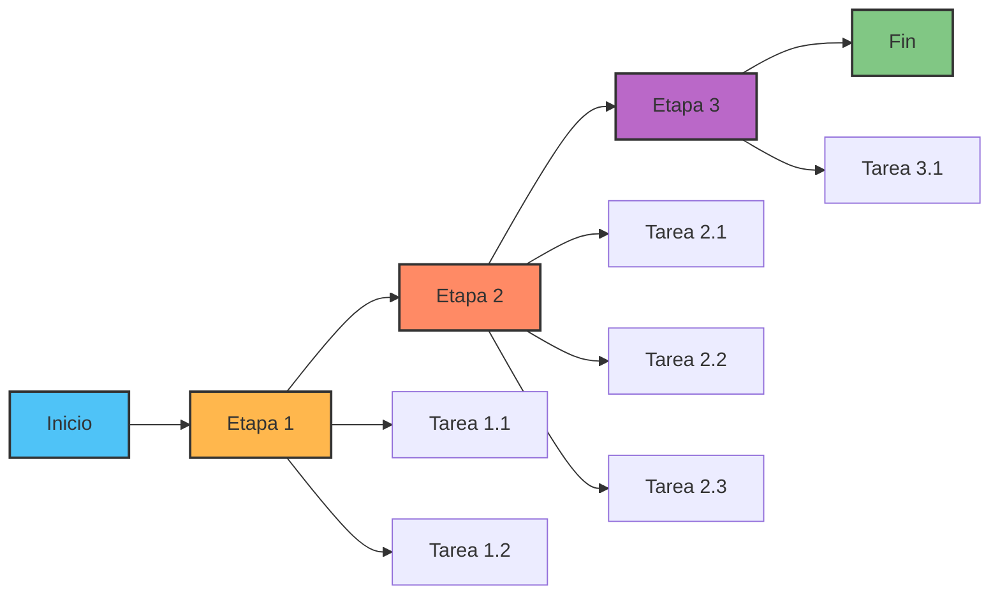
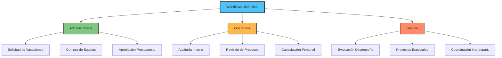
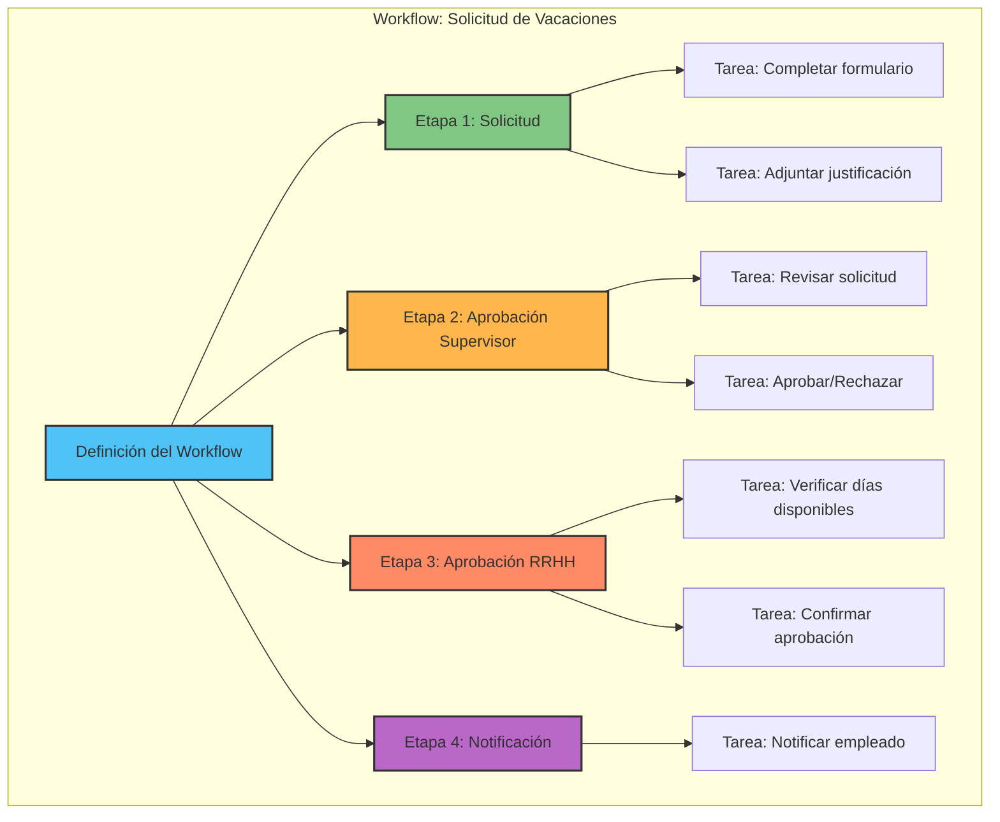
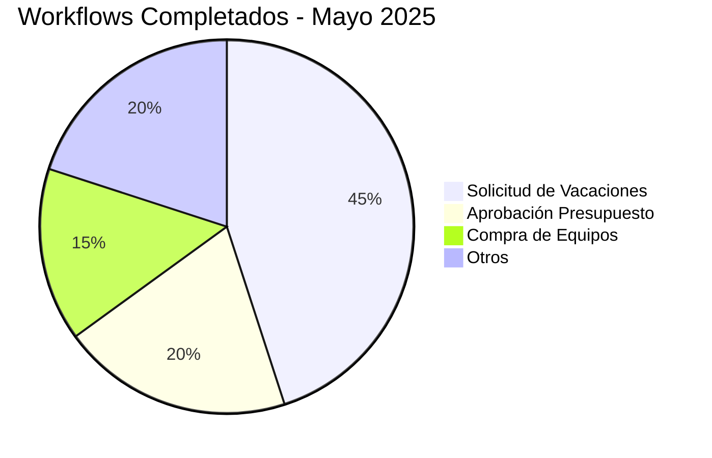

# Módulo 4: Workflows Dinámicos

Creación y gestión de procesos personalizados con workflows.

---

## 📊 Información del Módulo

| Parámetro | Detalle |
|-----------|---------|
| **Duración** | 3 horas |
| **Nivel** | Intermedio-Avanzado |
| **Prerequisitos** | Módulos 1, 2 y 3 completados |
| **Certificación** | Requerido para administradores y supervisores |

---

## 🎯 Objetivos de Aprendizaje

Al finalizar este módulo, los participantes serán capaces de:

- ✅ Comprender el concepto de workflows dinámicos
- ✅ Crear workflows personalizados desde cero
- ✅ Definir etapas y tareas con responsables
- ✅ Ejecutar instancias de workflows
- ✅ Monitorear progreso de tareas
- ✅ Generar reportes de workflows

---

## 4.1 Introducción a Workflows

**Duración**: 30 minutos

### ¿Qué son los Workflows Dinámicos?

Los **Workflows Dinámicos** permiten crear procesos personalizados para cualquier tipo de actividad que requiera múltiples pasos y responsables.



### Diferencia: Trámites vs Workflows

| Aspecto | Trámites Base | Workflows Dinámicos |
|---------|---------------|---------------------|
| **Estructura** | Fija y predefinida | Personalizable |
| **Proceso** | Estandarizado | Adaptable a necesidades |
| **Etapas** | Rígidas | Configurables |
| **Responsables** | Por roles fijos | Asignación flexible |
| **Uso** | Procesos migratorios | Cualquier proceso institucional |
| **Ejemplos** | Visas, Residencias, PPSH | Aprobaciones, Revisiones, Coordinación |

### Casos de Uso



### Componentes de un Workflow



**Elementos Clave**:

1. **Workflow**: Proceso completo (ej: Solicitud de Vacaciones)
2. **Etapas**: Fases del proceso (Solicitud → Aprobación → Notificación)
3. **Tareas**: Actividades específicas dentro de cada etapa
4. **Responsables**: Quién ejecuta cada tarea
5. **Orden**: Secuencia de ejecución (secuencial o paralelo)

---

## 4.2 Creación de Workflows

**Duración**: 45 minutos

### Acceso al Módulo de Workflows

```
Dashboard → Módulo "Workflows" → "Crear Workflow"
```

### Paso 1: Información General

**Interfaz**:

```
┌──────────────────────────────────────────────┐
│  🔄 CREAR NUEVO WORKFLOW                    │
├──────────────────────────────────────────────┤
│                                              │
│  INFORMACIÓN GENERAL                        │
│  ──────────────────                         │
│                                              │
│  Nombre del Workflow: *                     │
│  [_________________________]                │
│  Ej: Solicitud de Vacaciones                │
│                                              │
│  Descripción: *                             │
│  [_________________________]                │
│  [_________________________]                │
│  [_________________________]                │
│                                              │
│  Categoría: *                               │
│  [Seleccionar ▼]                            │
│  • Recursos Humanos                         │
│  • Administrativo                           │
│  • Operativo                                │
│  • Financiero                               │
│  • Otro                                     │
│                                              │
│  Tiempo Estimado Total:                     │
│  [__] días  [__] horas                      │
│                                              │
│  Nivel de Prioridad:                        │
│  ( ) Alta  (•) Normal  ( ) Baja             │
│                                              │
│  ¿Requiere Aprobación Final?                │
│  (•) Sí  ( ) No                             │
│                                              │
│  [  Cancelar  ]     [  Siguiente →  ]      │
│                                              │
└──────────────────────────────────────────────┘
```

### Paso 2: Definir Etapas

```
┌──────────────────────────────────────────────┐
│  🔄 ETAPAS DEL WORKFLOW                     │
│     "Solicitud de Vacaciones"               │
├──────────────────────────────────────────────┤
│                                              │
│  ETAPAS DEFINIDAS (3)                       │
│  ─────────────────                          │
│                                              │
│  1️⃣ Etapa 1: Solicitud Inicial              │
│     ━━━━━━━━━━━━━━━━━━━━━━━━━━━━           │
│     Orden: 1                                │
│     Duración estimada: 1 día                │
│     Tareas: 2                               │
│     [✏️ Editar] [❌ Eliminar]               │
│                                              │
│  2️⃣ Etapa 2: Aprobación Supervisor          │
│     ━━━━━━━━━━━━━━━━━━━━━━━━━━━━           │
│     Orden: 2                                │
│     Duración estimada: 2 días               │
│     Tareas: 2                               │
│     [✏️ Editar] [❌ Eliminar]               │
│                                              │
│  3️⃣ Etapa 3: Aprobación RRHH                │
│     ━━━━━━━━━━━━━━━━━━━━━━━━━━━━           │
│     Orden: 3                                │
│     Duración estimada: 1 día                │
│     Tareas: 2                               │
│     [✏️ Editar] [❌ Eliminar]               │
│                                              │
│  ──────────────────────────────────         │
│                                              │
│  [  ➕ Agregar Nueva Etapa  ]               │
│                                              │
│  ══════════════════════════════════════════  │
│                                              │
│  FORMULARIO: NUEVA ETAPA                    │
│  ────────────────────────                   │
│  (Visible al hacer click en "Agregar")      │
│                                              │
│  Nombre de la Etapa: *                      │
│  [_________________________]                │
│                                              │
│  Descripción:                               │
│  [_________________________]                │
│  [_________________________]                │
│                                              │
│  Orden de Ejecución: *                      │
│  [__]  (Número secuencial)                  │
│                                              │
│  Duración Estimada:                         │
│  [__] días  [__] horas                      │
│                                              │
│  ¿Es Etapa Crítica?                         │
│  ( ) Sí  (•) No                             │
│                                              │
│  [  Cancelar  ]  [  Guardar Etapa  ]       │
│                                              │
│  ──────────────────────────────────         │
│                                              │
│  [ ← Anterior ]           [  Siguiente → ] │
│                                              │
└──────────────────────────────────────────────┘
```

### Paso 3: Definir Tareas por Etapa

```
┌──────────────────────────────────────────────┐
│  📋 TAREAS DE LA ETAPA 1                    │
│     "Solicitud Inicial"                     │
├──────────────────────────────────────────────┤
│                                              │
│  TAREAS DEFINIDAS (2)                       │
│  ───────────────                            │
│                                              │
│  ✓ Tarea 1.1: Completar Formulario          │
│    ────────────────────────────             │
│    Responsable: Empleado Solicitante        │
│    Tipo: Formulario                         │
│    Obligatoria: Sí                          │
│    Duración: 30 min                         │
│    [✏️ Editar] [❌ Eliminar]                │
│                                              │
│  ✓ Tarea 1.2: Adjuntar Justificación        │
│    ────────────────────────────             │
│    Responsable: Empleado Solicitante        │
│    Tipo: Adjuntar documento                 │
│    Obligatoria: Sí                          │
│    Duración: 15 min                         │
│    [✏️ Editar] [❌ Eliminar]                │
│                                              │
│  ──────────────────────────────────         │
│                                              │
│  [  ➕ Agregar Nueva Tarea  ]               │
│                                              │
│  ══════════════════════════════════════════  │
│                                              │
│  FORMULARIO: NUEVA TAREA                    │
│  ────────────────────                       │
│                                              │
│  Nombre de la Tarea: *                      │
│  [_________________________]                │
│                                              │
│  Descripción Detallada:                     │
│  [_________________________]                │
│  [_________________________]                │
│                                              │
│  Tipo de Tarea: *                           │
│  [Seleccionar ▼]                            │
│  • Formulario                               │
│  • Aprobación                               │
│  • Revisión                                 │
│  • Adjuntar documento                       │
│  • Notificación                             │
│  • Otro                                     │
│                                              │
│  Responsable: *                             │
│  [Seleccionar rol/usuario ▼]                │
│  • Por rol:                                 │
│    - Empleado                               │
│    - Supervisor                             │
│    - RRHH                                   │
│    - Administrador                          │
│  • Por usuario específico                   │
│                                              │
│  Duración Estimada:                         │
│  [__] días  [__] horas  [__] minutos       │
│                                              │
│  ¿Es Obligatoria?                           │
│  (•) Sí  ( ) No                             │
│                                              │
│  ¿Requiere Aprobación?                      │
│  (•) Sí  ( ) No                             │
│                                              │
│  Instrucciones para el Responsable:         │
│  [_________________________]                │
│  [_________________________]                │
│                                              │
│  [  Cancelar  ]  [  Guardar Tarea  ]       │
│                                              │
│  ──────────────────────────────────         │
│                                              │
│  [ ← Anterior ]           [  Siguiente → ] │
│                                              │
└──────────────────────────────────────────────┘
```

### Paso 4: Revisión y Publicación

```
┌──────────────────────────────────────────────┐
│  ✅ REVISIÓN FINAL DEL WORKFLOW             │
├──────────────────────────────────────────────┤
│                                              │
│  Nombre: Solicitud de Vacaciones            │
│  Categoría: Recursos Humanos                │
│  Prioridad: Normal                          │
│  Duración Total: 4 días                     │
│                                              │
│  ══════════════════════════════════════════  │
│                                              │
│  ESTRUCTURA DEL WORKFLOW                    │
│                                              │
│  1️⃣ Etapa 1: Solicitud Inicial (1 día)      │
│     • Tarea 1.1: Completar Formulario       │
│       → Responsable: Empleado               │
│     • Tarea 1.2: Adjuntar Justificación     │
│       → Responsable: Empleado               │
│                                              │
│  2️⃣ Etapa 2: Aprobación Supervisor (2 días) │
│     • Tarea 2.1: Revisar Solicitud          │
│       → Responsable: Supervisor             │
│     • Tarea 2.2: Aprobar/Rechazar           │
│       → Responsable: Supervisor             │
│                                              │
│  3️⃣ Etapa 3: Aprobación RRHH (1 día)        │
│     • Tarea 3.1: Verificar Días Disponibles │
│       → Responsable: RRHH                   │
│     • Tarea 3.2: Confirmar Aprobación       │
│       → Responsable: RRHH                   │
│                                              │
│  ══════════════════════════════════════════  │
│                                              │
│  DIAGRAMA DE FLUJO                          │
│  ────────────────                           │
│  [Ver diagrama automático generado]         │
│                                              │
│  ══════════════════════════════════════════  │
│                                              │
│  OPCIONES DE PUBLICACIÓN                    │
│  ──────────────────────                     │
│  Estado: (•) Activo  ( ) Borrador           │
│                                              │
│  Disponible para:                           │
│  ☑ Todos los empleados                      │
│  ☐ Solo departamentos específicos           │
│                                              │
│  Notificar creación:                        │
│  ☑ Supervisores                             │
│  ☑ RRHH                                     │
│                                              │
│  [  Guardar Borrador  ]  [  🚀 Publicar  ] │
│                                              │
└──────────────────────────────────────────────┘
```

### ✏️ Ejercicio Práctico 4.1: Crear Workflow

**Tiempo**: 45 minutos

**Objetivo**: Crear un workflow completo de "Solicitud de Vacaciones"

**Escenario**:
> El departamento de RRHH necesita automatizar el proceso de solicitud de vacaciones. El empleado solicita, el supervisor aprueba, y RRHH confirma disponibilidad de días.

**Especificaciones del Workflow**:

**General**:
- Nombre: Solicitud de Vacaciones
- Categoría: Recursos Humanos
- Duración total: 4 días
- Prioridad: Normal
- Requiere aprobación final: Sí

**Etapa 1: Solicitud Inicial** (1 día)
- Tarea 1.1: "Completar formulario de vacaciones"
  * Responsable: Empleado
  * Tipo: Formulario
  * Duración: 30 min
- Tarea 1.2: "Adjuntar justificación (si más de 5 días)"
  * Responsable: Empleado
  * Tipo: Documento
  * Duración: 15 min

**Etapa 2: Aprobación Supervisor** (2 días)
- Tarea 2.1: "Revisar solicitud y disponibilidad de personal"
  * Responsable: Supervisor
  * Tipo: Revisión
  * Duración: 1 hora
- Tarea 2.2: "Aprobar o rechazar solicitud"
  * Responsable: Supervisor
  * Tipo: Aprobación
  * Duración: 15 min

**Etapa 3: Aprobación RRHH** (1 día)
- Tarea 3.1: "Verificar días de vacaciones disponibles"
  * Responsable: RRHH
  * Tipo: Revisión
  * Duración: 30 min
- Tarea 3.2: "Confirmar aprobación final"
  * Responsable: RRHH
  * Tipo: Aprobación
  * Duración: 15 min

**Instrucciones Paso a Paso**:

1. Acceder a "Workflows" → "Crear Workflow"
2. Completar información general
3. Crear las 3 etapas en orden secuencial
4. Agregar 2 tareas a cada etapa según especificaciones
5. Revisar estructura completa
6. Publicar como "Activo"
7. Anotar ID del workflow creado: WF-______

**Checklist**:
- [ ] Información general completa
- [ ] 3 etapas creadas en orden
- [ ] 6 tareas totales (2 por etapa)
- [ ] Responsables asignados correctamente
- [ ] Workflow publicado como Activo
- [ ] ID anotado

---

## 4.3 Ejecución de Workflows

**Duración**: 45 minutos

### Iniciar una Instancia de Workflow

```
Módulo "Workflows" → "Mis Workflows" → Seleccionar "Solicitud de Vacaciones" → "Iniciar"
```

**Panel de Inicio**:

```
┌──────────────────────────────────────────────┐
│  🚀 INICIAR WORKFLOW                        │
│     "Solicitud de Vacaciones"               │
├──────────────────────────────────────────────┤
│                                              │
│  INFORMACIÓN DE LA INSTANCIA                │
│  ──────────────────────────                 │
│                                              │
│  Título de esta solicitud: *                │
│  [_________________________]                │
│  Ej: "Vacaciones Diciembre 2025 - Juan P."  │
│                                              │
│  Solicitante:                               │
│  Juan Pérez (usuario actual)                │
│                                              │
│  Fecha de Inicio:                           │
│  25/05/2025 (hoy)                           │
│                                              │
│  Prioridad:                                 │
│  (•) Normal  ( ) Alta  ( ) Baja             │
│                                              │
│  Comentarios Iniciales:                     │
│  [_________________________]                │
│  [_________________________]                │
│                                              │
│  [  Cancelar  ]     [  🚀 Iniciar  ]       │
│                                              │
└──────────────────────────────────────────────┘
```

### Vista de Instancia Activa

```
┌──────────────────────────────────────────────┐
│  🔄 INSTANCIA WF-00089                      │
│     "Vacaciones Diciembre 2025 - Juan P."   │
├──────────────────────────────────────────────┤
│                                              │
│  Estado: 🟡 En Progreso                     │
│  Iniciado: 25/05/2025 09:00                 │
│  Tiempo transcurrido: 2 horas               │
│  Progreso: 33% (1/3 etapas)                 │
│                                              │
│  ══════════════════════════════════════════  │
│                                              │
│  PROGRESO DEL WORKFLOW                      │
│                                              │
│  ✅ Etapa 1: Solicitud Inicial              │
│     ━━━━━━━━━━━━━━━━━━━━ 100%              │
│     Completado: 25/05/2025 10:30            │
│     ✓ Tarea 1.1: Formulario completado      │
│     ✓ Tarea 1.2: Justificación adjuntada    │
│                                              │
│  🔵 Etapa 2: Aprobación Supervisor          │
│     ━━━━━━━━░░░░░░░░░░░░ 50%               │
│     En progreso                             │
│     ✓ Tarea 2.1: Solicitud revisada         │
│     ⏳ Tarea 2.2: Pendiente aprobación      │
│        Responsable: Carlos Ruiz (Supervisor)│
│        [  Ver Tarea  ]                      │
│                                              │
│  ⏳ Etapa 3: Aprobación RRHH                │
│     ░░░░░░░░░░░░░░░░░░░░ 0%                │
│     No iniciado                             │
│                                              │
│  ══════════════════════════════════════════  │
│                                              │
│  MIS TAREAS PENDIENTES (1)                  │
│  ─────────────────────                      │
│  (Ninguna - Esperando supervisor)           │
│                                              │
│  HISTORIAL DE ACTIVIDAD                    │
│  ─────────────────────                      │
│  25/05 10:30 - Juan Pérez adjuntó documento │
│  25/05 10:15 - Juan Pérez completó formulario│
│  25/05 10:00 - Carlos Ruiz asignado a tarea │
│  25/05 09:00 - Workflow iniciado por Juan P.│
│                                              │
│  DOCUMENTOS ADJUNTOS (1)                    │
│  ───────────────────                        │
│  📄 justificacion_vacaciones.pdf (250 KB)   │
│                                              │
│  [  Ver Historial Completo  ]               │
│  [  Descargar Expediente  ]                 │
│                                              │
└──────────────────────────────────────────────┘
```

### Completar una Tarea

**Vista de Tarea Pendiente**:

```
┌──────────────────────────────────────────────┐
│  📋 TAREA: Aprobar/Rechazar Solicitud       │
│     Workflow: WF-00089                      │
├──────────────────────────────────────────────┤
│                                              │
│  Asignado a: Carlos Ruiz (Supervisor)       │
│  Fecha asignación: 25/05/2025 10:00         │
│  Tiempo límite: 27/05/2025 17:00            │
│  Tiempo restante: 1 día 5 horas             │
│                                              │
│  ══════════════════════════════════════════  │
│                                              │
│  INFORMACIÓN DE LA SOLICITUD                │
│  ───────────────────────────                │
│                                              │
│  Solicitante: Juan Pérez                    │
│  Departamento: Tecnología                   │
│  Cargo: Desarrollador Senior                │
│                                              │
│  Detalles de Vacaciones Solicitadas:        │
│  • Fechas: 15/12/2025 - 31/12/2025          │
│  • Días solicitados: 12 días hábiles        │
│  • Motivo: Vacaciones anuales               │
│                                              │
│  Documentos Adjuntos:                       │
│  📄 justificacion_vacaciones.pdf            │
│     [Ver documento]                         │
│                                              │
│  Formulario Completado:                     │
│  • Días acumulados: 20 días                 │
│  • Días ya tomados este año: 3 días         │
│  • Días disponibles: 17 días ✅             │
│                                              │
│  ══════════════════════════════════════════  │
│                                              │
│  DECISIÓN DEL SUPERVISOR                    │
│  ──────────────────────                     │
│                                              │
│  (•) APROBAR Solicitud                      │
│  ( ) RECHAZAR Solicitud                     │
│  ( ) SOLICITAR MODIFICACIÓN                 │
│                                              │
│  Comentarios/Observaciones:                 │
│  [_________________________]                │
│  [_________________________]                │
│  [_________________________]                │
│                                              │
│  ℹ️ Si aprueba, la solicitud pasará a RRHH  │
│     para confirmación final.                │
│                                              │
│  [  Cancelar  ]     [  ✅ Completar  ]     │
│                                              │
└──────────────────────────────────────────────┘
```

### ✏️ Ejercicio Práctico 4.2: Ejecutar Workflow

**Tiempo**: 30 minutos

**Actividad en Grupos de 3**:

**Roles**:
- **Persona A**: Empleado (Juan Pérez)
- **Persona B**: Supervisor (Carlos Ruiz)
- **Persona C**: RRHH (Ana Martínez)

**Escenario Completo**:
> Juan Pérez necesita solicitar vacaciones del 15 al 31 de diciembre de 2025 (12 días hábiles). Tiene 17 días disponibles. Su supervisor Carlos debe aprobar, y RRHH confirma.

**Instrucciones**:

**Persona A (Empleado)**:
1. Iniciar instancia de "Solicitud de Vacaciones"
2. Título: "Vacaciones Diciembre 2025 - Juan Pérez"
3. Completar Tarea 1.1: Formulario
   - Fechas: 15/12/2025 - 31/12/2025
   - Días: 12 días hábiles
   - Motivo: Vacaciones anuales
4. Completar Tarea 1.2: Adjuntar justificación (usar archivo de prueba)
5. Enviar a Etapa 2

**Persona B (Supervisor)**:
6. Recibir notificación de tarea asignada
7. Acceder a WF-00089
8. Completar Tarea 2.1: Revisar solicitud
   - Verificar fechas
   - Revisar disponibilidad de personal
9. Completar Tarea 2.2: Aprobar
   - Decisión: APROBAR
   - Comentario: "Aprobado. No hay conflictos con otros permisos del equipo."
10. Enviar a Etapa 3

**Persona C (RRHH)**:
11. Recibir notificación
12. Acceder a WF-00089
13. Completar Tarea 3.1: Verificar días disponibles
    - Confirmar: 17 días disponibles, 12 solicitados ✅
14. Completar Tarea 3.2: Confirmar aprobación
    - Decisión: APROBAR
    - Comentario: "Aprobado. Días actualizados en sistema."
15. Finalizar workflow

**Resultado**:
- Workflow completado exitosamente
- Juan recibe notificación de aprobación
- Todos ven historial completo

**Checklist**:
- [ ] Instancia iniciada (Persona A)
- [ ] Formulario y documento adjuntado
- [ ] Supervisor revisó y aprobó
- [ ] RRHH verificó y confirmó
- [ ] Workflow finalizado con estado "Aprobado"
- [ ] Notificaciones enviadas correctamente

---

## 4.4 Monitoreo de Workflows

**Duración**: 30 minutos

### Panel de Gestión de Workflows

```
Módulo "Workflows" → "Mis Workflows" (Vista Administrador)
```

```
┌──────────────────────────────────────────────────┐
│  📊 GESTIÓN DE WORKFLOWS                        │
├──────────────────────────────────────────────────┤
│                                                  │
│  WORKFLOWS ACTIVOS (3)                          │
│  ────────────────────                           │
│                                                  │
│  1. Solicitud de Vacaciones                     │
│     ━━━━━━━━━━━━━━━━━━━━━━━━━━━━━             │
│     Instancias activas: 12                      │
│     Pendientes: 8  |  Completadas hoy: 2        │
│     Tiempo promedio: 3.5 días                   │
│     [  Ver Detalles  ]                          │
│                                                  │
│  2. Aprobación de Presupuesto                   │
│     ━━━━━━━━━━━━━━━━━━━━━━━━━━━━━             │
│     Instancias activas: 5                       │
│     Pendientes: 3  |  Completadas hoy: 1        │
│     Tiempo promedio: 7 días                     │
│     [  Ver Detalles  ]                          │
│                                                  │
│  3. Compra de Equipos                           │
│     ━━━━━━━━━━━━━━━━━━━━━━━━━━━━━             │
│     Instancias activas: 7                       │
│     Pendientes: 5  |  Completadas hoy: 0        │
│     Tiempo promedio: 10 días                    │
│     [  Ver Detalles  ]                          │
│                                                  │
│  ══════════════════════════════════════════════  │
│                                                  │
│  INSTANCIAS PENDIENTES DE ATENCIÓN (8)          │
│  ────────────────────────────────────           │
│                                                  │
│  🔴 WF-00091 | Compra Equipos | Etapa 3/4       │
│     Vence en: 2 horas                           │
│     Responsable: Ana Martínez (RRHH)            │
│     [  Ver  ]  [  Asignar Otro  ]              │
│                                                  │
│  🟡 WF-00090 | Vacaciones | Etapa 2/3           │
│     Vence en: 1 día                             │
│     Responsable: Carlos Ruiz (Supervisor)       │
│     [  Ver  ]  [  Asignar Otro  ]              │
│                                                  │
│  🟢 WF-00089 | Vacaciones | Etapa 2/3           │
│     Vence en: 1 día 5 horas                     │
│     Responsable: Carlos Ruiz (Supervisor)       │
│     [  Ver  ]  [  Asignar Otro  ]              │
│                                                  │
│  [Ver todas las pendientes (8)]                 │
│                                                  │
│  ══════════════════════════════════════════════  │
│                                                  │
│  ESTADÍSTICAS                                   │
│  ────────────                                   │
│  📊 Esta semana:                                │
│      Completados: 24  |  Rechazados: 2          │
│      Tiempo promedio: 5.2 días                  │
│                                                  │
│  📈 Tendencias:                                 │
│      Eficiencia: +15% vs semana anterior        │
│      Tareas vencidas: 3 (↓ 50%)                │
│                                                  │
│  [  Ver Reportes Completos  ]                   │
│                                                  │
└──────────────────────────────────────────────────┘
```

### Reportes de Workflows



---

## 4.5 Evaluación del Módulo 4

**Quiz del Módulo** (10 preguntas):

1. **¿Qué diferencia a los workflows de los trámites regulares?**
   - [x] a) Estructura personalizable vs. fija
   - [ ] b) Los workflows son más lentos
   - [ ] c) Los trámites no tienen etapas
   - [ ] d) No hay diferencia

2-10. [Similar formato con respuestas correctas marcadas]

**Puntuación**: ____ / 10 (70% mínimo para aprobar)

---

## 📚 Resumen del Módulo

✅ Workflows permiten crear procesos personalizados  
✅ Estructura: Workflow → Etapas → Tareas  
✅ Responsables asignados por rol o usuario  
✅ Ejecución: Iniciar → Completar tareas → Finalizar  
✅ Monitoreo en tiempo real con estadísticas  

---

[← Módulo 3](modulo-03.md) | [Índice](index.md) | [Módulo 5 →](modulo-05.md)
