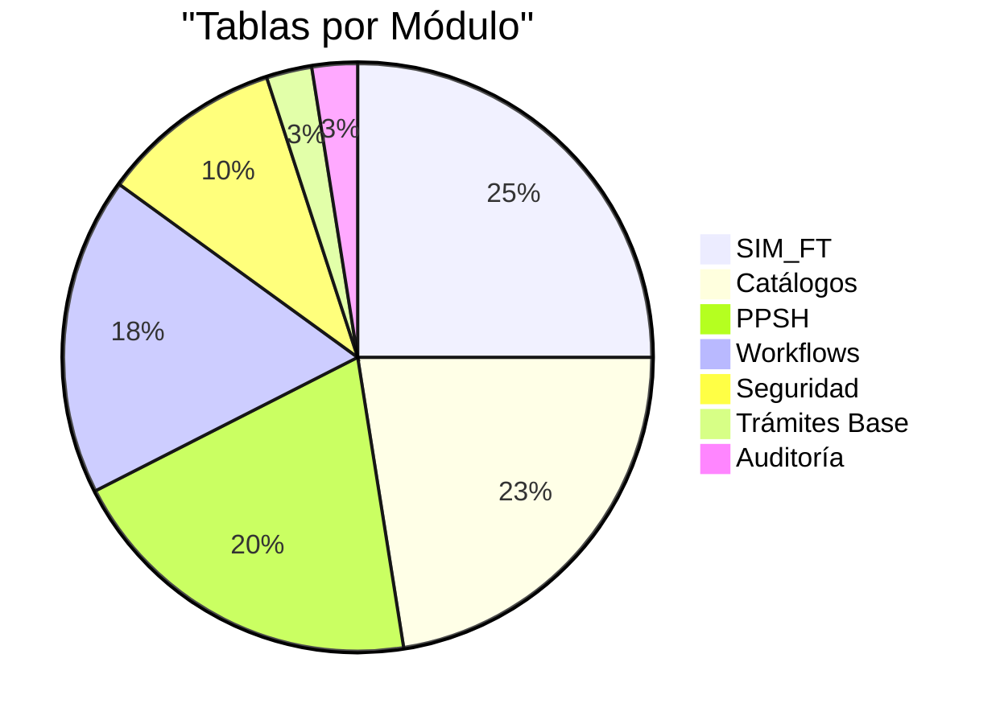
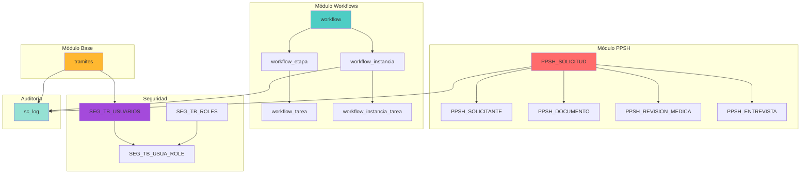

# 📖 Diccionario de Datos

Documentación completa de la estructura de base de datos del Sistema de Trámites Migratorios de Panamá.

---

## Información General

| Propiedad | Valor |
|-----------|-------|
| **Base de Datos** | SQL Server 2019 |
| **Esquema Principal** | `dbo` |
| **Total de Tablas** | 41 tablas principales |
| **Total de Índices** | ~100 índices |
| **Versión** | 1.1 |
| **Última Actualización** | 23 de Octubre, 2025 |

---

## 📋 Módulos del Sistema

### 1. Módulo de Trámites Base

Gestión general de trámites migratorios.

| Tabla | Registros | Descripción |
|-------|-----------|-------------|
| `tramites` | Variable | Tabla principal de trámites generales |

**Características**:
- Sistema de estados (pendiente, en_proceso, completado, cancelado)
- Soft delete con campo `activo`
- Auditoría completa
- Relación con tipos de trámite

[Ver Detalles →](modulo-tramites.md){ .md-button }

---

### 2. Módulo PPSH (Permiso Provisorio de Salida Humanitaria)

Sistema especializado para gestión de permisos humanitarios.

| Tabla | Descripción |
|-------|-------------|
| `PPSH_SOLICITUD` | Solicitudes de permiso |
| `PPSH_SOLICITANTE` | Información de solicitantes |
| `PPSH_CAUSA_HUMANITARIA` | Catálogo de causas |
| `PPSH_ESTADO` | Estados del flujo |
| `PPSH_DOCUMENTO` | Documentos adjuntos |
| `PPSH_REVISION_MEDICA` | Revisiones médicas |
| `PPSH_ENTREVISTA` | Entrevistas realizadas |
| `PPSH_COMENTARIO` | Bitácora de comentarios |

**Total: 8 tablas** con flujo completo desde solicitud hasta aprobación/rechazo.

[Ver Detalles →](modulo-ppsh.md){ .md-button }

---

### 3. Módulo de Workflows

Sistema dinámico de flujos de trabajo configurables.

| Tabla | Descripción |
|-------|-------------|
| `workflow` | Definición de workflows |
| `workflow_etapa` | Etapas de cada workflow |
| `workflow_tarea` | Tareas por etapa |
| `workflow_instancia` | Instancias en ejecución |
| `workflow_instancia_etapa` | Estados de etapas |
| `workflow_instancia_tarea` | Tareas asignadas |
| `workflow_documento` | Documentos de tareas |

**Total: 7 tablas** con arquitectura flexible para cualquier tipo de proceso.

[Ver Detalles →](modulo-workflows.md){ .md-button }

---

### 4. Módulo SIM_FT (Sistema de Flujo de Trámites)

Sistema de gestión de flujo de trámites con seguimiento paso a paso.

| Tabla | Descripción |
|-------|-------------|
| `SIM_FT_ESTATUS` | Catálogo de estados de trámites |
| `SIM_FT_CONCLUSION` | Tipos de conclusión de trámites |
| `SIM_FT_PRIORIDAD` | Niveles de prioridad |
| `SIM_FT_PASOS` | Definición de pasos genéricos |
| `SIM_FT_PASOXTRAM` | Configuración de flujo por trámite |
| `SIM_FT_USUA_SEC` | Asignación usuarios-secciones |
| `SIM_FT_TRAMITE_E` | Encabezado de trámites |
| `SIM_FT_TRAMITE_D` | Detalle de pasos ejecutados |
| `SIM_FT_TRAMITE_CIERRE` | Registro de cierre |
| `SIM_FT_DEPENDTE_CIERRE` | Dependientes en cierre |

**Total: 10 tablas** con sistema completo de seguimiento de trámites paso a paso.

!!! success "Nuevo Módulo - Octubre 2025"
    Sistema recién implementado para trazabilidad completa de trámites.

[Ver Detalles →](modulo-sim-ft.md){ .md-button }

---

### 5. Seguridad y Catálogos

Tablas de soporte, seguridad y datos maestros.

=== "Seguridad"

    | Tabla | Descripción |
    |-------|-------------|
    | `SEG_TB_USUARIOS` | Usuarios del sistema |
    | `SEG_TB_ROLES` | Roles de acceso |
    | `SEG_TB_USUA_ROLE` | Asignación usuario-rol |
    | `SEG_TB_ERROR_LOG` | Registro de errores |
    
    **Total: 4 tablas**

=== "Catálogos"

    | Tabla | Descripción |
    |-------|-------------|
    | `SIM_GE_SEXO` | Géneros |
    | `SIM_GE_EST_CIVIL` | Estados civiles |
    | `SIM_GE_VIA_TRANSP` | Vías de transporte |
    | `SIM_GE_TIPO_MOV` | Tipos de movimiento |
    | `SIM_GE_PAIS` | Países |
    | `SIM_GE_CONTINENTE` | Continentes |
    | `SIM_GE_REGION` | Regiones de Panamá |
    | `SIM_GE_AGENCIA` | Agencias de migración |
    | `SIM_GE_SECCION` | Secciones por agencia |
    
    **Total: 9 tablas**

=== "Auditoría"

    | Tabla | Descripción |
    |-------|-------------|
    | `sc_log` | Log de auditoría completo |
    
    Captura todas las operaciones del sistema

[Ver Detalles →](seguridad-catalogos.md){ .md-button }

---

## 📊 Resumen Estadístico

### Distribución de Tablas por Módulo



### Tipos de Relaciones

| Tipo | Cantidad | Descripción |
|------|----------|-------------|
| **1:N (One-to-Many)** | 25 | Relaciones padre-hijo |
| **N:M (Many-to-Many)** | 2 | Usuarios ↔ Roles, Usuarios ↔ Secciones |
| **Lookup/Catalog** | 12 | Tablas de referencia (incluyendo SIM_FT_*) |

### Índices y Constraints

| Elemento | Cantidad |
|----------|----------|
| Primary Keys (Clustered) | 41 |
| Unique Constraints | 15 |
| Foreign Keys | 32 |
| Performance Indexes | 25 |
| **Total de Índices** | **~113** |

[Ver Detalles →](indices-constraints.md){ .md-button }

---

## 🔧 Convenciones y Estándares

### Nomenclatura de Tablas

=== "Trámites Base"
    ```
    tramites (lowercase)
    ```

=== "PPSH"
    ```
    PPSH_SOLICITUD
    PPSH_SOLICITANTE
    PPSH_DOCUMENTO
    (UPPER_CASE con prefijo)
    ```

=== "Workflows"
    ```
    workflow
    workflow_etapa
    workflow_instancia
    (snake_case)
    ```

=== "Seguridad"
    ```
    SEG_TB_USUARIOS
    SEG_TB_ROLES
    (prefijo SEG_TB_ + UPPER_CASE)
    ```

=== "Catálogos"
    ```
    SIM_GE_PAIS
    SIM_GE_SEXO
    (prefijo SIM_GE_ + UPPER_CASE)
    ```

=== "SIM_FT"
    ```
    SIM_FT_ESTATUS
    SIM_FT_TRAMITE_E
    SIM_FT_TRAMITE_D
    (prefijo SIM_FT_ + UPPER_CASE)
    ```

### Campos Estándar

Todas las tablas principales incluyen:

| Campo | Tipo | Descripción |
|-------|------|-------------|
| `id` o `id_<tabla>` | INT IDENTITY | Primary key |
| `fecha_creacion` | DATETIME | Timestamp de creación |
| `fecha_actualizacion` | DATETIME | Última modificación |
| `activo` | BIT | Soft delete (1=activo, 0=eliminado) |

### Soft Delete

!!! info "Eliminación Lógica"
    El sistema NO elimina físicamente registros. En su lugar:
    
    - ✅ `activo = 1`: Registro activo y visible
    - ❌ `activo = 0`: Registro eliminado lógicamente
    
    **Ventajas**:
    - Preserva integridad referencial
    - Permite auditoría completa
    - Posibilita recuperación de datos

```sql
-- Ejemplo de soft delete
UPDATE tramites 
SET activo = 0, fecha_actualizacion = GETDATE() 
WHERE id = 123;

-- Consultas solo registros activos
SELECT * FROM tramites WHERE activo = 1;
```

---

## 🗂️ Diagramas ER

### Vista General del Sistema



[Ver Diagramas Detallados por Módulo →](modulo-ppsh.md#diagramas-er)

---

## 🛠️ Scripts de Mantenimiento

### Limpieza de Logs

```sql
-- Eliminar logs mayores a 6 meses
DELETE FROM sc_log 
WHERE fecha_hora < DATEADD(MONTH, -6, GETDATE());

-- Archivar antes de eliminar
INSERT INTO sc_log_historico
SELECT * FROM sc_log 
WHERE fecha_hora < DATEADD(MONTH, -6, GETDATE());
```

### Reconstruir Índices

```sql
-- Reconstruir índices fragmentados
ALTER INDEX ALL ON tramites REBUILD;
ALTER INDEX ALL ON PPSH_SOLICITUD REBUILD;
ALTER INDEX ALL ON workflow_instancia REBUILD;

-- Actualizar estadísticas
UPDATE STATISTICS tramites;
UPDATE STATISTICS PPSH_SOLICITUD;
UPDATE STATISTICS workflow_instancia;
```

### Backup de Tablas Críticas

```sql
-- Backup de solicitudes activas
SELECT * INTO PPSH_SOLICITUD_BACKUP_20250122
FROM PPSH_SOLICITUD
WHERE activo = 1;

-- Backup de workflows en ejecución
SELECT * INTO workflow_instancia_BACKUP_20250122
FROM workflow_instancia
WHERE estado IN ('INICIADO', 'EN_PROGRESO');
```

[Ver Más Scripts →](scripts.md){ .md-button }

---

## 📚 Secciones del Diccionario

<div class="grid cards" markdown>

-   :material-database: **Módulo Trámites**

    ---

    Tabla principal de gestión de trámites generales

    [:octicons-arrow-right-24: Ver detalles](modulo-tramites.md)

-   :material-account-heart: **Módulo PPSH**

    ---

    8 tablas para permisos provisorios humanitarios

    [:octicons-arrow-right-24: Ver detalles](modulo-ppsh.md)

-   :material-workflow: **Módulo Workflows**

    ---

    7 tablas de flujos de trabajo dinámicos

    [:octicons-arrow-right-24: Ver detalles](modulo-workflows.md)

-   :material-shield-account: **Seguridad y Catálogos**

    ---

    13 tablas de usuarios, roles y datos maestros

    [:octicons-arrow-right-24: Ver detalles](seguridad-catalogos.md)

-   :material-database-search: **Índices y Constraints**

    ---

    87+ índices, FKs y reglas de validación

    [:octicons-arrow-right-24: Ver detalles](indices-constraints.md)

-   :material-script-text: **Scripts de Mantenimiento**

    ---

    Consultas y procedimientos de optimización

    [:octicons-arrow-right-24: Ver detalles](scripts.md)

</div>

---

## 📖 Recursos Adicionales

- [Manual Técnico - Base de Datos](../tecnico/02-database.md) - Configuración y administración
- [Manual Técnico - Backend](../tecnico/03-backend.md) - Uso de la base de datos desde API
- [Manual Técnico - Troubleshooting](../tecnico/08-troubleshooting.md) - Solución de problemas

---

## ℹ️ Información del Documento

**Versión**: 1.0  
**Última Actualización**: 22 de Octubre, 2025  
**Estado**: ✅ Completo (100%)  
**Mantenido por**: Equipo de Desarrollo - desarrollo@gob.pa

---

[Inicio](../index.md) | [Manual Técnico](../tecnico/index.md) | [Manual de Usuario](../usuario/index.md)
