# Índices y Constraints

Estrategia completa de indexación, restricciones de integridad y optimización de base de datos.

---

## Descripción General

Este documento detalla la **estrategia de indexación** y los **constraints de integridad** implementados en la base de datos del sistema de trámites migratorios, incluyendo:

- 🔑 **87+ índices** para optimización de consultas
- 🔗 **40+ Foreign Keys** para integridad referencial
- ✅ **30+ Constraints CHECK** para validación de datos
- 🎯 **Unique Constraints** para garantizar unicidad
- 📊 **Estrategias de indexación** por tipo de tabla
- 🚀 **Best Practices** de optimización

---

## Estrategia de Indexación

### Tipos de Índices Utilizados

```mermaid
graph TB
    subgraph "Índices del Sistema"
        PK[Primary Key<br/>CLUSTERED<br/>30 índices]
        UK[Unique Constraints<br/>NONCLUSTERED<br/>15+ índices]
        FK[Foreign Key Indexes<br/>NONCLUSTERED<br/>40+ índices]
        PERF[Performance Indexes<br/>NONCLUSTERED<br/>Búsquedas frecuentes]
    end
    
    subgraph "Propósito"
        INT[Integridad<br/>Referencial]
        UNI[Unicidad de<br/>Datos]
        OPT[Optimización de<br/>Consultas]
    end
    
    PK --> INT
    UK --> UNI
    FK --> INT
    PERF --> OPT
    
    style PK fill:#FF6B6B,stroke:#333,stroke-width:3px,color:#fff
    style UK fill:#4ECDC4,stroke:#333,stroke-width:2px,color:#fff
    style FK fill:#45B7D1,stroke:#333,stroke-width:2px,color:#fff
    style PERF fill:#95E1D3,stroke:#333,stroke-width:2px
```



---

## 1. Primary Keys (Clustered Indexes)

Todas las tablas tienen un **Primary Key clustered** que determina el orden físico de los datos.

### Convención de Naming

```
PK_{nombre_tabla}
```

### Listado Completo de Primary Keys

| Tabla | Columna PK | Tipo | Identidad |
|-------|-----------|------|-----------|
| **Módulo Trámites** | | | |
| `tramites` | `id_tramite` | INT | IDENTITY(1,1) |
| **Módulo PPSH** | | | |
| `PPSH_SOLICITUD` | `id_solicitud` | INT | IDENTITY(1,1) |
| `PPSH_SOLICITANTE` | `id_solicitante` | INT | IDENTITY(1,1) |
| `PPSH_CAUSA_HUMANITARIA` | `cod_causa` | NVARCHAR(20) | NO |
| `PPSH_ESTADO` | `cod_estado` | NVARCHAR(20) | NO |
| `PPSH_DOCUMENTO` | `id_documento` | INT | IDENTITY(1,1) |
| `PPSH_REVISION_MEDICA` | `id_revision` | INT | IDENTITY(1,1) |
| `PPSH_ENTREVISTA` | `id_entrevista` | INT | IDENTITY(1,1) |
| `PPSH_COMENTARIO` | `id_comentario` | INT | IDENTITY(1,1) |
| **Módulo Workflows** | | | |
| `workflow` | `id_workflow` | INT | IDENTITY(1,1) |
| `workflow_etapa` | `id_etapa` | INT | IDENTITY(1,1) |
| `workflow_tarea` | `id_tarea` | INT | IDENTITY(1,1) |
| `workflow_instancia` | `id_instancia` | INT | IDENTITY(1,1) |
| `workflow_instancia_etapa` | `id_instancia_etapa` | INT | IDENTITY(1,1) |
| `workflow_instancia_tarea` | `id_instancia_tarea` | INT | IDENTITY(1,1) |
| `workflow_documento` | `id_documento` | INT | IDENTITY(1,1) |
| **Módulo Seguridad** | | | |
| `SEG_TB_USUARIOS` | `id_usuario` | INT | IDENTITY(1,1) |
| `SEG_TB_ROLES` | `id_rol` | INT | IDENTITY(1,1) |
| `SEG_TB_USUA_ROLE` | `id_usua_role` | INT | IDENTITY(1,1) |
| `SEG_TB_ERROR_LOG` | `id_error` | INT | IDENTITY(1,1) |
| **Catálogos** | | | |
| `SIM_GE_CONTINENTE` | `codigo_continente` | NVARCHAR(2) | NO |
| `SIM_GE_PAIS` | `codigo_pais` | NVARCHAR(3) | NO |
| `SIM_GE_REGION` | `codigo_region` | NVARCHAR(10) | NO |
| `SIM_GE_VIA_TRANSP` | `codigo_via` | NVARCHAR(10) | NO |
| `SIM_GE_AGENCIA` | `codigo_agencia` | NVARCHAR(10) | NO |
| `SIM_GE_SECCION` | `codigo_seccion` | NVARCHAR(10) | NO |
| `SIM_GE_TIPO_MOV` | `codigo_tipo_mov` | NVARCHAR(10) | NO |
| `SIM_GE_SEXO` | `codigo_sexo` | NVARCHAR(1) | NO |
| `SIM_GE_EST_CIVIL` | `codigo_est_civil` | NVARCHAR(10) | NO |
| **Auditoría** | | | |
| `sc_log` | `id_log` | INT | IDENTITY(1,1) |

**Total: 30 Primary Keys Clustered**

### Ejemplo de Implementación

```sql
-- Primary Key con IDENTITY
CREATE TABLE tramites (
    id_tramite INT IDENTITY(1,1) NOT NULL,
    -- otras columnas...
    CONSTRAINT PK_tramites PRIMARY KEY CLUSTERED (id_tramite)
);

-- Primary Key con código natural
CREATE TABLE PPSH_CAUSA_HUMANITARIA (
    cod_causa NVARCHAR(20) NOT NULL,
    -- otras columnas...
    CONSTRAINT PK_PPSH_CAUSA_HUMANITARIA PRIMARY KEY CLUSTERED (cod_causa)
);
```

---

## 2. Unique Constraints

Garantizan la **unicidad** de valores en columnas críticas.

### Convención de Naming

```
UK_{nombre_tabla}_{columna}
```

### Listado de Unique Constraints

| Tabla | Columna(s) | Propósito |
|-------|-----------|-----------|
| `PPSH_SOLICITUD` | `numero_solicitud` | Número único de solicitud |
| `PPSH_SOLICITANTE` | `tipo_documento + numero_documento` | Identificación única de persona |
| `PPSH_REVISION_MEDICA` | `id_solicitud` | Una revisión por solicitud |
| `workflow` | `codigo` | Código único de workflow |
| `workflow_etapa` | `id_workflow + codigo_etapa` | Etapa única por workflow |
| `workflow_instancia` | `numero_instancia` | Número único de instancia |
| `workflow_instancia_etapa` | `id_instancia + id_etapa` | Una etapa por instancia |
| `SEG_TB_USUARIOS` | `username` | Nombre de usuario único |
| `SEG_TB_USUARIOS` | `email` | Email único |
| `SEG_TB_ROLES` | `codigo_rol` | Código de rol único |
| `SEG_TB_USUA_ROLE` | `id_usuario + id_rol` | Usuario-rol único (cuando activo) |
| `SIM_GE_PAIS` | `codigo_iso2` | ISO 2 único |

**Total: 15+ Unique Constraints**

### Ejemplo de Implementación

```sql
-- Unique simple
CREATE UNIQUE NONCLUSTERED INDEX UK_workflow_codigo 
ON workflow(codigo);

-- Unique compuesto
CREATE UNIQUE NONCLUSTERED INDEX UK_PPSH_SOLICITANTE_documento 
ON PPSH_SOLICITANTE(tipo_documento, numero_documento);

-- Unique condicional (filtered index)
CREATE UNIQUE NONCLUSTERED INDEX UK_SEG_TB_USUA_ROLE_unico 
ON SEG_TB_USUA_ROLE(id_usuario, id_rol)
WHERE activo = 1; -- Solo cuando está activo
```

---

## 3. Foreign Key Indexes

Índices en columnas de **Foreign Keys** para optimizar JOINs y garantizar integridad referencial.

### Convención de Naming

```
FK_{tabla_origen}_{tabla_destino}
IX_{tabla}_{columna}  -- Para el índice
```

### Foreign Keys por Módulo

#### Módulo Trámites

| FK Name | Tabla Origen | Columna | Tabla Destino | Columna |
|---------|--------------|---------|---------------|---------|
| `FK_tramites_usuario` | `tramites` | `creado_por` | `SEG_TB_USUARIOS` | `id_usuario` |
| `FK_tramites_tipo` | `tramites` | `tipo_tramite` | `tipos_tramite` | `id_tipo` |

#### Módulo PPSH

| FK Name | Tabla Origen | Columna | Tabla Destino | Columna |
|---------|--------------|---------|---------------|---------|
| `FK_PPSH_SOLICITUD_solicitante` | `PPSH_SOLICITUD` | `id_solicitante` | `PPSH_SOLICITANTE` | `id_solicitante` |
| `FK_PPSH_SOLICITUD_causa` | `PPSH_SOLICITUD` | `cod_causa` | `PPSH_CAUSA_HUMANITARIA` | `cod_causa` |
| `FK_PPSH_SOLICITUD_estado` | `PPSH_SOLICITUD` | `cod_estado` | `PPSH_ESTADO` | `cod_estado` |
| `FK_PPSH_SOLICITUD_aprobador` | `PPSH_SOLICITUD` | `aprobado_por` | `SEG_TB_USUARIOS` | `id_usuario` |
| `FK_PPSH_DOCUMENTO_solicitud` | `PPSH_DOCUMENTO` | `id_solicitud` | `PPSH_SOLICITUD` | `id_solicitud` |
| `FK_PPSH_DOCUMENTO_cargador` | `PPSH_DOCUMENTO` | `cargado_por` | `SEG_TB_USUARIOS` | `id_usuario` |
| `FK_PPSH_DOCUMENTO_validador` | `PPSH_DOCUMENTO` | `validado_por` | `SEG_TB_USUARIOS` | `id_usuario` |
| `FK_PPSH_REVISION_solicitud` | `PPSH_REVISION_MEDICA` | `id_solicitud` | `PPSH_SOLICITUD` | `id_solicitud` |
| `FK_PPSH_REVISION_medico` | `PPSH_REVISION_MEDICA` | `medico_revisor` | `SEG_TB_USUARIOS` | `id_usuario` |
| `FK_PPSH_ENTREVISTA_solicitud` | `PPSH_ENTREVISTA` | `id_solicitud` | `PPSH_SOLICITUD` | `id_solicitud` |
| `FK_PPSH_ENTREVISTA_oficial` | `PPSH_ENTREVISTA` | `oficial_entrevistador` | `SEG_TB_USUARIOS` | `id_usuario` |
| `FK_PPSH_COMENTARIO_solicitud` | `PPSH_COMENTARIO` | `id_solicitud` | `PPSH_SOLICITUD` | `id_solicitud` |
| `FK_PPSH_COMENTARIO_usuario` | `PPSH_COMENTARIO` | `usuario` | `SEG_TB_USUARIOS` | `id_usuario` |

#### Módulo Workflows

| FK Name | Tabla Origen | Columna | Tabla Destino | Columna |
|---------|--------------|---------|---------------|---------|
| `FK_workflow_creador` | `workflow` | `creado_por` | `SEG_TB_USUARIOS` | `id_usuario` |
| `FK_workflow_etapa_workflow` | `workflow_etapa` | `id_workflow` | `workflow` | `id_workflow` |
| `FK_workflow_tarea_etapa` | `workflow_tarea` | `id_etapa` | `workflow_etapa` | `id_etapa` |
| `FK_workflow_instancia_workflow` | `workflow_instancia` | `id_workflow` | `workflow` | `id_workflow` |
| `FK_workflow_instancia_iniciador` | `workflow_instancia` | `iniciado_por` | `SEG_TB_USUARIOS` | `id_usuario` |
| `FK_workflow_instancia_completador` | `workflow_instancia` | `completado_por` | `SEG_TB_USUARIOS` | `id_usuario` |
| `FK_workflow_instancia_etapa_instancia` | `workflow_instancia_etapa` | `id_instancia` | `workflow_instancia` | `id_instancia` |
| `FK_workflow_instancia_etapa_etapa` | `workflow_instancia_etapa` | `id_etapa` | `workflow_etapa` | `id_etapa` |
| `FK_workflow_instancia_tarea_etapa` | `workflow_instancia_tarea` | `id_instancia_etapa` | `workflow_instancia_etapa` | `id_instancia_etapa` |
| `FK_workflow_instancia_tarea_tarea` | `workflow_instancia_tarea` | `id_tarea` | `workflow_tarea` | `id_tarea` |
| `FK_workflow_instancia_tarea_usuario` | `workflow_instancia_tarea` | `asignado_a` | `SEG_TB_USUARIOS` | `id_usuario` |
| `FK_workflow_documento_tarea` | `workflow_documento` | `id_instancia_tarea` | `workflow_instancia_tarea` | `id_instancia_tarea` |
| `FK_workflow_documento_usuario` | `workflow_documento` | `cargado_por` | `SEG_TB_USUARIOS` | `id_usuario` |

#### Módulo Seguridad

| FK Name | Tabla Origen | Columna | Tabla Destino | Columna |
|---------|--------------|---------|---------------|---------|
| `FK_SEG_TB_USUA_ROLE_usuario` | `SEG_TB_USUA_ROLE` | `id_usuario` | `SEG_TB_USUARIOS` | `id_usuario` |
| `FK_SEG_TB_USUA_ROLE_rol` | `SEG_TB_USUA_ROLE` | `id_rol` | `SEG_TB_ROLES` | `id_rol` |
| `FK_SEG_TB_USUA_ROLE_asignador` | `SEG_TB_USUA_ROLE` | `asignado_por` | `SEG_TB_USUARIOS` | `id_usuario` |
| `FK_SEG_TB_ERROR_LOG_usuario` | `SEG_TB_ERROR_LOG` | `usuario_id` | `SEG_TB_USUARIOS` | `id_usuario` |

#### Catálogos Geográficos

| FK Name | Tabla Origen | Columna | Tabla Destino | Columna |
|---------|--------------|---------|---------------|---------|
| `FK_SIM_GE_PAIS_continente` | `SIM_GE_PAIS` | `codigo_continente` | `SIM_GE_CONTINENTE` | `codigo_continente` |
| `FK_SIM_GE_REGION_pais` | `SIM_GE_REGION` | `codigo_pais` | `SIM_GE_PAIS` | `codigo_pais` |

**Total: 40+ Foreign Keys**

### Ejemplo de Implementación

```sql
-- Crear Foreign Key con índice
ALTER TABLE PPSH_SOLICITUD
ADD CONSTRAINT FK_PPSH_SOLICITUD_solicitante
FOREIGN KEY (id_solicitante) 
REFERENCES PPSH_SOLICITANTE(id_solicitante);

-- Crear índice para optimizar JOINs
CREATE NONCLUSTERED INDEX IX_PPSH_SOLICITUD_solicitante 
ON PPSH_SOLICITUD(id_solicitante);

-- FK con acción en cascada
ALTER TABLE workflow_etapa
ADD CONSTRAINT FK_workflow_etapa_workflow
FOREIGN KEY (id_workflow) 
REFERENCES workflow(id_workflow)
ON DELETE CASCADE;
```

---

## 4. Performance Indexes

Índices adicionales para **optimizar consultas frecuentes**.

### Por Tipo de Consulta

#### A. Búsquedas por Estado

```sql
-- Trámites por estado
CREATE NONCLUSTERED INDEX IX_tramites_estado 
ON tramites(estado)
INCLUDE (numero_tramite, fecha_creacion, tipo_tramite);

-- Solicitudes PPSH por estado
CREATE NONCLUSTERED INDEX IX_PPSH_SOLICITUD_estado 
ON PPSH_SOLICITUD(cod_estado)
INCLUDE (numero_solicitud, id_solicitante, fecha_solicitud);

-- Workflows por estado
CREATE NONCLUSTERED INDEX IX_workflow_instancia_estado 
ON workflow_instancia(estado, fecha_inicio DESC)
INCLUDE (numero_instancia, titulo, prioridad);
```

#### B. Búsquedas por Fecha

```sql
-- Trámites por fecha descendente (más recientes primero)
CREATE NONCLUSTERED INDEX IX_tramites_fecha 
ON tramites(fecha_creacion DESC)
INCLUDE (numero_tramite, estado, cedula_solicitante);

-- Solicitudes PPSH por fecha
CREATE NONCLUSTERED INDEX IX_PPSH_SOLICITUD_fecha 
ON PPSH_SOLICITUD(fecha_solicitud DESC)
INCLUDE (numero_solicitud, cod_estado, id_solicitante);

-- Logs de error por fecha
CREATE NONCLUSTERED INDEX IX_SEG_TB_ERROR_LOG_fecha 
ON SEG_TB_ERROR_LOG(fecha_error DESC)
INCLUDE (nivel, modulo, mensaje);

-- Auditoría por fecha
CREATE NONCLUSTERED INDEX IX_sc_log_fecha 
ON sc_log(fecha_log DESC)
INCLUDE (usuario_id, accion, tabla);
```

#### C. Búsquedas por Usuario

```sql
-- Trámites por usuario
CREATE NONCLUSTERED INDEX IX_tramites_usuario 
ON tramites(creado_por)
INCLUDE (numero_tramite, estado, fecha_creacion);

-- Tareas asignadas
CREATE NONCLUSTERED INDEX IX_workflow_instancia_tarea_usuario 
ON workflow_instancia_tarea(asignado_a, estado)
INCLUDE (fecha_limite, fecha_asignacion);

-- Actividad de usuarios en auditoría
CREATE NONCLUSTERED INDEX IX_sc_log_usuario 
ON sc_log(usuario_id, fecha_log DESC)
WHERE usuario_id IS NOT NULL;
```

#### D. Búsquedas por Documento de Identidad

```sql
-- Solicitantes por documento
CREATE UNIQUE NONCLUSTERED INDEX UK_PPSH_SOLICITANTE_documento 
ON PPSH_SOLICITANTE(tipo_documento, numero_documento);

-- Trámites por cédula
CREATE NONCLUSTERED INDEX IX_tramites_cedula 
ON tramites(cedula_solicitante);
```

#### E. Filtered Indexes (Índices Filtrados)

```sql
-- Solo workflows activos
CREATE NONCLUSTERED INDEX IX_workflow_activo 
ON workflow(activo)
INCLUDE (codigo, nombre, categoria)
WHERE activo = 1;

-- Solo documentos no validados
CREATE NONCLUSTERED INDEX IX_PPSH_DOCUMENTO_pendientes 
ON PPSH_DOCUMENTO(validado, fecha_carga DESC)
WHERE validado = 0 AND activo = 1;

-- Solo tareas pendientes con fecha límite
CREATE NONCLUSTERED INDEX IX_workflow_instancia_tarea_fecha 
ON workflow_instancia_tarea(fecha_limite)
WHERE fecha_limite IS NOT NULL 
  AND estado IN ('PENDIENTE', 'EN_PROGRESO');

-- Solo usuarios activos
CREATE NONCLUSTERED INDEX IX_SEG_TB_USUARIOS_activo 
ON SEG_TB_USUARIOS(activo)
INCLUDE (username, nombre_completo, email)
WHERE activo = 1;
```

#### F. Composite Indexes

```sql
-- Búsqueda combinada: solicitud + fecha
CREATE NONCLUSTERED INDEX IX_PPSH_COMENTARIO_solicitud_fecha 
ON PPSH_COMENTARIO(id_solicitud, fecha_comentario DESC);

-- Workflow + etapa + orden
CREATE NONCLUSTERED INDEX IX_workflow_etapa_workflow 
ON workflow_etapa(id_workflow, orden)
INCLUDE (codigo_etapa, nombre_etapa);

-- Usuario + rol (activos)
CREATE UNIQUE NONCLUSTERED INDEX UK_SEG_TB_USUA_ROLE_unico 
ON SEG_TB_USUA_ROLE(id_usuario, id_rol)
WHERE activo = 1;
```

---

## 5. CHECK Constraints

Validaciones a nivel de base de datos para **integridad de datos**.

### Convención de Naming

```
CK_{nombre_tabla}_{columna}
```

### Listado de CHECK Constraints

#### Módulo Trámites

```sql
-- Estados válidos
ALTER TABLE tramites
ADD CONSTRAINT CK_tramites_estado
CHECK (estado IN ('PENDIENTE', 'EN_REVISION', 'APROBADO', 'RECHAZADO'));
```

#### Módulo PPSH

```sql
-- Tipo de documento válido
ALTER TABLE PPSH_SOLICITANTE
ADD CONSTRAINT CK_PPSH_SOLICITANTE_tipo_doc
CHECK (tipo_documento IN ('PASAPORTE', 'CEDULA', 'PERMISO_TEMP', 'OTRO'));

-- Sexo válido
ALTER TABLE PPSH_SOLICITANTE
ADD CONSTRAINT CK_PPSH_SOLICITANTE_sexo
CHECK (sexo IN ('M', 'F'));

-- Edad mínima
ALTER TABLE PPSH_SOLICITANTE
ADD CONSTRAINT CK_PPSH_SOLICITANTE_edad
CHECK (DATEDIFF(YEAR, fecha_nacimiento, GETDATE()) >= 18);

-- Urgencia válida
ALTER TABLE PPSH_REVISION_MEDICA
ADD CONSTRAINT CK_PPSH_REVISION_urgencia
CHECK (urgencia_nivel IN ('BAJA', 'MEDIA', 'ALTA', 'CRITICA'));

-- Recomendación válida
ALTER TABLE PPSH_REVISION_MEDICA
ADD CONSTRAINT CK_PPSH_REVISION_recomendacion
CHECK (recomendacion IN ('APROBAR', 'RECHAZAR', 'MAS_INFO'));

-- Resultado de entrevista válido
ALTER TABLE PPSH_ENTREVISTA
ADD CONSTRAINT CK_PPSH_ENTREVISTA_resultado
CHECK (resultado IN ('FAVORABLE', 'DESFAVORABLE', 'INCONCLUSO'));

-- Tipo de comentario válido
ALTER TABLE PPSH_COMENTARIO
ADD CONSTRAINT CK_PPSH_COMENTARIO_tipo
CHECK (tipo_comentario IN ('GENERAL', 'MEDICO', 'LEGAL', 'ADMINISTRATIVO'));
```

#### Módulo Workflows

```sql
-- Orden positivo de etapa
ALTER TABLE workflow_etapa
ADD CONSTRAINT CK_workflow_etapa_orden
CHECK (orden > 0);

-- Orden positivo de tarea
ALTER TABLE workflow_tarea
ADD CONSTRAINT CK_workflow_tarea_orden
CHECK (orden > 0);

-- Estado de instancia válido
ALTER TABLE workflow_instancia
ADD CONSTRAINT CK_workflow_instancia_estado
CHECK (estado IN ('INICIADO', 'EN_PROGRESO', 'COMPLETADO', 'CANCELADO'));

-- Prioridad válida
ALTER TABLE workflow_instancia
ADD CONSTRAINT CK_workflow_instancia_prioridad
CHECK (prioridad IN ('BAJA', 'NORMAL', 'ALTA', 'URGENTE'));

-- Progreso entre 0 y 100
ALTER TABLE workflow_instancia
ADD CONSTRAINT CK_workflow_instancia_progreso
CHECK (progreso_porcentaje >= 0 AND progreso_porcentaje <= 100);

-- Estado de etapa de instancia válido
ALTER TABLE workflow_instancia_etapa
ADD CONSTRAINT CK_workflow_instancia_etapa_estado
CHECK (estado IN ('PENDIENTE', 'EN_PROGRESO', 'COMPLETADA', 'OMITIDA'));

-- Estado de tarea válido
ALTER TABLE workflow_instancia_tarea
ADD CONSTRAINT CK_workflow_instancia_tarea_estado
CHECK (estado IN ('PENDIENTE', 'EN_PROGRESO', 'COMPLETADA', 'CANCELADA'));

-- Resultado de tarea válido
ALTER TABLE workflow_instancia_tarea
ADD CONSTRAINT CK_workflow_instancia_tarea_resultado
CHECK (resultado IN ('APROBADO', 'RECHAZADO', 'PENDIENTE') OR resultado IS NULL);
```

#### Módulo Seguridad

```sql
-- Intentos fallidos no negativos
ALTER TABLE SEG_TB_USUARIOS
ADD CONSTRAINT CK_SEG_TB_USUARIOS_intentos
CHECK (intentos_fallidos >= 0);

-- Nivel de acceso válido
ALTER TABLE SEG_TB_ROLES
ADD CONSTRAINT CK_SEG_TB_ROLES_nivel
CHECK (nivel_acceso BETWEEN 1 AND 10);

-- Nivel de error válido
ALTER TABLE SEG_TB_ERROR_LOG
ADD CONSTRAINT CK_SEG_TB_ERROR_LOG_nivel
CHECK (nivel IN ('DEBUG', 'INFO', 'WARNING', 'ERROR', 'CRITICAL'));
```

**Total: 30+ CHECK Constraints**

---

## 6. Default Constraints

Valores predeterminados para columnas comunes.

### Patrones Comunes

```sql
-- Campo activo (soft delete)
activo BIT NOT NULL DEFAULT 1

-- Fecha de creación
fecha_creacion DATETIME NOT NULL DEFAULT GETDATE()

-- Estado inicial
estado NVARCHAR(50) NOT NULL DEFAULT 'PENDIENTE'

-- Contador inicial
intentos_fallidos INT NOT NULL DEFAULT 0

-- Progreso inicial
progreso_porcentaje DECIMAL(5,2) NOT NULL DEFAULT 0

-- Versión inicial
version INT NOT NULL DEFAULT 1

-- Prioridad por defecto
prioridad NVARCHAR(20) NOT NULL DEFAULT 'NORMAL'

-- Nivel de error por defecto
nivel NVARCHAR(20) NOT NULL DEFAULT 'ERROR'
```

---

## 7. Estrategias de Optimización

### A. Índices INCLUDE

Incluir columnas adicionales en el índice para evitar lookups:

```sql
-- Mal: Requiere lookup para obtener número_tramite
CREATE NONCLUSTERED INDEX IX_tramites_estado 
ON tramites(estado);

-- Bien: Include evita lookup
CREATE NONCLUSTERED INDEX IX_tramites_estado 
ON tramites(estado)
INCLUDE (numero_tramite, fecha_creacion, tipo_tramite);
```

### B. Filtered Indexes

Índices más pequeños y eficientes para subconjuntos:

```sql
-- Mal: Indexa todos los registros
CREATE NONCLUSTERED INDEX IX_tramites_activo 
ON tramites(activo);

-- Bien: Solo indexa activos (reduce tamaño 50%)
CREATE NONCLUSTERED INDEX IX_tramites_activo 
ON tramites(activo)
WHERE activo = 1;
```

### C. Covering Indexes

Índices que "cubren" toda la consulta:

```sql
-- Consulta frecuente
SELECT numero_solicitud, id_solicitante, fecha_solicitud
FROM PPSH_SOLICITUD
WHERE cod_estado = 'PENDIENTE';

-- Covering index (query no necesita acceder a la tabla)
CREATE NONCLUSTERED INDEX IX_PPSH_SOLICITUD_estado_covering
ON PPSH_SOLICITUD(cod_estado)
INCLUDE (numero_solicitud, id_solicitante, fecha_solicitud);
```

### D. Composite Indexes (Orden Correcto)

El orden de columnas importa:

```sql
-- Si consultas por (usuario, fecha)
CREATE NONCLUSTERED INDEX IX_sc_log_usuario_fecha
ON sc_log(usuario_id, fecha_log DESC);

-- Este índice NO se usará eficientemente para WHERE usuario_id = X
CREATE NONCLUSTERED INDEX IX_sc_log_fecha_usuario
ON sc_log(fecha_log DESC, usuario_id);
```

**Regla**: Columnas con igualdad (=) primero, luego rangos (>, <, BETWEEN), luego ORDER BY.

---

## 8. Mantenimiento de Índices

### Fragmentación

```sql
-- Ver fragmentación de índices
SELECT 
    OBJECT_NAME(ips.object_id) AS tabla,
    i.name AS indice,
    ips.index_type_desc,
    ips.avg_fragmentation_in_percent,
    ips.page_count
FROM sys.dm_db_index_physical_stats(
    DB_ID(), NULL, NULL, NULL, 'DETAILED'
) ips
INNER JOIN sys.indexes i 
    ON ips.object_id = i.object_id 
    AND ips.index_id = i.index_id
WHERE ips.avg_fragmentation_in_percent > 10
  AND ips.page_count > 1000
ORDER BY ips.avg_fragmentation_in_percent DESC;
```

### Reorganizar vs Rebuild

```sql
-- Reorganizar (fragmentación 10-30%)
ALTER INDEX IX_tramites_fecha ON tramites REORGANIZE;

-- Rebuild (fragmentación > 30%)
ALTER INDEX IX_tramites_fecha ON tramites REBUILD 
WITH (ONLINE = ON, FILLFACTOR = 90);

-- Rebuild todos los índices de una tabla
ALTER INDEX ALL ON tramites REBUILD 
WITH (ONLINE = ON, FILLFACTOR = 90);
```

### Actualizar Estadísticas

```sql
-- Actualizar estadísticas de una tabla
UPDATE STATISTICS tramites WITH FULLSCAN;

-- Actualizar todas las estadísticas
EXEC sp_updatestats;

-- Ver estadísticas desactualizadas
SELECT 
    OBJECT_NAME(s.object_id) AS tabla,
    s.name AS estadistica,
    sp.last_updated,
    sp.rows,
    sp.modification_counter
FROM sys.stats s
CROSS APPLY sys.dm_db_stats_properties(s.object_id, s.stats_id) sp
WHERE sp.modification_counter > sp.rows * 0.2 -- 20% cambios
ORDER BY sp.modification_counter DESC;
```

---

## 9. Monitoreo de Índices

### Índices No Utilizados

```sql
-- Identificar índices nunca usados
SELECT 
    OBJECT_NAME(i.object_id) AS tabla,
    i.name AS indice,
    i.type_desc,
    us.user_seeks,
    us.user_scans,
    us.user_lookups,
    us.user_updates,
    i.is_disabled
FROM sys.indexes i
LEFT JOIN sys.dm_db_index_usage_stats us 
    ON i.object_id = us.object_id 
    AND i.index_id = us.index_id
WHERE OBJECTPROPERTY(i.object_id, 'IsUserTable') = 1
  AND i.index_id > 0 -- Excluir heap
  AND us.user_seeks + us.user_scans + us.user_lookups = 0
  AND us.user_updates > 0 -- Pero sí se actualiza
ORDER BY us.user_updates DESC;
```

### Índices Más Utilizados

```sql
-- Top 20 índices más consultados
SELECT TOP 20
    OBJECT_NAME(i.object_id) AS tabla,
    i.name AS indice,
    us.user_seeks + us.user_scans + us.user_lookups AS total_lecturas,
    us.user_seeks,
    us.user_scans,
    us.user_lookups,
    us.user_updates,
    us.last_user_seek,
    us.last_user_scan
FROM sys.indexes i
INNER JOIN sys.dm_db_index_usage_stats us 
    ON i.object_id = us.object_id 
    AND i.index_id = us.index_id
WHERE OBJECTPROPERTY(i.object_id, 'IsUserTable') = 1
ORDER BY total_lecturas DESC;
```

### Missing Indexes

```sql
-- Sugerencias de índices faltantes
SELECT 
    OBJECT_NAME(mid.object_id) AS tabla,
    migs.avg_user_impact AS impacto_promedio,
    migs.user_seeks + migs.user_scans AS total_busquedas,
    'CREATE NONCLUSTERED INDEX IX_' + 
        OBJECT_NAME(mid.object_id) + '_' + 
        REPLACE(REPLACE(COALESCE(mid.equality_columns, ''), '[', ''), ']', '') +
        ' ON ' + mid.statement + 
        ' (' + ISNULL(mid.equality_columns, '') + 
        CASE WHEN mid.inequality_columns IS NOT NULL 
             THEN CASE WHEN mid.equality_columns IS NOT NULL THEN ',' ELSE '' END + mid.inequality_columns 
             ELSE '' 
        END + ')' +
        CASE WHEN mid.included_columns IS NOT NULL 
             THEN ' INCLUDE (' + mid.included_columns + ')' 
             ELSE '' 
        END AS create_statement
FROM sys.dm_db_missing_index_details mid
INNER JOIN sys.dm_db_missing_index_groups mig 
    ON mid.index_handle = mig.index_handle
INNER JOIN sys.dm_db_missing_index_group_stats migs 
    ON mig.index_group_handle = migs.group_handle
WHERE migs.avg_user_impact > 50 -- Impacto > 50%
  AND (migs.user_seeks + migs.user_scans) > 1000
ORDER BY migs.avg_user_impact * (migs.user_seeks + migs.user_scans) DESC;
```

---

## 10. Best Practices

### ✅ DO (Hacer)

1. **Crear índices en Foreign Keys** para optimizar JOINs
2. **Usar INCLUDE** para evitar lookups en consultas frecuentes
3. **Filtered indexes** para subconjuntos de datos activos
4. **Mantener fillfactor 90-95%** para reducir fragmentación en tablas con muchas actualizaciones
5. **Reorganizar/Rebuild** índices fragmentados regularmente
6. **Actualizar estadísticas** semanalmente o después de grandes cargas
7. **Monitorear índices no utilizados** y eliminarlos
8. **Usar composite indexes** con orden correcto de columnas

### ❌ DON'T (Evitar)

1. **No crear índices en tablas pequeñas** (< 1000 filas)
2. **No duplicar índices** (revisar índices existentes)
3. **No crear demasiados índices** (máximo 5-7 por tabla)
4. **No indexar columnas con baja selectividad** (ej: bit con pocos valores)
5. **No usar índices anchos** (más de 900 bytes en key)
6. **No ignorar índices fragmentados** (> 30%)
7. **No crear índices sin analizar queries** primero

---

## 11. Resumen de Índices por Tabla

| Tabla | PK | UK | FK Indexes | Performance | Total |
|-------|----|----|------------|-------------|-------|
| `tramites` | 1 | 0 | 2 | 3 | 6 |
| `PPSH_SOLICITUD` | 1 | 1 | 4 | 2 | 8 |
| `PPSH_SOLICITANTE` | 1 | 1 | 0 | 2 | 4 |
| `PPSH_DOCUMENTO` | 1 | 0 | 3 | 2 | 6 |
| `PPSH_REVISION_MEDICA` | 1 | 1 | 2 | 1 | 5 |
| `PPSH_ENTREVISTA` | 1 | 0 | 2 | 2 | 5 |
| `PPSH_COMENTARIO` | 1 | 0 | 2 | 1 | 4 |
| `workflow` | 1 | 1 | 1 | 2 | 5 |
| `workflow_etapa` | 1 | 1 | 1 | 1 | 4 |
| `workflow_tarea` | 1 | 0 | 1 | 1 | 3 |
| `workflow_instancia` | 1 | 1 | 3 | 3 | 8 |
| `workflow_instancia_etapa` | 1 | 1 | 2 | 1 | 5 |
| `workflow_instancia_tarea` | 1 | 0 | 3 | 3 | 7 |
| `workflow_documento` | 1 | 0 | 2 | 1 | 4 |
| `SEG_TB_USUARIOS` | 1 | 2 | 0 | 3 | 6 |
| `SEG_TB_ROLES` | 1 | 1 | 0 | 1 | 3 |
| `SEG_TB_USUA_ROLE` | 1 | 1 | 3 | 2 | 7 |
| `SEG_TB_ERROR_LOG` | 1 | 0 | 1 | 3 | 5 |
| `sc_log` | 1 | 0 | 0 | 4 | 5 |
| Catálogos (9 tablas) | 9 | 1 | 2 | 5 | 17 |

**Total estimado: 87+ índices en 30 tablas**

---

## Navegación

[← Seguridad y Catálogos](seguridad-catalogos.md) | [Diccionario de Datos](index.md) | [Scripts de Mantenimiento →](scripts.md)
