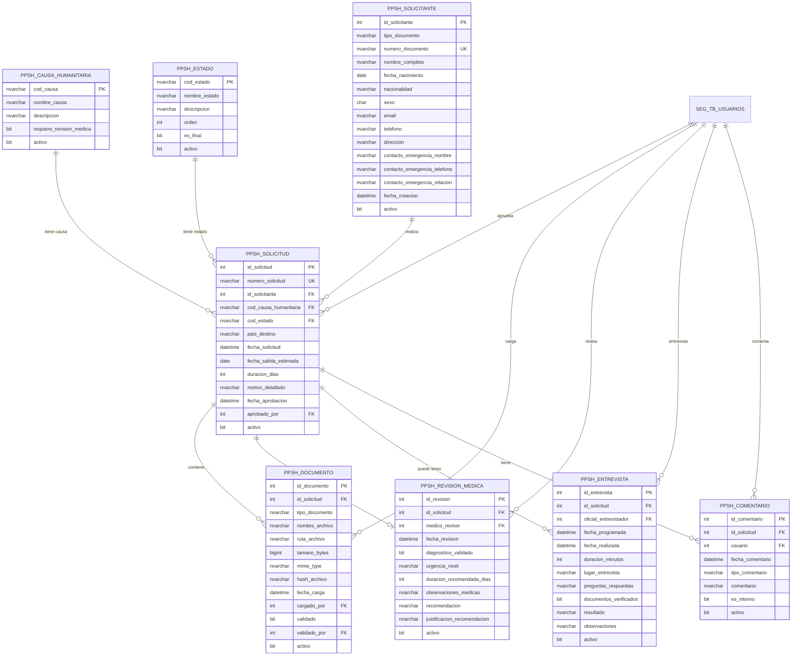

# Módulo PPSH (Permiso Provisorio de Salida Humanitaria)

Sistema especializado para gestión de permisos provisorios de salida por causas humanitarias.

---

## Descripción del Módulo

El módulo PPSH gestiona el ciclo completo de solicitudes de **Permiso Provisorio de Salida Humanitaria**, desde la solicitud inicial hasta la aprobación o rechazo, incluyendo:

- ✅ Registro de solicitantes y datos personales
- 📄 Gestión de documentos adjuntos
- 🏥 Revisiones médicas cuando sea necesario
- 👥 Entrevistas con oficiales
- 💬 Sistema de comentarios y bitácora
- 📊 Estados del flujo de aprobación
- 📋 Catálogos de causas humanitarias

---

## Arquitectura del Módulo


---

## 1. Tabla: `PPSH_SOLICITUD`

**Descripción**: Tabla principal de solicitudes de Permiso Provisorio de Salida Humanitaria.

### Estructura

| Columna | Tipo de Dato | Nulo | Default | PK | FK | Descripción |
|---------|--------------|------|---------|----|----|-------------|
| `id_solicitud` | INT | NO | IDENTITY(1,1) | ✅ | | Identificador único de la solicitud |
| `numero_solicitud` | NVARCHAR(50) | NO | - | | | Número único formato: PPSH-YYYY-NNNN |
| `id_solicitante` | INT | NO | - | | ✅ | ID del solicitante (FK) |
| `cod_causa_humanitaria` | NVARCHAR(20) | NO | - | | ✅ | Código de causa humanitaria |
| `cod_estado` | NVARCHAR(20) | NO | 'PENDIENTE' | | ✅ | Estado actual de la solicitud |
| `pais_destino` | NVARCHAR(100) | YES | NULL | | | País al que viajará |
| `fecha_solicitud` | DATETIME | NO | GETDATE() | | | Fecha de solicitud |
| `fecha_salida_estimada` | DATE | YES | NULL | | | Fecha estimada de salida |
| `duracion_dias` | INT | YES | NULL | | | Duración estimada en días |
| `fecha_ultima_actualizacion` | DATETIME | YES | NULL | | | Última actualización |
| `motivo_detallado` | NVARCHAR(MAX) | YES | NULL | | | Justificación detallada |
| `observaciones` | NVARCHAR(MAX) | YES | NULL | | | Observaciones adicionales |
| `fecha_aprobacion` | DATETIME | YES | NULL | | | Fecha de aprobación (si aplica) |
| `fecha_rechazo` | DATETIME | YES | NULL | | | Fecha de rechazo (si aplica) |
| `motivo_rechazo` | NVARCHAR(MAX) | YES | NULL | | | Motivo de rechazo |
| `aprobado_por` | INT | YES | NULL | | ✅ | Usuario que aprobó/rechazó |
| `activo` | BIT | NO | 1 | | | Registro activo |

### Índices

```sql
-- Primary Key
CREATE CLUSTERED INDEX PK_PPSH_SOLICITUD 
ON PPSH_SOLICITUD(id_solicitud);

-- Número de solicitud único
CREATE UNIQUE NONCLUSTERED INDEX UK_PPSH_SOLICITUD_numero 
ON PPSH_SOLICITUD(numero_solicitud);

-- Búsquedas por solicitante
CREATE NONCLUSTERED INDEX IX_PPSH_SOLICITUD_solicitante 
ON PPSH_SOLICITUD(id_solicitante)
INCLUDE (numero_solicitud, cod_estado, fecha_solicitud);

-- Búsquedas por estado
CREATE NONCLUSTERED INDEX IX_PPSH_SOLICITUD_estado 
ON PPSH_SOLICITUD(cod_estado, fecha_solicitud DESC);

-- Búsquedas por fecha (recientes primero)
CREATE NONCLUSTERED INDEX IX_PPSH_SOLICITUD_fecha 
ON PPSH_SOLICITUD(fecha_solicitud DESC)
INCLUDE (numero_solicitud, id_solicitante, cod_estado);
```

### Foreign Keys

```sql
ALTER TABLE PPSH_SOLICITUD
ADD CONSTRAINT FK_PPSH_SOLICITUD_SOLICITANTE
FOREIGN KEY (id_solicitante) 
REFERENCES PPSH_SOLICITANTE(id_solicitante);

ALTER TABLE PPSH_SOLICITUD
ADD CONSTRAINT FK_PPSH_SOLICITUD_CAUSA
FOREIGN KEY (cod_causa_humanitaria) 
REFERENCES PPSH_CAUSA_HUMANITARIA(cod_causa);

ALTER TABLE PPSH_SOLICITUD
ADD CONSTRAINT FK_PPSH_SOLICITUD_ESTADO
FOREIGN KEY (cod_estado) 
REFERENCES PPSH_ESTADO(cod_estado);

ALTER TABLE PPSH_SOLICITUD
ADD CONSTRAINT FK_PPSH_SOLICITUD_APROBADOR
FOREIGN KEY (aprobado_por) 
REFERENCES SEG_TB_USUARIOS(id_usuario);
```

### Ejemplo de Uso

```sql
-- Crear nueva solicitud
INSERT INTO PPSH_SOLICITUD (
    numero_solicitud,
    id_solicitante,
    cod_causa_humanitaria,
    cod_estado,
    pais_destino,
    fecha_salida_estimada,
    duracion_dias,
    motivo_detallado
)
VALUES (
    'PPSH-2025-0001',
    1,
    'EMERG_MED',
    'PENDIENTE',
    'Estados Unidos',
    '2025-02-15',
    30,
    'Atención médica especializada para tratamiento oncológico urgente'
);

-- Consultar solicitudes pendientes
SELECT 
    s.numero_solicitud,
    sol.nombre_completo,
    c.nombre_causa,
    e.nombre_estado,
    s.fecha_solicitud,
    s.pais_destino
FROM PPSH_SOLICITUD s
INNER JOIN PPSH_SOLICITANTE sol ON s.id_solicitante = sol.id_solicitante
INNER JOIN PPSH_CAUSA_HUMANITARIA c ON s.cod_causa_humanitaria = c.cod_causa
INNER JOIN PPSH_ESTADO e ON s.cod_estado = e.cod_estado
WHERE s.cod_estado = 'PENDIENTE'
  AND s.activo = 1
ORDER BY s.fecha_solicitud ASC;
```

---

## 2. Tabla: `PPSH_SOLICITANTE`

**Descripción**: Información personal de los solicitantes del PPSH.

### Estructura

| Columna | Tipo de Dato | Nulo | Default | PK | Descripción |
|---------|--------------|------|---------|-------|-------------|
| `id_solicitante` | INT | NO | IDENTITY(1,1) | ✅ | ID único del solicitante |
| `tipo_documento` | NVARCHAR(20) | NO | - | | CEDULA, PASAPORTE, OTRO |
| `numero_documento` | NVARCHAR(50) | NO | - | | Número de documento |
| `nombre_completo` | NVARCHAR(200) | NO | - | | Nombre completo |
| `fecha_nacimiento` | DATE | NO | - | | Fecha de nacimiento |
| `nacionalidad` | NVARCHAR(100) | NO | - | | Nacionalidad |
| `sexo` | CHAR(1) | YES | NULL | | M=Masculino, F=Femenino |
| `email` | NVARCHAR(200) | YES | NULL | | Email de contacto |
| `telefono` | NVARCHAR(50) | YES | NULL | | Teléfono de contacto |
| `direccion` | NVARCHAR(500) | YES | NULL | | Dirección actual |
| `contacto_emergencia_nombre` | NVARCHAR(200) | YES | NULL | | Nombre contacto emergencia |
| `contacto_emergencia_telefono` | NVARCHAR(50) | YES | NULL | | Teléfono emergencia |
| `contacto_emergencia_relacion` | NVARCHAR(100) | YES | NULL | | Relación con solicitante |
| `fecha_creacion` | DATETIME | NO | GETDATE() | | Fecha de registro |
| `activo` | BIT | NO | 1 | | Registro activo |

### Índices y Constraints

```sql
-- Primary Key
CREATE CLUSTERED INDEX PK_PPSH_SOLICITANTE 
ON PPSH_SOLICITANTE(id_solicitante);

-- Documento único por tipo
CREATE UNIQUE NONCLUSTERED INDEX UK_PPSH_SOLICITANTE_documento 
ON PPSH_SOLICITANTE(tipo_documento, numero_documento);

-- Búsqueda por email
CREATE NONCLUSTERED INDEX IX_PPSH_SOLICITANTE_email 
ON PPSH_SOLICITANTE(email);

-- Check: Tipo de documento válido
ALTER TABLE PPSH_SOLICITANTE
ADD CONSTRAINT CK_PPSH_SOLICITANTE_tipo_doc
CHECK (tipo_documento IN ('CEDULA', 'PASAPORTE', 'OTRO'));

-- Check: Sexo válido
ALTER TABLE PPSH_SOLICITANTE
ADD CONSTRAINT CK_PPSH_SOLICITANTE_sexo
CHECK (sexo IN ('M', 'F'));

-- Check: Edad mayor a 18 años
ALTER TABLE PPSH_SOLICITANTE
ADD CONSTRAINT CK_PPSH_SOLICITANTE_edad
CHECK (DATEDIFF(YEAR, fecha_nacimiento, GETDATE()) >= 18);
```

### Ejemplo de Uso

```sql
-- Registrar solicitante
INSERT INTO PPSH_SOLICITANTE (
    tipo_documento,
    numero_documento,
    nombre_completo,
    fecha_nacimiento,
    nacionalidad,
    sexo,
    email,
    telefono,
    direccion,
    contacto_emergencia_nombre,
    contacto_emergencia_telefono,
    contacto_emergencia_relacion
)
VALUES (
    'CEDULA',
    '8-123-4567',
    'Juan Carlos Pérez García',
    '1985-05-15',
    'Panameña',
    'M',
    'juan.perez@email.com',
    '+507 6000-0000',
    'Calle 50, Ciudad de Panamá',
    'María Pérez',
    '+507 6111-1111',
    'Madre'
);

-- Buscar solicitante por documento
SELECT * FROM PPSH_SOLICITANTE
WHERE tipo_documento = 'CEDULA'
  AND numero_documento = '8-123-4567'
  AND activo = 1;
```

---

## 3. Tabla: `PPSH_CAUSA_HUMANITARIA`

**Descripción**: Catálogo de causas humanitarias válidas para solicitar el permiso.

### Estructura

| Columna | Tipo de Dato | Nulo | Default | PK | Descripción |
|---------|--------------|------|---------|-------|-------------|
| `cod_causa` | NVARCHAR(20) | NO | - | ✅ | Código único de causa |
| `nombre_causa` | NVARCHAR(200) | NO | - | | Nombre de la causa |
| `descripcion` | NVARCHAR(500) | YES | NULL | | Descripción detallada |
| `requiere_revision_medica` | BIT | NO | 0 | | Indica si requiere revisión médica |
| `activo` | BIT | NO | 1 | | Catálogo activo |

### Datos Iniciales

```sql
INSERT INTO PPSH_CAUSA_HUMANITARIA (cod_causa, nombre_causa, descripcion, requiere_revision_medica)
VALUES
    ('EMERG_MED', 'Emergencia Médica', 'Atención médica urgente en el extranjero', 1),
    ('FALLE_FAM', 'Fallecimiento de Familiar', 'Fallecimiento de familiar directo en el extranjero', 0),
    ('ENFER_FAM', 'Enfermedad de Familiar', 'Enfermedad grave de familiar directo', 1),
    ('CASO_ESP', 'Caso Especial', 'Caso especial evaluado individualmente', 0),
    ('TRAT_MED', 'Tratamiento Médico', 'Tratamiento médico especializado no disponible en Panamá', 1),
    ('CIRU_URG', 'Cirugía Urgente', 'Cirugía urgente programada en el extranjero', 1);
```

---

## 4. Tabla: `PPSH_ESTADO`

**Descripción**: Estados posibles en el flujo de procesamiento de una solicitud PPSH.

### Estructura

| Columna | Tipo de Dato | Nulo | Default | PK | Descripción |
|---------|--------------|------|---------|-------|-------------|
| `cod_estado` | NVARCHAR(20) | NO | - | ✅ | Código único del estado |
| `nombre_estado` | NVARCHAR(100) | NO | - | | Nombre del estado |
| `descripcion` | NVARCHAR(500) | YES | NULL | | Descripción |
| `orden` | INT | NO | - | | Orden en el flujo |
| `es_final` | BIT | NO | 0 | | Indica si es estado final |
| `activo` | BIT | NO | 1 | | Estado activo |

### Flujo de Estados

```mermaid
stateDiagram-v2
    [*] --> PENDIENTE
    PENDIENTE --> REV_DOC: Iniciar Revisión
    REV_DOC --> REV_MED: Requiere Revisión Médica
    REV_DOC --> ENTREVISTA: No Requiere Médica
    REV_MED --> ENTREVISTA: Revisión Completada
    ENTREVISTA --> DECISION: Entrevista Completada
    DECISION --> APROBADO: Aprobar
    DECISION --> RECHAZADO: Rechazar
    PENDIENTE --> CANCELADO: Cancelar
    REV_DOC --> CANCELADO: Cancelar
    REV_MED --> CANCELADO: Cancelar
    ENTREVISTA --> CANCELADO: Cancelar
    APROBADO --> [*]
    RECHAZADO --> [*]
    CANCELADO --> [*]
    
    note right of PENDIENTE
        Estado inicial
    end note
    
    note right of APROBADO
        Estado final exitoso
    end note
```



### Datos Iniciales

```sql
INSERT INTO PPSH_ESTADO (cod_estado, nombre_estado, descripcion, orden, es_final)
VALUES
    ('PENDIENTE', 'Pendiente de Revisión', 'Solicitud recién creada, pendiente de asignación', 1, 0),
    ('REV_DOC', 'Revisión Documental', 'En proceso de revisión de documentos presentados', 2, 0),
    ('REV_MED', 'Revisión Médica', 'En proceso de revisión médica de la causa', 3, 0),
    ('ENTREVISTA', 'En Entrevista', 'Programada o en proceso de entrevista con oficial', 4, 0),
    ('DECISION', 'En Decisión', 'Evaluación final para aprobación o rechazo', 5, 0),
    ('APROBADO', 'Aprobado', 'Solicitud aprobada - permiso otorgado', 6, 1),
    ('RECHAZADO', 'Rechazado', 'Solicitud rechazada - permiso denegado', 6, 1),
    ('CANCELADO', 'Cancelado', 'Solicitud cancelada por el solicitante o sistema', 6, 1);
```

---

## 5. Tabla: `PPSH_DOCUMENTO`

**Descripción**: Documentos adjuntos a las solicitudes PPSH.

### Estructura

| Columna | Tipo de Dato | Nulo | Default | PK | FK | Descripción |
|---------|--------------|------|---------|----|----|-------------|
| `id_documento` | INT | NO | IDENTITY(1,1) | ✅ | | ID único del documento |
| `id_solicitud` | INT | NO | - | | ✅ | Solicitud asociada |
| `tipo_documento` | NVARCHAR(100) | NO | - | | | Tipo: PASAPORTE, CERT_MEDICO, etc. |
| `nombre_archivo` | NVARCHAR(500) | NO | - | | | Nombre del archivo |
| `ruta_archivo` | NVARCHAR(1000) | NO | - | | | Ruta en servidor |
| `tamano_bytes` | BIGINT | YES | NULL | | | Tamaño en bytes |
| `mime_type` | NVARCHAR(100) | YES | NULL | | | Tipo MIME |
| `hash_archivo` | NVARCHAR(64) | YES | NULL | | | Hash SHA256 para validación |
| `fecha_carga` | DATETIME | NO | GETDATE() | | | Fecha de carga |
| `cargado_por` | INT | YES | NULL | | ✅ | Usuario que cargó |
| `validado` | BIT | NO | 0 | | | Documento validado |
| `fecha_validacion` | DATETIME | YES | NULL | | | Fecha de validación |
| `validado_por` | INT | YES | NULL | | ✅ | Usuario que validó |
| `observaciones` | NVARCHAR(500) | YES | NULL | | | Observaciones |
| `activo` | BIT | NO | 1 | | | Documento activo |

### Tipos de Documento

| Tipo | Descripción | Requerido |
|------|-------------|-----------|
| `PASAPORTE` | Copia del pasaporte | ✅ Sí |
| `CEDULA` | Copia de cédula | ✅ Sí |
| `CERT_MEDICO` | Certificado médico | ⚕️ Si aplica |
| `CARTA_HOSPITAL` | Carta del hospital | ⚕️ Si aplica |
| `CARTA_FAMILIAR` | Carta de familiar | 👨‍👩‍👧 Si aplica |
| `CERT_DEFUNCION` | Certificado de defunción | ☠️ Si aplica |
| `OTRO` | Otro documento | ℹ️ Opcional |

### Índices y Foreign Keys

```sql
-- Primary Key
CREATE CLUSTERED INDEX PK_PPSH_DOCUMENTO 
ON PPSH_DOCUMENTO(id_documento);

-- Búsquedas por solicitud
CREATE NONCLUSTERED INDEX IX_PPSH_DOCUMENTO_solicitud 
ON PPSH_DOCUMENTO(id_solicitud, tipo_documento);

-- Búsquedas por tipo
CREATE NONCLUSTERED INDEX IX_PPSH_DOCUMENTO_tipo 
ON PPSH_DOCUMENTO(tipo_documento);

-- Foreign Keys
ALTER TABLE PPSH_DOCUMENTO
ADD CONSTRAINT FK_PPSH_DOCUMENTO_SOLICITUD
FOREIGN KEY (id_solicitud) 
REFERENCES PPSH_SOLICITUD(id_solicitud);

ALTER TABLE PPSH_DOCUMENTO
ADD CONSTRAINT FK_PPSH_DOCUMENTO_CARGADOR
FOREIGN KEY (cargado_por) 
REFERENCES SEG_TB_USUARIOS(id_usuario);
```

### Ejemplo de Uso

```sql
-- Cargar documento
INSERT INTO PPSH_DOCUMENTO (
    id_solicitud,
    tipo_documento,
    nombre_archivo,
    ruta_archivo,
    tamano_bytes,
    mime_type,
    hash_archivo,
    cargado_por
)
VALUES (
    1,
    'CERT_MEDICO',
    'certificado_medico_2025.pdf',
    '/uploads/ppsh/2025/01/certificado_medico_2025.pdf',
    245760,
    'application/pdf',
    'a3b2c1d4e5f6...',
    5
);

-- Validar documento
UPDATE PPSH_DOCUMENTO
SET 
    validado = 1,
    fecha_validacion = GETDATE(),
    validado_por = 3,
    observaciones = 'Documento verificado y válido'
WHERE id_documento = 1;

-- Listar documentos de una solicitud
SELECT 
    d.tipo_documento,
    d.nombre_archivo,
    d.tamano_bytes / 1024 AS tamano_kb,
    d.validado,
    u.nombre_completo AS validado_por,
    d.fecha_validacion
FROM PPSH_DOCUMENTO d
LEFT JOIN SEG_TB_USUARIOS u ON d.validado_por = u.id_usuario
WHERE d.id_solicitud = 1
  AND d.activo = 1;
```

---

## 6. Tabla: `PPSH_REVISION_MEDICA`

**Descripción**: Revisiones médicas realizadas a solicitudes que lo requieren.

### Estructura

| Columna | Tipo de Dato | Nulo | Default | PK | FK | Descripción |
|---------|--------------|------|---------|----|----|-------------|
| `id_revision` | INT | NO | IDENTITY(1,1) | ✅ | | ID único de revisión |
| `id_solicitud` | INT | NO | - | | ✅ | Solicitud revisada |
| `medico_revisor` | INT | NO | - | | ✅ | Usuario médico que revisa |
| `fecha_revision` | DATETIME | NO | GETDATE() | | | Fecha de revisión |
| `diagnostico_validado` | BIT | YES | NULL | | | ¿Diagnóstico es válido? |
| `urgencia_nivel` | NVARCHAR(20) | YES | NULL | | | BAJO, MEDIO, ALTO, CRITICO |
| `duracion_recomendada_dias` | INT | YES | NULL | | | Días recomendados |
| `observaciones_medicas` | NVARCHAR(MAX) | YES | NULL | | | Observaciones del médico |
| `recomendacion` | NVARCHAR(50) | NO | - | | | APROBAR, RECHAZAR, SOLICITAR_INFO |
| `justificacion_recomendacion` | NVARCHAR(MAX) | YES | NULL | | | Justificación |
| `activo` | BIT | NO | 1 | | | Registro activo |

### Índices y Constraints

```sql
-- Primary Key
CREATE CLUSTERED INDEX PK_PPSH_REVISION_MEDICA 
ON PPSH_REVISION_MEDICA(id_revision);

-- Una revisión por solicitud (puede cambiar si se permiten múltiples)
CREATE UNIQUE NONCLUSTERED INDEX UK_PPSH_REVISION_MEDICA_solicitud 
ON PPSH_REVISION_MEDICA(id_solicitud) 
WHERE activo = 1;

-- Check: Nivel de urgencia válido
ALTER TABLE PPSH_REVISION_MEDICA
ADD CONSTRAINT CK_PPSH_REVISION_MEDICA_urgencia
CHECK (urgencia_nivel IN ('BAJO', 'MEDIO', 'ALTO', 'CRITICO'));

-- Check: Recomendación válida
ALTER TABLE PPSH_REVISION_MEDICA
ADD CONSTRAINT CK_PPSH_REVISION_MEDICA_recomendacion
CHECK (recomendacion IN ('APROBAR', 'RECHAZAR', 'SOLICITAR_INFO'));

-- Foreign Keys
ALTER TABLE PPSH_REVISION_MEDICA
ADD CONSTRAINT FK_PPSH_REVISION_MEDICA_SOLICITUD
FOREIGN KEY (id_solicitud) 
REFERENCES PPSH_SOLICITUD(id_solicitud);

ALTER TABLE PPSH_REVISION_MEDICA
ADD CONSTRAINT FK_PPSH_REVISION_MEDICA_MEDICO
FOREIGN KEY (medico_revisor) 
REFERENCES SEG_TB_USUARIOS(id_usuario);
```

### Ejemplo de Uso

```sql
-- Crear revisión médica
INSERT INTO PPSH_REVISION_MEDICA (
    id_solicitud,
    medico_revisor,
    diagnostico_validado,
    urgencia_nivel,
    duracion_recomendada_dias,
    observaciones_medicas,
    recomendacion,
    justificacion_recomendacion
)
VALUES (
    1,
    10, -- ID del médico
    1,
    'ALTO',
    45,
    'Paciente requiere tratamiento oncológico especializado no disponible en Panamá. Documentación médica completa y válida.',
    'APROBAR',
    'Caso validado. Recomiendo aprobación urgente por 45 días para tratamiento en el extranjero.'
);

-- Consultar revisiones médicas pendientes
SELECT 
    s.numero_solicitud,
    sol.nombre_completo,
    c.nombre_causa,
    m.nombre_completo AS medico,
    r.urgencia_nivel,
    r.recomendacion,
    r.fecha_revision
FROM PPSH_REVISION_MEDICA r
INNER JOIN PPSH_SOLICITUD s ON r.id_solicitud = s.id_solicitud
INNER JOIN PPSH_SOLICITANTE sol ON s.id_solicitante = sol.id_solicitante
INNER JOIN PPSH_CAUSA_HUMANITARIA c ON s.cod_causa_humanitaria = c.cod_causa
INNER JOIN SEG_TB_USUARIOS m ON r.medico_revisor = m.id_usuario
WHERE r.activo = 1
ORDER BY r.fecha_revision DESC;
```

---

## 7. Tabla: `PPSH_ENTREVISTA`

**Descripción**: Entrevistas realizadas a solicitantes por oficiales de migración.

### Estructura

| Columna | Tipo de Dato | Nulo | Default | PK | FK | Descripción |
|---------|--------------|------|---------|----|----|-------------|
| `id_entrevista` | INT | NO | IDENTITY(1,1) | ✅ | | ID único de entrevista |
| `id_solicitud` | INT | NO | - | | ✅ | Solicitud entrevistada |
| `oficial_entrevistador` | INT | NO | - | | ✅ | Usuario que entrevista |
| `fecha_programada` | DATETIME | YES | NULL | | | Fecha programada |
| `fecha_realizada` | DATETIME | YES | NULL | | | Fecha real de entrevista |
| `duracion_minutos` | INT | YES | NULL | | | Duración en minutos |
| `lugar_entrevista` | NVARCHAR(200) | YES | NULL | | | Lugar donde se realizó |
| `preguntas_respuestas` | NVARCHAR(MAX) | YES | NULL | | | JSON con preguntas y respuestas |
| `documentos_verificados` | BIT | YES | NULL | | | ¿Se verificaron documentos originales? |
| `resultado` | NVARCHAR(50) | YES | NULL | | | VERIFICADO, REQUIERE_ACLARA, INCONSISTENTE |
| `observaciones` | NVARCHAR(MAX) | YES | NULL | | | Observaciones del oficial |
| `activo` | BIT | NO | 1 | | | Registro activo |

### Índices y Constraints

```sql
-- Primary Key
CREATE CLUSTERED INDEX PK_PPSH_ENTREVISTA 
ON PPSH_ENTREVISTA(id_entrevista);

-- Búsqueda por solicitud
CREATE NONCLUSTERED INDEX IX_PPSH_ENTREVISTA_solicitud 
ON PPSH_ENTREVISTA(id_solicitud);

-- Búsqueda por fechas programadas
CREATE NONCLUSTERED INDEX IX_PPSH_ENTREVISTA_fecha 
ON PPSH_ENTREVISTA(fecha_programada)
WHERE fecha_programada IS NOT NULL;

-- Check: Resultado válido
ALTER TABLE PPSH_ENTREVISTA
ADD CONSTRAINT CK_PPSH_ENTREVISTA_resultado
CHECK (resultado IN ('VERIFICADO', 'REQUIERE_ACLARA', 'INCONSISTENTE'));

-- Foreign Keys
ALTER TABLE PPSH_ENTREVISTA
ADD CONSTRAINT FK_PPSH_ENTREVISTA_SOLICITUD
FOREIGN KEY (id_solicitud) 
REFERENCES PPSH_SOLICITUD(id_solicitud);

ALTER TABLE PPSH_ENTREVISTA
ADD CONSTRAINT FK_PPSH_ENTREVISTA_OFICIAL
FOREIGN KEY (oficial_entrevistador) 
REFERENCES SEG_TB_USUARIOS(id_usuario);
```

### Ejemplo de Uso

```sql
-- Programar entrevista
INSERT INTO PPSH_ENTREVISTA (
    id_solicitud,
    oficial_entrevistador,
    fecha_programada,
    lugar_entrevista
)
VALUES (
    1,
    8, -- ID del oficial
    '2025-01-25 10:00:00',
    'Oficina Central - Sala 3'
);

-- Registrar entrevista realizada
UPDATE PPSH_ENTREVISTA
SET 
    fecha_realizada = '2025-01-25 10:15:00',
    duracion_minutos = 45,
    documentos_verificados = 1,
    preguntas_respuestas = '{
        "preguntas": [
            {"q": "¿Cuál es el motivo exacto del viaje?", "r": "Tratamiento oncológico urgente"},
            {"q": "¿Tiene familiares en el país destino?", "r": "Sí, hermana que me acompañará"},
            {"q": "¿Cuenta con recursos para el viaje?", "r": "Sí, documentación financiera presentada"}
        ]
    }',
    resultado = 'VERIFICADO',
    observaciones = 'Solicitante proporciona información consistente. Documentos originales verificados. Recomiendo aprobar.'
WHERE id_entrevista = 1;

-- Listar entrevistas programadas para hoy
SELECT 
    e.fecha_programada,
    s.numero_solicitud,
    sol.nombre_completo,
    e.lugar_entrevista,
    u.nombre_completo AS oficial
FROM PPSH_ENTREVISTA e
INNER JOIN PPSH_SOLICITUD s ON e.id_solicitud = s.id_solicitud
INNER JOIN PPSH_SOLICITANTE sol ON s.id_solicitante = sol.id_solicitante
INNER JOIN SEG_TB_USUARIOS u ON e.oficial_entrevistador = u.id_usuario
WHERE CAST(e.fecha_programada AS DATE) = CAST(GETDATE() AS DATE)
  AND e.fecha_realizada IS NULL
  AND e.activo = 1
ORDER BY e.fecha_programada ASC;
```

---

## 8. Tabla: `PPSH_COMENTARIO`

**Descripción**: Comentarios y bitácora de una solicitud PPSH.

### Estructura

| Columna | Tipo de Dato | Nulo | Default | PK | FK | Descripción |
|---------|--------------|------|---------|----|----|-------------|
| `id_comentario` | INT | NO | IDENTITY(1,1) | ✅ | | ID único del comentario |
| `id_solicitud` | INT | NO | - | | ✅ | Solicitud comentada |
| `usuario` | INT | NO | - | | ✅ | Usuario que comenta |
| `fecha_comentario` | DATETIME | NO | GETDATE() | | | Fecha del comentario |
| `tipo_comentario` | NVARCHAR(50) | NO | - | | | NOTA, OBSERVACION, SOLICITUD, RESPUESTA |
| `comentario` | NVARCHAR(MAX) | NO | - | | | Texto del comentario |
| `es_interno` | BIT | NO | 0 | | | Comentario visible solo internamente |
| `activo` | BIT | NO | 1 | | | Comentario activo |

### Índices y Constraints

```sql
-- Primary Key
CREATE CLUSTERED INDEX PK_PPSH_COMENTARIO 
ON PPSH_COMENTARIO(id_comentario);

-- Búsqueda por solicitud (orden cronológico inverso)
CREATE NONCLUSTERED INDEX IX_PPSH_COMENTARIO_solicitud 
ON PPSH_COMENTARIO(id_solicitud, fecha_comentario DESC);

-- Check: Tipo de comentario válido
ALTER TABLE PPSH_COMENTARIO
ADD CONSTRAINT CK_PPSH_COMENTARIO_tipo
CHECK (tipo_comentario IN ('NOTA', 'OBSERVACION', 'SOLICITUD', 'RESPUESTA'));

-- Foreign Keys
ALTER TABLE PPSH_COMENTARIO
ADD CONSTRAINT FK_PPSH_COMENTARIO_SOLICITUD
FOREIGN KEY (id_solicitud) 
REFERENCES PPSH_SOLICITUD(id_solicitud);

ALTER TABLE PPSH_COMENTARIO
ADD CONSTRAINT FK_PPSH_COMENTARIO_USUARIO
FOREIGN KEY (usuario) 
REFERENCES SEG_TB_USUARIOS(id_usuario);
```

### Ejemplo de Uso

```sql
-- Agregar comentario interno
INSERT INTO PPSH_COMENTARIO (
    id_solicitud,
    usuario,
    tipo_comentario,
    comentario,
    es_interno
)
VALUES (
    1,
    5, -- ID del usuario
    'OBSERVACION',
    'Se verificó documentación médica. Todo en orden. Proceder con entrevista.',
    1 -- Solo visible internamente
);

-- Agregar nota pública (visible para solicitante)
INSERT INTO PPSH_COMENTARIO (
    id_solicitud,
    usuario,
    tipo_comentario,
    comentario,
    es_interno
)
VALUES (
    1,
    5,
    'NOTA',
    'Su solicitud ha pasado a revisión médica. Recibirá notificación en 2-3 días hábiles.',
    0 -- Visible públicamente
);

-- Ver historial completo de comentarios
SELECT 
    c.fecha_comentario,
    u.nombre_completo AS usuario,
    c.tipo_comentario,
    c.comentario,
    CASE WHEN c.es_interno = 1 THEN 'INTERNO' ELSE 'PÚBLICO' END AS visibilidad
FROM PPSH_COMENTARIO c
INNER JOIN SEG_TB_USUARIOS u ON c.usuario = u.id_usuario
WHERE c.id_solicitud = 1
  AND c.activo = 1
ORDER BY c.fecha_comentario DESC;

-- Ver solo comentarios públicos (para el solicitante)
SELECT 
    c.fecha_comentario,
    c.tipo_comentario,
    c.comentario
FROM PPSH_COMENTARIO c
WHERE c.id_solicitud = 1
  AND c.es_interno = 0
  AND c.activo = 1
ORDER BY c.fecha_comentario DESC;
```

---

## Diagrama ER Completo del Módulo



---

## Consultas Analíticas

### Estadísticas Generales

```sql
-- Total de solicitudes por estado
SELECT 
    e.nombre_estado,
    COUNT(*) AS total,
    COUNT(*) * 100.0 / SUM(COUNT(*)) OVER() AS porcentaje
FROM PPSH_SOLICITUD s
INNER JOIN PPSH_ESTADO e ON s.cod_estado = e.cod_estado
WHERE s.activo = 1
GROUP BY e.nombre_estado, e.orden
ORDER BY e.orden;

-- Solicitudes por causa humanitaria
SELECT 
    c.nombre_causa,
    COUNT(*) AS total_solicitudes,
    SUM(CASE WHEN s.cod_estado = 'APROBADO' THEN 1 ELSE 0 END) AS aprobadas,
    SUM(CASE WHEN s.cod_estado = 'RECHAZADO' THEN 1 ELSE 0 END) AS rechazadas,
    AVG(DATEDIFF(DAY, s.fecha_solicitud, COALESCE(s.fecha_aprobacion, s.fecha_rechazo, GETDATE()))) AS dias_promedio
FROM PPSH_SOLICITUD s
INNER JOIN PPSH_CAUSA_HUMANITARIA c ON s.cod_causa_humanitaria = c.cod_causa
WHERE s.activo = 1
GROUP BY c.nombre_causa
ORDER BY total_solicitudes DESC;

-- Tiempo promedio por etapa del proceso
SELECT 
    AVG(DATEDIFF(DAY, s.fecha_solicitud, s.fecha_aprobacion)) AS dias_hasta_aprobacion,
    MIN(DATEDIFF(DAY, s.fecha_solicitud, s.fecha_aprobacion)) AS minimo_dias,
    MAX(DATEDIFF(DAY, s.fecha_solicitud, s.fecha_aprobacion)) AS maximo_dias
FROM PPSH_SOLICITUD s
WHERE s.cod_estado = 'APROBADO'
  AND s.activo = 1
  AND s.fecha_aprobacion IS NOT NULL;
```

---

## Navegación

[← Módulo Trámites](modulo-tramites.md) | [Diccionario de Datos](index.md) | [Módulo Workflows →](modulo-workflows.md)
