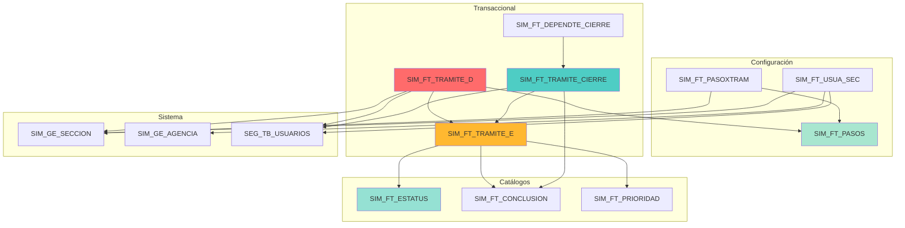

# 🔄 Módulo SIM_FT - Sistema de Flujo de Trámites

Sistema de gestión de flujo de trámites con seguimiento paso a paso y control de usuarios por sección.

---

## 📋 Información General

| Propiedad | Valor |
|-----------|-------|
| **Módulo** | SIM_FT (Sistema de Flujo de Trámites) |
| **Total de Tablas** | 10 tablas |
| **Versión** | 1.0 |
| **Implementado** | Octubre 2025 |
| **Estado** | ✅ Activo |

!!! success "Nuevo Módulo"
    Sistema recién implementado para proporcionar trazabilidad completa de trámites con seguimiento paso a paso.

---

## 🗂️ Estructura de Tablas

### Tablas de Catálogo

#### 1. SIM_FT_ESTATUS

Catálogo de estados de trámites.

| Campo | Tipo | PK | Descripción |
|-------|------|:--:|-------------|
| `COD_ESTATUS` | VARCHAR(2) | ✓ | Código del estado |
| `NOM_ESTATUS` | VARCHAR(100) | | Nombre del estado |
| `IND_ACTIVO` | VARCHAR(1) | | Indicador activo (S/N) |
| `ID_USUARIO_CREA` | VARCHAR(17) | | Usuario que creó |
| `FEC_CREA_REG` | DATETIME | | Fecha creación |
| `ID_USUARIO_MODIF` | VARCHAR(17) | | Usuario modificación |
| `FEC_MODIF_REG` | DATETIME | | Fecha modificación |

**Valores Típicos**:
- `PE` - Pendiente
- `EP` - En Proceso
- `CO` - Completado
- `CA` - Cancelado
- `SU` - Suspendido

---

#### 2. SIM_FT_CONCLUSION

Catálogo de tipos de conclusión de trámites.

| Campo | Tipo | PK | Descripción |
|-------|------|:--:|-------------|
| `COD_CONCLUSION` | VARCHAR(2) | ✓ | Código de conclusión |
| `NOM_CONCLUSION` | VARCHAR(100) | | Nombre conclusión |
| `IND_ACTIVO` | VARCHAR(1) | | Indicador activo |
| `ID_USUARIO_CREA` | VARCHAR(17) | | Usuario creación |
| `FEC_CREA_REG` | DATETIME | | Fecha creación |
| `ID_USUARIO_MODIF` | VARCHAR(17) | | Usuario modificación |
| `FEC_MODIF_REG` | DATETIME | | Fecha modificación |

**Valores Típicos**:
- `AP` - Aprobado
- `RE` - Rechazado
- `AB` - Abandonado
- `TR` - Transferido

---

#### 3. SIM_FT_PRIORIDAD

Catálogo de niveles de prioridad.

| Campo | Tipo | PK | Descripción |
|-------|------|:--:|-------------|
| `COD_PRIORIDAD` | VARCHAR(1) | ✓ | Código prioridad |
| `NOM_PRIORIDAD` | VARCHAR(50) | | Nombre prioridad |
| `IND_ACTIVO` | VARCHAR(1) | | Indicador activo |
| `ID_USUARIO_CREA` | VARCHAR(17) | | Usuario creación |
| `FEC_CREA_REG` | DATETIME | | Fecha creación |
| `ID_USUARIO_MODIF` | VARCHAR(17) | | Usuario modificación |
| `FEC_MODIF_REG` | DATETIME | | Fecha modificación |

**Valores**:
- `A` - Alta
- `M` - Media
- `B` - Baja
- `U` - Urgente

---

### Tablas de Configuración

#### 4. SIM_FT_PASOS

Define los pasos genéricos de los trámites.

| Campo | Tipo | PK | Descripción |
|-------|------|:--:|-------------|
| `COD_TRAMITE` | VARCHAR(10) | ✓ | Código del tipo de trámite |
| `NUM_PASO` | INT | ✓ | Número de paso |
| `NOM_DESCRIPCION` | VARCHAR(255) | | Descripción del paso |
| `IND_ACTIVO` | VARCHAR(1) | | Indicador activo |
| `ID_USUARIO_CREA` | VARCHAR(17) | | Usuario creación |
| `FEC_CREA_REG` | DATETIME | | Fecha creación |
| `ID_USUARIO_MODIF` | VARCHAR(17) | | Usuario modificación |
| `FEC_MODIF_REG` | DATETIME | | Fecha modificación |

**Primary Key**: (`COD_TRAMITE`, `NUM_PASO`)

**Ejemplo**:
```sql
INSERT INTO SIM_FT_PASOS VALUES 
('VISA001', 1, 'Recepción de documentos', 'S', 'ADMIN', GETDATE(), NULL, NULL),
('VISA001', 2, 'Revisión técnica', 'S', 'ADMIN', GETDATE(), NULL, NULL),
('VISA001', 3, 'Aprobación gerencial', 'S', 'ADMIN', GETDATE(), NULL, NULL);
```

---

#### 5. SIM_FT_PASOXTRAM

Configuración del flujo de pasos por trámite.

| Campo | Tipo | PK | Descripción |
|-------|------|:--:|-------------|
| `COD_TRAMITE` | VARCHAR(10) | ✓ | Código del trámite |
| `NUM_PASO` | INT | ✓ | Número de paso |
| `COD_SECCION` | VARCHAR(4) | | Sección responsable |
| `ID_PASO_SGTE` | INT | | ID del siguiente paso |
| `IND_ACTIVO` | VARCHAR(1) | | Indicador activo |
| `ID_USUARIO_CREA` | VARCHAR(17) | | Usuario creación |
| `FEC_CREA_REG` | DATETIME | | Fecha creación |
| `ID_USUARIO_MODIF` | VARCHAR(17) | | Usuario modificación |
| `FEC_MODIF_REG` | DATETIME | | Fecha modificación |

**Primary Key**: (`COD_TRAMITE`, `NUM_PASO`)

**Relaciones**:
- FK → `SIM_FT_PASOS` (COD_TRAMITE, NUM_PASO)
- FK → `SIM_GE_SECCION` (COD_SECCION)

---

#### 6. SIM_FT_USUA_SEC

Asignación de usuarios a secciones.

| Campo | Tipo | PK | Descripción |
|-------|------|:--:|-------------|
| `ID_USUARIO` | VARCHAR(17) | ✓ | ID del usuario |
| `COD_SECCION` | VARCHAR(4) | ✓ | Código de sección |
| `COD_AGENCIA` | VARCHAR(4) | ✓ | Código de agencia |
| `IND_ACTIVO` | VARCHAR(1) | | Indicador activo |
| `ID_USUARIO_CREA` | VARCHAR(17) | | Usuario creación |
| `FEC_CREA_REG` | DATETIME | | Fecha creación |
| `ID_USUARIO_MODIF` | VARCHAR(17) | | Usuario modificación |
| `FEC_MODIF_REG` | DATETIME | | Fecha modificación |

**Primary Key**: (`ID_USUARIO`, `COD_SECCION`, `COD_AGENCIA`)

**Relaciones**:
- FK → `SEG_TB_USUARIOS` (ID_USUARIO)
- FK → `SIM_GE_SECCION` (COD_SECCION)
- FK → `SIM_GE_AGENCIA` (COD_AGENCIA)

---

### Tablas Transaccionales

#### 7. SIM_FT_TRAMITE_E

Tabla de encabezado de trámites.

| Campo | Tipo | PK | Descripción |
|-------|------|:--:|-------------|
| `NUM_ANNIO` | INT | ✓ | Año del trámite |
| `NUM_TRAMITE` | INT | ✓ | Número consecutivo |
| `NUM_REGISTRO` | INT | ✓ | Número de registro |
| `COD_TRAMITE` | VARCHAR(10) | | Tipo de trámite |
| `FEC_INI_TRAMITE` | DATETIME | | Fecha inicio |
| `FEC_FIN_TRAMITE` | DATETIME | | Fecha fin |
| `IND_ESTATUS` | VARCHAR(2) | | Estado actual |
| `IND_CONCLUSION` | VARCHAR(2) | | Conclusión |
| `IND_PRIORIDAD` | VARCHAR(1) | | Prioridad |
| `OBS_OBSERVA` | TEXT | | Observaciones |
| `HITS_TRAMITE` | INT | | Contador de accesos |
| `ID_USUARIO_CREA` | VARCHAR(17) | | Usuario creación |
| `FEC_ACTUALIZA` | DATETIME | | Fecha actualización |

**Primary Key**: (`NUM_ANNIO`, `NUM_TRAMITE`, `NUM_REGISTRO`)

**Relaciones**:
- FK → `SIM_FT_ESTATUS` (IND_ESTATUS)
- FK → `SIM_FT_CONCLUSION` (IND_CONCLUSION)
- FK → `SIM_FT_PRIORIDAD` (IND_PRIORIDAD)

**Ejemplo de Consulta**:
```sql
-- Trámites activos del año actual
SELECT 
    e.NUM_ANNIO,
    e.NUM_TRAMITE,
    e.COD_TRAMITE,
    est.NOM_ESTATUS,
    pri.NOM_PRIORIDAD,
    e.FEC_INI_TRAMITE
FROM SIM_FT_TRAMITE_E e
LEFT JOIN SIM_FT_ESTATUS est ON e.IND_ESTATUS = est.COD_ESTATUS
LEFT JOIN SIM_FT_PRIORIDAD pri ON e.IND_PRIORIDAD = pri.COD_PRIORIDAD
WHERE e.NUM_ANNIO = YEAR(GETDATE())
  AND e.IND_ESTATUS NOT IN ('CO', 'CA')
ORDER BY e.FEC_INI_TRAMITE DESC;
```

---

#### 8. SIM_FT_TRAMITE_D

Tabla de detalle de pasos ejecutados.

| Campo | Tipo | PK | Descripción |
|-------|------|:--:|-------------|
| `NUM_ANNIO` | INT | ✓ | Año del trámite |
| `NUM_TRAMITE` | INT | ✓ | Número trámite |
| `NUM_PASO` | INT | ✓ | Número de paso |
| `NUM_REGISTRO` | INT | ✓ | Número registro |
| `COD_TRAMITE` | VARCHAR(10) | | Tipo trámite |
| `NUM_ACTIVIDAD` | INT | | Número actividad |
| `COD_SECCION` | VARCHAR(4) | | Sección responsable |
| `COD_AGENCIA` | VARCHAR(4) | | Agencia |
| `ID_USUAR_RESP` | VARCHAR(17) | | Usuario responsable |
| `OBS_OBSERVACION` | TEXT | | Observaciones |
| `NUM_PASO_SGTE` | INT | | Siguiente paso |
| `IND_ESTATUS` | VARCHAR(2) | | Estado |
| `IND_CONCLUSION` | VARCHAR(2) | | Conclusión |
| `ID_USUARIO_CREA` | VARCHAR(17) | | Usuario creación |
| `FEC_ACTUALIZA` | DATETIME | | Fecha actualización |

**Primary Key**: (`NUM_ANNIO`, `NUM_TRAMITE`, `NUM_PASO`, `NUM_REGISTRO`)

**Relaciones**:
- FK → `SIM_FT_TRAMITE_E` (NUM_ANNIO, NUM_TRAMITE, NUM_REGISTRO)
- FK → `SIM_FT_PASOS` (COD_TRAMITE, NUM_PASO)
- FK → `SEG_TB_USUARIOS` (ID_USUAR_RESP)
- FK → `SIM_GE_SECCION` (COD_SECCION)

**Ejemplo de Consulta**:
```sql
-- Historial de pasos de un trámite
SELECT 
    d.NUM_PASO,
    p.NOM_DESCRIPCION,
    u.NOMBRE_USUARIO,
    sec.NOM_SECCION,
    d.FEC_ACTUALIZA,
    est.NOM_ESTATUS
FROM SIM_FT_TRAMITE_D d
LEFT JOIN SIM_FT_PASOS p ON d.COD_TRAMITE = p.COD_TRAMITE 
    AND d.NUM_PASO = p.NUM_PASO
LEFT JOIN SEG_TB_USUARIOS u ON d.ID_USUAR_RESP = u.ID_USUARIO
LEFT JOIN SIM_GE_SECCION sec ON d.COD_SECCION = sec.COD_SECCION
LEFT JOIN SIM_FT_ESTATUS est ON d.IND_ESTATUS = est.COD_ESTATUS
WHERE d.NUM_ANNIO = 2025 AND d.NUM_TRAMITE = 1234
ORDER BY d.NUM_PASO;
```

---

#### 9. SIM_FT_TRAMITE_CIERRE

Registro de cierre de trámites.

| Campo | Tipo | PK | Descripción |
|-------|------|:--:|-------------|
| `NUM_ANNIO` | INT | ✓ | Año |
| `NUM_TRAMITE` | INT | ✓ | Número trámite |
| `NUM_REGISTRO` | INT | ✓ | Número registro |
| `FEC_CIERRE` | DATETIME | | Fecha de cierre |
| `ID_USUARIO_CIERRE` | VARCHAR(17) | | Usuario que cerró |
| `OBS_CIERRE` | TEXT | | Observaciones |
| `COD_CONCLUSION` | VARCHAR(2) | | Conclusión |
| `ID_USUARIO_CREA` | VARCHAR(17) | | Usuario creación |
| `FEC_CREA_REG` | DATETIME | | Fecha creación |

**Primary Key**: (`NUM_ANNIO`, `NUM_TRAMITE`, `NUM_REGISTRO`)

**Relaciones**:
- FK → `SIM_FT_TRAMITE_E` (NUM_ANNIO, NUM_TRAMITE, NUM_REGISTRO)
- FK → `SIM_FT_CONCLUSION` (COD_CONCLUSION)
- FK → `SEG_TB_USUARIOS` (ID_USUARIO_CIERRE)

---

#### 10. SIM_FT_DEPENDTE_CIERRE

Registro de dependientes incluidos en el cierre.

| Campo | Tipo | PK | Descripción |
|-------|------|:--:|-------------|
| `NUM_ANNIO` | INT | ✓ | Año |
| `NUM_TRAMITE` | INT | ✓ | Número trámite |
| `NUM_REGISTRO` | INT | ✓ | Número registro |
| `NUM_REGISTRO_DEP` | INT | ✓ | Registro dependiente |
| `TIP_DEPENDENCIA` | VARCHAR(2) | | Tipo dependencia |
| `FEC_INCLUSION` | DATETIME | | Fecha inclusión |
| `ID_USUARIO_CREA` | VARCHAR(17) | | Usuario creación |
| `FEC_CREA_REG` | DATETIME | | Fecha creación |

**Primary Key**: (`NUM_ANNIO`, `NUM_TRAMITE`, `NUM_REGISTRO`, `NUM_REGISTRO_DEP`)

**Relaciones**:
- FK → `SIM_FT_TRAMITE_CIERRE` (NUM_ANNIO, NUM_TRAMITE, NUM_REGISTRO)

---

## 🔗 Diagrama de Relaciones



---

## 📊 Flujo del Sistema

### 1. Configuración Inicial

```sql
-- 1. Crear catálogos base
INSERT INTO SIM_FT_ESTATUS VALUES ('PE', 'Pendiente', 'S', 'ADMIN', GETDATE(), NULL, NULL);
INSERT INTO SIM_FT_CONCLUSION VALUES ('AP', 'Aprobado', 'S', 'ADMIN', GETDATE(), NULL, NULL);
INSERT INTO SIM_FT_PRIORIDAD VALUES ('M', 'Media', 'S', 'ADMIN', GETDATE(), NULL, NULL);

-- 2. Definir pasos del trámite
INSERT INTO SIM_FT_PASOS VALUES 
('VISA001', 1, 'Recepción', 'S', 'ADMIN', GETDATE(), NULL, NULL),
('VISA001', 2, 'Revisión', 'S', 'ADMIN', GETDATE(), NULL, NULL),
('VISA001', 3, 'Aprobación', 'S', 'ADMIN', GETDATE(), NULL, NULL);

-- 3. Configurar flujo
INSERT INTO SIM_FT_PASOXTRAM VALUES 
('VISA001', 1, 'REC', 2, 'S', 'ADMIN', GETDATE(), NULL, NULL),
('VISA001', 2, 'REV', 3, 'S', 'ADMIN', GETDATE(), NULL, NULL),
('VISA001', 3, 'APR', NULL, 'S', 'ADMIN', GETDATE(), NULL, NULL);

-- 4. Asignar usuarios a secciones
INSERT INTO SIM_FT_USUA_SEC VALUES 
('USER001', 'REC', 'A001', 'S', 'ADMIN', GETDATE(), NULL, NULL);
```

### 2. Creación de Trámite

```sql
-- Crear encabezado
INSERT INTO SIM_FT_TRAMITE_E 
(NUM_ANNIO, NUM_TRAMITE, NUM_REGISTRO, COD_TRAMITE, 
 FEC_INI_TRAMITE, IND_ESTATUS, IND_PRIORIDAD, ID_USUARIO_CREA, FEC_ACTUALIZA)
VALUES 
(2025, 1, 123456, 'VISA001', 
 GETDATE(), 'PE', 'M', 'USER001', GETDATE());

-- Crear primer paso
INSERT INTO SIM_FT_TRAMITE_D
(NUM_ANNIO, NUM_TRAMITE, NUM_PASO, NUM_REGISTRO, COD_TRAMITE,
 COD_SECCION, ID_USUAR_RESP, IND_ESTATUS, ID_USUARIO_CREA, FEC_ACTUALIZA)
VALUES
(2025, 1, 1, 123456, 'VISA001',
 'REC', 'USER001', 'EP', 'USER001', GETDATE());
```

### 3. Avance de Pasos

```sql
-- Completar paso actual y crear siguiente
BEGIN TRANSACTION;

-- Actualizar paso actual
UPDATE SIM_FT_TRAMITE_D
SET IND_ESTATUS = 'CO',
    IND_CONCLUSION = 'AP',
    FEC_ACTUALIZA = GETDATE()
WHERE NUM_ANNIO = 2025 AND NUM_TRAMITE = 1 
  AND NUM_PASO = 1 AND NUM_REGISTRO = 123456;

-- Crear siguiente paso
INSERT INTO SIM_FT_TRAMITE_D
(NUM_ANNIO, NUM_TRAMITE, NUM_PASO, NUM_REGISTRO, COD_TRAMITE,
 COD_SECCION, ID_USUAR_RESP, IND_ESTATUS, ID_USUARIO_CREA, FEC_ACTUALIZA)
VALUES
(2025, 1, 2, 123456, 'VISA001',
 'REV', 'USER002', 'PE', 'USER001', GETDATE());

-- Actualizar encabezado
UPDATE SIM_FT_TRAMITE_E
SET IND_ESTATUS = 'EP',
    FEC_ACTUALIZA = GETDATE()
WHERE NUM_ANNIO = 2025 AND NUM_TRAMITE = 1 AND NUM_REGISTRO = 123456;

COMMIT;
```

### 4. Cierre de Trámite

```sql
BEGIN TRANSACTION;

-- Registrar cierre
INSERT INTO SIM_FT_TRAMITE_CIERRE
(NUM_ANNIO, NUM_TRAMITE, NUM_REGISTRO, FEC_CIERRE,
 ID_USUARIO_CIERRE, COD_CONCLUSION, OBS_CIERRE, ID_USUARIO_CREA, FEC_CREA_REG)
VALUES
(2025, 1, 123456, GETDATE(),
 'USER003', 'AP', 'Trámite aprobado satisfactoriamente', 'USER003', GETDATE());

-- Actualizar encabezado
UPDATE SIM_FT_TRAMITE_E
SET IND_ESTATUS = 'CO',
    IND_CONCLUSION = 'AP',
    FEC_FIN_TRAMITE = GETDATE(),
    FEC_ACTUALIZA = GETDATE()
WHERE NUM_ANNIO = 2025 AND NUM_TRAMITE = 1 AND NUM_REGISTRO = 123456;

-- Incluir dependientes si aplica
INSERT INTO SIM_FT_DEPENDTE_CIERRE
(NUM_ANNIO, NUM_TRAMITE, NUM_REGISTRO, NUM_REGISTRO_DEP,
 TIP_DEPENDENCIA, FEC_INCLUSION, ID_USUARIO_CREA, FEC_CREA_REG)
VALUES
(2025, 1, 123456, 123457, 'CO', GETDATE(), 'USER003', GETDATE());

COMMIT;
```

---

## 📈 Consultas Útiles

### Trámites por Estado

```sql
SELECT 
    e.IND_ESTATUS,
    est.NOM_ESTATUS,
    COUNT(*) as TOTAL,
    COUNT(CASE WHEN e.IND_PRIORIDAD = 'U' THEN 1 END) as URGENTES
FROM SIM_FT_TRAMITE_E e
LEFT JOIN SIM_FT_ESTATUS est ON e.IND_ESTATUS = est.COD_ESTATUS
WHERE e.NUM_ANNIO = YEAR(GETDATE())
GROUP BY e.IND_ESTATUS, est.NOM_ESTATUS
ORDER BY TOTAL DESC;
```

### Carga de Trabajo por Usuario

```sql
SELECT 
    d.ID_USUAR_RESP,
    u.NOMBRE_USUARIO,
    COUNT(*) as TRAMITES_ASIGNADOS,
    COUNT(CASE WHEN d.IND_ESTATUS = 'EP' THEN 1 END) as EN_PROCESO,
    COUNT(CASE WHEN d.IND_ESTATUS = 'PE' THEN 1 END) as PENDIENTES
FROM SIM_FT_TRAMITE_D d
LEFT JOIN SEG_TB_USUARIOS u ON d.ID_USUAR_RESP = u.ID_USUARIO
WHERE d.NUM_ANNIO = YEAR(GETDATE())
  AND d.IND_ESTATUS IN ('EP', 'PE')
GROUP BY d.ID_USUAR_RESP, u.NOMBRE_USUARIO
ORDER BY TRAMITES_ASIGNADOS DESC;
```

### Tiempo Promedio por Paso

```sql
SELECT 
    d.COD_TRAMITE,
    d.NUM_PASO,
    p.NOM_DESCRIPCION,
    AVG(DATEDIFF(DAY, d.ID_USUARIO_CREA, d.FEC_ACTUALIZA)) as DIAS_PROMEDIO,
    MIN(DATEDIFF(DAY, d.ID_USUARIO_CREA, d.FEC_ACTUALIZA)) as DIAS_MINIMO,
    MAX(DATEDIFF(DAY, d.ID_USUARIO_CREA, d.FEC_ACTUALIZA)) as DIAS_MAXIMO
FROM SIM_FT_TRAMITE_D d
LEFT JOIN SIM_FT_PASOS p ON d.COD_TRAMITE = p.COD_TRAMITE AND d.NUM_PASO = p.NUM_PASO
WHERE d.IND_ESTATUS = 'CO'
  AND d.NUM_ANNIO = YEAR(GETDATE())
GROUP BY d.COD_TRAMITE, d.NUM_PASO, p.NOM_DESCRIPCION
ORDER BY d.COD_TRAMITE, d.NUM_PASO;
```

### Trámites Atrasados

```sql
SELECT 
    e.NUM_ANNIO,
    e.NUM_TRAMITE,
    e.COD_TRAMITE,
    e.FEC_INI_TRAMITE,
    DATEDIFF(DAY, e.FEC_INI_TRAMITE, GETDATE()) as DIAS_TRANSCURRIDOS,
    pri.NOM_PRIORIDAD,
    d.NUM_PASO,
    p.NOM_DESCRIPCION as PASO_ACTUAL,
    u.NOMBRE_USUARIO as RESPONSABLE
FROM SIM_FT_TRAMITE_E e
LEFT JOIN SIM_FT_PRIORIDAD pri ON e.IND_PRIORIDAD = pri.COD_PRIORIDAD
LEFT JOIN SIM_FT_TRAMITE_D d ON e.NUM_ANNIO = d.NUM_ANNIO 
    AND e.NUM_TRAMITE = d.NUM_TRAMITE 
    AND e.NUM_REGISTRO = d.NUM_REGISTRO
    AND d.IND_ESTATUS = 'EP'
LEFT JOIN SIM_FT_PASOS p ON d.COD_TRAMITE = p.COD_TRAMITE AND d.NUM_PASO = p.NUM_PASO
LEFT JOIN SEG_TB_USUARIOS u ON d.ID_USUAR_RESP = u.ID_USUARIO
WHERE e.IND_ESTATUS IN ('PE', 'EP')
  AND DATEDIFF(DAY, e.FEC_INI_TRAMITE, GETDATE()) > 30
ORDER BY e.IND_PRIORIDAD, DIAS_TRANSCURRIDOS DESC;
```

---

## 🔧 Índices Recomendados

```sql
-- Índices para rendimiento
CREATE NONCLUSTERED INDEX IX_SIM_FT_TRAMITE_E_Estatus 
ON SIM_FT_TRAMITE_E(IND_ESTATUS, NUM_ANNIO) 
INCLUDE (COD_TRAMITE, FEC_INI_TRAMITE);

CREATE NONCLUSTERED INDEX IX_SIM_FT_TRAMITE_D_Usuario 
ON SIM_FT_TRAMITE_D(ID_USUAR_RESP, IND_ESTATUS) 
INCLUDE (NUM_ANNIO, NUM_TRAMITE, NUM_PASO);

CREATE NONCLUSTERED INDEX IX_SIM_FT_TRAMITE_E_Fecha 
ON SIM_FT_TRAMITE_E(FEC_INI_TRAMITE DESC) 
INCLUDE (NUM_ANNIO, NUM_TRAMITE, COD_TRAMITE, IND_ESTATUS);

CREATE NONCLUSTERED INDEX IX_SIM_FT_TRAMITE_D_Paso 
ON SIM_FT_TRAMITE_D(COD_TRAMITE, NUM_PASO, IND_ESTATUS);
```

---

## 📚 Recursos Relacionados

- [Scripts SQL](scripts.md#sim_ft) - Scripts de creación y mantenimiento
- [Manual Técnico - Backend](../tecnico/03-backend.md#modulo-sim_ft) - Uso desde API
- [Índices y Constraints](indices-constraints.md#sim_ft) - Optimización de rendimiento

---

## ℹ️ Información del Documento

**Versión**: 1.0  
**Creado**: 23 de Octubre, 2025  
**Estado**: ✅ Completo  
**Autor**: Equipo de Desarrollo

---

[← Volver a Database](index.md) | [Manual Técnico](../tecnico/index.md)
