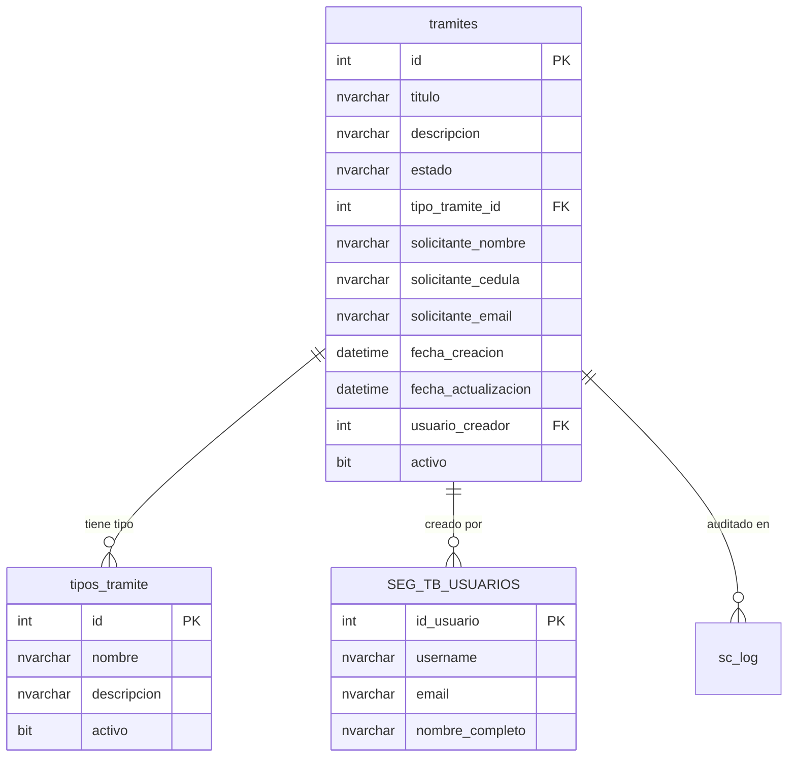

# Módulo de Trámites Base

Tabla principal para gestión de trámites migratorios generales.

---

## Tabla: `tramites`

**Descripción**: Tabla principal que almacena todos los trámites migratorios del sistema.

**Esquema**: `dbo`

---

## Estructura de la Tabla

| Columna | Tipo de Dato | Nulo | Default | PK | FK | Descripción |
|---------|--------------|------|---------|----|----|-------------|
| `id` | INT | NO | IDENTITY(1,1) | ✅ | | Identificador único autoincremental |
| `titulo` | NVARCHAR(255) | NO | - | | | Título descriptivo del trámite |
| `descripcion` | NVARCHAR(MAX) | YES | NULL | | | Descripción detallada del trámite |
| `estado` | NVARCHAR(50) | NO | 'pendiente' | | | Estado actual del trámite |
| `tipo_tramite_id` | INT | YES | NULL | | ✅ | Relación con tipos de trámite |
| `solicitante_nombre` | NVARCHAR(200) | YES | NULL | | | Nombre completo del solicitante |
| `solicitante_cedula` | NVARCHAR(50) | YES | NULL | | | Cédula/Pasaporte del solicitante |
| `solicitante_email` | NVARCHAR(200) | YES | NULL | | | Email de contacto |
| `fecha_creacion` | DATETIME | NO | GETDATE() | | | Fecha y hora de creación |
| `fecha_actualizacion` | DATETIME | YES | NULL | | | Última actualización del registro |
| `usuario_creador` | INT | YES | NULL | | ✅ | Usuario que creó el registro |
| `activo` | BIT | NO | 1 | | | Indicador soft delete (1=activo, 0=eliminado) |

---

## Estados Válidos

El campo `estado` puede tener los siguientes valores:

| Estado | Descripción | Color |
|--------|-------------|-------|
| `pendiente` | Trámite recién creado, pendiente de revisión | 🟡 Amarillo |
| `en_proceso` | Trámite en proceso de revisión/aprobación | 🔵 Azul |
| `completado` | Trámite finalizado exitosamente | 🟢 Verde |
| `cancelado` | Trámite cancelado por usuario o sistema | 🔴 Rojo |

---

## Índices

### Primary Key

```sql
CREATE CLUSTERED INDEX PK_tramites 
ON tramites(id);
```

### Índices de Performance

```sql
-- Búsquedas por estado
CREATE NONCLUSTERED INDEX IX_tramites_estado 
ON tramites(estado) 
INCLUDE (id, titulo, fecha_creacion);

-- Búsquedas por fecha (recientes primero)
CREATE NONCLUSTERED INDEX IX_tramites_fecha_creacion 
ON tramites(fecha_creacion DESC)
INCLUDE (id, titulo, estado);

-- Búsquedas por solicitante
CREATE NONCLUSTERED INDEX IX_tramites_solicitante_cedula 
ON tramites(solicitante_cedula)
INCLUDE (id, titulo, estado);
```

---

## Constraints

### Check Constraints

```sql
-- Estados válidos
ALTER TABLE tramites
ADD CONSTRAINT CK_tramites_estado 
CHECK (estado IN ('pendiente', 'en_proceso', 'completado', 'cancelado'));

-- Email válido (formato básico)
ALTER TABLE tramites
ADD CONSTRAINT CK_tramites_email
CHECK (solicitante_email LIKE '%@%.%' OR solicitante_email IS NULL);
```

### Foreign Keys

```sql
-- Relación con tipos de trámite
ALTER TABLE tramites
ADD CONSTRAINT FK_tramites_tipo_tramite
FOREIGN KEY (tipo_tramite_id) REFERENCES tipos_tramite(id);

-- Relación con usuarios
ALTER TABLE tramites
ADD CONSTRAINT FK_tramites_usuario
FOREIGN KEY (usuario_creador) REFERENCES SEG_TB_USUARIOS(id_usuario);
```

---

## Operaciones Comunes

### Crear Trámite

```sql
INSERT INTO tramites (
    titulo, 
    descripcion, 
    estado, 
    solicitante_nombre, 
    solicitante_cedula, 
    solicitante_email,
    usuario_creador
)
VALUES (
    'Visa de Trabajo', 
    'Solicitud de visa temporal de trabajo para profesional extranjero', 
    'pendiente',
    'Juan Pérez García', 
    '8-123-4567', 
    'juan.perez@email.com',
    1
);
```

### Consultar Trámites Activos

```sql
-- Todos los trámites activos
SELECT 
    id,
    titulo,
    estado,
    solicitante_nombre,
    solicitante_cedula,
    fecha_creacion
FROM tramites
WHERE activo = 1
ORDER BY fecha_creacion DESC;

-- Trámites pendientes
SELECT * FROM tramites
WHERE estado = 'pendiente' 
  AND activo = 1
ORDER BY fecha_creacion ASC;

-- Trámites de un solicitante
SELECT * FROM tramites
WHERE solicitante_cedula = '8-123-4567'
  AND activo = 1
ORDER BY fecha_creacion DESC;
```

### Actualizar Estado

```sql
UPDATE tramites
SET 
    estado = 'en_proceso',
    fecha_actualizacion = GETDATE()
WHERE id = 123;
```

### Eliminar Lógicamente (Soft Delete)

```sql
UPDATE tramites
SET 
    activo = 0,
    fecha_actualizacion = GETDATE()
WHERE id = 123;
```

### Recuperar Trámite Eliminado

```sql
UPDATE tramites
SET 
    activo = 1,
    fecha_actualizacion = GETDATE()
WHERE id = 123;
```

---

## Consultas Analíticas

### Trámites por Estado

```sql
SELECT 
    estado,
    COUNT(*) as total,
    COUNT(*) * 100.0 / SUM(COUNT(*)) OVER() as porcentaje
FROM tramites
WHERE activo = 1
GROUP BY estado
ORDER BY total DESC;
```

### Trámites por Mes

```sql
SELECT 
    YEAR(fecha_creacion) as año,
    MONTH(fecha_creacion) as mes,
    COUNT(*) as total_tramites,
    SUM(CASE WHEN estado = 'completado' THEN 1 ELSE 0 END) as completados,
    SUM(CASE WHEN estado = 'cancelado' THEN 1 ELSE 0 END) as cancelados
FROM tramites
WHERE activo = 1
GROUP BY YEAR(fecha_creacion), MONTH(fecha_creacion)
ORDER BY año DESC, mes DESC;
```

### Tiempo Promedio de Procesamiento

```sql
SELECT 
    AVG(DATEDIFF(DAY, fecha_creacion, fecha_actualizacion)) as dias_promedio
FROM tramites
WHERE estado = 'completado' 
  AND activo = 1
  AND fecha_actualizacion IS NOT NULL;
```

---

## Triggers de Auditoría

### Trigger de INSERT

```sql
CREATE TRIGGER trg_audit_tramites_insert
ON tramites
AFTER INSERT
AS
BEGIN
    INSERT INTO sc_log (
        usuario_id,
        accion,
        tabla,
        registro_id,
        valores_nuevos,
        ip_address
    )
    SELECT 
        i.usuario_creador,
        'INSERT',
        'tramites',
        i.id,
        (SELECT i.* FOR JSON PATH),
        CAST(SESSION_CONTEXT(N'client_ip') AS NVARCHAR(50))
    FROM inserted i;
END;
```

### Trigger de UPDATE

```sql
CREATE TRIGGER trg_audit_tramites_update
ON tramites
AFTER UPDATE
AS
BEGIN
    INSERT INTO sc_log (
        usuario_id,
        accion,
        tabla,
        registro_id,
        valores_anteriores,
        valores_nuevos,
        ip_address
    )
    SELECT 
        i.usuario_creador,
        'UPDATE',
        'tramites',
        i.id,
        (SELECT d.* FOR JSON PATH),
        (SELECT i.* FOR JSON PATH),
        CAST(SESSION_CONTEXT(N'client_ip') AS NVARCHAR(50))
    FROM inserted i
    INNER JOIN deleted d ON i.id = d.id;
END;
```

---

## Ejemplos de Datos

### Datos de Prueba

```sql
INSERT INTO tramites (titulo, descripcion, estado, solicitante_nombre, solicitante_cedula, solicitante_email, usuario_creador)
VALUES 
    ('Visa de Trabajo', 'Solicitud de visa temporal de trabajo', 'pendiente', 'Juan Pérez García', '8-123-4567', 'juan.perez@email.com', 1),
    ('Residencia Permanente', 'Solicitud de residencia permanente por inversión', 'en_proceso', 'María González López', 'E-8-12345', 'maria.gonzalez@email.com', 1),
    ('Renovación de Visa', 'Renovación de visa de estudiante', 'completado', 'Carlos Rodríguez', 'PE-8-98765', 'carlos.r@email.com', 2),
    ('Permiso de Trabajo', 'Permiso temporal de trabajo', 'pendiente', 'Ana Martínez', '8-234-5678', 'ana.martinez@email.com', 1),
    ('Visa Familiar', 'Visa para reunificación familiar', 'cancelado', 'Luis Hernández', '8-345-6789', 'luis.h@email.com', 3);
```

---

## Optimización

### Mantenimiento Regular

```sql
-- Actualizar estadísticas
UPDATE STATISTICS tramites WITH FULLSCAN;

-- Reorganizar índices (fragmentación < 30%)
ALTER INDEX IX_tramites_estado ON tramites REORGANIZE;

-- Reconstruir índices (fragmentación > 30%)
ALTER INDEX IX_tramites_fecha_creacion ON tramites REBUILD;
```

### Análisis de Fragmentación

```sql
SELECT 
    i.name AS IndexName,
    ps.avg_fragmentation_in_percent,
    ps.page_count
FROM sys.dm_db_index_physical_stats(
    DB_ID(), 
    OBJECT_ID('tramites'), 
    NULL, 
    NULL, 
    'LIMITED'
) ps
INNER JOIN sys.indexes i 
    ON ps.object_id = i.object_id 
    AND ps.index_id = i.index_id
WHERE ps.avg_fragmentation_in_percent > 10
ORDER BY ps.avg_fragmentation_in_percent DESC;
```

---

## Diagrama ER



---

## Navegación

[← Diccionario de Datos](index.md) | [Módulo PPSH →](modulo-ppsh.md)
