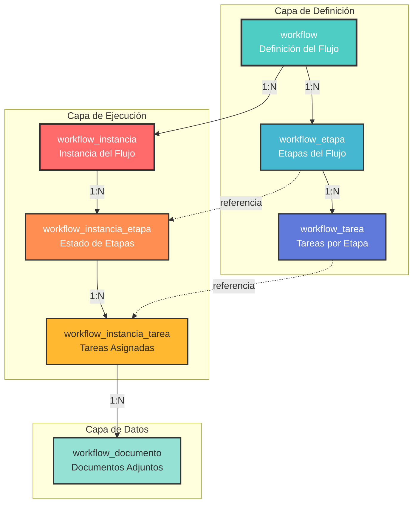
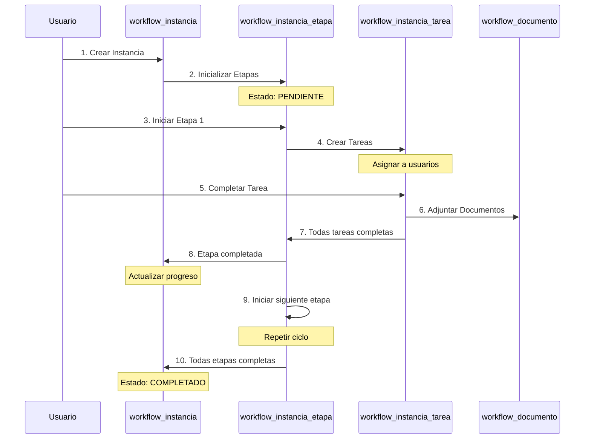

# Módulo de Workflows

Sistema dinámico de flujos de trabajo configurables para gestión de procesos complejos.

---

## Descripción del Módulo

El módulo de Workflows permite crear y gestionar **flujos de trabajo personalizables** para cualquier tipo de proceso, proporcionando:

- 🔧 **Definición flexible** de workflows con etapas y tareas
- 📋 **Instancias de ejecución** independientes
- 👥 **Asignación de tareas** a usuarios y roles
- 📄 **Gestión de documentos** por tarea
- 📊 **Seguimiento de progreso** en tiempo real
- 🔄 **Reutilización** de definiciones de workflow
- ⚡ **Ejecución paralela** de tareas cuando sea posible

---

## Arquitectura del Módulo

### Capas del Sistema



---

## 1. Tabla: `workflow`

**Descripción**: Definición de workflows reutilizables.

### Estructura

| Columna | Tipo de Dato | Nulo | Default | PK | FK | Descripción |
|---------|--------------|------|---------|----|----|-------------|
| `id_workflow` | INT | NO | IDENTITY(1,1) | ✅ | | ID único del workflow |
| `codigo` | NVARCHAR(50) | NO | - | | | Código único alfanumérico |
| `nombre` | NVARCHAR(255) | NO | - | | | Nombre descriptivo |
| `descripcion` | NVARCHAR(MAX) | YES | NULL | | | Descripción detallada |
| `tipo_tramite` | NVARCHAR(50) | YES | NULL | | | Tipo de trámite asociado |
| `categoria` | NVARCHAR(100) | YES | NULL | | | Categoría del workflow |
| `version` | INT | NO | 1 | | | Versión del workflow |
| `activo` | BIT | NO | 1 | | | Workflow activo |
| `fecha_creacion` | DATETIME | NO | GETDATE() | | | Fecha de creación |
| `creado_por` | INT | YES | NULL | | ✅ | Usuario creador |
| `fecha_actualizacion` | DATETIME | YES | NULL | | | Última actualización |

### Índices

```sql
-- Primary Key
CREATE CLUSTERED INDEX PK_workflow 
ON workflow(id_workflow);

-- Código único
CREATE UNIQUE NONCLUSTERED INDEX UK_workflow_codigo 
ON workflow(codigo);

-- Búsqueda por tipo de trámite
CREATE NONCLUSTERED INDEX IX_workflow_tipo_tramite 
ON workflow(tipo_tramite)
WHERE tipo_tramite IS NOT NULL;

-- Filtrar workflows activos
CREATE NONCLUSTERED INDEX IX_workflow_activo 
ON workflow(activo)
INCLUDE (codigo, nombre, categoria);
```

### Foreign Keys

```sql
ALTER TABLE workflow
ADD CONSTRAINT FK_workflow_creador
FOREIGN KEY (creado_por) 
REFERENCES SEG_TB_USUARIOS(id_usuario);
```

### Ejemplo de Uso

```sql
-- Crear workflow
INSERT INTO workflow (
    codigo,
    nombre,
    descripcion,
    tipo_tramite,
    categoria,
    creado_por
)
VALUES (
    'WF_VISA_TRABAJO',
    'Proceso de Visa de Trabajo',
    'Flujo completo para procesamiento de solicitudes de visa de trabajo',
    'VISA',
    'MIGRATORIO',
    1
);

-- Listar workflows activos
SELECT 
    codigo,
    nombre,
    categoria,
    version,
    (SELECT COUNT(*) FROM workflow_etapa WHERE id_workflow = w.id_workflow) AS total_etapas,
    (SELECT COUNT(*) FROM workflow_instancia WHERE id_workflow = w.id_workflow) AS total_instancias
FROM workflow w
WHERE activo = 1
ORDER BY nombre;
```

---

## 2. Tabla: `workflow_etapa`

**Descripción**: Etapas que componen un workflow.

### Estructura

| Columna | Tipo de Dato | Nulo | Default | PK | FK | Descripción |
|---------|--------------|------|---------|----|----|-------------|
| `id_etapa` | INT | NO | IDENTITY(1,1) | ✅ | | ID único de la etapa |
| `id_workflow` | INT | NO | - | | ✅ | Workflow al que pertenece |
| `codigo_etapa` | NVARCHAR(50) | NO | - | | | Código único de la etapa |
| `nombre_etapa` | NVARCHAR(255) | NO | - | | | Nombre de la etapa |
| `descripcion` | NVARCHAR(500) | YES | NULL | | | Descripción de la etapa |
| `orden` | INT | NO | - | | | Orden secuencial (1, 2, 3...) |
| `duracion_estimada_dias` | INT | YES | NULL | | | Duración estimada |
| `es_opcional` | BIT | NO | 0 | | | Etapa opcional o requerida |
| `permite_paralelo` | BIT | NO | 0 | | | ¿Permite ejecución paralela? |
| `activo` | BIT | NO | 1 | | | Etapa activa |

### Índices y Constraints

```sql
-- Primary Key
CREATE CLUSTERED INDEX PK_workflow_etapa 
ON workflow_etapa(id_etapa);

-- Búsqueda por workflow con orden
CREATE NONCLUSTERED INDEX IX_workflow_etapa_workflow 
ON workflow_etapa(id_workflow, orden)
INCLUDE (codigo_etapa, nombre_etapa);

-- Código de etapa único dentro del workflow
CREATE UNIQUE NONCLUSTERED INDEX UK_workflow_etapa_codigo 
ON workflow_etapa(id_workflow, codigo_etapa);

-- Foreign Key
ALTER TABLE workflow_etapa
ADD CONSTRAINT FK_workflow_etapa_workflow
FOREIGN KEY (id_workflow) 
REFERENCES workflow(id_workflow);

-- Check: Orden positivo
ALTER TABLE workflow_etapa
ADD CONSTRAINT CK_workflow_etapa_orden
CHECK (orden > 0);
```

### Ejemplo de Uso

```sql
-- Crear etapas de un workflow
INSERT INTO workflow_etapa (id_workflow, codigo_etapa, nombre_etapa, orden, duracion_estimada_dias)
VALUES 
    (1, 'RECEPCION', 'Recepción de Documentos', 1, 1),
    (1, 'REVISION', 'Revisión Inicial', 2, 3),
    (1, 'VERIFICACION', 'Verificación de Antecedentes', 3, 5),
    (1, 'APROBACION', 'Aprobación Final', 4, 2),
    (1, 'EMISION', 'Emisión de Visa', 5, 1);

-- Ver etapas de un workflow
SELECT 
    orden,
    codigo_etapa,
    nombre_etapa,
    duracion_estimada_dias,
    CASE WHEN es_opcional = 1 THEN 'Opcional' ELSE 'Requerida' END AS tipo,
    (SELECT COUNT(*) FROM workflow_tarea WHERE id_etapa = e.id_etapa) AS total_tareas
FROM workflow_etapa e
WHERE id_workflow = 1
ORDER BY orden;
```

---

## 3. Tabla: `workflow_tarea`

**Descripción**: Tareas individuales dentro de cada etapa.

### Estructura

| Columna | Tipo de Dato | Nulo | Default | PK | FK | Descripción |
|---------|--------------|------|---------|----|----|-------------|
| `id_tarea` | INT | NO | IDENTITY(1,1) | ✅ | | ID único de la tarea |
| `id_etapa` | INT | NO | - | | ✅ | Etapa a la que pertenece |
| `codigo_tarea` | NVARCHAR(50) | NO | - | | | Código único de la tarea |
| `nombre_tarea` | NVARCHAR(255) | NO | - | | | Nombre de la tarea |
| `descripcion` | NVARCHAR(1000) | YES | NULL | | | Descripción detallada |
| `orden` | INT | NO | - | | | Orden dentro de la etapa |
| `rol_asignado` | NVARCHAR(100) | YES | NULL | | | Rol que debe ejecutar |
| `es_obligatoria` | BIT | NO | 1 | | | Tarea obligatoria |
| `tiempo_limite_dias` | INT | YES | NULL | | | Tiempo límite para completar |
| `permite_adjuntos` | BIT | NO | 1 | | | ¿Permite adjuntar archivos? |
| `requiere_aprobacion` | BIT | NO | 0 | | | ¿Requiere aprobación? |
| `activo` | BIT | NO | 1 | | | Tarea activa |

### Índices y Constraints

```sql
-- Primary Key
CREATE CLUSTERED INDEX PK_workflow_tarea 
ON workflow_tarea(id_tarea);

-- Búsqueda por etapa con orden
CREATE NONCLUSTERED INDEX IX_workflow_tarea_etapa 
ON workflow_tarea(id_etapa, orden)
INCLUDE (codigo_tarea, nombre_tarea, rol_asignado);

-- Foreign Key
ALTER TABLE workflow_tarea
ADD CONSTRAINT FK_workflow_tarea_etapa
FOREIGN KEY (id_etapa) 
REFERENCES workflow_etapa(id_etapa);

-- Check: Orden positivo
ALTER TABLE workflow_tarea
ADD CONSTRAINT CK_workflow_tarea_orden
CHECK (orden > 0);
```

### Ejemplo de Uso

```sql
-- Crear tareas para una etapa
INSERT INTO workflow_tarea (
    id_etapa, 
    codigo_tarea, 
    nombre_tarea, 
    orden, 
    rol_asignado, 
    tiempo_limite_dias,
    requiere_aprobacion
)
VALUES 
    (2, 'REV_DOCS', 'Revisar Documentación', 1, 'REVISOR', 2, 0),
    (2, 'VER_DATOS', 'Verificar Datos Personales', 2, 'REVISOR', 1, 0),
    (2, 'APROB_REV', 'Aprobar Revisión', 3, 'SUPERVISOR', 1, 1);

-- Ver tareas de una etapa
SELECT 
    t.orden,
    t.codigo_tarea,
    t.nombre_tarea,
    t.rol_asignado,
    t.tiempo_limite_dias,
    CASE WHEN t.es_obligatoria = 1 THEN 'Obligatoria' ELSE 'Opcional' END AS tipo,
    CASE WHEN t.requiere_aprobacion = 1 THEN 'Sí' ELSE 'No' END AS requiere_aprobacion
FROM workflow_tarea t
WHERE id_etapa = 2
ORDER BY orden;
```

---

## 4. Tabla: `workflow_instancia`

**Descripción**: Instancias de ejecución de workflows (casos reales en proceso).

### Estructura

| Columna | Tipo de Dato | Nulo | Default | PK | FK | Descripción |
|---------|--------------|------|---------|----|----|-------------|
| `id_instancia` | INT | NO | IDENTITY(1,1) | ✅ | | ID único de la instancia |
| `id_workflow` | INT | NO | - | | ✅ | Workflow ejecutado |
| `numero_instancia` | NVARCHAR(50) | NO | - | | | Número único formato: WF-NNNN |
| `titulo` | NVARCHAR(500) | NO | - | | | Título descriptivo |
| `descripcion` | NVARCHAR(MAX) | YES | NULL | | | Descripción |
| `estado` | NVARCHAR(50) | NO | 'INICIADO' | | | INICIADO, EN_PROGRESO, COMPLETADO, CANCELADO |
| `progreso_porcentaje` | DECIMAL(5,2) | NO | 0 | | | Porcentaje de progreso (0-100) |
| `prioridad` | NVARCHAR(20) | NO | 'NORMAL' | | | BAJA, NORMAL, ALTA, URGENTE |
| `fecha_inicio` | DATETIME | NO | GETDATE() | | | Fecha de inicio |
| `fecha_limite` | DATETIME | YES | NULL | | | Fecha límite (si aplica) |
| `fecha_completado` | DATETIME | YES | NULL | | | Fecha de completitud |
| `iniciado_por` | INT | NO | - | | ✅ | Usuario que inició |
| `completado_por` | INT | YES | NULL | | ✅ | Usuario que completó |
| `activo` | BIT | NO | 1 | | | Instancia activa |

### Índices y Constraints

```sql
-- Primary Key
CREATE CLUSTERED INDEX PK_workflow_instancia 
ON workflow_instancia(id_instancia);

-- Número de instancia único
CREATE UNIQUE NONCLUSTERED INDEX UK_workflow_instancia_numero 
ON workflow_instancia(numero_instancia);

-- Búsqueda por workflow
CREATE NONCLUSTERED INDEX IX_workflow_instancia_workflow 
ON workflow_instancia(id_workflow)
INCLUDE (numero_instancia, estado, fecha_inicio);

-- Búsqueda por estado y fecha
CREATE NONCLUSTERED INDEX IX_workflow_instancia_estado 
ON workflow_instancia(estado, fecha_inicio DESC)
INCLUDE (numero_instancia, titulo, prioridad);

-- Búsqueda por usuario
CREATE NONCLUSTERED INDEX IX_workflow_instancia_usuario 
ON workflow_instancia(iniciado_por, estado);

-- Check: Estado válido
ALTER TABLE workflow_instancia
ADD CONSTRAINT CK_workflow_instancia_estado
CHECK (estado IN ('INICIADO', 'EN_PROGRESO', 'COMPLETADO', 'CANCELADO'));

-- Check: Prioridad válida
ALTER TABLE workflow_instancia
ADD CONSTRAINT CK_workflow_instancia_prioridad
CHECK (prioridad IN ('BAJA', 'NORMAL', 'ALTA', 'URGENTE'));

-- Check: Progreso entre 0 y 100
ALTER TABLE workflow_instancia
ADD CONSTRAINT CK_workflow_instancia_progreso
CHECK (progreso_porcentaje >= 0 AND progreso_porcentaje <= 100);

-- Foreign Keys
ALTER TABLE workflow_instancia
ADD CONSTRAINT FK_workflow_instancia_workflow
FOREIGN KEY (id_workflow) 
REFERENCES workflow(id_workflow);

ALTER TABLE workflow_instancia
ADD CONSTRAINT FK_workflow_instancia_iniciador
FOREIGN KEY (iniciado_por) 
REFERENCES SEG_TB_USUARIOS(id_usuario);

ALTER TABLE workflow_instancia
ADD CONSTRAINT FK_workflow_instancia_completador
FOREIGN KEY (completado_por) 
REFERENCES SEG_TB_USUARIOS(id_usuario);
```

### Ejemplo de Uso

```sql
-- Iniciar nueva instancia de workflow
INSERT INTO workflow_instancia (
    id_workflow,
    numero_instancia,
    titulo,
    descripcion,
    prioridad,
    fecha_limite,
    iniciado_por
)
VALUES (
    1,
    'WF-2025-0001',
    'Visa de Trabajo - Juan Pérez',
    'Proceso de visa de trabajo para profesional en tecnología',
    'ALTA',
    DATEADD(DAY, 30, GETDATE()),
    1
);

-- Actualizar progreso
UPDATE workflow_instancia
SET 
    estado = 'EN_PROGRESO',
    progreso_porcentaje = 35.5
WHERE id_instancia = 1;

-- Completar instancia
UPDATE workflow_instancia
SET 
    estado = 'COMPLETADO',
    progreso_porcentaje = 100,
    fecha_completado = GETDATE(),
    completado_por = 5
WHERE id_instancia = 1;

-- Dashboard de instancias activas
SELECT 
    wi.numero_instancia,
    w.nombre AS workflow,
    wi.titulo,
    wi.estado,
    wi.progreso_porcentaje,
    wi.prioridad,
    u.nombre_completo AS iniciado_por,
    wi.fecha_inicio,
    wi.fecha_limite,
    DATEDIFF(DAY, wi.fecha_inicio, COALESCE(wi.fecha_completado, GETDATE())) AS dias_transcurridos
FROM workflow_instancia wi
INNER JOIN workflow w ON wi.id_workflow = w.id_workflow
INNER JOIN SEG_TB_USUARIOS u ON wi.iniciado_por = u.id_usuario
WHERE wi.estado IN ('INICIADO', 'EN_PROGRESO')
  AND wi.activo = 1
ORDER BY wi.prioridad DESC, wi.fecha_inicio ASC;
```

---

## 5. Tabla: `workflow_instancia_etapa`

**Descripción**: Estados de las etapas en una instancia específica de workflow.

### Estructura

| Columna | Tipo de Dato | Nulo | Default | PK | FK | Descripción |
|---------|--------------|------|---------|----|----|-------------|
| `id_instancia_etapa` | INT | NO | IDENTITY(1,1) | ✅ | | ID único |
| `id_instancia` | INT | NO | - | | ✅ | Instancia del workflow |
| `id_etapa` | INT | NO | - | | ✅ | Etapa del workflow |
| `estado` | NVARCHAR(50) | NO | 'PENDIENTE' | | | PENDIENTE, EN_PROGRESO, COMPLETADA, OMITIDA |
| `fecha_inicio` | DATETIME | YES | NULL | | | Fecha de inicio real |
| `fecha_completado` | DATETIME | YES | NULL | | | Fecha de completitud |
| `observaciones` | NVARCHAR(MAX) | YES | NULL | | | Observaciones |
| `activo` | BIT | NO | 1 | | | Registro activo |

### Índices y Constraints

```sql
-- Primary Key
CREATE CLUSTERED INDEX PK_workflow_instancia_etapa 
ON workflow_instancia_etapa(id_instancia_etapa);

-- Búsqueda por instancia
CREATE NONCLUSTERED INDEX IX_workflow_instancia_etapa_instancia 
ON workflow_instancia_etapa(id_instancia)
INCLUDE (id_etapa, estado, fecha_inicio);

-- Una etapa por instancia (constraint único)
CREATE UNIQUE NONCLUSTERED INDEX UK_workflow_instancia_etapa 
ON workflow_instancia_etapa(id_instancia, id_etapa);

-- Check: Estado válido
ALTER TABLE workflow_instancia_etapa
ADD CONSTRAINT CK_workflow_instancia_etapa_estado
CHECK (estado IN ('PENDIENTE', 'EN_PROGRESO', 'COMPLETADA', 'OMITIDA'));

-- Foreign Keys
ALTER TABLE workflow_instancia_etapa
ADD CONSTRAINT FK_workflow_instancia_etapa_instancia
FOREIGN KEY (id_instancia) 
REFERENCES workflow_instancia(id_instancia);

ALTER TABLE workflow_instancia_etapa
ADD CONSTRAINT FK_workflow_instancia_etapa_etapa
FOREIGN KEY (id_etapa) 
REFERENCES workflow_etapa(id_etapa);
```

### Ejemplo de Uso

```sql
-- Inicializar etapas al crear instancia (trigger automático o manual)
INSERT INTO workflow_instancia_etapa (id_instancia, id_etapa, estado)
SELECT 1, id_etapa, 'PENDIENTE'
FROM workflow_etapa
WHERE id_workflow = 1
  AND activo = 1;

-- Iniciar etapa
UPDATE workflow_instancia_etapa
SET 
    estado = 'EN_PROGRESO',
    fecha_inicio = GETDATE()
WHERE id_instancia = 1
  AND id_etapa = 2;

-- Completar etapa
UPDATE workflow_instancia_etapa
SET 
    estado = 'COMPLETADA',
    fecha_completado = GETDATE(),
    observaciones = 'Etapa completada exitosamente'
WHERE id_instancia_etapa = 5;

-- Ver progreso de etapas
SELECT 
    e.orden,
    e.nombre_etapa,
    ie.estado,
    ie.fecha_inicio,
    ie.fecha_completado,
    CASE 
        WHEN ie.fecha_completado IS NOT NULL THEN 
            DATEDIFF(DAY, ie.fecha_inicio, ie.fecha_completado)
        WHEN ie.fecha_inicio IS NOT NULL THEN 
            DATEDIFF(DAY, ie.fecha_inicio, GETDATE())
        ELSE NULL
    END AS dias_duracion
FROM workflow_instancia_etapa ie
INNER JOIN workflow_etapa e ON ie.id_etapa = e.id_etapa
WHERE ie.id_instancia = 1
ORDER BY e.orden;
```

---

## 6. Tabla: `workflow_instancia_tarea`

**Descripción**: Tareas asignadas en una instancia de workflow.

### Estructura

| Columna | Tipo de Dato | Nulo | Default | PK | FK | Descripción |
|---------|--------------|------|---------|----|----|-------------|
| `id_instancia_tarea` | INT | NO | IDENTITY(1,1) | ✅ | | ID único |
| `id_instancia_etapa` | INT | NO | - | | ✅ | Etapa de la instancia |
| `id_tarea` | INT | NO | - | | ✅ | Definición de la tarea |
| `asignado_a` | INT | YES | NULL | | ✅ | Usuario asignado |
| `estado` | NVARCHAR(50) | NO | 'PENDIENTE' | | | PENDIENTE, EN_PROGRESO, COMPLETADA, CANCELADA |
| `fecha_asignacion` | DATETIME | YES | NULL | | | Fecha de asignación |
| `fecha_inicio` | DATETIME | YES | NULL | | | Fecha de inicio |
| `fecha_limite` | DATETIME | YES | NULL | | | Fecha límite |
| `fecha_completado` | DATETIME | YES | NULL | | | Fecha de completitud |
| `respuesta` | NVARCHAR(MAX) | YES | NULL | | | Respuesta/decisión |
| `comentarios` | NVARCHAR(MAX) | YES | NULL | | | Comentarios del usuario |
| `resultado` | NVARCHAR(50) | YES | NULL | | | APROBADO, RECHAZADO, PENDIENTE |
| `activo` | BIT | NO | 1 | | | Registro activo |

### Índices y Constraints

```sql
-- Primary Key
CREATE CLUSTERED INDEX PK_workflow_instancia_tarea 
ON workflow_instancia_tarea(id_instancia_tarea);

-- Búsqueda por etapa de instancia
CREATE NONCLUSTERED INDEX IX_workflow_instancia_tarea_etapa 
ON workflow_instancia_tarea(id_instancia_etapa)
INCLUDE (id_tarea, asignado_a, estado);

-- Búsqueda por usuario asignado
CREATE NONCLUSTERED INDEX IX_workflow_instancia_tarea_usuario 
ON workflow_instancia_tarea(asignado_a, estado)
INCLUDE (fecha_limite, fecha_asignacion);

-- Búsqueda por fecha límite
CREATE NONCLUSTERED INDEX IX_workflow_instancia_tarea_fecha 
ON workflow_instancia_tarea(fecha_limite)
WHERE fecha_limite IS NOT NULL AND estado IN ('PENDIENTE', 'EN_PROGRESO');

-- Check: Estado válido
ALTER TABLE workflow_instancia_tarea
ADD CONSTRAINT CK_workflow_instancia_tarea_estado
CHECK (estado IN ('PENDIENTE', 'EN_PROGRESO', 'COMPLETADA', 'CANCELADA'));

-- Check: Resultado válido
ALTER TABLE workflow_instancia_tarea
ADD CONSTRAINT CK_workflow_instancia_tarea_resultado
CHECK (resultado IN ('APROBADO', 'RECHAZADO', 'PENDIENTE') OR resultado IS NULL);

-- Foreign Keys
ALTER TABLE workflow_instancia_tarea
ADD CONSTRAINT FK_workflow_instancia_tarea_etapa
FOREIGN KEY (id_instancia_etapa) 
REFERENCES workflow_instancia_etapa(id_instancia_etapa);

ALTER TABLE workflow_instancia_tarea
ADD CONSTRAINT FK_workflow_instancia_tarea_tarea
FOREIGN KEY (id_tarea) 
REFERENCES workflow_tarea(id_tarea);

ALTER TABLE workflow_instancia_tarea
ADD CONSTRAINT FK_workflow_instancia_tarea_usuario
FOREIGN KEY (asignado_a) 
REFERENCES SEG_TB_USUARIOS(id_usuario);
```

### Ejemplo de Uso

```sql
-- Asignar tarea a usuario
INSERT INTO workflow_instancia_tarea (
    id_instancia_etapa,
    id_tarea,
    asignado_a,
    estado,
    fecha_asignacion,
    fecha_limite
)
VALUES (
    5,
    10,
    3,
    'PENDIENTE',
    GETDATE(),
    DATEADD(DAY, 3, GETDATE())
);

-- Iniciar trabajo en tarea
UPDATE workflow_instancia_tarea
SET 
    estado = 'EN_PROGRESO',
    fecha_inicio = GETDATE()
WHERE id_instancia_tarea = 1;

-- Completar tarea
UPDATE workflow_instancia_tarea
SET 
    estado = 'COMPLETADA',
    fecha_completado = GETDATE(),
    resultado = 'APROBADO',
    respuesta = 'Documentación verificada y aprobada',
    comentarios = 'Todos los documentos están en orden'
WHERE id_instancia_tarea = 1;

-- Mis tareas pendientes
SELECT 
    wi.numero_instancia,
    wi.titulo AS instancia,
    e.nombre_etapa,
    t.nombre_tarea,
    it.fecha_asignacion,
    it.fecha_limite,
    DATEDIFF(DAY, GETDATE(), it.fecha_limite) AS dias_restantes,
    CASE 
        WHEN it.fecha_limite < GETDATE() THEN 'VENCIDA'
        WHEN DATEDIFF(DAY, GETDATE(), it.fecha_limite) <= 1 THEN 'URGENTE'
        ELSE 'EN_PLAZO'
    END AS urgencia
FROM workflow_instancia_tarea it
INNER JOIN workflow_tarea t ON it.id_tarea = t.id_tarea
INNER JOIN workflow_instancia_etapa ie ON it.id_instancia_etapa = ie.id_instancia_etapa
INNER JOIN workflow_etapa e ON ie.id_etapa = e.id_etapa
INNER JOIN workflow_instancia wi ON ie.id_instancia = wi.id_instancia
WHERE it.asignado_a = 3 -- ID del usuario actual
  AND it.estado IN ('PENDIENTE', 'EN_PROGRESO')
  AND it.activo = 1
ORDER BY it.fecha_limite ASC;
```

---

## 7. Tabla: `workflow_documento`

**Descripción**: Documentos adjuntos a tareas de workflow.

### Estructura

| Columna | Tipo de Dato | Nulo | Default | PK | FK | Descripción |
|---------|--------------|------|---------|----|----|-------------|
| `id_documento` | INT | NO | IDENTITY(1,1) | ✅ | | ID único del documento |
| `id_instancia_tarea` | INT | NO | - | | ✅ | Tarea asociada |
| `nombre_archivo` | NVARCHAR(500) | NO | - | | | Nombre del archivo |
| `ruta_archivo` | NVARCHAR(1000) | NO | - | | | Ruta del archivo |
| `tamano_bytes` | BIGINT | YES | NULL | | | Tamaño en bytes |
| `mime_type` | NVARCHAR(100) | YES | NULL | | | Tipo MIME |
| `fecha_carga` | DATETIME | NO | GETDATE() | | | Fecha de carga |
| `cargado_por` | INT | NO | - | | ✅ | Usuario que cargó |
| `activo` | BIT | NO | 1 | | | Documento activo |

### Índices y Foreign Keys

```sql
-- Primary Key
CREATE CLUSTERED INDEX PK_workflow_documento 
ON workflow_documento(id_documento);

-- Búsqueda por tarea
CREATE NONCLUSTERED INDEX IX_workflow_documento_tarea 
ON workflow_documento(id_instancia_tarea)
INCLUDE (nombre_archivo, mime_type, fecha_carga);

-- Foreign Keys
ALTER TABLE workflow_documento
ADD CONSTRAINT FK_workflow_documento_tarea
FOREIGN KEY (id_instancia_tarea) 
REFERENCES workflow_instancia_tarea(id_instancia_tarea);

ALTER TABLE workflow_documento
ADD CONSTRAINT FK_workflow_documento_usuario
FOREIGN KEY (cargado_por) 
REFERENCES SEG_TB_USUARIOS(id_usuario);
```

### Ejemplo de Uso

```sql
-- Subir documento a tarea
INSERT INTO workflow_documento (
    id_instancia_tarea,
    nombre_archivo,
    ruta_archivo,
    tamano_bytes,
    mime_type,
    cargado_por
)
VALUES (
    1,
    'cedula_verificada.pdf',
    '/uploads/workflows/2025/01/cedula_verificada.pdf',
    156789,
    'application/pdf',
    3
);

-- Listar documentos de una tarea
SELECT 
    d.nombre_archivo,
    d.tamano_bytes / 1024 AS tamano_kb,
    d.mime_type,
    u.nombre_completo AS cargado_por,
    d.fecha_carga
FROM workflow_documento d
INNER JOIN SEG_TB_USUARIOS u ON d.cargado_por = u.id_usuario
WHERE d.id_instancia_tarea = 1
  AND d.activo = 1
ORDER BY d.fecha_carga DESC;
```

---

## Diagrama ER Completo

```mermaid
erDiagram
    workflow ||--o{ workflow_etapa : "tiene"
    workflow ||--o{ workflow_instancia : "ejecuta"
    workflow_etapa ||--o{ workflow_tarea : "contiene"
    workflow_etapa ||--o{ workflow_instancia_etapa : "referencia"
    workflow_instancia ||--o{ workflow_instancia_etapa : "ejecuta"
    workflow_instancia_etapa ||--o{ workflow_instancia_tarea : "contiene"
    workflow_tarea ||--o{ workflow_instancia_tarea : "referencia"
    workflow_instancia_tarea ||--o{ workflow_documento : "adjunta"
    SEG_TB_USUARIOS ||--o{ workflow : "crea"
    SEG_TB_USUARIOS ||--o{ workflow_instancia : "inicia"
    SEG_TB_USUARIOS ||--o{ workflow_instancia : "completa"
    SEG_TB_USUARIOS ||--o{ workflow_instancia_tarea : "asignada a"
    SEG_TB_USUARIOS ||--o{ workflow_documento : "carga"
    
    workflow {
        int id_workflow PK
        nvarchar codigo UK
        nvarchar nombre
        nvarchar descripcion
        nvarchar tipo_tramite
        nvarchar categoria
        int version
        bit activo
        datetime fecha_creacion
        int creado_por FK
    }
    
    workflow_etapa {
        int id_etapa PK
        int id_workflow FK
        nvarchar codigo_etapa
        nvarchar nombre_etapa
        nvarchar descripcion
        int orden
        int duracion_estimada_dias
        bit es_opcional
        bit permite_paralelo
        bit activo
    }
    
    workflow_tarea {
        int id_tarea PK
        int id_etapa FK
        nvarchar codigo_tarea
        nvarchar nombre_tarea
        nvarchar descripcion
        int orden
        nvarchar rol_asignado
        bit es_obligatoria
        int tiempo_limite_dias
        bit permite_adjuntos
        bit requiere_aprobacion
        bit activo
    }
    
    workflow_instancia {
        int id_instancia PK
        int id_workflow FK
        nvarchar numero_instancia UK
        nvarchar titulo
        nvarchar descripcion
        nvarchar estado
        decimal progreso_porcentaje
        nvarchar prioridad
        datetime fecha_inicio
        datetime fecha_limite
        datetime fecha_completado
        int iniciado_por FK
        int completado_por FK
        bit activo
    }
    
    workflow_instancia_etapa {
        int id_instancia_etapa PK
        int id_instancia FK
        int id_etapa FK
        nvarchar estado
        datetime fecha_inicio
        datetime fecha_completado
        nvarchar observaciones
        bit activo
    }
    
    workflow_instancia_tarea {
        int id_instancia_tarea PK
        int id_instancia_etapa FK
        int id_tarea FK
        int asignado_a FK
        nvarchar estado
        datetime fecha_asignacion
        datetime fecha_inicio
        datetime fecha_limite
        datetime fecha_completado
        nvarchar respuesta
        nvarchar comentarios
        nvarchar resultado
        bit activo
    }
    
    workflow_documento {
        int id_documento PK
        int id_instancia_tarea FK
        nvarchar nombre_archivo
        nvarchar ruta_archivo
        bigint tamano_bytes
        nvarchar mime_type
        datetime fecha_carga
        int cargado_por FK
        bit activo
    }
```



---

## Flujo de Ejecución

### Ciclo de Vida de una Instancia



---

## Consultas Analíticas

### Dashboard de Workflows

```sql
-- Resumen de instancias por estado
SELECT 
    w.nombre AS workflow,
    COUNT(*) AS total_instancias,
    SUM(CASE WHEN wi.estado = 'COMPLETADO' THEN 1 ELSE 0 END) AS completadas,
    SUM(CASE WHEN wi.estado IN ('INICIADO', 'EN_PROGRESO') THEN 1 ELSE 0 END) AS en_proceso,
    SUM(CASE WHEN wi.estado = 'CANCELADO' THEN 1 ELSE 0 END) AS canceladas,
    AVG(wi.progreso_porcentaje) AS progreso_promedio
FROM workflow_instancia wi
INNER JOIN workflow w ON wi.id_workflow = w.id_workflow
WHERE wi.activo = 1
GROUP BY w.nombre
ORDER BY total_instancias DESC;

-- Tareas vencidas por usuario
SELECT 
    u.nombre_completo,
    COUNT(*) AS tareas_vencidas,
    MIN(it.fecha_limite) AS mas_antigua
FROM workflow_instancia_tarea it
INNER JOIN SEG_TB_USUARIOS u ON it.asignado_a = u.id_usuario
WHERE it.fecha_limite < GETDATE()
  AND it.estado IN ('PENDIENTE', 'EN_PROGRESO')
  AND it.activo = 1
GROUP BY u.nombre_completo
ORDER BY tareas_vencidas DESC;

-- Tiempo promedio por etapa
SELECT 
    e.nombre_etapa,
    AVG(DATEDIFF(DAY, ie.fecha_inicio, ie.fecha_completado)) AS dias_promedio,
    MIN(DATEDIFF(DAY, ie.fecha_inicio, ie.fecha_completado)) AS minimo,
    MAX(DATEDIFF(DAY, ie.fecha_inicio, ie.fecha_completado)) AS maximo,
    COUNT(*) AS total_completadas
FROM workflow_instancia_etapa ie
INNER JOIN workflow_etapa e ON ie.id_etapa = e.id_etapa
WHERE ie.estado = 'COMPLETADA'
  AND ie.fecha_inicio IS NOT NULL
  AND ie.fecha_completado IS NOT NULL
GROUP BY e.nombre_etapa
ORDER BY dias_promedio DESC;
```

---

## Navegación

[← Módulo PPSH](modulo-ppsh.md) | [Diccionario de Datos](index.md) | [Seguridad y Catálogos →](seguridad-catalogos.md)
