# Scripts de Mantenimiento

Scripts SQL para mantenimiento, optimización y administración de la base de datos.

---

## Descripción General

Este documento contiene **scripts de producción** para el mantenimiento rutinario y optimización de la base de datos del sistema de trámites migratorios:

- 🔧 **Mantenimiento Preventivo**: Scripts diarios y semanales
- 🗑️ **Limpieza de Datos**: Purga de logs y datos temporales
- 📊 **Optimización**: Índices, estadísticas y fragmentación
- 💾 **Backups**: Procedimientos de respaldo
- 🔍 **Análisis**: Queries para monitoreo y diagnóstico
- 📅 **Calendario**: Programación de tareas

---

## Estructura de Scripts

```mermaid
graph TB
    subgraph "Scripts Diarios"
        D1[Backup Incremental]
        D2[Limpieza Logs]
        D3[Verificación Integridad]
    end
    
    subgraph "Scripts Semanales"
        S1[Backup Completo]
        S2[Reorganizar Índices]
        S3[Actualizar Estadísticas]
        S4[Análisis de Espacio]
    end
    
    subgraph "Scripts Mensuales"
        M1[Rebuild Índices]
        M2[Purga de Auditoría]
        M3[Análisis de Performance]
        M4[Reporte de Salud]
    end
    
    subgraph "Scripts Bajo Demanda"
        B1[Diagnóstico Completo]
        B2[Optimización Query]
        B3[Cleanup Emergencia]
    end
    
    style D1 fill:#FF6B6B,stroke:#333,stroke-width:2px,color:#fff
    style D2 fill:#FF6B6B,stroke:#333,stroke-width:2px,color:#fff
    style D3 fill:#FF6B6B,stroke:#333,stroke-width:2px,color:#fff
    style S1 fill:#4ECDC4,stroke:#333,stroke-width:2px,color:#fff
    style S2 fill:#4ECDC4,stroke:#333,stroke-width:2px,color:#fff
    style S3 fill:#4ECDC4,stroke:#333,stroke-width:2px,color:#fff
    style S4 fill:#4ECDC4,stroke:#333,stroke-width:2px,color:#fff
    style M1 fill:#45B7D1,stroke:#333,stroke-width:2px,color:#fff
    style M2 fill:#45B7D1,stroke:#333,stroke-width:2px,color:#fff
    style M3 fill:#45B7D1,stroke:#333,stroke-width:2px,color:#fff
    style M4 fill:#45B7D1,stroke:#333,stroke-width:2px,color:#fff
```



---

## 1. Scripts Diarios

### 1.1. Limpieza de Logs de Error

**Propósito**: Eliminar logs de error antiguos (mantener últimos 90 días).

```sql
-- ============================================
-- Script: Limpieza de Logs de Error
-- Frecuencia: Diaria (2:00 AM)
-- Retención: 90 días
-- ============================================

-- Verificar cuántos registros se eliminarán
SELECT 
    COUNT(*) AS registros_a_eliminar,
    MIN(fecha_error) AS fecha_mas_antigua,
    MAX(fecha_error) AS fecha_mas_reciente
FROM SEG_TB_ERROR_LOG
WHERE fecha_error < DATEADD(DAY, -90, GETDATE())
  AND nivel NOT IN ('ERROR', 'CRITICAL'); -- Mantener errores críticos

-- Eliminar logs antiguos en lotes
DECLARE @BatchSize INT = 5000;
DECLARE @RowsDeleted INT = @BatchSize;

WHILE @RowsDeleted = @BatchSize
BEGIN
    DELETE TOP (@BatchSize)
    FROM SEG_TB_ERROR_LOG
    WHERE fecha_error < DATEADD(DAY, -90, GETDATE())
      AND nivel NOT IN ('ERROR', 'CRITICAL');
    
    SET @RowsDeleted = @@ROWCOUNT;
    
    -- Pausa para evitar bloqueos
    WAITFOR DELAY '00:00:01';
END;

-- Reporte final
SELECT 
    COUNT(*) AS registros_restantes,
    MIN(fecha_error) AS fecha_mas_antigua,
    MAX(fecha_error) AS fecha_mas_reciente,
    COUNT(DISTINCT nivel) AS niveles_distintos
FROM SEG_TB_ERROR_LOG;
```

### 1.2. Limpieza de Auditoría Antigua

**Propósito**: Purgar registros de auditoría (mantener últimos 6 meses).

```sql
-- ============================================
-- Script: Limpieza de Tabla de Auditoría
-- Frecuencia: Diaria (3:00 AM)
-- Retención: 180 días
-- ============================================

-- Verificación
SELECT 
    COUNT(*) AS total_registros,
    COUNT(CASE WHEN fecha_log < DATEADD(DAY, -180, GETDATE()) THEN 1 END) AS registros_antiguos,
    MIN(fecha_log) AS fecha_minima,
    MAX(fecha_log) AS fecha_maxima,
    SUM(CASE WHEN accion = 'DELETE' THEN 1 ELSE 0 END) AS deletes_a_mantener
FROM sc_log;

-- Backup de registros DELETE antes de purgar (mantener siempre)
SELECT *
INTO sc_log_deletes_backup
FROM sc_log
WHERE accion = 'DELETE'
  AND fecha_log < DATEADD(DAY, -180, GETDATE());

-- Eliminar en lotes (excepto DELETE)
DECLARE @BatchSize INT = 10000;
DECLARE @RowsDeleted INT = @BatchSize;

WHILE @RowsDeleted = @BatchSize
BEGIN
    DELETE TOP (@BatchSize)
    FROM sc_log
    WHERE fecha_log < DATEADD(DAY, -180, GETDATE())
      AND accion != 'DELETE'; -- Mantener todos los deletes
    
    SET @RowsDeleted = @@ROWCOUNT;
    WAITFOR DELAY '00:00:02';
END;

PRINT 'Limpieza completada: ' + CAST(@@ROWCOUNT AS NVARCHAR(20)) + ' registros eliminados';
```

### 1.3. Verificación de Integridad

**Propósito**: Verificar integridad de tablas críticas.

```sql
-- ============================================
-- Script: Verificación de Integridad
-- Frecuencia: Diaria (4:00 AM)
-- ============================================

-- Verificar integridad de tablas críticas
DBCC CHECKDB (TramitesMVP) WITH NO_INFOMSGS, PHYSICAL_ONLY;

-- Verificar tablas específicas
DBCC CHECKTABLE (tramites) WITH NO_INFOMSGS;
DBCC CHECKTABLE (PPSH_SOLICITUD) WITH NO_INFOMSGS;
DBCC CHECKTABLE (workflow_instancia) WITH NO_INFOMSGS;
DBCC CHECKTABLE (SEG_TB_USUARIOS) WITH NO_INFOMSGS;

-- Verificar constraints
SELECT 
    OBJECT_NAME(parent_object_id) AS tabla,
    name AS constraint_name,
    type_desc,
    is_disabled,
    is_not_trusted
FROM sys.foreign_keys
WHERE is_disabled = 1 OR is_not_trusted = 1;

-- Si hay constraints deshabilitados, reportar
IF EXISTS (SELECT 1 FROM sys.foreign_keys WHERE is_disabled = 1)
BEGIN
    RAISERROR('ALERTA: Existen Foreign Keys deshabilitados', 16, 1);
END;
```

---

## 2. Scripts Semanales

### 2.1. Reorganizar Índices Fragmentados

**Propósito**: Reorganizar índices con fragmentación 10-30%.

```sql
-- ============================================
-- Script: Reorganizar Índices
-- Frecuencia: Semanal (Domingo 1:00 AM)
-- ============================================

DECLARE @TableName NVARCHAR(255);
DECLARE @IndexName NVARCHAR(255);
DECLARE @Fragmentation FLOAT;
DECLARE @SQL NVARCHAR(MAX);

DECLARE index_cursor CURSOR FOR
SELECT 
    OBJECT_NAME(ips.object_id) AS tabla,
    i.name AS indice,
    ips.avg_fragmentation_in_percent
FROM sys.dm_db_index_physical_stats(
    DB_ID(), NULL, NULL, NULL, 'SAMPLED'
) ips
INNER JOIN sys.indexes i 
    ON ips.object_id = i.object_id 
    AND ips.index_id = i.index_id
WHERE ips.avg_fragmentation_in_percent BETWEEN 10 AND 30
  AND ips.page_count > 1000 -- Solo índices grandes
  AND i.name IS NOT NULL
ORDER BY ips.avg_fragmentation_in_percent DESC;

OPEN index_cursor;

FETCH NEXT FROM index_cursor INTO @TableName, @IndexName, @Fragmentation;

WHILE @@FETCH_STATUS = 0
BEGIN
    PRINT 'Reorganizando: ' + @TableName + '.' + @IndexName + 
          ' (Fragmentación: ' + CAST(@Fragmentation AS NVARCHAR(10)) + '%)';
    
    SET @SQL = 'ALTER INDEX ' + QUOTENAME(@IndexName) + 
               ' ON ' + QUOTENAME(@TableName) + ' REORGANIZE;';
    
    EXEC sp_executesql @SQL;
    
    FETCH NEXT FROM index_cursor INTO @TableName, @IndexName, @Fragmentation;
END;

CLOSE index_cursor;
DEALLOCATE index_cursor;

PRINT 'Reorganización completada';
```

### 2.2. Actualizar Estadísticas

**Propósito**: Actualizar estadísticas de todas las tablas.

```sql
-- ============================================
-- Script: Actualizar Estadísticas
-- Frecuencia: Semanal (Domingo 2:00 AM)
-- ============================================

-- Actualizar estadísticas con FULLSCAN en tablas críticas
UPDATE STATISTICS tramites WITH FULLSCAN;
UPDATE STATISTICS PPSH_SOLICITUD WITH FULLSCAN;
UPDATE STATISTICS PPSH_SOLICITANTE WITH FULLSCAN;
UPDATE STATISTICS PPSH_DOCUMENTO WITH FULLSCAN;
UPDATE STATISTICS workflow_instancia WITH FULLSCAN;
UPDATE STATISTICS workflow_instancia_tarea WITH FULLSCAN;
UPDATE STATISTICS SEG_TB_USUARIOS WITH FULLSCAN;
UPDATE STATISTICS sc_log WITH FULLSCAN;

-- Actualizar resto con SAMPLE
EXEC sp_updatestats;

-- Reporte de estadísticas desactualizadas
SELECT 
    OBJECT_NAME(s.object_id) AS tabla,
    s.name AS estadistica,
    sp.last_updated,
    sp.rows,
    sp.modification_counter,
    CAST(sp.modification_counter * 100.0 / NULLIF(sp.rows, 0) AS DECIMAL(5,2)) AS porcentaje_cambios
FROM sys.stats s
CROSS APPLY sys.dm_db_stats_properties(s.object_id, s.stats_id) sp
WHERE sp.modification_counter > 0
ORDER BY porcentaje_cambios DESC;
```

### 2.3. Análisis de Espacio en Disco

**Propósito**: Monitorear uso de espacio por tabla.

```sql
-- ============================================
-- Script: Análisis de Espacio
-- Frecuencia: Semanal (Domingo 3:00 AM)
-- ============================================

-- Espacio por tabla
SELECT 
    t.name AS tabla,
    SUM(p.rows) AS total_filas,
    SUM(a.total_pages) * 8 / 1024 AS espacio_total_mb,
    SUM(a.used_pages) * 8 / 1024 AS espacio_usado_mb,
    SUM(a.data_pages) * 8 / 1024 AS espacio_datos_mb,
    (SUM(a.total_pages) - SUM(a.used_pages)) * 8 / 1024 AS espacio_libre_mb
FROM sys.tables t
INNER JOIN sys.indexes i ON t.object_id = i.object_id
INNER JOIN sys.partitions p ON i.object_id = p.object_id AND i.index_id = p.index_id
INNER JOIN sys.allocation_units a ON p.partition_id = a.container_id
WHERE t.is_ms_shipped = 0
GROUP BY t.name
ORDER BY espacio_total_mb DESC;

-- Archivos de base de datos
SELECT 
    name AS archivo,
    type_desc,
    CAST(size * 8.0 / 1024 AS DECIMAL(10,2)) AS tamano_mb,
    CAST(FILEPROPERTY(name, 'SpaceUsed') * 8.0 / 1024 AS DECIMAL(10,2)) AS usado_mb,
    CAST((size - FILEPROPERTY(name, 'SpaceUsed')) * 8.0 / 1024 AS DECIMAL(10,2)) AS libre_mb,
    CAST(FILEPROPERTY(name, 'SpaceUsed') * 100.0 / size AS DECIMAL(5,2)) AS porcentaje_usado
FROM sys.database_files;

-- Alertar si espacio libre < 20%
DECLARE @PercentFree DECIMAL(5,2);
SELECT @PercentFree = 100.0 - (CAST(FILEPROPERTY(name, 'SpaceUsed') * 100.0 / size AS DECIMAL(5,2)))
FROM sys.database_files
WHERE type = 0; -- Data file

IF @PercentFree < 20
BEGIN
    RAISERROR('ALERTA: Espacio libre en disco menor al 20%%', 16, 1);
END;
```

### 2.4. Backup Completo

**Propósito**: Backup completo de base de datos.

```sql
-- ============================================
-- Script: Backup Completo
-- Frecuencia: Semanal (Domingo 4:00 AM)
-- ============================================

DECLARE @BackupPath NVARCHAR(500);
DECLARE @BackupFile NVARCHAR(500);
DECLARE @DatabaseName NVARCHAR(128) = 'TramitesMVP';
DECLARE @Timestamp NVARCHAR(50);

-- Generar nombre con timestamp
SET @Timestamp = CONVERT(NVARCHAR(50), GETDATE(), 112) + '_' + 
                 REPLACE(CONVERT(NVARCHAR(50), GETDATE(), 108), ':', '');
SET @BackupPath = 'D:\Backups\Database\';
SET @BackupFile = @BackupPath + @DatabaseName + '_FULL_' + @Timestamp + '.bak';

-- Backup completo con compresión
BACKUP DATABASE @DatabaseName
TO DISK = @BackupFile
WITH 
    COMPRESSION,
    CHECKSUM,
    STATS = 10,
    DESCRIPTION = 'Backup Completo Semanal',
    NAME = @DatabaseName + ' Full Backup';

-- Verificar integridad del backup
RESTORE VERIFYONLY 
FROM DISK = @BackupFile
WITH CHECKSUM;

PRINT 'Backup completado: ' + @BackupFile;

-- Eliminar backups antiguos (> 30 días)
DECLARE @DeleteDate DATETIME = DATEADD(DAY, -30, GETDATE());
EXEC xp_delete_file 0, @BackupPath, 'bak', @DeleteDate;
```

---

## 3. Scripts Mensuales

### 3.1. Rebuild Completo de Índices

**Propósito**: Reconstruir índices con fragmentación > 30%.

```sql
-- ============================================
-- Script: Rebuild de Índices
-- Frecuencia: Mensual (Primer Domingo 5:00 AM)
-- ============================================

DECLARE @TableName NVARCHAR(255);
DECLARE @IndexName NVARCHAR(255);
DECLARE @Fragmentation FLOAT;
DECLARE @SQL NVARCHAR(MAX);

DECLARE rebuild_cursor CURSOR FOR
SELECT 
    OBJECT_NAME(ips.object_id) AS tabla,
    i.name AS indice,
    ips.avg_fragmentation_in_percent
FROM sys.dm_db_index_physical_stats(
    DB_ID(), NULL, NULL, NULL, 'DETAILED'
) ips
INNER JOIN sys.indexes i 
    ON ips.object_id = i.object_id 
    AND ips.index_id = i.index_id
WHERE ips.avg_fragmentation_in_percent > 30
  AND ips.page_count > 1000
  AND i.name IS NOT NULL
ORDER BY ips.avg_fragmentation_in_percent DESC;

OPEN rebuild_cursor;

FETCH NEXT FROM rebuild_cursor INTO @TableName, @IndexName, @Fragmentation;

WHILE @@FETCH_STATUS = 0
BEGIN
    PRINT 'Rebuilding: ' + @TableName + '.' + @IndexName + 
          ' (Fragmentación: ' + CAST(@Fragmentation AS NVARCHAR(10)) + '%)';
    
    SET @SQL = 'ALTER INDEX ' + QUOTENAME(@IndexName) + 
               ' ON ' + QUOTENAME(@TableName) + 
               ' REBUILD WITH (FILLFACTOR = 90, ONLINE = ON, SORT_IN_TEMPDB = ON);';
    
    BEGIN TRY
        EXEC sp_executesql @SQL;
    END TRY
    BEGIN CATCH
        PRINT 'ERROR en ' + @TableName + '.' + @IndexName + ': ' + ERROR_MESSAGE();
    END CATCH;
    
    FETCH NEXT FROM rebuild_cursor INTO @TableName, @IndexName, @Fragmentation;
END;

CLOSE rebuild_cursor;
DEALLOCATE rebuild_cursor;

PRINT 'Rebuild completado';
```

### 3.2. Purga de Datos Históricos

**Propósito**: Archivar y purgar datos muy antiguos.

```sql
-- ============================================
-- Script: Purga de Datos Históricos
-- Frecuencia: Mensual (Último Domingo 2:00 AM)
-- ============================================

-- 1. Archivar trámites completados hace más de 2 años
SELECT *
INTO tramites_archivo_2023
FROM tramites
WHERE estado IN ('APROBADO', 'RECHAZADO')
  AND fecha_creacion < DATEADD(YEAR, -2, GETDATE());

-- 2. Archivar solicitudes PPSH antiguas
SELECT *
INTO PPSH_SOLICITUD_archivo_2023
FROM PPSH_SOLICITUD
WHERE cod_estado IN ('APROBADO', 'RECHAZADO')
  AND fecha_solicitud < DATEADD(YEAR, -2, GETDATE());

-- 3. Eliminar workflows completados antiguos (> 1 año)
DELETE FROM workflow_documento
WHERE id_instancia_tarea IN (
    SELECT it.id_instancia_tarea
    FROM workflow_instancia_tarea it
    INNER JOIN workflow_instancia_etapa ie ON it.id_instancia_etapa = ie.id_instancia_etapa
    INNER JOIN workflow_instancia i ON ie.id_instancia = i.id_instancia
    WHERE i.estado = 'COMPLETADO'
      AND i.fecha_completado < DATEADD(YEAR, -1, GETDATE())
);

-- Continuar con otras tablas relacionadas...

PRINT 'Purga histórica completada';
```

### 3.3. Reporte de Salud de Base de Datos

**Propósito**: Generar reporte mensual completo.

```sql
-- ============================================
-- Script: Reporte de Salud
-- Frecuencia: Mensual (Primer día del mes)
-- ============================================

PRINT '========================================';
PRINT 'REPORTE DE SALUD - ' + CONVERT(NVARCHAR(50), GETDATE(), 113);
PRINT '========================================';
PRINT '';

-- 1. Información general
PRINT '1. INFORMACIÓN GENERAL';
PRINT '----------------------';
SELECT 
    name AS BaseDatos,
    CAST(size * 8.0 / 1024 AS DECIMAL(10,2)) AS TamanoMB,
    state_desc AS Estado,
    recovery_model_desc AS ModeloRecuperacion,
    compatibility_level AS NivelCompatibilidad
FROM sys.databases
WHERE name = DB_NAME();
PRINT '';

-- 2. Top 10 tablas por tamaño
PRINT '2. TOP 10 TABLAS POR TAMAÑO';
PRINT '---------------------------';
SELECT TOP 10
    t.name AS Tabla,
    SUM(p.rows) AS TotalFilas,
    SUM(a.total_pages) * 8 / 1024 AS EspacioMB
FROM sys.tables t
INNER JOIN sys.indexes i ON t.object_id = i.object_id
INNER JOIN sys.partitions p ON i.object_id = p.object_id AND i.index_id = p.index_id
INNER JOIN sys.allocation_units a ON p.partition_id = a.container_id
WHERE t.is_ms_shipped = 0
GROUP BY t.name
ORDER BY EspacioMB DESC;
PRINT '';

-- 3. Índices fragmentados
PRINT '3. ÍNDICES FRAGMENTADOS (>30%)';
PRINT '-------------------------------';
SELECT 
    OBJECT_NAME(ips.object_id) AS Tabla,
    i.name AS Indice,
    CAST(ips.avg_fragmentation_in_percent AS DECIMAL(5,2)) AS FragmentacionPct,
    ips.page_count AS Paginas
FROM sys.dm_db_index_physical_stats(
    DB_ID(), NULL, NULL, NULL, 'SAMPLED'
) ips
INNER JOIN sys.indexes i ON ips.object_id = i.object_id AND ips.index_id = i.index_id
WHERE ips.avg_fragmentation_in_percent > 30
  AND ips.page_count > 1000
  AND i.name IS NOT NULL
ORDER BY ips.avg_fragmentation_in_percent DESC;
PRINT '';

-- 4. Estadísticas desactualizadas
PRINT '4. ESTADÍSTICAS DESACTUALIZADAS (>20% cambios)';
PRINT '----------------------------------------------';
SELECT TOP 10
    OBJECT_NAME(s.object_id) AS Tabla,
    s.name AS Estadistica,
    sp.last_updated AS UltimaActualizacion,
    sp.modification_counter AS CambiosRealizados,
    CAST(sp.modification_counter * 100.0 / NULLIF(sp.rows, 0) AS DECIMAL(5,2)) AS PorcentajeCambios
FROM sys.stats s
CROSS APPLY sys.dm_db_stats_properties(s.object_id, s.stats_id) sp
WHERE sp.modification_counter > sp.rows * 0.2
ORDER BY PorcentajeCambios DESC;
PRINT '';

-- 5. Actividad reciente
PRINT '5. ACTIVIDAD RECIENTE (ÚLTIMAS 24 HORAS)';
PRINT '----------------------------------------';
SELECT 
    CONVERT(DATE, fecha_log) AS Fecha,
    COUNT(*) AS TotalOperaciones,
    SUM(CASE WHEN accion = 'INSERT' THEN 1 ELSE 0 END) AS Inserciones,
    SUM(CASE WHEN accion = 'UPDATE' THEN 1 ELSE 0 END) AS Actualizaciones,
    SUM(CASE WHEN accion = 'DELETE' THEN 1 ELSE 0 END) AS Eliminaciones
FROM sc_log
WHERE fecha_log >= DATEADD(HOUR, -24, GETDATE())
GROUP BY CONVERT(DATE, fecha_log);
PRINT '';

-- 6. Errores críticos recientes
PRINT '6. ERRORES CRÍTICOS (ÚLTIMOS 7 DÍAS)';
PRINT '------------------------------------';
SELECT 
    fecha_error,
    nivel,
    modulo,
    mensaje
FROM SEG_TB_ERROR_LOG
WHERE nivel IN ('ERROR', 'CRITICAL')
  AND fecha_error >= DATEADD(DAY, -7, GETDATE())
ORDER BY fecha_error DESC;

PRINT '';
PRINT '========================================';
PRINT 'FIN DEL REPORTE';
PRINT '========================================';
```

---

## 4. Scripts de Análisis y Diagnóstico

### 4.1. Análisis de Queries Lentas

**Propósito**: Identificar queries con peor performance.

```sql
-- ============================================
-- Script: Top 20 Queries Más Lentas
-- ============================================

SELECT TOP 20
    qs.execution_count AS EjecucionesTotales,
    qs.total_elapsed_time / 1000000.0 AS TiempoTotalSegundos,
    qs.total_elapsed_time / qs.execution_count / 1000000.0 AS TiempoPromedioSegundos,
    qs.total_worker_time / 1000000.0 AS TiempoCPUSegundos,
    qs.total_logical_reads AS LecturasLogicas,
    qs.total_logical_writes AS EscriturasLogicas,
    SUBSTRING(st.text, (qs.statement_start_offset/2)+1,
        ((CASE qs.statement_end_offset
            WHEN -1 THEN DATALENGTH(st.text)
            ELSE qs.statement_end_offset
        END - qs.statement_start_offset)/2) + 1) AS Query,
    qs.creation_time AS FechaCreacion,
    qs.last_execution_time AS UltimaEjecucion
FROM sys.dm_exec_query_stats qs
CROSS APPLY sys.dm_exec_sql_text(qs.sql_handle) st
ORDER BY qs.total_elapsed_time DESC;
```

### 4.2. Análisis de Bloqueos

**Propósito**: Detectar bloqueos y deadlocks.

```sql
-- ============================================
-- Script: Análisis de Bloqueos
-- ============================================

-- Procesos bloqueados actualmente
SELECT 
    blocking.session_id AS BloqueanteSessionID,
    blocked.session_id AS BloqueadoSessionID,
    waitstats.wait_type AS TipoEspera,
    waitstats.wait_duration_ms AS DuracionEsperaMS,
    blocking_sql.text AS QueryBloqueante,
    blocked_sql.text AS QueryBloqueado
FROM sys.dm_exec_requests blocked
INNER JOIN sys.dm_exec_requests blocking 
    ON blocked.blocking_session_id = blocking.session_id
INNER JOIN sys.dm_os_waiting_tasks waitstats 
    ON blocked.session_id = waitstats.session_id
CROSS APPLY sys.dm_exec_sql_text(blocking.sql_handle) blocking_sql
CROSS APPLY sys.dm_exec_sql_text(blocked.sql_handle) blocked_sql
WHERE blocked.blocking_session_id > 0;

-- Historial de deadlocks (requiere Extended Events configurado)
```

### 4.3. Análisis de Índices No Utilizados

**Propósito**: Identificar índices candidatos para eliminación.

```sql
-- ============================================
-- Script: Índices No Utilizados
-- ============================================

SELECT 
    OBJECT_NAME(i.object_id) AS Tabla,
    i.name AS Indice,
    i.type_desc AS TipoIndice,
    ISNULL(us.user_seeks, 0) AS Busquedas,
    ISNULL(us.user_scans, 0) AS Escaneos,
    ISNULL(us.user_lookups, 0) AS Lookups,
    ISNULL(us.user_updates, 0) AS Actualizaciones,
    CAST(
        (SUM(a.total_pages) * 8.0 / 1024) AS DECIMAL(10,2)
    ) AS EspacioMB,
    'DROP INDEX ' + QUOTENAME(i.name) + ' ON ' + QUOTENAME(OBJECT_SCHEMA_NAME(i.object_id)) + 
        '.' + QUOTENAME(OBJECT_NAME(i.object_id)) + ';' AS ScriptDrop
FROM sys.indexes i
LEFT JOIN sys.dm_db_index_usage_stats us 
    ON i.object_id = us.object_id 
    AND i.index_id = us.index_id
    AND us.database_id = DB_ID()
INNER JOIN sys.partitions p ON i.object_id = p.object_id AND i.index_id = p.index_id
INNER JOIN sys.allocation_units a ON p.partition_id = a.container_id
WHERE OBJECTPROPERTY(i.object_id, 'IsUserTable') = 1
  AND i.index_id > 0 -- Excluir heap
  AND i.is_primary_key = 0 -- Excluir PK
  AND i.is_unique_constraint = 0 -- Excluir UK
  AND (us.user_seeks + us.user_scans + us.user_lookups = 0 OR us.user_seeks IS NULL)
  AND us.user_updates > 100 -- Pero se actualiza frecuentemente
GROUP BY i.object_id, i.name, i.type_desc, us.user_seeks, us.user_scans, us.user_lookups, us.user_updates
ORDER BY Actualizaciones DESC, EspacioMB DESC;
```

---

## 5. Scripts de Optimización

### 5.1. Compresión de Tablas Grandes

**Propósito**: Aplicar compresión PAGE a tablas grandes.

```sql
-- ============================================
-- Script: Compresión de Tablas
-- ============================================

-- Analizar beneficio de compresión
EXEC sp_estimate_data_compression_savings 
    @schema_name = 'dbo',
    @object_name = 'sc_log',
    @index_id = NULL,
    @partition_number = NULL,
    @data_compression = 'PAGE';

-- Aplicar compresión PAGE
ALTER TABLE sc_log REBUILD PARTITION = ALL
WITH (DATA_COMPRESSION = PAGE);

ALTER TABLE SEG_TB_ERROR_LOG REBUILD PARTITION = ALL
WITH (DATA_COMPRESSION = PAGE);

-- Verificar compresión aplicada
SELECT 
    OBJECT_NAME(p.object_id) AS Tabla,
    i.name AS Indice,
    p.data_compression_desc AS Compresion,
    p.rows AS Filas
FROM sys.partitions p
INNER JOIN sys.indexes i ON p.object_id = i.object_id AND p.index_id = i.index_id
WHERE p.data_compression_desc != 'NONE'
ORDER BY p.rows DESC;
```

### 5.2. Particionamiento de Tablas Grandes

**Propósito**: Particionar tabla de auditoría por mes.

```sql
-- ============================================
-- Script: Particionamiento de sc_log
-- ============================================

-- 1. Crear función de partición (por mes)
CREATE PARTITION FUNCTION pf_log_fecha (DATETIME)
AS RANGE RIGHT FOR VALUES (
    '2025-01-01', '2025-02-01', '2025-03-01', '2025-04-01',
    '2025-05-01', '2025-06-01', '2025-07-01', '2025-08-01',
    '2025-09-01', '2025-10-01', '2025-11-01', '2025-12-01'
);

-- 2. Crear esquema de partición
CREATE PARTITION SCHEME ps_log_fecha
AS PARTITION pf_log_fecha
ALL TO ([PRIMARY]);

-- 3. Crear tabla particionada nueva
CREATE TABLE sc_log_particionado (
    id_log INT IDENTITY(1,1) NOT NULL,
    fecha_log DATETIME NOT NULL DEFAULT GETDATE(),
    usuario_id INT NULL,
    accion NVARCHAR(50) NOT NULL,
    tabla NVARCHAR(100) NULL,
    registro_id NVARCHAR(50) NULL,
    valores_anteriores NVARCHAR(MAX) NULL,
    valores_nuevos NVARCHAR(MAX) NULL,
    ip_address NVARCHAR(50) NULL,
    user_agent NVARCHAR(500) NULL,
    CONSTRAINT PK_sc_log_particionado PRIMARY KEY CLUSTERED (id_log, fecha_log)
) ON ps_log_fecha(fecha_log);

-- 4. Migrar datos (en ventana de mantenimiento)
-- SET IDENTITY_INSERT sc_log_particionado ON;
-- INSERT INTO sc_log_particionado SELECT * FROM sc_log;
-- SET IDENTITY_INSERT sc_log_particionado OFF;

-- 5. Renombrar tablas
-- EXEC sp_rename 'sc_log', 'sc_log_old';
-- EXEC sp_rename 'sc_log_particionado', 'sc_log';
```

---

## 6. Procedimientos Almacenados de Mantenimiento

### 6.1. Procedimiento de Mantenimiento Completo

```sql
-- ============================================
-- Stored Procedure: Mantenimiento Completo
-- ============================================

CREATE OR ALTER PROCEDURE sp_MantenimientoCompleto
    @ReorganizarIndices BIT = 1,
    @ActualizarEstadisticas BIT = 1,
    @LimpiarLogs BIT = 1,
    @GenerarReporte BIT = 1
AS
BEGIN
    SET NOCOUNT ON;
    
    DECLARE @StartTime DATETIME = GETDATE();
    DECLARE @Mensaje NVARCHAR(MAX);
    
    -- Log inicio
    PRINT 'Inicio de Mantenimiento: ' + CONVERT(NVARCHAR(50), @StartTime, 120);
    PRINT '================================================================';
    
    -- 1. Reorganizar índices
    IF @ReorganizarIndices = 1
    BEGIN
        PRINT 'Reorganizando índices...';
        EXEC sp_ReorganizarIndices;
    END;
    
    -- 2. Actualizar estadísticas
    IF @ActualizarEstadisticas = 1
    BEGIN
        PRINT 'Actualizando estadísticas...';
        EXEC sp_updatestats;
    END;
    
    -- 3. Limpiar logs
    IF @LimpiarLogs = 1
    BEGIN
        PRINT 'Limpiando logs antiguos...';
        EXEC sp_LimpiarLogsAntiguos;
    END;
    
    -- 4. Generar reporte
    IF @GenerarReporte = 1
    BEGIN
        PRINT 'Generando reporte de salud...';
        EXEC sp_ReporteSalud;
    END;
    
    -- Log fin
    DECLARE @EndTime DATETIME = GETDATE();
    DECLARE @Duration INT = DATEDIFF(SECOND, @StartTime, @EndTime);
    
    PRINT '================================================================';
    PRINT 'Fin de Mantenimiento: ' + CONVERT(NVARCHAR(50), @EndTime, 120);
    PRINT 'Duración: ' + CAST(@Duration AS NVARCHAR(10)) + ' segundos';
END;
GO
```

---

## 7. Calendario de Mantenimiento

### Programación Recomendada

| Frecuencia | Día/Hora | Script | Duración Est. | Ventana |
|------------|----------|--------|---------------|---------|
| **Diaria** | 2:00 AM | Limpieza logs de error | 5-10 min | Baja carga |
| **Diaria** | 3:00 AM | Limpieza auditoría | 10-15 min | Baja carga |
| **Diaria** | 4:00 AM | Verificación integridad | 15-30 min | Baja carga |
| **Semanal** | Dom 1:00 AM | Reorganizar índices | 30-60 min | Mantenimiento |
| **Semanal** | Dom 2:00 AM | Actualizar estadísticas | 15-30 min | Mantenimiento |
| **Semanal** | Dom 3:00 AM | Análisis de espacio | 5 min | Mantenimiento |
| **Semanal** | Dom 4:00 AM | Backup completo | 60-120 min | Mantenimiento |
| **Mensual** | 1er Dom 5:00 AM | Rebuild índices | 2-4 horas | Mantenimiento |
| **Mensual** | Último Dom 2:00 AM | Purga histórica | 1-2 horas | Mantenimiento |
| **Mensual** | 1er día 8:00 AM | Reporte de salud | 10 min | Horario laboral |

### SQL Server Agent Jobs

```sql
-- Crear Job para limpieza diaria
USE msdb;
GO

EXEC sp_add_job
    @job_name = 'Mantenimiento_Diario_Logs',
    @enabled = 1,
    @description = 'Limpieza diaria de logs antiguos';

EXEC sp_add_jobstep
    @job_name = 'Mantenimiento_Diario_Logs',
    @step_name = 'Ejecutar_Limpieza',
    @subsystem = 'TSQL',
    @database_name = 'TramitesMVP',
    @command = 'EXEC sp_LimpiarLogsAntiguos;';

EXEC sp_add_schedule
    @schedule_name = 'Diario_2AM',
    @freq_type = 4, -- Diario
    @freq_interval = 1,
    @active_start_time = 020000; -- 2:00 AM

EXEC sp_attach_schedule
    @job_name = 'Mantenimiento_Diario_Logs',
    @schedule_name = 'Diario_2AM';

EXEC sp_add_jobserver
    @job_name = 'Mantenimiento_Diario_Logs';
GO
```

---

## 8. Checklist de Mantenimiento

### Checklist Diario

- [ ] Verificar que backup incremental se ejecutó
- [ ] Revisar logs de error críticos
- [ ] Verificar espacio en disco > 20% libre
- [ ] Revisar jobs fallidos
- [ ] Verificar replicación (si aplica)

### Checklist Semanal

- [ ] Verificar backup completo exitoso
- [ ] Revisar índices fragmentados
- [ ] Revisar estadísticas desactualizadas
- [ ] Analizar queries lentas
- [ ] Revisar crecimiento de tablas grandes

### Checklist Mensual

- [ ] Ejecutar reporte de salud completo
- [ ] Revisar índices no utilizados
- [ ] Analizar plan de particionamiento
- [ ] Revisar políticas de retención
- [ ] Actualizar documentación de cambios
- [ ] Probar procedimientos de restore

---

## Navegación

[← Índices y Constraints](indices-constraints.md) | [Diccionario de Datos](index.md)
