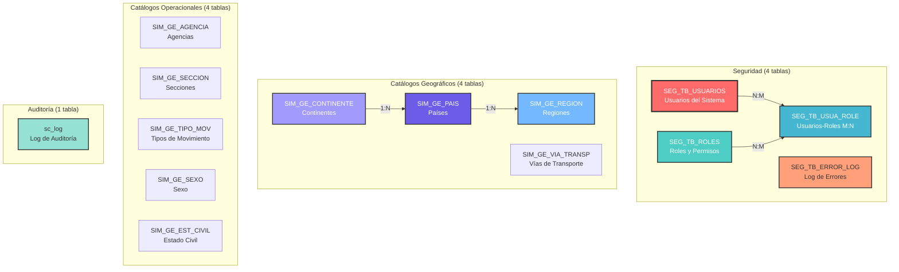
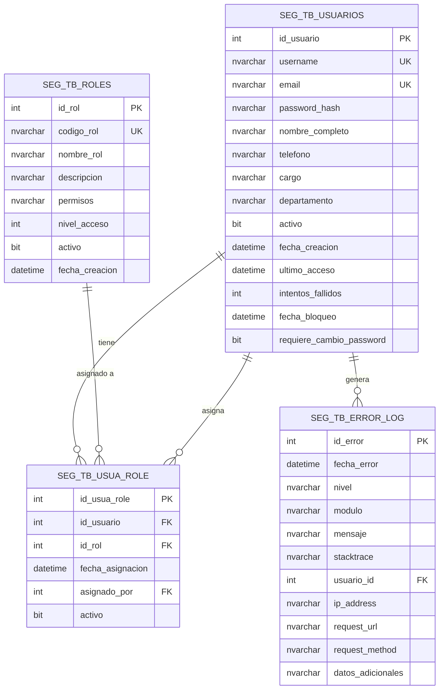
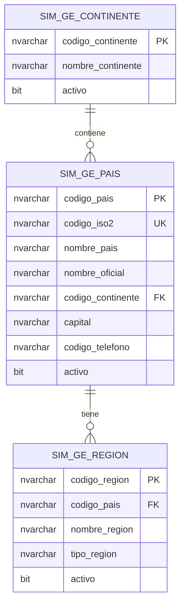

# Seguridad y Catálogos

Módulos transversales de seguridad, gestión de usuarios, catálogos geográficos y auditoría.

---

## Descripción General

Este módulo agrupa las **tablas de soporte** del sistema que proveen:

- 🔐 **Seguridad**: Gestión de usuarios, roles y permisos
- 🌍 **Catálogos Geográficos**: Países, continentes, regiones
- 📋 **Catálogos Operacionales**: Agencias, secciones, tipos de movimiento
- 📊 **Auditoría**: Registro de operaciones y errores del sistema

---

## Organización del Módulo



---

## Módulo de Seguridad

### 1. Tabla: `SEG_TB_USUARIOS`

**Descripción**: Usuarios del sistema con credenciales y perfil.

#### Estructura

| Columna | Tipo de Dato | Nulo | Default | PK | FK | Descripción |
|---------|--------------|------|---------|----|----|-------------|
| `id_usuario` | INT | NO | IDENTITY(1,1) | ✅ | | ID único del usuario |
| `username` | NVARCHAR(100) | NO | - | | | Nombre de usuario único |
| `email` | NVARCHAR(255) | NO | - | | | Email único |
| `password_hash` | NVARCHAR(255) | NO | - | | | Contraseña hash (bcrypt) |
| `nombre_completo` | NVARCHAR(255) | NO | - | | | Nombre completo |
| `telefono` | NVARCHAR(20) | YES | NULL | | | Teléfono de contacto |
| `cargo` | NVARCHAR(100) | YES | NULL | | | Cargo o posición |
| `departamento` | NVARCHAR(100) | YES | NULL | | | Departamento |
| `activo` | BIT | NO | 1 | | | Usuario activo |
| `fecha_creacion` | DATETIME | NO | GETDATE() | | | Fecha de creación |
| `ultimo_acceso` | DATETIME | YES | NULL | | | Último inicio de sesión |
| `intentos_fallidos` | INT | NO | 0 | | | Intentos fallidos de login |
| `fecha_bloqueo` | DATETIME | YES | NULL | | | Fecha de bloqueo (si aplica) |
| `requiere_cambio_password` | BIT | NO | 1 | | | ¿Requiere cambiar password? |

#### Índices y Constraints

```sql
-- Primary Key
CREATE CLUSTERED INDEX PK_SEG_TB_USUARIOS 
ON SEG_TB_USUARIOS(id_usuario);

-- Username único
CREATE UNIQUE NONCLUSTERED INDEX UK_SEG_TB_USUARIOS_username 
ON SEG_TB_USUARIOS(username);

-- Email único
CREATE UNIQUE NONCLUSTERED INDEX UK_SEG_TB_USUARIOS_email 
ON SEG_TB_USUARIOS(email);

-- Búsqueda por nombre
CREATE NONCLUSTERED INDEX IX_SEG_TB_USUARIOS_nombre 
ON SEG_TB_USUARIOS(nombre_completo);

-- Usuarios activos
CREATE NONCLUSTERED INDEX IX_SEG_TB_USUARIOS_activo 
ON SEG_TB_USUARIOS(activo)
INCLUDE (username, nombre_completo, email);

-- Check: Intentos no negativos
ALTER TABLE SEG_TB_USUARIOS
ADD CONSTRAINT CK_SEG_TB_USUARIOS_intentos
CHECK (intentos_fallidos >= 0);
```

#### Ejemplo de Uso

```sql
-- Crear usuario
INSERT INTO SEG_TB_USUARIOS (
    username,
    email,
    password_hash,
    nombre_completo,
    cargo,
    departamento
)
VALUES (
    'jperez',
    'juan.perez@migracion.gob.pa',
    '$2b$12$LQv3c1yqBWVHxkd0LHAkCOYz6TtxMQJqhN8/LewY5GyKdLRX1qH.u', -- bcrypt hash
    'Juan Pérez González',
    'Oficial de Trámites',
    'Atención al Ciudadano'
);

-- Login exitoso (actualizar último acceso)
UPDATE SEG_TB_USUARIOS
SET 
    ultimo_acceso = GETDATE(),
    intentos_fallidos = 0
WHERE username = 'jperez'
  AND activo = 1;

-- Login fallido (incrementar intentos)
UPDATE SEG_TB_USUARIOS
SET 
    intentos_fallidos = intentos_fallidos + 1,
    fecha_bloqueo = CASE 
        WHEN intentos_fallidos + 1 >= 5 THEN GETDATE() 
        ELSE NULL 
    END
WHERE username = 'jperez';

-- Listar usuarios activos con sus roles
SELECT 
    u.username,
    u.nombre_completo,
    u.email,
    u.cargo,
    u.departamento,
    STRING_AGG(r.nombre_rol, ', ') AS roles,
    u.ultimo_acceso
FROM SEG_TB_USUARIOS u
LEFT JOIN SEG_TB_USUA_ROLE ur ON u.id_usuario = ur.id_usuario
LEFT JOIN SEG_TB_ROLES r ON ur.id_rol = r.id_rol
WHERE u.activo = 1
GROUP BY u.username, u.nombre_completo, u.email, u.cargo, u.departamento, u.ultimo_acceso
ORDER BY u.nombre_completo;
```

---

### 2. Tabla: `SEG_TB_ROLES`

**Descripción**: Roles del sistema con permisos y descripción.

#### Estructura

| Columna | Tipo de Dato | Nulo | Default | PK | FK | Descripción |
|---------|--------------|------|---------|----|----|-------------|
| `id_rol` | INT | NO | IDENTITY(1,1) | ✅ | | ID único del rol |
| `codigo_rol` | NVARCHAR(50) | NO | - | | | Código único (ADMIN, OPERADOR, etc.) |
| `nombre_rol` | NVARCHAR(100) | NO | - | | | Nombre descriptivo |
| `descripcion` | NVARCHAR(500) | YES | NULL | | | Descripción del rol |
| `permisos` | NVARCHAR(MAX) | YES | NULL | | | Permisos JSON o CSV |
| `nivel_acceso` | INT | NO | 1 | | | Nivel de acceso (1-10) |
| `activo` | BIT | NO | 1 | | | Rol activo |
| `fecha_creacion` | DATETIME | NO | GETDATE() | | | Fecha de creación |

#### Índices y Constraints

```sql
-- Primary Key
CREATE CLUSTERED INDEX PK_SEG_TB_ROLES 
ON SEG_TB_ROLES(id_rol);

-- Código único
CREATE UNIQUE NONCLUSTERED INDEX UK_SEG_TB_ROLES_codigo 
ON SEG_TB_ROLES(codigo_rol);

-- Búsqueda por nombre
CREATE NONCLUSTERED INDEX IX_SEG_TB_ROLES_nombre 
ON SEG_TB_ROLES(nombre_rol);

-- Check: Nivel de acceso válido
ALTER TABLE SEG_TB_ROLES
ADD CONSTRAINT CK_SEG_TB_ROLES_nivel
CHECK (nivel_acceso BETWEEN 1 AND 10);
```

#### Datos Iniciales

```sql
-- Roles del sistema
INSERT INTO SEG_TB_ROLES (codigo_rol, nombre_rol, descripcion, nivel_acceso, permisos)
VALUES 
    ('ADMIN', 'Administrador', 'Acceso total al sistema', 10, '["ALL"]'),
    ('SUPERVISOR', 'Supervisor', 'Supervisión y aprobación de trámites', 8, '["READ", "UPDATE", "APPROVE"]'),
    ('OPERADOR', 'Operador', 'Operador de trámites estándar', 5, '["READ", "CREATE", "UPDATE"]'),
    ('REVISOR', 'Revisor', 'Revisor de documentación', 6, '["READ", "UPDATE", "REVIEW"]'),
    ('CONSULTA', 'Consulta', 'Solo lectura', 2, '["READ"]'),
    ('MEDICO', 'Médico Revisor', 'Revisión médica PPSH', 7, '["READ", "UPDATE", "MEDICAL_REVIEW"]'),
    ('ENTREVISTADOR', 'Oficial Entrevistador', 'Realización de entrevistas', 6, '["READ", "UPDATE", "INTERVIEW"]');
```

---

### 3. Tabla: `SEG_TB_USUA_ROLE`

**Descripción**: Relación Many-to-Many entre usuarios y roles.

#### Estructura

| Columna | Tipo de Dato | Nulo | Default | PK | FK | Descripción |
|---------|--------------|------|---------|----|----|-------------|
| `id_usua_role` | INT | NO | IDENTITY(1,1) | ✅ | | ID único de la relación |
| `id_usuario` | INT | NO | - | | ✅ | Usuario |
| `id_rol` | INT | NO | - | | ✅ | Rol |
| `fecha_asignacion` | DATETIME | NO | GETDATE() | | | Fecha de asignación |
| `asignado_por` | INT | YES | NULL | | ✅ | Quién asignó el rol |
| `activo` | BIT | NO | 1 | | | Asignación activa |

#### Índices y Foreign Keys

```sql
-- Primary Key
CREATE CLUSTERED INDEX PK_SEG_TB_USUA_ROLE 
ON SEG_TB_USUA_ROLE(id_usua_role);

-- Búsqueda por usuario
CREATE NONCLUSTERED INDEX IX_SEG_TB_USUA_ROLE_usuario 
ON SEG_TB_USUA_ROLE(id_usuario)
INCLUDE (id_rol, activo);

-- Búsqueda por rol
CREATE NONCLUSTERED INDEX IX_SEG_TB_USUA_ROLE_rol 
ON SEG_TB_USUA_ROLE(id_rol)
INCLUDE (id_usuario, activo);

-- Un usuario no puede tener el mismo rol dos veces
CREATE UNIQUE NONCLUSTERED INDEX UK_SEG_TB_USUA_ROLE_unico 
ON SEG_TB_USUA_ROLE(id_usuario, id_rol)
WHERE activo = 1;

-- Foreign Keys
ALTER TABLE SEG_TB_USUA_ROLE
ADD CONSTRAINT FK_SEG_TB_USUA_ROLE_usuario
FOREIGN KEY (id_usuario) 
REFERENCES SEG_TB_USUARIOS(id_usuario);

ALTER TABLE SEG_TB_USUA_ROLE
ADD CONSTRAINT FK_SEG_TB_USUA_ROLE_rol
FOREIGN KEY (id_rol) 
REFERENCES SEG_TB_ROLES(id_rol);

ALTER TABLE SEG_TB_USUA_ROLE
ADD CONSTRAINT FK_SEG_TB_USUA_ROLE_asignador
FOREIGN KEY (asignado_por) 
REFERENCES SEG_TB_USUARIOS(id_usuario);
```

#### Ejemplo de Uso

```sql
-- Asignar rol a usuario
INSERT INTO SEG_TB_USUA_ROLE (id_usuario, id_rol, asignado_por)
VALUES (5, 3, 1); -- Usuario 5 obtiene rol OPERADOR, asignado por Admin (1)

-- Asignar múltiples roles
INSERT INTO SEG_TB_USUA_ROLE (id_usuario, id_rol, asignado_por)
VALUES 
    (10, 4, 1), -- REVISOR
    (10, 7, 1); -- ENTREVISTADOR

-- Revocar rol
UPDATE SEG_TB_USUA_ROLE
SET activo = 0
WHERE id_usuario = 5
  AND id_rol = 3;

-- Ver permisos de un usuario
SELECT 
    u.username,
    u.nombre_completo,
    STRING_AGG(r.nombre_rol, ', ') AS roles,
    MAX(r.nivel_acceso) AS nivel_maximo
FROM SEG_TB_USUARIOS u
INNER JOIN SEG_TB_USUA_ROLE ur ON u.id_usuario = ur.id_usuario
INNER JOIN SEG_TB_ROLES r ON ur.id_rol = r.id_rol
WHERE u.id_usuario = 10
  AND ur.activo = 1
  AND u.activo = 1
GROUP BY u.username, u.nombre_completo;
```

---

### 4. Tabla: `SEG_TB_ERROR_LOG`

**Descripción**: Registro de errores del sistema para debugging.

#### Estructura

| Columna | Tipo de Dato | Nulo | Default | PK | FK | Descripción |
|---------|--------------|------|---------|----|----|-------------|
| `id_error` | INT | NO | IDENTITY(1,1) | ✅ | | ID único del error |
| `fecha_error` | DATETIME | NO | GETDATE() | | | Fecha y hora del error |
| `nivel` | NVARCHAR(20) | NO | 'ERROR' | | | DEBUG, INFO, WARNING, ERROR, CRITICAL |
| `modulo` | NVARCHAR(100) | YES | NULL | | | Módulo donde ocurrió |
| `mensaje` | NVARCHAR(MAX) | NO | - | | | Mensaje de error |
| `stacktrace` | NVARCHAR(MAX) | YES | NULL | | | Stack trace completo |
| `usuario_id` | INT | YES | NULL | | ✅ | Usuario que generó el error |
| `ip_address` | NVARCHAR(50) | YES | NULL | | | IP del cliente |
| `request_url` | NVARCHAR(500) | YES | NULL | | | URL solicitada |
| `request_method` | NVARCHAR(10) | YES | NULL | | | GET, POST, PUT, DELETE |
| `datos_adicionales` | NVARCHAR(MAX) | YES | NULL | | | JSON con datos adicionales |

#### Índices y Constraints

```sql
-- Primary Key
CREATE CLUSTERED INDEX PK_SEG_TB_ERROR_LOG 
ON SEG_TB_ERROR_LOG(id_error);

-- Búsqueda por fecha descendente
CREATE NONCLUSTERED INDEX IX_SEG_TB_ERROR_LOG_fecha 
ON SEG_TB_ERROR_LOG(fecha_error DESC)
INCLUDE (nivel, modulo, mensaje);

-- Búsqueda por nivel
CREATE NONCLUSTERED INDEX IX_SEG_TB_ERROR_LOG_nivel 
ON SEG_TB_ERROR_LOG(nivel, fecha_error DESC);

-- Búsqueda por usuario
CREATE NONCLUSTERED INDEX IX_SEG_TB_ERROR_LOG_usuario 
ON SEG_TB_ERROR_LOG(usuario_id)
WHERE usuario_id IS NOT NULL;

-- Check: Nivel válido
ALTER TABLE SEG_TB_ERROR_LOG
ADD CONSTRAINT CK_SEG_TB_ERROR_LOG_nivel
CHECK (nivel IN ('DEBUG', 'INFO', 'WARNING', 'ERROR', 'CRITICAL'));

-- Foreign Key
ALTER TABLE SEG_TB_ERROR_LOG
ADD CONSTRAINT FK_SEG_TB_ERROR_LOG_usuario
FOREIGN KEY (usuario_id) 
REFERENCES SEG_TB_USUARIOS(id_usuario);
```

#### Ejemplo de Uso

```sql
-- Registrar error
INSERT INTO SEG_TB_ERROR_LOG (
    nivel,
    modulo,
    mensaje,
    stacktrace,
    usuario_id,
    ip_address,
    request_url,
    request_method
)
VALUES (
    'ERROR',
    'PPSH.Documentos',
    'Error al subir archivo: Tamaño excede el límite permitido',
    'File "upload.py", line 45, in process_file\n  raise FileSizeError(...)',
    5,
    '192.168.1.100',
    '/api/ppsh/solicitudes/123/documentos',
    'POST'
);

-- Ver últimos errores críticos
SELECT TOP 20
    fecha_error,
    nivel,
    modulo,
    mensaje,
    u.username
FROM SEG_TB_ERROR_LOG e
LEFT JOIN SEG_TB_USUARIOS u ON e.usuario_id = u.id_usuario
WHERE nivel IN ('ERROR', 'CRITICAL')
ORDER BY fecha_error DESC;

-- Errores por módulo (últimas 24 horas)
SELECT 
    modulo,
    COUNT(*) AS total_errores,
    SUM(CASE WHEN nivel = 'CRITICAL' THEN 1 ELSE 0 END) AS criticos,
    SUM(CASE WHEN nivel = 'ERROR' THEN 1 ELSE 0 END) AS errores,
    SUM(CASE WHEN nivel = 'WARNING' THEN 1 ELSE 0 END) AS warnings
FROM SEG_TB_ERROR_LOG
WHERE fecha_error >= DATEADD(HOUR, -24, GETDATE())
GROUP BY modulo
ORDER BY total_errores DESC;

-- Limpieza de logs antiguos (procedimiento de mantenimiento)
DELETE FROM SEG_TB_ERROR_LOG
WHERE fecha_error < DATEADD(DAY, -90, GETDATE())
  AND nivel NOT IN ('ERROR', 'CRITICAL');
```

---

## Catálogos Geográficos

### 5. Tabla: `SIM_GE_CONTINENTE`

**Descripción**: Catálogo de continentes.

#### Estructura

| Columna | Tipo de Dato | Nulo | Default | PK | Descripción |
|---------|--------------|------|---------|----|----|
| `codigo_continente` | NVARCHAR(2) | NO | - | ✅ | Código ISO (AF, AS, EU, NA, OC, SA, AN) |
| `nombre_continente` | NVARCHAR(100) | NO | - | | Nombre del continente |
| `activo` | BIT | NO | 1 | | Continente activo |

#### Datos Iniciales

```sql
CREATE CLUSTERED INDEX PK_SIM_GE_CONTINENTE 
ON SIM_GE_CONTINENTE(codigo_continente);

INSERT INTO SIM_GE_CONTINENTE (codigo_continente, nombre_continente)
VALUES 
    ('AF', 'África'),
    ('AS', 'Asia'),
    ('EU', 'Europa'),
    ('NA', 'América del Norte'),
    ('SA', 'América del Sur'),
    ('OC', 'Oceanía'),
    ('AN', 'Antártida');
```

---

### 6. Tabla: `SIM_GE_PAIS`

**Descripción**: Catálogo de países del mundo.

#### Estructura

| Columna | Tipo de Dato | Nulo | Default | PK | FK | Descripción |
|---------|--------------|------|---------|----|----|-------------|
| `codigo_pais` | NVARCHAR(3) | NO | - | ✅ | | Código ISO 3166-1 alpha-3 |
| `codigo_iso2` | NVARCHAR(2) | YES | NULL | | | Código ISO alpha-2 |
| `nombre_pais` | NVARCHAR(100) | NO | - | | | Nombre del país |
| `nombre_oficial` | NVARCHAR(200) | YES | NULL | | | Nombre oficial |
| `codigo_continente` | NVARCHAR(2) | YES | NULL | | ✅ | Continente |
| `capital` | NVARCHAR(100) | YES | NULL | | | Capital del país |
| `codigo_telefono` | NVARCHAR(10) | YES | NULL | | | Código telefónico (+507) |
| `activo` | BIT | NO | 1 | | | País activo |

#### Índices y Foreign Keys

```sql
-- Primary Key
CREATE CLUSTERED INDEX PK_SIM_GE_PAIS 
ON SIM_GE_PAIS(codigo_pais);

-- Código ISO 2
CREATE UNIQUE NONCLUSTERED INDEX UK_SIM_GE_PAIS_iso2 
ON SIM_GE_PAIS(codigo_iso2)
WHERE codigo_iso2 IS NOT NULL;

-- Búsqueda por nombre
CREATE NONCLUSTERED INDEX IX_SIM_GE_PAIS_nombre 
ON SIM_GE_PAIS(nombre_pais);

-- Búsqueda por continente
CREATE NONCLUSTERED INDEX IX_SIM_GE_PAIS_continente 
ON SIM_GE_PAIS(codigo_continente)
WHERE codigo_continente IS NOT NULL;

-- Foreign Key
ALTER TABLE SIM_GE_PAIS
ADD CONSTRAINT FK_SIM_GE_PAIS_continente
FOREIGN KEY (codigo_continente) 
REFERENCES SIM_GE_CONTINENTE(codigo_continente);
```

#### Datos de Ejemplo

```sql
INSERT INTO SIM_GE_PAIS (codigo_pais, codigo_iso2, nombre_pais, nombre_oficial, codigo_continente, capital, codigo_telefono)
VALUES 
    ('PAN', 'PA', 'Panamá', 'República de Panamá', 'NA', 'Ciudad de Panamá', '+507'),
    ('USA', 'US', 'Estados Unidos', 'Estados Unidos de América', 'NA', 'Washington D.C.', '+1'),
    ('COL', 'CO', 'Colombia', 'República de Colombia', 'SA', 'Bogotá', '+57'),
    ('VEN', 'VE', 'Venezuela', 'República Bolivariana de Venezuela', 'SA', 'Caracas', '+58'),
    ('CRI', 'CR', 'Costa Rica', 'República de Costa Rica', 'NA', 'San José', '+506'),
    ('ESP', 'ES', 'España', 'Reino de España', 'EU', 'Madrid', '+34'),
    ('CHN', 'CN', 'China', 'República Popular China', 'AS', 'Pekín', '+86');

-- Listar países por continente
SELECT 
    c.nombre_continente,
    COUNT(*) AS total_paises,
    STRING_AGG(p.nombre_pais, ', ') AS paises
FROM SIM_GE_PAIS p
INNER JOIN SIM_GE_CONTINENTE c ON p.codigo_continente = c.codigo_continente
WHERE p.activo = 1
GROUP BY c.nombre_continente
ORDER BY total_paises DESC;
```

---

### 7. Tabla: `SIM_GE_REGION`

**Descripción**: Regiones o estados dentro de un país.

#### Estructura

| Columna | Tipo de Dato | Nulo | Default | PK | FK | Descripción |
|---------|--------------|------|---------|----|----|-------------|
| `codigo_region` | NVARCHAR(10) | NO | - | ✅ | | Código único de región |
| `codigo_pais` | NVARCHAR(3) | NO | - | | ✅ | País |
| `nombre_region` | NVARCHAR(100) | NO | - | | | Nombre de la región/provincia |
| `tipo_region` | NVARCHAR(50) | YES | NULL | | | Provincia, Estado, Departamento |
| `activo` | BIT | NO | 1 | | | Región activa |

#### Índices y Foreign Keys

```sql
-- Primary Key
CREATE CLUSTERED INDEX PK_SIM_GE_REGION 
ON SIM_GE_REGION(codigo_region);

-- Búsqueda por país
CREATE NONCLUSTERED INDEX IX_SIM_GE_REGION_pais 
ON SIM_GE_REGION(codigo_pais)
INCLUDE (nombre_region, tipo_region);

-- Foreign Key
ALTER TABLE SIM_GE_REGION
ADD CONSTRAINT FK_SIM_GE_REGION_pais
FOREIGN KEY (codigo_pais) 
REFERENCES SIM_GE_PAIS(codigo_pais);
```

#### Datos de Ejemplo (Provincias de Panamá)

```sql
INSERT INTO SIM_GE_REGION (codigo_region, codigo_pais, nombre_region, tipo_region)
VALUES 
    ('PAN-1', 'PAN', 'Bocas del Toro', 'Provincia'),
    ('PAN-2', 'PAN', 'Coclé', 'Provincia'),
    ('PAN-3', 'PAN', 'Colón', 'Provincia'),
    ('PAN-4', 'PAN', 'Chiriquí', 'Provincia'),
    ('PAN-5', 'PAN', 'Darién', 'Provincia'),
    ('PAN-6', 'PAN', 'Herrera', 'Provincia'),
    ('PAN-7', 'PAN', 'Los Santos', 'Provincia'),
    ('PAN-8', 'PAN', 'Panamá', 'Provincia'),
    ('PAN-9', 'PAN', 'Veraguas', 'Provincia'),
    ('PAN-10', 'PAN', 'Panamá Oeste', 'Provincia'),
    ('PAN-KY', 'PAN', 'Guna Yala', 'Comarca'),
    ('PAN-EM', 'PAN', 'Emberá', 'Comarca'),
    ('PAN-NB', 'PAN', 'Ngäbe-Buglé', 'Comarca');
```

---

### 8. Tabla: `SIM_GE_VIA_TRANSP`

**Descripción**: Vías o medios de transporte para entrada/salida.

#### Estructura

| Columna | Tipo de Dato | Nulo | Default | PK | Descripción |
|---------|--------------|------|---------|----|----|
| `codigo_via` | NVARCHAR(10) | NO | - | ✅ | Código de vía (AEREO, TERRESTRE, etc.) |
| `nombre_via` | NVARCHAR(100) | NO | - | | Nombre descriptivo |
| `descripcion` | NVARCHAR(255) | YES | NULL | | Descripción |
| `activo` | BIT | NO | 1 | | Vía activa |

#### Datos Iniciales

```sql
CREATE CLUSTERED INDEX PK_SIM_GE_VIA_TRANSP 
ON SIM_GE_VIA_TRANSP(codigo_via);

INSERT INTO SIM_GE_VIA_TRANSP (codigo_via, nombre_via, descripcion)
VALUES 
    ('AEREO', 'Aéreo', 'Ingreso/salida por aeropuerto'),
    ('TERRESTRE', 'Terrestre', 'Ingreso/salida por frontera terrestre'),
    ('MARITIMO', 'Marítimo', 'Ingreso/salida por puerto marítimo'),
    ('FLUVIAL', 'Fluvial', 'Ingreso/salida por vía fluvial');
```

---

## Catálogos Operacionales

### 9. Tabla: `SIM_GE_AGENCIA`

**Descripción**: Agencias o puntos de atención del Servicio Nacional de Migración.

#### Estructura

| Columna | Tipo de Dato | Nulo | Default | PK | Descripción |
|---------|--------------|------|---------|----|----|
| `codigo_agencia` | NVARCHAR(10) | NO | - | ✅ | Código de agencia |
| `nombre_agencia` | NVARCHAR(200) | NO | - | | Nombre de la agencia |
| `direccion` | NVARCHAR(500) | YES | NULL | | Dirección física |
| `telefono` | NVARCHAR(20) | YES | NULL | | Teléfono |
| `email` | NVARCHAR(100) | YES | NULL | | Email de contacto |
| `provincia` | NVARCHAR(100) | YES | NULL | | Provincia |
| `tipo_agencia` | NVARCHAR(50) | YES | NULL | | Central, Regional, Frontera, Aeropuerto |
| `activo` | BIT | NO | 1 | | Agencia activa |

#### Índices

```sql
-- Primary Key
CREATE CLUSTERED INDEX PK_SIM_GE_AGENCIA 
ON SIM_GE_AGENCIA(codigo_agencia);

-- Búsqueda por nombre
CREATE NONCLUSTERED INDEX IX_SIM_GE_AGENCIA_nombre 
ON SIM_GE_AGENCIA(nombre_agencia);

-- Búsqueda por provincia
CREATE NONCLUSTERED INDEX IX_SIM_GE_AGENCIA_provincia 
ON SIM_GE_AGENCIA(provincia)
WHERE provincia IS NOT NULL;
```

#### Datos de Ejemplo

```sql
INSERT INTO SIM_GE_AGENCIA (codigo_agencia, nombre_agencia, direccion, provincia, tipo_agencia)
VALUES 
    ('AGE-001', 'Sede Central - Panamá', 'Av. Cuba, Edificio Central', 'Panamá', 'Central'),
    ('AGE-002', 'Aeropuerto Internacional de Tocumen', 'Aeropuerto de Tocumen', 'Panamá', 'Aeropuerto'),
    ('AGE-003', 'Frontera Paso Canoas', 'Paso Canoas, Chiriquí', 'Chiriquí', 'Frontera'),
    ('AGE-004', 'David - Chiriquí', 'Calle Central, David', 'Chiriquí', 'Regional'),
    ('AGE-005', 'Colón', 'Avenida Central, Colón', 'Colón', 'Regional');
```

---

### 10. Tabla: `SIM_GE_SECCION`

**Descripción**: Secciones o departamentos dentro de las agencias.

#### Estructura

| Columna | Tipo de Dato | Nulo | Default | PK | Descripción |
|---------|--------------|------|---------|----|----|
| `codigo_seccion` | NVARCHAR(10) | NO | - | ✅ | Código de sección |
| `nombre_seccion` | NVARCHAR(200) | NO | - | | Nombre de la sección |
| `descripcion` | NVARCHAR(500) | YES | NULL | | Descripción |
| `activo` | BIT | NO | 1 | | Sección activa |

#### Datos Iniciales

```sql
CREATE CLUSTERED INDEX PK_SIM_GE_SECCION 
ON SIM_GE_SECCION(codigo_seccion);

INSERT INTO SIM_GE_SECCION (codigo_seccion, nombre_seccion, descripcion)
VALUES 
    ('SEC-001', 'Atención al Ciudadano', 'Atención directa y recepción de trámites'),
    ('SEC-002', 'Procesamiento de Visas', 'Revisión y aprobación de visas'),
    ('SEC-003', 'Control Migratorio', 'Control de entradas y salidas'),
    ('SEC-004', 'Pasaportes', 'Emisión y renovación de pasaportes'),
    ('SEC-005', 'Asuntos Humanitarios', 'PPSH y casos especiales'),
    ('SEC-006', 'Tecnología e Informática', 'Soporte tecnológico'),
    ('SEC-007', 'Recursos Humanos', 'Gestión de personal'),
    ('SEC-008', 'Administración', 'Administración general');
```

---

### 11. Tabla: `SIM_GE_TIPO_MOV`

**Descripción**: Tipos de movimiento migratorio (entrada/salida).

#### Estructura

| Columna | Tipo de Dato | Nulo | Default | PK | Descripción |
|---------|--------------|------|---------|----|----|
| `codigo_tipo_mov` | NVARCHAR(10) | NO | - | ✅ | Código (ENTRADA, SALIDA) |
| `nombre_tipo_mov` | NVARCHAR(100) | NO | - | | Nombre descriptivo |
| `descripcion` | NVARCHAR(255) | YES | NULL | | Descripción |
| `activo` | BIT | NO | 1 | | Tipo activo |

#### Datos Iniciales

```sql
CREATE CLUSTERED INDEX PK_SIM_GE_TIPO_MOV 
ON SIM_GE_TIPO_MOV(codigo_tipo_mov);

INSERT INTO SIM_GE_TIPO_MOV (codigo_tipo_mov, nombre_tipo_mov, descripcion)
VALUES 
    ('ENTRADA', 'Entrada al País', 'Registro de ingreso al territorio nacional'),
    ('SALIDA', 'Salida del País', 'Registro de salida del territorio nacional');
```

---

### 12. Tabla: `SIM_GE_SEXO`

**Descripción**: Catálogo de sexo/género.

#### Estructura

| Columna | Tipo de Dato | Nulo | Default | PK | Descripción |
|---------|--------------|------|---------|----|----|
| `codigo_sexo` | NVARCHAR(1) | NO | - | ✅ | Código (M, F) |
| `nombre_sexo` | NVARCHAR(50) | NO | - | | Masculino, Femenino |
| `activo` | BIT | NO | 1 | | Activo |

#### Datos Iniciales

```sql
CREATE CLUSTERED INDEX PK_SIM_GE_SEXO 
ON SIM_GE_SEXO(codigo_sexo);

INSERT INTO SIM_GE_SEXO (codigo_sexo, nombre_sexo)
VALUES 
    ('M', 'Masculino'),
    ('F', 'Femenino');
```

---

### 13. Tabla: `SIM_GE_EST_CIVIL`

**Descripción**: Catálogo de estados civiles.

#### Estructura

| Columna | Tipo de Dato | Nulo | Default | PK | Descripción |
|---------|--------------|------|---------|----|----|
| `codigo_est_civil` | NVARCHAR(10) | NO | - | ✅ | Código (SOLTERO, CASADO, etc.) |
| `nombre_est_civil` | NVARCHAR(100) | NO | - | | Nombre del estado civil |
| `activo` | BIT | NO | 1 | | Activo |

#### Datos Iniciales

```sql
CREATE CLUSTERED INDEX PK_SIM_GE_EST_CIVIL 
ON SIM_GE_EST_CIVIL(codigo_est_civil);

INSERT INTO SIM_GE_EST_CIVIL (codigo_est_civil, nombre_est_civil)
VALUES 
    ('SOLTERO', 'Soltero(a)'),
    ('CASADO', 'Casado(a)'),
    ('DIVORCIADO', 'Divorciado(a)'),
    ('VIUDO', 'Viudo(a)'),
    ('UNION_LIBRE', 'Unión Libre');
```

---

## Módulo de Auditoría

### 14. Tabla: `sc_log`

**Descripción**: Log de auditoría de operaciones del sistema.

#### Estructura

| Columna | Tipo de Dato | Nulo | Default | PK | Descripción |
|---------|--------------|------|---------|----|----|
| `id_log` | INT | NO | IDENTITY(1,1) | ✅ | ID único del registro |
| `fecha_log` | DATETIME | NO | GETDATE() | | Fecha y hora |
| `usuario_id` | INT | YES | NULL | | Usuario que ejecutó la acción |
| `accion` | NVARCHAR(50) | NO | - | | INSERT, UPDATE, DELETE, LOGIN, LOGOUT |
| `tabla` | NVARCHAR(100) | YES | NULL | | Tabla afectada |
| `registro_id` | NVARCHAR(50) | YES | NULL | | ID del registro afectado |
| `valores_anteriores` | NVARCHAR(MAX) | YES | NULL | | JSON con valores antes del cambio |
| `valores_nuevos` | NVARCHAR(MAX) | YES | NULL | | JSON con valores después del cambio |
| `ip_address` | NVARCHAR(50) | YES | NULL | | IP del cliente |
| `user_agent` | NVARCHAR(500) | YES | NULL | | Navegador/aplicación |

#### Índices

```sql
-- Primary Key
CREATE CLUSTERED INDEX PK_sc_log 
ON sc_log(id_log);

-- Búsqueda por fecha descendente
CREATE NONCLUSTERED INDEX IX_sc_log_fecha 
ON sc_log(fecha_log DESC)
INCLUDE (usuario_id, accion, tabla);

-- Búsqueda por usuario
CREATE NONCLUSTERED INDEX IX_sc_log_usuario 
ON sc_log(usuario_id, fecha_log DESC)
WHERE usuario_id IS NOT NULL;

-- Búsqueda por tabla y registro
CREATE NONCLUSTERED INDEX IX_sc_log_tabla_registro 
ON sc_log(tabla, registro_id)
WHERE tabla IS NOT NULL AND registro_id IS NOT NULL;

-- Búsqueda por acción
CREATE NONCLUSTERED INDEX IX_sc_log_accion 
ON sc_log(accion, fecha_log DESC);
```

#### Ejemplo de Uso

```sql
-- Registrar login
INSERT INTO sc_log (usuario_id, accion, ip_address, user_agent)
VALUES (
    5,
    'LOGIN',
    '192.168.1.100',
    'Mozilla/5.0 (Windows NT 10.0; Win64; x64) AppleWebKit/537.36'
);

-- Registrar modificación de tramite (ejemplo con trigger)
INSERT INTO sc_log (
    usuario_id,
    accion,
    tabla,
    registro_id,
    valores_anteriores,
    valores_nuevos
)
VALUES (
    5,
    'UPDATE',
    'tramites',
    '123',
    '{"estado": "PENDIENTE", "observaciones": "En revisión"}',
    '{"estado": "APROBADO", "observaciones": "Aprobado por supervisor"}'
);

-- Ver historial de un registro
SELECT 
    l.fecha_log,
    l.accion,
    u.nombre_completo AS usuario,
    l.valores_anteriores,
    l.valores_nuevos
FROM sc_log l
LEFT JOIN SEG_TB_USUARIOS u ON l.usuario_id = u.id_usuario
WHERE l.tabla = 'PPSH_SOLICITUD'
  AND l.registro_id = '456'
ORDER BY l.fecha_log DESC;

-- Actividad por usuario (últimos 7 días)
SELECT 
    u.nombre_completo,
    COUNT(*) AS total_acciones,
    SUM(CASE WHEN l.accion = 'INSERT' THEN 1 ELSE 0 END) AS creaciones,
    SUM(CASE WHEN l.accion = 'UPDATE' THEN 1 ELSE 0 END) AS modificaciones,
    SUM(CASE WHEN l.accion = 'DELETE' THEN 1 ELSE 0 END) AS eliminaciones,
    MIN(l.fecha_log) AS primera_accion,
    MAX(l.fecha_log) AS ultima_accion
FROM sc_log l
INNER JOIN SEG_TB_USUARIOS u ON l.usuario_id = u.id_usuario
WHERE l.fecha_log >= DATEADD(DAY, -7, GETDATE())
  AND l.accion IN ('INSERT', 'UPDATE', 'DELETE')
GROUP BY u.nombre_completo
ORDER BY total_acciones DESC;

-- Procedimiento de limpieza (mantener solo 6 meses)
DELETE FROM sc_log
WHERE fecha_log < DATEADD(MONTH, -6, GETDATE())
  AND accion NOT IN ('DELETE'); -- Mantener siempre los deletes
```

---

## Diagrama ER - Módulo de Seguridad



---

## Diagrama ER - Catálogos Geográficos



---

## Consultas Útiles

### Reporte de Usuarios y Permisos

```sql
-- Vista completa de usuarios con roles
CREATE VIEW vw_usuarios_permisos AS
SELECT 
    u.id_usuario,
    u.username,
    u.nombre_completo,
    u.email,
    u.cargo,
    u.departamento,
    u.activo AS usuario_activo,
    STRING_AGG(r.nombre_rol, ', ') AS roles,
    MAX(r.nivel_acceso) AS nivel_acceso_maximo,
    u.ultimo_acceso,
    DATEDIFF(DAY, u.ultimo_acceso, GETDATE()) AS dias_inactivo
FROM SEG_TB_USUARIOS u
LEFT JOIN SEG_TB_USUA_ROLE ur ON u.id_usuario = ur.id_usuario AND ur.activo = 1
LEFT JOIN SEG_TB_ROLES r ON ur.id_rol = r.id_rol AND r.activo = 1
GROUP BY u.id_usuario, u.username, u.nombre_completo, u.email, u.cargo, 
         u.departamento, u.activo, u.ultimo_acceso;

-- Usar la vista
SELECT * FROM vw_usuarios_permisos
WHERE usuario_activo = 1
ORDER BY nivel_acceso_maximo DESC, nombre_completo;
```

### Estadísticas de Auditoría

```sql
-- Dashboard de auditoría
SELECT 
    CONVERT(DATE, fecha_log) AS fecha,
    COUNT(*) AS total_operaciones,
    COUNT(DISTINCT usuario_id) AS usuarios_activos,
    SUM(CASE WHEN accion = 'LOGIN' THEN 1 ELSE 0 END) AS logins,
    SUM(CASE WHEN accion = 'INSERT' THEN 1 ELSE 0 END) AS creaciones,
    SUM(CASE WHEN accion = 'UPDATE' THEN 1 ELSE 0 END) AS modificaciones,
    SUM(CASE WHEN accion = 'DELETE' THEN 1 ELSE 0 END) AS eliminaciones
FROM sc_log
WHERE fecha_log >= DATEADD(DAY, -30, GETDATE())
GROUP BY CONVERT(DATE, fecha_log)
ORDER BY fecha DESC;
```

---

## Navegación

[← Módulo Workflows](modulo-workflows.md) | [Diccionario de Datos](index.md) | [Índices y Constraints →](indices-constraints.md)
