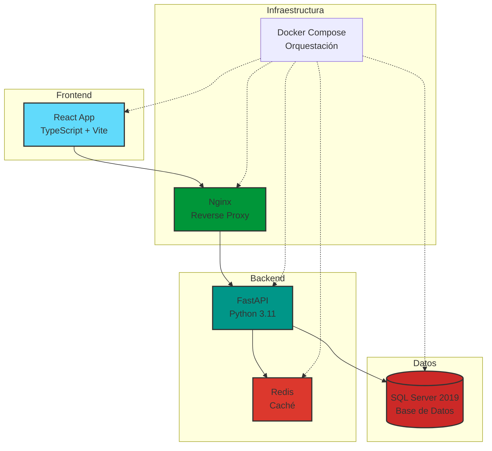

# 🌐 Sistema de Trámites Migratorios de Panamá

<div style="text-align: center; padding: 2rem 0;">
    <h2>Documentación Técnica Completa</h2>
    <p style="font-size: 1.2rem; color: #666;">Backend · Frontend · Base de Datos · Capacitación</p>
</div>

---

## 🎯 Bienvenido

Esta es la documentación oficial del **Sistema de Trámites Migratorios de Panamá**, una plataforma moderna y escalable para la gestión integral de trámites migratorios, incluyendo el **Permiso Provisorio de Salida Humanitaria (PPSH)** y **Workflows Dinámicos**.

## 📚 Contenido de la Documentación

<div class="grid cards" markdown>

-   :material-account-circle:{ .lg .middle } __Manual de Usuario__

    ---

    Guía completa para usuarios finales del sistema. Incluye instrucciones paso a paso, casos de uso y FAQs.

    [:octicons-arrow-right-24: Ir al Manual de Usuario](usuario/index.md)

-   :material-code-braces:{ .lg .middle } __Manual Técnico__

    ---

    Documentación exhaustiva para desarrolladores y administradores de sistemas. Arquitectura, APIs, Base de Datos y más.

    [:octicons-arrow-right-24: Ir al Manual Técnico](tecnico/index.md)

-   :material-database:{ .lg .middle } __Diccionario de Datos__

    ---

    Documentación completa de la base de datos: 30 tablas, índices, relaciones y optimizaciones.

    [:octicons-arrow-right-24: Ver Base de Datos](database/index.md)

-   :material-school:{ .lg .middle } __Guía de Capacitación__

    ---

    Programa completo de formación con 5 módulos, ejercicios prácticos y certificación.

    [:octicons-arrow-right-24: Programa de Capacitación](capacitacion/index.md)

-   :material-api:{ .lg .middle } __APIs REST__

    ---

    Documentación de 35+ endpoints REST con ejemplos de uso, autenticación y códigos de error.

    [:octicons-arrow-right-24: Documentación de APIs](api/index.md)

-   :material-rocket-launch:{ .lg .middle } __Deployment__

    ---

    Guías de despliegue, configuración de infraestructura, Docker Compose y escalabilidad.

    [:octicons-arrow-right-24: Guías de Deployment](deployment/index.md)

</div>

---

## 🚀 Inicio Rápido

### Para Usuarios

1. **Acceso al Sistema**: [Guía de Acceso](usuario/02-acceso.md)
2. **Crear Trámite**: [Módulo de Trámites](usuario/03-tramites.md)
3. **Solicitud PPSH**: [Permiso Humanitario](usuario/04-ppsh.md)

### Para Desarrolladores

1. **Clonar Repositorio**:
   ```bash
   git clone https://github.com/juncid/tramites-mvp-panama.git
   cd tramites-mvp-panama
   ```

2. **Configurar Variables de Entorno**:
   ```bash
   cp .env.example .env
   # Editar .env con tus credenciales
   ```

3. **Levantar Servicios**:
   ```bash
   docker-compose up -d
   ```

4. **Verificar**:
   - API: http://localhost:8000
   - Frontend: http://localhost:3000
   - Docs API: http://localhost:8000/docs

[:octicons-arrow-right-24: Ver Guía Completa de Inicio Rápido](introduccion/inicio-rapido.md)

---

## 📊 Estadísticas del Proyecto

<div class="grid" markdown>

=== "Código"

    - **Lenguaje**: Python 3.11 + TypeScript
    - **Framework Backend**: FastAPI
    - **Framework Frontend**: React 18
    - **Base de Datos**: SQL Server 2019
    - **ORM**: SQLAlchemy 2.0
    - **Endpoints REST**: 35+
    - **Tests**: >80% cobertura

=== "Base de Datos"

    - **Tablas**: 30 tablas principales
    - **Índices**: 87+ índices optimizados
    - **Foreign Keys**: 25+ relaciones
    - **Normalización**: 3NF
    - **Auditoría**: Completa con soft delete
    - **Migraciones**: Alembic

=== "Documentación"

    - **Páginas**: ~347 páginas
    - **Palabras**: ~90,000 palabras
    - **Diagramas**: 15+ diagramas
    - **Ejemplos de Código**: 80+
    - **FAQs**: 25+ preguntas
    - **Idioma**: Español

=== "Capacitación"

    - **Módulos**: 5 módulos
    - **Duración**: 14 horas
    - **Ejercicios**: 15 prácticos
    - **Evaluaciones**: 5 evaluaciones
    - **Certificación**: Incluida

</div>

---

## 🏗️ Arquitectura del Sistema



[:octicons-arrow-right-24: Ver Arquitectura Detallada](introduccion/arquitectura.md)

---

## 🎯 Módulos Principales

### 1. 📋 Trámites Base

Sistema completo para gestión de trámites migratorios generales.

**Características**:
- ✅ CRUD completo de trámites
- ✅ Estados del ciclo de vida
- ✅ Búsqueda y filtrado avanzado
- ✅ Estadísticas en tiempo real
- ✅ Auditoría completa

[:octicons-arrow-right-24: Ver Documentación de Trámites](usuario/03-tramites.md)

### 2. 🏥 PPSH (Permiso Provisorio de Salida Humanitaria)

Módulo especializado para gestión de permisos humanitarios.

**Características**:
- ✅ Solicitudes con datos biométricos
- ✅ Gestión de documentos adjuntos
- ✅ Revisión médica integrada
- ✅ Sistema de entrevistas
- ✅ Workflow de aprobación
- ✅ Causas humanitarias categorizadas

[:octicons-arrow-right-24: Ver Documentación PPSH](usuario/04-ppsh.md)

### 3. 🔄 Workflows Dinámicos

Motor de workflows configurable para procesos personalizados.

**Características**:
- ✅ Definición visual de workflows
- ✅ Etapas y tareas configurables
- ✅ Asignación automática de tareas
- ✅ Seguimiento en tiempo real
- ✅ Reportes de progreso
- ✅ SLA y alertas

[:octicons-arrow-right-24: Ver Documentación de Workflows](usuario/05-workflows.md)

---

## 🔐 Seguridad

El sistema implementa múltiples capas de seguridad:

- ✅ **Autenticación**: JWT tokens (preparado)
- ✅ **Autorización**: RBAC con roles y permisos
- ✅ **Auditoría**: Log completo de todas las operaciones
- ✅ **Encriptación**: TLS/SSL en tránsito
- ✅ **Validación**: Pydantic schemas en todas las APIs
- ✅ **SQL Injection**: Protección con ORM
- ✅ **CORS**: Configuración restrictiva
- ✅ **Backup**: Automatizado y encriptado

[:octicons-arrow-right-24: Ver Seguridad Completa](tecnico/06-seguridad.md)

---

## 📖 Guías por Rol

### 👤 Para Usuarios Finales

Si eres un **solicitante o ciudadano** que necesita usar el sistema:

1. [Manual de Usuario Completo](usuario/index.md)
2. [Cómo Crear un Trámite](usuario/03-tramites.md)
3. [Cómo Solicitar un PPSH](usuario/04-ppsh.md)
4. [Preguntas Frecuentes](usuario/06-faqs.md)

### 👨‍💻 Para Desarrolladores

Si eres un **desarrollador** que trabajará con el código:

1. [Arquitectura del Sistema](tecnico/01-arquitectura.md)
2. [Backend API](tecnico/03-backend.md)
3. [Base de Datos](database/index.md)
4. [APIs REST](api/index.md)

### ⚙️ Para Administradores de Sistemas

Si eres **DevOps o SysAdmin** responsable del deployment:

1. [Infraestructura](tecnico/05-infraestructura.md)
2. [Deployment con Docker](deployment/docker-compose.md)
3. [Monitoreo y Logs](tecnico/07-monitoreo.md)
4. [Troubleshooting](tecnico/08-troubleshooting.md)

### 🗄️ Para DBAs

Si eres **administrador de base de datos**:

1. [Diccionario de Datos](database/diccionario.md)
2. [Índices y Optimización](database/indices.md)
3. [Scripts y Migraciones](database/scripts.md)
4. [Procedimientos de Mantenimiento](tecnico/09-mantenimiento.md)

### 🎓 Para Capacitadores

Si eres **instructor o formador**:

1. [Programa de Capacitación](capacitacion/programa.md)
2. [Módulos de Formación](capacitacion/index.md)
3. [Ejercicios Prácticos](capacitacion/ejercicios.md)
4. [Evaluaciones](capacitacion/evaluaciones.md)

---

## 🛠️ Stack Tecnológico

### Backend
```python
Python 3.11          # Lenguaje principal
FastAPI 0.104+       # Framework web
SQLAlchemy 2.0       # ORM
Pydantic 2.0         # Validación
Alembic              # Migraciones
pytest               # Testing
Redis                # Caché
```

### Frontend
```javascript
React 18             // Framework UI
TypeScript 5.0       // Tipado estático
Vite                 // Build tool
React Router         // Navegación
Axios                // HTTP client
```

### Base de Datos
```sql
SQL Server 2019      -- RDBMS principal
pyodbc               -- Driver Python
```

### Infraestructura
```yaml
Docker               # Contenedores
Docker Compose       # Orquestación
Nginx                # Reverse Proxy
Let's Encrypt        # Certificados SSL
```

[:octicons-arrow-right-24: Ver Stack Completo](introduccion/tecnologias.md)

---

## 📞 Soporte y Contacto

### Obtener Ayuda

- **Documentación**: Estás aquí 📖
- **Issues**: [GitHub Issues](https://github.com/juncid/tramites-mvp-panama/issues)
- **Email**: soporte@migracion.gob.pa
- **FAQ**: [Preguntas Frecuentes](usuario/06-faqs.md)

### Contribuir

¿Quieres contribuir al proyecto? ¡Genial!

1. Lee la [Guía de Contribución](recursos/contribuir.md)
2. Revisa el [Roadmap](recursos/roadmap.md)
3. Consulta el [Changelog](recursos/changelog.md)

---

## 📄 Licencia

Este proyecto está desarrollado por el **Servicio Nacional de Migración de Panamá**.

[:octicons-arrow-right-24: Ver Licencia Completa](recursos/licencia.md)

---

## 🎉 Estado del Proyecto

<div style="text-align: center; padding: 2rem; background: #f5f5f5; border-radius: 8px; margin: 2rem 0;">
    <h3 style="color: #4caf50; margin: 0;">✅ Producto Nº1 - COMPLETADO AL 100%</h3>
    <p style="margin: 1rem 0 0 0;">Desarrollo del Backend con documentación completa</p>
</div>

**Última actualización**: 22 de Octubre, 2025  
**Versión de Documentación**: 1.0

---

<div style="text-align: center; padding: 2rem 0;">
    <p style="font-size: 0.9rem; color: #999;">
        Desarrollado con ❤️ por el equipo del Servicio Nacional de Migración de Panamá
    </p>
</div>
