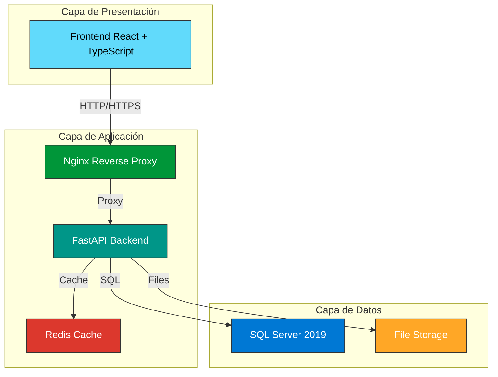
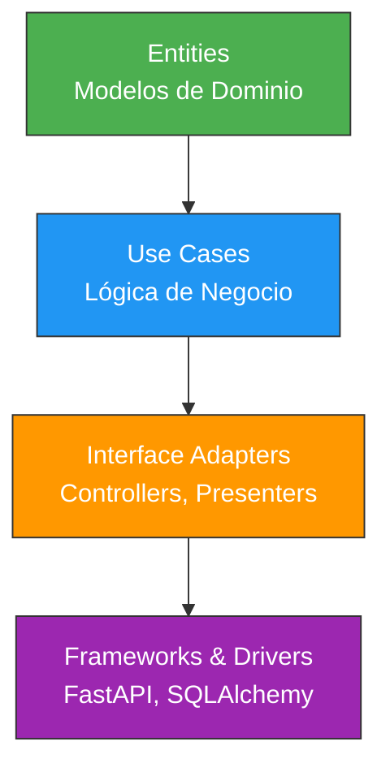
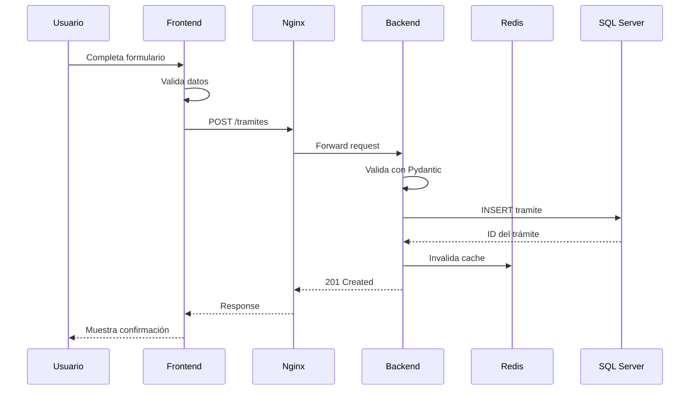
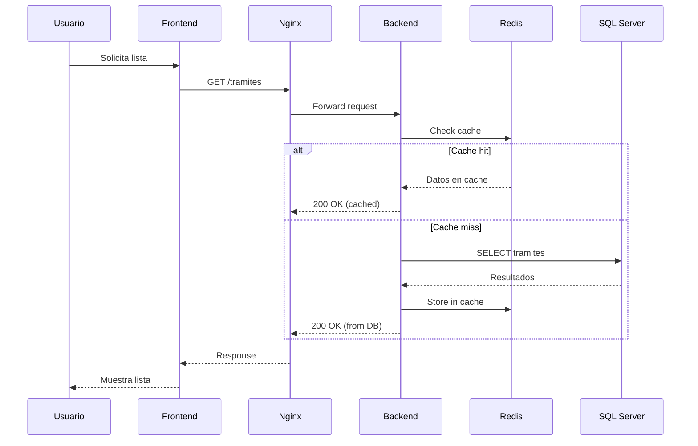
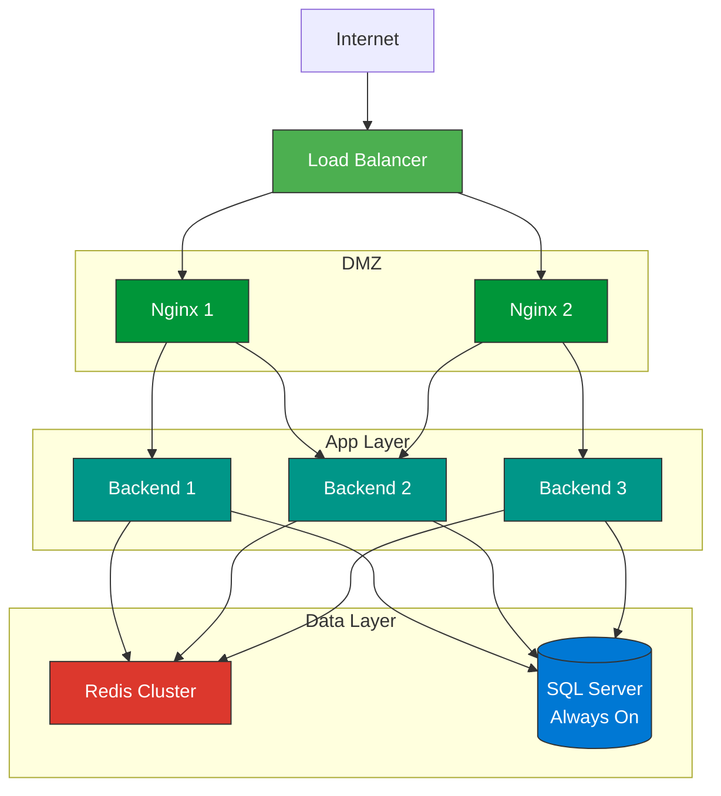
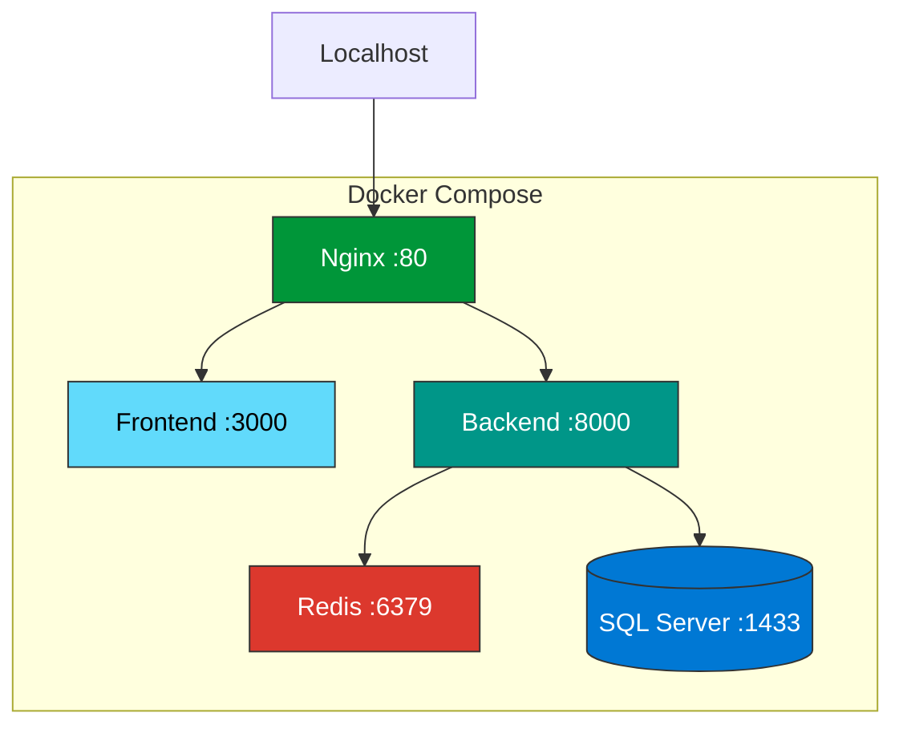
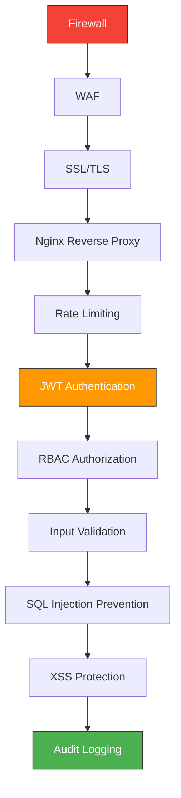
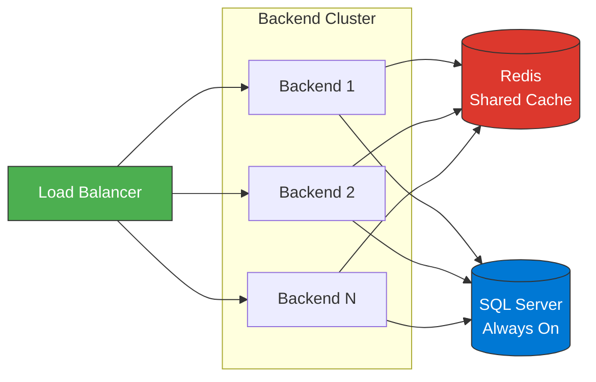
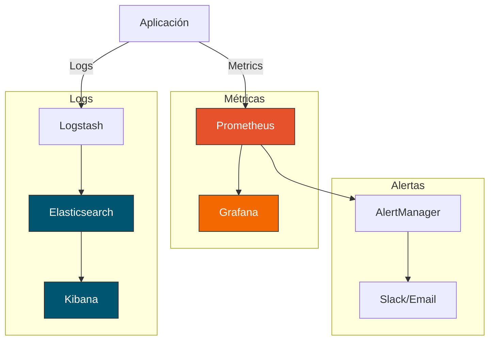

# 🏗️ Arquitectura General del Sistema

Esta página describe la arquitectura de alto nivel del Sistema de Trámites Migratorios de Panamá.

---

## 📐 Vista General

El sistema está diseñado siguiendo los principios de **Clean Architecture** y utiliza una arquitectura en **3 capas** con separación clara de responsabilidades.



---

## 🎯 Principios de Diseño

### 1. Separación de Responsabilidades

Cada capa tiene una responsabilidad específica:

- **Frontend**: Presentación e interacción con el usuario
- **Backend**: Lógica de negocio y procesamiento
- **Base de Datos**: Persistencia y almacenamiento

### 2. Clean Architecture



**Capas**:

1. **Entities (Núcleo)**: Modelos de dominio (`models.py`, `models_ppsh.py`, `models_workflow.py`)
2. **Use Cases**: Lógica de negocio pura
3. **Interface Adapters**: Controllers (routes), Schemas (Pydantic)
4. **Frameworks**: FastAPI, SQLAlchemy, React

### 3. API-First Design

Todo el sistema está diseñado alrededor de una **API REST robusta**:

- Documentación automática con OpenAPI/Swagger
- Validación de datos con Pydantic
- Respuestas consistentes
- Manejo de errores estandarizado

---

## 🔧 Componentes Principales

### 1. Frontend (React + TypeScript)

**Tecnologías**:
- React 18 con Hooks
- TypeScript para type safety
- Vite como build tool
- React Router para navegación
- Axios para llamadas HTTP

**Responsabilidades**:
- Interfaz de usuario responsiva
- Validación del lado del cliente
- Gestión del estado de la aplicación
- Manejo de sesiones de usuario

### 2. Backend (FastAPI + Python)

**Tecnologías**:
- Python 3.11
- FastAPI framework
- SQLAlchemy 2.0 ORM
- Pydantic para validación
- Alembic para migraciones

**Módulos**:

```
backend/app/
├── main.py              # Punto de entrada FastAPI
├── database.py          # Configuración de BD
├── models.py            # Modelos Trámites
├── models_ppsh.py       # Modelos PPSH
├── models_workflow.py   # Modelos Workflow
├── schemas.py           # Schemas Pydantic
├── routes.py            # Endpoints Trámites
├── routes_ppsh.py       # Endpoints PPSH
└── routes_workflow.py   # Endpoints Workflow
```

**Responsabilidades**:
- Lógica de negocio
- Validación de datos
- Autenticación y autorización
- Procesamiento de archivos
- Generación de reportes

### 3. Base de Datos (SQL Server 2019)

**Estructura**:
- 30 tablas principales
- 87+ índices optimizados
- 25+ relaciones (Foreign Keys)
- Soft delete implementado
- Auditoría automática

**Módulos de datos**:
- Trámites Base (1 tabla)
- PPSH (8 tablas)
- Workflows (7 tablas)
- Seguridad (4 tablas)
- Catálogos (9 tablas)
- Auditoría (1 tabla)

### 4. Nginx (Reverse Proxy)

**Funciones**:
- Reverse proxy para el backend
- Servir archivos estáticos del frontend
- Balanceo de carga (preparado)
- Terminación SSL/TLS
- Compresión GZIP
- Caché de contenido estático

### 5. Redis (Cache)

**Uso**:
- Caché de resultados de queries frecuentes
- Sesiones de usuario
- Rate limiting
- Background jobs (futuro)

---

## 🔄 Flujo de Datos

### Creación de un Trámite



### Consulta de Trámites con Cache



---

## 🌐 Arquitectura de Red

### Producción



### Desarrollo Local



---

## 📦 Contenedorización

Todos los servicios están contenedorizados con **Docker**:

### Servicios Docker

| Servicio | Imagen | Puerto | Volumen |
|----------|--------|--------|---------|
| **Frontend** | `node:18-alpine` | 3000 | `./frontend:/app` |
| **Backend** | `python:3.11-slim` | 8000 | `./backend:/app` |
| **Nginx** | `nginx:alpine` | 80, 443 | `./nginx:/etc/nginx` |
| **SQL Server** | `mcr.microsoft.com/mssql/server:2019` | 1433 | `db-data:/var/opt/mssql` |
| **Redis** | `redis:7-alpine` | 6379 | `redis-data:/data` |

### Docker Compose

```yaml
version: '3.8'

services:
  frontend:
    build: ./frontend
    ports: ["3000:3000"]
    depends_on: [backend]
  
  backend:
    build: ./backend
    ports: ["8000:8000"]
    depends_on: [db, redis]
  
  nginx:
    image: nginx:alpine
    ports: ["80:80", "443:443"]
    depends_on: [frontend, backend]
  
  db:
    image: mcr.microsoft.com/mssql/server:2019
    ports: ["1433:1433"]
    volumes: ["db-data:/var/opt/mssql"]
  
  redis:
    image: redis:7-alpine
    ports: ["6379:6379"]
    volumes: ["redis-data:/data"]
```

---

## 🔐 Seguridad

### Capas de Seguridad



**Implementación**:

1. **Firewall**: Protección a nivel de red
2. **WAF**: Web Application Firewall
3. **SSL/TLS**: Certificados Let's Encrypt
4. **Nginx**: Reverse proxy con headers de seguridad
5. **Rate Limiting**: Redis-based throttling
6. **JWT**: Autenticación stateless (preparado)
7. **RBAC**: Control de acceso basado en roles
8. **Validation**: Pydantic schemas
9. **SQL Prevention**: SQLAlchemy ORM + parametrización
10. **XSS Protection**: Sanitización de inputs
11. **Audit Logging**: Tabla `sc_log` para auditoría

---

## 📊 Escalabilidad

### Escalamiento Horizontal

El sistema está diseñado para escalar horizontalmente:



**Ventajas**:
- ✅ Sin estado en el backend (stateless)
- ✅ Sesiones en Redis compartido
- ✅ Base de datos centralizada con replicación
- ✅ Fácil agregar/remover instancias
- ✅ Alta disponibilidad

### Puntos de Escalamiento

| Componente | Estrategia | Herramienta |
|------------|-----------|-------------|
| **Frontend** | CDN + caching | Cloudflare, AWS CloudFront |
| **Backend** | Múltiples instancias | Docker Swarm, Kubernetes |
| **Nginx** | Múltiples proxies | HAProxy, AWS ELB |
| **Redis** | Cluster mode | Redis Cluster |
| **SQL Server** | Always On | SQL Server Always On |

---

## 🚀 Rendimiento

### Optimizaciones Implementadas

1. **Base de Datos**:
   - 87+ índices estratégicos
   - Connection pooling
   - Query optimization
   - Eager loading de relaciones

2. **Backend**:
   - Caché Redis para queries frecuentes
   - Respuestas comprimidas (GZIP)
   - Paginación eficiente
   - Async I/O donde sea posible

3. **Frontend**:
   - Code splitting
   - Lazy loading de rutas
   - Memoization de componentes
   - Asset optimization

4. **Red**:
   - HTTP/2
   - Keep-alive connections
   - CDN para assets estáticos
   - Compresión Brotli/GZIP

---

## 📈 Monitoreo

### Stack de Monitoreo



**Métricas Clave**:
- Request rate y latencia
- Error rate
- CPU y memoria
- Conexiones de BD
- Tamaño de cache
- Tiempo de respuesta por endpoint

---

## 🔗 Próximos Pasos

- **[Stack Tecnológico](tecnologias.md)**: Detalles de cada tecnología utilizada
- **[Guía de Inicio Rápido](inicio-rapido.md)**: Configuración del entorno de desarrollo
- **[Manual Técnico](../tecnico/index.md)**: Documentación técnica completa

---

**Última actualización**: 22 de Octubre, 2025  
**Versión**: 1.0
