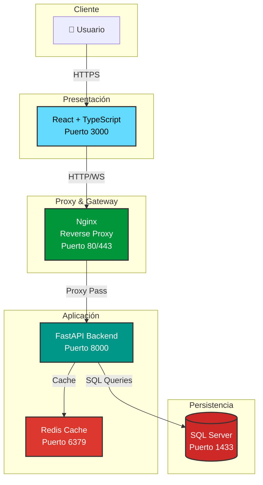
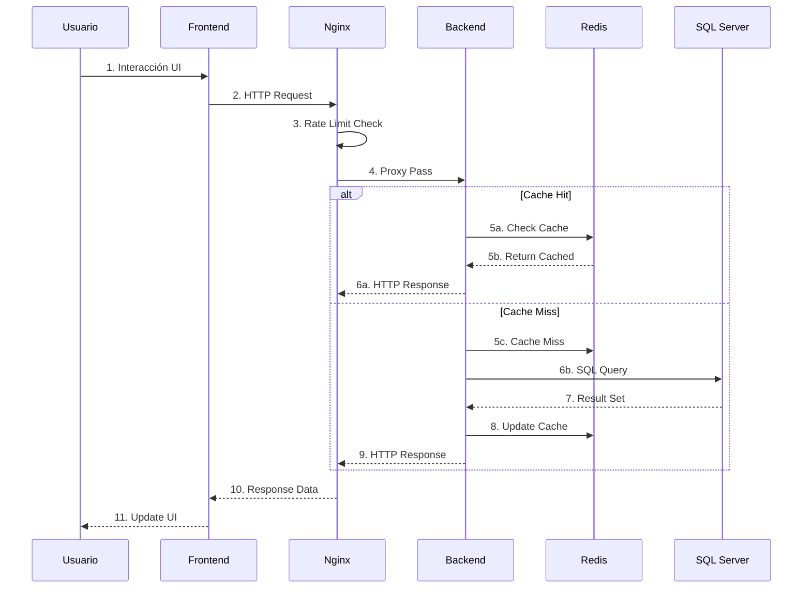
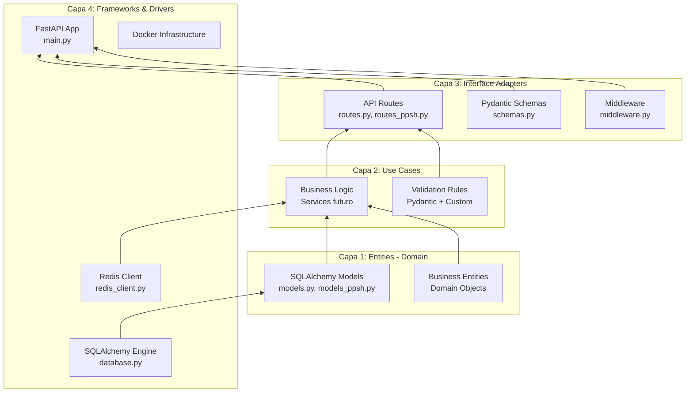

# 1. Arquitectura del Sistema

Visión general de la arquitectura, componentes y patrones de diseño del Sistema de Gestión de Trámites Migratorios.

---

## 1.1 Visión General

El sistema sigue una arquitectura de **microservicios** con separación clara de responsabilidades basada en los principios de **Clean Architecture**.

### Diagrama de Arquitectura General



---

## 1.2 Componentes Principales

### Frontend - React + TypeScript

!!! info "Aplicación Web Cliente"
    **Puerto**: 3000 (desarrollo) / 80,443 (producción vía Nginx)  
    **Framework**: React 18 con Vite  
    **Lenguaje**: TypeScript 5.0+
    
    **Tecnologías clave**:
    
    - **UI**: CSS Modules, componentes modulares
    - **Estado**: Context API de React
    - **Routing**: React Router v6
    - **HTTP**: Axios para comunicación con API
    - **Build**: Vite para bundle optimizado

**Estructura del proyecto**:
```
frontend/
├── src/
│   ├── components/        # Componentes reutilizables
│   ├── pages/             # Páginas/vistas principales
│   ├── context/           # Context providers (estado global)
│   ├── services/          # Servicios API
│   ├── hooks/             # Custom hooks
│   ├── utils/             # Utilidades
│   └── App.tsx            # Componente raíz
├── public/                # Assets estáticos
└── package.json
```

### Backend - FastAPI + Python

!!! info "Servidor API REST"
    **Puerto**: 8000  
    **Framework**: FastAPI 0.104+  
    **Lenguaje**: Python 3.11+
    
    **Tecnologías clave**:
    
    - **ORM**: SQLAlchemy 2.0 (async compatible)
    - **Validación**: Pydantic v2 para schemas
    - **Auth**: JWT (futuro), actualmente sin auth
    - **ASGI**: Uvicorn como servidor
    - **Documentación**: OpenAPI/Swagger automático

**Estructura del proyecto**:
```
backend/
├── app/
│   ├── main.py               # Aplicación FastAPI principal
│   ├── config.py             # Configuración global
│   ├── database.py           # Setup SQLAlchemy
│   ├── redis_client.py       # Cliente Redis
│   ├── models/               # Modelos SQLAlchemy
│   │   ├── models.py         # Trámites base
│   │   ├── models_ppsh.py    # Módulo PPSH
│   │   └── models_workflow.py # Módulo Workflows
│   ├── schemas/              # Schemas Pydantic
│   │   ├── schemas.py
│   │   ├── schemas_ppsh.py
│   │   └── schemas_workflow.py
│   ├── routes/               # Endpoints API
│   │   ├── routes.py         # Rutas trámites
│   │   ├── routes_ppsh.py    # Rutas PPSH
│   │   └── routes_workflow.py # Rutas workflows
│   └── middleware.py         # Middlewares personalizados
├── alembic/                  # Migraciones Alembic
├── tests/                    # Tests unitarios/integración
├── requirements.txt
└── pyproject.toml
```

### Base de Datos - SQL Server

!!! info "Sistema de Gestión de Base de Datos"
    **Puerto**: 1433  
    **Versión**: SQL Server 2019  
    **Driver**: pyodbc + ODBC Driver 18
    
    **Configuración**:
    
    - **Pool de conexiones**: 5 min, 20 max
    - **Timeout**: 30 segundos
    - **Collation**: Latin1_General_CI_AS
    - **Backup**: Diario a las 2:00 AM

**Módulos de datos**:

=== "Trámites Base"
    Gestión de trámites generales del sistema.
    
    - `tramites`: Tabla principal
    - Campos: id, titulo, descripcion, estado, fechas
    - Estados: pendiente, en_proceso, completado, cancelado

=== "PPSH"
    Módulo especializado para permisos humanitarios.
    
    - `PPSH_SOLICITANTE`: Datos personales
    - `PPSH_SOLICITUD`: Solicitudes PPSH
    - `PPSH_DOCUMENTO`: Documentos adjuntos
    - `PPSH_CAUSA_HUMANITARIA`: Catálogo de causas
    - `PPSH_ESTADO`: Estados del proceso
    - 6 pasos de workflow integrado

=== "Workflows"
    Sistema dinámico de flujos de trabajo.
    
    - `workflow`: Definiciones de workflows
    - `workflow_etapa`: Etapas por workflow
    - `workflow_pregunta`: Preguntas dinámicas
    - `workflow_instancia`: Instancias activas
    - `workflow_respuesta`: Respuestas de usuarios

### Caché - Redis

!!! info "Sistema de Caché en Memoria"
    **Puerto**: 6379  
    **Versión**: Redis 7-alpine  
    **Persistencia**: RDB (snapshot cada 5 minutos)
    
    **Uso**:
    
    - **Cache de consultas**: Resultados de queries frecuentes
    - **Session storage**: Sesiones de usuario (futuro)
    - **Rate limiting**: Control de tasa de requests
    - **TTL configurable**: Por endpoint

**Estrategia de caché**:

| Endpoint | TTL | Invalidación |
|----------|-----|--------------|
| `GET /tramites` | 5 min | POST/PUT/DELETE en trámites |
| `GET /ppsh/{id}` | 10 min | Actualización de solicitud |
| `GET /workflows` | 30 min | Cambios en workflow |
| `GET /catalogos` | 1 hora | Raramente cambia |

### Proxy Reverso - Nginx

!!! info "Gateway y Load Balancer"
    **Puerto**: 80 (HTTP), 443 (HTTPS)  
    **Versión**: Nginx 1.25-alpine
    
    **Funciones**:
    
    - **Reverse Proxy**: Enruta a frontend y backend
    - **SSL Termination**: Maneja HTTPS
    - **Load Balancing**: Distribuye carga (Blue-Green)
    - **Rate Limiting**: 100 req/min por IP
    - **Static Files**: Sirve assets optimizados

**Configuración de rutas**:
```nginx
location / {
    # Frontend - React app
    proxy_pass http://frontend:3000;
}

location /api/ {
    # Backend - FastAPI
    proxy_pass http://backend:8000/;
    
    # Rate limiting
    limit_req zone=api_limit burst=20;
}

location /docs {
    # API Documentation
    proxy_pass http://backend:8000/docs;
}
```

---

## 1.3 Flujo de Datos

### Flujo de una Petición Típica



### Descripción del Flujo

!!! example "Paso a Paso"
    **1. Interacción del Usuario**
    
    - Usuario hace clic en botón o navega
    - React actualiza estado local
    - Trigger de llamada a API
    
    **2. Request Frontend → Nginx**
    
    - Axios envía HTTP request
    - Headers: Content-Type, Authorization (futuro)
    - URL: `/api/tramites`, `/api/ppsh/{id}`, etc.
    
    **3. Rate Limiting (Nginx)**
    
    - Verifica IP en zona de rate limit
    - Si excede: 429 Too Many Requests
    - Si OK: continua al backend
    
    **4. Proxy Pass a Backend**
    
    - Nginx reescribe URL (`/api/` → `/`)
    - Agrega headers: X-Real-IP, X-Forwarded-For
    - Timeout: 60 segundos
    
    **5. Cache Lookup (Backend → Redis)**
    
    - Backend genera cache key: `{endpoint}:{params}`
    - Busca en Redis con GET
    - Si existe y no expiró: retorna cached
    
    **6. Query Database (si cache miss)**
    
    - SQLAlchemy genera SQL query
    - Pool de conexiones gestiona conexión
    - Ejecuta query con parámetros
    
    **7. Process Results**
    
    - Mapea result set a modelos Pydantic
    - Valida datos con schemas
    - Serializa a JSON
    
    **8. Update Cache**
    
    - Guarda resultado en Redis
    - SET con TTL apropiado
    - Formato: JSON string
    
    **9-11. Response Chain**
    
    - Backend → Nginx → Frontend → Usuario
    - Status codes apropiados
    - Headers de cache control
    - Update de UI reactivo

---

## 1.4 Clean Architecture

El backend sigue los principios de Clean Architecture con 4 capas claramente definidas:



### Descripción de Capas

=== "Capa 1: Entities (Domain)"
    **Propósito**: Modelos de dominio y entidades de negocio.
    
    **Componentes**:
    
    - `models.py`: Modelos SQLAlchemy (Tramite, Usuario)
    - `models_ppsh.py`: Entidades PPSH
    - `models_workflow.py`: Entidades de workflow
    
    **Características**:
    
    - Sin dependencias externas
    - Lógica de negocio pura
    - Representan conceptos del dominio
    
    **Ejemplo**:
    ```python
    class Tramite(Base):
        __tablename__ = "tramites"
        
        id = Column(Integer, primary_key=True)
        titulo = Column(String(255), nullable=False)
        estado = Column(String(50), default="pendiente")
        activo = Column(Boolean, default=True)
    ```

=== "Capa 2: Use Cases"
    **Propósito**: Lógica de aplicación y reglas de negocio.
    
    **Componentes** (futuro):
    
    - `services/`: Servicios de negocio
    - Validators personalizados
    - Business rules
    
    **Responsabilidades**:
    
    - Orquestar flujo de datos
    - Aplicar reglas de negocio
    - Validaciones complejas
    
    **Ejemplo futuro**:
    ```python
    class TramiteService:
        def crear_tramite(self, data: TramiteCreate):
            # Validar reglas de negocio
            if not self._validar_usuario(data.usuario_id):
                raise ValidationError("Usuario inválido")
            
            # Crear trámite
            tramite = Tramite(**data.dict())
            db.add(tramite)
            db.commit()
            
            # Notificar eventos
            self._notificar_creacion(tramite)
            
            return tramite
    ```

=== "Capa 3: Interface Adapters"
    **Propósito**: Adaptadores para comunicación externa.
    
    **Componentes**:
    
    - `routes/`: Endpoints FastAPI
    - `schemas/`: Schemas Pydantic
    - `middleware.py`: Procesamiento de requests
    
    **Características**:
    
    - Convierten datos externos a dominio
    - Validan input con Pydantic
    - Serializan output a JSON
    
    **Ejemplo**:
    ```python
    @router.post("/tramites/", response_model=TramiteResponse)
    def crear_tramite(
        tramite: TramiteCreate,
        db: Session = Depends(get_db)
    ):
        # Adapter convierte schema a modelo
        db_tramite = Tramite(**tramite.dict())
        db.add(db_tramite)
        db.commit()
        db.refresh(db_tramite)
        
        # Convierte modelo a schema de respuesta
        return TramiteResponse.from_orm(db_tramite)
    ```

=== "Capa 4: Frameworks"
    **Propósito**: Infraestructura y herramientas externas.
    
    **Componentes**:
    
    - `main.py`: Aplicación FastAPI
    - `database.py`: Engine y SessionLocal
    - `redis_client.py`: Cliente Redis
    - Docker, Nginx, etc.
    
    **Características**:
    
    - Configuración de frameworks
    - Conexiones a servicios externos
    - Infraestructura contenedorizada
    
    **Ejemplo**:
    ```python
    # main.py
    app = FastAPI(
        title="Sistema de Trámites Migratorios",
        version="1.0.0",
        docs_url="/docs",
        redoc_url="/redoc"
    )
    
    app.include_router(tramites_router, prefix="/tramites")
    app.include_router(ppsh_router, prefix="/ppsh")
    app.include_router(workflow_router, prefix="/workflows")
    ```

---

## 1.5 Patrones de Diseño

### Repository Pattern

!!! tip "Separación de Lógica de Acceso a Datos"
    Aunque actualmente usamos SQLAlchemy directamente en routes, el plan es implementar repositories:
    
    ```python
    # repositories/tramite_repository.py
    class TramiteRepository:
        def __init__(self, db: Session):
            self.db = db
        
        def get_by_id(self, tramite_id: int) -> Tramite:
            return self.db.query(Tramite).filter(
                Tramite.id == tramite_id,
                Tramite.activo == True
            ).first()
        
        def get_all(self, skip: int = 0, limit: int = 100):
            return self.db.query(Tramite).filter(
                Tramite.activo == True
            ).offset(skip).limit(limit).all()
        
        def create(self, tramite: TramiteCreate) -> Tramite:
            db_tramite = Tramite(**tramite.dict())
            self.db.add(db_tramite)
            self.db.commit()
            self.db.refresh(db_tramite)
            return db_tramite
    ```

### Dependency Injection

!!! tip "Gestión de Dependencias con FastAPI"
    FastAPI usa inyección de dependencias nativa:
    
    ```python
    # Dependencia de base de datos
    def get_db():
        db = SessionLocal()
        try:
            yield db
        finally:
            db.close()
    
    # Uso en endpoint
    @router.get("/tramites/{tramite_id}")
    def get_tramite(
        tramite_id: int,
        db: Session = Depends(get_db)  # Inyectado automáticamente
    ):
        tramite = db.query(Tramite).filter(Tramite.id == tramite_id).first()
        if not tramite:
            raise HTTPException(status_code=404)
        return tramite
    ```

### Factory Pattern

!!! tip "Creación de Objetos Complejos"
    ```python
    # factories/workflow_factory.py
    class WorkflowFactory:
        @staticmethod
        def create_ppsh_workflow(db: Session) -> Workflow:
            workflow = Workflow(
                codigo="PPSH_STANDARD",
                nombre="Proceso PPSH Estándar",
                tipo_tramite="PPSH"
            )
            
            # Crear etapas
            etapas = [
                WorkflowEtapa(orden=1, nombre="Registro Solicitante"),
                WorkflowEtapa(orden=2, nombre="Causa Humanitaria"),
                WorkflowEtapa(orden=3, nombre="Carga Documentos"),
                WorkflowEtapa(orden=4, nombre="Revisión Técnica"),
                WorkflowEtapa(orden=5, nombre="Entrevista"),
                WorkflowEtapa(orden=6, nombre="Decisión Final")
            ]
            
            workflow.etapas = etapas
            db.add(workflow)
            db.commit()
            
            return workflow
    ```

### Soft Delete Pattern

!!! tip "Eliminación Lógica de Registros"
    Todos los modelos implementan soft delete con campo `activo`:
    
    ```python
    class Tramite(Base):
        __tablename__ = "tramites"
        id = Column(Integer, primary_key=True)
        activo = Column(Boolean, default=True)  # Soft delete flag
        
        @classmethod
        def soft_delete(cls, db: Session, tramite_id: int):
            tramite = db.query(cls).filter(cls.id == tramite_id).first()
            if tramite:
                tramite.activo = False
                db.commit()
        
        @classmethod
        def get_active(cls, db: Session):
            return db.query(cls).filter(cls.activo == True).all()
    ```

---

## 1.6 Configuración de Desarrollo

### Setup Local

!!! example "Configuración Paso a Paso"
    **Prerrequisitos**:
    
    - Docker Desktop 24+
    - Git
    - Python 3.11+ (para desarrollo backend sin Docker)
    - Node.js 18+ (para desarrollo frontend sin Docker)
    
    **Pasos**:
    
    ```bash
    # 1. Clonar repositorio
    git clone https://github.com/juncid/tramites-mvp-panama.git
    cd tramites-mvp-panama
    
    # 2. Configurar variables de entorno
    cp .env.example .env
    # Editar .env con configuraciones locales
    
    # 3. Levantar servicios
    docker-compose -f docker-compose.dev.yml up -d
    
    # 4. Verificar que todos los contenedores estén running
    docker-compose ps
    
    # 5. Inicializar base de datos
    cd backend
    python init_database.py
    python load_initial_data.py
    
    # 6. Acceder a servicios
    # Frontend: http://localhost:3000
    # Backend API: http://localhost:8000
    # API Docs: http://localhost:8000/docs
    # Dozzle (logs): http://localhost:9000
    ```

### Variables de Entorno

!!! info "Archivo .env"
    ```bash
    # Database
    DB_SERVER=localhost
    DB_NAME=SIM_PANAMA
    DB_USER=sa
    DB_PASSWORD=DevP@ssw0rd2025!
    DB_PORT=1433
    
    # Redis
    REDIS_HOST=localhost
    REDIS_PORT=6379
    REDIS_DB=0
    
    # Backend
    API_PORT=8000
    DEBUG=True
    LOG_LEVEL=DEBUG
    
    # Frontend
    VITE_API_URL=http://localhost:8000
    
    # Docker
    COMPOSE_PROJECT_NAME=tramites-mvp
    ```

---

## Navegación

[← Manual Técnico](index.md) | [Inicio](../index.md) | [Base de Datos →](02-database.md)
