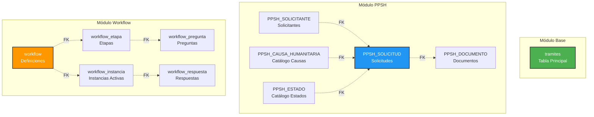
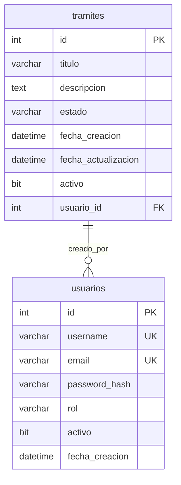
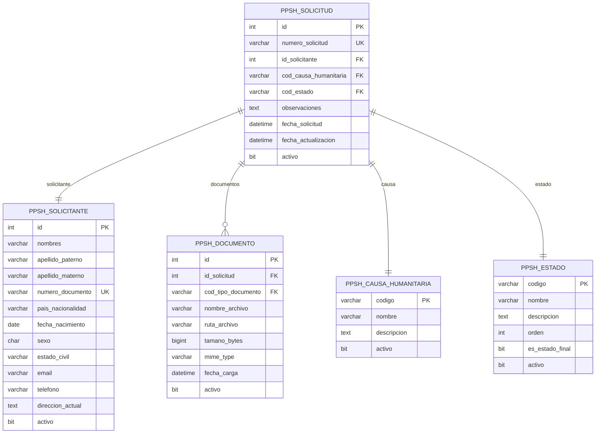
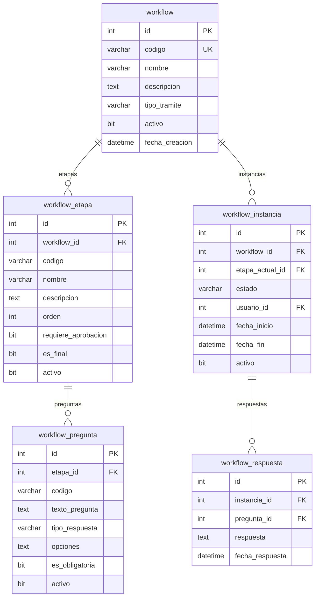

# 2. Base de Datos

Diseño, estructura y administración de la base de datos SQL Server del Sistema de Gestión de Trámites Migratorios.

---

## 2.1 Visión General

### Información General

!!! info "SQL Server 2019"
    **Motor**: SQL Server 2019 Express/Standard  
    **Puerto**: 1433  
    **Collation**: Latin1_General_CI_AS  
    **Tamaño Actual**: ~500 MB  
    **Tablas**: 30 tablas principales  
    **Backup**: Diario a las 2:00 AM

### Módulos de Base de Datos



---

## 2.2 Diagrama Entidad-Relación

### Módulo Base - Trámites



### Módulo PPSH - Permisos Humanitarios



### Módulo Workflow - Flujos Dinámicos



---

## 2.3 Diccionario de Datos

### 2.3.1 Tabla: tramites

!!! info "Tabla Principal de Trámites"
    Almacena los trámites generales del sistema.

| Columna | Tipo | Nulo | Defecto | Descripción |
|---------|------|------|---------|-------------|
| **id** | `INT` | NO | IDENTITY | Identificador único (PK) |
| **titulo** | `VARCHAR(255)` | NO | - | Título del trámite |
| **descripcion** | `TEXT` | YES | NULL | Descripción detallada |
| **estado** | `VARCHAR(50)` | NO | 'pendiente' | Estado actual del trámite |
| **fecha_creacion** | `DATETIME` | NO | GETDATE() | Fecha de creación |
| **fecha_actualizacion** | `DATETIME` | YES | NULL | Fecha de última actualización |
| **activo** | `BIT` | NO | 1 | Soft delete flag |
| **usuario_id** | `INT` | YES | NULL | ID del usuario creador (FK) |

**Índices**:

- `PK_tramites`: PRIMARY KEY CLUSTERED (id)
- `IX_tramites_estado`: NONCLUSTERED (estado) WHERE activo = 1
- `IX_tramites_fecha_creacion`: NONCLUSTERED (fecha_creacion DESC)

**Estados válidos**:

=== "Pendiente"
    Estado inicial del trámite. Requiere acción.

=== "En Proceso"
    Trámite siendo trabajado activamente.

=== "Completado"
    Trámite finalizado exitosamente.

=== "Cancelado"
    Trámite cancelado por usuario o sistema.

### 2.3.2 Tabla: PPSH_SOLICITUD

!!! info "Solicitudes de Permisos Humanitarios"
    Tabla principal del módulo PPSH para gestionar solicitudes.

| Columna | Tipo | Nulo | Defecto | Descripción |
|---------|------|------|---------|-------------|
| **id** | `INT` | NO | IDENTITY | Identificador único (PK) |
| **numero_solicitud** | `VARCHAR(50)` | NO | - | Número único de solicitud (UK) |
| **id_solicitante** | `INT` | NO | - | ID del solicitante (FK) |
| **cod_causa_humanitaria** | `VARCHAR(20)` | NO | - | Código de causa (FK) |
| **cod_estado** | `VARCHAR(20)` | NO | 'REGISTRADO' | Estado actual (FK) |
| **observaciones** | `TEXT` | YES | NULL | Observaciones del caso |
| **fecha_solicitud** | `DATETIME` | NO | GETDATE() | Fecha de registro |
| **fecha_actualizacion** | `DATETIME` | YES | NULL | Última actualización |
| **activo** | `BIT` | NO | 1 | Soft delete flag |

**Índices**:

- `PK_PPSH_SOLICITUD`: PRIMARY KEY CLUSTERED (id)
- `UK_PPSH_SOLICITUD_numero`: UNIQUE NONCLUSTERED (numero_solicitud) WHERE activo = 1
- `IX_PPSH_SOLICITUD_solicitante`: NONCLUSTERED (id_solicitante)
- `IX_PPSH_SOLICITUD_estado`: NONCLUSTERED (cod_estado) WHERE activo = 1

**Foreign Keys**:
```sql
ALTER TABLE PPSH_SOLICITUD
ADD CONSTRAINT FK_PPSH_SOLICITUD_SOLICITANTE
FOREIGN KEY (id_solicitante) REFERENCES PPSH_SOLICITANTE(id);

ALTER TABLE PPSH_SOLICITUD
ADD CONSTRAINT FK_PPSH_SOLICITUD_CAUSA
FOREIGN KEY (cod_causa_humanitaria) REFERENCES PPSH_CAUSA_HUMANITARIA(codigo);

ALTER TABLE PPSH_SOLICITUD
ADD CONSTRAINT FK_PPSH_SOLICITUD_ESTADO
FOREIGN KEY (cod_estado) REFERENCES PPSH_ESTADO(codigo);
```

### 2.3.3 Tabla: PPSH_SOLICITANTE

!!! info "Datos de Solicitantes"
    Información personal de solicitantes de PPSH.

| Columna | Tipo | Nulo | Defecto | Descripción |
|---------|------|------|---------|-------------|
| **id** | `INT` | NO | IDENTITY | Identificador único (PK) |
| **nombres** | `VARCHAR(100)` | NO | - | Nombres del solicitante |
| **apellido_paterno** | `VARCHAR(100)` | NO | - | Apellido paterno |
| **apellido_materno** | `VARCHAR(100)` | YES | NULL | Apellido materno |
| **numero_documento** | `VARCHAR(50)` | NO | - | Número de documento (UK) |
| **pais_nacionalidad** | `VARCHAR(3)` | NO | - | Código ISO de país |
| **fecha_nacimiento** | `DATE` | NO | - | Fecha de nacimiento |
| **sexo** | `CHAR(1)` | NO | - | Sexo: M/F/O |
| **estado_civil** | `VARCHAR(20)` | NO | - | Estado civil |
| **email** | `VARCHAR(255)` | YES | NULL | Email de contacto |
| **telefono** | `VARCHAR(20)` | YES | NULL | Teléfono |
| **direccion_actual** | `TEXT` | YES | NULL | Dirección actual |
| **activo** | `BIT` | NO | 1 | Soft delete flag |

**Índices**:

- `PK_PPSH_SOLICITANTE`: PRIMARY KEY CLUSTERED (id)
- `UK_PPSH_SOLICITANTE_documento`: UNIQUE NONCLUSTERED (numero_documento) WHERE activo = 1

**Validaciones**:

!!! warning "Reglas de Negocio"
    - **numero_documento**: Debe ser único por solicitante activo
    - **email**: Formato válido si se proporciona
    - **fecha_nacimiento**: Solicitante debe ser mayor de 18 años
    - **sexo**: Solo valores: 'M', 'F', 'O'

### 2.3.4 Tabla: workflow

!!! info "Definiciones de Workflows"
    Configuración de workflows dinámicos reutilizables.

| Columna | Tipo | Nulo | Defecto | Descripción |
|---------|------|------|---------|-------------|
| **id** | `INT` | NO | IDENTITY | Identificador único (PK) |
| **codigo** | `VARCHAR(50)` | NO | - | Código único del workflow (UK) |
| **nombre** | `VARCHAR(255)` | NO | - | Nombre descriptivo |
| **descripcion** | `TEXT` | YES | NULL | Descripción del workflow |
| **tipo_tramite** | `VARCHAR(50)` | NO | - | Tipo de trámite asociado |
| **activo** | `BIT` | NO | 1 | Soft delete flag |
| **fecha_creacion** | `DATETIME` | NO | GETDATE() | Fecha de creación |
| **fecha_actualizacion** | `DATETIME` | YES | NULL | Última actualización |

**Índices**:

- `PK_workflow`: PRIMARY KEY CLUSTERED (id)
- `UK_workflow_codigo`: UNIQUE NONCLUSTERED (codigo) WHERE activo = 1
- `IX_workflow_tipo_tramite`: NONCLUSTERED (tipo_tramite) WHERE activo = 1

**Tipos de Trámite Soportados**:

| Código | Nombre | Módulo |
|--------|--------|--------|
| `PPSH` | Permiso Protección Humanitaria | PPSH |
| `VISA` | Solicitud de Visa | Trámites |
| `RESIDENCIA` | Residencia Temporal/Permanente | Trámites |
| `NATURALIZACION` | Naturalización | Trámites |

### 2.3.5 Tabla: workflow_etapa

!!! info "Etapas de Workflows"
    Pasos secuenciales dentro de un workflow.

| Columna | Tipo | Nulo | Defecto | Descripción |
|---------|------|------|---------|-------------|
| **id** | `INT` | NO | IDENTITY | Identificador único (PK) |
| **workflow_id** | `INT` | NO | - | ID del workflow padre (FK) |
| **codigo** | `VARCHAR(50)` | NO | - | Código de la etapa |
| **nombre** | `VARCHAR(255)` | NO | - | Nombre de la etapa |
| **descripcion** | `TEXT` | YES | NULL | Descripción de la etapa |
| **orden** | `INT` | NO | - | Orden de ejecución (1, 2, 3...) |
| **requiere_aprobacion** | `BIT` | NO | 0 | Si requiere aprobación manual |
| **es_final** | `BIT` | NO | 0 | Si es la etapa final |
| **activo** | `BIT` | NO | 1 | Soft delete flag |

**Índices**:

- `PK_workflow_etapa`: PRIMARY KEY CLUSTERED (id)
- `IX_workflow_etapa_workflow`: NONCLUSTERED (workflow_id, orden)

**Foreign Keys**:
```sql
ALTER TABLE workflow_etapa
ADD CONSTRAINT FK_workflow_etapa_workflow
FOREIGN KEY (workflow_id) REFERENCES workflow(id)
ON DELETE CASCADE;
```

### 2.3.6 Tabla: workflow_pregunta

!!! info "Preguntas Dinámicas"
    Preguntas configurables por etapa para captura de información.

| Columna | Tipo | Nulo | Defecto | Descripción |
|---------|------|------|---------|-------------|
| **id** | `INT` | NO | IDENTITY | Identificador único (PK) |
| **etapa_id** | `INT` | NO | - | ID de la etapa (FK) |
| **codigo** | `VARCHAR(50)` | NO | - | Código de la pregunta |
| **texto_pregunta** | `TEXT` | NO | - | Texto de la pregunta |
| **tipo_respuesta** | `VARCHAR(20)` | NO | - | Tipo de respuesta esperada |
| **opciones** | `TEXT` | YES | NULL | Opciones para select (sep. por \|) |
| **es_obligatoria** | `BIT` | NO | 1 | Si es obligatorio responder |
| **activo** | `BIT` | NO | 1 | Soft delete flag |

**Tipos de Respuesta**:

=== "text"
    Texto libre corto (input).
    ```json
    {
      "tipo_respuesta": "text",
      "opciones": null
    }
    ```

=== "textarea"
    Texto libre largo (textarea).
    ```json
    {
      "tipo_respuesta": "textarea",
      "opciones": null
    }
    ```

=== "select"
    Lista desplegable con opciones.
    ```json
    {
      "tipo_respuesta": "select",
      "opciones": "Opción 1|Opción 2|Opción 3"
    }
    ```

=== "checkbox"
    Casillas de verificación múltiples.
    ```json
    {
      "tipo_respuesta": "checkbox",
      "opciones": "Item 1|Item 2|Item 3"
    }
    ```

=== "radio"
    Botones de opción única.
    ```json
    {
      "tipo_respuesta": "radio",
      "opciones": "Si|No"
    }
    ```

=== "date"
    Selector de fecha.
    ```json
    {
      "tipo_respuesta": "date",
      "opciones": null
    }
    ```

=== "file"
    Carga de archivo.
    ```json
    {
      "tipo_respuesta": "file",
      "opciones": ".pdf,.jpg,.png"
    }
    ```

---

## 2.4 Scripts de Inicialización

### 2.4.1 Orden de Ejecución

!!! tip "Orden de Creación de Tablas"
    **Ubicación**: `backend/init_database.py`
    
    **Orden de ejecución**:
    
    1. **Catálogos** (sin FK)
       - PPSH_CAUSA_HUMANITARIA
       - PPSH_ESTADO
       - PPSH_TIPO_DOCUMENTO
       - PPSH_CONCEPTO_PAGO
    
    2. **Tablas de Seguridad**
       - usuarios
       - roles
       - permisos
    
    3. **Tablas Principales**
       - tramites
       - PPSH_SOLICITANTE
       - PPSH_SOLICITUD
       - workflow
    
    4. **Tablas Relacionadas**
       - PPSH_DOCUMENTO
       - workflow_etapa
       - workflow_pregunta
       - workflow_instancia
       - workflow_respuesta
    
    5. **Índices**
       - PRIMARY KEYS (automáticos)
       - UNIQUE constraints
       - FOREIGN KEYS
       - Índices de performance
    
    6. **Datos Iniciales**
       - Catálogos PPSH
       - Usuario admin
       - Workflow demo

### 2.4.2 Script de Inicialización

```python
# backend/init_database.py
from sqlalchemy import create_engine, text
from app.config import settings
from app.database import Base, engine
from app.models import models, models_ppsh, models_workflow
import logging

logger = logging.getLogger(__name__)

def init_database():
    """Inicializa la base de datos completa"""
    try:
        logger.info("Iniciando creación de base de datos...")
        
        # Crear todas las tablas
        Base.metadata.create_all(bind=engine)
        logger.info("✅ Tablas creadas exitosamente")
        
        # Cargar datos iniciales
        load_initial_data()
        logger.info("✅ Datos iniciales cargados")
        
        logger.info("🎉 Base de datos inicializada correctamente")
        
    except Exception as e:
        logger.error(f"❌ Error inicializando base de datos: {str(e)}")
        raise

def load_initial_data():
    """Carga datos iniciales de catálogos"""
    from app.database import SessionLocal
    
    db = SessionLocal()
    try:
        # Cargar catálogo de causas humanitarias
        causas = [
            {"codigo": "CONF_ARM", "nombre": "Conflicto Armado", 
             "descripcion": "Persona afectada por conflicto armado"},
            {"codigo": "VIOLENCIA", "nombre": "Violencia Generalizada",
             "descripcion": "Situación de violencia generalizada"},
            # ... más causas
        ]
        
        for causa in causas:
            db.execute(text("""
                IF NOT EXISTS (SELECT 1 FROM PPSH_CAUSA_HUMANITARIA WHERE codigo = :codigo)
                INSERT INTO PPSH_CAUSA_HUMANITARIA (codigo, nombre, descripcion, activo)
                VALUES (:codigo, :nombre, :descripcion, 1)
            """), causa)
        
        db.commit()
        logger.info("✅ Catálogos cargados")
        
    finally:
        db.close()

if __name__ == "__main__":
    init_database()
```

---

## 2.5 Backup y Restore

### 2.5.1 Backup Manual

#### PowerShell (Windows)

```powershell
# Backup completo
sqlcmd -S localhost -U sa -P "YourPassword" -Q "BACKUP DATABASE SIM_PANAMA TO DISK = 'C:\Backups\SIM_PANAMA_$(Get-Date -Format 'yyyyMMdd_HHmmss').bak' WITH COMPRESSION, STATS = 10"
```

#### Bash (Linux/Docker)

```bash
# Backup desde contenedor Docker
docker exec sqlserver /opt/mssql-tools/bin/sqlcmd \
  -S localhost -U sa -P "YourPassword" \
  -Q "BACKUP DATABASE SIM_PANAMA TO DISK = '/var/opt/mssql/backup/SIM_PANAMA_$(date +%Y%m%d_%H%M%S).bak' WITH COMPRESSION, STATS = 10"

# Copiar backup al host
docker cp sqlserver:/var/opt/mssql/backup/SIM_PANAMA_20250122_143000.bak ./backups/
```

### 2.5.2 Backup Automatizado

#### SQL Server Agent Job

!!! tip "Backup Diario Automático"
    **Configuración**: Backup completo diario a las 2:00 AM con compresión y retención de 7 días.

```sql
USE msdb;
GO

-- Crear Job de Backup
EXEC sp_add_job
    @job_name = N'SIM_PANAMA_Daily_Backup',
    @enabled = 1,
    @description = N'Backup diario de la base de datos SIM_PANAMA';

-- Agregar Step de Backup
EXEC sp_add_jobstep
    @job_name = N'SIM_PANAMA_Daily_Backup',
    @step_name = N'Backup Database',
    @subsystem = N'TSQL',
    @command = N'
        DECLARE @backupPath NVARCHAR(500)
        DECLARE @fileName NVARCHAR(500)
        DECLARE @date VARCHAR(20)
        
        SET @date = CONVERT(VARCHAR(20), GETDATE(), 112) + ''_'' + REPLACE(CONVERT(VARCHAR(20), GETDATE(), 108), '':'', '''')
        SET @fileName = ''SIM_PANAMA_'' + @date + ''.bak''
        SET @backupPath = ''C:\Backups\'' + @fileName
        
        -- Backup con compresión
        BACKUP DATABASE SIM_PANAMA
        TO DISK = @backupPath
        WITH COMPRESSION, 
             CHECKSUM,
             STATS = 10,
             DESCRIPTION = ''Backup automático diario''
        
        -- Limpiar backups antiguos (7 días)
        EXECUTE master.dbo.xp_delete_file 0, N''C:\Backups'', N''bak'', N''2025-01-15T00:00:00'', 0
    ',
    @retry_attempts = 3,
    @retry_interval = 5;

-- Configurar Schedule (Diario 2:00 AM)
EXEC sp_add_jobschedule
    @job_name = N'SIM_PANAMA_Daily_Backup',
    @name = N'Daily_2AM',
    @freq_type = 4,  -- Diario
    @freq_interval = 1,
    @active_start_time = 020000;  -- 02:00:00 AM

-- Asignar Job al servidor local
EXEC sp_add_jobserver
    @job_name = N'SIM_PANAMA_Daily_Backup',
    @server_name = N'(LOCAL)';
GO
```

#### Docker Compose Backup Service

```yaml
# docker-compose.backup.yml
services:
  sqlserver-backup:
    image: mcr.microsoft.com/mssql/server:2019-latest
    environment:
      - ACCEPT_EULA=Y
      - MSSQL_SA_PASSWORD=${DB_PASSWORD}
    volumes:
      - ./backups:/backup
      - ./scripts/backup.sh:/backup.sh
    command: /bin/bash -c "while true; do /backup.sh; sleep 86400; done"
    depends_on:
      - sqlserver
```

**Script de Backup** (`scripts/backup.sh`):
```bash
#!/bin/bash
DATE=$(date +%Y%m%d_%H%M%S)
BACKUP_FILE="/backup/SIM_PANAMA_${DATE}.bak"

echo "🔄 Iniciando backup: $BACKUP_FILE"

/opt/mssql-tools/bin/sqlcmd -S sqlserver -U sa -P "$MSSQL_SA_PASSWORD" -Q "
BACKUP DATABASE SIM_PANAMA
TO DISK = '$BACKUP_FILE'
WITH COMPRESSION, STATS = 10
"

if [ $? -eq 0 ]; then
    echo "✅ Backup completado exitosamente"
    
    # Eliminar backups antiguos (7 días)
    find /backup -name "SIM_PANAMA_*.bak" -mtime +7 -delete
    echo "🧹 Backups antiguos eliminados"
else
    echo "❌ Error en backup"
    exit 1
fi
```

### 2.5.3 Restore de Base de Datos

#### Restore Completo

```sql
-- Desconectar usuarios activos
USE master;
GO

ALTER DATABASE SIM_PANAMA SET SINGLE_USER WITH ROLLBACK IMMEDIATE;
GO

-- Restore del backup
RESTORE DATABASE SIM_PANAMA
FROM DISK = 'C:\Backups\SIM_PANAMA_20250122_020000.bak'
WITH REPLACE,
     STATS = 10;
GO

-- Reconectar usuarios
ALTER DATABASE SIM_PANAMA SET MULTI_USER;
GO
```

#### Restore desde Docker

```bash
# Copiar backup al contenedor
docker cp ./backups/SIM_PANAMA_20250122_020000.bak sqlserver:/var/opt/mssql/backup/

# Ejecutar restore
docker exec sqlserver /opt/mssql-tools/bin/sqlcmd \
  -S localhost -U sa -P "YourPassword" \
  -Q "
    USE master;
    ALTER DATABASE SIM_PANAMA SET SINGLE_USER WITH ROLLBACK IMMEDIATE;
    RESTORE DATABASE SIM_PANAMA FROM DISK = '/var/opt/mssql/backup/SIM_PANAMA_20250122_020000.bak' WITH REPLACE, STATS = 10;
    ALTER DATABASE SIM_PANAMA SET MULTI_USER;
  "
```

---

## 2.6 Mantenimiento y Optimización

### 2.6.1 Actualización de Estadísticas

```sql
-- Actualizar estadísticas de todas las tablas
USE SIM_PANAMA;
GO

EXEC sp_updatestats;
GO

-- Actualizar estadísticas con full scan
UPDATE STATISTICS tramites WITH FULLSCAN;
UPDATE STATISTICS PPSH_SOLICITUD WITH FULLSCAN;
UPDATE STATISTICS workflow WITH FULLSCAN;
```

### 2.6.2 Rebuild de Índices

```sql
-- Rebuild de todos los índices con fragmentación > 30%
USE SIM_PANAMA;
GO

DECLARE @TableName VARCHAR(255)
DECLARE @sql NVARCHAR(500)

DECLARE TableCursor CURSOR FOR
SELECT DISTINCT t.name
FROM sys.tables t
WHERE t.is_ms_shipped = 0

OPEN TableCursor
FETCH NEXT FROM TableCursor INTO @TableName

WHILE @@FETCH_STATUS = 0
BEGIN
    SET @sql = 'ALTER INDEX ALL ON ' + @TableName + ' REBUILD WITH (ONLINE = OFF)'
    EXEC sp_executesql @sql
    PRINT 'Rebuilt indexes on ' + @TableName
    
    FETCH NEXT FROM TableCursor INTO @TableName
END

CLOSE TableCursor
DEALLOCATE TableCursor
```

### 2.6.3 Limpieza de Logs

```sql
-- Shrink del transaction log
USE SIM_PANAMA;
GO

-- Checkpoint
CHECKPOINT;
GO

-- Backup del log
BACKUP LOG SIM_PANAMA TO DISK = 'NUL';
GO

-- Shrink del log file
DBCC SHRINKFILE (SIM_PANAMA_log, 100);  -- 100 MB
GO
```

---

## Navegación

[← Arquitectura](01-arquitectura.md) | [Manual Técnico](index.md) | [Backend →](03-backend.md)
