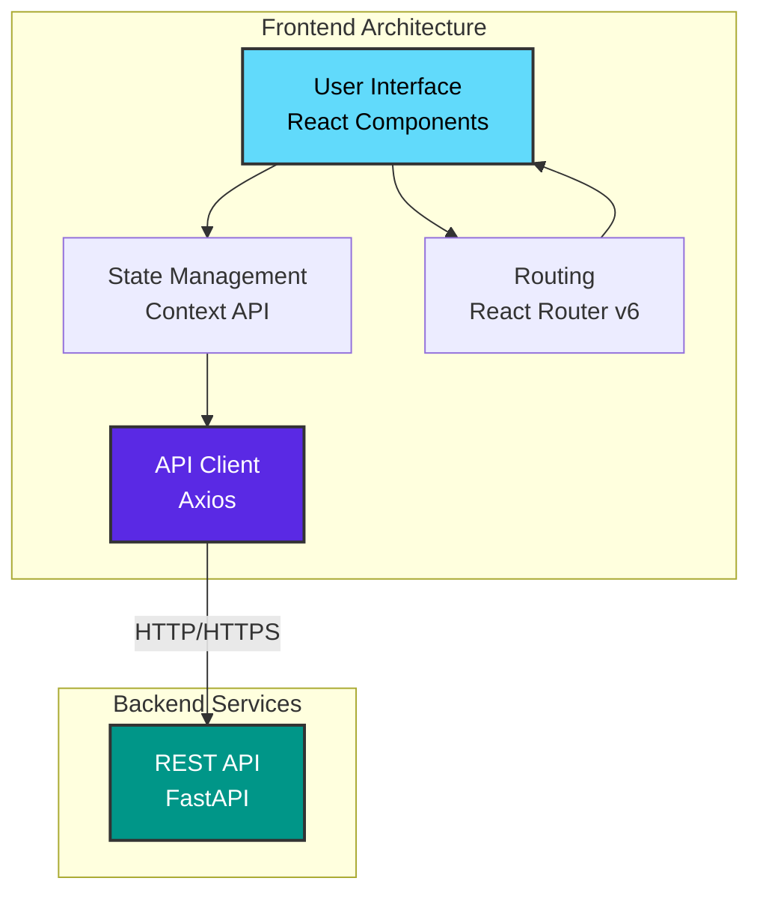

# 4. Frontend - Aplicación Web

Documentación completa del frontend React + TypeScript incluyendo estructura, componentes, servicios API y patrones de diseño.

---

## 4.1 Visión General

### Stack Tecnológico

!!! info "React 18 + TypeScript + Vite"
    **Puerto**: 3000 (desarrollo) / 80,443 (producción vía Nginx)  
    **Framework UI**: React 18.2+  
    **Lenguaje**: TypeScript 5.0+  
    **Build Tool**: Vite 4.5+  
    **Estilo**: CSS Modules

### Características Principales



**Features**:

- ✅ **SPA (Single Page Application)**: Navegación fluida sin recargas
- ✅ **TypeScript**: Tipado estático para mejor mantenibilidad
- ✅ **Component-Based**: Arquitectura modular y reutilizable
- ✅ **Responsive Design**: Adaptable a dispositivos móviles y desktop
- ✅ **Hot Module Replacement**: Desarrollo rápido con Vite
- ✅ **Code Splitting**: Carga optimizada de módulos

---

## 4.2 Estructura del Proyecto

### Árbol de Directorios

```
frontend/
├── public/                       # Assets estáticos
│   ├── index.html                # HTML base
│   ├── favicon.ico               # Icono del sitio
│   └── assets/                   # Imágenes, fonts, etc.
│       ├── logo.png
│       └── images/
│
├── src/                          # Código fuente
│   ├── api/                      # Cliente API y servicios
│   │   ├── axios.ts              # Configuración Axios
│   │   ├── tramites.ts           # Servicio de trámites
│   │   ├── ppsh.ts               # Servicio PPSH
│   │   ├── workflow.ts           # Servicio workflows
│   │   └── types.ts              # Tipos TypeScript para API
│   │
│   ├── components/               # Componentes React
│   │   ├── common/               # Componentes reutilizables
│   │   │   ├── Button/
│   │   │   │   ├── Button.tsx
│   │   │   │   └── Button.module.css
│   │   │   ├── Input/
│   │   │   │   ├── Input.tsx
│   │   │   │   └── Input.module.css
│   │   │   ├── Modal/
│   │   │   ├── Card/
│   │   │   ├── Table/
│   │   │   └── Spinner/
│   │   │
│   │   ├── tramites/             # Componentes de trámites
│   │   │   ├── TramitesList.tsx
│   │   │   ├── TramiteForm.tsx
│   │   │   └── TramiteDetail.tsx
│   │   │
│   │   ├── ppsh/                 # Componentes PPSH
│   │   │   ├── PPSHForm.tsx
│   │   │   ├── SolicitanteForm.tsx
│   │   │   ├── DocumentUpload.tsx
│   │   │   └── SolicitudList.tsx
│   │   │
│   │   └── workflow/             # Componentes workflow
│   │       ├── WorkflowStepper.tsx
│   │       ├── EtapaCard.tsx
│   │       └── PreguntaInput.tsx
│   │
│   ├── pages/                    # Páginas/Vistas principales
│   │   ├── Home.tsx              # Landing page
│   │   ├── Tramites.tsx          # Gestión de trámites
│   │   ├── PPSH/
│   │   │   ├── PPSHList.tsx
│   │   │   ├── PPSHCreate.tsx
│   │   │   └── PPSHDetail.tsx
│   │   ├── Workflow.tsx          # Workflows
│   │   ├── Login.tsx             # Login (futuro)
│   │   └── NotFound.tsx          # 404 page
│   │
│   ├── contexts/                 # Context API para estado global
│   │   ├── AuthContext.tsx       # Autenticación
│   │   ├── AppContext.tsx        # Estado global de app
│   │   └── NotificationContext.tsx  # Notificaciones
│   │
│   ├── hooks/                    # Custom React Hooks
│   │   ├── useAuth.ts            # Hook de autenticación
│   │   ├── useTramites.ts        # Hook de trámites
│   │   ├── usePPSH.ts            # Hook PPSH
│   │   ├── useWorkflow.ts        # Hook workflows
│   │   └── useApi.ts             # Hook genérico para API
│   │
│   ├── utils/                    # Utilidades
│   │   ├── format.ts             # Formateo de datos
│   │   ├── validation.ts         # Validaciones
│   │   ├── constants.ts          # Constantes
│   │   └── helpers.ts            # Funciones helper
│   │
│   ├── types/                    # Tipos TypeScript
│   │   ├── tramites.ts
│   │   ├── ppsh.ts
│   │   └── workflow.ts
│   │
│   ├── styles/                   # Estilos globales
│   │   ├── global.css            # Estilos globales
│   │   ├── variables.css         # Variables CSS
│   │   └── reset.css             # CSS reset
│   │
│   ├── App.tsx                   # Componente raíz
│   ├── App.css                   # Estilos del App
│   ├── main.tsx                  # Entry point
│   └── vite-env.d.ts             # Tipos de Vite
│
├── .env                          # Variables de entorno
├── .env.example                  # Ejemplo de .env
├── package.json                  # Dependencias npm
├── tsconfig.json                 # Configuración TypeScript
├── vite.config.ts                # Configuración Vite
├── Dockerfile                    # Imagen Docker
└── README.md                     # Documentación
```

---

## 4.3 Configuración de Proyecto

### package.json

```json
{
  "name": "tramites-frontend",
  "version": "1.0.0",
  "type": "module",
  "scripts": {
    "dev": "vite",
    "build": "tsc && vite build",
    "preview": "vite preview",
    "lint": "eslint . --ext ts,tsx --report-unused-disable-directives --max-warnings 0",
    "format": "prettier --write \"src/**/*.{ts,tsx,css}\""
  },
  "dependencies": {
    "react": "^18.2.0",
    "react-dom": "^18.2.0",
    "react-router-dom": "^6.20.0",
    "axios": "^1.6.0"
  },
  "devDependencies": {
    "@types/react": "^18.2.37",
    "@types/react-dom": "^18.2.15",
    "@typescript-eslint/eslint-plugin": "^6.10.0",
    "@typescript-eslint/parser": "^6.10.0",
    "@vitejs/plugin-react": "^4.2.0",
    "eslint": "^8.53.0",
    "eslint-plugin-react-hooks": "^4.6.0",
    "eslint-plugin-react-refresh": "^0.4.4",
    "typescript": "^5.2.2",
    "vite": "^5.0.0"
  }
}
```

### tsconfig.json

```json
{
  "compilerOptions": {
    "target": "ES2020",
    "useDefineForClassFields": true,
    "lib": ["ES2020", "DOM", "DOM.Iterable"],
    "module": "ESNext",
    "skipLibCheck": true,

    /* Bundler mode */
    "moduleResolution": "bundler",
    "allowImportingTsExtensions": true,
    "resolveJsonModule": true,
    "isolatedModules": true,
    "noEmit": true,
    "jsx": "react-jsx",

    /* Linting */
    "strict": true,
    "noUnusedLocals": true,
    "noUnusedParameters": true,
    "noFallthroughCasesInSwitch": true,

    /* Path mapping */
    "baseUrl": ".",
    "paths": {
      "@/*": ["src/*"],
      "@/components/*": ["src/components/*"],
      "@/api/*": ["src/api/*"],
      "@/utils/*": ["src/utils/*"],
      "@/types/*": ["src/types/*"]
    }
  },
  "include": ["src"],
  "references": [{ "path": "./tsconfig.node.json" }]
}
```

### vite.config.ts

```typescript
import { defineConfig } from 'vite'
import react from '@vitejs/plugin-react'
import path from 'path'

// https://vitejs.dev/config/
export default defineConfig({
  plugins: [react()],
  
  resolve: {
    alias: {
      '@': path.resolve(__dirname, './src'),
      '@/components': path.resolve(__dirname, './src/components'),
      '@/api': path.resolve(__dirname, './src/api'),
      '@/utils': path.resolve(__dirname, './src/utils'),
      '@/types': path.resolve(__dirname, './src/types'),
    },
  },
  
  server: {
    port: 3000,
    host: true,
    proxy: {
      '/api': {
        target: 'http://localhost:8000',
        changeOrigin: true,
      },
    },
  },
  
  build: {
    outDir: 'dist',
    sourcemap: true,
    rollupOptions: {
      output: {
        manualChunks: {
          'react-vendor': ['react', 'react-dom'],
          'router': ['react-router-dom'],
        },
      },
    },
  },
})
```

### Variables de Entorno

```bash
# .env
VITE_API_URL=http://localhost:8000
VITE_APP_NAME=Sistema de Trámites Migratorios
VITE_APP_VERSION=1.0.0
```

---

## 4.4 Cliente API

### Configuración de Axios

```typescript
// src/api/axios.ts
import axios, { AxiosError, AxiosRequestConfig } from 'axios';

const API_URL = import.meta.env.VITE_API_URL || 'http://localhost:8000';

// Crear instancia de Axios
const api = axios.create({
  baseURL: API_URL,
  timeout: 30000,
  headers: {
    'Content-Type': 'application/json',
  },
});

// Interceptor de Request - Agregar token
api.interceptors.request.use(
  (config: AxiosRequestConfig) => {
    const token = localStorage.getItem('token');
    
    if (token && config.headers) {
      config.headers.Authorization = `Bearer ${token}`;
    }
    
    console.log(`→ ${config.method?.toUpperCase()} ${config.url}`);
    
    return config;
  },
  (error: AxiosError) => {
    console.error('❌ Request error:', error);
    return Promise.reject(error);
  }
);

// Interceptor de Response - Manejo de errores
api.interceptors.response.use(
  (response) => {
    console.log(`✅ ${response.config.url} - ${response.status}`);
    return response;
  },
  (error: AxiosError) => {
    if (error.response) {
      // Error de respuesta del servidor
      const status = error.response.status;
      
      switch (status) {
        case 401:
          console.error('🔒 No autorizado - Redirigiendo a login');
          localStorage.removeItem('token');
          window.location.href = '/login';
          break;
          
        case 403:
          console.error('⛔ Acceso denegado');
          break;
          
        case 404:
          console.error('🔍 Recurso no encontrado');
          break;
          
        case 500:
          console.error('💥 Error interno del servidor');
          break;
          
        default:
          console.error(`❌ Error ${status}:`, error.response.data);
      }
    } else if (error.request) {
      // Request enviado pero sin respuesta
      console.error('📡 Sin respuesta del servidor');
    } else {
      // Error configurando el request
      console.error('⚙️ Error en configuración:', error.message);
    }
    
    return Promise.reject(error);
  }
);

export default api;
```

### Servicio de Trámites

```typescript
// src/api/tramites.ts
import api from './axios';
import { Tramite, TramiteCreate, TramiteUpdate } from '@/types/tramites';

export interface TramitesResponse {
  total: number;
  skip: number;
  limit: number;
  items: Tramite[];
}

export const tramitesApi = {
  /**
   * Listar trámites con paginación
   */
  async list(skip = 0, limit = 100, estado?: string): Promise<TramitesResponse> {
    const params = new URLSearchParams({
      skip: skip.toString(),
      limit: limit.toString(),
    });
    
    if (estado) {
      params.append('estado', estado);
    }
    
    const response = await api.get<TramitesResponse>(`/api/v1/tramites?${params}`);
    return response.data;
  },

  /**
   * Obtener trámite por ID
   */
  async get(id: number): Promise<Tramite> {
    const response = await api.get<Tramite>(`/api/v1/tramites/${id}`);
    return response.data;
  },

  /**
   * Crear nuevo trámite
   */
  async create(tramite: TramiteCreate): Promise<Tramite> {
    const response = await api.post<Tramite>('/api/v1/tramites', tramite);
    return response.data;
  },

  /**
   * Actualizar trámite existente
   */
  async update(id: number, tramite: TramiteUpdate): Promise<Tramite> {
    const response = await api.put<Tramite>(`/api/v1/tramites/${id}`, tramite);
    return response.data;
  },

  /**
   * Eliminar trámite (soft delete)
   */
  async delete(id: number): Promise<void> {
    await api.delete(`/api/v1/tramites/${id}`);
  },
};
```

### Servicio PPSH

```typescript
// src/api/ppsh.ts
import api from './axios';
import { 
  PPSHSolicitud, 
  PPSHSolicitudCreate,
  CausaHumanitaria,
  TipoDocumento,
  Estado 
} from '@/types/ppsh';

export const ppshApi = {
  // ===== Catálogos =====
  
  /**
   * Obtener causas humanitarias
   */
  async getCausasHumanitarias(): Promise<CausaHumanitaria[]> {
    const response = await api.get<CausaHumanitaria[]>('/api/v1/ppsh/causas-humanitarias');
    return response.data;
  },

  /**
   * Obtener tipos de documento
   */
  async getTiposDocumento(): Promise<TipoDocumento[]> {
    const response = await api.get<TipoDocumento[]>('/api/v1/ppsh/tipos-documento');
    return response.data;
  },

  /**
   * Obtener estados
   */
  async getEstados(): Promise<Estado[]> {
    const response = await api.get<Estado[]>('/api/v1/ppsh/estados');
    return response.data;
  },

  // ===== Solicitudes =====
  
  /**
   * Listar solicitudes
   */
  async listSolicitudes(skip = 0, limit = 100): Promise<PPSHSolicitud[]> {
    const response = await api.get<PPSHSolicitud[]>(
      `/api/v1/ppsh/solicitudes?skip=${skip}&limit=${limit}`
    );
    return response.data;
  },

  /**
   * Obtener solicitud por ID
   */
  async getSolicitud(id: number): Promise<PPSHSolicitud> {
    const response = await api.get<PPSHSolicitud>(`/api/v1/ppsh/solicitudes/${id}`);
    return response.data;
  },

  /**
   * Crear nueva solicitud
   */
  async createSolicitud(solicitud: PPSHSolicitudCreate): Promise<PPSHSolicitud> {
    const response = await api.post<PPSHSolicitud>('/api/v1/ppsh/solicitudes', solicitud);
    return response.data;
  },

  /**
   * Subir documento
   */
  async uploadDocumento(
    solicitudId: number, 
    file: File, 
    tipoDocumento: string
  ): Promise<any> {
    const formData = new FormData();
    formData.append('file', file);
    formData.append('cod_tipo_documento', tipoDocumento);
    
    const response = await api.post(
      `/api/v1/ppsh/solicitudes/${solicitudId}/documentos`,
      formData,
      {
        headers: {
          'Content-Type': 'multipart/form-data',
        },
      }
    );
    
    return response.data;
  },

  /**
   * Cambiar estado de solicitud
   */
  async cambiarEstado(
    solicitudId: number, 
    nuevoEstado: string, 
    comentario?: string
  ): Promise<PPSHSolicitud> {
    const response = await api.post<PPSHSolicitud>(
      `/api/v1/ppsh/solicitudes/${solicitudId}/cambiar-estado`,
      { nuevo_estado: nuevoEstado, comentario }
    );
    return response.data;
  },
};
```

---

## 4.5 Custom Hooks

### useTramites Hook

```typescript
// src/hooks/useTramites.ts
import { useState, useEffect } from 'react';
import { tramitesApi } from '@/api/tramites';
import { Tramite, TramiteCreate } from '@/types/tramites';

export const useTramites = (autoFetch = true) => {
  const [tramites, setTramites] = useState<Tramite[]>([]);
  const [loading, setLoading] = useState(false);
  const [error, setError] = useState<string | null>(null);
  const [total, setTotal] = useState(0);

  const fetchTramites = async (skip = 0, limit = 100, estado?: string) => {
    setLoading(true);
    setError(null);
    
    try {
      const response = await tramitesApi.list(skip, limit, estado);
      setTramites(response.items);
      setTotal(response.total);
    } catch (err: any) {
      setError(err.message || 'Error cargando trámites');
      console.error('Error fetching tramites:', err);
    } finally {
      setLoading(false);
    }
  };

  const createTramite = async (tramite: TramiteCreate): Promise<Tramite | null> => {
    setLoading(true);
    setError(null);
    
    try {
      const newTramite = await tramitesApi.create(tramite);
      setTramites(prev => [newTramite, ...prev]);
      return newTramite;
    } catch (err: any) {
      setError(err.message || 'Error creando trámite');
      console.error('Error creating tramite:', err);
      return null;
    } finally {
      setLoading(false);
    }
  };

  const deleteTramite = async (id: number): Promise<boolean> => {
    setLoading(true);
    setError(null);
    
    try {
      await tramitesApi.delete(id);
      setTramites(prev => prev.filter(t => t.id !== id));
      return true;
    } catch (err: any) {
      setError(err.message || 'Error eliminando trámite');
      console.error('Error deleting tramite:', err);
      return false;
    } finally {
      setLoading(false);
    }
  };

  useEffect(() => {
    if (autoFetch) {
      fetchTramites();
    }
  }, [autoFetch]);

  return {
    tramites,
    loading,
    error,
    total,
    fetchTramites,
    createTramite,
    deleteTramite,
  };
};
```

### usePPSH Hook

```typescript
// src/hooks/usePPSH.ts
import { useState, useEffect } from 'react';
import { ppshApi } from '@/api/ppsh';
import { 
  PPSHSolicitud, 
  PPSHSolicitudCreate,
  CausaHumanitaria,
  Estado 
} from '@/types/ppsh';

export const usePPSH = () => {
  const [solicitudes, setSolicitudes] = useState<PPSHSolicitud[]>([]);
  const [causas, setCausas] = useState<CausaHumanitaria[]>([]);
  const [estados, setEstados] = useState<Estado[]>([]);
  const [loading, setLoading] = useState(false);
  const [error, setError] = useState<string | null>(null);

  // Cargar catálogos
  useEffect(() => {
    const loadCatalogos = async () => {
      try {
        const [causasData, estadosData] = await Promise.all([
          ppshApi.getCausasHumanitarias(),
          ppshApi.getEstados(),
        ]);
        
        setCausas(causasData);
        setEstados(estadosData);
      } catch (err: any) {
        console.error('Error loading catalogos:', err);
      }
    };
    
    loadCatalogos();
  }, []);

  const fetchSolicitudes = async () => {
    setLoading(true);
    setError(null);
    
    try {
      const data = await ppshApi.listSolicitudes();
      setSolicitudes(data);
    } catch (err: any) {
      setError(err.message || 'Error cargando solicitudes');
    } finally {
      setLoading(false);
    }
  };

  const createSolicitud = async (
    solicitud: PPSHSolicitudCreate
  ): Promise<PPSHSolicitud | null> => {
    setLoading(true);
    setError(null);
    
    try {
      const newSolicitud = await ppshApi.createSolicitud(solicitud);
      setSolicitudes(prev => [newSolicitud, ...prev]);
      return newSolicitud;
    } catch (err: any) {
      setError(err.message || 'Error creando solicitud');
      return null;
    } finally {
      setLoading(false);
    }
  };

  const uploadDocumento = async (
    solicitudId: number,
    file: File,
    tipoDocumento: string
  ): Promise<boolean> => {
    setLoading(true);
    setError(null);
    
    try {
      await ppshApi.uploadDocumento(solicitudId, file, tipoDocumento);
      return true;
    } catch (err: any) {
      setError(err.message || 'Error subiendo documento');
      return false;
    } finally {
      setLoading(false);
    }
  };

  return {
    solicitudes,
    causas,
    estados,
    loading,
    error,
    fetchSolicitudes,
    createSolicitud,
    uploadDocumento,
  };
};
```

---

## 4.6 Componentes de Ejemplo

### Componente Button

```typescript
// src/components/common/Button/Button.tsx
import React from 'react';
import styles from './Button.module.css';

interface ButtonProps extends React.ButtonHTMLAttributes<HTMLButtonElement> {
  variant?: 'primary' | 'secondary' | 'danger';
  size?: 'small' | 'medium' | 'large';
  loading?: boolean;
  children: React.ReactNode;
}

export const Button: React.FC<ButtonProps> = ({
  variant = 'primary',
  size = 'medium',
  loading = false,
  disabled,
  children,
  className,
  ...props
}) => {
  const classNames = [
    styles.button,
    styles[variant],
    styles[size],
    loading && styles.loading,
    className,
  ]
    .filter(Boolean)
    .join(' ');

  return (
    <button
      className={classNames}
      disabled={disabled || loading}
      {...props}
    >
      {loading ? (
        <>
          <span className={styles.spinner} />
          Cargando...
        </>
      ) : (
        children
      )}
    </button>
  );
};
```

```css
/* src/components/common/Button/Button.module.css */
.button {
  padding: 0.75rem 1.5rem;
  border: none;
  border-radius: 4px;
  font-size: 1rem;
  font-weight: 500;
  cursor: pointer;
  transition: all 0.2s ease;
  display: inline-flex;
  align-items: center;
  justify-content: center;
  gap: 0.5rem;
}

.button:hover:not(:disabled) {
  transform: translateY(-2px);
  box-shadow: 0 4px 8px rgba(0, 0, 0, 0.2);
}

.button:disabled {
  opacity: 0.6;
  cursor: not-allowed;
}

.primary {
  background-color: #2196F3;
  color: white;
}

.secondary {
  background-color: #757575;
  color: white;
}

.danger {
  background-color: #F44336;
  color: white;
}

.small {
  padding: 0.5rem 1rem;
  font-size: 0.875rem;
}

.large {
  padding: 1rem 2rem;
  font-size: 1.125rem;
}

.loading {
  pointer-events: none;
}

.spinner {
  width: 16px;
  height: 16px;
  border: 2px solid currentColor;
  border-top-color: transparent;
  border-radius: 50%;
  animation: spin 0.6s linear infinite;
}

@keyframes spin {
  to {
    transform: rotate(360deg);
  }
}
```

### Componente TramitesList

```typescript
// src/components/tramites/TramitesList.tsx
import React, { useEffect } from 'react';
import { useTramites } from '@/hooks/useTramites';
import { Button } from '@/components/common/Button/Button';
import styles from './TramitesList.module.css';

export const TramitesList: React.FC = () => {
  const { tramites, loading, error, fetchTramites, deleteTramite } = useTramites();

  useEffect(() => {
    fetchTramites();
  }, []);

  const handleDelete = async (id: number) => {
    if (window.confirm('¿Eliminar este trámite?')) {
      await deleteTramite(id);
    }
  };

  if (loading) return <div className={styles.loading}>Cargando trámites...</div>;
  if (error) return <div className={styles.error}>{error}</div>;

  return (
    <div className={styles.container}>
      <div className={styles.header}>
        <h2>Mis Trámites</h2>
        <Button variant="primary">Nuevo Trámite</Button>
      </div>

      <table className={styles.table}>
        <thead>
          <tr>
            <th>ID</th>
            <th>Título</th>
            <th>Estado</th>
            <th>Fecha Creación</th>
            <th>Acciones</th>
          </tr>
        </thead>
        <tbody>
          {tramites.map((tramite) => (
            <tr key={tramite.id}>
              <td>{tramite.id}</td>
              <td>{tramite.titulo}</td>
              <td>
                <span className={`${styles.badge} ${styles[tramite.estado]}`}>
                  {tramite.estado}
                </span>
              </td>
              <td>{new Date(tramite.fecha_creacion).toLocaleDateString()}</td>
              <td>
                <Button size="small" variant="secondary">Ver</Button>
                <Button 
                  size="small" 
                  variant="danger"
                  onClick={() => handleDelete(tramite.id)}
                >
                  Eliminar
                </Button>
              </td>
            </tr>
          ))}
        </tbody>
      </table>
    </div>
  );
};
```

---

## 4.7 Routing

### Configuración de React Router

```typescript
// src/App.tsx
import { BrowserRouter, Routes, Route } from 'react-router-dom';
import { Home } from '@/pages/Home';
import { Tramites } from '@/pages/Tramites';
import { PPSHList } from '@/pages/PPSH/PPSHList';
import { PPSHCreate } from '@/pages/PPSH/PPSHCreate';
import { PPSHDetail } from '@/pages/PPSH/PPSHDetail';
import { Workflow } from '@/pages/Workflow';
import { NotFound } from '@/pages/NotFound';
import { Layout } from '@/components/Layout';

function App() {
  return (
    <BrowserRouter>
      <Layout>
        <Routes>
          <Route path="/" element={<Home />} />
          <Route path="/tramites" element={<Tramites />} />
          <Route path="/ppsh" element={<PPSHList />} />
          <Route path="/ppsh/crear" element={<PPSHCreate />} />
          <Route path="/ppsh/:id" element={<PPSHDetail />} />
          <Route path="/workflows" element={<Workflow />} />
          <Route path="*" element={<NotFound />} />
        </Routes>
      </Layout>
    </BrowserRouter>
  );
}

export default App;
```

---

## 4.8 Build y Deployment

### Build de Producción

```bash
# Instalar dependencias
npm install

# Build
npm run build

# Output en carpeta dist/
# - index.html
# - assets/
#   - index-[hash].js
#   - index-[hash].css
```

### Dockerfile

```dockerfile
# Build stage
FROM node:18-alpine AS builder

WORKDIR /app

COPY package*.json ./
RUN npm ci

COPY . .
RUN npm run build

# Production stage
FROM nginx:alpine

COPY --from=builder /app/dist /usr/share/nginx/html
COPY nginx.conf /etc/nginx/conf.d/default.conf

EXPOSE 80

CMD ["nginx", "-g", "daemon off;"]
```

---

## Navegación

[← Backend](03-backend.md) | [Manual Técnico](index.md) | [Infraestructura →](05-infraestructura.md)
