# 5. Infraestructura y Deployment

Documentación completa de la arquitectura de contenedores, Docker Compose, deployment y estrategias de escalabilidad.

---

## 5.1 Arquitectura de Contenedores

### Visión General

El sistema utiliza **Docker** y **Docker Compose** para orquestar múltiples servicios en contenedores, proporcionando:

- ✅ **Portabilidad**: Funciona igual en desarrollo, staging y producción
- ✅ **Aislamiento**: Cada servicio corre en su propio contenedor
- ✅ **Escalabilidad**: Fácil escalar servicios individuales
- ✅ **Consistencia**: Mismas versiones de dependencias en todos los entornos

### Diagrama de Contenedores


### Servicios Principales

| Servicio | Contenedor | Puerto | CPU | RAM | Descripción |
|----------|-----------|--------|-----|-----|-------------|
| **nginx** | nginx:alpine | 80, 443 | 0.5 | 512MB | Reverse proxy y SSL |
| **backend** | python:3.11-slim | 8000 | 2.0 | 4GB | API REST FastAPI |
| **frontend** | node:18-alpine | 3000 | 1.0 | 2GB | Aplicación React |
| **db** | mssql/server:2019 | 1433 | 4.0 | 8GB | Base de datos SQL Server |
| **redis** | redis:7-alpine | 6379 | 0.5 | 1GB | Caché en memoria |

---

## 5.2 Docker Compose

### Estructura de Archivos

```
tramites-mvp-panama/
├── docker-compose.yml              # Configuración base
├── config/
│   ├── docker-compose.dev.yml      # Desarrollo
│   ├── docker-compose.prod.yml     # Producción
│   ├── docker-compose.test.yml     # Testing
│   ├── docker-compose.green-blue.yml  # Blue-Green
│   └── docker-compose.switchover.yml  # Switchover
└── backend/
    ├── Dockerfile                   # Dev
    ├── Dockerfile.prod              # Producción
    └── Dockerfile.test              # Testing
```

### docker-compose.yml (Principal)

```yaml
version: '3.8'

services:
  # SQL Server Database
  db:
    image: mcr.microsoft.com/mssql/server:2019-latest
    container_name: tramites-db
    environment:
      ACCEPT_EULA: "Y"
      SA_PASSWORD: "${DB_PASSWORD}"
      MSSQL_PID: "Developer"
    ports:
      - "1433:1433"
    volumes:
      - db-data:/var/opt/mssql
    networks:
      - tramites-network
    healthcheck:
      test: /opt/mssql-tools/bin/sqlcmd -S localhost -U sa -P "$${SA_PASSWORD}" -Q "SELECT 1"
      interval: 10s
      timeout: 5s
      retries: 5
      start_period: 30s

  # Redis Cache
  redis:
    image: redis:7-alpine
    container_name: tramites-redis
    ports:
      - "6379:6379"
    volumes:
      - redis-data:/data
    networks:
      - tramites-network
    command: redis-server --appendonly yes
    healthcheck:
      test: ["CMD", "redis-cli", "ping"]
      interval: 5s
      timeout: 3s
      retries: 5

  # Backend API
  backend:
    build:
      context: ./backend
      dockerfile: Dockerfile
    container_name: tramites-backend
    environment:
      DATABASE_URL: "${DATABASE_URL}"
      REDIS_URL: "redis://redis:6379"
      SECRET_KEY: "${SECRET_KEY}"
      DEBUG: "${DEBUG:-False}"
    ports:
      - "8000:8000"
    volumes:
      - ./backend:/app
      - backend-uploads:/app/uploads
    networks:
      - tramites-network
    depends_on:
      db:
        condition: service_healthy
      redis:
        condition: service_healthy
    command: uvicorn app.main:app --host 0.0.0.0 --port 8000 --reload

  # Frontend React
  frontend:
    build:
      context: ./frontend
      dockerfile: Dockerfile
    container_name: tramites-frontend
    environment:
      VITE_API_URL: "${VITE_API_URL:-http://localhost:8000}"
    ports:
      - "3000:3000"
    volumes:
      - ./frontend:/app
      - /app/node_modules
    networks:
      - tramites-network
    depends_on:
      - backend

  # Nginx Reverse Proxy
  nginx:
    image: nginx:alpine
    container_name: tramites-nginx
    ports:
      - "80:80"
      - "443:443"
    volumes:
      - ./nginx/nginx.conf:/etc/nginx/nginx.conf
      - ./nginx/ssl:/etc/nginx/ssl
    networks:
      - tramites-network
    depends_on:
      - backend
      - frontend

networks:
  tramites-network:
    driver: bridge

volumes:
  db-data:
  redis-data:
  backend-uploads:
```

### Dockerfile del Backend

```dockerfile
FROM python:3.11-slim

# Variables de entorno
ENV PYTHONUNBUFFERED=1 \
    PYTHONDONTWRITEBYTECODE=1 \
    PIP_NO_CACHE_DIR=1

# Instalar dependencias del sistema
RUN apt-get update && apt-get install -y \
    gcc g++ unixodbc-dev curl gnupg \
    && rm -rf /var/lib/apt/lists/*

# Instalar SQL Server ODBC Driver
RUN curl https://packages.microsoft.com/keys/microsoft.asc | apt-key add - \
    && curl https://packages.microsoft.com/config/debian/11/prod.list > /etc/apt/sources.list.d/mssql-release.list \
    && apt-get update \
    && ACCEPT_EULA=Y apt-get install -y msodbcsql18 \
    && rm -rf /var/lib/apt/lists/*

WORKDIR /app

# Instalar dependencias Python
COPY requirements.txt .
RUN pip install --upgrade pip && pip install -r requirements.txt

# Copiar código
COPY . .

# Crear directorios
RUN mkdir -p uploads logs

EXPOSE 8000

HEALTHCHECK --interval=30s --timeout=10s --start-period=40s --retries=3 \
    CMD curl -f http://localhost:8000/health || exit 1

CMD ["uvicorn", "app.main:app", "--host", "0.0.0.0", "--port", "8000"]
```

### Dockerfile de Producción

```dockerfile
# Build stage
FROM python:3.11-slim AS builder

ENV PYTHONUNBUFFERED=1 \
    PYTHONDONTWRITEBYTECODE=1

RUN apt-get update && apt-get install -y \
    gcc g++ unixodbc-dev curl gnupg \
    && rm -rf /var/lib/apt/lists/*

RUN curl https://packages.microsoft.com/keys/microsoft.asc | apt-key add - \
    && curl https://packages.microsoft.com/config/debian/11/prod.list > /etc/apt/sources.list.d/mssql-release.list \
    && apt-get update \
    && ACCEPT_EULA=Y apt-get install -y msodbcsql18 \
    && rm -rf /var/lib/apt/lists/*

WORKDIR /app
COPY requirements.txt .
RUN pip install --user --no-cache-dir -r requirements.txt

# Production stage
FROM python:3.11-slim

ENV PYTHONUNBUFFERED=1 \
    PYTHONDONTWRITEBYTECODE=1 \
    PATH=/root/.local/bin:$PATH

RUN apt-get update && apt-get install -y \
    curl unixodbc \
    && rm -rf /var/lib/apt/lists/*

COPY --from=builder /root/.local /root/.local
COPY --from=builder /opt/microsoft /opt/microsoft

WORKDIR /app
COPY . .

RUN mkdir -p uploads logs && \
    useradd -m -u 1000 appuser && \
    chown -R appuser:appuser /app

USER appuser

EXPOSE 8000

HEALTHCHECK --interval=30s --timeout=10s --start-period=40s --retries=3 \
    CMD curl -f http://localhost:8000/health || exit 1

CMD ["gunicorn", "app.main:app", "-w", "4", "-k", "uvicorn.workers.UvicornWorker", "--bind", "0.0.0.0:8000"]
```

---

## 5.3 Variables de Entorno

### Archivo .env Completo

```bash
# ==============================================
# BASE DE DATOS
# ==============================================
DB_HOST=db
DB_PORT=1433
DB_NAME=TramitesMigratorios
DB_USER=sa
DB_PASSWORD=YourStrongPassword123!
DATABASE_URL=mssql+pyodbc://sa:YourStrongPassword123!@db:1433/TramitesMigratorios?driver=ODBC+Driver+18+for+SQL+Server&TrustServerCertificate=yes

# ==============================================
# REDIS
# ==============================================
REDIS_HOST=redis
REDIS_PORT=6379
REDIS_URL=redis://redis:6379
REDIS_DB=0

# ==============================================
# APLICACIÓN
# ==============================================
SECRET_KEY=your-secret-key-here-change-in-production
DEBUG=False
ENVIRONMENT=production
LOG_LEVEL=INFO

# ==============================================
# CORS
# ==============================================
ALLOWED_ORIGINS=http://localhost:3000,https://tramites.gob.pa
CORS_ALLOW_CREDENTIALS=true

# ==============================================
# FRONTEND
# ==============================================
VITE_API_URL=http://localhost:8000
VITE_APP_TITLE=Sistema de Trámites Migratorios

# ==============================================
# ARCHIVOS
# ==============================================
UPLOAD_DIR=/app/uploads
MAX_UPLOAD_SIZE=10485760
ALLOWED_EXTENSIONS=pdf,jpg,jpeg,png,doc,docx

# ==============================================
# JWT
# ==============================================
JWT_SECRET_KEY=your-jwt-secret-key
JWT_ALGORITHM=HS256
JWT_ACCESS_TOKEN_EXPIRE_MINUTES=30

# ==============================================
# RATE LIMITING
# ==============================================
RATE_LIMIT_ENABLED=true
RATE_LIMIT_REQUESTS=100
RATE_LIMIT_PERIOD=60

# ==============================================
# MONITOREO
# ==============================================
ENABLE_METRICS=true
METRICS_PORT=9090
```

---

## 5.4 Proceso de Deployment

### Deployment Manual

```bash
# 1. Clonar repositorio
git clone https://github.com/juncid/tramites-mvp-panama.git
cd tramites-mvp-panama

# 2. Configurar variables
cp .env.example .env
nano .env  # Editar con valores correctos

# 3. Construir imágenes
docker-compose build

# 4. Iniciar servicios
docker-compose up -d

# 5. Verificar salud
docker-compose ps
docker-compose logs -f backend

# 6. Inicializar BD
docker-compose exec backend python init_database.py
docker-compose exec backend python load_initial_data.py

# 7. Verificar API
curl http://localhost:8000/health
curl http://localhost:8000/docs
```

### Script de Deployment Automatizado

```bash
#!/bin/bash
# deploy.sh - Deployment automatizado

set -e

ENVIRONMENT=${1:-dev}
COMPOSE_FILE="docker-compose.yml"

if [ "$ENVIRONMENT" = "prod" ]; then
    COMPOSE_FILE="config/docker-compose.prod.yml"
fi

echo "🚀 Deployment en: $ENVIRONMENT"

# Validar configuración
if [ ! -f ".env" ]; then
    echo "❌ .env no encontrado"
    exit 1
fi

# Pull cambios
git pull origin main

# Detener servicios
docker-compose -f $COMPOSE_FILE down

# Construir nuevas imágenes
docker-compose -f $COMPOSE_FILE build --no-cache

# Iniciar servicios
docker-compose -f $COMPOSE_FILE up -d

# Esperar servicios
sleep 30

# Verificar salud
docker-compose -f $COMPOSE_FILE ps

# Ejecutar migraciones
docker-compose -f $COMPOSE_FILE exec -T backend alembic upgrade head

# Verificar API
HTTP_CODE=$(curl -s -o /dev/null -w "%{http_code}" http://localhost:8000/health)
if [ $HTTP_CODE -eq 200 ]; then
    echo "✅ Deployment exitoso!"
else
    echo "❌ Error (HTTP $HTTP_CODE)"
    exit 1
fi

# Limpiar imágenes antiguas
docker image prune -f

echo "🎉 Deployment completado!"
```

---

## 5.5 Estrategia Blue-Green Deployment

### Concepto

**Blue-Green Deployment** permite deployments con **cero downtime**:

- 🔵 **Blue**: Entorno activo sirviendo tráfico
- 🟢 **Green**: Entorno inactivo con nueva versión

```mermaid
sequenceDiagram
    participant U as Usuarios
    participant LB as Load Balancer
    participant Blue as Blue Environment
    participant Green as Green Environment
    
    Note over U,Green: Estado inicial: Blue activo
    U->>LB: Requests
    LB->>Blue: Tráfico 100%
    
    Note over Green: Deploy nueva versión
    Green->>Green: Build & Test
    
    Note over LB: Switchover
    LB->>Green: Tráfico 100%
    Green->>U: Responses
    
    Note over Blue: Standby (rollback si falla)
    
    Note over Blue: Después de verificación
    Blue->>Blue: Update a nueva versión
```



### Configuración Blue-Green

```yaml
# docker-compose.green-blue.yml
version: '3.8'

services:
  # BLUE Environment
  backend-blue:
    build:
      context: ../backend
      dockerfile: Dockerfile.prod
    container_name: tramites-backend-blue
    environment:
      COLOR: "blue"
      DATABASE_URL: "${DATABASE_URL}"
    ports:
      - "8001:8000"
    networks:
      - tramites-network
    healthcheck:
      test: ["CMD", "curl", "-f", "http://localhost:8000/health"]
      interval: 10s

  # GREEN Environment
  backend-green:
    build:
      context: ../backend
      dockerfile: Dockerfile.prod
    container_name: tramites-backend-green
    environment:
      COLOR: "green"
      DATABASE_URL: "${DATABASE_URL}"
    ports:
      - "8002:8000"
    networks:
      - tramites-network
    healthcheck:
      test: ["CMD", "curl", "-f", "http://localhost:8000/health"]
      interval: 10s

  # Load Balancer
  nginx-router:
    image: nginx:alpine
    container_name: tramites-router
    ports:
      - "80:80"
      - "443:443"
    volumes:
      - ./nginx/nginx-router.conf:/etc/nginx/nginx.conf
    networks:
      - tramites-network
    depends_on:
      - backend-blue
      - backend-green

networks:
  tramites-network:
    driver: bridge
```

### Script de Switchover

```bash
#!/bin/bash
# switchover.sh - Cambiar entre Blue y Green

set -e

TARGET_ENV=${1:-green}
CURRENT_ENV=$(grep "default" nginx/nginx-router.conf | awk '{print $2}' | tr -d '";')

echo "🔄 Switchover: $CURRENT_ENV → $TARGET_ENV"

# Verificar salud del target
if [ "$TARGET_ENV" = "green" ]; then
    HEALTH_URL="http://localhost:8002/health"
else
    HEALTH_URL="http://localhost:8001/health"
fi

HTTP_CODE=$(curl -s -o /dev/null -w "%{http_code}" $HEALTH_URL)
if [ $HTTP_CODE -ne 200 ]; then
    echo "❌ $TARGET_ENV no está saludable"
    exit 1
fi

# Backup configuración
cp nginx/nginx-router.conf nginx/nginx-router.conf.backup

# Actualizar configuración
sed -i "s/default \"$CURRENT_ENV\"/default \"$TARGET_ENV\"/" nginx/nginx-router.conf

# Recargar Nginx
docker-compose -f config/docker-compose.green-blue.yml exec nginx-router nginx -s reload

# Verificar cambio
sleep 2
NEW_ENV=$(grep "default" nginx/nginx-router.conf | awk '{print $2}' | tr -d '";')

if [ "$NEW_ENV" = "$TARGET_ENV" ]; then
    echo "✅ Switchover exitoso: $TARGET_ENV activo"
else
    echo "❌ Error en switchover"
    cp nginx/nginx-router.conf.backup nginx/nginx-router.conf
    docker-compose -f config/docker-compose.green-blue.yml exec nginx-router nginx -s reload
    exit 1
fi

# Monitorear
echo "📊 Monitoreando por 60 segundos..."
for i in {1..12}; do
    HTTP_CODE=$(curl -s -o /dev/null -w "%{http_code}" http://localhost/health)
    if [ $HTTP_CODE -eq 200 ]; then
        echo "✅ Check $i/12: OK"
    else
        echo "❌ Check $i/12: FAILED"
        echo "⚠️ Rollback: ./switchover.sh $CURRENT_ENV"
        exit 1
    fi
    sleep 5
done

echo "🎉 Switchover verificado!"
```

---

## 5.6 Escalabilidad

### Escalado Horizontal

```bash
# Escalar backend a 3 instancias
docker-compose up -d --scale backend=3

# Verificar instancias
docker-compose ps backend
```

### Configuración con Load Balancer

```yaml
services:
  backend:
    build: ./backend
    deploy:
      replicas: 3
      resources:
        limits:
          cpus: '1'
          memory: 2G
        reservations:
          cpus: '0.5'
          memory: 1G
```

### Nginx Load Balancer

```nginx
upstream backend_cluster {
    least_conn;
    server backend_1:8000 max_fails=3 fail_timeout=30s;
    server backend_2:8000 max_fails=3 fail_timeout=30s;
    server backend_3:8000 max_fails=3 fail_timeout=30s;
}

server {
    listen 80;
    
    location / {
        proxy_pass http://backend_cluster;
        proxy_set_header Host $host;
        proxy_set_header X-Real-IP $remote_addr;
        proxy_next_upstream error timeout http_500 http_502 http_503;
    }
}
```

### Límites de Recursos

```yaml
services:
  backend:
    deploy:
      resources:
        limits:
          cpus: '2.0'
          memory: 4G
        reservations:
          cpus: '1.0'
          memory: 2G
  
  db:
    deploy:
      resources:
        limits:
          cpus: '4.0'
          memory: 8G
        reservations:
          cpus: '2.0'
          memory: 4G
```

---

## Navegación

[← Frontend](04-frontend.md) | [Manual Técnico](index.md) | [Seguridad →](06-seguridad.md)
