# 6. Seguridad

Documentación completa de las medidas de seguridad implementadas, autenticación, autorización y mejores prácticas.

---

## 6.1 Principios de Seguridad

### Defensa en Profundidad

El sistema implementa seguridad en múltiples capas:

```mermaid
graph TB
    subgraph "Capas de Seguridad"
        L7[Capa 7: Aplicación<br/>Validación, Sanitización, CSRF]
        L6[Capa 6: Autenticación<br/>JWT, Sessions, RBAC]
        L5[Capa 5: Transporte<br/>HTTPS/TLS 1.3, SSL]
        L4[Capa 4: Red<br/>Firewall, VPC, IP Whitelist]
        L3[Capa 3: Infraestructura<br/>Docker, Non-root, Security Scan]
        L2[Capa 2: Base de Datos<br/>Encrypted Connections, Least Privilege]
        L1[Capa 1: Sistema Operativo<br/>Hardening, Updates, Audit Logs]
    end
    
    L7 --> L6 --> L5 --> L4 --> L3 --> L2 --> L1
    
    style L7 fill:#FF6B6B,stroke:#333,stroke-width:2px,color:#fff
    style L6 fill:#FF8E53,stroke:#333,stroke-width:2px,color:#fff
    style L5 fill:#FFB830,stroke:#333,stroke-width:2px,color:#fff
    style L4 fill:#4ECDC4,stroke:#333,stroke-width:2px,color:#fff
    style L3 fill:#45B7D1,stroke:#333,stroke-width:2px,color:#fff
    style L2 fill:#5F7ADB,stroke:#333,stroke-width:2px,color:#fff
    style L1 fill:#A44ADB,stroke:#333,stroke-width:2px,color:#fff
```



---

## 6.2 HTTPS y SSL/TLS

### Configuración SSL con Let's Encrypt

```bash
#!/bin/bash
# setup-ssl.sh - Instalar certificados SSL

# Instalar Certbot
apt-get update
apt-get install -y certbot python3-certbot-nginx

# Obtener certificado
certbot --nginx -d tramites.gob.pa -d www.tramites.gob.pa \
    --non-interactive \
    --agree-tos \
    --email admin@gob.pa

# Renovación automática
echo "0 0,12 * * * root certbot renew --quiet" >> /etc/crontab
```

### Nginx con SSL/TLS 1.3

```nginx
server {
    listen 80;
    server_name tramites.gob.pa;
    return 301 https://$server_name$request_uri;
}

server {
    listen 443 ssl http2;
    server_name tramites.gob.pa;

    # Certificados
    ssl_certificate /etc/letsencrypt/live/tramites.gob.pa/fullchain.pem;
    ssl_certificate_key /etc/letsencrypt/live/tramites.gob.pa/privkey.pem;
    
    # Configuración SSL moderna (A+ en SSL Labs)
    ssl_protocols TLSv1.2 TLSv1.3;
    ssl_ciphers 'ECDHE-ECDSA-AES128-GCM-SHA256:ECDHE-RSA-AES128-GCM-SHA256';
    ssl_prefer_server_ciphers off;
    
    # HSTS (Strict Transport Security)
    add_header Strict-Transport-Security "max-age=63072000; includeSubDomains; preload" always;
    
    # Security Headers
    add_header X-Frame-Options "SAMEORIGIN" always;
    add_header X-Content-Type-Options "nosniff" always;
    add_header X-XSS-Protection "1; mode=block" always;
    add_header Referrer-Policy "strict-origin-when-cross-origin" always;
    add_header Content-Security-Policy "default-src 'self'; script-src 'self' 'unsafe-inline'; style-src 'self' 'unsafe-inline';" always;
    
    # OCSP Stapling
    ssl_stapling on;
    ssl_stapling_verify on;
    ssl_trusted_certificate /etc/letsencrypt/live/tramites.gob.pa/chain.pem;
    resolver 8.8.8.8 8.8.4.4 valid=300s;
    
    location / {
        proxy_pass http://backend:8000;
        proxy_set_header Host $host;
        proxy_set_header X-Real-IP $remote_addr;
        proxy_set_header X-Forwarded-For $proxy_add_x_forwarded_for;
        proxy_set_header X-Forwarded-Proto $scheme;
    }
}
```

---

## 6.3 Autenticación JWT

### Implementación Completa

```python
# app/auth/jwt.py
from datetime import datetime, timedelta
from typing import Optional
import jwt
from fastapi import Depends, HTTPException, status
from fastapi.security import HTTPBearer, HTTPAuthorizationCredentials
from passlib.context import CryptContext

# Configuración
SECRET_KEY = "your-secret-key-here"  # Desde .env
ALGORITHM = "HS256"
ACCESS_TOKEN_EXPIRE_MINUTES = 30
REFRESH_TOKEN_EXPIRE_DAYS = 7

pwd_context = CryptContext(schemes=["bcrypt"], deprecated="auto")
security = HTTPBearer()

def hash_password(password: str) -> str:
    """Hash de contraseña con bcrypt"""
    return pwd_context.hash(password)

def verify_password(plain_password: str, hashed_password: str) -> bool:
    """Verificar contraseña"""
    return pwd_context.verify(plain_password, hashed_password)

def create_access_token(data: dict, expires_delta: Optional[timedelta] = None):
    """Crear token de acceso JWT"""
    to_encode = data.copy()
    
    if expires_delta:
        expire = datetime.utcnow() + expires_delta
    else:
        expire = datetime.utcnow() + timedelta(minutes=ACCESS_TOKEN_EXPIRE_MINUTES)
    
    to_encode.update({"exp": expire, "type": "access"})
    encoded_jwt = jwt.encode(to_encode, SECRET_KEY, algorithm=ALGORITHM)
    
    return encoded_jwt

def create_refresh_token(data: dict):
    """Crear refresh token"""
    to_encode = data.copy()
    expire = datetime.utcnow() + timedelta(days=REFRESH_TOKEN_EXPIRE_DAYS)
    to_encode.update({"exp": expire, "type": "refresh"})
    
    encoded_jwt = jwt.encode(to_encode, SECRET_KEY, algorithm=ALGORITHM)
    return encoded_jwt

def verify_token(token: str) -> dict:
    """Verificar y decodificar token JWT"""
    try:
        payload = jwt.decode(token, SECRET_KEY, algorithms=[ALGORITHM])
        return payload
    except jwt.ExpiredSignatureError:
        raise HTTPException(
            status_code=status.HTTP_401_UNAUTHORIZED,
            detail="Token expirado"
        )
    except jwt.JWTError:
        raise HTTPException(
            status_code=status.HTTP_401_UNAUTHORIZED,
            detail="Token inválido"
        )

async def get_current_user(
    credentials: HTTPAuthorizationCredentials = Depends(security)
):
    """Obtener usuario actual desde token JWT"""
    token = credentials.credentials
    payload = verify_token(token)
    
    user_id = payload.get("sub")
    if user_id is None:
        raise HTTPException(
            status_code=status.HTTP_401_UNAUTHORIZED,
            detail="Credenciales inválidas"
        )
    
    # Buscar usuario en DB (implementar)
    # user = get_user_by_id(user_id)
    return {"user_id": user_id, "email": payload.get("email")}

def require_role(required_role: str):
    """Decorator para requerir rol específico"""
    async def role_checker(current_user: dict = Depends(get_current_user)):
        if current_user.get("role") != required_role:
            raise HTTPException(
                status_code=status.HTTP_403_FORBIDDEN,
                detail="Permisos insuficientes"
            )
        return current_user
    return role_checker
```

### Endpoints de Autenticación

```python
# app/routes/auth.py
from fastapi import APIRouter, Depends, HTTPException, status
from pydantic import BaseModel, EmailStr
from sqlalchemy.orm import Session
from app.database import get_db
from app.auth.jwt import *

router = APIRouter(prefix="/auth", tags=["Authentication"])

class LoginRequest(BaseModel):
    email: EmailStr
    password: str

class TokenResponse(BaseModel):
    access_token: str
    refresh_token: str
    token_type: str = "bearer"

@router.post("/login", response_model=TokenResponse)
async def login(credentials: LoginRequest, db: Session = Depends(get_db)):
    """Login de usuario"""
    # Buscar usuario
    user = db.query(Usuario).filter(Usuario.email == credentials.email).first()
    
    if not user or not verify_password(credentials.password, user.password_hash):
        raise HTTPException(
            status_code=status.HTTP_401_UNAUTHORIZED,
            detail="Email o contraseña incorrectos"
        )
    
    # Crear tokens
    access_token = create_access_token(
        data={"sub": str(user.id), "email": user.email, "role": user.role}
    )
    refresh_token = create_refresh_token(data={"sub": str(user.id)})
    
    return {
        "access_token": access_token,
        "refresh_token": refresh_token,
        "token_type": "bearer"
    }

@router.post("/refresh", response_model=TokenResponse)
async def refresh_token(refresh_token: str):
    """Renovar access token"""
    payload = verify_token(refresh_token)
    
    if payload.get("type") != "refresh":
        raise HTTPException(
            status_code=status.HTTP_401_UNAUTHORIZED,
            detail="Token de tipo incorrecto"
        )
    
    access_token = create_access_token(data={"sub": payload.get("sub")})
    
    return {
        "access_token": access_token,
        "refresh_token": refresh_token,
        "token_type": "bearer"
    }

@router.get("/me")
async def get_current_user_info(current_user: dict = Depends(get_current_user)):
    """Obtener información del usuario actual"""
    return current_user

@router.post("/logout")
async def logout(current_user: dict = Depends(get_current_user)):
    """Logout de usuario"""
    # Agregar token a blacklist en Redis
    return {"message": "Logout exitoso"}
```

---

## 6.4 Validación y Sanitización

### Validación con Pydantic

```python
from pydantic import BaseModel, validator, Field
import re

class TramiteCreate(BaseModel):
    tipo_tramite_id: int = Field(..., gt=0)
    solicitante_nombre: str = Field(..., min_length=3, max_length=100)
    solicitante_cedula: str = Field(..., pattern=r'^\d{1,2}-\d{1,4}-\d{1,6}$')
    solicitante_email: str = Field(..., regex=r'^[\w\.-]+@[\w\.-]+\.\w+$')
    descripcion: Optional[str] = Field(None, max_length=1000)
    
    @validator('solicitante_nombre')
    def validate_nombre(cls, v):
        """Validar nombre sin caracteres peligrosos"""
        if re.search(r'[<>\"\'%;()&+]', v):
            raise ValueError('Nombre contiene caracteres no permitidos')
        return v.strip().title()
    
    @validator('descripcion')
    def sanitize_descripcion(cls, v):
        """Sanitizar descripción"""
        if v:
            # Remover HTML tags
            v = re.sub(r'<[^>]+>', '', v)
            # Remover caracteres de control
            v = re.sub(r'[\x00-\x1F\x7F]', '', v)
        return v

    class Config:
        extra = 'forbid'  # No permitir campos extra
```

### Prevención SQL Injection

```python
from sqlalchemy import text

# ✅ CORRECTO: Usar parámetros
def get_tramite_seguro(db: Session, tramite_id: int):
    stmt = text("SELECT * FROM tramites WHERE id = :id")
    result = db.execute(stmt, {"id": tramite_id})
    return result.fetchone()

# ✅ CORRECTO: Usar ORM
def get_tramite_orm(db: Session, tramite_id: int):
    return db.query(Tramite).filter(Tramite.id == tramite_id).first()

# ❌ INCORRECTO: NUNCA hacer esto
def get_tramite_inseguro(db: Session, tramite_id: str):
    query = f"SELECT * FROM tramites WHERE id = {tramite_id}"  # ¡PELIGRO!
    result = db.execute(text(query))
    return result.fetchone()
```

---

## 6.5 Rate Limiting

### Implementación con Redis

```python
# app/middleware/rate_limit.py
from fastapi import Request, HTTPException, status
from starlette.middleware.base import BaseHTTPMiddleware
import redis

class RateLimitMiddleware(BaseHTTPMiddleware):
    def __init__(self, app, redis_client: redis.Redis, 
                 requests: int = 100, window: int = 60):
        super().__init__(app)
        self.redis = redis_client
        self.max_requests = requests
        self.window_seconds = window
    
    async def dispatch(self, request: Request, call_next):
        # Identificar cliente
        client_id = request.client.host
        key = f"rate_limit:{client_id}"
        
        # Obtener contador
        current = self.redis.get(key)
        
        if current is None:
            self.redis.setex(key, self.window_seconds, 1)
        else:
            current_count = int(current)
            if current_count >= self.max_requests:
                raise HTTPException(
                    status_code=status.HTTP_429_TOO_MANY_REQUESTS,
                    detail=f"Límite de {self.max_requests} requests por {self.window_seconds}s excedido"
                )
            self.redis.incr(key)
        
        response = await call_next(request)
        
        # Headers informativos
        response.headers["X-RateLimit-Limit"] = str(self.max_requests)
        response.headers["X-RateLimit-Remaining"] = str(
            self.max_requests - int(self.redis.get(key) or 0)
        )
        
        return response

# Uso en main.py
app.add_middleware(
    RateLimitMiddleware,
    redis_client=get_redis(),
    requests=100,
    window=60
)
```

---

## 6.6 Seguridad de Archivos

### Validación de Uploads

```python
from fastapi import UploadFile, HTTPException
import magic
import hashlib
from datetime import datetime

ALLOWED_EXTENSIONS = {'pdf', 'jpg', 'jpeg', 'png', 'doc', 'docx'}
MAX_FILE_SIZE = 10 * 1024 * 1024  # 10MB

def validate_file(file: UploadFile):
    """Validar archivo subido"""
    
    # 1. Validar extensión
    ext = file.filename.split('.')[-1].lower()
    if ext not in ALLOWED_EXTENSIONS:
        raise HTTPException(
            status_code=400,
            detail=f"Tipo no permitido. Permitidos: {ALLOWED_EXTENSIONS}"
        )
    
    # 2. Validar tamaño
    file.file.seek(0, 2)
    size = file.file.tell()
    file.file.seek(0)
    
    if size > MAX_FILE_SIZE:
        raise HTTPException(
            status_code=400,
            detail=f"Archivo muy grande. Máximo: {MAX_FILE_SIZE/1024/1024}MB"
        )
    
    # 3. Validar MIME type real
    content = file.file.read(1024)
    file.file.seek(0)
    mime = magic.from_buffer(content, mime=True)
    
    allowed_mimes = {
        'application/pdf',
        'image/jpeg',
        'image/png',
        'application/msword',
        'application/vnd.openxmlformats-officedocument.wordprocessingml.document'
    }
    
    if mime not in allowed_mimes:
        raise HTTPException(
            status_code=400,
            detail=f"MIME type no permitido: {mime}"
        )
    
    return True

def sanitize_filename(filename: str) -> str:
    """Sanitizar nombre de archivo"""
    import re
    filename = re.sub(r'[^\w\s.-]', '', filename)
    timestamp = datetime.now().strftime("%Y%m%d_%H%M%S")
    hash_part = hashlib.md5(filename.encode()).hexdigest()[:8]
    ext = filename.split('.')[-1]
    return f"{timestamp}_{hash_part}.{ext}"

@app.post("/upload")
async def upload_file(file: UploadFile):
    """Upload seguro de archivo"""
    validate_file(file)
    safe_filename = sanitize_filename(file.filename)
    file_path = f"/app/uploads/{safe_filename}"
    
    with open(file_path, "wb") as f:
        content = await file.read()
        f.write(content)
    
    return {"filename": safe_filename, "size": len(content)}
```

---

## 6.7 Hardening de Docker

### Dockerfile Seguro

```dockerfile
FROM python:3.11-slim

# Ejecutar como non-root user
RUN useradd -m -u 1000 appuser && \
    mkdir -p /app /app/uploads /app/logs && \
    chown -R appuser:appuser /app

# Instalar dependencias como root
COPY requirements.txt /app/
RUN pip install --no-cache-dir -r /app/requirements.txt

# Cambiar a usuario no privilegiado
USER appuser
WORKDIR /app

COPY --chown=appuser:appuser . /app

# Filesystem read-only
VOLUME ["/app/uploads", "/app/logs"]

# Security labels
LABEL security.no-new-privileges=true

HEALTHCHECK --interval=30s --timeout=10s --retries=3 \
    CMD curl -f http://localhost:8000/health || exit 1

EXPOSE 8000
CMD ["uvicorn", "app.main:app", "--host", "0.0.0.0", "--port", "8000"]
```

### Docker Compose Seguro

```yaml
services:
  backend:
    build: ./backend
    security_opt:
      - no-new-privileges:true
    cap_drop:
      - ALL
    cap_add:
      - NET_BIND_SERVICE
    read_only: true
    tmpfs:
      - /tmp
    volumes:
      - ./uploads:/app/uploads:rw
      - ./logs:/app/logs:rw
```

---

## 6.8 Checklist de Seguridad

### Pre-Deployment

```
☐ Variables de entorno configuradas correctamente
☐ Secretos no expuestos en código
☐ Certificados SSL/TLS instalados
☐ Firewall configurado
☐ Rate limiting activado
☐ CORS configurado apropiadamente
☐ Security headers habilitados
☐ Validación de inputs implementada
☐ Sanitización de outputs activa
☐ Logs de auditoría funcionando
```

### Post-Deployment

```
☐ Escaneo de vulnerabilidades ejecutado
☐ Penetration testing completado
☐ Backup automático configurado
☐ Monitoreo de seguridad activo
☐ Alertas de seguridad funcionando
☐ Plan de respuesta a incidentes documentado
☐ Auditoría de accesos revisada
☐ Compliance verificado
```

---

## Navegación

[← Infraestructura](05-infraestructura.md) | [Manual Técnico](index.md) | [Monitoreo →](07-monitoreo.md)
