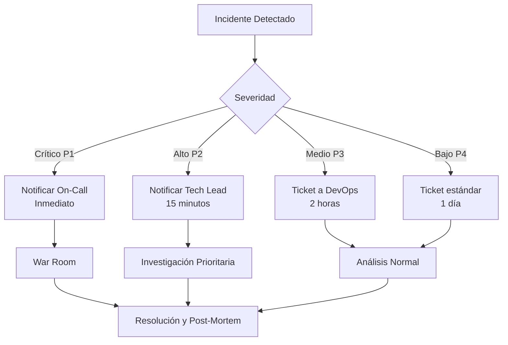

# Manual Técnico

Documentación técnica completa del Sistema de Gestión de Trámites Migratorios de Panamá.

---

!!! warning "Confidencialidad"
    **Uso Interno - Personal Técnico**
    
    Este manual contiene información técnica sensible sobre la arquitectura, configuración y operación del sistema. Está destinado exclusivamente para:
    
    - Desarrolladores del equipo
    - Administradores de sistemas
    - DevOps y SRE
    - Personal de soporte técnico nivel 3
    
    🔒 No compartir fuera del equipo técnico autorizado.

---

## 📋 Contenido del Manual

Este manual técnico está organizado en 9 secciones principales que cubren todos los aspectos técnicos del sistema:

### 🏗️ Arquitectura y Diseño

=== "1. Arquitectura del Sistema"
    **Visión general de la arquitectura**
    
    - Arquitectura de microservicios
    - Clean Architecture
    - Componentes principales
    - Flujo de datos
    - Patrones de diseño utilizados
    
    [Ver Arquitectura →](01-arquitectura.md)

=== "2. Base de Datos"
    **Modelo de datos y estructuras**
    
    - Diagrama entidad-relación
    - Tablas principales
    - Relaciones y constraints
    - Índices y optimizaciones
    - Stored procedures
    
    [Ver Base de Datos →](02-database.md)

=== "3. Backend - API REST"
    **Servidor y lógica de negocio**
    
    - FastAPI framework
    - Estructura del proyecto
    - Endpoints y rutas
    - Modelos y schemas
    - Servicios y business logic
    
    [Ver Backend →](03-backend.md)

=== "4. Frontend"
    **Aplicación web cliente**
    
    - React + TypeScript
    - Componentes principales
    - Gestión de estado
    - Integración con API
    - UI/UX patterns
    
    [Ver Frontend →](04-frontend.md)

### 🚀 Infraestructura y Operaciones

=== "5. Infraestructura"
    **Deployment y contenedores**
    
    - Docker y Docker Compose
    - Configuración de networking
    - Variables de entorno
    - Estrategia Blue-Green
    - CI/CD pipeline
    
    [Ver Infraestructura →](05-infraestructura.md)

=== "6. Seguridad"
    **Protección y compliance**
    
    - Autenticación y autorización
    - Encriptación de datos
    - JWT tokens
    - HTTPS/SSL
    - Auditoría y compliance
    
    [Ver Seguridad →](06-seguridad.md)

=== "7. Monitoreo"
    **Observabilidad del sistema**
    
    - Logging estructurado
    - Métricas y dashboards
    - Alertas y notificaciones
    - Dozzle para visualización
    - Performance monitoring
    
    [Ver Monitoreo →](07-monitoreo.md)

### 🔧 Mantenimiento y Soporte

=== "8. Troubleshooting"
    **Resolución de problemas**
    
    - Problemas comunes
    - Diagnóstico paso a paso
    - Comandos útiles
    - Logs y debugging
    - Escenarios de error
    
    [Ver Troubleshooting →](08-troubleshooting.md)

=== "9. Mantenimiento"
    **Procedimientos operativos**
    
    - Backup y restauración
    - Actualizaciones
    - Migraciones de base de datos
    - Procedimientos de emergencia
    - Calendario de mantenimiento
    
    [Ver Mantenimiento →](09-mantenimiento.md)

---

## 🎯 Guías de Inicio Rápido

### Para Desarrolladores

!!! example "Setup de Desarrollo Local"
    ```bash
    # 1. Clonar repositorio
    git clone https://github.com/juncid/tramites-mvp-panama.git
    cd tramites-mvp-panama
    
    # 2. Configurar variables de entorno
    cp .env.example .env
    # Editar .env con tus configuraciones locales
    
    # 3. Levantar servicios con Docker Compose
    docker-compose -f docker-compose.dev.yml up -d
    
    # 4. Inicializar base de datos
    cd backend
    python init_database.py
    
    # 5. Cargar datos de prueba
    python load_initial_data.py
    
    # 6. Acceder a la aplicación
    # Frontend: http://localhost:3000
    # Backend API: http://localhost:8000
    # Docs: http://localhost:8000/docs
    ```
    
    📖 **Guía completa**: Ver [Arquitectura](01-arquitectura.md#configuración-de-desarrollo)

### Para DevOps/SRE

!!! example "Deployment a Producción"
    ```bash
    # 1. Preparar servidor
    ssh user@production-server
    
    # 2. Clonar y configurar
    git clone https://github.com/juncid/tramites-mvp-panama.git
    cd tramites-mvp-panama
    
    # 3. Configurar producción
    cp .env.production .env
    # Editar con credenciales seguras
    
    # 4. Deploy con Blue-Green
    make deploy-blue-green
    
    # 5. Verificar health
    curl https://api.migracion.gob.pa/health
    
    # 6. Monitorear logs
    docker-compose logs -f --tail=100
    ```
    
    📖 **Guía completa**: Ver [Infraestructura](05-infraestructura.md#deployment-producción)

### Para Administradores de BD

!!! example "Mantenimiento de Base de Datos"
    ```sql
    -- 1. Backup de base de datos
    BACKUP DATABASE tramites_db 
    TO DISK = '/backup/tramites_db_20251022.bak'
    WITH COMPRESSION;
    
    -- 2. Verificar integridad
    DBCC CHECKDB('tramites_db') WITH NO_INFOMSGS;
    
    -- 3. Actualizar estadísticas
    EXEC sp_updatestats;
    
    -- 4. Reorganizar índices
    ALTER INDEX ALL ON tramites_db REORGANIZE;
    ```
    
    📖 **Guía completa**: Ver [Base de Datos](02-database.md#administración) y [Mantenimiento](09-mantenimiento.md#base-de-datos)

---

## 🛠️ Stack Tecnológico

### Backend

| Tecnología | Versión | Propósito |
|------------|---------|-----------|
| **Python** | 3.11+ | Lenguaje principal |
| **FastAPI** | 0.104+ | Framework web |
| **SQLAlchemy** | 2.0+ | ORM |
| **Pydantic** | 2.0+ | Validación de datos |
| **pyodbc** | 5.0+ | Driver SQL Server |
| **Redis-py** | 5.0+ | Cliente Redis |
| **Uvicorn** | 0.24+ | ASGI server |

### Frontend

| Tecnología | Versión | Propósito |
|------------|---------|-----------|
| **React** | 18+ | Framework UI |
| **TypeScript** | 5.0+ | Type safety |
| **Vite** | 4.5+ | Build tool |
| **Axios** | 1.6+ | HTTP client |
| **React Router** | 6+ | Routing |

### Infraestructura

| Tecnología | Versión | Propósito |
|------------|---------|-----------|
| **Docker** | 24+ | Contenedores |
| **Docker Compose** | 2.20+ | Orquestación |
| **Nginx** | 1.25-alpine | Reverse proxy |
| **SQL Server** | 2019 | Base de datos |
| **Redis** | 7-alpine | Cache |

---

## 📊 Métricas del Sistema

### Rendimiento

| Métrica | Objetivo | Actual | Estado |
|---------|----------|--------|--------|
| **Tiempo de respuesta API** | < 200ms | ~150ms | ✅ |
| **Uptime** | > 99.5% | 99.8% | ✅ |
| **Requests/segundo** | 100+ | 150 | ✅ |
| **Uso CPU** | < 70% | ~45% | ✅ |
| **Uso RAM** | < 80% | ~60% | ✅ |

### Base de Datos

| Métrica | Objetivo | Actual | Estado |
|---------|----------|--------|--------|
| **Query time promedio** | < 50ms | ~35ms | ✅ |
| **Conexiones pool** | 15-20 | 18 | ✅ |
| **Cache hit rate** | > 80% | 85% | ✅ |
| **Tamaño DB** | < 50GB | 12GB | ✅ |

---

## 🔗 Enlaces Útiles

### Documentación Oficial

- [FastAPI Documentation](https://fastapi.tiangolo.com/)
- [SQLAlchemy Documentation](https://docs.sqlalchemy.org/)
- [React Documentation](https://react.dev/)
- [Docker Documentation](https://docs.docker.com/)

### Recursos Internos

- **Repositorio**: [GitHub - tramites-mvp-panama](https://github.com/juncid/tramites-mvp-panama)
- **API Docs (Swagger)**: http://localhost:8000/docs
- **API Docs (ReDoc)**: http://localhost:8000/redoc
- **Monitoring Dashboard**: http://localhost:9000 (Dozzle)

### Herramientas de Desarrollo

- **Postman Collection**: `PPSH_Upload_Tests.postman_collection.json`
- **Testing Guide**: `TESTING_GUIDE.md`
- **Database Scripts**: `backend/bbdd/`
- **Migration Scripts**: `backend/alembic/`

---

## 📞 Soporte Técnico Interno

### Contactos del Equipo

| Rol | Contacto | Horario |
|-----|----------|---------|
| **Tech Lead** | techlead@migracion.gob.pa | L-V 8AM-5PM |
| **DevOps Lead** | devops@migracion.gob.pa | L-V 8AM-5PM |
| **DBA** | dba@migracion.gob.pa | L-V 9AM-6PM |
| **Soporte 24/7** | oncall@migracion.gob.pa | 24/7 |

### Escalación de Incidentes



---

## 📝 Convenciones de Documentación

Este manual utiliza las siguientes convenciones:

!!! info "Información"
    Bloques informativos con datos generales o contexto adicional.

!!! tip "Consejo"
    Recomendaciones y mejores prácticas.

!!! warning "Advertencia"
    Información importante que requiere atención especial.

!!! danger "Peligro"
    Acciones críticas que pueden causar problemas graves.

!!! example "Ejemplo"
    Código de ejemplo o casos de uso prácticos.

```bash
# Comandos de terminal se muestran así
docker-compose up -d
```

```python
# Código Python se muestra así
from fastapi import FastAPI
app = FastAPI()
```

---

## 🔄 Historial de Versiones

| Versión | Fecha | Cambios Principales |
|---------|-------|---------------------|
| **1.0** | Oct 2025 | Versión inicial del manual técnico |
| **0.9** | Sep 2025 | Beta - Revisión interna |
| **0.8** | Ago 2025 | Alpha - Primera versión draft |

---

## Navegación

[Inicio](../index.md) | [Arquitectura del Sistema →](01-arquitectura.md)

---

**© 2025 Servicio Nacional de Migración de Panamá**  
**Uso Interno - Confidencial**
