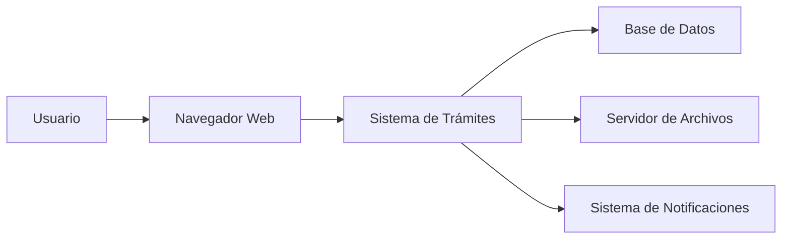

# 1. Introducción

## 1.1 ¿Qué es el Sistema de Trámites Migratorios?

El **Sistema de Gestión de Trámites Migratorios** es una plataforma digital moderna que permite a los ciudadanos y funcionarios del Servicio Nacional de Migración de Panamá gestionar de manera eficiente todos los trámites relacionados con:

- 📋 **Solicitudes de visa** - Procesos de visa temporal y permanente
- 🏥 **Permisos humanitarios (PPSH)** - Permisos Provisorios de Salida Humanitaria
- 📑 **Renovaciones** - Renovación de permisos de residencia
- 🔄 **Seguimiento** - Consulta del estado de trámites en curso
- 📊 **Notificaciones** - Alertas sobre cambios de estado y actualizaciones

### Arquitectura del Sistema



## 1.2 Beneficios del Sistema

### Para Ciudadanos

- ✅ **Eficiencia**: Reducción significativa de tiempos de espera
- ✅ **Transparencia**: Seguimiento en tiempo real de tu trámite
- ✅ **Accesibilidad**: Disponible 24 horas al día, 7 días a la semana
- ✅ **Comodidad**: Realiza trámites desde tu casa u oficina
- ✅ **Trazabilidad**: Historial completo de todas las acciones

### Para Funcionarios

- 📊 **Organización**: Gestión centralizada de todos los trámites
- 🔍 **Búsqueda**: Encuentra trámites rápidamente con filtros avanzados
- 📈 **Estadísticas**: Reportes y métricas en tiempo real
- 🤝 **Colaboración**: Asignación de tareas y workflows
- 📝 **Auditoría**: Registro completo de todas las operaciones

### Para la Institución

- 💰 **Ahorro**: Reducción de costos operativos
- 🚀 **Productividad**: Optimización de procesos
- 📉 **Tiempos**: Disminución de tiempos de respuesta
- 🔐 **Seguridad**: Protección de datos personales
- 📊 **Reportería**: Información para toma de decisiones

## 1.3 Requisitos del Sistema

Para utilizar el sistema de manera óptima, necesitas cumplir con los siguientes requisitos:

### Requisitos de Hardware

| Componente | Mínimo | Recomendado |
|------------|--------|-------------|
| **Procesador** | Intel Core i3 o equivalente | Intel Core i5 o superior |
| **RAM** | 4 GB | 8 GB o más |
| **Disco** | 500 MB libres | 1 GB libres |
| **Pantalla** | 1024x768 | 1920x1080 |

### Requisitos de Software

#### Navegadores Web Soportados

!!! tip "Navegador Recomendado"
    Recomendamos usar **Google Chrome** o **Microsoft Edge** para la mejor experiencia.

| Navegador | Versión Mínima | Estado |
|-----------|----------------|--------|
| Google Chrome | 90+ | ✅ Recomendado |
| Microsoft Edge | 90+ | ✅ Recomendado |
| Mozilla Firefox | 88+ | ✅ Soportado |
| Safari | 14+ | ✅ Soportado |
| Internet Explorer | - | ❌ No soportado |

#### Sistema Operativo

- ✅ Windows 10 o superior
- ✅ macOS 10.15 (Catalina) o superior
- ✅ Linux (Ubuntu 20.04+, Fedora 34+)
- ✅ Android 8+ (para móviles)
- ✅ iOS 13+ (para móviles)

### Conexión a Internet

- **Velocidad mínima**: 1 Mbps
- **Velocidad recomendada**: 5 Mbps o superior
- **Tipo**: Conexión estable (Wi-Fi o datos móviles)

!!! warning "Importante"
    Una conexión inestable puede causar errores al subir documentos o enviar formularios.

### Requisitos Adicionales

Para usar todas las funciones del sistema, necesitas:

- 📧 **Correo electrónico activo** - Para notificaciones y recuperación de contraseña
- 📱 **Número de teléfono** - Para verificación y notificaciones SMS (opcional)
- 📄 **Lector de PDF** - Para visualizar documentos generados
- 🖨️ **Impresora** - Para imprimir comprobantes (opcional)

### Documentos Digitales

Para subir documentos al sistema, estos deben cumplir:

| Característica | Requisito |
|----------------|-----------|
| **Formatos aceptados** | PDF, JPG, PNG |
| **Tamaño máximo** | 10 MB por archivo |
| **Calidad mínima** | 150 DPI (legible) |
| **Color** | Color o escala de grises |

!!! tip "Consejo: Escanear Documentos"
    - Usa una resolución de 300 DPI para mejor calidad
    - Asegúrate de que todo el documento esté visible
    - Evita sombras y reflejos
    - Guarda en formato PDF preferiblemente

## 1.4 Público Objetivo

### Tipos de Usuarios

El sistema está diseñado para diferentes tipos de usuarios:

#### 1. Solicitantes (Ciudadanos)

Personas que necesitan realizar trámites migratorios:

- Extranjeros solicitando visa
- Residentes renovando permisos
- Personas en situaciones humanitarias
- Familiares de migrantes

**Nivel de acceso**: Básico (sus propios trámites)

#### 2. Revisores

Funcionarios encargados de revisar documentación:

- Verificación de documentos
- Validación de información
- Solicitud de correcciones
- Recomendaciones iniciales

**Nivel de acceso**: Intermedio (trámites asignados)

#### 3. Aprobadores

Personal autorizado para tomar decisiones:

- Aprobación o rechazo de trámites
- Autorización de permisos
- Casos especiales
- Excepciones

**Nivel de acceso**: Avanzado (múltiples trámites)

#### 4. Administradores

Personal técnico y administrativo:

- Gestión de usuarios
- Configuración del sistema
- Reportes y estadísticas
- Mantenimiento

**Nivel de acceso**: Total (todo el sistema)

### Perfiles de Usuario

```
┌─────────────────────────────────────────────────┐
│              Jerarquía de Perfiles              │
├─────────────────────────────────────────────────┤
│                                                 │
│  ┌─────────────────────┐                       │
│  │   ADMINISTRADOR     │  ← Acceso total       │
│  └──────────┬──────────┘                       │
│             │                                   │
│  ┌──────────┴──────────┐                       │
│  │     APROBADOR       │  ← Decisiones         │
│  └──────────┬──────────┘                       │
│             │                                   │
│  ┌──────────┴──────────┐                       │
│  │      REVISOR        │  ← Verificación       │
│  └──────────┬──────────┘                       │
│             │                                   │
│  ┌──────────┴──────────┐                       │
│  │    SOLICITANTE      │  ← Trámites propios   │
│  └─────────────────────┘                       │
│                                                 │
└─────────────────────────────────────────────────┘
```

## 1.5 Módulos del Sistema

El sistema está organizado en tres módulos principales:

### 📋 Módulo de Trámites Base

Gestión de trámites migratorios generales.

**Funcionalidades**:
- Crear solicitudes
- Consultar estado
- Actualizar información
- Adjuntar documentos
- Cancelar trámites

[:octicons-arrow-right-24: Ver Módulo de Trámites](03-tramites.md)

### 🏥 Módulo PPSH

Permisos Provisorios de Salida Humanitaria.

**Funcionalidades**:
- Solicitudes humanitarias
- Documentación médica
- Revisión especializada
- Entrevistas
- Aprobación expedita

[:octicons-arrow-right-24: Ver Módulo PPSH](04-ppsh.md)

### 🔄 Módulo de Workflows

Procesos dinámicos configurables.

**Funcionalidades**:
- Workflows personalizados
- Tareas asignadas
- Seguimiento de progreso
- Alertas y notificaciones
- Métricas de rendimiento

[:octicons-arrow-right-24: Ver Módulo de Workflows](05-workflows.md)

## 1.6 Seguridad y Privacidad

### Protección de Datos

El sistema implementa múltiples capas de seguridad:

- 🔐 **Encriptación**: Todos los datos se transmiten encriptados (HTTPS)
- 🔑 **Autenticación**: Contraseñas seguras con hash
- 👤 **Autorización**: Control de acceso basado en roles
- 📝 **Auditoría**: Registro de todas las operaciones
- 💾 **Backup**: Respaldos automáticos diarios

### Cumplimiento Legal

El sistema cumple con:

- ✅ Ley de Protección de Datos Personales de Panamá
- ✅ Estándares internacionales de seguridad
- ✅ Políticas del Servicio Nacional de Migración
- ✅ Normativas de retención de documentos

!!! danger "Importante: Confidencialidad"
    Toda la información manejada en el sistema es **CONFIDENCIAL**. No compartas tu usuario y contraseña con nadie.

## 1.7 Soporte y Actualizaciones

### Horario de Atención

- **Lunes a Viernes**: 8:00 AM - 5:00 PM
- **Sábados**: 9:00 AM - 1:00 PM
- **Domingos y Feriados**: Cerrado

### Canales de Soporte

- 📧 **Email**: soporte@migracion.gob.pa
- 📱 **Teléfono**: +507 XXX-XXXX
- 💬 **Chat en línea**: Disponible en el sistema
- 📍 **Presencial**: Oficinas del SNM

### Actualizaciones del Sistema

El sistema se actualiza regularmente:

- **Mantenimiento programado**: Domingos 12:00 AM - 6:00 AM
- **Actualizaciones de seguridad**: Según necesidad
- **Nuevas funcionalidades**: Trimestralmente

!!! note "Nota"
    Recibirás notificaciones por email sobre mantenimientos programados.

---

## Siguiente Paso

Ahora que conoces el sistema, aprende cómo acceder:

[:octicons-arrow-right-24: Ir a Acceso al Sistema](02-acceso.md)
