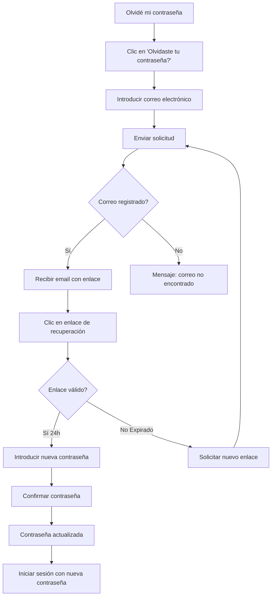

# 2. Acceso al Sistema

Esta sección explica cómo registrarse, iniciar sesión y recuperar tu contraseña en el Sistema de Gestión de Trámites Migratorios de Panamá.

---

## 2.1 Registro de Nuevo Usuario

Para comenzar a usar el sistema, primero debes crear una cuenta.

### Proceso de Registro

!!! example "Pasos para Registrarse"
    1. **Acceder a la página de registro**
       - Visita el portal web del sistema
       - Haz clic en **"Registrarse"** o **"Crear cuenta"**
    
    2. **Completar el formulario de registro**
       - Nombre completo
       - Correo electrónico válido
       - Número de documento de identidad
       - Contraseña segura (ver requisitos abajo)
       - Confirmar contraseña
    
    3. **Aceptar términos y condiciones**
       - Lee los términos de uso
       - Acepta la política de privacidad
    
    4. **Verificar correo electrónico**
       - Revisa tu bandeja de entrada
       - Haz clic en el enlace de verificación
       - Tu cuenta será activada

### Requisitos de Contraseña

!!! warning "Requisitos de Seguridad"
    Tu contraseña debe cumplir con los siguientes criterios:
    
    - ✅ Mínimo **8 caracteres**
    - ✅ Al menos **1 letra mayúscula** (A-Z)
    - ✅ Al menos **1 letra minúscula** (a-z)
    - ✅ Al menos **1 número** (0-9)
    - ✅ Al menos **1 símbolo especial** (@, #, $, %, &, etc.)
    
    **Ejemplos de contraseñas seguras**:
    - `Tramite2025!`
    - `Panama#Segura99`
    - `MiClave$2025`

### Confirmación de Registro

Una vez completado el registro, recibirás:

✅ Un correo de confirmación con el enlace de activación  
✅ Tu nombre de usuario o identificación  
✅ Instrucciones para el primer inicio de sesión

---

## 2.2 Inicio de Sesión

### Acceder a tu Cuenta

!!! info "Pasos para Iniciar Sesión"
    1. Visita la **página principal** del sistema
    2. Haz clic en **"Iniciar sesión"** o **"Login"**
    3. Introduce tu **correo electrónico** o **nombre de usuario**
    4. Introduce tu **contraseña**
    5. Haz clic en **"Iniciar sesión"**

### Pantalla de Inicio de Sesión

```
┌─────────────────────────────────────────┐
│  🇵🇦 Sistema de Gestión de Trámites     │
│         Migratorios - Panamá            │
├─────────────────────────────────────────┤
│                                         │
│  📧 Correo Electrónico                  │
│  ┌───────────────────────────────────┐  │
│  │ usuario@email.com                 │  │
│  └───────────────────────────────────┘  │
│                                         │
│  🔒 Contraseña                          │
│  ┌───────────────────────────────────┐  │
│  │ ••••••••••                        │  │
│  └───────────────────────────────────┘  │
│                                         │
│  ☐ Recordarme                           │
│                                         │
│  [    Iniciar Sesión    ]               │
│                                         │
│  ¿Olvidaste tu contraseña?              │
│  ¿No tienes cuenta? Regístrate          │
│                                         │
└─────────────────────────────────────────┘
```

### Consejos de Seguridad

!!! danger "Seguridad de tu Cuenta"
    - 🔒 **Nunca compartas** tu contraseña con nadie
    - 💻 **Cierra sesión** cuando uses computadoras públicas
    - 🔄 **Cambia tu contraseña** periódicamente
    - 👁️ **Verifica la URL** antes de iniciar sesión
    - 📱 **Habilita 2FA** si está disponible
    - ⚠️ **Reporta actividad sospechosa** inmediatamente

---

## 2.3 Recuperación de Contraseña

Si olvidaste tu contraseña, puedes recuperarla fácilmente.

### Proceso de Recuperación

!!! example "Pasos para Recuperar Contraseña"
    **Paso 1: Solicitar recuperación**
    
    1. En la pantalla de inicio de sesión, haz clic en **"¿Olvidaste tu contraseña?"**
    2. Introduce tu **correo electrónico registrado**
    3. Haz clic en **"Enviar enlace de recuperación"**
    
    **Paso 2: Verificar correo electrónico**
    
    1. Revisa tu bandeja de entrada (y carpeta de spam)
    2. Busca un correo con el asunto: *"Recuperación de contraseña"*
    3. El enlace será válido por **24 horas**
    
    **Paso 3: Restablecer contraseña**
    
    1. Haz clic en el enlace recibido
    2. Introduce tu **nueva contraseña**
    3. **Confirma** la nueva contraseña
    4. Haz clic en **"Restablecer contraseña"**
    
    **Paso 4: Iniciar sesión**
    
    1. Usa tu nueva contraseña para iniciar sesión
    2. Actualiza tus credenciales guardadas si usas un gestor de contraseñas

### Diagrama de Flujo



### Preguntas Frecuentes

??? question "¿Cuánto tiempo tarda en llegar el correo de recuperación?"
    El correo de recuperación normalmente llega en **menos de 5 minutos**. Si no lo recibes:
    
    - ✅ Revisa tu carpeta de **spam** o **correo no deseado**
    - ✅ Verifica que escribiste correctamente tu correo electrónico
    - ✅ Espera 10 minutos antes de solicitar un nuevo enlace
    - ✅ Contacta soporte si el problema persiste

??? question "¿El enlace de recuperación expiró?"
    Los enlaces de recuperación son válidos por **24 horas** por seguridad. Si expiró:
    
    1. Regresa a la página de recuperación
    2. Solicita un **nuevo enlace**
    3. Completa el proceso dentro de las 24 horas

??? question "¿No recibo el correo de recuperación?"
    Posibles causas y soluciones:
    
    - 📧 **Correo incorrecto**: Verifica la dirección de correo
    - 🚫 **Filtros de spam**: Revisa la carpeta de spam
    - 🌐 **Servidor de correo**: Algunos servidores tardan más
    - 📞 **Contacta soporte**: Si el problema persiste

---

## 2.4 Problemas Comunes y Soluciones

### No puedo iniciar sesión

| Problema | Causa | Solución |
|----------|-------|----------|
| **Contraseña incorrecta** | Error al escribir | Usa "Recuperar contraseña" |
| **Cuenta no activada** | No verificaste el correo | Revisa tu email de registro |
| **Usuario bloqueado** | Múltiples intentos fallidos | Contacta soporte (espera 30 min) |
| **Correo no registrado** | Usaste otro correo | Verifica tu correo de registro |

### Errores Técnicos

!!! failure "Error: "Sesión expirada""
    **Causa**: Has estado inactivo por mucho tiempo.
    
    **Solución**: Inicia sesión nuevamente. Por seguridad, las sesiones expiran después de 30 minutos de inactividad.

!!! failure "Error: "Navegador no compatible""
    **Causa**: Estás usando un navegador antiguo o no soportado.
    
    **Solución**: Actualiza tu navegador o usa uno de los siguientes:
    - Chrome (versión 90+)
    - Firefox (versión 88+)
    - Safari (versión 14+)
    - Edge (versión 90+)

---

## 2.5 Configuración de Perfil

Una vez que hayas iniciado sesión por primera vez, es recomendable configurar tu perfil.

### Actualizar Información Personal

!!! tip "Mantén tu perfil actualizado"
    1. Haz clic en tu **nombre** o **avatar** (esquina superior derecha)
    2. Selecciona **"Mi Perfil"** o **"Configuración"**
    3. Actualiza la información necesaria:
        - Foto de perfil
        - Datos de contacto
        - Dirección
        - Teléfono
        - Preferencias de notificación
    4. Haz clic en **"Guardar cambios"**

### Preferencias de Notificaciones

Configura cómo deseas recibir notificaciones:

- ✉️ **Correo electrónico**: Actualizaciones importantes
- 📱 **SMS**: Alertas urgentes (si está disponible)
- 🔔 **Notificaciones web**: Alertas en el navegador
- 📊 **Resumen diario**: Reporte diario de actividad

---

## Navegación

[← Introducción](01-introduccion.md) | [Inicio](index.md) | [Módulo de Trámites →](03-tramites.md)
