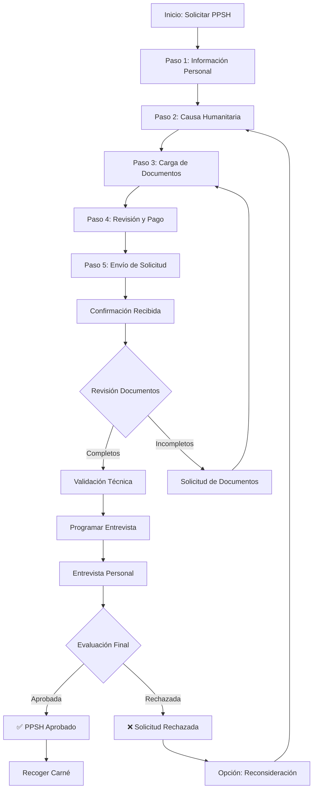

# 4. Módulo PPSH
## Permiso Por razones de Seguridad Humanitaria

El módulo PPSH gestiona el proceso especializado para solicitar permisos humanitarios especiales.

---

## 4.1 ¿Qué es el PPSH?

### Definición

El **Permiso Por razones de Seguridad Humanitaria (PPSH)** es un permiso especial otorgado por el Servicio Nacional de Migración de Panamá a personas que se encuentran en situaciones de vulnerabilidad humanitaria.

!!! info "Marco Legal"
    El PPSH está regulado por:
    
    - **Decreto Ejecutivo No. 5** (1 de febrero de 2018)
    - **Ley 3 de 2008** sobre Migración
    - **Artículo 24** de la Ley de Migración
    - Resoluciones del Servicio Nacional de Migración

### Casos que Califican

El PPSH puede ser otorgado a personas que enfrentan:

| Categoría | Descripción | Ejemplos |
|-----------|-------------|----------|
| 🔫 **Conflicto Armado** | Huyen de conflictos bélicos | Guerras civiles, invasiones |
| 🎯 **Persecución Política** | Perseguidos por ideología política | Activistas, disidentes |
| 👥 **Violencia de Género** | Víctimas de violencia basada en género | Violencia doméstica, feminicidios |
| 🌪️ **Desastres Naturales** | Afectados por catástrofes | Terremotos, huracanes, inundaciones |
| 👨‍👩‍👧 **Violencia Doméstica** | Violencia intrafamiliar grave | Abuso sistemático, amenazas de muerte |
| ⛪ **Persecución Religiosa** | Perseguidos por creencias | Minorías religiosas |
| 🚫 **Trata de Personas** | Víctimas de tráfico humano | Esclavitud, explotación |

### Beneficios del PPSH

!!! success "Beneficios del Permiso"
    Al obtener el PPSH, podrás:
    
    - ✅ **Residir legalmente** en Panamá
    - ✅ **Trabajar legalmente** con permiso laboral
    - ✅ **Acceder a servicios básicos** (salud, educación)
    - ✅ **Abrir cuentas bancarias**
    - ✅ **Matricular a tus hijos** en escuelas públicas
    - ✅ **Solicitar cédula de identidad temporal**
    - ✅ **Renovar el permiso** anualmente
    - ✅ **Solicitar reunificación familiar** (en algunos casos)

### Duración y Renovación

| Aspecto | Detalle |
|---------|---------|
| **Vigencia inicial** | 1 año |
| **Renovación** | Anual (si se mantienen las condiciones) |
| **Costo inicial** | $50.00 USD |
| **Costo de renovación** | $50.00 USD |
| **Tiempo de procesamiento** | 15-30 días hábiles |

---

## 4.2 Requisitos para Solicitar PPSH

Antes de iniciar tu solicitud, asegúrate de cumplir con todos los requisitos.

### Documentos Obligatorios

!!! warning "Documentos Requeridos (Obligatorios)"
    Debes presentar **todos** estos documentos:
    
    1. ✅ **Pasaporte vigente**
       - Páginas principales (identificación y foto)
       - Vigencia mínima de 6 meses
       - Página con sello de entrada a Panamá
    
    2. ✅ **Certificado de nacimiento**
       - Original o copia certificada
       - Apostillado o legalizado
       - Traducción oficial al español (si está en otro idioma)
    
    3. ✅ **Antecedentes penales**
       - Del país de origen
       - Emitido en los últimos 6 meses
       - Apostillado o legalizado
       - Traducción oficial al español (si es necesario)
    
    4. ✅ **Certificado médico**
       - Examen médico completo
       - Pruebas de VIH, tuberculosis
       - Emitido por centro médico autorizado en Panamá
       - Vigencia: 30 días
    
    5. ✅ **Fotografía tipo pasaporte**
       - Reciente (último mes)
       - Fondo blanco
       - Tamaño 2x2 pulgadas (5x5 cm)
       - Sin lentes, sin gorros
    
    6. ✅ **Comprobante de pago**
       - Recibo de pago de $50.00 USD
       - Generado en el sistema
       - Pagado en entidad bancaria autorizada

### Documentos Opcionales (Recomendados)

!!! tip "Documentos que Fortalecen tu Solicitud"
    Aunque no son obligatorios, estos documentos aumentan significativamente las posibilidades de aprobación:
    
    - 📄 **Carta de motivación**
      - Explica detalladamente tu situación
      - Describe las razones humanitarias específicas
      - Extensión: 1-2 páginas
      - Firmada y fechada
    
    - 📄 **Pruebas documentales**
      - Reportes de organizaciones internacionales (ONU, OEA, ACNUR)
      - Noticias sobre la situación en tu país
      - Denuncias policiales o judiciales
      - Amenazas recibidas (con evidencia)
      - Fotografías, videos, testimonios
    
    - 📄 **Certificado de solvencia económica**
      - Estados de cuenta bancarios
      - Carta de empleo
      - Constancia de remesas
      - Apoyo de familiares en Panamá
    
    - 📄 **Cartas de recomendación**
      - De organizaciones no gubernamentales
      - De instituciones religiosas
      - De profesionales (abogados, médicos, psicólogos)
      - De empleadores o comunidades

### Requisitos de Formato

!!! info "Especificaciones Técnicas"
    Todos los documentos digitales deben cumplir:
    
    | Requisito | Especificación |
    |-----------|----------------|
    | **Formatos aceptados** | PDF (preferido), JPG, PNG |
    | **Tamaño máximo** | 5 MB por archivo |
    | **Resolución** | 300 DPI mínimo |
    | **Color** | Color o escala de grises (no blanco y negro) |
    | **Legibilidad** | Texto completamente legible |
    | **Integridad** | Documentos completos (todas las páginas) |
    | **Idioma** | Español (o traducción oficial) |

---

## 4.3 Proceso de Solicitud PPSH

El proceso consta de 6 pasos principales. Sigue cada uno cuidadosamente.

### Diagrama del Proceso



### Paso 1: Iniciar Solicitud

!!! example "Cómo Iniciar"
    1. En el **Panel de Control**, haz clic en **"🏥 Solicitar PPSH"**
    2. Lee cuidadosamente toda la **información sobre requisitos**
    3. Descarga la **lista de documentos requeridos** (PDF)
    4. Prepara todos tus documentos antes de continuar
    5. Haz clic en **"Iniciar Nueva Solicitud"**

### Paso 2: Información Personal del Solicitante

Completa el formulario con tu información personal completa y precisa.

#### Sección A: Datos Personales

```
┌─────────────────────────────────────────────────────────────┐
│  🏥 Nueva Solicitud PPSH - Paso 1 de 6                      │
│  Información Personal del Solicitante                       │
├─────────────────────────────────────────────────────────────┤
│                                                             │
│  📋 Datos Personales                                        │
│                                                             │
│  Nombres *:          [________________________]             │
│  Apellido Paterno *: [________________________]             │
│  Apellido Materno:   [________________________]             │
│                                                             │
│  Número de Documento *: [________________________]          │
│  Tipo de Documento *:   [Pasaporte ▼]                      │
│  País de Nacionalidad *: [Seleccionar país ▼]              │
│                                                             │
│  Fecha de Nacimiento *: [DD/MM/AAAA]                       │
│  Lugar de Nacimiento *: [________________________]          │
│  Sexo *: ○ Masculino  ○ Femenino  ○ Otro                   │
│  Estado Civil *: [Seleccionar ▼]                           │
│                                                             │
│  * Campos obligatorios                                      │
│                                                             │
│  [Cancelar]                        [Guardar y Continuar >] │
└─────────────────────────────────────────────────────────────┘
```

#### Sección B: Información de Contacto

!!! info "Datos de Contacto"
    Proporciona información de contacto válida y actualizada:
    
    - **Correo Electrónico*** (verificado y que revises frecuentemente)
    - **Teléfono Móvil*** (con código de país: +507 para Panamá)
    - **Teléfono Alternativo** (opcional pero recomendado)
    - **Dirección Actual*** (dirección completa en Panamá)
    - **Ciudad/Distrito***
    - **Provincia***
    - **Código Postal** (si aplica)

!!! warning "Importante"
    Toda la correspondencia oficial se enviará a este correo electrónico y dirección. Asegúrate de que sean correctos.

### Paso 3: Causa Humanitaria

Selecciona la causa humanitaria que aplica a tu caso y describe tu situación.

#### Selección de Causa

```
┌─────────────────────────────────────────────────────────────┐
│  🏥 Nueva Solicitud PPSH - Paso 2 de 6                      │
│  Causa Humanitaria                                          │
├─────────────────────────────────────────────────────────────┤
│                                                             │
│  Selecciona la causa que motiva tu solicitud:              │
│                                                             │
│  ○ 🔫 Conflicto Armado                                      │
│    Personas que huyen de conflictos armados en su país     │
│                                                             │
│  ○ 🎯 Persecución Política                                  │
│    Persecución por opiniones o actividades políticas       │
│                                                             │
│  ○ 👥 Violencia de Género                                   │
│    Víctimas de violencia basada en género                  │
│                                                             │
│  ○ 🌪️ Desastre Natural                                     │
│    Afectados por desastres naturales graves                │
│                                                             │
│  ○ 👨‍👩‍👧 Violencia Doméstica                              │
│    Víctimas de violencia intrafamiliar grave               │
│                                                             │
│  ○ ⛪ Persecución Religiosa                                 │
│    Persecución por creencias religiosas                    │
│                                                             │
│  ○ 🚫 Trata de Personas                                     │
│    Víctimas de tráfico y trata de personas                 │
│                                                             │
│  ○ 📝 Otra causa humanitaria                                │
│    Especificar en la descripción                           │
│                                                             │
└─────────────────────────────────────────────────────────────┘
```

#### Descripción de tu Situación

!!! example "Descripción Detallada"
    **Campo: Descripción de tu situación*** (mínimo 200 caracteres)
    
    En este espacio, debes explicar claramente y con detalles:
    
    1. **¿Qué sucedió?**
       - Describe los eventos específicos que te llevaron a solicitar el PPSH
       - Incluye fechas, lugares y personas involucradas (si es seguro)
    
    2. **¿Por qué no puedes regresar a tu país?**
       - Explica los riesgos específicos que enfrentarías
       - Menciona amenazas directas o condiciones peligrosas
    
    3. **¿Cómo llegaste a Panamá?**
       - Ruta y medio de transporte
       - Fecha de ingreso
    
    4. **¿Qué apoyo tienes?**
       - Familia, amigos, organizaciones
       - Recursos económicos
    
    **Consejos para una buena descripción**:
    
    - ✅ Sé específico y concreto
    - ✅ Incluye detalles que puedan ser verificados
    - ✅ Sé honesto y veraz
    - ✅ Mantén un tono formal y respetuoso
    - ✅ Menciona cualquier documentación de respaldo que tengas
    - ❌ No inventes o exageres información
    - ❌ No incluyas información falsa

### Paso 4: Carga de Documentos

Adjunta todos los documentos requeridos. Este es el paso más crítico del proceso.

#### Documentos Obligatorios

```
┌─────────────────────────────────────────────────────────────┐
│  🏥 Nueva Solicitud PPSH - Paso 3 de 6                      │
│  Documentos Requeridos                                      │
├─────────────────────────────────────────────────────────────┤
│                                                             │
│  📎 Documentos Obligatorios (6/6 completos)                 │
│                                                             │
│  ✅ 1. Pasaporte (páginas principales)                      │
│     📄 Pasaporte.pdf (1.2 MB)      [Ver] [Eliminar]        │
│     Estado: ✓ Validado automáticamente                     │
│                                                             │
│  ✅ 2. Certificado de Nacimiento                            │
│     📄 Certificado_Nac.pdf (850 KB) [Ver] [Eliminar]       │
│     Estado: ✓ Validado automáticamente                     │
│                                                             │
│  ✅ 3. Antecedentes Penales                                 │
│     📄 Antecedentes.pdf (600 KB)    [Ver] [Eliminar]       │
│     Estado: ✓ Validado automáticamente                     │
│                                                             │
│  ✅ 4. Certificado Médico                                   │
│     📄 Cert_Medico.pdf (1.5 MB)     [Ver] [Eliminar]       │
│     Estado: ✓ Validado automáticamente                     │
│                                                             │
│  ✅ 5. Fotografía tipo Pasaporte                            │
│     📷 Foto.jpg (450 KB)            [Ver] [Eliminar]       │
│     Estado: ✓ Validado automáticamente                     │
│                                                             │
│  ✅ 6. Comprobante de Pago                                  │
│     📄 Comprobante.pdf (120 KB)     [Ver] [Eliminar]       │
│     Estado: ✓ Pago verificado ($50.00)                     │
│                                                             │
└─────────────────────────────────────────────────────────────┘
```

#### Documentos Opcionales

```
┌─────────────────────────────────────────────────────────────┐
│  📎 Documentos Opcionales (Recomendados)                    │
│                                                             │
│  ✅ Carta de Motivación                                     │
│     📄 Carta_Motivacion.pdf (250 KB) [Ver] [Eliminar]      │
│                                                             │
│  ✅ Pruebas Documentales (3 archivos)                       │
│     📄 Reporte_ONU.pdf (1.1 MB)      [Ver] [Eliminar]      │
│     📄 Noticias.pdf (890 KB)         [Ver] [Eliminar]      │
│     📄 Denuncia.pdf (1.8 MB)         [Ver] [Eliminar]      │
│                                                             │
│  ☐ Certificado Económico                                    │
│     [Seleccionar archivo...]                               │
│                                                             │
│  ☐ Cartas de Recomendación                                  │
│     [Seleccionar archivo...]                               │
│                                                             │
│  [+ Agregar otro documento]                                 │
│                                                             │
└─────────────────────────────────────────────────────────────┘
```

!!! tip "Consejos para Cargar Documentos"
    - 📱 **Desde móvil**: Usa la cámara del teléfono con buena iluminación
    - 🖥️ **Desde computadora**: Usa un escáner de alta calidad (300 DPI)
    - 🗜️ **Archivos grandes**: Usa herramientas de compresión (sin perder calidad)
    - ✅ **Verifica cada archivo**: Ábrelo antes de subirlo para asegurar que es legible
    - 💾 **Guarda copias**: Mantén respaldo de todos los documentos

### Paso 5: Revisión, Pago y Envío

Revisa cuidadosamente toda la información antes de enviar tu solicitud.

#### Pantalla de Revisión

```
┌─────────────────────────────────────────────────────────────┐
│  🏥 Nueva Solicitud PPSH - Paso 4 de 6                      │
│  Revisión de Información                                    │
├─────────────────────────────────────────────────────────────┤
│                                                             │
│  ✅ Información Personal                                    │
│     Juan Pérez García                                       │
│     Pasaporte: ABC123456 | Nacionalidad: Venezuela          │
│     Fecha Nac: 15/03/1985 (40 años)                        │
│     [Editar]                                               │
│                                                             │
│  ✅ Información de Contacto                                 │
│     Email: juan.perez@email.com                            │
│     Teléfono: +507 6123-4567                               │
│     Dirección: Calle 50, Bella Vista, Ciudad de Panamá     │
│     [Editar]                                               │
│                                                             │
│  ✅ Causa Humanitaria                                       │
│     Categoría: Conflicto Armado                            │
│     Descripción: 285 caracteres                            │
│     [Editar] [Ver Descripción Completa]                    │
│                                                             │
│  ✅ Documentos Adjuntos                                     │
│     Obligatorios: 6/6 completos ✓                          │
│     Opcionales: 4 archivos adjuntos                        │
│     Total: 10 archivos (8.8 MB)                            │
│     [Ver Lista Completa]                                   │
│                                                             │
└─────────────────────────────────────────────────────────────┘
```

#### Información de Pago

!!! info "Pago de Solicitud"
    **Concepto**: Solicitud de PPSH  
    **Monto**: $50.00 USD (no reembolsable)
    
    **Métodos de pago disponibles**:
    
    === "💳 Tarjeta (Online)"
        - Tarjetas de crédito: Visa, Mastercard, American Express
        - Tarjetas de débito: Clave, Visa Débito
        - Procesamiento inmediato
        - Confirmación automática
    
    === "🏦 Transferencia Bancaria"
        - Cuenta: Banco Nacional de Panamá
        - N° Cuenta: 10-00-00-123456-7
        - RUC: 123456-1-123456 DV 12
        - Plazo: 24-48 horas para confirmación
        - **Importante**: Adjuntar comprobante
    
    === "💵 Efectivo (Presencial)"
        - En oficinas del Servicio Nacional de Migración
        - Horario: Lunes a viernes, 8:00 AM - 3:00 PM
        - Requiere cita previa
        - Recibo entregado inmediatamente

#### Declaración Jurada

!!! warning "Declaración Jurada - Lectura Obligatoria"
    ```
    ☑️ DECLARACIÓN JURADA
    
    Yo, [Nombre Completo], bajo juramento declaro que:
    
    1. Toda la información proporcionada en esta solicitud es
       verdadera, completa y correcta según mi conocimiento.
    
    2. Los documentos adjuntados son auténticos y no han sido
       alterados o falsificados de ninguna manera.
    
    3. Entiendo que cualquier información falsa o engañosa puede
       resultar en el rechazo inmediato de mi solicitud y puede
       tener consecuencias legales, incluyendo deportación.
    
    4. Autorizo al Servicio Nacional de Migración a verificar
       toda la información proporcionada con las autoridades
       competentes.
    
    5. He leído y acepto los términos y condiciones del
       proceso de solicitud del PPSH.
    
    ☑️ Acepto la declaración jurada
    ☑️ He leído y acepto los términos y condiciones
    ```

#### Envío Final

!!! example "Enviar Solicitud"
    Una vez verificado todo:
    
    1. ✅ Marca las casillas de la declaración jurada
    2. ✅ Verifica el método de pago seleccionado
    3. ✅ Haz clic en **"Procesar Pago y Enviar Solicitud"**
    4. ⏳ Espera la confirmación (no cierres la ventana)
    5. 📧 Recibirás un correo de confirmación inmediato
    6. 💾 Descarga el comprobante PDF

### Paso 6: Confirmación de Envío

Tras enviar exitosamente, recibirás la confirmación:

```
┌─────────────────────────────────────────────────────────────┐
│  ✅ Solicitud PPSH Enviada Exitosamente                     │
├─────────────────────────────────────────────────────────────┤
│                                                             │
│  ¡Tu solicitud ha sido registrada correctamente!           │
│                                                             │
│  📋 Número de Solicitud:                                    │
│      PPSH-2025-0001234                                      │
│                                                             │
│  🔢 Código de Verificación:                                 │
│      VRF-ABC123XYZ                                          │
│                                                             │
│  📅 Fecha de Solicitud: 22 de Octubre, 2025 - 10:30 AM     │
│  🔄 Estado Actual: PENDIENTE DE REVISIÓN                    │
│  💳 Pago: CONFIRMADO ($50.00 USD)                           │
│                                                             │
│  ┌─────────────────────────────────────────────────────┐   │
│  │ 📅 Próximos Pasos y Timeline Estimado               │   │
│  │                                                     │   │
│  │ 📌 Paso 1: Revisión Inicial                        │   │
│  │    ⏱️ 2-3 días hábiles                              │   │
│  │    Verificación de documentos y datos              │   │
│  │                                                     │   │
│  │ 📌 Paso 2: Validación de Documentos                │   │
│  │    ⏱️ 3-5 días hábiles                              │   │
│  │    Autenticación de documentos presentados         │   │
│  │                                                     │   │
│  │ 📌 Paso 3: Entrevista Personal                      │   │
│  │    ⏱️ Se programará (recibirás notificación)       │   │
│  │    Evaluación presencial con funcionario           │   │
│  │                                                     │   │
│  │ 📌 Paso 4: Evaluación Final                         │   │
│  │    ⏱️ 5-7 días hábiles después de entrevista        │   │
│  │    Decisión sobre la solicitud                     │   │
│  │                                                     │   │
│  │ ⏰ Tiempo Total Estimado: 15-30 días hábiles        │   │
│  └─────────────────────────────────────────────────────┘   │
│                                                             │
│  📧 Notificaciones:                                         │
│  Recibirás actualizaciones por correo electrónico a:       │
│  juan.perez@email.com                                      │
│                                                             │
│  📱 Seguimiento:                                            │
│  Puedes consultar el estado en cualquier momento en        │
│  "Mis Solicitudes > PPSH" usando tu número de solicitud.   │
│                                                             │
│  [📥 Descargar Comprobante PDF] [📄 Ver Detalles]          │
│  [📧 Reenviar Correo]  [🏠 Volver al Panel]                │
└─────────────────────────────────────────────────────────────┘
```

!!! success "¡Importante!"
    - 💾 **Guarda tu número de solicitud**: PPSH-2025-0001234
    - 🔐 **Guarda tu código de verificación**: VRF-ABC123XYZ
    - 📥 **Descarga el comprobante PDF** y guárdalo en un lugar seguro
    - 📧 **Revisa tu correo** regularmente (incluyendo spam)
    - 📱 **Mantén tu teléfono activo** para recibir notificaciones SMS

---

## 4.4 Seguimiento de Solicitud PPSH

Monitorea el progreso de tu solicitud en tiempo real.

### Acceder al Seguimiento

!!! info "Cómo Consultar tu Solicitud"
    **Opción 1: Desde el Panel**
    1. Ve al **Panel de Control**
    2. En "Mis Trámites", verás tus solicitudes PPSH activas
    
    **Opción 2: Desde el Menú**
    1. Ve a **"Mis Solicitudes"** en el menú principal
    2. Selecciona la pestaña **"PPSH"**
    3. Haz clic en tu solicitud

### Pantalla de Seguimiento

```
┌─────────────────────────────────────────────────────────────┐
│  🏥 Solicitud PPSH: PPSH-2025-0001234                       │
│  Estado: 🔄 VALIDACIÓN DE DOCUMENTOS                        │
│  Progreso: ━━━━━━━━━━━━━━░░░░░░░░ 60%                      │
├─────────────────────────────────────────────────────────────┤
│                                                             │
│  📊 Línea de Tiempo del Proceso                             │
│                                                             │
│  ✅ 22/10/2025 10:30 - Solicitud Recibida                   │
│     └─ Tu solicitud ha sido registrada en el sistema       │
│        Número asignado: PPSH-2025-0001234                  │
│                                                             │
│  ✅ 22/10/2025 14:00 - Pago Confirmado                      │
│     └─ Comprobante de pago validado ($50.00 USD)           │
│        Método: Tarjeta de crédito ****1234                 │
│                                                             │
│  ✅ 23/10/2025 09:15 - Revisión Inicial Completada          │
│     └─ Documentos preliminares revisados                   │
│        Todos los documentos obligatorios presentes         │
│                                                             │
│  🔄 24/10/2025 11:30 - Validación de Documentos (En curso)  │
│     └─ Verificación de autenticidad en progreso            │
│        Funcionario asignado: Lic. María González (SNM-045) │
│        Tiempo estimado: 2-3 días adicionales               │
│                                                             │
│  ⏸️  Pendiente - Entrevista Personal                         │
│     └─ Será programada una vez validados los documentos    │
│        Recibirás notificación 5 días antes                 │
│                                                             │
│  ⏸️  Pendiente - Evaluación Final                            │
│     └─ Decisión sobre la solicitud                         │
│        Tiempo estimado: 5-7 días después de entrevista     │
│                                                             │
│  ─────────────────────────────────────────────────────      │
│                                                             │
│  📎 Documentos Adjuntos (10 archivos)                       │
│     [Ver Lista Completa] [Agregar Documento]               │
│                                                             │
│  💬 Historial de Comunicación (4 mensajes)                  │
│     [Ver Conversación] [Enviar Mensaje]                    │
│                                                             │
│  📅 Citas Programadas (0)                                   │
│     No hay citas programadas aún                           │
│                                                             │
│  ─────────────────────────────────────────────────────      │
│                                                             │
│  ℹ️ Última actualización: 24/10/2025 11:30 AM               │
│  👤 Funcionario asignado: Lic. María González              │
│  📧 Contacto: maria.gonzalez@migracion.gob.pa              │
│                                                             │
│  [📥 Descargar Comprobante] [📞 Solicitar Ayuda]            │
│  [📧 Reenviar Notificaciones] [🏠 Volver]                   │
└─────────────────────────────────────────────────────────────┘
```

### Estados de la Solicitud

| Estado | Icono | Descripción | Tiempo Est. | Acción Requerida |
|--------|-------|-------------|-------------|------------------|
| **Recibida** | 📨 | Solicitud registrada | - | Ninguna |
| **En Revisión Inicial** | 🔍 | Verificación preliminar | 2-3 días | Ninguna |
| **Validación Documentos** | 🔄 | Autenticación de docs | 3-5 días | Ninguna |
| **Documentación Pendiente** | ⚠️ | Faltan documentos | - | **Subir documentos** |
| **Entrevista Programada** | 📅 | Cita agendada | - | **Asistir a cita** |
| **En Evaluación Final** | ⚖️ | Decisión en proceso | 5-7 días | Ninguna |
| **Aprobada** | ✅ | PPSH aprobado | - | **Recoger carné** |
| **Rechazada** | ❌ | No aprobada | - | Ver motivos |
| **En Reconsideración** | 🔁 | Revisión de apelación | 10-15 días | Ninguna |

---

## 4.5 Entrevista Personal

La entrevista es una parte crucial del proceso de evaluación.

### Notificación de Entrevista

Cuando se programe tu entrevista, recibirás una notificación:

```
┌─────────────────────────────────────────────────────────────┐
│  📧 Nueva Notificación - IMPORTANTE                         │
├─────────────────────────────────────────────────────────────┤
│                                                             │
│  🎯 Entrevista Personal Programada                          │
│     Solicitud PPSH-2025-0001234                            │
│                                                             │
│  Tu entrevista para la solicitud PPSH ha sido programada:  │
│                                                             │
│  📅 Fecha: Lunes, 28 de Octubre, 2025                       │
│  🕐 Hora: 10:00 AM (llegar 15 minutos antes)               │
│  📍 Lugar: Oficina Central de Migración                     │
│            Av. Cuba y Calle 28, Edificio ANDE              │
│            Piso 3, Oficina 305                             │
│            Ciudad de Panamá, Panamá                        │
│                                                             │
│  ┌─────────────────────────────────────────────────────┐   │
│  │ 📋 Qué debes llevar (OBLIGATORIO):                  │   │
│  │                                                     │   │
│  │ ✅ Documento de identidad original (pasaporte)      │   │
│  │ ✅ Comprobante de solicitud (impreso)               │   │
│  │ ✅ Todos los documentos originales presentados      │   │
│  │ ✅ Copias adicionales de documentos                 │   │
│  │ ✅ Carta de motivación (si la presentaste)          │   │
│  │ ✅ Cualquier prueba adicional que tengas            │   │
│  └─────────────────────────────────────────────────────┘   │
│                                                             │
│  ⚠️ IMPORTANTE:                                             │
│  • La entrevista durará aproximadamente 30-45 minutos      │
│  • Llegar tarde puede resultar en reprogramación           │
│  • No se permite el ingreso de acompañantes                │
│  • No se permite uso de celulares durante la entrevista    │
│                                                             │
│  [✅ Confirmar Asistencia] [📅 Reagendar]                   │
│  [📥 Agregar al Calendario] [🗺️ Ver Mapa]                  │
└─────────────────────────────────────────────────────────────┘
```

### Preparación para la Entrevista

!!! tip "Consejos para una Entrevista Exitosa"
    **Antes de la Entrevista**:
    
    - ✅ **Confirma tu asistencia** lo antes posible
    - ✅ **Revisa tu solicitud** completa antes de la cita
    - ✅ **Prepara respuestas** sobre tu situación humanitaria
    - ✅ **Organiza tus documentos** en orden cronológico
    - ✅ **Practica explicar** tu situación de forma clara y concisa
    - ✅ **Duerme bien** la noche anterior
    - ✅ **Planifica tu ruta** y tiempo de viaje
    
    **El Día de la Entrevista**:
    
    - 👔 **Viste formalmente** (profesional)
    - ⏰ **Llega 15 minutos antes**
    - 📄 **Trae todos los documentos** originales y copias
    - 💧 **Mantén la calma** y sé honesto
    - 📱 **Apaga tu teléfono** antes de entrar
    - 🤝 **Sé respetuoso** con el funcionario
    
    **Durante la Entrevista**:
    
    - 👂 **Escucha atentamente** cada pregunta
    - 🗣️ **Responde claramente** sin divagar
    - ✅ **Sé honesto** en todas tus respuestas
    - 📊 **Proporciona detalles** cuando sea necesario
    - 🙋 **Haz preguntas** si algo no está claro
    - 📄 **Muestra documentación** cuando lo soliciten
    - 😌 **Mantén la compostura** incluso con preguntas difíciles

### Preguntas Frecuentes en la Entrevista

??? question "¿Qué tipo de preguntas hacen?"
    Preguntas típicas incluyen:
    
    - "¿Por qué solicita el PPSH?"
    - "Describa la situación en su país de origen"
    - "¿Cuándo y cómo llegó a Panamá?"
    - "¿Tiene familia en Panamá?"
    - "¿Cómo se sostiene económicamente?"
    - "¿Ha solicitado protección en otros países?"
    - "¿Puede proporcionar evidencia de su situación?"
    - "¿Qué planes tiene si se aprueba su solicitud?"

---

## 4.6 Decisión Final

Después de completar todo el proceso, recibirás la decisión final.

### Solicitud APROBADA ✅

```
┌─────────────────────────────────────────────────────────────┐
│  ✅ SOLICITUD PPSH APROBADA                                 │
│     Número: PPSH-2025-0001234                              │
├─────────────────────────────────────────────────────────────┤
│                                                             │
│  🎉 ¡Felicidades! Tu solicitud ha sido aprobada.           │
│                                                             │
│  📋 Detalles del Permiso:                                   │
│                                                             │
│  Número de Permiso: PPSH-2025-0001234                      │
│  Fecha de Aprobación: 30 de Octubre, 2025                  │
│  Fecha de Emisión: 30 de Octubre, 2025                     │
│  Vigencia: 1 año (hasta 30 de Octubre, 2026)              │
│  Renovable: Sí (solicitar 30 días antes del vencimiento)   │
│                                                             │
│  ┌─────────────────────────────────────────────────────┐   │
│  │ 📋 Próximos Pasos OBLIGATORIOS                      │   │
│  │                                                     │   │
│  │ 1️⃣ Descargar Permiso Provisional (válido 30 días)  │   │
│  │    [📥 Descargar PDF]                                │   │
│  │                                                     │   │
│  │ 2️⃣ Agendar Cita para Firma y Fotografía            │   │
│  │    Plazo: Dentro de los próximos 15 días           │   │
│  │    [📅 Agendar Cita]                                │   │
│  │                                                     │   │
│  │ 3️⃣ Presentarte con:                                 │   │
│  │    • Pasaporte original                             │   │
│  │    • Permiso provisional impreso                    │   │
│  │    • Comprobante de cita                            │   │
│  │    • 2 fotografías adicionales tipo pasaporte       │   │
│  │                                                     │   │
│  │ 4️⃣ Recoger Carné Físico                             │   │
│  │    5 días hábiles después de la cita               │   │
│  │    Recibirás notificación cuando esté listo        │   │
│  └─────────────────────────────────────────────────────┘   │
│                                                             │
│  🎫 Beneficios de tu PPSH:                                  │
│  • Residencia temporal en Panamá (1 año)                   │
│  • Permiso de trabajo (debe solicitarse)                   │
│  • Acceso a servicios de salud públicos                    │
│  • Posibilidad de abrir cuentas bancarias                  │
│  • Matricular hijos en escuelas públicas                   │
│  • Solicitar cédula de identidad provisional               │
│                                                             │
│  [📥 Descargar Permiso PDF] [📅 Agendar Cita]              │
│  [📄 Ver Detalles Completos] [📧 Enviar por Email]         │
└─────────────────────────────────────────────────────────────┘
```

!!! success "¡Felicitaciones!"
    Tu solicitud ha sido aprobada. Ahora debes:
    
    1. **Descargar** tu permiso provisional inmediatamente
    2. **Agendar** tu cita dentro de 15 días
    3. **Presentarte** en la fecha programada
    4. **Recoger** tu carné físico 5 días después

### Solicitud RECHAZADA ❌

```
┌─────────────────────────────────────────────────────────────┐
│  ❌ SOLICITUD PPSH NO APROBADA                              │
│     Número: PPSH-2025-0001234                              │
├─────────────────────────────────────────────────────────────┤
│                                                             │
│  Lamentamos informarte que tu solicitud no fue aprobada.   │
│                                                             │
│  📋 Información de la Decisión:                             │
│                                                             │
│  Fecha de Decisión: 30 de Octubre, 2025                    │
│  Funcionario: Lic. María González                          │
│  Resolución N°: RES-2025-1234                              │
│                                                             │
│  ┌─────────────────────────────────────────────────────┐   │
│  │ 📄 Motivos del Rechazo                              │   │
│  │                                                     │   │
│  │ La solicitud no fue aprobada por las siguientes    │   │
│  │ razones:                                            │   │
│  │                                                     │   │
│  │ 1. Los documentos presentados no cumplen con los   │   │
│  │    requisitos establecidos en el Artículo 24 del   │   │
│  │    Decreto Ejecutivo No. 5 de 2018.                │   │
│  │                                                     │   │
│  │ 2. La situación descrita no califica como causa    │   │
│  │    humanitaria según los criterios establecidos.   │   │
│  │                                                     │   │
│  │ 3. Inconsistencias encontradas entre la            │   │
│  │    declaración y la documentación presentada.      │   │
│  └─────────────────────────────────────────────────────┘   │
│                                                             │
│  ┌─────────────────────────────────────────────────────┐   │
│  │ 🔄 Opciones Disponibles                             │   │
│  │                                                     │   │
│  │ 1️⃣ Solicitar Reconsideración (30 días)             │   │
│  │    Presenta nueva evidencia o argumentos           │   │
│  │    [📝 Solicitar Reconsideración]                   │   │
│  │                                                     │   │
│  │ 2️⃣ Presentar Nueva Solicitud                        │   │
│  │    Con documentos adicionales o corregidos         │   │
│  │    [📋 Nueva Solicitud]                             │   │
│  │                                                     │   │
│  │ 3️⃣ Solicitar Asesoría Legal                         │   │
│  │    Consulta con un abogado de migración            │   │
│  │    [👨‍⚖️ Contactar Asesor]                           │   │
│  │                                                     │   │
│  │ 4️⃣ Ver Otras Opciones de Estatus Migratorio         │   │
│  │    Explora alternativas (visas, permisos)          │   │
│  │    [🔍 Ver Opciones]                                │   │
│  └─────────────────────────────────────────────────────┘   │
│                                                             │
│  [📄 Ver Resolución Completa] [📞 Solicitar Ayuda]         │
│  [💬 Enviar Mensaje] [🏠 Volver al Inicio]                 │
└─────────────────────────────────────────────────────────────┘
```

!!! warning "Solicitud No Aprobada"
    Si tu solicitud fue rechazada:
    
    - 📄 **Lee cuidadosamente** los motivos del rechazo
    - 📞 **Contacta a un asesor** si no entiendes las razones
    - 🔄 **Considera la reconsideración** si tienes nueva evidencia
    - 📋 **Prepara mejor** una nueva solicitud
    - 👨‍⚖️ **Busca asesoría legal** si lo consideras necesario

---

## Navegación

[← Módulo de Trámites](03-tramites.md) | [Inicio](index.md) | [Módulo de Workflows →](05-workflows.md)
