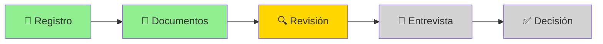
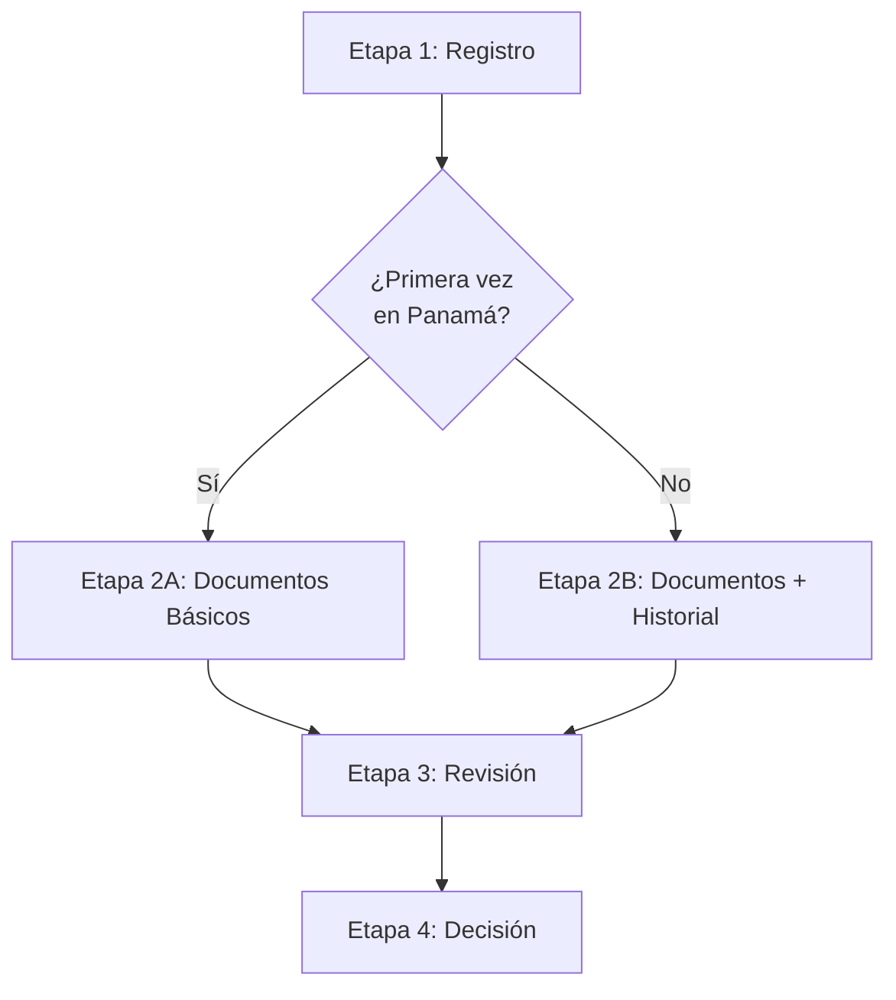

# 5. Módulo de Workflows

El Módulo de Workflows gestiona procesos estructurados paso a paso, asegurando que cada trámite siga un flujo ordenado y controlado.

---

## 5.1 ¿Qué es el Sistema de Workflow?

### Definición

Un **Workflow** (flujo de trabajo) es un proceso estructurado que divide un trámite complejo en **etapas secuenciales** más simples y manejables. Cada etapa debe completarse antes de avanzar a la siguiente.

!!! info "Concepto Clave"
    Imagina un workflow como una línea de producción: cada estación (etapa) debe completar su trabajo antes de que el producto (tu trámite) pase a la siguiente estación.

### Beneficios del Sistema de Workflows

| Beneficio | Descripción |
|-----------|-------------|
| 📋 **Claridad** | Sabes exactamente qué hacer en cada momento |
| 🎯 **Enfoque** | Te concentras en una etapa a la vez |
| 📊 **Seguimiento** | Ves tu progreso visualmente |
| ✅ **Calidad** | Cada etapa se revisa antes de avanzar |
| ⏱️ **Eficiencia** | Proceso ordenado reduce errores y demoras |
| 🔄 **Transparencia** | Historial completo de todas las acciones |

### Ejemplo Visual



**Leyenda**:

- 🟢 **Verde**: Etapas completadas
- 🟡 **Amarillo**: Etapa actual (en curso)
- ⚪ **Gris**: Etapas pendientes

---

## 5.2 Entender las Etapas

Cada workflow está compuesto por múltiples etapas, cada una con tareas específicas.

### Estructura de un Workflow Típico

```
┌─────────────┐    ┌─────────────┐    ┌─────────────┐    ┌─────────────┐    ┌─────────────┐
│  Etapa 1    │ ──>│  Etapa 2    │ ──>│  Etapa 3    │ ──>│  Etapa 4    │ ──>│  Etapa 5    │
│  Registro   │    │ Documentos  │    │  Revisión   │    │ Entrevista  │    │  Decisión   │
│     1️⃣      │    │     2️⃣      │    │     3️⃣      │    │     4️⃣      │    │     5️⃣      │
└─────────────┘    └─────────────┘    └─────────────┘    └─────────────┘    └─────────────┘
     ✅                 ✅                 🔄                 ⏸️                  ⏸️
 Completada         Completada         En Curso          Pendiente          Pendiente
```

### Estados de Etapas

| Estado | Icono | Descripción | Acciones Disponibles |
|--------|-------|-------------|---------------------|
| **No Iniciada** | ⏸️ | Aún no ha comenzado | Ninguna (esperar etapa previa) |
| **En Progreso** | 🔄 | Actualmente activa | Completar tareas, agregar info |
| **Completada** | ✅ | Finalizada exitosamente | Ver detalles, historial |
| **Requiere Acción** | ⚠️ | Necesita información adicional | Completar lo solicitado |
| **Rechazada** | ❌ | No aprobada (workflow detenido) | Ver motivos |

### Componentes de una Etapa

Cada etapa contiene:

=== "📋 Tareas"
    **Lista de actividades específicas**
    
    - Pueden ser acciones del usuario (subir documentos)
    - O del sistema (validación automática)
    - O de funcionarios (revisión manual)
    
    **Ejemplo**:
    
    - ✅ Subir pasaporte
    - ✅ Subir certificado de nacimiento
    - 🔄 Subir antecedentes penales
    - ⏸️ Subir certificado médico

=== "❓ Preguntas"
    **Información adicional requerida**
    
    - Preguntas de opción múltiple
    - Campos de texto libre
    - Preguntas condicionales (si/no → sub-preguntas)
    
    **Ejemplo**:
    
    - "¿Ha estado previamente en Panamá?" (Sí/No)
    - "¿Tiene familiares en Panamá?" (Sí/No)
    - Si Sí: "Especifique nombres y relación"

=== "📎 Archivos"
    **Documentos adjuntos**
    
    - Obligatorios o opcionales
    - Especificaciones técnicas (formato, tamaño)
    - Validación automática
    
    **Ejemplo**:
    
    - Pasaporte.pdf (2.1 MB) ✅
    - Foto.jpg (450 KB) ✅
    - Carta_Motivacion.pdf (opcional)

=== "💬 Comentarios"
    **Comunicación**
    
    - Notas del usuario
    - Comentarios de funcionarios
    - Notificaciones del sistema
    
    **Ejemplo**:
    
    - "Documentos recibidos correctamente" (Sistema)
    - "Pasaporte próximo a vencer, renovar" (Funcionario)

---

## 5.3 Completar una Etapa

Guía paso a paso para trabajar en una etapa de workflow.

### Pantalla de Etapa Activa

Cuando accedes a tu trámite con workflow activo:

```
┌─────────────────────────────────────────────────────────────┐
│  🔄 Workflow: Solicitud PPSH - PPSH-2025-0001234           │
│  Etapa 2 de 5: Carga de Documentos                         │
├─────────────────────────────────────────────────────────────┤
│                                                             │
│  📊 Progreso General del Workflow:                          │
│  ████████░░░░░░░░░░░░░░░░  40%                             │
│  Tiempo en esta etapa: 2 horas 15 minutos                  │
│                                                             │
│  ┌─────────────────────────────────────────────────────┐   │
│  │ 📋 Tareas de esta Etapa (5)                         │   │
│  │                                                     │   │
│  │ ✅ 1. Subir Pasaporte                               │   │
│  │      Completada: 22/10/2025 10:45                  │   │
│  │      Archivo: Pasaporte.pdf (2.1 MB)               │   │
│  │                                                     │   │
│  │ ✅ 2. Subir Certificado de Nacimiento               │   │
│  │      Completada: 22/10/2025 10:50                  │   │
│  │      Archivo: Cert_Nacimiento.pdf (850 KB)         │   │
│  │                                                     │   │
│  │ ✅ 3. Subir Antecedentes Penales                    │   │
│  │      Completada: 22/10/2025 11:00                  │   │
│  │      Archivo: Antecedentes.pdf (600 KB)            │   │
│  │                                                     │   │
│  │ 🔄 4. Subir Certificado Médico (EN PROGRESO)        │   │
│  │      [Seleccionar archivo...]                      │   │
│  │      Requisitos: PDF, JPG o PNG | Máx 5 MB         │   │
│  │                                                     │   │
│  │ ⏸️  5. Subir Fotografía tipo Pasaporte              │   │
│  │      [Seleccionar archivo...]                      │   │
│  │      Requisitos: JPG o PNG | 2x2 pulgadas          │   │
│  └─────────────────────────────────────────────────────┘   │
│                                                             │
│  ┌─────────────────────────────────────────────────────┐   │
│  │ ❓ Preguntas Requeridas (2)                         │   │
│  │                                                     │   │
│  │ 1. ¿Ha estado previamente en Panamá? *             │   │
│  │    ● Sí  ○ No                                       │   │
│  │                                                     │   │
│  │    Si respondiste Sí, especifica cuándo:           │   │
│  │    [Enero 2023 - Visita turística_______________]  │   │
│  │                                                     │   │
│  │ 2. ¿Tiene familiares en Panamá? *                  │   │
│  │    ● Sí  ○ No                                       │   │
│  │                                                     │   │
│  │    Si respondiste Sí, especifica:                  │   │
│  │    [Hermano - Juan Pérez - Residente__________]    │   │
│  └─────────────────────────────────────────────────────┘   │
│                                                             │
│  ⚠️ Debes completar todas las tareas marcadas con *        │
│     antes de poder avanzar a la siguiente etapa.           │
│                                                             │
│  [💾 Guardar Progreso] [< Etapa Anterior] [Siguiente Etapa >] │
└─────────────────────────────────────────────────────────────┘
```

### Completar Tareas

!!! example "Cómo Completar Tareas"
    **Para tareas de carga de archivos**:
    
    1. **Haz clic** en "Seleccionar archivo..."
    2. **Navega** a la ubicación del archivo
    3. **Selecciona** el archivo correcto
    4. **Espera** la carga (barra de progreso)
    5. **Verifica** el checkmark verde ✅
    
    **Para tareas de formularios**:
    
    1. **Lee** cada pregunta cuidadosamente
    2. **Completa** todos los campos marcados con *
    3. **Revisa** tus respuestas
    4. Las respuestas se guardan automáticamente

### Guardar Progreso

!!! tip "Guardado Automático"
    El sistema guarda tu progreso automáticamente cada:
    
    - ✅ Vez que completas una tarea
    - ✅ Vez que respondes una pregunta
    - ✅ Vez que subes un archivo
    - ✅ 30 segundos (autoguardado)
    
    También puedes hacer clic en **"💾 Guardar Progreso"** manualmente.

---

## 5.4 Avanzar a la Siguiente Etapa

Una vez completes todas las tareas obligatorias de la etapa actual, podrás avanzar.

### Verificación Antes de Avanzar

!!! warning "Checklist de Verificación"
    Antes de hacer clic en "Siguiente Etapa >", asegúrate de:
    
    - [ ] ✅ Todas las tareas obligatorias están completadas
    - [ ] ✅ Todas las preguntas marcadas con * están respondidas
    - [ ] ✅ Todos los archivos requeridos están cargados
    - [ ] ✅ Los archivos son legibles y correctos
    - [ ] ✅ La información proporcionada es precisa
    - [ ] ✅ Has revisado todo cuidadosamente

### Diálogo de Confirmación

Al hacer clic en "Siguiente Etapa >", aparecerá un diálogo:

```
┌─────────────────────────────────────────┐
│  ⚠️ Confirmar Avance de Etapa           │
├─────────────────────────────────────────┤
│                                         │
│  Estás a punto de completar la etapa   │
│  "Carga de Documentos" y avanzar a:    │
│                                         │
│  📌 Etapa 3: Revisión Técnica           │
│                                         │
│  ⚠️ Una vez que avances:                │
│  • Esta etapa se marcará como          │
│    completada                           │
│  • No podrás modificar información     │
│    (salvo solicitud especial)           │
│  • La siguiente etapa se activará      │
│                                         │
│  ¿Estás seguro de que deseas avanzar?  │
│                                         │
│  [Cancelar]         [Sí, Avanzar ✓]    │
└─────────────────────────────────────────┘
```

### Confirmación de Avance

Tras confirmar:

```
┌─────────────────────────────────────────┐
│  ✅ Etapa Completada                    │
├─────────────────────────────────────────┤
│                                         │
│  La etapa "Carga de Documentos" ha     │
│  sido completada exitosamente.         │
│                                         │
│  📅 Completada: 22/10/2025 12:30 PM     │
│  ⏱️ Tiempo en etapa: 2 horas 45 min     │
│                                         │
│  🔜 Siguiente Etapa:                    │
│     "Revisión Técnica"                  │
│                                         │
│  Esta etapa será revisada por un        │
│  funcionario. Recibirás notificación   │
│  cuando haya actualizaciones.           │
│                                         │
│  [Ver Detalles] [Volver al Panel]      │
└─────────────────────────────────────────┘
```

---

## 5.5 Ver Historial del Workflow

Accede al historial completo de todas las etapas y acciones realizadas.

### Pantalla de Historial

```
┌─────────────────────────────────────────────────────────────┐
│  📜 Historial Completo de Workflow                          │
│  Solicitud: PPSH-2025-0001234                              │
│  Tipo: Permiso Por razones de Seguridad Humanitaria       │
├─────────────────────────────────────────────────────────────┤
│                                                             │
│  ✅ Etapa 1: Registro Inicial                               │
│     ┌─────────────────────────────────────────────────┐   │
│     │ Iniciada: 22/10/2025 10:00 AM                   │   │
│     │ Completada: 22/10/2025 10:30 AM                 │   │
│     │ Duración: 30 minutos                             │   │
│     │ Por: Juan Pérez (Solicitante)                   │   │
│     │                                                  │   │
│     │ Tareas completadas:                              │   │
│     │ • Completar información personal                │   │
│     │ • Seleccionar causa humanitaria                 │   │
│     │ • Aceptar términos y condiciones                │   │
│     │                                                  │   │
│     │ [📄 Ver Detalles Completos]                      │   │
│     └─────────────────────────────────────────────────┘   │
│                                                             │
│  ✅ Etapa 2: Carga de Documentos                            │
│     ┌─────────────────────────────────────────────────┐   │
│     │ Iniciada: 22/10/2025 10:30 AM                   │   │
│     │ Completada: 22/10/2025 12:30 PM                 │   │
│     │ Duración: 2 horas                                │   │
│     │ Por: Juan Pérez (Solicitante)                   │   │
│     │                                                  │   │
│     │ Documentos adjuntados:                           │   │
│     │ • Pasaporte.pdf (2.1 MB)                         │   │
│     │ • Certificado_Nacimiento.pdf (850 KB)           │   │
│     │ • Antecedentes.pdf (600 KB)                      │   │
│     │ • Certificado_Medico.pdf (1.5 MB)               │   │
│     │ • Foto.jpg (450 KB)                              │   │
│     │                                                  │   │
│     │ [📎 Ver Documentos] [📄 Ver Detalles]            │   │
│     └─────────────────────────────────────────────────┘   │
│                                                             │
│  🔄 Etapa 3: Revisión Técnica                               │
│     ┌─────────────────────────────────────────────────┐   │
│     │ Iniciada: 23/10/2025 09:00 AM                   │   │
│     │ Estado: En progreso (60%)                        │   │
│     │ Por: Lic. María González (Funcionario SNM-045)  │   │
│     │                                                  │   │
│     │ Actividad reciente:                              │   │
│     │ • 23/10 09:15 - Documentos recibidos            │   │
│     │ • 23/10 10:30 - Pasaporte validado              │   │
│     │ • 23/10 11:45 - Antecedentes verificados        │   │
│     │ • 24/10 09:00 - Certificado médico en revisión  │   │
│     │                                                  │   │
│     │ 💬 Último comentario:                            │   │
│     │ "Documentos en proceso de autenticación.        │   │
│     │  Tiempo estimado: 2 días más."                  │   │
│     │                                                  │   │
│     │ [📄 Ver Detalles] [💬 Ver Comentarios]           │   │
│     └─────────────────────────────────────────────────┘   │
│                                                             │
│  ⏸️  Etapa 4: Entrevista Personal                            │
│     ┌─────────────────────────────────────────────────┐   │
│     │ Estado: Pendiente de programación               │   │
│     │                                                  │   │
│     │ Será programada una vez se complete la          │   │
│     │ validación de documentos (Etapa 3).             │   │
│     │                                                  │   │
│     │ Recibirás notificación 5 días antes de la cita. │   │
│     └─────────────────────────────────────────────────┘   │
│                                                             │
│  ⏸️  Etapa 5: Decisión Final                                 │
│     ┌─────────────────────────────────────────────────┐   │
│     │ Estado: Pendiente                                │   │
│     │                                                  │   │
│     │ Se activará después de completar la entrevista  │   │
│     │ personal (Etapa 4).                              │   │
│     └─────────────────────────────────────────────────┘   │
│                                                             │
│  ─────────────────────────────────────────────────────      │
│                                                             │
│  📊 Estadísticas del Workflow:                              │
│  • Tiempo total transcurrido: 2 días 1 hora                │
│  • Tiempo estimado restante: 13-18 días hábiles            │
│  • Progreso general: 40%                                    │
│  • Etapas completadas: 2 de 5                              │
│                                                             │
│  [📥 Descargar Historial PDF] [🏠 Volver]                   │
└─────────────────────────────────────────────────────────────┘
```

### Detalles de Cada Evento

Al hacer clic en "Ver Detalles" de cualquier etapa:

!!! info "Información Detallada"
    Verás:
    
    - **Fecha y hora** de inicio y finalización
    - **Usuario** que ejecutó la acción
    - **Tareas completadas** con timestamps
    - **Archivos adjuntados** con links de descarga
    - **Preguntas respondidas** con las respuestas
    - **Comentarios** de funcionarios y sistema
    - **Cambios realizados** (si hubo modificaciones)
    - **Validaciones** automáticas ejecutadas

---

## 5.6 Workflows Condicionales

Algunos workflows tienen rutas condicionales basadas en tus respuestas.

### Ejemplo de Flujo Condicional



!!! info "Rutas Dinámicas"
    Dependiendo de tus respuestas, el sistema puede:
    
    - **Omitir etapas** que no aplican a tu caso
    - **Agregar etapas adicionales** si es necesario
    - **Solicitar documentos específicos** según tu situación
    - **Ajustar tiempos estimados** basado en complejidad

---

## Navegación

[← Módulo PPSH](04-ppsh.md) | [Inicio](index.md) | [Preguntas Frecuentes →](06-faqs.md)
