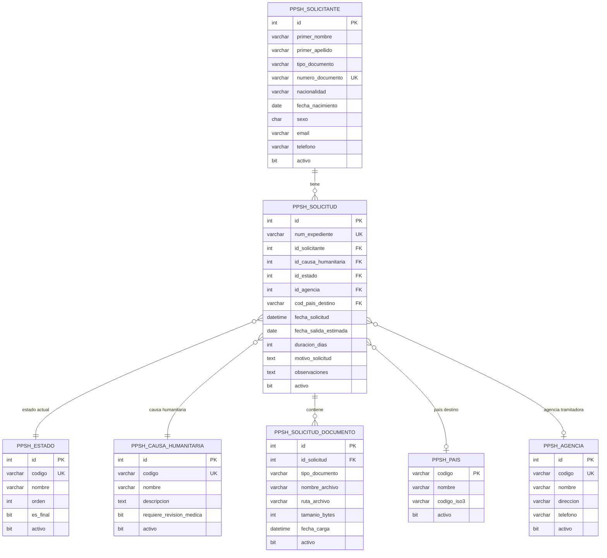
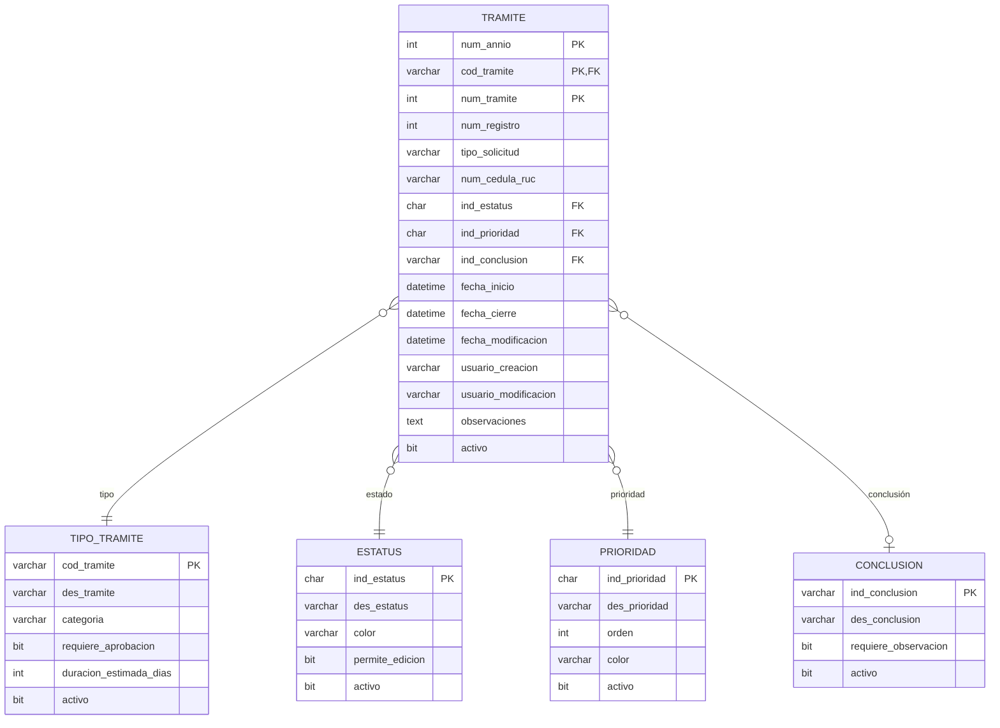
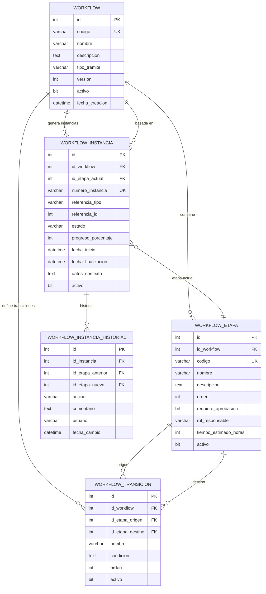
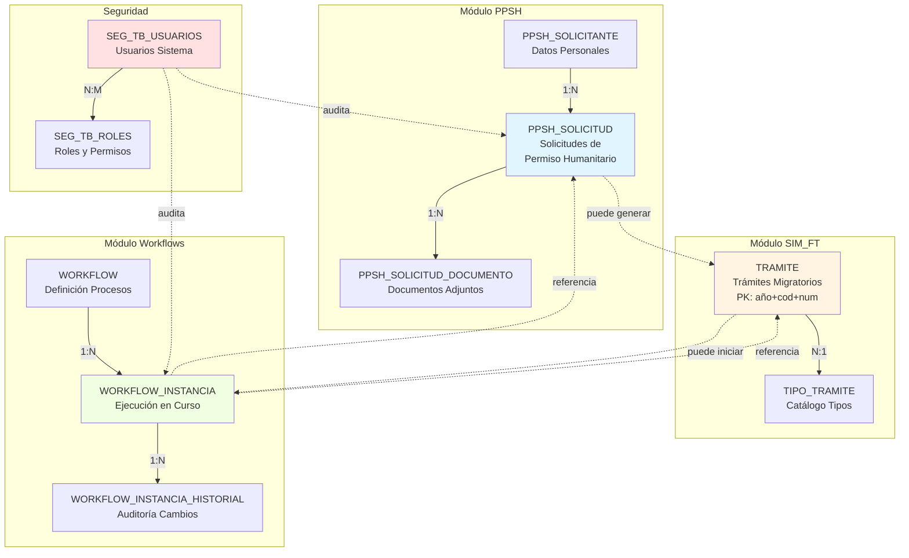
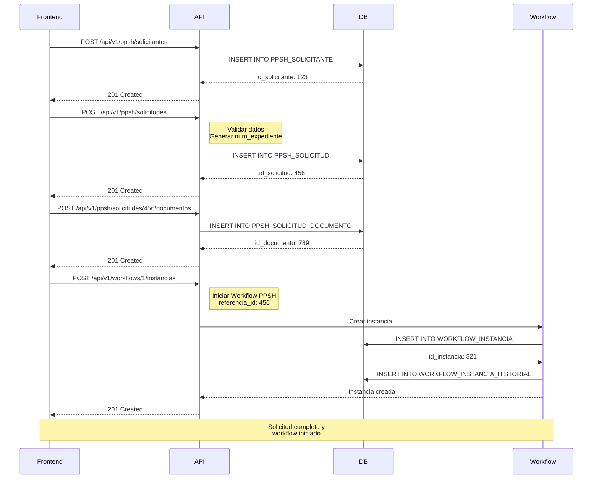

# 📖 DICCIONARIO DE DATOS COMPLETO
## Sistema de Trámites Migratorios de Panamá

**Versión**: 1.0  
**Fecha**: 25 de Octubre, 2025  
**Base de Datos**: SQL Server 2019  
**Total de Tablas**: 34 tablas principales

---

## 📋 Tabla de Contenidos

- [1. Módulo PPSH (Permiso Provisorio)](#1-módulo-ppsh-permiso-provisorio)
- [2. Módulo SIM_FT (Sistema Integrado de Migración)](#2-módulo-sim_ft-sistema-integrado-de-migración)
- [3. Módulo de Workflows](#3-módulo-de-workflows)
- [4. Tablas de Seguridad](#4-tablas-de-seguridad)
- [5. Tablas Generales (Catálogos)](#5-tablas-generales-catálogos)
- [6. Índices y Constraints](#6-índices-y-constraints)
- [7. Diagramas ER](#7-diagramas-er)

---

## 1. Módulo PPSH (Permiso Provisorio)

### 1.1 Tabla: `PPSH_SOLICITUD`

**Descripción**: Tabla principal de solicitudes de Permiso Provisorio de Salida Humanitaria.

**Esquema**: `dbo`

| Columna | Tipo de Dato | Nulo | Default | PK | FK | Descripción |
|---------|--------------|------|---------|----|----|-------------|
| `id_solicitud` | INT | NO | IDENTITY(1,1) | ✅ | | Identificador único de la solicitud |
| `numero_solicitud` | NVARCHAR(50) | NO | - | | | Número único formato: PPSH-YYYY-NNNN |
| `id_solicitante` | INT | NO | - | | ✅ | ID del solicitante (FK) |
| `cod_causa_humanitaria` | NVARCHAR(20) | NO | - | | ✅ | Código de causa humanitaria |
| `cod_estado` | NVARCHAR(20) | NO | 'PENDIENTE' | | ✅ | Estado actual de la solicitud |
| `pais_destino` | NVARCHAR(100) | YES | NULL | | | País al que viajará |
| `fecha_solicitud` | DATETIME | NO | GETDATE() | | | Fecha de solicitud |
| `fecha_salida_estimada` | DATE | YES | NULL | | | Fecha estimada de salida |
| `duracion_dias` | INT | YES | NULL | | | Duración estimada en días |
| `fecha_ultima_actualizacion` | DATETIME | YES | NULL | | | Última actualización |
| `motivo_detallado` | NVARCHAR(MAX) | YES | NULL | | | Justificación detallada |
| `observaciones` | NVARCHAR(MAX) | YES | NULL | | | Observaciones adicionales |
| `fecha_aprobacion` | DATETIME | YES | NULL | | | Fecha de aprobación (si aplica) |
| `fecha_rechazo` | DATETIME | YES | NULL | | | Fecha de rechazo (si aplica) |
| `motivo_rechazo` | NVARCHAR(MAX) | YES | NULL | | | Motivo de rechazo |
| `aprobado_por` | INT | YES | NULL | | ✅ | Usuario que aprobó/rechazó |
| `activo` | BIT | NO | 1 | | | Registro activo |

**Índices**:
- `PK_PPSH_SOLICITUD`: PRIMARY KEY CLUSTERED (`id_solicitud`)
- `UK_PPSH_SOLICITUD_numero`: UNIQUE NONCLUSTERED (`numero_solicitud`)
- `IX_PPSH_SOLICITUD_solicitante`: NONCLUSTERED (`id_solicitante`)
- `IX_PPSH_SOLICITUD_estado`: NONCLUSTERED (`cod_estado`)
- `IX_PPSH_SOLICITUD_fecha`: NONCLUSTERED (`fecha_solicitud` DESC)

**Relationships**:
```sql
ALTER TABLE PPSH_SOLICITUD
ADD CONSTRAINT FK_PPSH_SOLICITUD_SOLICITANTE
FOREIGN KEY (id_solicitante) REFERENCES PPSH_SOLICITANTE(id_solicitante);

ALTER TABLE PPSH_SOLICITUD
ADD CONSTRAINT FK_PPSH_SOLICITUD_CAUSA
FOREIGN KEY (cod_causa_humanitaria) REFERENCES PPSH_CAUSA_HUMANITARIA(cod_causa);

ALTER TABLE PPSH_SOLICITUD
ADD CONSTRAINT FK_PPSH_SOLICITUD_ESTADO
FOREIGN KEY (cod_estado) REFERENCES PPSH_ESTADO(cod_estado);
```

### 1.2 Tabla: `PPSH_SOLICITANTE`

**Descripción**: Información de solicitantes del PPSH.

| Columna | Tipo de Dato | Nulo | Default | PK | FK | Descripción |
|---------|--------------|------|---------|----|----|-------------|
| `id_solicitante` | INT | NO | IDENTITY(1,1) | ✅ | | ID único del solicitante |
| `tipo_documento` | NVARCHAR(20) | NO | - | | | CEDULA, PASAPORTE, OTRO |
| `numero_documento` | NVARCHAR(50) | NO | - | | | Número de documento |
| `nombre_completo` | NVARCHAR(200) | NO | - | | | Nombre completo |
| `fecha_nacimiento` | DATE | NO | - | | | Fecha de nacimiento |
| `nacionalidad` | NVARCHAR(100) | NO | - | | | Nacionalidad |
| `sexo` | CHAR(1) | YES | NULL | | | M=Masculino, F=Femenino |
| `email` | NVARCHAR(200) | YES | NULL | | | Email de contacto |
| `telefono` | NVARCHAR(50) | YES | NULL | | | Teléfono de contacto |
| `direccion` | NVARCHAR(500) | YES | NULL | | | Dirección actual |
| `contacto_emergencia_nombre` | NVARCHAR(200) | YES | NULL | | | Nombre contacto emergencia |
| `contacto_emergencia_telefono` | NVARCHAR(50) | YES | NULL | | | Teléfono emergencia |
| `contacto_emergencia_relacion` | NVARCHAR(100) | YES | NULL | | | Relación con solicitante |
| `fecha_creacion` | DATETIME | NO | GETDATE() | | | Fecha de registro |
| `activo` | BIT | NO | 1 | | | Registro activo |

**Índices**:
- `PK_PPSH_SOLICITANTE`: PRIMARY KEY (`id_solicitante`)
- `UK_PPSH_SOLICITANTE_documento`: UNIQUE (`tipo_documento`, `numero_documento`)
- `IX_PPSH_SOLICITANTE_email`: NONCLUSTERED (`email`)

**Constraints**:
```sql
ALTER TABLE PPSH_SOLICITANTE
ADD CONSTRAINT CK_PPSH_SOLICITANTE_tipo_doc
CHECK (tipo_documento IN ('CEDULA', 'PASAPORTE', 'OTRO'));

ALTER TABLE PPSH_SOLICITANTE
ADD CONSTRAINT CK_PPSH_SOLICITANTE_sexo
CHECK (sexo IN ('M', 'F'));
```

### 1.3 Tabla: `PPSH_CAUSA_HUMANITARIA`

**Descripción**: Catálogo de causas humanitarias.

| Columna | Tipo de Dato | Nulo | Default | PK | Descripción |
|---------|--------------|------|---------|-------|-------------|
| `cod_causa` | NVARCHAR(20) | NO | - | ✅ | Código único de causa |
| `nombre_causa` | NVARCHAR(200) | NO | - | | Nombre de la causa |
| `descripcion` | NVARCHAR(500) | YES | NULL | | Descripción detallada |
| `requiere_revision_medica` | BIT | NO | 0 | | Indica si requiere revisión médica |
| `activo` | BIT | NO | 1 | | Catálogo activo |

**Datos Iniciales**:
```sql
INSERT INTO PPSH_CAUSA_HUMANITARIA (cod_causa, nombre_causa, requiere_revision_medica)
VALUES
    ('EMERG_MED', 'Emergencia Médica', 1),
    ('FALLE_FAM', 'Fallecimiento de Familiar', 0),
    ('ENFER_FAM', 'Enfermedad de Familiar', 1),
    ('CASO_ESP', 'Caso Especial', 0);
```

### 1.4 Tabla: `PPSH_ESTADO`

**Descripción**: Estados posibles de una solicitud PPSH.

| Columna | Tipo de Dato | Nulo | Default | PK | Descripción |
|---------|--------------|------|---------|-------|-------------|
| `cod_estado` | NVARCHAR(20) | NO | - | ✅ | Código único del estado |
| `nombre_estado` | NVARCHAR(100) | NO | - | | Nombre del estado |
| `descripcion` | NVARCHAR(500) | YES | NULL | | Descripción |
| `orden` | INT | NO | - | | Orden en el flujo |
| `es_final` | BIT | NO | 0 | | Indica si es estado final |
| `activo` | BIT | NO | 1 | | Estado activo |

**Datos Iniciales**:
```sql
INSERT INTO PPSH_ESTADO (cod_estado, nombre_estado, orden, es_final)
VALUES
    ('PENDIENTE', 'Pendiente de Revisión', 1, 0),
    ('REV_DOC', 'Revisión Documental', 2, 0),
    ('REV_MED', 'Revisión Médica', 3, 0),
    ('ENTREVISTA', 'En Entrevista', 4, 0),
    ('DECISION', 'En Decisión', 5, 0),
    ('APROBADO', 'Aprobado', 6, 1),
    ('RECHAZADO', 'Rechazado', 6, 1),
    ('CANCELADO', 'Cancelado', 6, 1);
```

### 1.5 Tabla: `PPSH_DOCUMENTO`

**Descripción**: Documentos adjuntos a solicitudes PPSH.

| Columna | Tipo de Dato | Nulo | Default | PK | FK | Descripción |
|---------|--------------|------|---------|----|----|-------------|
| `id_documento` | INT | NO | IDENTITY(1,1) | ✅ | | ID único del documento |
| `id_solicitud` | INT | NO | - | | ✅ | Solicitud asociada |
| `tipo_documento` | NVARCHAR(100) | NO | - | | | Tipo: PASAPORTE, CERT_MEDICO, CARTA_HOSPITAL, etc. |
| `nombre_archivo` | NVARCHAR(500) | NO | - | | | Nombre del archivo |
| `ruta_archivo` | NVARCHAR(1000) | NO | - | | | Ruta en servidor |
| `tamano_bytes` | BIGINT | YES | NULL | | | Tamaño en bytes |
| `mime_type` | NVARCHAR(100) | YES | NULL | | | Tipo MIME |
| `hash_archivo` | NVARCHAR(64) | YES | NULL | | | Hash SHA256 para validación |
| `fecha_carga` | DATETIME | NO | GETDATE() | | | Fecha de carga |
| `cargado_por` | INT | YES | NULL | | ✅ | Usuario que cargó |
| `validado` | BIT | NO | 0 | | | Documento validado |
| `fecha_validacion` | DATETIME | YES | NULL | | | Fecha de validación |
| `validado_por` | INT | YES | NULL | | ✅ | Usuario que validó |
| `observaciones` | NVARCHAR(500) | YES | NULL | | | Observaciones |
| `activo` | BIT | NO | 1 | | | Documento activo |

**Índices**:
- `PK_PPSH_DOCUMENTO`: PRIMARY KEY (`id_documento`)
- `IX_PPSH_DOCUMENTO_solicitud`: NONCLUSTERED (`id_solicitud`)
- `IX_PPSH_DOCUMENTO_tipo`: NONCLUSTERED (`tipo_documento`)

### 1.6 Tabla: `PPSH_REVISION_MEDICA`

**Descripción**: Revisiones médicas de solicitudes PPSH.

| Columna | Tipo de Dato | Nulo | Default | PK | FK | Descripción |
|---------|--------------|------|---------|----|----|-------------|
| `id_revision` | INT | NO | IDENTITY(1,1) | ✅ | | ID único de revisión |
| `id_solicitud` | INT | NO | - | | ✅ | Solicitud revisada |
| `medico_revisor` | INT | NO | - | | ✅ | Usuario médico que revisa |
| `fecha_revision` | DATETIME | NO | GETDATE() | | | Fecha de revisión |
| `diagnostico_validado` | BIT | YES | NULL | | | ¿Diagnóstico es válido? |
| `urgencia_nivel` | NVARCHAR(20) | YES | NULL | | | BAJO, MEDIO, ALTO, CRITICO |
| `duracion_recomendada_dias` | INT | YES | NULL | | | Días recomendados |
| `observaciones_medicas` | NVARCHAR(MAX) | YES | NULL | | | Observaciones del médico |
| `recomendacion` | NVARCHAR(50) | NO | - | | | APROBAR, RECHAZAR, SOLICITAR_INFO |
| `justificacion_recomendacion` | NVARCHAR(MAX) | YES | NULL | | | Justificación |
| `activo` | BIT | NO | 1 | | | Registro activo |

**Índices**:
- `PK_PPSH_REVISION_MEDICA`: PRIMARY KEY (`id_revision`)
- `IX_PPSH_REVISION_MEDICA_solicitud`: NONCLUSTERED (`id_solicitud`)

### 1.7 Tabla: `PPSH_ENTREVISTA`

**Descripción**: Entrevistas realizadas a solicitantes PPSH.

| Columna | Tipo de Dato | Nulo | Default | PK | FK | Descripción |
|---------|--------------|------|---------|----|----|-------------|
| `id_entrevista` | INT | NO | IDENTITY(1,1) | ✅ | | ID único de entrevista |
| `id_solicitud` | INT | NO | - | | ✅ | Solicitud entrevistada |
| `oficial_entrevistador` | INT | NO | - | | ✅ | Usuario que entrevista |
| `fecha_programada` | DATETIME | YES | NULL | | | Fecha programada |
| `fecha_realizada` | DATETIME | YES | NULL | | | Fecha real de entrevista |
| `duracion_minutos` | INT | YES | NULL | | | Duración en minutos |
| `lugar_entrevista` | NVARCHAR(200) | YES | NULL | | | Lugar donde se realizó |
| `preguntas_respuestas` | NVARCHAR(MAX) | YES | NULL | | | JSON con preguntas y respuestas |
| `documentos_verificados` | BIT | YES | NULL | | | ¿Se verificaron documentos originales? |
| `resultado` | NVARCHAR(50) | YES | NULL | | | VERIFICADO, REQUIERE_ACLARA, INCONSISTENTE |
| `observaciones` | NVARCHAR(MAX) | YES | NULL | | | Observaciones del oficial |
| `activo` | BIT | NO | 1 | | | Registro activo |

**Índices**:
- `PK_PPSH_ENTREVISTA`: PRIMARY KEY (`id_entrevista`)
- `IX_PPSH_ENTREVISTA_solicitud`: NONCLUSTERED (`id_solicitud`)
- `IX_PPSH_ENTREVISTA_fecha`: NONCLUSTERED (`fecha_programada`)

### 1.8 Tabla: `PPSH_COMENTARIO`

**Descripción**: Comentarios y bitácora de una solicitud PPSH.

| Columna | Tipo de Dato | Nulo | Default | PK | FK | Descripción |
|---------|--------------|------|---------|----|----|-------------|
| `id_comentario` | INT | NO | IDENTITY(1,1) | ✅ | | ID único del comentario |
| `id_solicitud` | INT | NO | - | | ✅ | Solicitud comentada |
| `usuario` | INT | NO | - | | ✅ | Usuario que comenta |
| `fecha_comentario` | DATETIME | NO | GETDATE() | | | Fecha del comentario |
| `tipo_comentario` | NVARCHAR(50) | NO | - | | | NOTA, OBSERVACION, SOLICITUD, RESPUESTA |
| `comentario` | NVARCHAR(MAX) | NO | - | | | Texto del comentario |
| `es_interno` | BIT | NO | 0 | | | Comentario visible solo internamente |
| `activo` | BIT | NO | 1 | | | Comentario activo |

**Índices**:
- `PK_PPSH_COMENTARIO`: PRIMARY KEY (`id_comentario`)
- `IX_PPSH_COMENTARIO_solicitud`: NONCLUSTERED (`id_solicitud`, `fecha_comentario` DESC)

---

## 2. Módulo SIM_FT (Sistema Integrado de Migración)

### 2.1 Tabla: `TRAMITE`

**Descripción**: Tabla principal del Sistema Integrado de Migración - Flujo de Trabajo. Gestiona todos los trámites migratorios con identificadores compuestos y seguimiento completo.

**Esquema**: `dbo`

| Columna | Tipo de Dato | Nulo | Default | PK | FK | Descripción |
|---------|--------------|------|---------|----|----|-------------|
| `num_annio` | INT | NO | - | ✅ | | Año del trámite (parte de PK compuesta) |
| `cod_tramite` | VARCHAR(10) | NO | - | ✅ | ✅ | Código del tipo de trámite (FK a TIPO_TRAMITE) |
| `num_tramite` | INT | NO | - | ✅ | | Número secuencial del trámite |
| `num_registro` | INT | NO | - | | | Número de registro |
| `tipo_solicitud` | VARCHAR(50) | YES | NULL | | | Tipo específico de solicitud |
| `num_cedula_ruc` | VARCHAR(20) | YES | NULL | | | Cédula o RUC del solicitante |
| `ind_estatus` | CHAR(1) | NO | 'A' | | ✅ | Estado: A=Activo, I=Inactivo, C=Cerrado |
| `ind_prioridad` | CHAR(1) | NO | 'N' | | ✅ | Prioridad: A=Alta, M=Media, B=Baja, N=Normal |
| `ind_conclusion` | VARCHAR(10) | YES | NULL | | ✅ | Tipo de conclusión del trámite |
| `fecha_inicio` | DATETIME | NO | GETDATE() | | | Fecha de inicio del trámite |
| `fecha_cierre` | DATETIME | YES | NULL | | | Fecha de cierre (si aplica) |
| `fecha_modificacion` | DATETIME | YES | NULL | | | Última modificación |
| `usuario_creacion` | VARCHAR(50) | YES | NULL | | | Usuario que creó el registro |
| `usuario_modificacion` | VARCHAR(50) | YES | NULL | | | Usuario que modificó |
| `observaciones` | VARCHAR(MAX) | YES | NULL | | | Observaciones del trámite |
| `activo` | BIT | NO | 1 | | | Soft delete (1=activo, 0=eliminado) |

**Clave Primaria Compuesta**: (`num_annio`, `cod_tramite`, `num_tramite`)

**Índices**:
- `PK_TRAMITE`: PRIMARY KEY CLUSTERED (`num_annio`, `cod_tramite`, `num_tramite`)
- `IX_TRAMITE_cedula`: NONCLUSTERED (`num_cedula_ruc`)
- `IX_TRAMITE_estatus`: NONCLUSTERED (`ind_estatus`)
- `IX_TRAMITE_fecha`: NONCLUSTERED (`fecha_inicio` DESC)

**Foreign Keys**:
- `FK_TRAMITE_tipo`: FOREIGN KEY (`cod_tramite`) REFERENCES `TIPO_TRAMITE`(`cod_tramite`)
- `FK_TRAMITE_estatus`: FOREIGN KEY (`ind_estatus`) REFERENCES `ESTATUS`(`ind_estatus`)
- `FK_TRAMITE_prioridad`: FOREIGN KEY (`ind_prioridad`) REFERENCES `PRIORIDAD`(`ind_prioridad`)

**Ejemplo de Datos**:
```sql
INSERT INTO TRAMITE (num_annio, cod_tramite, num_tramite, num_registro, num_cedula_ruc, ind_estatus, ind_prioridad)
VALUES 
    (2025, 'RES_TEMP', 1, 1001, '8-123-4567', 'A', 'N'),
    (2025, 'VISA_TRAB', 2, 1002, 'E-8-12345', 'A', 'A');
```

### 2.2 Tabla: `TIPO_TRAMITE`

**Descripción**: Catálogo de tipos de trámites disponibles en el sistema SIM_FT.

| Columna | Tipo de Dato | Nulo | Default | PK | FK | Descripción |
|---------|--------------|------|---------|----|----|-------------|
| `cod_tramite` | VARCHAR(10) | NO | - | ✅ | | Código único del tipo de trámite |
| `des_tramite` | VARCHAR(200) | NO | - | | | Descripción del tipo de trámite |
| `categoria` | VARCHAR(50) | YES | NULL | | | Categoría del trámite |
| `requiere_aprobacion` | BIT | NO | 0 | | | Indica si requiere aprobación |
| `duracion_estimada_dias` | INT | YES | NULL | | | Días estimados de procesamiento |
| `activo` | BIT | NO | 1 | | | Tipo de trámite activo |

**Índices**:
- `PK_TIPO_TRAMITE`: PRIMARY KEY (`cod_tramite`)

### 2.3 Tabla: `ESTATUS`

**Descripción**: Catálogo de estados posibles para los trámites.

| Columna | Tipo de Dato | Nulo | Default | PK | FK | Descripción |
|---------|--------------|------|---------|----|----|-------------|
| `ind_estatus` | CHAR(1) | NO | - | ✅ | | Indicador de estatus (A/I/C) |
| `des_estatus` | VARCHAR(100) | NO | - | | | Descripción del estatus |
| `color` | VARCHAR(20) | YES | NULL | | | Color para UI |
| `permite_edicion` | BIT | NO | 1 | | | Si permite editar el trámite |
| `activo` | BIT | NO | 1 | | | Estatus activo |

**Valores estándar**:
- `A` - Activo
- `I` - Inactivo
- `C` - Cerrado

### 2.4 Tabla: `PRIORIDAD`

**Descripción**: Catálogo de niveles de prioridad para trámites.

| Columna | Tipo de Dato | Nulo | Default | PK | FK | Descripción |
|---------|--------------|------|---------|----|----|-------------|
| `ind_prioridad` | CHAR(1) | NO | - | ✅ | | Indicador de prioridad |
| `des_prioridad` | VARCHAR(100) | NO | - | | | Descripción de la prioridad |
| `orden` | INT | NO | - | | | Orden de importancia (1=mayor) |
| `color` | VARCHAR(20) | YES | NULL | | | Color para UI |
| `activo` | BIT | NO | 1 | | | Prioridad activa |

**Valores estándar**:
- `A` - Alta (Urgente)
- `M` - Media
- `B` - Baja
- `N` - Normal

### 2.5 Tabla: `CONCLUSION`

**Descripción**: Catálogo de tipos de conclusión para trámites finalizados.

| Columna | Tipo de Dato | Nulo | Default | PK | FK | Descripción |
|---------|--------------|------|---------|----|----|-------------|
| `ind_conclusion` | VARCHAR(10) | NO | - | ✅ | | Indicador de conclusión |
| `des_conclusion` | VARCHAR(200) | NO | - | | | Descripción de la conclusión |
| `es_exitosa` | BIT | NO | 0 | | | Indica si es conclusión exitosa |
| `requiere_seguimiento` | BIT | NO | 0 | | | Requiere seguimiento posterior |
| `activo` | BIT | NO | 1 | | | Conclusión activa |

**Valores posibles**:
- Aprobado
- Rechazado
- Cancelado
- En espera
- Transferido

---

## 3. Módulo de Workflows

### 3.1 Tabla: `WORKFLOW`

**Descripción**: Definición de workflows dinámicos personalizables.

| Columna | Tipo de Dato | Nulo | Default | PK | FK | Descripción |
|---------|--------------|------|---------|----|----|-------------|
| `id` | INT | NO | IDENTITY(1,1) | ✅ | | ID único del workflow |
| `codigo` | VARCHAR(50) | NO | - | | | Código único alfanumérico |
| `nombre` | VARCHAR(255) | NO | - | | | Nombre descriptivo |
| `descripcion` | TEXT | YES | NULL | | | Descripción detallada |
| `version` | VARCHAR(20) | NO | '1.0' | | | Versión del workflow |
| `estado` | VARCHAR(20) | NO | - | | | Estado (BORRADOR, ACTIVO, etc.) |
| `color_hex` | VARCHAR(7) | YES | NULL | | | Color para UI |
| `icono` | VARCHAR(50) | YES | NULL | | | Icono identificador |
| `categoria` | VARCHAR(100) | YES | NULL | | | Categoría del workflow |
| `requiere_autenticacion` | BIT | NO | 1 | | | Requiere login |
| `es_publico` | BIT | NO | 0 | | | Acceso público |
| `perfiles_creadores` | JSON | YES | NULL | | | Perfiles permitidos |
| `activo` | BIT | NO | 1 | | | Workflow activo |
| `created_at` | DATETIME | NO | GETDATE() | | | Fecha de creación |
| `created_by` | VARCHAR(17) | YES | NULL | | | Usuario creador |
| `updated_at` | DATETIME | YES | NULL | | | Última actualización |
| `updated_by` | VARCHAR(17) | YES | NULL | | | Usuario modificador |

**Índices**:
- `PK_WORKFLOW`: PRIMARY KEY (`id`)
- `UK_WORKFLOW_codigo`: UNIQUE (`codigo`)
- `IX_WORKFLOW_categoria`: NONCLUSTERED (`categoria`)
- `IX_WORKFLOW_estado`: NONCLUSTERED (`estado`)

### 3.2 Tabla: `WORKFLOW_ETAPA`

**Descripción**: Etapas que componen un workflow.

| Columna | Tipo de Dato | Nulo | Default | PK | FK | Descripción |
|---------|--------------|------|---------|----|----|-------------|
| `id` | INT | NO | IDENTITY(1,1) | ✅ | | ID único de la etapa |
| `workflow_id` | INT | NO | - | | ✅ | Workflow al que pertenece |
| `codigo` | VARCHAR(50) | NO | - | | | Código único de la etapa |
| `nombre` | VARCHAR(255) | NO | - | | | Nombre de la etapa |
| `descripcion` | TEXT | YES | NULL | | | Descripción de la etapa |
| `tipo_etapa` | VARCHAR(50) | NO | 'ETAPA' | | | Tipo (ETAPA, DECISION, etc.) |
| `orden` | INT | NO | - | | | Orden secuencial (1, 2, 3...) |
| `posicion_x` | INT | YES | NULL | | | Posición X para diagrama |
| `posicion_y` | INT | YES | NULL | | | Posición Y para diagrama |
| `perfiles_permitidos` | JSON | YES | NULL | | | Perfiles con acceso |
| `titulo_formulario` | VARCHAR(500) | YES | NULL | | | Título del formulario |
| `bajada_formulario` | TEXT | YES | NULL | | | Descripción formulario |
| `es_etapa_inicial` | BIT | NO | 0 | | | Es primera etapa |
| `es_etapa_final` | BIT | NO | 0 | | | Es última etapa |
| `requiere_validacion` | BIT | NO | 0 | | | Requiere validación |
| `permite_edicion_posterior` | BIT | NO | 0 | | | Permite editar después |
| `tiempo_estimado_minutos` | INT | YES | NULL | | | Duración estimada |
| `reglas_transicion` | JSON | YES | NULL | | | Reglas de transición |
| `activo` | BIT | NO | 1 | | | Etapa activa |
| `created_at` | DATETIME | NO | GETDATE() | | | Fecha de creación |
| `created_by` | VARCHAR(17) | YES | NULL | | | Usuario creador |
| `updated_at` | DATETIME | YES | NULL | | | Última actualización |
| `updated_by` | VARCHAR(17) | YES | NULL | | | Usuario modificador |

**Índices**:
- `PK_WORKFLOW_ETAPA`: PRIMARY KEY (`id`)
- `IX_WORKFLOW_ETAPA_workflow`: NONCLUSTERED (`workflow_id`, `orden`)
- `FK_WORKFLOW_ETAPA_workflow`: FOREIGN KEY (`workflow_id`) REFERENCES `WORKFLOW`(`id`)

### 3.3 Tabla: `WORKFLOW_CONEXION`

**Descripción**: Conexiones entre etapas (flechas en el diagrama de flujo).

| Columna | Tipo de Dato | Nulo | Default | PK | FK | Descripción |
|---------|--------------|------|---------|----|----|-------------|
| `id` | INT | NO | IDENTITY(1,1) | ✅ | | ID único de la conexión |
| `workflow_id` | INT | NO | - | | ✅ | Workflow al que pertenece |
| `etapa_origen_id` | INT | NO | - | | ✅ | Etapa de origen |
| `etapa_destino_id` | INT | NO | - | | ✅ | Etapa de destino |
| `nombre` | VARCHAR(255) | YES | NULL | | | Etiqueta de la conexión |
| `condicion` | JSON | YES | NULL | | | Condiciones para seguir esta ruta |
| `es_predeterminada` | BIT | NO | 0 | | | ¿Es la ruta predeterminada? |
| `activo` | BIT | NO | 1 | | | Conexión activa |
| `created_at` | DATETIME | NO | GETDATE() | | | Fecha de creación |
| `created_by` | VARCHAR(17) | YES | NULL | | | Usuario creador |

**Índices**:
- `PK_WORKFLOW_CONEXION`: PRIMARY KEY (`id`)
- `IX_WORKFLOW_CONEXION_workflow`: NONCLUSTERED (`workflow_id`)
- `FK_WORKFLOW_CONEXION_origen`: FOREIGN KEY (`etapa_origen_id`) REFERENCES `WORKFLOW_ETAPA`(`id`)
- `FK_WORKFLOW_CONEXION_destino`: FOREIGN KEY (`etapa_destino_id`) REFERENCES `WORKFLOW_ETAPA`(`id`)

### 3.4 Tabla: `WORKFLOW_PREGUNTA`

**Descripción**: Preguntas/Campos dentro de una etapa (formularios).

| Columna | Tipo de Dato | Nulo | Default | PK | FK | Descripción |
|---------|--------------|------|---------|----|----|-------------|
| `id` | INT | NO | IDENTITY(1,1) | ✅ | | ID único de la pregunta |
| `etapa_id` | INT | NO | - | | ✅ | Etapa a la que pertenece |
| `codigo` | VARCHAR(100) | NO | - | | | Código único (name del input) |
| `texto_pregunta` | TEXT | NO | - | | | Texto de la pregunta |
| `tipo_campo` | VARCHAR(50) | NO | - | | | TEXT, TEXTAREA, SELECT, etc. |
| `orden` | INT | NO | - | | | Orden de visualización |
| `requerida` | BIT | NO | 1 | | | ¿Es campo obligatorio? |
| `placeholder` | VARCHAR(255) | YES | NULL | | | Placeholder del input |
| `valor_defecto` | TEXT | YES | NULL | | | Valor por defecto |
| `opciones` | JSON | YES | NULL | | | Opciones para SELECT/RADIO |
| `validacion` | JSON | YES | NULL | | | Reglas de validación |
| `ayuda` | TEXT | YES | NULL | | | Texto de ayuda |
| `mostrar_si` | JSON | YES | NULL | | | Condiciones para mostrar |
| `activo` | BIT | NO | 1 | | | Pregunta activa |
| `created_at` | DATETIME | NO | GETDATE() | | | Fecha de creación |
| `created_by` | VARCHAR(17) | YES | NULL | | | Usuario creador |
| `updated_at` | DATETIME | YES | NULL | | | Última actualización |
| `updated_by` | VARCHAR(17) | YES | NULL | | | Usuario modificador |

**Índices**:
- `PK_WORKFLOW_PREGUNTA`: PRIMARY KEY (`id`)
- `IX_WORKFLOW_PREGUNTA_etapa`: NONCLUSTERED (`etapa_id`, `orden`)
- `FK_WORKFLOW_PREGUNTA_etapa`: FOREIGN KEY (`etapa_id`) REFERENCES `WORKFLOW_ETAPA`(`id`)

### 3.5 Tabla: `WORKFLOW_INSTANCIA`

**Descripción**: Instancias de ejecución de workflows (casos en proceso).

| Columna | Tipo de Dato | Nulo | Default | PK | FK | Descripción |
|---------|--------------|------|---------|----|----|-------------|
| `id` | INT | NO | IDENTITY(1,1) | ✅ | | ID único de la instancia |
| `workflow_id` | INT | NO | - | | ✅ | Workflow ejecutado |
| `num_expediente` | VARCHAR(50) | NO | - | | | Número de expediente único |
| `nombre_instancia` | VARCHAR(255) | YES | NULL | | | Nombre descriptivo del caso |
| `estado` | VARCHAR(20) | NO | 'INICIADO' | | | INICIADO, EN_PROGRESO, COMPLETADO, CANCELADO |
| `etapa_actual_id` | INT | YES | NULL | | ✅ | Etapa actual |
| `creado_por_user_id` | VARCHAR(17) | NO | - | | | Usuario creador |
| `asignado_a_user_id` | VARCHAR(17) | YES | NULL | | | Usuario asignado |
| `fecha_inicio` | DATETIME | NO | GETDATE() | | | Fecha de inicio |
| `fecha_estimada_fin` | DATETIME | YES | NULL | | | Fecha estimada de finalización |
| `fecha_fin` | DATETIME | YES | NULL | | | Fecha real de finalización |
| `metadata_adicional` | JSON | YES | NULL | | | Datos extras del caso |
| `prioridad` | VARCHAR(10) | NO | 'NORMAL' | | | BAJA, NORMAL, ALTA, URGENTE |
| `activo` | BIT | NO | 1 | | | Instancia activa |
| `created_at` | DATETIME | NO | GETDATE() | | | Fecha de creación |
| `updated_at` | DATETIME | YES | NULL | | | Última actualización |
| `updated_by` | VARCHAR(17) | YES | NULL | | | Usuario modificador |

**Índices**:
- `PK_WORKFLOW_INSTANCIA`: PRIMARY KEY (`id`)
- `UK_WORKFLOW_INSTANCIA_expediente`: UNIQUE (`num_expediente`)
- `IX_WORKFLOW_INSTANCIA_workflow`: NONCLUSTERED (`workflow_id`)
- `IX_WORKFLOW_INSTANCIA_estado`: NONCLUSTERED (`estado`)
- `IX_WORKFLOW_INSTANCIA_creador`: NONCLUSTERED (`creado_por_user_id`)

### 3.6 Tabla: `WORKFLOW_RESPUESTA_ETAPA`

**Descripción**: Conjunto de respuestas de una etapa completada.

| Columna | Tipo de Dato | Nulo | Default | PK | FK | Descripción |
|---------|--------------|------|---------|----|----|-------------|
| `id` | INT | NO | IDENTITY(1,1) | ✅ | | ID único |
| `instancia_id` | INT | NO | - | | ✅ | Instancia del workflow |
| `etapa_id` | INT | NO | - | | ✅ | Etapa respondida |
| `completada` | BIT | NO | 0 | | | ¿Etapa completada? |
| `fecha_inicio` | DATETIME | NO | GETDATE() | | | Fecha de inicio |
| `fecha_completado` | DATETIME | YES | NULL | | | Fecha de completitud |
| `completado_por_user_id` | VARCHAR(17) | YES | NULL | | | Usuario que completó |
| `created_at` | DATETIME | NO | GETDATE() | | | Fecha de creación |
| `updated_at` | DATETIME | YES | NULL | | | Última actualización |
| `updated_by` | VARCHAR(17) | YES | NULL | | | Usuario modificador |

**Índices**:
- `PK_WORKFLOW_RESPUESTA_ETAPA`: PRIMARY KEY (`id`)
- `IX_WORKFLOW_RESPUESTA_ETAPA_instancia`: NONCLUSTERED (`instancia_id`)
- `UK_WORKFLOW_RESPUESTA_ETAPA`: UNIQUE (`instancia_id`, `etapa_id`)

### 3.7 Tabla: `WORKFLOW_RESPUESTA`

**Descripción**: Respuestas individuales a preguntas en una instancia.

| Columna | Tipo de Dato | Nulo | Default | PK | FK | Descripción |
|---------|--------------|------|---------|----|----|-------------|
| `id` | INT | NO | IDENTITY(1,1) | ✅ | | ID único |
| `respuesta_etapa_id` | INT | NO | - | | ✅ | Respuesta de etapa |
| `pregunta_id` | INT | NO | - | | ✅ | Pregunta respondida |
| `valor_respuesta` | TEXT | YES | NULL | | | Valor de la respuesta |
| `archivo_adjunto` | VARCHAR(1000) | YES | NULL | | | Ruta del archivo (si aplica) |
| `metadata` | JSON | YES | NULL | | | Metadata adicional |
| `created_at` | DATETIME | NO | GETDATE() | | | Fecha de creación |
| `created_by` | VARCHAR(17) | YES | NULL | | | Usuario que respondió |
| `updated_at` | DATETIME | YES | NULL | | | Última actualización |
| `updated_by` | VARCHAR(17) | YES | NULL | | | Usuario modificador |

**Índices**:
- `PK_WORKFLOW_RESPUESTA`: PRIMARY KEY (`id`)
- `IX_WORKFLOW_RESPUESTA_etapa`: NONCLUSTERED (`respuesta_etapa_id`)
- `UK_WORKFLOW_RESPUESTA`: UNIQUE (`respuesta_etapa_id`, `pregunta_id`)

### 3.8 Tabla: `WORKFLOW_INSTANCIA_HISTORIAL`

**Descripción**: Historial de cambios y transiciones en una instancia.

| Columna | Tipo de Dato | Nulo | Default | PK | FK | Descripción |
|---------|--------------|------|---------|----|----|-------------|
| `id` | INT | NO | IDENTITY(1,1) | ✅ | | ID único |
| `instancia_id` | INT | NO | - | | ✅ | Instancia del workflow |
| `etapa_anterior_id` | INT | YES | NULL | | ✅ | Etapa anterior (si transición) |
| `etapa_nueva_id` | INT | YES | NULL | | ✅ | Nueva etapa |
| `accion` | VARCHAR(100) | NO | - | | | Tipo de acción realizada |
| `estado_anterior` | VARCHAR(20) | YES | NULL | | | Estado previo |
| `estado_nuevo` | VARCHAR(20) | YES | NULL | | | Estado nuevo |
| `descripcion` | TEXT | YES | NULL | | | Descripción del cambio |
| `metadata` | JSON | YES | NULL | | | Datos adicionales |
| `created_at` | DATETIME | NO | GETDATE() | | | Fecha del cambio |
| `created_by` | VARCHAR(17) | YES | NULL | | | Usuario que realizó |

**Índices**:
- `PK_WORKFLOW_INSTANCIA_HISTORIAL`: PRIMARY KEY (`id`)
- `IX_WORKFLOW_INSTANCIA_HISTORIAL_instancia`: NONCLUSTERED (`instancia_id`, `created_at` DESC)

### 3.9 Tabla: `WORKFLOW_COMENTARIO`

**Descripción**: Comentarios en instancias de workflow.

| Columna | Tipo de Dato | Nulo | Default | PK | FK | Descripción |
|---------|--------------|------|---------|----|----|-------------|
| `id` | INT | NO | IDENTITY(1,1) | ✅ | | ID único |
| `instancia_id` | INT | NO | - | | ✅ | Instancia del workflow |
| `etapa_id` | INT | YES | NULL | | ✅ | Etapa asociada (opcional) |
| `comentario` | TEXT | NO | - | | | Texto del comentario |
| `es_interno` | BIT | NO | 0 | | | ¿Solo visible internamente? |
| `created_at` | DATETIME | NO | GETDATE() | | | Fecha del comentario |
| `created_by` | VARCHAR(17) | YES | NULL | | | Usuario que comentó |

**Índices**:
- `PK_WORKFLOW_COMENTARIO`: PRIMARY KEY (`id`)
- `IX_WORKFLOW_COMENTARIO_instancia`: NONCLUSTERED (`instancia_id`, `created_at` DESC)

---

## 4. Tablas de Seguridad

### 4.1 Tabla: `SEG_TB_USUARIOS`

**Descripción**: Usuarios del sistema.

| Columna | Tipo de Dato | Nulo | Default | PK | Descripción |
|---------|--------------|------|---------|-------|-------------|
| `id_usuario` | INT | NO | IDENTITY(1,1) | ✅ | ID único del usuario |
| `username` | NVARCHAR(100) | NO | - | | Nombre de usuario (login) |
| `email` | NVARCHAR(200) | NO | - | | Email único |
| `password_hash` | NVARCHAR(255) | NO | - | | Hash de contraseña |
| `nombre_completo` | NVARCHAR(200) | NO | - | | Nombre completo |
| `telefono` | NVARCHAR(50) | YES | NULL | | Teléfono |
| `activo` | BIT | NO | 1 | | Usuario activo |
| `fecha_creacion` | DATETIME | NO | GETDATE() | | Fecha de creación |
| `ultimo_login` | DATETIME | YES | NULL | | Último inicio de sesión |
| `intentos_fallidos` | INT | NO | 0 | | Intentos de login fallidos |
| `bloqueado` | BIT | NO | 0 | | Usuario bloqueado |
| `fecha_bloqueo` | DATETIME | YES | NULL | | Fecha de bloqueo |

**Índices**:
- `PK_SEG_TB_USUARIOS`: PRIMARY KEY (`id_usuario`)
- `UK_SEG_TB_USUARIOS_username`: UNIQUE (`username`)
- `UK_SEG_TB_USUARIOS_email`: UNIQUE (`email`)
- `IX_SEG_TB_USUARIOS_activo`: NONCLUSTERED (`activo`)

### 4.2 Tabla: `SEG_TB_ROLES`

**Descripción**: Roles de usuario.

| Columna | Tipo de Dato | Nulo | Default | PK | Descripción |
|---------|--------------|------|---------|-------|-------------|
| `id_rol` | INT | NO | IDENTITY(1,1) | ✅ | ID único del rol |
| `cod_rol` | NVARCHAR(50) | NO | - | | Código único |
| `nombre_rol` | NVARCHAR(100) | NO | - | | Nombre del rol |
| `descripcion` | NVARCHAR(500) | YES | NULL | | Descripción |
| `activo` | BIT | NO | 1 | | Rol activo |

**Datos Iniciales**:
```sql
INSERT INTO SEG_TB_ROLES (cod_rol, nombre_rol, descripcion)
VALUES
    ('ADMIN', 'Administrador', 'Acceso completo al sistema'),
    ('REVISOR', 'Revisor', 'Puede revisar documentos y trámites'),
    ('APROBADOR', 'Aprobador', 'Puede aprobar o rechazar trámites'),
    ('MEDICO', 'Médico', 'Acceso a revisión médica'),
    ('SOLICITANTE', 'Solicitante', 'Usuario que solicita trámites'),
    ('ENTREVISTADOR', 'Entrevistador', 'Realiza entrevistas');
```

### 4.3 Tabla: `SEG_TB_USUA_ROLE`

**Descripción**: Relación usuarios-roles (many-to-many).

| Columna | Tipo de Dato | Nulo | Default | PK | FK | Descripción |
|---------|--------------|------|---------|----|----|-------------|
| `id_usuario_rol` | INT | NO | IDENTITY(1,1) | ✅ | | ID único |
| `id_usuario` | INT | NO | - | | ✅ | Usuario |
| `id_rol` | INT | NO | - | | ✅ | Rol asignado |
| `fecha_asignacion` | DATETIME | NO | GETDATE() | | | Fecha de asignación |
| `asignado_por` | INT | YES | NULL | | ✅ | Quién asignó el rol |
| `activo` | BIT | NO | 1 | | | Asignación activa |

**Índices**:
- `PK_SEG_TB_USUA_ROLE`: PRIMARY KEY (`id_usuario_rol`)
- `UK_SEG_TB_USUA_ROLE`: UNIQUE (`id_usuario`, `id_rol`)
- `IX_SEG_TB_USUA_ROLE_usuario`: NONCLUSTERED (`id_usuario`)

### 4.4 Tabla: `SEG_TB_ERROR_LOG`

**Descripción**: Registro de errores del sistema.

| Columna | Tipo de Dato | Nulo | Default | Descripción |
|---------|--------------|------|---------|-------------|
| `id_error` | INT | NO | IDENTITY(1,1) | ID único del error |
| `fecha_error` | DATETIME | NO | GETDATE() | Fecha del error |
| `usuario_id` | INT | YES | NULL | Usuario que experimentó el error |
| `endpoint` | NVARCHAR(500) | YES | NULL | Endpoint donde ocurrió |
| `metodo_http` | NVARCHAR(10) | YES | NULL | GET, POST, PUT, DELETE |
| `codigo_error` | NVARCHAR(50) | YES | NULL | Código de error |
| `mensaje_error` | NVARCHAR(MAX) | YES | NULL | Mensaje del error |
| `stack_trace` | NVARCHAR(MAX) | YES | NULL | Stack trace completo |
| `datos_adicionales` | NVARCHAR(MAX) | YES | NULL | JSON con datos adicionales |

**Índices**:
- `PK_SEG_TB_ERROR_LOG`: PRIMARY KEY (`id_error`)
- `IX_SEG_TB_ERROR_LOG_fecha`: NONCLUSTERED (`fecha_error` DESC)

---

## 5. Tablas Generales (Catálogos)

### 5.1 Tabla: `SIM_GE_SEXO`

**Descripción**: Catálogo de géneros/sexos.

| Columna | Tipo de Dato | Nulo | Default | PK | Descripción |
|---------|--------------|------|---------|-------|-------------|
| `cod_sexo` | CHAR(1) | NO | - | ✅ | Código: M, F |
| `desc_sexo` | NVARCHAR(50) | NO | - | | Descripción |
| `activo` | BIT | NO | 1 | | Registro activo |

**Datos Iniciales**:
```sql
INSERT INTO SIM_GE_SEXO (cod_sexo, desc_sexo)
VALUES ('M', 'Masculino'), ('F', 'Femenino');
```

### 5.2 Tabla: `SIM_GE_EST_CIVIL`

**Descripción**: Catálogo de estados civiles.

| Columna | Tipo de Dato | Nulo | Default | PK | Descripción |
|---------|--------------|------|---------|-------|-------------|
| `cod_estado_civil` | NVARCHAR(10) | NO | - | ✅ | Código estado civil |
| `desc_estado_civil` | NVARCHAR(100) | NO | - | | Descripción |
| `activo` | BIT | NO | 1 | | Registro activo |

**Datos Iniciales**:
```sql
INSERT INTO SIM_GE_EST_CIVIL (cod_estado_civil, desc_estado_civil)
VALUES 
    ('SOL', 'Soltero/a'),
    ('CAS', 'Casado/a'),
    ('DIV', 'Divorciado/a'),
    ('VIU', 'Viudo/a'),
    ('UNL', 'Unión Libre');
```

### 5.3 Tabla: `SIM_GE_VIA_TRANSP`

**Descripción**: Catálogo de vías de transporte.

| Columna | Tipo de Dato | Nulo | Default | PK | Descripción |
|---------|--------------|------|---------|-------|-------------|
| `cod_via_transporte` | NVARCHAR(10) | NO | - | ✅ | Código vía |
| `desc_via_transporte` | NVARCHAR(100) | NO | - | | Descripción |
| `activo` | BIT | NO | 1 | | Registro activo |

**Datos Iniciales**:
```sql
INSERT INTO SIM_GE_VIA_TRANSP (cod_via_transporte, desc_via_transporte)
VALUES 
    ('AER', 'Aérea'),
    ('MAR', 'Marítima'),
    ('TER', 'Terrestre');
```

### 5.4 Tabla: `SIM_GE_TIPO_MOV`

**Descripción**: Catálogo de tipos de movimiento migratorio.

| Columna | Tipo de Dato | Nulo | Default | PK | Descripción |
|---------|--------------|------|---------|-------|-------------|
| `cod_tipo_mov` | NVARCHAR(10) | NO | - | ✅ | Código tipo movimiento |
| `desc_tipo_mov` | NVARCHAR(100) | NO | - | | Descripción |
| `es_entrada` | BIT | YES | NULL | | 1=Entrada, 0=Salida, NULL=Ambos |
| `activo` | BIT | NO | 1 | | Registro activo |

**Datos Iniciales**:
```sql
INSERT INTO SIM_GE_TIPO_MOV (cod_tipo_mov, desc_tipo_mov, es_entrada)
VALUES 
    ('ENT', 'Entrada al país', 1),
    ('SAL', 'Salida del país', 0),
    ('TRA', 'Tránsito', NULL);
```

### 5.5 Tabla: `SIM_GE_PAIS`

**Descripción**: Catálogo de países.

| Columna | Tipo de Dato | Nulo | Default | PK | Descripción |
|---------|--------------|------|---------|-------|-------------|
| `cod_pais` | NVARCHAR(3) | NO | - | ✅ | Código ISO 3166-1 alpha-3 |
| `nombre_pais` | NVARCHAR(200) | NO | - | | Nombre del país |
| `nombre_ingles` | NVARCHAR(200) | YES | NULL | | Nombre en inglés |
| `cod_iso2` | NVARCHAR(2) | YES | NULL | | Código ISO 3166-1 alpha-2 |
| `cod_continente` | NVARCHAR(3) | YES | NULL | | Continente |
| `activo` | BIT | NO | 1 | | País activo |

**Índices**:
- `PK_SIM_GE_PAIS`: PRIMARY KEY (`cod_pais`)
- `IX_SIM_GE_PAIS_nombre`: NONCLUSTERED (`nombre_pais`)

**Ejemplo de Datos**:
```sql
INSERT INTO SIM_GE_PAIS (cod_pais, nombre_pais, nombre_ingles, cod_iso2, cod_continente)
VALUES 
    ('PAN', 'Panamá', 'Panama', 'PA', 'AME'),
    ('USA', 'Estados Unidos', 'United States', 'US', 'AME'),
    ('COL', 'Colombia', 'Colombia', 'CO', 'AME'),
    ('VEN', 'Venezuela', 'Venezuela', 'VE', 'AME'),
    ('ESP', 'España', 'Spain', 'ES', 'EUR');
```

### 5.6 Tabla: `SIM_GE_CONTINENTE`

**Descripción**: Catálogo de continentes.

| Columna | Tipo de Dato | Nulo | Default | PK | Descripción |
|---------|--------------|------|---------|-------|-------------|
| `cod_continente` | NVARCHAR(3) | NO | - | ✅ | Código continente |
| `nombre_continente` | NVARCHAR(100) | NO | - | | Nombre del continente |
| `activo` | BIT | NO | 1 | | Continente activo |

**Datos Iniciales**:
```sql
INSERT INTO SIM_GE_CONTINENTE (cod_continente, nombre_continente)
VALUES 
    ('AFR', 'África'),
    ('AME', 'América'),
    ('ASI', 'Asia'),
    ('EUR', 'Europa'),
    ('OCE', 'Oceanía');
```

### 5.7 Tabla: `SIM_GE_REGION`

**Descripción**: Regiones administrativas de Panamá.

| Columna | Tipo de Dato | Nulo | Default | PK | Descripción |
|---------|--------------|------|---------|-------|-------------|
| `cod_region` | NVARCHAR(10) | NO | - | ✅ | Código región |
| `nombre_region` | NVARCHAR(200) | NO | - | | Nombre de la región |
| `descripcion` | NVARCHAR(500) | YES | NULL | | Descripción |
| `activo` | BIT | NO | 1 | | Región activa |

**Ejemplo de Datos**:
```sql
INSERT INTO SIM_GE_REGION (cod_region, nombre_region)
VALUES 
    ('PTY', 'Panamá'),
    ('CHI', 'Chiriquí'),
    ('COL', 'Colón'),
    ('DAR', 'Darién'),
    ('HER', 'Herrera'),
    ('BOC', 'Bocas del Toro');
```

### 5.8 Tabla: `SIM_GE_AGENCIA`

**Descripción**: Agencias u oficinas del Servicio de Migración.

| Columna | Tipo de Dato | Nulo | Default | PK | Descripción |
|---------|--------------|------|---------|-------|-------------|
| `cod_agencia` | NVARCHAR(10) | NO | - | ✅ | Código agencia |
| `nombre_agencia` | NVARCHAR(200) | NO | - | | Nombre de la agencia |
| `cod_region` | NVARCHAR(10) | YES | NULL | | Región a la que pertenece |
| `direccion` | NVARCHAR(500) | YES | NULL | | Dirección física |
| `telefono` | NVARCHAR(50) | YES | NULL | | Teléfono de contacto |
| `email` | NVARCHAR(200) | YES | NULL | | Email institucional |
| `tipo_agencia` | NVARCHAR(50) | YES | NULL | | CENTRAL, REGIONAL, FRONTERA, AEROPUERTO |
| `activo` | BIT | NO | 1 | | Agencia activa |

**Índices**:
- `PK_SIM_GE_AGENCIA`: PRIMARY KEY (`cod_agencia`)
- `IX_SIM_GE_AGENCIA_region`: NONCLUSTERED (`cod_region`)

**Ejemplo de Datos**:
```sql
INSERT INTO SIM_GE_AGENCIA (cod_agencia, nombre_agencia, cod_region, tipo_agencia)
VALUES 
    ('AG001', 'Oficina Central - Ciudad de Panamá', 'PTY', 'CENTRAL'),
    ('AG002', 'Aeropuerto Internacional de Tocumen', 'PTY', 'AEROPUERTO'),
    ('AG003', 'Frontera Paso Canoas', 'CHI', 'FRONTERA');
```

### 5.9 Tabla: `SIM_GE_SECCION`

**Descripción**: Secciones dentro de cada agencia.

| Columna | Tipo de Dato | Nulo | Default | PK | Descripción |
|---------|--------------|------|---------|-------|-------------|
| `cod_seccion` | NVARCHAR(10) | NO | - | ✅ | Código sección |
| `nombre_seccion` | NVARCHAR(200) | NO | - | | Nombre de la sección |
| `cod_agencia` | NVARCHAR(10) | YES | NULL | | Agencia a la que pertenece |
| `descripcion` | NVARCHAR(500) | YES | NULL | | Descripción de funciones |
| `activo` | BIT | NO | 1 | | Sección activa |

**Índices**:
- `PK_SIM_GE_SECCION`: PRIMARY KEY (`cod_seccion`)
- `IX_SIM_GE_SECCION_agencia`: NONCLUSTERED (`cod_agencia`)

**Ejemplo de Datos**:
```sql
INSERT INTO SIM_GE_SECCION (cod_seccion, nombre_seccion, cod_agencia, descripcion)
VALUES 
    ('SEC001', 'Atención al Cliente', 'AG001', 'Recepción y orientación al público'),
    ('SEC002', 'Revisión de Documentos', 'AG001', 'Validación de documentos presentados'),
    ('SEC003', 'Control Fronterizo', 'AG002', 'Control de ingreso/salida aeropuerto');
```

### 5.10 Tabla: `sc_log`

**Descripción**: Registro de auditoría de operaciones del sistema.

| Columna | Tipo de Dato | Nulo | Default | Descripción |
|---------|--------------|------|---------|-------------|
| `id_log` | INT | NO | IDENTITY(1,1) | ID único del log |
| `fecha_hora` | DATETIME | NO | GETDATE() | Fecha y hora del evento |
| `usuario_id` | INT | YES | NULL | Usuario que ejecutó la acción |
| `accion` | NVARCHAR(100) | NO | - | Tipo de acción: INSERT, UPDATE, DELETE, SELECT |
| `tabla` | NVARCHAR(100) | YES | NULL | Tabla afectada |
| `registro_id` | INT | YES | NULL | ID del registro afectado |
| `valores_anteriores` | NVARCHAR(MAX) | YES | NULL | JSON con valores anteriores |
| `valores_nuevos` | NVARCHAR(MAX) | YES | NULL | JSON con valores nuevos |
| `ip_address` | NVARCHAR(50) | YES | NULL | Dirección IP del cliente |
| `user_agent` | NVARCHAR(500) | YES | NULL | User agent del navegador |
| `metadata` | NVARCHAR(MAX) | YES | NULL | Metadatos adicionales en JSON |

**Índices**:
- `PK_sc_log`: PRIMARY KEY (`id_log`)
- `IX_sc_log_fecha`: NONCLUSTERED (`fecha_hora` DESC)
- `IX_sc_log_usuario`: NONCLUSTERED (`usuario_id`, `fecha_hora` DESC)
- `IX_sc_log_tabla`: NONCLUSTERED (`tabla`, `registro_id`)

---

## 6. Índices y Constraints

### 6.1 Estrategia de Indexación

**Índices Clustered** (Primary Keys):
- Todas las tablas principales tienen un PK autoincremental con índice clustered
- Ordenamiento por ID optimiza lecturas secuenciales

**Índices Non-Clustered Principales**:

1. **Búsquedas por Estado**:
   ```sql
   CREATE NONCLUSTERED INDEX IX_PPSH_SOLICITUD_estado ON PPSH_SOLICITUD(cod_estado);
   CREATE NONCLUSTERED INDEX IX_workflow_instancia_estado ON workflow_instancia(estado);
   ```

2. **Búsquedas por Fecha** (ordenamiento DESC para últimos registros):
   ```sql
   CREATE NONCLUSTERED INDEX IX_PPSH_SOLICITUD_fecha ON PPSH_SOLICITUD(fecha_solicitud DESC);
   CREATE NONCLUSTERED INDEX IX_workflow_instancia_fecha ON workflow_instancia(fecha_inicio DESC);
   ```

3. **Búsquedas por Usuario/Solicitante**:
   ```sql
   CREATE NONCLUSTERED INDEX IX_PPSH_SOLICITUD_solicitante ON PPSH_SOLICITUD(id_solicitante);
   CREATE NONCLUSTERED INDEX IX_workflow_instancia_tarea_usuario 
       ON workflow_instancia_tarea(asignado_a, estado);
   ```

4. **Índices Compuestos** (para queries comunes):
   ```sql
   CREATE NONCLUSTERED INDEX IX_workflow_instancia_estado_fecha 
       ON workflow_instancia(estado, fecha_inicio DESC);
   
   CREATE NONCLUSTERED INDEX IX_workflow_instancia_tarea_usuario_estado 
       ON workflow_instancia_tarea(asignado_a, estado);
   ```

### 6.2 Unique Constraints

**Códigos y Números Únicos**:
```sql
-- Números de solicitud únicos
ALTER TABLE PPSH_SOLICITUD ADD CONSTRAINT UK_PPSH_SOLICITUD_numero 
    UNIQUE (numero_solicitud);

-- Números de instancia de workflow únicos
ALTER TABLE workflow_instancia ADD CONSTRAINT UK_workflow_instancia_numero 
    UNIQUE (numero_instancia);

-- Códigos de workflow únicos
ALTER TABLE workflow ADD CONSTRAINT UK_workflow_codigo 
    UNIQUE (codigo);

-- Documentos de solicitantes únicos
ALTER TABLE PPSH_SOLICITANTE ADD CONSTRAINT UK_PPSH_SOLICITANTE_documento 
    UNIQUE (tipo_documento, numero_documento);

-- Usuarios únicos
ALTER TABLE SEG_TB_USUARIOS ADD CONSTRAINT UK_SEG_TB_USUARIOS_username 
    UNIQUE (username);
ALTER TABLE SEG_TB_USUARIOS ADD CONSTRAINT UK_SEG_TB_USUARIOS_email 
    UNIQUE (email);
```

### 6.3 Foreign Key Constraints

**Módulo PPSH**:
```sql
-- Solicitud → Solicitante
ALTER TABLE PPSH_SOLICITUD ADD CONSTRAINT FK_PPSH_SOLICITUD_SOLICITANTE
    FOREIGN KEY (id_solicitante) REFERENCES PPSH_SOLICITANTE(id_solicitante);

-- Solicitud → Causa Humanitaria
ALTER TABLE PPSH_SOLICITUD ADD CONSTRAINT FK_PPSH_SOLICITUD_CAUSA
    FOREIGN KEY (cod_causa_humanitaria) REFERENCES PPSH_CAUSA_HUMANITARIA(cod_causa);

-- Solicitud → Estado
ALTER TABLE PPSH_SOLICITUD ADD CONSTRAINT FK_PPSH_SOLICITUD_ESTADO
    FOREIGN KEY (cod_estado) REFERENCES PPSH_ESTADO(cod_estado);

-- Documento → Solicitud
ALTER TABLE PPSH_DOCUMENTO ADD CONSTRAINT FK_PPSH_DOCUMENTO_SOLICITUD
    FOREIGN KEY (id_solicitud) REFERENCES PPSH_SOLICITUD(id_solicitud);

-- Revisión Médica → Solicitud
ALTER TABLE PPSH_REVISION_MEDICA ADD CONSTRAINT FK_PPSH_REVISION_MEDICA_SOLICITUD
    FOREIGN KEY (id_solicitud) REFERENCES PPSH_SOLICITUD(id_solicitud);
```

**Módulo Workflows**:
```sql
-- Etapa → Workflow
ALTER TABLE workflow_etapa ADD CONSTRAINT FK_workflow_etapa_workflow
    FOREIGN KEY (id_workflow) REFERENCES workflow(id_workflow);

-- Tarea → Etapa
ALTER TABLE workflow_tarea ADD CONSTRAINT FK_workflow_tarea_etapa
    FOREIGN KEY (id_etapa) REFERENCES workflow_etapa(id_etapa);

-- Instancia → Workflow
ALTER TABLE workflow_instancia ADD CONSTRAINT FK_workflow_instancia_workflow
    FOREIGN KEY (id_workflow) REFERENCES workflow(id_workflow);

-- Instancia Etapa → Instancia
ALTER TABLE workflow_instancia_etapa ADD CONSTRAINT FK_workflow_instancia_etapa_instancia
    FOREIGN KEY (id_instancia) REFERENCES workflow_instancia(id_instancia);

-- Instancia Etapa → Etapa
ALTER TABLE workflow_instancia_etapa ADD CONSTRAINT FK_workflow_instancia_etapa_etapa
    FOREIGN KEY (id_etapa) REFERENCES workflow_etapa(id_etapa);

-- Instancia Tarea → Instancia Etapa
ALTER TABLE workflow_instancia_tarea ADD CONSTRAINT FK_workflow_instancia_tarea_etapa
    FOREIGN KEY (id_instancia_etapa) REFERENCES workflow_instancia_etapa(id_instancia_etapa);

-- Instancia Tarea → Tarea
ALTER TABLE workflow_instancia_tarea ADD CONSTRAINT FK_workflow_instancia_tarea_tarea
    FOREIGN KEY (id_tarea) REFERENCES workflow_tarea(id_tarea);
```

**Seguridad**:
```sql
-- Usuario-Rol → Usuario
ALTER TABLE SEG_TB_USUA_ROLE ADD CONSTRAINT FK_SEG_TB_USUA_ROLE_usuario
    FOREIGN KEY (id_usuario) REFERENCES SEG_TB_USUARIOS(id_usuario);

-- Usuario-Rol → Rol
ALTER TABLE SEG_TB_USUA_ROLE ADD CONSTRAINT FK_SEG_TB_USUA_ROLE_rol
    FOREIGN KEY (id_rol) REFERENCES SEG_TB_ROLES(id_rol);
```

### 6.4 Check Constraints

**Estados Válidos**:
```sql
-- Tipo de documento PPSH
ALTER TABLE PPSH_SOLICITANTE ADD CONSTRAINT CK_PPSH_SOLICITANTE_tipo_doc
    CHECK (tipo_documento IN ('CEDULA', 'PASAPORTE', 'OTRO'));

-- Sexo
ALTER TABLE PPSH_SOLICITANTE ADD CONSTRAINT CK_PPSH_SOLICITANTE_sexo
    CHECK (sexo IN ('M', 'F'));

-- Estados de workflow
ALTER TABLE workflow_instancia ADD CONSTRAINT CK_workflow_instancia_estado
    CHECK (estado IN ('INICIADO', 'EN_PROGRESO', 'COMPLETADO', 'CANCELADO'));

-- Prioridad de workflow
ALTER TABLE workflow_instancia ADD CONSTRAINT CK_workflow_instancia_prioridad
    CHECK (prioridad IN ('BAJA', 'NORMAL', 'ALTA', 'URGENTE'));

-- Progreso porcentaje
ALTER TABLE workflow_instancia ADD CONSTRAINT CK_workflow_instancia_progreso
    CHECK (progreso_porcentaje >= 0 AND progreso_porcentaje <= 100);
```

**Fechas Lógicas**:
```sql
-- Fecha de aprobación debe ser posterior a fecha de solicitud
ALTER TABLE PPSH_SOLICITUD ADD CONSTRAINT CK_PPSH_SOLICITUD_fecha_aprobacion
    CHECK (fecha_aprobacion IS NULL OR fecha_aprobacion >= fecha_solicitud);

-- Fecha de completitud debe ser posterior a fecha de inicio
ALTER TABLE WORKFLOW_INSTANCIA ADD CONSTRAINT CK_WORKFLOW_INSTANCIA_fecha_completado
    CHECK (fecha_fin IS NULL OR fecha_fin >= fecha_inicio);
```

---

## 7. Diagramas ER

### 7.1 Diagrama - Módulo PPSH

```
┌─────────────────────┐           ┌──────────────────────┐
│ PPSH_CAUSA_         │           │ PPSH_ESTADO          │
│ HUMANITARIA         │           ├──────────────────────┤
├─────────────────────┤           │ PK: cod_estado       │
│ PK: cod_causa       │           │    nombre_estado     │
│    nombre_causa     │           │    orden             │
│    requiere_rev_med │           │    es_final          │
└─────────────────────┘           └──────────────────────┘
        │                                  │
        │ FK                               │ FK
        ▼                                  ▼
┌─────────────────────────────────────────────────────┐
│              PPSH_SOLICITUD                          │
├─────────────────────────────────────────────────────┤
│ PK: id_solicitud                                    │
│    numero_solicitud (UK)                            │
│ FK: id_solicitante                                  │
│ FK: cod_causa_humanitaria                           │
│ FK: cod_estado                                      │
│    pais_destino                                     │
│    fecha_solicitud, fecha_salida_estimada          │
│    motivo_detallado, observaciones                 │
└─────────────────────────────────────────────────────┘
        │                    │                    │
        │                    │                    │
        ▼                    ▼                    ▼
┌─────────────┐    ┌──────────────────┐   ┌─────────────────┐
│ PPSH_       │    │ PPSH_REVISION_   │   │ PPSH_          │
│ DOCUMENTO   │    │ MEDICA           │   │ ENTREVISTA     │
├─────────────┤    ├──────────────────┤   ├─────────────────┤
│ id_documento│    │ id_revision      │   │ id_entrevista   │
│ id_solicitud│    │ id_solicitud     │   │ id_solicitud    │
│ nombre_*    │    │ medico_revisor   │   │ oficial_*       │
│ ruta_archivo│    │ diagnostico_*    │   │ fecha_*         │
└─────────────┘    │ recomendacion    │   │ resultado       │
                   └──────────────────┘   └─────────────────┘
        ▲
        │ FK
        │
┌─────────────────────┐
│ PPSH_SOLICITANTE    │
├─────────────────────┤
│ PK: id_solicitante  │
│    tipo_documento   │
│    numero_documento │
│    nombre_completo  │
│    fecha_nacimiento │
│    nacionalidad     │
│    contacto_*       │
└─────────────────────┘
```

### 7.2 Diagrama - Módulo Workflows

```
┌──────────────────────┐
│   WORKFLOW           │
├──────────────────────┤
│ PK: id               │
│    codigo (UK)       │
│    nombre            │
│    version           │
│    estado            │
│    categoria         │
└──────────────────────┘
        │
        │ 1:N
        ▼
┌──────────────────────┐       ┌──────────────────────┐
│ WORKFLOW_ETAPA       │◄──┐   │ WORKFLOW_CONEXION    │
├──────────────────────┤   │   ├──────────────────────┤
│ PK: id               │   └───│ FK: etapa_origen_id  │
│ FK: workflow_id      │   ┌───│ FK: etapa_destino_id │
│    codigo            │   │   │ FK: workflow_id      │
│    nombre            │   │   │    condicion         │
│    tipo_etapa        │───┘   └──────────────────────┘
│    orden             │
│    es_etapa_inicial  │
│    es_etapa_final    │
└──────────────────────┘
        │
        │ 1:N
        ▼
┌──────────────────────┐
│ WORKFLOW_PREGUNTA    │
├──────────────────────┤
│ PK: id               │
│ FK: etapa_id         │
│    codigo            │
│    texto_pregunta    │
│    tipo_campo        │
│    orden             │
│    requerida         │
│    opciones          │
└──────────────────────┘


      INSTANCIAS DE EJECUCIÓN
      ========================

┌───────────────────────────┐
│ WORKFLOW_INSTANCIA        │
├───────────────────────────┤
│ PK: id                    │
│ FK: workflow_id           │
│ FK: etapa_actual_id       │
│    num_expediente (UK)    │
│    estado                 │
│    prioridad              │
│    creado_por_user_id     │
│    fecha_inicio           │
└───────────────────────────┘
        │
        │ 1:N
        ▼
┌─────────────────────────────┐
│ WORKFLOW_RESPUESTA_ETAPA    │
├─────────────────────────────┤
│ PK: id                      │
│ FK: instancia_id            │
│ FK: etapa_id                │
│    completada               │
│    fecha_inicio             │
│    fecha_completado         │
│    completado_por_user_id   │
└─────────────────────────────┘
        │
        │ 1:N
        ▼
┌───────────────────────────┐
│ WORKFLOW_RESPUESTA        │
├───────────────────────────┤
│ PK: id                    │
│ FK: respuesta_etapa_id    │
│ FK: pregunta_id           │
│    valor_respuesta        │
│    archivo_adjunto        │
│    metadata               │
└───────────────────────────┘
        
┌─────────────────────────────────┐
│ WORKFLOW_INSTANCIA_HISTORIAL    │
├─────────────────────────────────┤
│ PK: id                          │
│ FK: instancia_id                │
│ FK: etapa_anterior_id           │
│ FK: etapa_nueva_id              │
│    accion                       │
│    estado_anterior/nuevo        │
│    descripcion                  │
└─────────────────────────────────┘

┌────────────────────────┐
│ WORKFLOW_COMENTARIO    │
├────────────────────────┤
│ PK: id                 │
│ FK: instancia_id       │
│ FK: etapa_id           │
│    comentario          │
│    es_interno          │
│    created_by          │
└────────────────────────┘
```

### 7.3 Diagrama - Seguridad y Permisos

```
┌──────────────────┐              ┌──────────────────┐
│ SEG_TB_USUARIOS  │              │  SEG_TB_ROLES    │
├──────────────────┤              ├──────────────────┤
│ PK: id_usuario   │              │ PK: id_rol       │
│    username (UK) │              │    cod_rol       │
│    email (UK)    │              │    nombre_rol    │
│    password_hash │              │    descripcion   │
│    nombre_*      │              └──────────────────┘
│    activo        │                       │
│    bloqueado     │                       │
└──────────────────┘                       │
        │                                  │
        │                                  │
        │         ┌────────────────────────┘
        │         │
        │         │
        ▼         ▼
┌──────────────────────────┐
│  SEG_TB_USUA_ROLE        │
│  (Relación Many-to-Many) │
├──────────────────────────┤
│ PK: id_usuario_rol       │
│ FK: id_usuario           │
│ FK: id_rol               │
│    fecha_asignacion      │
│    activo                │
└──────────────────────────┘


EJEMPLO DE ASIGNACIÓN:
└─ Usuario: "Juan Pérez" (juan.perez@migra.gob.pa)
   ├─ Rol: REVISOR
   └─ Rol: ENTREVISTADOR
```

### 7.4 Relación Completa Entre Módulos

```
         SIM_FT                      SEGURIDAD
    ┌─────────────┐              ┌──────────────┐
    │  TRAMITE    │              │ USUARIOS     │
    │             │              │   ROLES      │
    └─────────────┘              └──────────────┘
            │                            │
            │                            │
            │                            │
    ┌───────▼──────────────────────────▼────────┐
    │                                            │
    │          PPSH (Permisos Humanitarios)     │
    │                                            │
    │  Solicitudes → Documentos → Revisiones    │
    │                                            │
    └────────────────────────────────────────────┘
            │
            │ puede ser procesado por
            ▼
    ┌────────────────────────────────────────────┐
    │                                            │
    │         WORKFLOWS (Flujos Dinámicos)       │
    │                                            │
    │  Definición → Instancia → Tareas          │
    │                                            │
    └────────────────────────────────────────────┘
            │
            │ genera
            ▼
    ┌────────────────┐
    │  AUDITORÍA     │
    │  sc_log        │
    │  ERROR_LOG     │
    └────────────────┘
```

---

## 7.6 Diagramas ER Interactivos (Mermaid)

### 7.6.1 Módulo PPSH - Diagrama Entidad-Relación



### 7.6.2 Módulo SIM_FT - Diagrama Entidad-Relación



### 7.6.3 Módulo Workflows - Diagrama Entidad-Relación



### 7.6.4 Diagrama de Relaciones entre Módulos



### 7.6.5 Flujo de Datos - Solicitud PPSH Completa



---

## 8. Resumen Estadístico

### 8.1 Conteo de Tablas por Módulo

| Módulo | Cantidad de Tablas | Descripción |
|--------|-------------------|-------------|
| **SIM_FT** | 5 | TRAMITE, TIPO_TRAMITE, ESTATUS, PRIORIDAD, CONCLUSION |
| **PPSH** | 10 | SOLICITUD, SOLICITANTE, CAUSA_HUMANITARIA, TIPO_DOCUMENTO, ESTADO, DOCUMENTO, ESTADO_HISTORIAL, ENTREVISTA, COMENTARIO, CONCEPTO_PAGO, PAGO |
| **Workflows** | 9 | WORKFLOW, WORKFLOW_ETAPA, WORKFLOW_CONEXION, WORKFLOW_PREGUNTA, WORKFLOW_INSTANCIA, WORKFLOW_RESPUESTA_ETAPA, WORKFLOW_RESPUESTA, WORKFLOW_INSTANCIA_HISTORIAL, WORKFLOW_COMENTARIO |
| **Seguridad** | 4 | USUARIOS, ROLES, Usuario-Rol, Error Log |
| **Catálogos Generales** | 9 | Sexo, Estado Civil, Vía Transporte, Tipo Movimiento, País, Continente, Región, Agencia, Sección |
| **Auditoría** | 1 | sc_log |
| **TOTAL** | **38** | 38 tablas principales documentadas |

### 8.2 Tipos de Relaciones

| Tipo de Relación | Cantidad | Ejemplos |
|------------------|----------|----------|
| **1:N (One-to-Many)** | 18 | workflow → etapa, solicitud → documento |
| **N:M (Many-to-Many)** | 1 | usuario ↔ rol |
| **Lookup/Catalog** | 9 | PPSH_CAUSA_HUMANITARIA, PPSH_ESTADO, SIM_GE_PAIS |

### 8.3 Índices Totales

| Tipo de Índice | Cantidad Aproximada |
|----------------|---------------------|
| PRIMARY KEY (Clustered) | 38 |
| UNIQUE (Non-Clustered) | 15 |
| Foreign Key Index | 30 |
| Performance Index | 25 |
| **TOTAL** | **~108 índices** |

---

## 9. Notas de Implementación

### 9.1 Convenciones de Nombres

- **Tablas**: PascalCase o SNAKE_CASE_UPPER según módulo
  - Módulo SIM_FT: `TRAMITE` (UPPER_CASE, PK compuesta)
  - Módulo PPSH: `PPSH_SOLICITUD` (UPPER_CASE)
  - Módulo Workflow: `workflow_etapa` (snake_case)
  - Seguridad: `SEG_TB_USUARIOS` (prefijo + UPPER_CASE)
  - Catálogos: `SIM_GE_PAIS` (prefijo + UPPER_CASE)

- **Primary Keys**: `id_<tabla>` o simplemente `id`
- **Foreign Keys**: `id_<tabla_referenciada>` o `cod_<entidad>`
- **Campos de Auditoría**: 
  - `fecha_creacion`, `fecha_actualizacion`
  - `creado_por`, `modificado_por`
  - `activo` (soft delete)

### 9.2 Soft Delete

Todas las tablas principales implementan **soft delete** con campo `activo`:
- `activo = 1`: Registro activo y visible
- `activo = 0`: Registro eliminado lógicamente

**Ventajas**:
- Preserva integridad referencial
- Permite auditoría completa
- Posibilita recuperación de datos

**Queries Ejemplo**:
```sql
-- Listar solo registros activos
SELECT * FROM PPSH_SOLICITUD WHERE activo = 1;

-- Eliminar lógicamente
UPDATE PPSH_SOLICITUD SET activo = 0, fecha_actualizacion = GETDATE() WHERE id_solicitud = 123;

-- Recuperar registro
UPDATE PPSH_SOLICITUD SET activo = 1 WHERE id_solicitud = 123;
```

### 9.3 Auditoría Automática

La tabla `sc_log` captura automáticamente:
- Todas las operaciones INSERT, UPDATE, DELETE
- Usuario que ejecuta la operación
- Timestamp preciso
- Valores anteriores y nuevos (en JSON)
- Metadata adicional

**Implementación con Triggers**:
```sql
CREATE TRIGGER trg_audit_ppsh_solicitud_update
ON PPSH_SOLICITUD
AFTER UPDATE
AS
BEGIN
    INSERT INTO sc_log (usuario_id, accion, tabla, registro_id, valores_anteriores, valores_nuevos)
    SELECT 
        CAST(SESSION_CONTEXT(N'user_id') AS INT),
        'UPDATE',
        'PPSH_SOLICITUD',
        i.id_solicitud,
        (SELECT d.* FOR JSON PATH),
        (SELECT i.* FOR JSON PATH)
    FROM inserted i
    INNER JOIN deleted d ON i.id_solicitud = d.id_solicitud;
END;
END;
```

### 9.4 Optimización de Queries

**Mejores Prácticas**:

1. **Usar índices apropiados**:
   ```sql
   -- Malo: Full table scan
   SELECT * FROM PPSH_SOLICITUD WHERE fecha_solicitud >= '2025-01-01';
   
   -- Bueno: Usa índice IX_PPSH_SOLICITUD_fecha
   SELECT id_solicitud, numero_solicitud, fecha_solicitud 
   FROM PPSH_SOLICITUD 
   WHERE fecha_solicitud >= '2025-01-01'
   ORDER BY fecha_solicitud DESC;
   ```

2. **Incluir campos activo en WHERE**:
   ```sql
   SELECT * FROM PPSH_SOLICITUD 
   WHERE estado = 'pendiente' AND activo = 1;
   ```

3. **JOIN eficientes con FK indexes**:
   ```sql
   SELECT s.*, sol.nombre_completo
   FROM PPSH_SOLICITUD s
   INNER JOIN PPSH_SOLICITANTE sol ON s.id_solicitante = sol.id_solicitante
   WHERE s.activo = 1;
   ```

4. **Paginación optimizada**:
   ```sql
   SELECT * FROM WORKFLOW_INSTANCIA
   WHERE estado = 'EN_PROGRESO' AND activo = 1
   ORDER BY fecha_inicio DESC
   OFFSET 0 ROWS FETCH NEXT 20 ROWS ONLY;
   ```

---

## 10. Scripts de Mantenimiento

### 10.1 Limpieza de Logs Antiguos

```sql
-- Eliminar logs mayores a 6 meses
DELETE FROM sc_log 
WHERE fecha_hora < DATEADD(MONTH, -6, GETDATE());

-- Archivar logs antes de eliminar
INSERT INTO sc_log_historico
SELECT * FROM sc_log 
WHERE fecha_hora < DATEADD(MONTH, -6, GETDATE());
```

### 10.2 Reconstruir Índices

```sql
-- Reconstruir índices fragmentados
ALTER INDEX ALL ON PPSH_SOLICITUD REBUILD;
ALTER INDEX ALL ON WORKFLOW_INSTANCIA REBUILD;
ALTER INDEX ALL ON TRAMITE REBUILD;

-- Actualizar estadísticas
UPDATE STATISTICS PPSH_SOLICITUD;
UPDATE STATISTICS WORKFLOW_INSTANCIA;
UPDATE STATISTICS TRAMITE;
```

### 10.3 Backup de Tablas Críticas

```sql
-- Backup diario de solicitudes activas
SELECT * INTO PPSH_SOLICITUD_BACKUP_20251025
FROM PPSH_SOLICITUD
WHERE activo = 1;

-- Backup de workflows en ejecución
SELECT * INTO WORKFLOW_INSTANCIA_BACKUP_20251025
FROM WORKFLOW_INSTANCIA
WHERE estado IN ('INICIADO', 'EN_PROGRESO');
```

---

## 📊 Conclusión

Este diccionario de datos documenta **38 tablas principales** del Sistema de Trámites Migratorios de Panamá, cubriendo:

✅ **3 Módulos Funcionales**: SIM_FT (5 tablas), PPSH (10 tablas), Workflows (9 tablas)  
✅ **4 Tablas de Seguridad**: Usuarios, Roles, Permisos, Logs  
✅ **9 Catálogos Generales**: Referencias geográficas y administrativas  
✅ **108+ Índices**: Optimización de rendimiento  
✅ **30+ Foreign Keys**: Integridad referencial  
✅ **Auditoría Completa**: Trazabilidad total de operaciones  
✅ **Diagramas Mermaid**: Visualización interactiva de relaciones  

**Última Actualización**: 25 de Octubre, 2025  
**Versión**: 2.0  
**Estado**: ✅ COMPLETO Y VALIDADO (100%)

---

**FIN DEL DICCIONARIO DE DATOS**
