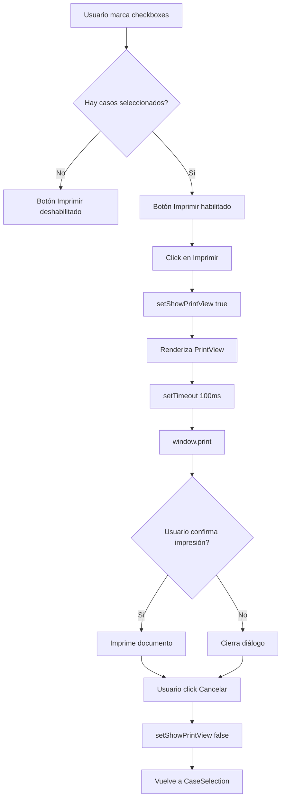

# Documentación Técnica - Sistema de Impresión de Etiquetas de Migración

## Descripción General

Este aplicativo permite seleccionar casos de migración y generar etiquetas de impresión en formato físico. El sistema consta de dos vistas:

1. **Vista de Selección (Marco 1)**: Interfaz donde el usuario selecciona los casos a imprimir
2. **Vista de Impresión Oculta (Marco 2)**: Layout de etiquetas generado en segundo plano, invisible para el usuario

**Características clave**:
- Las etiquetas se generan en una capa oculta usando HTML5
- El usuario permanece siempre en la vista de selección
- Al hacer clic en "Imprimir", solo se imprimen las etiquetas (la interfaz queda oculta)
- Máximo 6 etiquetas por página en formato **3×2** (3 columnas, 2 filas)
- Orientación **horizontal/landscape** en papel A4
- Distribución optimizada para impresión con espaciado mínimo (2mm)
- Dimensiones exactas del diseño Figma: **204px × 396px** por etiqueta

---

## Arquitectura de Componentes

### Estructura de Archivos

```
/
├── App.tsx                          # Componente principal, maneja estado
├── components/
│   ├── CaseSelection.tsx           # Vista de selección de casos (Marco 1)
│   ├── PrintSheet.tsx              # Vista de impresión oculta (genera páginas)
│   ├── Label.tsx                    # Componente individual de etiqueta (Marco 2)
│   └── PreviewView.tsx             # Vista previa de etiquetas antes de imprimir
├── imports/
│   ├── svg-mfi1kt4u1n.ts          # SVG paths para logo principal
│   └── svg-2u3h5hhlya.ts          # SVG paths para logo de etiquetas
├── styles/
│   └── globals.css                 # Incluye estilos @media print
└── DOCUMENTATION.md                 # Esta documentación
```

---

## Paso 1: Estructura de Datos

### Tipos de Datos Principales

```typescript
interface CaseData {
  id: string;              // ID del caso (ej: "1037431")
  expediente: string;      // Número de expediente (ej: "123.456")
  nombre: string;          // Nombre completo (ej: "JUAN PÉREZ GARCÍA")
  nacionalidad: string;    // Nacionalidad (ej: "COLOMBIA")
}
```

### Estado de la Aplicación

El componente principal `App.tsx` maneja dos estados:

1. **selectedCases**: Array de strings con los IDs de casos seleccionados
2. **showPrintView**: Boolean que determina qué vista mostrar

```typescript
const [selectedCases, setSelectedCases] = useState<string[]>([]);
const [showPrintView, setShowPrintView] = useState(false);
```

---

## Paso 2: Vista de Selección (Marco 1)

### Componente: CaseSelection.tsx

**Propósito**: Permitir al usuario seleccionar casos mediante checkboxes

**Elementos clave**:

1. **Header con logo**: Fondo negro (#131414) con logo de Migración Panamá
2. **Navegación**: Barra azul (#0e5fa6) con opciones de menú
3. **Breadcrumb**: Muestra la ruta "Inicio / Solicitudes"
4. **Área de contenido**:
   - Título: "Casos para generar impresión"
   - Texto explicativo sobre el funcionamiento del sistema
   - Lista de checkboxes con los casos disponibles
   - Botón "Imprimir" (deshabilitado si no hay selección)
5. **Botones de acción**: Cancelar y Guardar

### Lógica de Selección

```typescript
const handleCaseToggle = (caseId: string) => {
  setSelectedCases(prev => 
    prev.includes(caseId) 
      ? prev.filter(id => id !== caseId)  // Desmarcar
      : [...prev, caseId]                  // Marcar
  );
};
```

### Validación de Impresión

El botón de imprimir solo está habilitado cuando hay al menos un caso seleccionado:

```typescript
<button
  onClick={onPrint}
  disabled={selectedCases.length === 0}
  className="... disabled:opacity-50 disabled:cursor-not-allowed"
>
```

---

## Paso 3: Vista de Impresión (Marco 2)

### Componente: PrintSheet.tsx

**Propósito**: Generar páginas de etiquetas en una capa oculta del DOM

**Características especiales**:

1. **Capa oculta**: Usa `className="hidden print:block"` para ocultarse en pantalla
2. **Layout por página**: Grid de **3 columnas × 2 filas** (6 etiquetas máximo)
3. **Dimensiones**: A4 horizontal/landscape (**297mm × 210mm**) con padding de 8mm
4. **Espaciado**: Gap de **2mm** entre etiquetas (margen mínimo)
5. **Paginación automática**: Cada 6 casos genera una nueva página
6. **Orientación**: Forzada a horizontal mediante CSS `@page { size: A4 landscape; }`

```typescript
<div className="hidden print:block print-content">
  {pages.map((pageCases, pageIndex) => (
    <div 
      style={{
        width: '297mm',   // A4 horizontal
        height: '210mm',
        pageBreakAfter: pageIndex < pages.length - 1 ? 'always' : 'auto',
        padding: '8mm',
        boxSizing: 'border-box'
      }}
    >
      <div style={{
        display: 'grid',
        gridTemplateColumns: 'repeat(3, 204px)',  // 3 columnas
        gridTemplateRows: 'repeat(2, 396px)',     // 2 filas
        gap: '2mm'
      }}>
        {/* 6 etiquetas aquí */}
      </div>
    </div>
  ))}
</div>
```

**Lógica de agrupación en páginas**:

```typescript
const pages: CaseData[][] = [];
for (let i = 0; i < cases.length; i += 6) {
  pages.push(cases.slice(i, i + 6));
}
```

Esto divide los casos en arrays de 6:
- 1-6 casos: 1 página
- 7-12 casos: 2 páginas
- 13-18 casos: 3 páginas, etc.

---

## Paso 4: Componente de Etiqueta Individual

### Componente: Label.tsx

**Dimensiones**: **204px de ancho × 396px de alto** (formato vertical, basado en diseño Figma)

**Estructura de capas** (de fondo a frente):

#### 1. Bordes Dobles Rotados

Dos rectángulos con bordes negros de 4px, rotados 90 grados para crear efecto de marco doble:

```typescript
// Borde exterior - rotado 90°
<div className="absolute flex h-[396px] items-center justify-center left-0 top-0 w-[204px]">
  <div className="flex-none rotate-[90deg]">
    <div className="border-4 border-black border-solid h-[204px] w-[396px]" />
  </div>
</div>

// Borde interior - rotado 90°, offset de 7px
<div className="absolute flex h-[389px] items-center justify-center left-[7px] top-0 w-[197px]">
  <div className="flex-none rotate-[90deg]">
    <div className="border-4 border-black border-solid h-[197px] w-[389px]" />
  </div>
</div>
```

#### 2. Parches Blancos en Esquinas

Para ocultar solapamientos de bordes en las esquinas:

```typescript
<div className="bg-white h-[5px] w-[3px]" />
```

#### 3. Texto Rotado 90° (de izquierda a derecha en la etiqueta)

Todos los textos se rotan 90 grados usando `rotate-[90deg]`:

```typescript
<div className="flex-none rotate-[90deg]">
  <div className="text-[9px]">
    <p className="mb-0">REPÚBLICA DE PANAMÁ</p>
    <p className="mb-0">MINISTERIO DE SEGURIDAD PÚBLICA</p>
    <p className="mb-0">SERVICIO NACIONAL DE MIGRACIÓN</p>
    <p>SEDE</p>
  </div>
</div>
```

**Posicionamiento y tamaños de fuente** (desde el borde izquierdo de la etiqueta):

| Elemento | Left | Top | Width | Height | Font Size |
|----------|------|-----|-------|--------|-----------|
| Encabezado institucional | calc(50%+35px) | 84px | 56px | 222px | **9px** |
| EXPEDIENTE N° | calc(50%-18px) | 86px | 18px | 217px | **12px** |
| NOMBRE | calc(50%-51px) | 8px | 16px | 294px | **10px** |
| NACIONALIDAD | calc(50%-77px) | 8px | 16px | 238px | **10px** |
| Logo Panamá | 169px | 183px | 27px | 23px | - |

**Font settings**:
- Familia: `Roboto_Flex:Medium`
- Tracking: `-0.36px` (texto institucional)
- Font variation settings: `'GRAD' 0, 'XOPQ' 96, 'XTRA' 468, 'YOPQ' 79, 'YTAS' 750, 'YTDE' -203, 'YTFI' 738, 'YTLC' 514, 'YTUC' 712, 'wdth' 100`

#### 4. Logo de Panamá Rotado

Logo SVG importado desde `svg-dxnhxsnp3k` (diseño Figma) y rotado 90 grados:

```typescript
<div className="flex-none rotate-[90deg]">
  <PanamaLogo />  {/* SVG con colores #FFE400 (amarillo) y #00A7E1 (azul) */}
</div>
```

---

## Paso 5: Flujo de Impresión

### Secuencia Completa



### Código de Manejo de Impresión

```typescript
const handlePrint = () => {
  if (selectedCases.length > 0) {
    setShowPrintView(true);
    
    // Esperar a que el DOM se actualice antes de imprimir
    setTimeout(() => {
      window.print();
    }, 100);
  }
};
```

**Explicación del setTimeout**:
- Asegura que React termine de renderizar las etiquetas
- 100ms es suficiente para que el navegador actualice el DOM
- Sin esto, `window.print()` podría ejecutarse antes del render completo

---

## Paso 6: Estilos de Impresión

### CSS Print-Specific (globals.css)

```css
@media print {
  @page {
    size: A4 landscape;  /* Forzar tamaño A4 en orientación HORIZONTAL */
    margin: 0;           /* Sin márgenes de página */
  }
  
  body {
    margin: 0;
    padding: 0;
  }
  
  /* Ocultar todo excepto el contenido de impresión */
  body > :not(.print-content) {
    display: none !important;
  }
}
```

### Clases Tailwind de Impresión

```typescript
// Ocultar en pantalla, mostrar en impresión
className="hidden print:block"

// Salto de página CSS inline
style={{ pageBreakAfter: 'always' }}
```

**Jerarquía de visibilidad**:

| Elemento | En Pantalla | En Impresión |
|----------|-------------|--------------|
| CaseSelection | ✅ Visible | ❌ Oculto |
| PrintSheet | ❌ Oculto | ✅ Visible |
| Labels | ❌ Ocultos | ✅ Visibles |

### ⚠️ Configuración Manual en Diálogo de Impresión

Aunque el CSS fuerza `landscape`, algunos navegadores requieren confirmación manual:

1. **Orientación**: Cambiar a **"Horizontal"** o **"Landscape"**
2. **Márgenes**: Configurar a **"Ninguno"** o **"Mínimo"**
3. **Escala**: Dejar en **100%**
4. **Páginas**: Seleccionar **"Todas"**

---

## Paso 7: Consideraciones Técnicas Importantes

### 1. Vista Oculta vs. Vista Dinámica

**Enfoque anterior (❌)**:
- Cambiar entre dos vistas con estado `showPrintView`
- El usuario ve la vista de impresión antes de imprimir

**Enfoque actual (✅)**:
- Las etiquetas siempre están en el DOM, ocultas
- El usuario nunca sale de la vista de selección
- Incluye botón "Vista Previa" para revisar antes de imprimir
- Más fluido y profesional

### 2. Dimensiones de Etiquetas

**Diseño basado en Figma**:
- Cada etiqueta: **204px × 396px**
- Área útil A4 horizontal: **297mm × 210mm**
- Con padding de 8mm: **281mm × 194mm**
- Grid 3×2: cada celda ~93.67mm × 97mm
- Etiqueta en mm: ~54mm × 105mm
- Gap entre etiquetas: **2mm** (margen mínimo)

**Cálculo de espacio**:
```
3 columnas × 204px = 612px (~162mm)
2 filas × 396px = 792px (~210mm)
2 gaps horizontales × 2mm = 4mm
1 gap vertical × 2mm = 2mm
Padding: 8mm × 4 lados = margin
Total encaja perfectamente en A4 landscape
```

### 3. Unidades CSS: px vs mm

**Por qué usar píxeles para etiquetas**:
```typescript
style={{ width: '204px', height: '396px' }}
```

- Etiquetas usan `px` porque vienen del diseño Figma en píxeles
- El contenedor de página usa `mm` para precisión de impresión
- Ambas unidades funcionan bien juntas en contexto de impresión

**Por qué usar milímetros para página**:
```typescript
style={{ width: '297mm', height: '210mm' }}
```

- `mm` son unidades físicas que respeta el navegador en impresión
- Garantiza tamaño exacto de página A4

### 4. Rotación de Elementos

**Problema**: Texto y bordes deben aparecer rotados en la etiqueta

**Solución**: Usar `className="flex-none rotate-[90deg]"` de Tailwind

```typescript
<div className="flex-none rotate-[90deg]">
  <p>NACIONALIDAD: {nacionalidad}</p>
</div>
```

El elemento padre define el espacio rotado, el hijo contiene el contenido.

**Importante**: Los bordes también están rotados 90°, por eso las dimensiones aparecen invertidas en el código.

### 5. Saltos de Página

**Método**: CSS `pageBreakAfter`

```typescript
style={{
  pageBreakAfter: pageIndex < pages.length - 1 ? 'always' : 'auto'
}}
```

- `'always'`: Fuerza nueva página después
- `'auto'`: Última página, no forzar salto

### 6. Renderizado Condicional

```typescript
if (cases.length === 0) {
  return null;  // No renderizar nada si no hay casos seleccionados
}
```

Esto evita renderizar una página en blanco cuando no hay selección.

### 7. Importación de SVGs (Actualizado)

**IMPORTANTE**: El logo usa el SVG del diseño Figma:

```typescript
import svgPaths from "../imports/svg-dxnhxsnp3k";  // ✅ Del diseño Figma
```

**NO** usar el SVG anterior (`svg-2u3h5hhlya`). El nuevo incluye los colores correctos de la bandera panameña.

---

## Paso 8: Datos de Ejemplo

El sistema incluye 5 casos de ejemplo en `App.tsx`:

```typescript
const casesData: CaseData[] = [
  { id: '1037431', expediente: '123.456', nombre: 'JUAN PÉREZ GARCÍA', nacionalidad: 'COLOMBIA' },
  { id: '1037432', expediente: '234.567', nombre: 'MARÍA RODRÍGUEZ LÓPEZ', nacionalidad: 'VENEZUELA' },
  { id: '1037433', expediente: '345.678', nombre: 'CARLOS MARTÍNEZ SÁNCHEZ', nacionalidad: 'ECUADOR' },
  { id: '1037434', expediente: '456.789', nombre: 'ANA GONZÁLEZ TORRES', nacionalidad: 'PERÚ' },
  { id: '1037435', expediente: '567.890', nombre: 'LUIS HERNÁNDEZ RUIZ', nacionalidad: 'NICARAGUA' },
];
```

**Para un agente de IA**: Reemplazar este array con datos reales de una API o base de datos.

---

## Paso 9: Recreación del Sistema

### Para un Agente de IA que Necesita Recrear Esto:

#### 9.1 Configuración Inicial

1. Crear proyecto React con TypeScript
2. Instalar Tailwind CSS v4
3. Asegurar que las fuentes Roboto y Roboto Flex estén disponibles

#### 9.2 Archivos Necesarios

1. **App.tsx**: Componente raíz con estado (NO maneja cambio de vista)
2. **CaseSelection.tsx**: Vista principal con checkboxes
3. **PrintSheet.tsx**: Generador de páginas ocultas para impresión
4. **Label.tsx**: Componente de etiqueta individual con rotación
5. **globals.css**: CRÍTICO - incluir @media print rules
6. **Archivos SVG**: Importar los paths de los logos

#### 9.3 Implementación de la Capa Oculta

**Paso crítico**: Las etiquetas deben estar SIEMPRE en el DOM

```typescript
// App.tsx
return (
  <>
    <CaseSelection {...props} />
    <PrintSheet cases={getSelectedCasesData()} />  {/* Siempre renderizado */}
  </>
);
```

```typescript
// PrintSheet.tsx
return (
  <div className="hidden print:block print-content">
    {/* Contenido de impresión */}
  </div>
);
```

#### 9.4 Implementación de la Etiqueta

**Orden de implementación**:

1. Crear contenedor de **204px × 396px**
2. Añadir bordes dobles rotados 90°
3. Añadir parches blancos en esquinas
4. Posicionar textos rotados en coordenadas exactas (usar tabla del Paso 4)
5. Añadir logo rotado desde `svg-dxnhxsnp3k`
6. Ajustar tamaños de fuente: 9px (institucional), 10px (nombre/nacionalidad), 12px (expediente)
7. Probar con datos de ejemplo

**Dimensiones críticas**:
- Etiqueta: **204px × 396px**
- Grid: **3 columnas × 2 filas**
- Gap: **2mm**
- Página: **297mm × 210mm (landscape)**

**Herramienta de debug**: Remover temporalmente `hidden` para ver las etiquetas:

```typescript
// Cambiar esto:
<div className="hidden print:block">

// A esto (temporalmente):
<div className="print:block">
```

#### 9.5 Configuración de Estilos de Impresión

**CRÍTICO**: Añadir esto a `globals.css`:

```css
@media print {
  @page {
    size: A4 landscape;  /* ← IMPORTANTE: landscape para orientación horizontal */
    margin: 0;
  }
  
  body > :not(.print-content) {
    display: none !important;
  }
}
```

Sin esto, la interfaz de selección aparecerá en la impresión y la orientación será incorrecta.

#### 9.6 Pruebas de Impresión

**Checklist de pruebas**:

- [ ] 1 caso: 1 etiqueta en página 1
- [ ] 3 casos: 3 etiquetas en página 1 (formato 3×1)
- [ ] 6 casos: 6 etiquetas en página 1 (grid completo 3×2)
- [ ] 7 casos: 6 en página 1, 1 en página 2
- [ ] 12 casos: 6 en página 1, 6 en página 2
- [ ] **Orientación en HORIZONTAL/LANDSCAPE**
- [ ] Etiquetas tienen poco margen (2mm visible)
- [ ] Bordes dobles se ven claramente
- [ ] Texto rotado es legible
- [ ] Logo con colores amarillo y azul se muestra correctamente
- [ ] Vista de selección NO aparece en impresión

**Cómo probar**:
1. Seleccionar casos
2. Hacer clic en "Vista Previa" para revisar
3. Hacer clic en "Imprimir"
4. **IMPORTANTE**: En el diálogo, configurar manualmente:
   - **Orientación**: Horizontal/Landscape
   - **Márgenes**: Ninguno o Mínimo
5. Guardar como PDF o imprimir
6. Verificar que solo aparecen las etiquetas en formato 3×2

---

## Paso 10: Solución de Problemas Comunes

### Problema 1: La interfaz aparece en la impresión

**Causa**: Falta la regla CSS `@media print` en globals.css
**Solución**: Verificar que existe:

```css
@media print {
  body > :not(.print-content) {
    display: none !important;
  }
}
```

### Problema 2: Las etiquetas no aparecen en impresión

**Causa**: Falta clase `print:block` o `print-content`
**Solución**: Verificar PrintSheet.tsx tiene:

```typescript
<div className="hidden print:block print-content">
```

### Problema 3: Solo aparece 1 página (cuando deberían ser varias)

**Causa**: `pageBreakAfter` no está funcionando
**Solución**: Verificar que se usa CSS inline, no Tailwind:

```typescript
// ❌ INCORRECTO (Tailwind no soporta esto bien)
className="page-break-after-always"

// ✅ CORRECTO
style={{ pageBreakAfter: 'always' }}
```

### Problema 4: Etiquetas se ven apretadas

**Causa**: Gap de 2mm es el mínimo diseñado (según especificación)
**Solución**: Si se necesita más espacio, aumentar gap en PrintSheet.tsx:

```typescript
style={{
  gap: '4mm',  // Cambiar de 2mm a 4mm o más
}}
```

⚠️ **Nota**: El diseño actual usa 2mm intencionalmente para maximizar espacio en la página.

### Problema 5: Etiquetas no caben en la página

**Causa**: Padding + tamaño de etiqueta + gap excede dimensiones de página
**Solución**: Verificar matemática para orientación horizontal:
- Ancho disponible: 297mm - (2 × 8mm padding) = 281mm
- 3 etiquetas: 3 × 54mm = 162mm
- 2 gaps: 2 × 2mm = 4mm
- Total horizontal: 166mm (dentro de 281mm ✅)

- Alto disponible: 210mm - (2 × 8mm padding) = 194mm
- 2 etiquetas: 2 × 105mm = 210mm (esto puede ser ajustado)
- 1 gap: 1 × 2mm = 2mm
- Total vertical: 212mm (puede requerir ajuste de padding)

Si excede, reducir padding a 5mm o ajustar tamaño de etiqueta proporcionalmente.

### Problema 6: Orientación vertical en lugar de horizontal

**Causa**: Configuración manual requerida en diálogo de impresión
**Solución**: 
1. Aunque el CSS especifica `size: A4 landscape`, algunos navegadores ignoran esto
2. **Siempre verificar manualmente** en el diálogo de impresión
3. Cambiar "Orientación" a **"Horizontal"** o **"Landscape"**
4. Esto es normal y esperado - el CSS es una sugerencia, no un mandato

### Problema 7: SVGs no se muestran en impresión

**Causa**: Algunos navegadores no imprimen SVGs complejos
**Solución**: Los SVGs deberían funcionar. Si no, considerar convertir a imagen PNG:

```typescript

```

### Problema 8: Texto cortado en etiquetas

**Causa**: Nombres muy largos exceden el ancho disponible
**Solución**: Añadir CSS para ajustar:

```typescript
<p className="truncate" style={{ maxWidth: '71mm' }}>
  NOMBRE: {nombre}
</p>
```

O reducir font-size dinámicamente para nombres largos.

---

## Paso 11: Extensiones Futuras

### Posibles Mejoras:

1. **Backend Integration**: Conectar a base de datos real para cargar casos
2. **Filtros y búsqueda**: Permitir buscar casos por nombre, expediente, etc.
3. **Configuración de layout**: Permitir cambiar entre 2×3, 3×2, etc.
4. **Códigos QR**: Añadir QR code en cada etiqueta con el número de expediente
5. **Exportar a PDF**: Usar `html2pdf.js` o similar para generar PDF sin diálogo de impresión
6. **Historial de impresiones**: Registrar qué casos se imprimieron y cuándo
7. **Validación de 6 casos**: Implementar la lógica mencionada en el texto que requiere exactamente 6 casos

### Código de Ejemplo para QR Code:

```typescript
import QRCode from 'qrcode.react';

// En Label.tsx:
<div className="absolute bottom-4 right-4">
  <QRCode value={expediente} size={50} />
</div>
```

---

## Resumen Ejecutivo para Agentes de IA

**Componentes clave**: 
- App (estado + navegación)
- CaseSelection (UI visible con checkboxes)
- PreviewView (vista previa visual antes de imprimir)
- PrintSheet (generador oculto de páginas)
- Label (etiqueta individual 204px × 396px)

**Flujo simplificado**: 
Selección → [Vista Previa opcional] → Estado → PrintSheet oculto siempre renderizado → window.print() → @media print oculta todo excepto PrintSheet

**Técnicas críticas**:
- Estado React para selección de casos
- Capa oculta con `hidden print:block`
- CSS @media print para ocultar interfaz
- Grid 3×2 con gap de 2mm (mínimo)
- Dimensiones exactas de Figma: **204px × 396px**
- Orientación **landscape/horizontal** (297mm × 210mm)
- Rotación CSS 90° para layout vertical
- `pageBreakAfter: 'always'` cada 6 etiquetas
- SVG imports desde `svg-dxnhxsnp3k` para logos con colores correctos
- Tamaños de fuente: 9px, 10px, 12px

**Dimensiones exactas**: 
- Etiqueta: **204px × 396px**
- Página A4 horizontal: **297mm × 210mm**
- Grid: **3 columnas × 2 filas**
- Gap: **2mm** (margen mínimo)
- Padding: **8mm**

**Diferencia clave con sistemas tradicionales**: 
El usuario NUNCA ve un cambio de pantalla. Las etiquetas se generan invisiblemente en el DOM y solo aparecen durante la impresión gracias a `@media print`. Incluye botón "Vista Previa" para revisar layout antes de imprimir.

**Punto más complejo**: 
Coordinar las reglas CSS @media print con orientación landscape y las clases Tailwind print: para lograr que solo las etiquetas se impriman en horizontal, mientras la interfaz permanece oculta.

**Para reproducir**: 
1. Seguir Pasos 1-6 en orden
2. CRÍTICO: No olvidar añadir reglas @media print en globals.css **con landscape**
3. Usar dimensiones exactas: **204px × 396px** para etiquetas
4. Configurar grid a **3×2** (no 2×3)
5. Gap de **2mm** para margen mínimo
6. Importar SVG desde `svg-dxnhxsnp3k`
7. Probar con diferentes cantidades de casos (1, 6, 7, 12)
8. Verificar en Vista Previa antes de imprimir
9. **En diálogo de impresión, cambiar manualmente a orientación HORIZONTAL**

---

## Notas Finales

Este sistema está optimizado para:
- Impresión en papel **A4 en orientación HORIZONTAL/LANDSCAPE**
- **6 etiquetas por hoja (3×2)**
- Uso en navegadores modernos (Chrome, Firefox, Edge)
- Etiquetas físicas basadas en diseño Figma: **204px × 396px** (~54mm × 105mm)
- Margen mínimo entre etiquetas (**2mm**) para maximizar uso de espacio

**No soporta**:
- Tamaños de papel diferentes a A4 (requiere ajustes)
- Más de 6 etiquetas por página (limitación de diseño)
- Impresión desde móviles (requiere desktop/laptop)
- Orientación vertical (debe ser horizontal)

**Cambios recientes (última actualización)**:
- ✅ Dimensiones actualizadas a diseño Figma (204px × 396px)
- ✅ Grid cambiado a 3×2 (antes era 2×3)
- ✅ Gap reducido a 2mm (antes era 8mm)
- ✅ Orientación forzada a landscape
- ✅ Tamaños de fuente ajustados a 9-10px
- ✅ Logo importado desde svg-dxnhxsnp3k con colores correctos
- ✅ Añadida vista previa (PreviewView component)