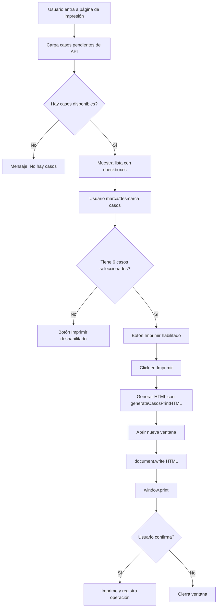

# Documentación Técnica - Sistema de Impresión de Etiquetas de Casos de Migración

## Descripción General

Este sistema permite seleccionar casos de migración pendientes y generar etiquetas físicas para impresión. Está diseñado para el **Servicio Nacional de Migración de Panamá**.

### Vista de Selección (Figma node-id: 423-7212)
Interfaz donde el usuario selecciona los casos a imprimir mediante checkboxes.

### Vista de Impresión (Figma node-id: 550-2078)
Layout de etiquetas generado para impresión, invisible para el usuario durante la operación normal.

**Características clave**:
- Las etiquetas se generan en una capa oculta usando HTML5
- El usuario permanece siempre en la vista de selección
- Al hacer clic en "Imprimir", solo se imprimen las etiquetas
- Máximo **6 etiquetas por página** en formato **3×2** (3 columnas, 2 filas)
- Orientación **vertical/portrait** en papel tamaño carta (612×792 px)
- Dimensiones exactas del diseño Figma: **204px × 396px** por etiqueta
- Todo el texto está **rotado 90°** para lectura lateral

---

## Arquitectura de Componentes

### Estructura de Archivos del Proyecto

```
frontend/src/
├── components/
│   ├── Print/
│   │   ├── PrintableCasosDocument.tsx    # Componente de impresión (etiquetas)
│   │   └── PrintableCotizacion.tsx       # Componente de impresión (cotizaciones)
│   └── Workflow/
│       └── QuestionViews/
│           └── ImpresionView.tsx         # Vista genérica de impresión
├── pages/
│   └── ImpresionCasosPage.tsx           # Página de selección de casos (a crear)
└── styles/
    └── print.css                        # Estilos de impresión (a verificar/crear)
```

---

## Paso 1: Estructura de Datos

### Tipos de Datos Principales

```typescript
/**
 * Representa un caso de migración para impresión
 * Basado en la estructura del workflow de PPSH
 */
export interface CasoParaImpresion {
  id_solicitud: number;      // ID del caso (ej: 1037431)
  num_expediente: string;    // Número de expediente (ej: "123.456")
  nombre: string;            // Nombre completo (ej: "JUAN PÉREZ GARCÍA")
  nacionalidad: string;      // Nacionalidad (ej: "COLOMBIA")
}

/**
 * Props del componente de documento imprimible
 */
interface PrintableCasosDocumentProps {
  casos: CasoParaImpresion[];
  sede?: string;  // Ej: "SEDE CENTRAL", "SEDE DAVID"
}
```

### Estado de la Aplicación

```typescript
// Estado para la vista de selección
const [casosDisponibles, setCasosDisponibles] = useState<CasoParaImpresion[]>([]);
const [casosSeleccionados, setCasosSeleccionados] = useState<number[]>([]); // IDs seleccionados
const [loading, setLoading] = useState(false);
```

---

## Paso 2: Vista de Selección (Marco 1 - Figma 423-7212)

### Diseño Visual

| Elemento | Descripción | Estilos |
|----------|-------------|---------|
| Header | Fondo negro con logo | `backgroundColor: #131414`, altura 38px |
| Navegación | Barra azul con menú | `backgroundColor: #0e5fa6`, altura 40px |
| Breadcrumb | "Inicio / Solicitudes" | Color `#757575`, fuente 14px |
| Título | "Casos para generar impresión" | Fuente 48px bold, color `#333333` |
| Descripción | Texto explicativo | Fuente 16px, color `#333333` |
| Lista checkboxes | Casos con ID | Fuente 16px, gap 16px vertical |
| Botón Imprimir | Azul con icono | `backgroundColor: #0e5fa6`, 40px altura |
| Botones pie | Cancelar / Guardar | Cancelar: borde azul, Guardar: fondo azul |

### Lógica de Selección

```typescript
/**
 * Toggle de selección de un caso
 */
const handleCaseToggle = (casoId: number) => {
  setCasosSeleccionados(prev => 
    prev.includes(casoId) 
      ? prev.filter(id => id !== casoId)  // Desmarcar
      : [...prev, casoId]                  // Marcar
  );
};

/**
 * Validación: El botón imprimir solo está habilitado con casos seleccionados
 */
const puedeImprimir = casosSeleccionados.length > 0;
```

### Regla de Negocio

> La impresión de documentos solo se realiza cuando el sistema ha acumulado **seis casos** generados. Si el número de casos disponibles es inferior a seis, estos permanecen en espera hasta completar la cantidad requerida. Una vez que el sistema reúne seis casos, se habilita la impresión conjunta y se registra la operación correspondiente.

**Implementación sugerida**:
```typescript
const puedeImprimir = casosSeleccionados.length === 6;
// O para desarrollo/pruebas: casosSeleccionados.length > 0
```

---

## Paso 3: Componente de Etiqueta Individual (Marco 2 - Figma 550-4178)

### Dimensiones Exactas

```
Etiqueta: 204px ancho × 396px alto
```

### Estructura de Capas (del diseño Figma)

```
┌──────────────────────────────────────┐
│          BORDE DOBLE (4px + 2px)      │
│  ┌────────────────────────────────┐  │
│  │                                │  │
│  │  ┌─ NACIONALIDAD (rotado 90°)  │  │
│  │  │  left: 33px, top: 8px       │  │
│  │  │  16px × 238px               │  │
│  │  │                             │  │
│  │  ├─ NOMBRE (rotado 90°)        │  │
│  │  │  left: 59px, top: 8px       │  │
│  │  │  16px × 294px               │  │
│  │  │                             │  │
│  │  ├─ EXPEDIENTE N° (rotado 90°) │  │
│  │  │  left: 93px, top: 86px      │  │
│  │  │  18px × 217px               │  │
│  │  │                             │  │
│  │  ├─ ENCABEZADO INST. (rot 90°) │  │
│  │  │  left: 165px, top: 84px     │  │
│  │  │  56px × 222px               │  │
│  │  │                             │  │
│  │  └─ ESCUDO PANAMÁ (rotado 90°) │  │
│  │     left: 169px, top: 183px    │  │
│  │     27px × 23px                │  │
│  │                                │  │
│  └────────────────────────────────┘  │
└──────────────────────────────────────┘
```

### Posicionamiento Exacto de Elementos

| Elemento | Position | Left | Top | Width | Height | Font Size | Rotación |
|----------|----------|------|-----|-------|--------|-----------|----------|
| Encabezado institucional | absolute | 165px | 84px | 56px | 222px | 14px | 90° |
| EXPEDIENTE N° | absolute | 93px | 86px | 18px | 217px | 18px | 90° |
| NOMBRE | absolute | 59px | 8px | 16px | 294px | 16px | 90° |
| NACIONALIDAD | absolute | 33px | 8px | 16px | 238px | 16px | 90° |
| Escudo Panamá | absolute | 169px | 183px | 27px | 23px | - | 90° |

### Estilos de Fuente

```typescript
const fontStyles = {
  fontFamily: "'Roboto Flex', 'Roboto', sans-serif",
  fontWeight: 500,
  color: '#333333',
  textAlign: 'center',
  whiteSpace: 'nowrap',
  // Font variation settings (opcional, para Roboto Flex):
  fontVariationSettings: "'GRAD' 0, 'XOPQ' 96, 'XTRA' 468, 'YOPQ' 79, 'YTAS' 750, 'YTDE' -203, 'YTFI' 738, 'YTLC' 514, 'YTUC' 712, 'wdth' 100"
};
```

---

## Paso 4: Implementación del Componente PrintableCasosDocument

### Código Completo (Ya existente en el proyecto)

```typescript
// Ubicación: frontend/src/components/Print/PrintableCasosDocument.tsx

import React, { forwardRef } from 'react';
import { Box, Typography } from '@mui/material';

// Escudo de Panamá como SVG inline
const EscudoPanama = () => (
  <svg width="27" height="23" viewBox="0 0 27 23" fill="none" xmlns="http://www.w3.org/2000/svg">
    <ellipse cx="13.5" cy="11.5" rx="13.5" ry="11.5" fill="#FFD700"/>
    <path d="M13.5 2C8 2 4 6 4 11.5C4 17 8 21 13.5 21C19 21 23 17 23 11.5C23 6 19 2 13.5 2Z" fill="#0066B3"/>
    <path d="M13.5 4C9 4 6 7.5 6 11.5C6 15.5 9 19 13.5 19C18 19 21 15.5 21 11.5C21 7.5 18 4 13.5 4Z" fill="#FFFFFF"/>
    <circle cx="13.5" cy="11.5" r="4" fill="#D4AF37"/>
  </svg>
);

export interface CasoParaImpresion {
  id_solicitud: number;
  num_expediente: string;
  nombre: string;
  nacionalidad: string;
}

interface PrintableCasosDocumentProps {
  casos: CasoParaImpresion[];
  sede?: string;
}

export const PrintableCasosDocument = forwardRef<HTMLDivElement, PrintableCasosDocumentProps>(
  ({ casos, sede = 'SEDE CENTRAL' }, ref) => {
    // Grid 3 columnas × 2 filas = 6 etiquetas
    return (
      <Box
        ref={ref}
        sx={{
          width: '612px',
          height: '792px',
          backgroundColor: '#ffffff',
          display: 'grid',
          gridTemplateColumns: 'repeat(3, 204px)',
          gridTemplateRows: 'repeat(2, 396px)',
          '@media print': {
            width: '8.5in',
            height: '11in',
            margin: 0,
            padding: 0,
            pageBreakAfter: 'always',
          },
        }}
      >
        {casos.slice(0, 6).map((caso, index) => (
          <TarjetaCaso key={index} caso={caso} sede={sede} />
        ))}
      </Box>
    );
  }
);
```

### Componente TarjetaCaso (Etiqueta Individual)

```typescript
const TarjetaCaso: React.FC<{ caso: CasoParaImpresion; sede: string }> = ({ caso, sede }) => {
  return (
    <Box
      sx={{
        width: '204px',
        height: '396px',
        position: 'relative',
        border: '4px solid #000000',
        boxSizing: 'border-box',
        backgroundColor: '#ffffff',
        overflow: 'hidden',
        // Borde doble efecto con pseudo-elemento
        '&::before': {
          content: '""',
          position: 'absolute',
          top: '3px',
          left: '3px',
          right: '3px',
          bottom: '3px',
          border: '2px solid #000000',
          pointerEvents: 'none',
        },
      }}
    >
      {/* Encabezado institucional - rotado 90° */}
      <Box sx={{ position: 'absolute', left: '165px', top: '84px', width: '56px', height: '222px', display: 'flex', alignItems: 'center', justifyContent: 'center' }}>
        <Typography sx={{ transform: 'rotate(90deg)', transformOrigin: 'center center', fontFamily: 'Roboto, sans-serif', fontWeight: 500, fontSize: '14px', color: '#333333', textAlign: 'center', whiteSpace: 'pre-line', lineHeight: 1.2, letterSpacing: '-0.56px' }}>
          REPÚBLICA DE PANAMÁ{'\n'}
          MINISTERIO DE SEGURIDAD PÚBLICA{'\n'}
          SERVICIO NACIONAL DE MIGRACIÓN{'\n'}
          {sede}
        </Typography>
      </Box>

      {/* Escudo de Panamá */}
      <Box sx={{ position: 'absolute', left: '169px', top: '183px', width: '27px', height: '23px', display: 'flex', alignItems: 'center', justifyContent: 'center', transform: 'rotate(90deg)' }}>
        <EscudoPanama />
      </Box>

      {/* EXPEDIENTE N° - rotado 90° */}
      <Box sx={{ position: 'absolute', left: '93px', top: '86px', width: '18px', height: '217px', display: 'flex', alignItems: 'center', justifyContent: 'center' }}>
        <Typography sx={{ transform: 'rotate(90deg)', transformOrigin: 'center center', fontFamily: 'Roboto, sans-serif', fontWeight: 500, fontSize: '18px', color: '#333333', textAlign: 'center', whiteSpace: 'nowrap' }}>
          EXPEDIENTE N°: {caso.num_expediente || 'NNN.NNN'}
        </Typography>
      </Box>

      {/* NOMBRE - rotado 90° */}
      <Box sx={{ position: 'absolute', left: '59px', top: '8px', width: '16px', height: '294px', display: 'flex', alignItems: 'center', justifyContent: 'center' }}>
        <Typography sx={{ transform: 'rotate(90deg)', transformOrigin: 'center center', fontFamily: 'Roboto, sans-serif', fontWeight: 500, fontSize: '16px', color: '#333333', textAlign: 'center', whiteSpace: 'nowrap' }}>
          NOMBRE: {caso.nombre || 'NOMBRE APELLIDO APELLIDO'}
        </Typography>
      </Box>

      {/* NACIONALIDAD - rotado 90° */}
      <Box sx={{ position: 'absolute', left: '33px', top: '8px', width: '16px', height: '238px', display: 'flex', alignItems: 'center', justifyContent: 'center' }}>
        <Typography sx={{ transform: 'rotate(90deg)', transformOrigin: 'center center', fontFamily: 'Roboto, sans-serif', fontWeight: 500, fontSize: '16px', color: '#333333', textAlign: 'center', whiteSpace: 'nowrap' }}>
          NACIONALIDAD: {caso.nacionalidad || 'NACIONALIDAD'}
        </Typography>
      </Box>
    </Box>
  );
};
```

---

## Paso 5: Generación de HTML para Impresión

### Función generateCasosPrintHTML

Similar a `generateCotizacionPrintHTML`, crear una función que genere el HTML completo para una nueva ventana de impresión:

```typescript
/**
 * Genera HTML completo para impresión de etiquetas de casos
 * @param casos - Array de casos a imprimir (máximo 6 por página)
 * @param sede - Nombre de la sede (default: 'SEDE CENTRAL')
 * @returns String con HTML completo para window.print()
 */
export function generateCasosPrintHTML(
  casos: CasoParaImpresion[],
  sede: string = 'SEDE CENTRAL'
): string {
  // Dividir en páginas de 6 casos
  const paginas: CasoParaImpresion[][] = [];
  for (let i = 0; i < casos.length; i += 6) {
    paginas.push(casos.slice(i, i + 6));
  }

  const paginasHTML = paginas.map((paginaCasos, pageIndex) => `
    <div class="pagina" style="
      width: 612px;
      height: 792px;
      display: grid;
      grid-template-columns: repeat(3, 204px);
      grid-template-rows: repeat(2, 396px);
      page-break-after: ${pageIndex < paginas.length - 1 ? 'always' : 'auto'};
      background: white;
    ">
      ${paginaCasos.map(caso => generarTarjetaHTML(caso, sede)).join('')}
    </div>
  `).join('');

  return `
    <!DOCTYPE html>
    <html>
    <head>
      <meta charset="UTF-8">
      <title>Etiquetas de Casos - Migración Panamá</title>
      <style>
        @page {
          size: letter portrait;
          margin: 0;
        }
        * { box-sizing: border-box; margin: 0; padding: 0; }
        body {
          font-family: 'Roboto', 'Roboto Flex', sans-serif;
          background: white;
          -webkit-print-color-adjust: exact;
          print-color-adjust: exact;
        }
        @media print {
          body { margin: 0; padding: 0; }
        }
      </style>
    </head>
    <body>
      ${paginasHTML}
    </body>
    </html>
  `;
}

function generarTarjetaHTML(caso: CasoParaImpresion, sede: string): string {
  return `
    <div style="
      width: 204px;
      height: 396px;
      position: relative;
      border: 4px solid #000000;
      box-sizing: border-box;
      background: white;
      overflow: hidden;
    ">
      <!-- Borde interior -->
      <div style="
        position: absolute;
        top: 3px; left: 3px; right: 3px; bottom: 3px;
        border: 2px solid #000000;
        pointer-events: none;
      "></div>
      
      <!-- Encabezado institucional -->
      <div style="
        position: absolute;
        left: 165px; top: 84px;
        width: 56px; height: 222px;
        display: flex; align-items: center; justify-content: center;
      ">
        <div style="
          transform: rotate(90deg);
          transform-origin: center center;
          font-family: 'Roboto', sans-serif;
          font-weight: 500;
          font-size: 14px;
          color: #333333;
          text-align: center;
          white-space: pre-line;
          line-height: 1.2;
          letter-spacing: -0.56px;
        ">REPÚBLICA DE PANAMÁ
MINISTERIO DE SEGURIDAD PÚBLICA
SERVICIO NACIONAL DE MIGRACIÓN
${sede}</div>
      </div>
      
      <!-- Escudo -->
      <div style="
        position: absolute;
        left: 169px; top: 183px;
        width: 27px; height: 23px;
        transform: rotate(90deg);
      ">
        <svg width="27" height="23" viewBox="0 0 27 23" fill="none">
          <ellipse cx="13.5" cy="11.5" rx="13.5" ry="11.5" fill="#FFD700"/>
          <path d="M13.5 2C8 2 4 6 4 11.5C4 17 8 21 13.5 21C19 21 23 17 23 11.5C23 6 19 2 13.5 2Z" fill="#0066B3"/>
          <path d="M13.5 4C9 4 6 7.5 6 11.5C6 15.5 9 19 13.5 19C18 19 21 15.5 21 11.5C21 7.5 18 4 13.5 4Z" fill="#FFFFFF"/>
          <circle cx="13.5" cy="11.5" r="4" fill="#D4AF37"/>
        </svg>
      </div>
      
      <!-- Expediente -->
      <div style="
        position: absolute;
        left: 93px; top: 86px;
        width: 18px; height: 217px;
        display: flex; align-items: center; justify-content: center;
      ">
        <div style="
          transform: rotate(90deg);
          font-family: 'Roboto', sans-serif;
          font-weight: 500;
          font-size: 18px;
          color: #333333;
          white-space: nowrap;
        ">EXPEDIENTE N°: ${caso.num_expediente || 'NNN.NNN'}</div>
      </div>
      
      <!-- Nombre -->
      <div style="
        position: absolute;
        left: 59px; top: 8px;
        width: 16px; height: 294px;
        display: flex; align-items: center; justify-content: center;
      ">
        <div style="
          transform: rotate(90deg);
          font-family: 'Roboto', sans-serif;
          font-weight: 500;
          font-size: 16px;
          color: #333333;
          white-space: nowrap;
        ">NOMBRE: ${caso.nombre || 'NOMBRE APELLIDO'}</div>
      </div>
      
      <!-- Nacionalidad -->
      <div style="
        position: absolute;
        left: 33px; top: 8px;
        width: 16px; height: 238px;
        display: flex; align-items: center; justify-content: center;
      ">
        <div style="
          transform: rotate(90deg);
          font-family: 'Roboto', sans-serif;
          font-weight: 500;
          font-size: 16px;
          color: #333333;
          white-space: nowrap;
        ">NACIONALIDAD: ${caso.nacionalidad || 'NACIONALIDAD'}</div>
      </div>
    </div>
  `;
}
```

---

## Paso 6: Flujo de Impresión

### Secuencia Completa



### Código de Manejo de Impresión

```typescript
import { generateCasosPrintHTML, CasoParaImpresion } from '../components/Print/PrintableCasosDocument';

const handleImprimir = () => {
  if (casosSeleccionados.length === 0) return;
  
  // Obtener datos completos de los casos seleccionados
  const casosAImprimir = casosDisponibles.filter(
    caso => casosSeleccionados.includes(caso.id_solicitud)
  );
  
  // Generar HTML
  const htmlContent = generateCasosPrintHTML(casosAImprimir, 'SEDE CENTRAL');
  
  // Abrir ventana e imprimir
  const printWindow = window.open('', '_blank', 'width=650,height=850');
  if (printWindow) {
    printWindow.document.write(htmlContent);
    printWindow.document.close();
    
    printWindow.onload = () => {
      printWindow.focus();
      printWindow.print();
    };
  }
};
```

---

## Paso 7: API Backend

### Endpoints Necesarios

```typescript
// GET /api/v1/workflow/casos-pendientes-impresion
interface CasosPendientesResponse {
  casos: CasoParaImpresion[];
  total: number;
}

// POST /api/v1/workflow/registrar-impresion
interface RegistrarImpresionRequest {
  casos_ids: number[];
  fecha_impresion: string;
  usuario_id: number;
  sede: string;
}

interface RegistrarImpresionResponse {
  success: boolean;
  mensaje: string;
  lote_impresion_id: number;
}
```

---

## Paso 8: Consideraciones Técnicas

### 1. Tamaño de Página

| Formato | Dimensiones | Observación |
|---------|-------------|-------------|
| Carta (Letter) | 612px × 792px (8.5" × 11") | **Usado en este diseño** |
| A4 Landscape | 297mm × 210mm | Alternativa europea |

### 2. Grid de Etiquetas

```
Grid: 3 columnas × 2 filas = 6 etiquetas por página
Etiqueta: 204px × 396px
Total: 612px × 792px (exactamente tamaño carta)
```

### 3. Rotación CSS

```css
.texto-rotado {
  transform: rotate(90deg);
  transform-origin: center center;
}
```

**Importante**: El contenedor debe tener dimensiones invertidas para acomodar el texto rotado.

### 4. Colores del Escudo

| Elemento | Color | Hex |
|----------|-------|-----|
| Fondo escudo | Dorado | #FFD700 |
| Anillo azul | Azul bandera | #0066B3 |
| Círculo interior | Blanco | #FFFFFF |
| Centro | Oro | #D4AF37 |

---

## Paso 9: Checklist de Pruebas

- [ ] Selección de casos funciona correctamente
- [ ] Botón imprimir se habilita con 6 casos (o n casos según regla de negocio)
- [ ] HTML generado se abre en nueva ventana
- [ ] Etiquetas tienen dimensiones correctas (204×396 px)
- [ ] Grid es 3×2 (3 columnas, 2 filas)
- [ ] Texto rotado 90° es legible
- [ ] Escudo de Panamá se muestra con colores correctos
- [ ] Borde doble visible
- [ ] Tamaño carta correcto en diálogo de impresión
- [ ] Múltiples páginas funcionan (7+ casos)
- [ ] Datos dinámicos (nombre, expediente, nacionalidad) se muestran

---

## Paso 10: Datos de Ejemplo para Pruebas

```typescript
const casosEjemplo: CasoParaImpresion[] = [
  { id_solicitud: 1037431, num_expediente: '123.456', nombre: 'JUAN PÉREZ GARCÍA', nacionalidad: 'COLOMBIA' },
  { id_solicitud: 1037432, num_expediente: '234.567', nombre: 'MARÍA RODRÍGUEZ LÓPEZ', nacionalidad: 'VENEZUELA' },
  { id_solicitud: 1037433, num_expediente: '345.678', nombre: 'CARLOS MARTÍNEZ SÁNCHEZ', nacionalidad: 'ECUADOR' },
  { id_solicitud: 1037434, num_expediente: '456.789', nombre: 'ANA GONZÁLEZ TORRES', nacionalidad: 'PERÚ' },
  { id_solicitud: 1037435, num_expediente: '567.890', nombre: 'LUIS HERNÁNDEZ RUIZ', nacionalidad: 'NICARAGUA' },
  { id_solicitud: 1037436, num_expediente: '678.901', nombre: 'SOFÍA LÓPEZ MÉNDEZ', nacionalidad: 'HONDURAS' },
];
```

---

## Resumen para Implementación

### Componentes a Crear/Modificar

| Archivo | Acción | Descripción |
|---------|--------|-------------|
| `PrintableCasosDocument.tsx` | ✅ Existe | Componente de etiqueta (actualizar si necesario) |
| `generateCasosPrintHTML()` | ⚠️ Añadir | Función para generar HTML de impresión |
| `ImpresionCasosPage.tsx` | 🆕 Crear | Página de selección con checkboxes |
| Endpoint API | 🆕 Crear | Obtener casos pendientes |

### Dimensiones Críticas

```
Página: 612px × 792px (tamaño carta portrait)
Etiqueta: 204px × 396px
Grid: 3 columnas × 2 filas
Borde exterior: 4px solid black
Borde interior: 2px solid black (offset 3px)
```

### Flujo Resumido

1. Usuario accede a vista de selección
2. Sistema carga casos pendientes de la API
3. Usuario marca checkboxes (máximo/exacto 6)
4. Click en "Imprimir"
5. Sistema genera HTML con `generateCasosPrintHTML()`
6. Abre nueva ventana y ejecuta `window.print()`
7. Registra operación en backend

---

## Referencias Figma

- **Vista Selección**: `node-id=423-7212`
- **Vista Impresión (6 etiquetas)**: `node-id=550-2078`
- **Etiqueta Individual**: `node-id=550-4178`
