# Sistema de Workflow Dinámico - Diseño y Documentación

## Resumen Ejecutivo

Este documento describe el diseño e implementación del **Sistema de Workflow Dinámico** para la plataforma de trámites migratorios de Panamá. Este sistema permite crear procesos configurables y dinámicos como el PPSH (Permiso de Protección de Seguridad Humanitaria) desde una interfaz administrativa.

**Fecha:** 2025-10-20  
**Versión:** 1.0  
**Autor:** Sistema de Trámites MVP Panamá

---

## 1. Objetivos del Sistema

### 1.1 Objetivos Principales
- ✅ Permitir la creación de workflows (procesos) dinámicos sin necesidad de código
- ✅ Configurar etapas, formularios y validaciones de forma visual
- ✅ Soportar múltiples tipos de preguntas y campos de entrada
- ✅ Gestionar permisos por perfil de usuario en cada etapa
- ✅ Rastrear el historial completo de cada instancia de proceso
- ✅ Permitir transiciones condicionales entre etapas

### 1.2 Casos de Uso
- **Administradores**: Crear y configurar workflows completos
- **Personal Autorizado**: Ejecutar instancias de workflows según permisos
- **Sistema**: Validar, procesar y almacenar respuestas automáticamente
- **Auditores**: Revisar historial y trazabilidad completa

---

## 2. Arquitectura del Sistema

### 2.1 Componentes Principales

```
┌─────────────────────────────────────────────────────────┐
│                  SISTEMA DE WORKFLOW                     │
├─────────────────────────────────────────────────────────┤
│                                                          │
│  ┌────────────────┐         ┌──────────────────┐       │
│  │   PLANTILLAS   │         │    INSTANCIAS    │       │
│  │   (Templates)  │────────▶│   (Ejecución)    │       │
│  └────────────────┘         └──────────────────┘       │
│         │                           │                   │
│         ├─ Workflow                 ├─ WorkflowInstancia│
│         ├─ WorkflowEtapa            ├─ RespuestaEtapa  │
│         ├─ WorkflowPregunta         ├─ Respuesta       │
│         └─ WorkflowConexion         ├─ Historial       │
│                                      └─ Comentario      │
│                                                          │
└─────────────────────────────────────────────────────────┘
```

### 2.2 Modelo de Datos

#### A. PLANTILLAS (Configuración)

##### **Workflow**
Representa la plantilla del proceso completo.

| Campo | Tipo | Descripción |
|-------|------|-------------|
| id | Integer | ID único (PK auto-incremental para relaciones en BD) |
| codigo | String(50) | **Código único de negocio** (ej: "PPSH") - Ver nota abajo |
| nombre | String(255) | Nombre del proceso (descriptivo para UI) |
| descripcion | Text | Descripción detallada |
| version | String(20) | Versión del workflow |
| estado | Enum | BORRADOR, ACTIVO, INACTIVO, ARCHIVADO |
| categoria | String(100) | Categoría del proceso |
| perfiles_creadores | JSON | Perfiles que pueden crear instancias |
| color_hex | String(7) | Color para UI |
| icono | String(50) | Ícono para UI |
| requiere_autenticacion | Boolean | Si requiere login |
| es_publico | Boolean | Si es visible públicamente |

> **📋 Nota sobre Códigos vs IDs:**
> 
> El sistema usa **códigos descriptivos** (strings únicos) en lugar de IDs numéricos de tablas de referencia por las siguientes razones:
> 
> 1. **Legibilidad del código:** `if (codigo === "INICIO")` es más claro que `if (id === 5)`
> 2. **Portabilidad:** Los códigos son constantes entre ambientes (dev/test/prod), los IDs auto-incrementales pueden variar
> 3. **Configuración declarativa:** Permite definir workflows en JSON/YAML sin conocer IDs de base de datos
> 4. **Referencias en lógica de negocio:** Las condiciones de transición usan códigos legibles
> 5. **Debugging más fácil:** Los logs muestran "Error en etapa INICIO" en lugar de "Error en etapa 523"
> 
> **Estructura de identificadores:**
> - `id` → Optimización de BD, relaciones FK (1, 2, 1003...)
> - `codigo` → Lógica de negocio, referencias portables ("FLUJO_COMPLETO", "INICIO", "APROBADO")
> - `nombre` → Interfaz de usuario ("Flujo Completo de Prueba")
> 
> **Ejemplo de uso en condiciones:**
> ```json
> {
>   "condicion": {
>     "pregunta": "APROBADO",      // ← Código legible
>     "valor": "SI"
>   }
> }
> ```
> En lugar de:
> ```json
> {
>   "condicion": {
>     "pregunta_id": 47,           // ← ¿Qué pregunta es la 47?
>     "valor": "SI"
>   }
> }
> ```

##### **WorkflowEtapa**
Representa un nodo/paso en el workflow.

| Campo | Tipo | Descripción |
|-------|------|-------------|
| id | Integer | ID único (PK auto-incremental) |
| workflow_id | Integer | FK a Workflow |
| codigo | String(50) | **Código único de negocio** en el workflow (ej: "INICIO", "DOCUMENTOS") |
| nombre | String(255) | Nombre de la etapa (descriptivo para UI) |
| tipo_etapa | Enum | ETAPA, COMPUERTA, PRESENCIAL |
| orden | Integer | Orden de la etapa |
| posicion_x, posicion_y | Integer | Posición en diagrama visual |
| perfiles_permitidos | JSON | ["CIUDADANO", "ABOGADO", "SISTEMA"] |
| titulo_formulario | String(500) | Título del formulario |
| bajada_formulario | Text | Descripción del formulario |
| es_etapa_inicial | Boolean | Si es la etapa de inicio |
| es_etapa_final | Boolean | Si es la etapa final |
| requiere_validacion | Boolean | Si requiere validación manual |
| permite_edicion_posterior | Boolean | Si permite editar después |
| tiempo_estimado_minutos | Integer | Tiempo estimado |
| reglas_transicion | JSON | Reglas condicionales |

> **💡 Uso de códigos en etapas:**
> Las etapas usan `codigo` para referencias en conexiones y lógica de transición.
> Permite crear workflows completos sin conocer los IDs que serán asignados en BD.
> 
> **Ejemplo - Crear workflow con conexiones:**
> ```json
> {
>   "codigo": "FLUJO_PPSH",
>   "etapas": [
>     {"codigo": "INICIO", "nombre": "Registro Inicial"},
>     {"codigo": "DOCUMENTOS", "nombre": "Carga de Documentos"}
>   ],
>   "conexiones": [
>     {
>       "etapa_origen_codigo": "INICIO",       // ← Usa códigos
>       "etapa_destino_codigo": "DOCUMENTOS"   // ← No IDs
>     }
>   ]
> }
> ```

##### **WorkflowPregunta**
Representa un campo/pregunta en el formulario de una etapa.

| Campo | Tipo | Descripción |
|-------|------|-------------|
| id | Integer | ID único (PK auto-incremental) |
| etapa_id | Integer | FK a WorkflowEtapa |
| codigo | String(50) | **Código único de negocio** en la etapa (ej: "NOMBRE", "EMAIL", "APROBADO") |
| pregunta | Text | Texto de la pregunta |
| tipo_pregunta | Enum | Ver tipos abajo |
| orden | Integer | Orden de aparición |
| es_obligatoria | Boolean | Si es campo obligatorio |
| opciones | JSON | Opciones para LISTA/OPCIONES |
| opciones_datos_caso | JSON | Campos para DATOS_CASO |
| permite_multiple | Boolean | Selección múltiple |
| extensiones_permitidas | JSON | [".pdf", ".jpg"] para archivos |
| tamano_maximo_mb | Integer | Tamaño máximo de archivo |
| requiere_ocr | Boolean | Si requiere OCR |
| texto_ayuda | Text | Texto de ayuda |
| placeholder | String(255) | Placeholder del campo |
| valor_predeterminado | String(500) | Valor por defecto |
| mostrar_si | JSON | Condiciones para mostrar |
| validacion_regex | String(500) | Regex de validación |
| mensaje_validacion | String(500) | Mensaje de error |

> **🎯 Uso de códigos en preguntas:**
> Los códigos de preguntas permiten referirse a ellas en condiciones de transición y lógica de negocio.
> 
> **Ejemplo - Condición de transición:**
> ```json
> {
>   "nombre": "Aprobar si cumple requisitos",
>   "condicion": {
>     "pregunta": "APROBADO",    // ← Código de pregunta
>     "valor": "SI"
>   }
> }
> ```
> Sin códigos, sería imposible definir esta lógica al crear el workflow porque los IDs aún no existen.

**Tipos de Pregunta Soportados:**
1. `RESPUESTA_TEXTO` - Campo de texto corto
2. `RESPUESTA_LARGA` - Área de texto
3. `LISTA` - Lista desplegable
4. `OPCIONES` - Radio buttons o checkboxes
5. `DOCUMENTOS` - Carga múltiple de documentos
6. `CARGA_ARCHIVO` - Carga de archivo único
7. `DESCARGA_ARCHIVO` - Descarga de archivo
8. `DATOS_CASO` - Campos predefinidos (BESEX, Nombre, etc.)
9. `REVISION_MANUAL_DOCUMENTOS` - Revisión manual
10. `REVISION_OCR` - Revisión con OCR
11. `IMPRESION` - Impresión de documento
12. `SELECCION_FECHA` - Selector de fecha

##### **WorkflowConexion**
Representa las flechas/transiciones entre etapas.

| Campo | Tipo | Descripción |
|-------|------|-------------|
| id | Integer | ID único |
| workflow_id | Integer | FK a Workflow |
| etapa_origen_id | Integer | FK a WorkflowEtapa (origen) |
| etapa_destino_id | Integer | FK a WorkflowEtapa (destino) |
| nombre | String(255) | Etiqueta de la conexión |
| condicion | JSON | Condiciones para esta ruta |
| es_predeterminada | Boolean | Si es la ruta por defecto |

#### B. INSTANCIAS (Ejecución)

##### **WorkflowInstancia**
Representa un caso/expediente en ejecución.

| Campo | Tipo | Descripción |
|-------|------|-------------|
| id | Integer | ID único |
| workflow_id | Integer | FK a Workflow |
| num_expediente | String(50) | Número único de expediente |
| nombre_instancia | String(255) | Nombre del caso |
| estado | Enum | INICIADO, EN_PROGRESO, COMPLETADO, CANCELADO, EN_REVISION |
| etapa_actual_id | Integer | FK a WorkflowEtapa actual |
| creado_por_user_id | String(17) | Usuario creador |
| asignado_a_user_id | String(17) | Usuario asignado |
| fecha_inicio | DateTime | Fecha de inicio |
| fecha_estimada_fin | DateTime | Fecha estimada |
| fecha_fin | DateTime | Fecha real de finalización |
| metadata_adicional | JSON | Datos extra del caso |
| prioridad | String(10) | BAJA, NORMAL, ALTA |

##### **WorkflowRespuestaEtapa**
Agrupa las respuestas de una etapa completada.

| Campo | Tipo | Descripción |
|-------|------|-------------|
| id | Integer | ID único |
| instancia_id | Integer | FK a WorkflowInstancia |
| etapa_id | Integer | FK a WorkflowEtapa |
| completada | Boolean | Si está completada |
| fecha_inicio | DateTime | Cuándo se inició |
| fecha_completado | DateTime | Cuándo se completó |
| completado_por_user_id | String(17) | Quién completó |

##### **WorkflowRespuesta**
Respuesta individual a una pregunta.

| Campo | Tipo | Descripción |
|-------|------|-------------|
| id | Integer | ID único |
| respuesta_etapa_id | Integer | FK a RespuestaEtapa |
| pregunta_id | Integer | FK a WorkflowPregunta |
| valor_texto | Text | Valor de texto |
| valor_json | JSON | Valor complejo (listas, etc.) |
| valor_fecha | DateTime | Valor de fecha |
| valor_booleano | Boolean | Valor booleano |
| archivos | JSON | Referencias a archivos |

##### **WorkflowInstanciaHistorial**
Historial de cambios y transiciones.

| Campo | Tipo | Descripción |
|-------|------|-------------|
| id | Integer | ID único |
| instancia_id | Integer | FK a WorkflowInstancia |
| tipo_cambio | String(50) | TRANSICION, ASIGNACION, CAMBIO_ESTADO |
| etapa_origen_id | Integer | FK etapa origen |
| etapa_destino_id | Integer | FK etapa destino |
| estado_anterior | String(50) | Estado previo |
| estado_nuevo | String(50) | Estado nuevo |
| descripcion | Text | Descripción del cambio |
| datos_adicionales | JSON | Datos extra |
| created_at | DateTime | Cuándo ocurrió |
| created_by | String(17) | Quién lo hizo |

##### **WorkflowComentario**
Comentarios en una instancia.

| Campo | Tipo | Descripción |
|-------|------|-------------|
| id | Integer | ID único |
| instancia_id | Integer | FK a WorkflowInstancia |
| comentario | Text | Texto del comentario |
| es_interno | Boolean | Si es interno |
| es_notificacion | Boolean | Si genera notificación |
| archivos | JSON | Archivos adjuntos |
| created_at | DateTime | Cuándo se creó |
| created_by | String(17) | Quién lo creó |

---

## 3. API REST Endpoints

### 3.1 Workflows (Plantillas)

#### Crear Workflow
```http
POST /api/v1/workflow/workflows
Content-Type: application/json

{
  "codigo": "PPSH",
  "nombre": "Permiso de Protección de Seguridad Humanitaria",
  "descripcion": "Proceso completo para PPSH",
  "estado": "BORRADOR",
  "categoria": "Migración",
  "perfiles_creadores": ["ADMIN", "RECEPCIONISTA"],
  "etapas": [...],
  "conexiones": [...]
}
```

#### Listar Workflows
```http
GET /api/v1/workflow/workflows?estado=ACTIVO&categoria=Migración
```

#### Obtener Workflow
```http
GET /api/v1/workflow/workflows/{workflow_id}
```

#### Actualizar Workflow
```http
PUT /api/v1/workflow/workflows/{workflow_id}
```

#### Eliminar Workflow
```http
DELETE /api/v1/workflow/workflows/{workflow_id}
```

### 3.2 Etapas

#### Crear Etapa
```http
POST /api/v1/workflow/etapas
Content-Type: application/json

{
  "workflow_id": 1,
  "codigo": "INFORMAR_DOCS",
  "nombre": "Se informan los documentos necesarios para el trámite",
  "tipo_etapa": "ETAPA",
  "orden": 1,
  "perfiles_permitidos": ["CIUDADANO", "ABOGADO"],
  "titulo_formulario": "Lorem",
  "bajada_formulario": "Lorem ipsum",
  "es_etapa_inicial": true,
  "preguntas": [...]
}
```

#### Obtener Etapa
```http
GET /api/v1/workflow/etapas/{etapa_id}
```

#### Actualizar Etapa
```http
PUT /api/v1/workflow/etapas/{etapa_id}
```

#### Eliminar Etapa
```http
DELETE /api/v1/workflow/etapas/{etapa_id}
```

### 3.3 Preguntas

#### Crear Pregunta
```http
POST /api/v1/workflow/preguntas
Content-Type: application/json

{
  "etapa_id": 1,
  "codigo": "TIPO_PREGUNTA_1",
  "pregunta": "¿Documentos antecedentes...?",
  "tipo_pregunta": "CARGA_ARCHIVO",
  "orden": 1,
  "es_obligatoria": true,
  "extensiones_permitidas": [".pdf", ".jpg"],
  "tamano_maximo_mb": 10
}
```

#### Obtener Pregunta
```http
GET /api/v1/workflow/preguntas/{pregunta_id}
```

#### Actualizar Pregunta
```http
PUT /api/v1/workflow/preguntas/{pregunta_id}
```

#### Eliminar Pregunta
```http
DELETE /api/v1/workflow/preguntas/{pregunta_id}
```

### 3.4 Conexiones

#### Crear Conexión
```http
POST /api/v1/workflow/conexiones
Content-Type: application/json

{
  "workflow_id": 1,
  "etapa_origen_id": 1,
  "etapa_destino_id": 2,
  "nombre": "Siguiente",
  "es_predeterminada": true
}
```

### 3.5 Instancias (Ejecución)

#### Crear Instancia
```http
POST /api/v1/workflow/instancias
Content-Type: application/json

{
  "workflow_id": 1,
  "nombre_instancia": "Caso Juan Pérez",
  "prioridad": "NORMAL",
  "datos_iniciales": {...}
}
```

**Respuesta:**
```json
{
  "id": 123,
  "workflow_id": 1,
  "num_expediente": "WF-PPSH-2025-000001",
  "estado": "INICIADO",
  "etapa_actual_id": 1,
  "creado_por_user_id": "USER001",
  "fecha_inicio": "2025-10-20T10:30:00Z"
}
```

#### Listar Instancias
```http
GET /api/v1/workflow/instancias?workflow_id=1&estado=EN_PROGRESO
```

#### Obtener Instancia Detallada
```http
GET /api/v1/workflow/instancias/{instancia_id}
```

#### Actualizar Instancia
```http
PUT /api/v1/workflow/instancias/{instancia_id}
```

#### Transicionar a Siguiente Etapa
```http
POST /api/v1/workflow/instancias/{instancia_id}/transicion
Content-Type: application/json

{
  "etapa_destino_id": 2,
  "respuestas": [
    {
      "pregunta_id": 1,
      "valor_texto": "Respuesta ejemplo"
    },
    {
      "pregunta_id": 2,
      "archivos": [{"nombre": "doc.pdf", "url": "..."}]
    }
  ],
  "comentario": "Completando primera etapa"
}
```

### 3.6 Comentarios

#### Agregar Comentario
```http
POST /api/v1/workflow/instancias/{instancia_id}/comentarios
Content-Type: application/json

{
  "comentario": "Faltan documentos",
  "es_interno": true
}
```

#### Listar Comentarios
```http
GET /api/v1/workflow/instancias/{instancia_id}/comentarios?incluir_internos=true
```

### 3.7 Historial

#### Obtener Historial
```http
GET /api/v1/workflow/instancias/{instancia_id}/historial
```

---

## 4. Flujo de Trabajo Típico

### 4.1 Configuración (Administrador)


### 4.2 Ejecución (Usuario)

```mermaid
graph TD
    A[Iniciar Instancia] --> B[Completar Formulario Etapa Actual]
    B --> C[Enviar Respuestas]
    C --> D{¿Etapa Final?}
    D -->|No| E[Transicionar a Siguiente Etapa]
    E --> B
    D -->|Sí| F[Completar Instancia]
```



---

## 5. Ejemplos de Uso

### 5.1 Ejemplo: Crear Workflow PPSH Completo

```python
workflow_data = {
    "codigo": "PPSH",
    "nombre": "Permiso de Protección de Seguridad Humanitaria",
    "estado": "ACTIVO",
    "categoria": "Migración",
    "perfiles_creadores": ["ADMIN", "RECEPCIONISTA"],
    "etapas": [
        {
            "codigo": "INICIO",
            "nombre": "Se informan los documentos necesarios para el trámite",
            "tipo_etapa": "ETAPA",
            "orden": 1,
            "es_etapa_inicial": True,
            "perfiles_permitidos": ["CIUDADANO", "ABOGADO"],
            "titulo_formulario": "Documentos Necesarios",
            "preguntas": [
                {
                    "codigo": "TIPO_PREGUNTA_ARCHIVOS",
                    "pregunta": "Documentos antecedentes",
                    "tipo_pregunta": "CARGA_ARCHIVO",
                    "orden": 1,
                    "es_obligatoria": True,
                    "extensiones_permitidas": [".pdf"],
                    "tamano_maximo_mb": 10
                }
            ]
        },
        {
            "codigo": "MAYOR_18",
            "nombre": "Mayor de 18 años",
            "tipo_etapa": "COMPUERTA",
            "orden": 2,
            "perfiles_permitidos": ["SISTEMA"]
        }
    ],
    "conexiones": [
        {
            "etapa_origen_id": 1,
            "etapa_destino_id": 2,
            "nombre": "Siguiente",
            "es_predeterminada": True
        }
    ]
}
```

### 5.2 Ejemplo: Iniciar y Completar Instancia

```python
# 1. Crear instancia
instancia = {
    "workflow_id": 1,
    "nombre_instancia": "Caso María González",
    "prioridad": "NORMAL"
}
# POST /api/v1/workflow/instancias

# 2. Completar etapa y transicionar
transicion = {
    "etapa_destino_id": 2,
    "respuestas": [
        {
            "pregunta_id": 1,
            "archivos": [
                {"nombre": "pasaporte.pdf", "url": "..."}
            ]
        }
    ],
    "comentario": "Documentos cargados correctamente"
}
# POST /api/v1/workflow/instancias/{id}/transicion
```

---

## 6. Archivos Creados

### Backend
1. **`models_workflow.py`** - Modelos SQLAlchemy (700+ líneas)
2. **`schemas_workflow.py`** - Schemas Pydantic (600+ líneas)
3. **`routes_workflow.py`** - Endpoints REST (900+ líneas)

### Próximos Pasos
1. Crear migración de base de datos Alembic
2. Integrar rutas en `main.py`
3. Crear servicios de validación y lógica de negocio
4. Implementar componentes React para el frontend
5. Crear tests unitarios y de integración

---

## 7. Consideraciones de Implementación

### 7.1 Validaciones
- Validar que solo existe una etapa inicial por workflow
- Validar que las conexiones no creen ciclos infinitos
- Validar campos obligatorios antes de transicionar
- Validar permisos de usuario en cada etapa

### 7.2 Seguridad
- Verificar perfiles permitidos en cada operación
- Validar que el usuario tiene permisos para transicionar
- Sanitizar archivos subidos
- Validar tamaños y tipos de archivo

### 7.3 Performance
- Indexar campos de búsqueda frecuente
- Cachear workflows activos
- Lazy loading de relaciones pesadas
- Paginar resultados de listados

### 7.4 Auditoría
- Registrar todos los cambios en historial
- Mantener trazabilidad completa
- No eliminar físicamente, solo marcar como inactivo

---

## 8. Migración de Datos

Para aplicar el esquema a la base de datos:

```bash
# 1. Crear migración
cd backend
python create_migration.sh "agregar_workflow_dinamico"

# 2. Editar el archivo de migración generado en backend/alembic/versions/

# 3. Aplicar migración
alembic upgrade head

# 4. Verificar
python verify_database.py
```

---

## 9. Integración con Sistema Existente

### 9.1 Actualizar main.py

```python
from app.routes_workflow import router as workflow_router

app.include_router(workflow_router)
```

### 9.2 Actualizar database.py

```python
from app.models_workflow import *
```

---

## 10. Conclusión

Este sistema de workflow dinámico proporciona una base sólida y flexible para:

✅ Crear procesos configurables sin código  
✅ Gestionar flujos complejos con múltiples etapas  
✅ Validar y almacenar respuestas de formularios dinámicos  
✅ Rastrear trazabilidad completa  
✅ Escalar a múltiples tipos de trámites  

El diseño modular permite extender fácilmente con nuevas funcionalidades como:
- Notificaciones automáticas
- Integración con sistemas externos
- Reportes y dashboards
- Flujos paralelos y aprobaciones múltiples

---

**Próximos Pasos Recomendados:**
1. Crear migración de base de datos
2. Implementar tests
3. Desarrollar interfaz de administración (frontend)
4. Crear workflows de ejemplo
5. Documentar API con ejemplos adicionales
